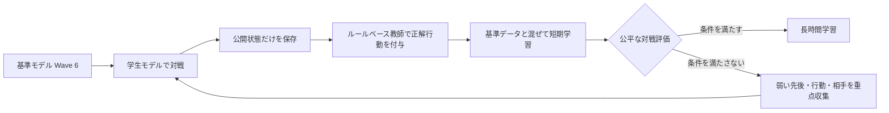
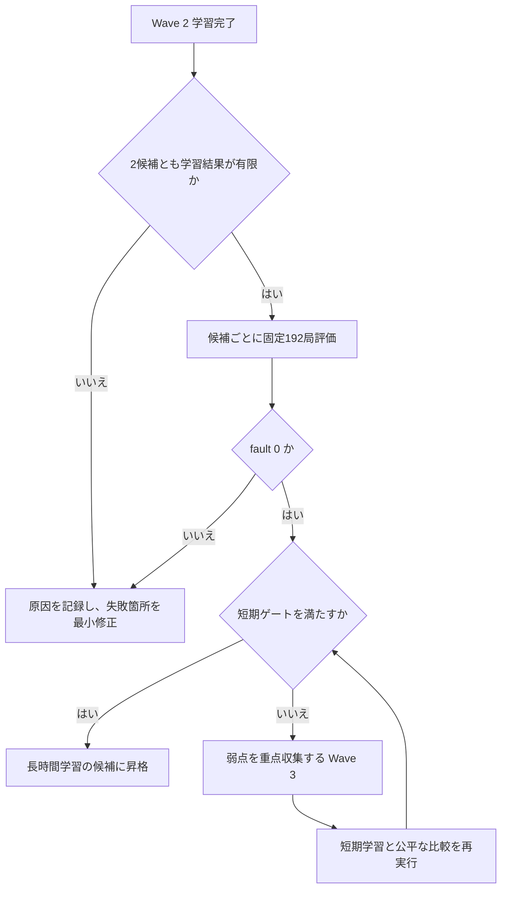

# Meta Specialist V4 性能改善計画

> 更新日: 2026-08-11
> この文書は、人間が現在の学習方針と次の判断を把握するための実行計画である。設計全体の正典は [MAGE PTCG v5 README](plan/MAGE_PTCG_v5_README.md)、日々の実行状態は [current status](status/current_status.md) と [handoff](status/handoff.md) を参照する。

## 1. 結論

現在は、同じ教師付き学習を長く続ける段階ではない。**学生モデルが実戦で実際に到達した公開状態を、既存のルールベース教師で再ラベルして学習する**段階である。

Wave 1 ではこの方法に正方向の結果が出たが、先後と乱数初期値により成績が揺れている。したがって、Wave 2 の短期学習と公平な比較評価を完了し、改善が再現できた候補だけを長時間学習へ進める。

> **実行停止（2026-08-11）**: Terra系の学習・評価はすべて停止済みである。Luna Max は外部 Codex CLI で `gpt-5.6-luna` / effort `max` を明示指定して起動できることを確認した。再開時はこの指定を固定し、リポジトリ既定の Terra へ暗黙に切り替えない。

この経路は提出やChampion変更を自動実行しない。提出候補へ進むには、別途の合法性・再現性・Promotion Gateを通す必要がある。

## 2. 目標と非目標

### 目標

ArchaludonデッキのV4ニューラル方策について、固定した6相手・両方の先後・複数の乱数初期値で、Wave 6より再現可能に強い候補を作る。最初の到達点は、長時間学習を開始してよいと根拠付きで判断できる状態である。

| 到達条件 | 意味 |
|---|---|
| ルール違反・クラッシュ・時間切れが0件 | 強さ以前に、評価結果を信用できる |
| 2つの学習初期値で基準を下回らない | 偶然の当たりだけを採用しない |
| 合計勝率が基準よりおおむね5ポイント以上高い | 小さすぎる差を長時間学習の根拠にしない |
| 先後のどちらも大きく悪化しない | 片側だけの改善を全体改善と誤認しない |
| 6相手中4相手以上で非劣化 | 特定の相手だけに過度適合しない |
| ゲーム終了・進化・攻撃の行動精度が悪化しない | 勝率だけでは見えない基本動作の崩れを防ぐ |

「おおむね5ポイント」「大きく悪化しない」は短期ゲートの実務基準であり、統計的な優位を保証する値ではない。最終候補では対戦数を増やして再確認する。

### 今は行わないこと

| 行わないこと | 理由 |
|---|---|
| 強化学習へ全面移行すること | 過去にV-trace系の更新は実戦成績を悪化させ、原因が未分離 |
| 探索を本体へ入れること | 現在の弱点は学習状態の分布ずれであり、探索の効果を測る土台が未完成 |
| モデルの層数・サイズを先に増やすこと | まずデータの質と評価の再現性を検証する方が速い |
| 1回の好成績だけで長時間学習や提出へ進むこと | seed・先後で成績差が大きく、誤採用の危険がある |

## 3. 現在の手法

実行時は、公開されたゲーム状態と合法手だけを入力にするリカレントニューラルネットワークが、各時点の行動を選ぶ。相手の手札・山札などの非公開情報は使用しない。

学習では、既存のルールベース方策を「正解を示す教師」として使う。ただし実行時にルールを直接適用する方式ではない。教師は、学生モデル自身が到達した状態にだけ正解ラベルを付ける。

| 用語 | この計画での意味 |
|---|---|
| 基準データ | 既に保存・検証された教師の対戦記録 |
| 追加データ | 学生モデルが対戦中に到達した公開状態の記録 |
| 再ラベル | 追加データの各状態で、教師が選ぶ行動を付けること |
| 短期学習 | 少量の追加データで、2つの学習初期値を比較する学習 |
| 公平な評価 | 同じデッキ、相手、先後、乱数初期値で候補と基準を比較する対戦 |

この方式の狙いは、教師の記録だけをまねた時に起きる「少し違う選択をした後の状態を学習していない」問題を減らすことである。

## 4. ここまでに得た事実

### 実装・検証済み

- 公開状態のみを保存し、型・ハッシュ・ゲーム単位のまとまりを検証する経路を実装した。
- ルールベース教師による再ラベル、基準データとの混合、V4チェックポイントからの再開可能な教師付き学習を実装した。
- DAgger画面・学習runnerの関連テスト62件（1件は環境依存skip）、`py_compile`、文書検証を通過している。
- 長時間実験の端末表示は、1本の更新式プログレスバーと原子的に更新される進捗JSONを使う。

### Wave 1 の実測

評価は、Archaludon、固定6相手、両方の先後、各候補192局、ルール違反等0件で行った。比較対象はWave 6の対応する学習初期値である。

| 指標 | 再ラベル学習 Wave 1 | Wave 6 | 差 |
|---|---:|---:|---:|
| 2候補合計 | 210 / 384（54.69%） | 192 / 384（50.00%） | +4.69ポイント |
| 先手側 | 116 / 192（60.42%） | 88 / 192（45.83%） | +14.58ポイント |
| 後手側 | 94 / 192（48.96%） | 104 / 192（54.17%） | -5.21ポイント |

**事実:** 合計では改善している。\
**判断:** 後手側が悪化しており、長時間学習を始める根拠としては不足する。\
**仮説:** 学生が到達する状態の学習は有効だが、現在の追加データ量または後手側の状態の被覆が不足している。\
**未測定:** 行動種類ごとの精度と、Wave 2で同じ傾向が再現するか。

## 5. 現在の作業（ユーザー指示で一時停止）

Wave 2は、Wave 1より多い追加対戦記録を使う短期学習である。旧画面収集は96局・4,904遷移・fault 0だったが、Wave1 retry checkpoint由来の旧 schema v1 である。現行の画面 schema v2 は主体 archetype、デッキ実体、デッキ bytes SHA を必須とするため、旧成果物は再利用せず、現行 checkpoint から再収集する。記録上限65,536件の再学習はユーザー指示により停止し、学習reportとseed別checkpointは性能根拠に使わない。

| 項目 | 状態 | 根拠 |
|---|---|---|
| 画面収集 | 完了 | 96局、50勝46敗、fault 0、4,904遷移 |
| Wave 2短期学習 | ユーザー指示で停止 | `bc-max65536.progress.json` は `status=interrupted` |
| 公平な192局比較 | 未実行 | 学習を再実行してreportが揃った後に候補2つを評価 |
| 行動種類別の診断 | runner接続済み・実測待ち | DAgger reportへcarry指標を保存し、短期ゲートで終了・進化・攻撃を必須検証 |

最初のWave 2学習は、記録上限32,768件では基準データだけで上限を超えるため停止した。これはモデルやデータの異常ではなく設定不足であり、上限65,536件に修正して再実行している。失敗した出力は候補の性能根拠に使用しない。

## 6. Wave 2完了後の判断手順

Wave 2の結果は、損失値ではなく対戦結果を中心に判定する。候補・基準・評価条件を揃えない比較は採用判断に使わない。

### 短期ゲート

| 観点 | 必須条件 | 判定の狙い |
|---|---|---|
| 実行の健全性 | fault 0、停止・例外なし | 結果を比較可能にする |
| 学習初期値 | 2候補とも対応するWave 6以上 | 片方だけの偶然を除く |
| 合計勝率 | 合計で約+5ポイント以上 | 改善の大きさを確認する |
| 先後 | どちらかが約-3ポイント超で悪化しない | 一方向の犠牲を防ぐ |
| 相手別 | 6相手中4以上で非劣化 | 相手ごとの崩れを見つける |
| 行動別 | report内のcarry指標が存在し、complete-action/root/STOPと終了・進化・攻撃の固定閾値を満たす。EVOLVE/ATTACK/ENDは各seed `0.60/0.60/0.50` 未満を拒否する | 基本判断の破綻を防ぐ |

ゲートを通っても「強いことが確定」したとは扱わない。長時間学習後に、より多い384〜768局の評価で再確認する。

## 7. 失敗した場合の次の一手

Wave 2が通らない場合、同じ設定を長く回すのではなく、評価で悪かった状態を増やす。まず後手、学生と教師の選択が異なる状態、終了・進化・攻撃の選択を重点対象にする。

| 優先順位 | 対策 | 成功を判定する指標 |
|---:|---|---|
| 1 | 後手の対戦を多めに収集する | 後手勝率の悪化が縮小する |
| 2 | 学生と教師が異なる状態を多めに再ラベルする | 行動種類別の一致率が改善する |
| 3 | 終了・進化・攻撃を重点的に含める | 当該行動の精度低下を止める |
| 4 | 192〜384局へ追加収集を増やす | 相手・先後の偏りを減らす |

このWave 3も短期学習と公平な比較で判定する。2回の重点収集を行っても実戦成績が改善しない場合に限り、入力表現の正規化、教師の意味的な目標、探索を使った教師の順で検討する。強化学習はその後の選択肢であり、最初の逃げ道にはしない。

## 8. 長時間学習へ進む条件と実施内容

短期ゲートを通った候補だけを、1,000〜1,500更新、2つの学習初期値で長時間学習する。各候補を同じ設定で比較し、途中経過だけで採用を決めない。

| 項目 | 実施内容 |
|---|---|
| 学習 | Wave 2またはWave 3で通過した設定を固定し、2初期値で実行 |
| 保存 | チェックポイント、設定、入力データのハッシュ、進捗JSONを保存 |
| 監視 | 端末は単一プログレスバー、非対話時は約10秒ごとの集計のみ |
| 途中評価 | 学習を止めない範囲で、固定評価の小さな確認を行う |
| 最終評価 | 固定6相手・両先後・384〜768局で基準と比較 |
| 採用 | fault 0、複数初期値、先後、相手別、行動別の全てを確認 |

長時間学習で短期改善が消えた場合は、その候補を採用しない。損失の低下だけで継続やChampion変更を決めない。

## 9. 記録と確認の場所

人が確認する入口は次の3つに絞る。

| 確認したいこと | 参照先 |
|---|---|
| 方針、判断基準、次の分岐 | この文書 |
| 今日の進行中ジョブと直近結果 | [current status](status/current_status.md) |
| 作業再開時のコマンド・注意事項 | [handoff](status/handoff.md) |

再現に必要な詳細なハッシュ、個別ログ、実装検証は `runs/` と `docs/evidence/` に残す。これらは監査用であり、日々の判断を読む入口とは分ける。

## 10. 運用上の不変条件

- 実行時の入力は公開情報と合法手だけに限定する。
- CABTの合法手判定を最終の事実とし、ルールや学習器は合法手を削らない。
- 比較実験では、デッキ、相手、先後、乱数初期値、対戦数を揃える。
- 未完了・例外・データハッシュ不一致は成功扱いにしない。
- Gitのcommit、push、Kaggle提出は明示指示があるまで行わない。

## 11. 今回の決定一覧

| 種類 | 内容 |
|---|---|
| 事実 | Wave 1は合計で+4.69ポイントだが、後手で-5.21ポイントだった |
| 判断 | Wave 1だけでは長時間学習を始めない |
| 停止 | Wave 2は記録上限65,536件で開始したが、ユーザー指示により途中停止した |
| 次の判断 | Wave 2を公平な192局比較と行動別診断で判定する |
| 仮説 | 学生が到達する状態を増やし、弱い相手・後手・EVOLVE/ATTACK/ENDを優先すれば先後差と基本行動の失敗を縮小できる |
| 未測定 | Wave 2の再現性、行動別精度、長時間学習後の性能 |
