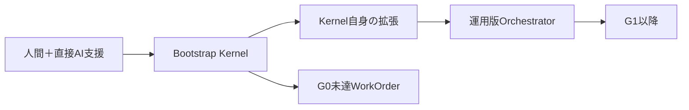

# MAGE-PTCG 多段階AIオーケストレーター実装計画 改訂版

## 1. 概要

本書はMAGE-PTCGのアルゴリズム、評価、提出仕様を定める正典ではありません。次の正典に従属し、複数AI workerへ安全に実装させるための運用仕様を定めます。

- [`design/00_overall_plan.md`](design/00_overall_plan.md)「開発ロードマップ」
- [`design/05_evaluation_submission_and_strategy_plan.md`](design/05_evaluation_submission_and_strategy_plan.md)「日付付きGate」
- [`implementation/00_overall_implementation_plan.md`](implementation/00_overall_implementation_plan.md)「実装順序」
- [`AGENTS.md`](AGENTS.md)

MAGE-PTCGの開発を、複数のAIモデルへ無秩序に分担させるのではなく、**決定論的なControl Planeが、専用AI workerを工程ごとに単発起動・監督する多段階オーケストレーションシステム**として実装します。

処理は次の5layerに分けます。

1. 受付・対象選択
2. 設計・方針策定
3. 実装・実験仕様化
4. 実装
5. 検証・統合・成果昇格判定

トップレベルにはPythonで実装した`ProgramOrchestrator`を置きます。`ProgramOrchestrator`自身はAIモデルではなく、状態遷移、Gate、risk、provider routing、承認、path制約、authoritative test、patch統合可否を決定論的に処理します。

Luna、Terra、Sol、Sonnet、Fable、Opus等のモデルは、Control Planeから別processとして起動される**非信頼worker**として扱います。高性能モデルは常駐しません。必要なstageで必要なcontextだけを受け取り、構造化結果を保存した時点でprocessを終了します。

完全版Orchestratorを人手で先に作りません。最初に自己ホスト可能な[`Bootstrap Kernel`](bootstrap_kernel_implementation_plan.md)を直接実装し、そのKernelへOrchestrator自身の残機能とMAGE本体を順次実装させます。

## 2. 基本運用方針

既定運用は次のとおりです。

- ローカルPython CLIとして実装する
- 状態遷移と権限制御はAIではなくPythonコードが行う
- 高性能モデルは常駐させず、各stageで単発起動する
- 最初は明示的TaskContractを入力できるBootstrap Kernelを作る
- Kernel完成後、Triage、Design、Specification、R2/R3 reviewをKernel自身へ追加する
- 設計変更時とコード統合・成果昇格時のみ人間承認を要求する
- 承認済み設計を再利用できる局所実装では、設計承認を省略可能とする
- 実装単位はpackage単位ではなく、Gate到達に必要な最小の縦切りとする
- 一度に開始するWorkOrderは原則1件とする
- commit、push、tag、Kaggle提出は自動化しない
- AI workerのテスト成功報告は信用せず、Control Planeがclean環境で再実行する
- provider障害、予算超過、不完全な検証を成功扱いしない

### 2.1 Bootstrap-firstと自己ホスト

実装順は次に固定します。



Bootstrap Kernelの最初の目標は、万能な多Agent基盤ではありません。明示的TaskContractから単一implementation workerを起動し、patchをclean worktreeで検証し、人間承認前に停止できることです。

### 2.2 スケジュール整合

正典上のG0期限は2026-07-13です。2026-07-12時点でBootstrap Kernelを先行する方針は、G0遅延リスクを意図的に受け入れる判断です。

| 段階 | 目安工数 | 適用開始 |
|---|---:|---|
| BK0 仕様固定 | 2〜4時間 | Orchestrator自身 |
| BK1 状態・snapshot・single provider | 4〜8時間 | Orchestrator自身 |
| BK2 worktree・clean verification・承認 | 4〜8時間 | Orchestrator自身、G0未達項目 |
| SH1 Triage/Design/Specification | 4〜8時間 | G0/G1 |
| SH2 R2/R3 review | 8〜16時間 | R2/R3 WorkOrder |
| Hardening/parallelism | 1〜3日相当 | G1以降、必要時 |

工数は既存コードとCLI capabilityに依存する概算です。Kernel完成前にG0を達成したことにはしません。期限を超過した場合は`planned_deadline`、`actual_completed_at`、`delay_reason`を`experiments/orchestration/`へ記録します。

R2/R3 review機構が未完成の期間は、人間レビューを`ManualReviewSubstitution`として必須にします。これは検証免除ではありません。

## 3. 全体アーキテクチャ

常駐するのはControl Planeだけです。AI workerはstage単位で起動・終了します。

```text
User / Project Skill / CLI
          │
          ▼
┌──────────────────────────────────┐
│ Deterministic Control Plane      │
│ ProgramOrchestrator              │
│                                  │
│ - Run State Machine              │
│ - Gate Resolver                  │
│ - Risk Classifier                │
│ - Approval Manager               │
│ - Workspace Snapshot Manager     │
│ - Provider Router                │
│ - Path / Command Policy          │
│ - Test Runner                    │
│ - Patch Integrator               │
│ - Artifact Registry              │
└───────────────┬──────────────────┘
                │
                ├─ Triage Agent
                ├─ Design Agent
                ├─ Specification Agent
                ├─ Implementation Agent
                └─ Review / Falsification Agent
```

AI workerは次を決定できない。

- Gateの前提条件を無視して次へ進むこと
- 自分自身のrisk levelを下げること
- 自分のallowed pathを増やすこと
- 受入条件を書き換えること
- protected testを変更すること
- 自分の出力を正式なテスト証跡とすること
- commit、push、提出を実行すること
- 自分自身または別のProgramOrchestratorを再帰的に起動すること

---

## 4. GateとGate Item

Bootstrap KernelはMAGE Gateとは別の基盤完成条件として管理します。Kernel完成後、MAGE Gateを`GateItem`単位でWorkOrder化します。

`target_gate`だけでは1回のWorkOrderが大きくなりすぎるため、Gate内部を`GateItem`へ分割する。

```text
target_gate: G0
target_gate_item: G0-C
```

G0は次のGate Itemへ分割する。

| Gate Item | 内容 |
|---|---|
| G0-A | Runtime Contract、capability probe、実行環境確認 |
| G0-B | SelectTypeおよび公開interfaceの契約テスト |
| G0-C | 必ず合法手を返すminimal Tier D agent |
| G0-D | logging、game trace、regression fixture |
| G0-E | Episode・replay ingestion smoke |
| G0-F | latency、cold start、package validation |
| G0-G | 人間によるKaggle提出と受理証跡の登録 |

GateResolverはGate台帳、Artifact Registry、テスト証跡、外部証跡を参照し、前提条件を満たした最初の未達Gate Itemを選ぶ。

AIは対象候補を提案できるが、最終的な選択はGateResolverが行う。

---

## 5. オーケストレーター構成

| Layer | コンポーネント | 主モデル | 主な役割 | 停止条件 |
|---|---|---|---|---|
| Control | ProgramOrchestrator | AI不使用 | 状態、権限、Gate、provider、test、patchを制御 | DONE、BLOCKED、ABORTED |
| L0 | Triage Agent | Luna `high`、曖昧時Terra `high` | 要求解釈、WorkOrder案、risk flag候補 | WorkOrder候補を返す |
| L1 | Design Agent | Sol `high`、R3は`xhigh` | 正典適用、設計変更、反証、評価方針 | 設計再利用または承認待ち |
| L2 | Specification Agent | Terra `high` | Task DAG、実装契約、テストoracle、担当path | TaskContract確定 |
| L3 | Implementation Agent | Terra `high`、小変更はLuna `high` | 隔離環境で実装 | patchと実装報告を返す |
| L4-A | Deterministic Verifier | AI不使用 | test、lint、schema、path、diff検証 | passed、revise、blocked |
| L4-B | Independent Reviewer | Sonnet 5 `high`等 | R2以上の独立監査 | passed、revise、disputed |
| L4-C | Theory/Falsification Review | Sol/Fable系 | R3の理論確認と反証 | passed、revise、disputed |

### L1の実行モード

L1は次の2種類に分ける。

#### DESIGN_REUSE

既に承認済みの正典や設計判断を、そのまま今回のGate Itemへ適用するmodeです。Design Agentの自己申告ではなく、Control Planeが決定論的条件で候補判定します。

事前条件：

- 公開interfaceを変更する予定がない
- 受入条件を変更しない
- algorithmic assumptionを変更しない
- 依存関係を追加しない
- protected pathを変更しない
- 承認済みdesign digestが一致する
- TaskContractのallowed pathがR2/R3保護集合へ新たに触れない

L4-Aはpatch生成後に次を再検査します。

- public symbol/interface差分が0
- schema差分が0
- dependency manifest/lock差分が0
- protected pathが不変
- approved design digestとacceptance digestが一致
- 実変更pathがTaskContractとrisk分類に一致

違反時はpatchを統合せず、`DESIGN_CHANGE_REQUIRED`へ強制昇格します。そのrunが再利用したApprovalRecord、TaskContract、Integration Approvalを無効化し、設計承認を取り直します。元の正典そのものは自動的に無効化しません。

#### DESIGN_CHANGE

新しい設計判断または既存設計の変更を伴う。

次の場合は必須とする。

- 公開interfaceの変更
- Runtime Contractの変更
- Gate合格条件の変更
- テストoracleの変更
- solver、評価法、探索法の意味的変更
- 新しい依存の追加
- security policyの緩和
- Kaggle提出物の意味的変更

この場合は人間の設計承認で停止する。

---

## 6. Risk Level

Risk levelはAIの自己申告ではなく、`risk_flags`、予定path、実patch、interface差分からControl Planeが決定します。判定は一度で終わらず、次の4checkpointで再実行します。

1. **INTAKE**：要求、Gate Item、正典から初期riskを決定
2. **SPECIFICATION**：`allowed_paths`とR2/R3 path集合の交差、verification内容から再分類
3. **PATCH**：実際の変更pathとdiff内容から再分類
4. **VERIFICATION**：public symbol、schema、dependency、oracle、protected path差分から最終分類

\[
R_{final}=\max(R_{intake},R_{spec},R_{patch},R_{verification})
\]

riskの引き下げは禁止します。AI workerは引き上げ提案だけできます。

| Risk | 例 | 必須検証 |
|---|---|---|
| R0 | status、dry-run、文書参照、状態表示 | schema、静的検証 |
| R1 | 局所実装、契約非変更、単一module修正 | deterministic tests |
| R2 | 公開interface、評価系、統合処理、依存追加、Control Plane | deterministic＋独立監査 |
| R3 | solver数式、合法手保証、提出API、評価oracle、情報漏洩、安全な退化 | deterministic＋理論監査＋独立反証 |

次の変更は最低R2です。

- `scripts/orchestration/`のControl Plane本体
- public schema/interface
- test oracle
- evaluation logic
- packaging
- dependency changes
- provider policy
- approval logic

次の変更は最低R3です。

- canonical solver
- public belief、re-solving
- action abstractionの意味変更
- legality/fallback
- submission API
- exploitabilityや評価指標
- secret handling、information leakage
- Kaggle runtime制約の解釈変更

R1で開始したrunのpatchがR3 pathへ触れた場合、patchとworktreeを保持したままintegrationを停止し、R3へescalateします。必要なreview機構がなければ`blocked`、暫定規定を使う場合は`ManualReviewSubstitution`を要求します。

## 7. CLI

入口は`scripts/orchestrate.py`とする。

```bash
python scripts/orchestrate.py start --request "実装を開始して"
python scripts/orchestrate.py start --request "G0-Cを実装して"
python scripts/orchestrate.py start --contract task_contract.json
python scripts/orchestrate.py status
python scripts/orchestrate.py status RUN_ID
python scripts/orchestrate.py approve RUN_ID design
python scripts/orchestrate.py approve RUN_ID integration
python scripts/orchestrate.py approve RUN_ID promotion
python scripts/orchestrate.py reject RUN_ID design --reason "..."
python scripts/orchestrate.py resume RUN_ID
python scripts/orchestrate.py abort RUN_ID
python scripts/orchestrate.py snapshot create
python scripts/orchestrate.py snapshot status
python scripts/orchestrate.py evidence add RUN_ID --type kaggle_submission
python scripts/orchestrate.py doctor
```

### start

`start --contract`はBootstrap Kernelの最初の入口です。自然言語Triage未実装でも明示的TaskContractから実装を開始できます。

`start --request`はSelf-hosted Expansion後に次を行います。

1. preflight
2. workspace snapshot作成
3. Gate台帳読込
4. 次の未達Gate Itemを解決
5. Triage Agent起動
6. WorkOrder候補検証
7. risk level決定
8. DESIGN_REUSEまたはDESIGN_CHANGEへ遷移
9. 1件のWorkOrderだけを開始

広い要求を受けても、プロジェクト全体を一括実装しない。

### doctor

`doctor`は次を確認する。

- Python version
- Git状態
- provider CLIの存在
- model profileの有効性
- effort support
- sandbox support
- CLI version
- config schema
- fallback循環
- path policy
- run directory書込み可否
- 必要な秘密情報が環境へ露出していないか

---

## 8. ディレクトリ構成

```text
scripts/
├── orchestrate.py
└── orchestration/
    ├── kernel.py
    ├── control_plane.py
    ├── state_machine.py
    ├── gate_resolver.py
    ├── risk_classifier.py
    ├── approvals.py
    ├── workspace.py
    ├── path_policy.py
    ├── command_policy.py
    ├── process_runner.py
    ├── test_runner.py
    ├── patch_integrator.py
    ├── artifact_registry.py
    ├── schemas/
    └── providers/
        ├── base.py
        ├── fake.py
        ├── codex.py
        └── claude.py

configs/
├── orchestration.toml
├── gates.toml
└── model_profiles.toml

.agents/
└── skills/
    └── mage-orchestrator/

experiments/
└── orchestration/

.orchestrator/
├── snapshots/
├── locks/
├── registry/
└── runs/
```

初期MVPでは標準ライブラリの`tomllib`を用いるため、設定ファイルはYAMLではなくTOMLを既定とする。

外部ライブラリを導入する場合は、依存追加をR2以上の設計変更として扱う。

---

## 9. Workspace Snapshot

`HEAD SHA`やhashだけでは未commit差分を再現できないため、各run開始時にsnapshotの実体を保存します。

```text
.orchestrator/snapshots/<snapshot_id>/
├── manifest.json
├── tracked.patch
├── untracked_manifest.json
├── untracked/
├── canonical_hashes.json
└── config/
```

`WorkspaceSnapshot`は次を持ちます。

```text
WorkspaceSnapshot
  snapshot_id
  head_commit
  tracked_patch_ref
  tracked_diff_hash
  untracked_manifest_ref
  untracked_manifest_hash
  canonical_document_hashes
  config_hash
  environment_lock_hash
  included_paths
  excluded_paths
  non_reproducible_entries
  created_at
```

- tracked差分はbinary対応patchとして保存する
- untracked fileは`included_paths`、size上限、secret除外を通した内容を保存する
- 巨大file、dataset、model weight、secret候補は無条件にcopyしない
- 内容を保存できないfileはpath、size、hash、再現不能理由をmanifestへ記録する

「承認済み差分」という曖昧な語は使いません。worker worktreeへ適用するのは、run開始時にControl Planeがcaptured baselineとして保存した差分です。baseline自体を人間が確定する必要がある運用では、別のsnapshot approvalを記録します。

worker用worktreeは次の手順で作成します。

1. `head_commit`から隔離worktreeを作る
2. captured baselineの`tracked.patch`と対象untracked内容を再現する
3. read-only contextを配置する
4. TaskContractのallowed pathだけを編集対象にする
5. run開始時の対象path hashを保存する

patch統合前に、root workspaceの対象pathがrun開始後に変化していないか再確認します。変化していれば`source_changed`としてblockedにします。

## 10. 主要Schema

### WorkOrder

```text
WorkOrder
  run_id
  work_order_version
  request
  target_gate
  target_gate_item
  planning_scope
  risk_level
  risk_flags
  workspace_snapshot_id
  source_revision
  context_hash
  design_mode
  deliverables
  acceptance_draft
  acceptance_conditions
  acceptance_digest
  acceptance_state: draft | frozen | superseded
  forbidden_actions
  external_actions
```

`depth`はriskと意味が重なるため削除します。広さが必要な場合は`planning_scope: local | cross_module | project_wide`を使用します。


### TaskContract

```text
TaskContract
  task_id
  role
  base_snapshot_id
  dependencies
  read_paths
  allowed_paths
  forbidden_paths
  protected_paths
  inputs
  expected_outputs
  verification_commands
  acceptance_digest
  command_policy
  network_policy
  environment_allowlist
  resource_budget
  mutation_permission
```

### StageResult

```text
StageResult
  stage
  status: passed | revise | blocked | disputed
  artifacts
  reported_evidence
  authoritative_evidence
  findings
  unresolved_items
  model_provenance
  patch_ref
```

### ApprovalRecord

```text
ApprovalRecord
  approval_id
  run_id
  approval_type
  subject_digest
  approver
  decision
  comment
  created_at
```

`subject_digest`が変わった場合、その承認は自動的に無効とする。

### ExternalActionRequest

```text
ExternalActionRequest
  action_id
  run_id
  action_type
  artifact_ref
  instructions
  required_evidence
  status: pending | completed | rejected
  evidence_ref
```

Kaggle提出は`ExternalActionRequest`として扱う。

### ProviderInvocation

```text
ProviderInvocation
  invocation_id
  run_id
  stage
  provider
  model_alias
  exact_model_id
  effort
  cli_version
  prompt_hash
  input_context_hash
  input_bytes
  input_file_count
  started_at
  ended_at
  exit_code
  timeout
  retry_of
  input_tokens: int | null
  output_tokens: int | null
  cached_input_tokens: int | null
  reasoning_tokens: int | null
  total_tokens: int | null
  usage_source: provider_reported | cli_reported | estimated | unavailable
  usage_estimated: bool
  stdout_ref
  stderr_ref
```

provider/CLIがtoken数を返さない場合は`null`とし、架空の確定値を作りません。token取得不能時も、context byte数、file数、model call回数、wall timeを保存します。


## 11. 受入条件と承認のライフサイクル

受入条件は次の順で確定します。

```text
L0:
  acceptance_draftを作成
  state = draft

L1:
  draftを正典と照合
  acceptance_conditionsを確定

Design Approval:
  canonical JSONをhash化
  acceptance_digestを生成
  state = frozen

L2以降:
  read-only
```

```text
acceptance_digest = SHA256(canonical_json(acceptance_conditions))
```

L2、L3、L4は次を禁止されます。

- 受入条件の削除・緩和
- Gate合格基準の変更
- test oracleの書換え
- protected testの変更

追加testや、より厳しい補助条件の提案は許可します。

DESIGN_CHANGEで受入条件が変わる場合は、次をatomicに行います。

1. `work_order_version`を増やす
2. 旧acceptanceを`superseded`にする
3. 旧TaskContractを無効化する
4. design/integration/promotion approvalを無効化する
5. 新しいdigestで承認を取り直す

patchだけが変わった場合も、そのpatch subject digestに紐づくIntegration Approvalは無効になります。

## 12. 状態機械

Bootstrap Kernelでは、まず次の最小状態を実装します。

```text
INTAKE
  → IMPLEMENTATION
  → VERIFICATION_DETERMINISTIC
  → WAITING_INTEGRATION_APPROVAL
  → APPLIED
  → DONE
```

Self-hosted Expansion後はguard付きで次へ拡張します。

```text
INTAKE
  → DESIGN
    ├─ DESIGN_REUSE
    │    → SPECIFICATION
    └─ DESIGN_CHANGE
         → WAITING_DESIGN_APPROVAL
              ├─ approved → SPECIFICATION
              ├─ revise → DESIGN
              └─ rejected → REJECTED
  → SPECIFICATION
  → IMPLEMENTATION
  → VERIFICATION_DETERMINISTIC
    ├─ failed → IMPLEMENTATION
    ├─ R0/R1 passed → WAITING_INTEGRATION_APPROVAL
    └─ R2/R3 passed → VERIFICATION_REVIEW
  → VERIFICATION_REVIEW
    ├─ passed → WAITING_INTEGRATION_APPROVAL
    ├─ implementation issue → IMPLEMENTATION
    ├─ specification issue → SPECIFICATION
    ├─ design issue → DESIGN
    └─ disagreement → DISPUTED
  → WAITING_INTEGRATION_APPROVAL
  → APPLIED
    ├─ external action required → MANUAL_ACTION_REQUIRED
    ├─ Artifact promotion required → WAITING_PROMOTION_APPROVAL
    └─ otherwise → DONE
```

`MANUAL_ACTION_REQUIRED`の外部証跡が登録された後は`EXTERNAL_EVIDENCE_VALIDATION`へ進み、package hash等が一致した場合だけ次へ進みます。

追加状態：

```text
BLOCKED
REJECTED
DISPUTED
ABORTED
MANUAL_ACTION_REQUIRED
EXTERNAL_EVIDENCE_VALIDATION
DESIGN_CHANGE_REQUIRED
```

### 主な戻り先

- 設計不足 → DESIGN
- 実装仕様不足 → SPECIFICATION
- コード不良 → IMPLEMENTATION
- test oracle不整合 → DESIGN
- DESIGN_REUSE違反 → DESIGN_CHANGE_REQUIRED → DESIGN
- reviewer間不一致 → DISPUTED
- provider障害 → BLOCKED
- Kaggle提出待ち → MANUAL_ACTION_REQUIRED

`REJECTED`からは自動復帰しません。人間が`revise`を明示した場合のみ、拒否stageに対応するDESIGN、SPECIFICATION、IMPLEMENTATIONへ戻します。そうでなければABORTEDとします。

### blocked reason

```text
provider_unavailable
budget_exceeded
source_changed
manual_action_required
schema_failure
sandbox_violation
patch_conflict
external_evidence_missing
timeout
resource_limit
review_capability_missing
```

### Revision上限

同一stageでの自動修正は原則2回までとします。上限超過時は上位stage、risk引上げ、人間確認、またはblockedへ移します。モデルを上位モデルへ変更するだけのblind retryは禁止します。

## 13. 出力形式とSchema検証

全AI workerの制御出力はJSON Schemaで検証する。

検証順序は次のとおりとする。

1. stdoutからJSON部分を決定論的に抽出
2. markdown fence等の安全な除去
3. schema validation
4. 安全に修正できる構文エラーのみ決定論的に修復
5. 再validation
6. 失敗した場合、同一profileで形式修復を1回だけ実施
7. 再失敗時はblocked

モデルによる形式修復では、内容の追加や変更を禁止する。

raw出力と修復後出力は両方保存する。

patchそのものはJSON文字列として返させず、worktreeの実diffからControl Planeが生成する。

AI出力はpatchへの参照のみ持つ。

---

## 14. 実装環境と安全設計

### 14.1 設計・監査worker

- read-onlyで起動する
- repositoryはread-only mountを基本とする
- networkは原則無効
- provider認証以外の秘密情報を渡さない
- root workspaceを編集できない

### 14.2 実装worker

- 隔離worktreeで起動する
- TaskContractのallowed pathだけを編集対象とする
- 同じファイルを複数workerへ同時割当しない
- protected pathの変更を拒否する
- symlink escapeを検査する
- realpathでallowed path内か確認する
- child markerを渡して再帰起動を防ぐ
- process group単位でtimeout終了する
- stdout、stderr、生成ファイル容量へ上限を設ける
- 環境変数はallowlist方式で渡す
- `shell=True`を使用しない
- コマンドはargv配列で実行する

### 14.3 worktreeの位置付けとBootstrap Kernelの安全範囲

worktreeは変更隔離と差分管理の仕組みであり、完全なsecurity boundaryではありません。

Bootstrap KernelはBK0〜BK2と定義し、最低限次を含みます。

- allowed path検査
- protected path検査
- symlink escape検査
- pre/post diff
- environment allowlist
- process group timeout
- command denylist
- root workspace非編集
- child orchestrator marker
- clean verification worktree

完全なcontainer sandbox、network namespace、CPU/GPU/memory quota、並列worker、secret brokerは後続のHardeningで強化します。これらをKernelの自己ホスト開始条件にはしません。


## 15. Command Policy

次の操作は常に禁止する。

- `git commit`
- `git push`
- `git tag`
- Kaggle submission APIまたはCLIによる提出
- secret取得・表示
- provider認証情報以外の秘密情報利用
- root worktreeの直接編集
- ProgramOrchestratorの再帰起動
- background daemonの残留
- protected testの削除・変更
- approval fileの直接変更

依存追加は既定で禁止する。

必要な場合は、R2以上の`dependency_change`として設計承認を要求する。

---

## 16. Authoritative Verification

AI workerが返したtest結果は`reported_evidence`として保存しますが、正式な合格判定には使いません。

正式な検証はworker worktreeではなく、snapshotから新しく作成したclean verification worktreeで実行します。

```text
WorkspaceSnapshot baseline
  + Control Planeがcaptured patch
  → clean verification worktree
  → protected hash確認
  → verification_commands
  → authoritative_evidence
```

worker環境から引き継ぐのはControl Planeが生成したpatchと、TaskContractで明示的に許可されたArtifactだけです。workerのvirtualenv、cache、shell state、`.env`、非patch一時file、任意の補助scriptは引き継ぎません。

保存対象：

- command/argv
- working directory
- environment digest
- snapshot/patch digest
- exit code
- stdout/stderr
- started_at/ended_at/duration
- timeout
- test count/failure count

authoritative testが失敗した場合、workerが成功を報告していてもpassedにしません。

## 17. 検証ルール

### R0

- schema validation
- config validation
- static checks
- dry-run

### R1

- deterministic test
- lint
- type check
- path policy
- patch inspection

AI reviewerは既定では使用しない。

### R2

- R1の全検証
- 独立レビュー
- public interface差分確認
- acceptance digest確認
- regression impact確認

### R3

- R2の全検証
- Sol `xhigh`による理論監査
- Fable 5 `xhigh`による独立反証
- 独立contextによる評価
- reviewer間の不一致確認

reviewer間で結論が割れた場合は`DISPUTED`へ移し、自動昇格しない。

---

## 18. Independent Reviewの独立性

独立reviewerには、実装workerの自己評価や最終結論をそのまま渡さない。

渡す情報は次に限定する。

- 承認済み設計
- TaskContract
- raw patch
- authoritative test結果
- 関連する正典
- acceptance conditions

独立性の条件は次のとおりとする。

- 実装workerと異なるmodel familyを優先する
- 別プロセス、別contextで起動する
- implementerのchainや自己評価を共有しない
- reviewer同士の結論を事前共有しない
- raw成果物から直接判定する

---

## 19. Model ProfileとRouting

実装コードはLuna、Terra等のaliasへ依存し、providerの実model IDを直接埋め込みません。

```toml
[profiles.implementation_large]
provider = "codex"
model_alias = "terra"
model_id = "actual-model-id"
effort = "high"
```

fallbackをmodel同士の循環graphとして定義しません。`(role, risk)`ごとの順序付き候補listと、末尾の停止動作で定義します。

```toml
[routing.triage.R1]
profiles = ["luna_high", "terra_high"]
on_exhausted = "blocked"

[routing.specification.R1]
profiles = ["terra_high", "luna_high", "sol_high"]
on_exhausted = "blocked"

[routing.implementation.R1]
profiles = ["luna_high", "terra_high", "sol_high"]
on_exhausted = "blocked"

[routing.implementation.R2]
profiles = ["terra_high", "sol_high"]
on_exhausted = "blocked"

[routing.design.R2]
profiles = ["sol_high", "terra_high"]
on_exhausted = "blocked"

[routing.design.R3]
profiles = ["sol_xhigh"]
on_exhausted = "blocked"

[routing.independent_review.R2]
profiles = ["sonnet5_high", "fable5_high", "opus48_xhigh"]
on_exhausted = "manual_review_required"

[routing.falsification.R3]
profiles = ["fable5_xhigh", "opus48_xhigh"]
on_exhausted = "blocked"
```

Control Planeは各listを先頭から一方向に試し、同じprofileを同一routing内で再訪しません。設定load時に重複、循環相当の参照、存在しないprofileを拒否します。

provider adapterは起動前に次をprobeします。

- model利用可否
- effort対応
- structured output対応
- sandbox/read-only対応
- CLI version
- timeout時の終了方法
- token usage取得可否

R2 review候補を使い切った場合は自動合格せず、`ManualReviewSubstitution`を要求します。R3の必須理論監査または反証候補を使い切った場合はblockedとします。

## 20. Code IntegrationとArtifact Promotion

「昇格」という語を次の2種類へ分ける。

### Integration Approval

検証済みpatchを、承認済みworkspace baselineへ適用する承認。

対象はコード、設定、テスト、文書変更。

### Artifact Promotion Approval

Agent、model、deck、submission candidate等を、MAGE-PTCGのArtifact Registry上で`candidate`から`verified`または`promoted`へ昇格する承認。

コード統合に成功してもArtifact Promotionが自動的に行われるわけではない。

---

## 21. Kaggle提出と外部行為

Kaggle提出は自動化しない。

G0-Gでは次の流れとする。

```text
local verification passed
  → MANUAL_ACTION_REQUIRED
  → 人間がKaggleへ提出
  → submission evidenceを登録
  → external evidence validation
  → Gate Item passed
```

必要な証跡の例：

- submission ID
- 提出日時
- package hash
- public/private validation status
- runtime errorの有無
- scoreまたは受理ログ

`approve promotion`だけではG0-Gをpassedにしない。

必要な外部証跡が揃った場合のみGateResolverが合格と判定する。

---

## 22. 永続状態と証跡Bridge

実行中のraw状態はGit管理外の`.orchestrator/runs/<run_id>/`へ保存します。

```text
.orchestrator/runs/<run_id>/
├── manifest.json
├── events.jsonl
├── state.json
├── approvals/
├── invocations/
├── artifacts/
├── evidence/
├── patches/
└── logs/
```

`events.jsonl`をappend-onlyの正典logとし、`state.json`は再構築可能なmaterialized viewとします。書込みはtemporary file、`fsync`、`os.replace()`を使い、run lockで同時resumeを拒否します。

`.orchestrator/`だけに重要な判断を残しません。次は`experiments/orchestration/<run_id>/`へ永続化します。

```text
experiments/orchestration/<run_id>/
├── record.json
├── decision.md
├── metrics.json
├── external_evidence.json
└── artifact_refs.json
```

Bridge対象：

- Integration/Promotionの採否
- ManualReviewSubstitution
- Kaggle submission IDとpackage hash
- Gateのplanned/actual日時
- token/model call summary
-主要metric
- raw evidenceのdigestと参照先

secret、巨大stdout、temporary fileはGit管理側へcopyしません。

## 23. Fake Provider

実モデル接続前にfake providerで全状態遷移を試験する。

fake providerは次のscenarioを持つ。

```text
valid
malformed_json
schema_mismatch
timeout
nonzero_exit
partial_write
forbidden_write
recursive_start
child_process_leak
review_disagreement
provider_unavailable
```

固定JSONを返すだけでなく、ファイル変更、timeout、異常終了、部分出力も再現できるようにする。

---

## 24. 必須テスト

### 基本フロー

- 「実装開始して」からG0-Aまたは最初の未達Gate Itemが選択される
- 一度に1件のWorkOrderだけが開始される
- DESIGN_CHANGEの場合、設計承認で停止する
- DESIGN_REUSEの場合、承認済みdesign hashを再利用できる
- 承認後、同じrunからresumeできる
- abort後にworkerが残らない

### Model routing

- Luna/Terraが`high`で起動される
- R3がSol `xhigh`とFable 5 `xhigh`へ振り分けられる
- model unavailable時にrole/risk別routing listの次候補へ一方向に遷移する
- routing listの重複・不正参照を拒否する
- R3で必要なmodelが不足した場合blockedになる

### Schema

- schema不正出力を決定論的修復する
- モデルによる形式修復は1回だけ
- 修復後に内容が追加された場合拒否する
- raw出力と修復後出力を保存する

### Workspace

- dirty pathとallowed pathが重なる場合に実装を開始しない
- tracked.patchとuntracked内容からsnapshot差分をworker worktreeへ再現できる
- rootの対象pathがrun中に変化した場合統合しない
- symlink経由のpath escapeを拒否する
- 異なるworktreeから同一ファイルを統合しない
- 同一runの同時resumeを拒否する

### Protected conditions

- DESIGN_REUSE申告のpatchがpublic interfaceを変更したら統合拒否しDESIGN_CHANGEへ昇格する
- R1 runのpatchがR3 pathへ触れたらriskを引き上げ、review不能ならblockedにする
- reviewerがテストoracleを書き換えられない
- implementation workerが受入条件を変更できない
- approval後にsubject digestが変わると承認が無効になる
- protected test変更を拒否する

### Commands

- commit、push、tagを拒否する
- Kaggle提出コマンドを拒否する
- ProgramOrchestratorの再帰起動を拒否する
- child processをtimeout時に終了する
- provider認証以外の秘密情報をworkerへ渡さない

### Verification

- workerが成功を報告してもclean verification worktreeのauthoritative test失敗時はpassedにしない
- R1ではdeterministic verificationのみで通る
- R2では独立監査が必須になる
- reviewer不一致時にDISPUTEDへ入る
- revision上限超過時に人間または上位stageへ送る

### External action

- Kaggle提出証跡なしではG0-Gをpassedにしない
- package hashと提出artifactが一致しない場合拒否する
- 手動証跡登録後にGateResolverが再評価する
- 重要な採用判断と提出証跡が`experiments/orchestration/`へbridgeされる
- token usage取得不能時にnullが保存される

### Crash recovery

- state書込み途中のprocess killから復旧できる
- events.jsonlからstate.jsonを再構築できる
- provider timeout後に同じstageからresumeできる
- partial patchをrootへ適用しない

---

## 25. 実装順序

### Phase BK0：Bootstrap仕様固定

目安工数：2〜4時間。

1. `RunManifest`、`TaskContract`、`StageResult`
2. 最小状態機械
3. command/path/approval policy
4. single-provider invocation contract
5. explicit `start --contract`

### Phase BK1：状態・Snapshot・Provider

目安工数：4〜8時間。

1. `events.jsonl`と`state.json`
2. run lock
3. WorkspaceSnapshot実体保存
4. fake provider
5. 実provider 1種類
6. 単一implementation worker
7. `status/resume/abort/doctor`

### Phase BK2：隔離実装・Clean Verification

目安工数：4〜8時間。

1. worker worktree
2. allowed/protected path
3. symlink escape
4. patch capture
5. clean verification worktree
6. authoritative verification
7. Integration Approval
8. crash recovery

BK0〜BK2をBootstrap Kernelと定義します。Kernel自身のR1機能追加を1件、Kernel経由で完了できた時点で自己ホスト開始です。

### Phase SH1：Kernel自身の拡張

目安工数：4〜8時間。

1. Triage Agent
2. WorkOrder生成
3. DESIGN_REUSE / DESIGN_CHANGE
4. Design Approval
5. Specification Agent
6. acceptance draft/frozen/superseded
7. risk 4checkpoint再分類
8. DESIGN_REUSE事後検証
9. token/model call記録

### Phase SH2：Advanced ReviewとRouting

目安工数：8〜16時間。

1. role/risk別routing
2. provider capability matrix
3. R2 independent review
4. R3 theory/falsification
5. reviewer disagreement
6. ManualReviewSubstitution
7. Artifact Registry/evidence bridge
8. Codex/Claude read-only smoke

### Phase MAGE：G0以降

Bootstrap Kernel完成後、G0未達Gate Itemを最初のMAGE WorkOrderとして投入します。

1. G0-A Runtime Contract/capability
2. G0-B public interface/SelectType
3. G0-C minimal legal agent
4. G0-D logging/fixture
5. G0-E Episode/replay ingestion
6. G0-F latency/package
7. G0-G manual submission evidence

R2/R3 AI reviewが未完成なら、該当項目に`ManualReviewSubstitution`を要求します。

### Phase Hardening

G0の前提にはしません。

- container/network sandbox強化
- resource quota
- worker並列化
- distributed/path lock
- secret broker
- project skill host adapter

`.agents/skills/`が自動読込されるとは仮定せず、`.claude/`、`.codex/`を含むhost capabilityを実機確認します。

## 26. 初期実装対象

最初に直接実装する対象はBootstrap Kernelの1本の縦切りです。

```text
RunManifest
TaskContract
events.jsonl
state.json
run lock
WorkspaceSnapshot実体保存
fake provider
実provider 1種類
single implementation worker
worker worktree
patch capture
clean verification worktree
authoritative verification
Integration Approval
start --contract / status / resume / abort / doctor
```

最初のend-to-end smoke：

```text
explicit TaskContract
  → INTAKE
  → IMPLEMENTATION
  → VERIFICATION_DETERMINISTIC
  → WAITING_INTEGRATION_APPROVAL
  → APPLIED
  → DONE
```

次に、Kernel自身の小規模R1機能追加をKernel経由で実装します。これが自己ホスト成立の最初の証拠です。

初期版では並列worker、全provider fallback、R3二重AI監査、完全container sandbox、自動Artifact Promotion、project skillを後回しにします。

## 27. 完了条件

### 27.1 Bootstrap Kernel

- `start --contract/status/resume/abort/doctor`が動作する
- WorkspaceSnapshotを内容込みで再現できる
- fake providerと実provider 1種類を起動できる
- allowed path外とprotected path変更を検出できる
- patchをworker環境とは別のclean worktreeで検証できる
- authoritative test失敗を成功扱いしない
- 人間承認前にrootへpatchを適用しない
- crash後にrunをresumeできる
- commit、push、tag、Kaggle提出を拒否できる
- Kernel自身のR1機能追加を1件Kernel経由で完了できる

### 27.2 運用版Orchestrator

- 自然言語要求から最小WorkOrderを1件生成できる
- DESIGN_REUSEをpatch後に再検査できる
- riskをINTAKE/L2/L3/L4-Aで引き上げられる
- R2/R3を必要なreviewへroutingできる
- model/token/model-call provenanceを保存できる
-重要証跡を`experiments/orchestration/`へbridgeできる
- G0のGate Itemを1件処理できる

G0全体はG0-A〜G0-Gが合格し、Kaggle提出受理証跡が登録された場合だけpassedです。

## 28. 最終方針

本システムでは、AIモデルを自律的な管理者として扱いません。何を実行するか、どのモデルを呼ぶか、どこを編集できるか、何をもって合格とするか、patchを統合するかは決定論的Control Planeが保持します。

一方、完全版Control Planeを人手で作り切ることも目標にしません。

> **人間が最小のBootstrap Kernelを作り、そのKernelへOrchestrator自身とMAGE-PTCG本体を段階的に実装させます。**

この自己ホスト方式により、初期投資後の設計、実装、検証、レビューの手動オーケストレーションを削減します。ただし、正典の不足、test oracleの弱さ、provider障害、Kaggle実環境の未知要因は自動化だけでは解消しません。

最初の完成地点は、万能な多Agent基盤ではなく、**1件の明示的TaskContractを安全に実装・clean検証・人間統合し、次に自分自身の機能を1件追加できるBootstrap Kernel**です。

