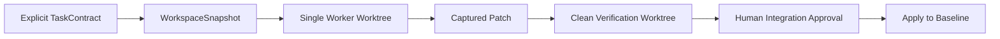

# MAGE-PTCG Bootstrap Kernel 実装計画

## 1. 文書の位置付け

本書は[`ai_orchestrator_implementation_plan.md`](ai_orchestrator_implementation_plan.md)の初期実装部分を、直接コードへ落とせる単位へ分離した実装仕様です。MAGEのアルゴリズム正典ではなく、`design/`と`implementation/`に従属します。

## 2. 目的

MAGE本体と完全版Orchestratorを実装できる、最小の自己ホスト可能なControl Planeを先に完成させます。

完成条件は「多Agentが全部動くこと」ではありません。

> 明示的TaskContractから単一workerを隔離起動し、patchをclean worktreeでauthoritative verificationし、人間承認後にだけ統合できること。

## 3. 非目標

初期Kernelでは次を実装しません。

- 自然言語Triage
- 高度なDesign Agent
- 並列worker
- 全provider fallback
- R2/R3二重AI監査
- 自動commit、push、tag
- 自動Kaggle提出
- 完全container sandbox
- dashboard
- project skillの自動読込

## 4. 最小フロー



## 5. CLI

```bash
python scripts/orchestrate.py start --contract task_contract.json
python scripts/orchestrate.py status [RUN_ID]
python scripts/orchestrate.py resume RUN_ID
python scripts/orchestrate.py approve RUN_ID integration
python scripts/orchestrate.py reject RUN_ID integration --reason "..."
python scripts/orchestrate.py abort RUN_ID
python scripts/orchestrate.py doctor
```

`start --request`はTriage実装後に追加します。

## 6. Directory

```text
scripts/
├── orchestrate.py
└── orchestration/
    ├── kernel.py
    ├── state.py
    ├── events.py
    ├── schemas.py
    ├── snapshot.py
    ├── worktree.py
    ├── provider.py
    ├── process.py
    ├── patch.py
    ├── verify.py
    ├── approval.py
    └── policy.py

.orchestrator/
├── snapshots/
├── locks/
└── runs/
```

## 7. Schema

### RunManifest

```text
run_id
request
state
snapshot_id
task_contract_ref
risk_level
created_at
updated_at
```

### TaskContract

```text
task_id
role
base_snapshot_id
read_paths
allowed_paths
forbidden_paths
protected_paths
expected_outputs
verification_commands
acceptance_digest
command_policy
environment_allowlist
resource_budget
```

### StageResult

```text
stage
status: passed | revise | blocked | disputed
artifacts
reported_evidence
authoritative_evidence
findings
patch_ref
model_provenance
```

### ProviderInvocation

```text
provider
exact_model_id
effort
cli_version
started_at
ended_at
exit_code
input_tokens: int | null
output_tokens: int | null
usage_source
stdout_ref
stderr_ref
```

## 8. Snapshot

hashだけでなく再現に必要な内容を保存します。

```text
.orchestrator/snapshots/<snapshot_id>/
├── manifest.json
├── tracked.patch
├── untracked_manifest.json
└── untracked/
```

- tracked差分はbinary patch
- untrackedはinclude/exclude、size limit、secret scanを適用
- 保存できないfileはhashと再現不能理由を記録

## 9. Provider

最初はfake providerと実provider1種類だけを実装します。

fake scenario：

- valid
- malformed output
- timeout
- nonzero exit
- forbidden write
- partial write
- child process leak

実providerは次をprobeします。

- CLI存在
- model/effort指定
- timeout終了
- read/write mode
- stdout/stderr
- token usage取得可否

## 10. Security Minimum

- root workspace直接編集禁止
- `shell=True`禁止
- argv実行
- environment allowlist
- process group timeout
- allowed/protected path
- realpath検査
- symlink escape検査
- command denylist
- child orchestrator marker
- stdout/stderr/file size上限

worktreeはsecurity boundaryではなく変更隔離です。

## 11. Verification

worker worktreeを正式検証に使いません。

1. snapshot baselineからclean verification worktreeを作る
2. Control Planeがcaptured patchを適用する
3. protected hashを確認する
4. `verification_commands`を実行する
5. authoritative evidenceを保存する
6. pass時だけIntegration Approvalへ進む

workerが生成したcache、virtualenv、`.env`、非patch補助fileは引き継ぎません。

## 12. State

```text
INTAKE
  → IMPLEMENTATION
  → VERIFICATION_DETERMINISTIC
  → WAITING_INTEGRATION_APPROVAL
  → APPLIED
  → DONE
```

分岐：

- BLOCKED
- REJECTED
- ABORTED

同じrunの同時resumeをrun lockで拒否します。`events.jsonl`から`state.json`を再構築可能にします。

## 13. 実装Phase

| Phase | 内容 | 目安 |
|---|---|---:|
| BK0 | schema、state、policy | 2〜4時間 |
| BK1 | event、snapshot、provider、worker | 4〜8時間 |
| BK2 | patch、clean verify、approval、resume | 4〜8時間 |

## 14. Tests

- fake provider valid
- malformed output
- timeout
- forbidden write
- symlink escape
- child process leak
- root source changed
- protected path changed
- clean verification passed/failed
- crash after event append
- concurrent resume
- commit/push/tag/submission rejection
- token unavailable → null

## 15. 自己ホスト試験

Kernelの最終試験として、Kernel自身の小規模R1機能をTaskContract化して実装します。

候補：

- `status --json`
- event log validator
- fake provider scenario追加
- token summary command

このrunをclean verificationと人間承認まで通せた時点で、Self-hosted Expansionを開始します。

## 16. 完了条件

- 1件の小規模R1 patchを生成できる
- clean worktreeでtestを再実行できる
- 人間承認前にrootへ適用しない
- crash後にresumeできる
-禁止commandを拒否できる
- Kernel自身の機能追加を1件Kernel経由で完了できる
