# オフライン訓練 v1 支援基盤 アーキテクチャ構成書 (Final Architecture)

本文書は、オフライン訓練 v1 支援基盤（support platform）全体のシステムレイアウト、コンポーネント間の依存関係、データフローおよび安全境界を定義したものである。

## 1. 全体アーキテクチャダイアグラム

```mermaid
graph TD
    subgraph CLI / Entrypoint
        CLI[cli.py]
    end

    subgraph Core Contracts & Integrity
        Contracts[contracts.py]
        Errors[errors.py]
        Schema[json_schema.py]
        Registry[schema_registry.py]
        Privacy[privacy.py]
    end

    subgraph Data & Teacher Intelligence
        DQ[data_quality.py]
        Drift[drift.py]
        Leakage[leakage_audit.py]
        Repair[data_repair.py]
        Teacher[teacher_analysis.py]
        Consensus[label_consensus.py]
        Curriculum[curriculum.py]
        Active[active_learning.py]
        Uncertainty[uncertainty.py]
        JobQ[job_queue.py]
        ResBudget[resource_budget.py]
        Incident[incident.py]
    end

    subgraph registries [Registries & Lifecycles]
        RegMgr[registries.py]
        DSLifecycle[dataset_ops.py]
        TCache[teacher_cache.py]
    end

    subgraph Optimization & Analysis
        Stats[statistics.py]
        Ratings[ratings.py]
        SeqEval[sequential_evaluation.py]
        Robust[robust_statistics.py]
        Sensitivity[sensitivity.py]
        Stratified[stratified_analysis.py]
        Pareto[candidate_analysis.py]
    end

    subgraph Output & Audit
        Lineage[lineage.py]
        Audit[audit_log.py]
        Repro[reproducibility.py]
        Reporting[reporting.py]
        Cards[cards.py]
        Retention[retention.py]
        APIDocs[api_docs.py]
    end

    %% Dependencies
    CLI --> RegMgr
    CLI --> DSLifecycle
    CLI --> Stats
    CLI --> Repro

    RegMgr --> Contracts
    DSLifecycle --> Contracts
    TCache --> Contracts

    %% Core Integrity dependencies
    Contracts --> Errors
    Schema --> Errors
    Registry --> Schema
    Privacy --> Errors

    %% Intelligence dependencies
    DQ --> Schema
    Drift --> Stats
    Leakage --> Contracts
    Repair --> DQ
    Teacher --> Stats
    Consensus --> Contracts
    Curriculum --> Stats
    Active --> Uncertainty
    Uncertainty --> Stats
    JobQ --> Contracts
    ResBudget --> Contracts
    Incident --> Contracts

    %% Output dependencies
    Reporting --> Stats
    Reporting --> Lineage
    Reporting --> Audit
    Cards --> Repro
    Retention --> Lineage
```

## 2. 主要コンポーネントとその責務

### A. コア・インテグリティ層 (Core Contracts & Integrity)
- **`contracts.py`**:
  - 決定論的JSONシリアライズ (`canonical_json`)
  - 決定論的ドメイン分離ハッシュ (`digest`)
  - プロセス間排他制御 (`FileLock`) とアトミックファイル書込 (`atomic_write_json`)
  - 重複キーチェックを備えた JSON パース (`safe_json_loads`)
- **`errors.py`**:
  - システム全体で一貫した例外ハンドリングと機密情報のリークを防ぐ安全なエラーUXを提供。
- **`json_schema.py` / `schema_registry.py`**:
  - データセット、モデル、実験定義のメタデータスキーマ定義、レコード検証 (`validate_record`) およびバージョン移行管理。
- **`privacy.py`**:
  - ログやエビデンスファイルからの個人パス、秘密情報の秘匿化、CSV/HTMLインジェクションの防止。

### B. レジストリ・ライフサイクル層 (Registries & Lifecycles)
- **`registries.py`**:
  - データセット、モデル、実験、デッキ、対戦相手、教師エージェント、監査ログの登録・管理。
- **`dataset_ops.py`**:
  - 重複排除 (`deduplication`)、ハードステートマイニング、優先サンプリング、隔離措置などのデータセット管理。
- **`teacher_cache.py`**:
  - 教師エージェントの推論結果を再利用・キャッシュし、計算資源とAPIクエリを節約。

### C. データ＆教師インテリジェンス層 (Data & Teacher Intelligence)
- **`data_quality.py` / `drift.py` / `leakage_audit.py` / `data_repair.py`**:
  - データ重複、ラベル競合率、PSI/TVDによる分布ドリフト、学習/検証スプリット間リーク監査、および自動修復計画。
- **`teacher_analysis.py` / `label_consensus.py`**:
  - 教師の障害・フォールバック率の分析、複数教師の重み付き合意、Stable ActionKey タイブレーク。
- **`curriculum.py` / `active_learning.py` / `uncertainty.py`**:
  - 難易度別ステージング、不確実性近似評価（予測エントロピー/マージン）、プライバシーに配慮したアノテーション計画。
- **`job_queue.py` / `resource_budget.py` / `incident.py`**:
  - DAGベースのジョブ管理、ソフト/ハードリソース制約に伴う機能縮小、秘匿化インシデント報告。

### D. 統計・レーティング評価層 (Optimization & Analysis)
- **`statistics.py`**:
  - Wilson信頼区間、層別ブートストラップ等の統計解析。
- **`ratings.py`**:
  - Elo、Bradley–Terryによる相対能力評価。
- **`sequential_evaluation.py`**:
  - Waldの逐次確率比検定 (SPRT) による早期打ち切り付きモデルスクリーニング。
- **`robust_statistics.py` / `sensitivity.py` / `stratified_analysis.py`**:
  - 二項検定、FDR補正、MAD、感度分析、シンプソンズパラドックス検出。
- **`candidate_analysis.py` / `evaluation_planner.py`**:
  - 多目的Paretoフロンティア抽出、サンプルサイズプランニング（Power Analysis）。

### E. 出力・再現性層 (Output & Audit)
- **`reproducibility.py`**:
  - ソースコード、環境定義、設定、データをパッケージ化する再現性バンドル (`ReproducibilityBundleManager`)。
- **`lineage.py` / `audit_log.py`**:
  - データの派生関係 (`Lineage`) と、操作履歴を安全に蓄積する監査ログ。
- **`reporting.py` / `cards.py` / `retention.py` / `api_docs.py`**:
  - 静的レポート、Model/Dataset Cards、リテンション計画、および自動APIドキュメント生成。

## 3. 安全境界と防御的設計

1. **データ不透過性**:
   - 相手側の非公開手札や将来の乱数をシミュレーターから推論に入力させないよう、境界を厳しく分離。
2. **ディスクI/Oの保護**:
   - `walk_safe` により、ディレクトリトラバーサルや不正なシンボリックリンク読み込みを防止。
   - `FileLock` はOS依存せず、タイムアウト時にゾンビロックファイルを安全に破棄する機構を持つ。
3. **再現性保証**:
   - 成果物バンドル生成時のハッシュチェーンとタイムスタンプにより、改ざんや部分欠落を検出。
