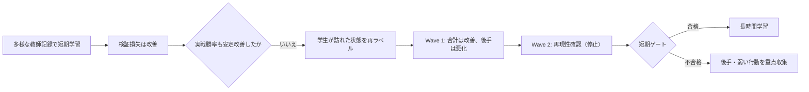

# Meta Specialist V4 性能実験履歴

> 更新日: 2026-08-11
> この文書は、V4方策の主要な性能判断を1本に集約した監査用履歴である。現在の方針は[性能改善計画](../META_SPECIALIST_V3_LUNA_MAX_IMPLEMENTATION_EXPERIMENT_PLAN.md)、実行状態は[現状ダッシュボード](../status/current_status.md)を参照する。

## 1. 結論

現在の最有力方針は、学生モデルが実戦で到達した公開状態をルールベース教師で再ラベルして追加学習する方法である。通常の教師付き学習を長く続けるだけでは、検証損失の改善が実戦勝率へ安定して変換されなかった。一方、再ラベル学習の第1段階は、同じ評価条件で基準モデルを合計4.69ポイント上回った。

ただし、第1段階は後手側が5.21ポイント悪化した。性能改善は確定しておらず、第2段階で再現性と先後差を確認してから長時間学習を判断する。

## 2. 実験の共通条件

主要な比較はArchaludonデッキ、固定6相手、両方の先後で行った。比較に使う対戦では、ルール違反、例外、時間切れをfaultとして数え、1件でもあればその評価を採用しない。

| 項目 | 条件 |
|---|---|
| 方策 | V4リカレントニューラル方策 |
| 入力 | 公開ゲーム状態と合法手だけ |
| 教師 | `public_archaludon_cinderace_r7` のルールベース方策 |
| 相手 | 固定6相手 |
| 評価 | 両方の先後、同一デッキ、同一対戦数 |
| 実行上限 | 1ゲーム最大2,000ステップ |
| 提出権限 | なし |

## 3. 通常の教師付き学習で分かったこと

### 3.1 多様なデータは必要だが、それだけでは十分でない

Wave 3では、学習512試合系列・検証128試合系列を使う1 epoch学習により、2つの乱数初期値で検証損失が約0.58低下した。同じ96局評価では、各候補が29勝、V2基準が23勝だった。この結果を根拠に、同じ条件の3 epoch学習へ進んだ。

| 候補 | 検証損失の変化 | 96局勝数 | 判断 |
|---|---:|---:|---|
| Wave 3 seed 0 | 1.3369 → 0.7522 | 29 | 追加学習へ進む根拠 |
| Wave 3 seed 1 | 1.3133 → 0.7319 | 29 | 追加学習へ進む根拠 |
| V2基準 | — | 23 | 比較対象 |

Wave 4では2候補合計99勝/192局（51.56%、fault 0）だった。検証精度は再現したが、先後差とゲーム終了・進化・攻撃の弱さが残った。

### 3.2 行動種類の重み付けだけでは勝率が上がらなかった

少ない行動を重くする試行は、進化・ゲーム終了・攻撃のオフライン精度を上げた一方、総合精度と一部の主要行動を悪化させた。小規模24局評価は通常損失と同率の4勝だったため、この変更は長時間学習へ進めなかった。

### 3.3 学習時間を延ばしても実戦改善は安定しなかった

Wave 5では2つの乱数初期値を各1,536回更新し、検証損失は大幅に改善した。しかし実戦は95勝/192局（49.48%、fault 0）で、Wave 4を上回らなかった。最も弱い相手は`ozawa_crustle_v2`の5勝/32局だった。

Wave 6では各候補を8 epoch・4,096回更新した。固定評価は合計89勝/192局（46.35%、fault 0）であり、学習損失を下げるだけでは実戦性能を保証できないことが明確になった。

| 段階 | 学習の主な変更 | 固定評価 | 判断 |
|---|---|---:|---|
| Wave 3 | データ多様性を増加 | 2候補とも29/96 | bounded学習を継続 |
| Wave 4 | 512/128系列を3 epoch | 99/192 | 弱点診断へ |
| 行動重み試行 | 少ない行動を重く学習 | 4/24で通常損失と同率 | 不採用 |
| Wave 5 | 通常損失、各1,536更新 | 95/192 | 損失と勝率が乖離 |
| Wave 6 | 通常損失、各4,096更新 | 89/192 | 同じ学習の延長を停止 |

## 4. 再ラベル学習へ移った理由

教師記録だけを学習すると、学生が教師と異なる行動を選んだ後の状態が学習データに少ない。実戦では小さな誤りが後続状態を変え、学習時に見ていない状態へ移る。この分布のずれを減らすため、学生モデル自身で対戦し、到達した公開状態に教師の行動を付け直す。

この方法は強化学習ではない。報酬から試行錯誤する代わりに、到達状態ごとの教師行動を正解として教師付き学習する。実行時はルールベース教師を呼ばず、ニューラル方策だけが合法手から行動を選ぶ。

## 5. 再ラベル学習 Wave 1

### 5.1 学習

48局から2,643遷移を収集し、基準データと混ぜて2候補を3 epoch学習した。基準データ28,000件・検証6,808件に対し、追加系列の実効比率は約6.98%だった。

| 候補 | 初期検証損失 | 最良検証損失 | 更新回数 |
|---|---:|---:|---:|
| seed 0 | 1.0004 | 0.8342 | 1,629 |
| seed 1 | 1.0004 | 0.8318 | 1,629 |

### 5.2 公平な192局比較

base seed `12300000`、固定6相手、両先後で、各候補と対応するWave 6を192局ずつ評価した。全768局でfaultは0だった。

| 候補 | 再ラベル学習 | 対応するWave 6 | 差 |
|---|---:|---:|---:|
| seed 0 | 100/192（52.08%） | 84/192（43.75%） | +8.33ポイント |
| seed 1 | 110/192（57.29%） | 108/192（56.25%） | +1.04ポイント |
| 合計 | 210/384（54.69%） | 192/384（50.00%） | +4.69ポイント |

先後別に合計すると、先手側は116/192対88/192で+14.58ポイント、後手側は94/192対104/192で-5.21ポイントだった。全体改善は正方向だが、後手悪化のため長時間学習の開始条件は満たさなかった。

相手別では6相手中4相手が非劣化だった。改善は複数相手へ広がった一方、`kiyotah_lucario`が1勝悪化した。特定の1相手だけに依存する改善ではないが、乱数初期値と先後の安定性は不足している。

## 6. 再ラベル学習 Wave 2（停止・未完了）

96局の収集を完了し、50勝46敗、fault 0、4,904遷移を保存した。先後は各48局で、遷移は先手2,553件、後手2,351件である。

収集系列に含まれる選択済み意味行動の内訳は次の通りである。これは学習後の正解率ではなく、重点データが実際に含む行動量を示す事前分布である。

| 行動 | 件数 | 行動 | 件数 |
|---|---:|---|---:|
| CARD | 2,712 | PLAY | 1,269 |
| ATTACK | 541 | ATTACH | 409 |
| END | 177 | EVOLVE | 157 |
| RETREAT | 53 | ENERGY / NUMBER / YES / NO | 237 |

先手・後手の遷移数は近いが、行動種類の件数は同じではない。したがってWave2完走後は、勝率だけでなく `seat × opponent × action` の行動精度を同じcheckpointで集計し、END・EVOLVE・ATTACKの改善を確認する。

収集時点の弱点候補も固定しておく。`ozawa_crustle_v2` は後手8局で2勝6敗、`sue124_alakazam` は先手・後手とも各8局で3勝5敗だった。一方、`kiyotah_lucario` は後手8局を全勝しており、全相手を一様に重点化する理由はない。Wave3を実施する場合は、まず `ozawa_crustle_v2 × 後手`、次に `sue124_alakazam × 両先後` を追加収集対象とし、他の相手・先後も比較用に少数残す。

最初の学習は記録上限32,768件で開始したが、基準データだけで34,808件あるため、完全な試合系列が上限内に収まらず停止した。これは学習器の異常ではない。上限を65,536件へ修正して再実行したが、ユーザー指示により学習途中で停止した。report・seed別checkpointは未生成で、部分実行を性能根拠に使わない。

| 項目 | 状態 |
|---|---|
| 収集 | 完了、96局、4,904遷移、fault 0 |
| 再ラベル | 完了、96試合系列 |
| 基準データ抽出 | 完了 |
| GPU学習 | ユーザー指示で停止、report・checkpoint未生成 |
| 192局比較 | 未実行 |

Wave 2の勝率・先後・相手別・行動別結果は未測定であり、完了前に改善を主張しない。

## 7. 現在の判断基準

Wave 2は次をすべて満たした時だけ長時間学習候補にする。

| 観点 | 条件 |
|---|---|
| 実行 | fault 0、欠損・例外なし |
| 再現性 | 2候補とも対応するWave 6以上 |
| 合計 | 約5ポイント以上の改善 |
| 先後 | どちらも約3ポイントを超えて悪化しない |
| 相手 | 6相手中4相手以上で非劣化 |
| 行動 | ゲーム終了・進化・攻撃が実質的に悪化しない |

不合格なら、同じ学習を長くせず、後手・学生と教師の不一致・ゲーム終了・進化・攻撃を重点的に192〜384局収集する。合格なら、同じ設定を1,000〜1,500更新・2候補で実行し、384〜768局で再確認する。

## 8. 一次成果物

| 内容 | パス |
|---|---|
| Wave 6学習 | `runs/meta-specialist-v4-archaludon-longrun-wave6-current/` |
| Wave 6固定評価 | `runs/meta-specialist-strength/v4-fixed-heldout-archaludon-wave6-seed{0,1}-10000000.json` |
| Wave 1学習 | `runs/meta-specialist-v4-archaludon-dagger-wave1-retry/dagger-bc.json` |
| Wave 1再ラベル候補評価 | `runs/meta-specialist-v4-archaludon-dagger-wave1-retry/eval-dagger-seed{0,1}-192.json` |
| Wave 1基準評価 | `runs/meta-specialist-v4-archaludon-dagger-wave1-retry/eval-wave6-seed{0,1}-192.json` |
| Wave 2収集 | `runs/meta-specialist-v4-archaludon-dagger-wave2/screen.json` |
| Wave 2学習進捗 | `runs/meta-specialist-v4-archaludon-dagger-wave2/bc-max65536.progress.json` |

## 9. 主張の範囲

- Wave 1の合計改善は観測事実であるが、再現可能な一般性能の確定ではない。
- Wave 2は停止・未完了であり、結果は未測定である。
- 検証損失、教師行動との一致率、少数局評価だけで採用を決めない。
- この履歴はChampion変更、commit、push、Kaggle提出を許可しない。
