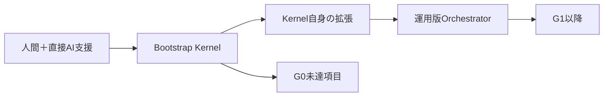

# MAGE-PTCG 研究計画

## 1. このディレクトリの役割

このディレクトリは、Pokemon TCG AI Battle向けエージェント「MAGE-PTCG」の研究計画、実装仕様、AI開発運用を管理する。入口は本ファイルとし、目的に応じて概念設計、実装仕様、またはオーケストレーター運用文書を参照する。

2026-07-14の第三者レビュー（判定: ARCHITECTURE SOUND / EXECUTION SCOPE CORRECTED）を反映し、提出critical pathは`P0 → C1 → C2a／C2b → C3／C4 → C5`へ改訂した。改訂ロードマップと日付付きGateは[design/00_overall_plan.md](design/00_overall_plan.md)と[design/05_evaluation_submission_and_strategy_plan.md](design/05_evaluation_submission_and_strategy_plan.md)を正とする。現在の作業状況は[../status/current_status.md](../status/current_status.md)に分離して管理する。

| ディレクトリ／文書 | 役割 | 内容 |
|---|---|---|
| [`design/`](design/) | 概念設計 | 課題、採用理由、数式、処理フロー、評価方針 |
| [`implementation/`](implementation/) | 実装仕様 | データ型、責務、schema、疑似コード、テスト、完了条件 |
| [`reference/`](reference/) | 横断参照 | 機能、module、Artifactと各計画書の対応 |
| [`bootstrap_kernel_implementation_plan.md`](../agent/ai_orchestrator/bootstrap_kernel_implementation_plan.md) | 初期実装計画 | 自己ホスト可能な最小Control Plane |
| [`ai_orchestrator_implementation_plan.md`](../agent/ai_orchestrator/ai_orchestrator_implementation_plan.md) | AI開発運用 | 多段階オーケストレーション、risk、承認、検証 |
| `ai_orchestrator_review_disposition.md` | 監査記録 | Fableレビューと方針変更の採否・反映先（TODO: リポジトリ未収録） |
| [`../status/`](../status/) | 現在地 | current status、progress、decisions、handoff |
| [`../notion/`](../notion/) | Notion同期 | page map、sync policy、Copilot prompts |

## 2. 推奨する読み順

1. [`design/00_overall_plan.md`](design/00_overall_plan.md)で全体像を把握する。
2. [`implementation/00_overall_implementation_plan.md`](implementation/00_overall_implementation_plan.md)でmodule境界と実装順を確認する。
3. [`bootstrap_kernel_implementation_plan.md`](../agent/ai_orchestrator/bootstrap_kernel_implementation_plan.md)で最初に直接実装する範囲を確認する。
4. [`ai_orchestrator_implementation_plan.md`](../agent/ai_orchestrator/ai_orchestrator_implementation_plan.md)で自己ホスト後のAI運用を確認する。
5. [`reference/plan_index.md`](reference/plan_index.md)で対象機能の文書を特定する。
6. 対象分野の`design/`と`implementation/`の同番号文書を対で読む。
7. 実装時は、リポジトリの現状、コンペ公式仕様、ローカルで確認したAPI挙動との差異を検証する。

## 3. 分野一覧

| 番号 | 分野 | 概念設計 | 実装仕様 |
|---:|---|---|---|
| 00 | 全体設計 | [計画](design/00_overall_plan.md) | [実装計画](implementation/00_overall_implementation_plan.md) |
| 01 | ポケカ知識・デッキ戦略 | [計画](design/01_domain_knowledge_and_deck_strategy_plan.md) | [実装計画](implementation/01_domain_knowledge_and_deck_strategy_implementation_plan.md) |
| 02 | 構造化公開信念・探索 | [計画](design/02_structured_public_belief_and_solver_plan.md) | [実装計画](implementation/02_structured_public_belief_and_solver_implementation_plan.md) |
| 03 | 機械学習・教師／生徒 | [計画](design/03_machine_learning_teacher_student_plan.md) | [実装計画](implementation/03_machine_learning_teacher_student_implementation_plan.md) |
| 04 | Kaggle実戦適応・共同最適化 | [計画](design/04_kaggle_competition_intelligence_and_joint_optimization_plan.md) | [実装計画](implementation/04_kaggle_competition_intelligence_and_joint_optimization_implementation_plan.md) |
| 05 | 評価・提出・Strategy | [計画](design/05_evaluation_submission_and_strategy_plan.md) | [実装計画](implementation/05_evaluation_submission_and_strategy_implementation_plan.md) |
| 06 | 継続学習・オフライン対戦ベンチマーク | [設計・運用仕様](design/06_continuous_league_benchmark_and_training_specification.md) | 実装は`src/mage_ptcg/continuous_league/` |

### 3.1 横断提案

継続学習、Team remote opponent、公開deck、checkpoint評価を接続する正典は、[06｜継続学習とオフライン対戦ベンチマークの設計・運用仕様](design/06_continuous_league_benchmark_and_training_specification.md)である。これは03〜05を置き換えず、それらの学習・評価・提出Gateに従属する。旧[設計案](proposals/06_continuous_training_and_offline_league_benchmark_plan.md)と[実装案](proposals/06_continuous_training_and_offline_league_benchmark_implementation_plan.md)は背景と詳細な検討履歴として残す。

## 4. 正典の優先順位

文書間で内容が矛盾する場合は、次の順で優先する。ただし、実際のAPI、シミュレーター、Kaggle公式仕様と異なる場合は、文書を確定情報として扱わず差異を記録する。

1. 公式大会仕様、cabt実測、Kaggle Validationの観測結果
2. 対応分野の`implementation/*_implementation_plan.md`
3. 対応分野の`design/*_plan.md`
4. `implementation/00_overall_implementation_plan.md`
5. `design/00_overall_plan.md`
6. `../agent/ai_orchestrator/bootstrap_kernel_implementation_plan.md`
7. `../agent/ai_orchestrator/ai_orchestrator_implementation_plan.md`
8. `reference/plan_index.md`

Gitリポジトリ内のMarkdownを正典とし、Notionは共同閲覧用ミラーとする。同期規則は[../notion/sync_policy.md](../notion/sync_policy.md)を参照し、Notionからローカル正典をsilent overwriteしない。

オーケストレーター文書は、MAGE-PTCGのアルゴリズム、評価、提出仕様を上書きしない。正典を複数AI workerで安全に実装するための従属的な運用文書である。

## 5. 開発実行方針

最初に完全版オーケストレーターを人手で作らない。次の順で進める。

1. 単一provider・単一worker・clean verificationを備えたBootstrap Kernelを直接実装する。
2. Kernel経由でTriage、Design、Specification、R2/R3 review等を追加する。
3. Kernelが実用条件を満たした時点から、G0の未達項目とG1以降をWorkOrder化する。
4. 高性能モデルは常駐させず、必要なstageで単発起動して終了する。
5. commit、push、Kaggle提出は人間が行う。

正典上のG0期限は2026-07-13である。Bootstrap Kernel先行はG0遅延リスクを伴う意図的な投資判断であり、遅延した場合はGate達成を偽装せず、実達成日時とschedule deviationを記録する。

## 6. 文書更新ルール

- 安定した概念と判断理由は`design/`、実装契約は`implementation/`に記載する。
- AI開発の状態遷移、権限、承認、provider routingはオーケストレーター文書に記載する。
- 同じ仕様を複数文書へ複製せず、正典へリンクする。
- 数値ハイパーパラメータは設定へ移し、文書には初期値と決定手順を書く。
- 実験結果、採用判断、Kaggle提出証跡は`experiments/`に記録する。
- 現在の作業状況、進捗率、引き継ぎは`docs/status/`に記録し、設計正典へ混ぜない。進捗率はEvidenceなしに変更しない。
- `.orchestrator/`はGit管理外のraw運用証跡とし、重要な判断をそこだけに残さない。
- Kaggleの規則、日程、提出制限、配布シミュレーターの挙動は、重要な判断前に公式情報またはCapability Testで再確認する。
- 未実装の仕様や未検証の性能は、現在利用できる機能として記載しない。

## 7. 現状に関する注意

これらはブラウザ上の対話とローカル最新版文書を基に作成された研究・実装案であり、リポジトリへの実装完了を示すものではない。各文書にある将来のディレクトリ構成、型、CLI、性能目標は、実装前に現在のコードとコンペ制約へ照合する。

Bootstrap Kernel、ProgramOrchestrator、provider adapter、R2/R3 reviewは、文書化されていてもコード実装・実機検証済みとは限らない。
