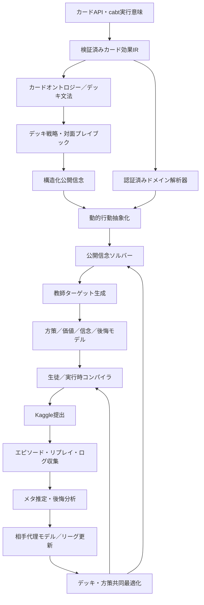
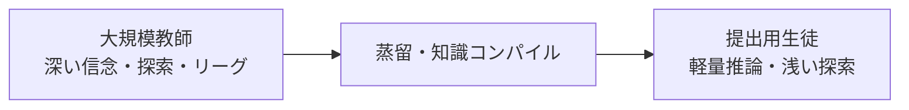
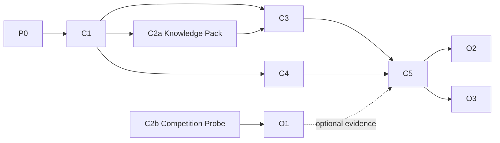
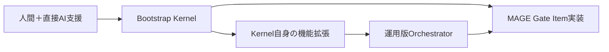
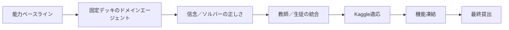

# MAGE-PTCG 全体計画書

## 1. 目的

MAGE-PTCGは、ポケモンカードゲームAI Battle ChallengeのSimulation部門で高い実戦レーティングを達成し、その戦略的ロジックをStrategy部門で説明可能な形に整理するための統合AIシステムです。

研究的新規性は主目的にしません。既存手法で強いものは積極的に採用し、最終的な判断基準を次へ置きます。

- 実戦勝率・レーティング
- 未知デッキと未知方策への頑健性
- 1試合10分の制限内での実行安定性
- invalid、例外、timeoutの抑制
- Kaggle上の時変環境への適応速度
- 最終凍結評価期間における性能維持

### 1.1 第三者レビュー判定と実行スコープ（2026-07-14）

> **ARCHITECTURE SOUND / EXECUTION SCOPE CORRECTED**

統合方向（アーキテクチャ）は妥当だが、全要素を同時に完成条件とすると、汎用基盤や外部データ取得が主戦力をブロックする。本書のアーキテクチャは維持したまま、提出critical pathを次のMinimum Winning Pathへ縮小し、それ以外をOptional／Stretchへ分離する。

**Minimum Winning Path（提出critical path）**

1. 提出可能なRule Agent v0 ChampionとTier D／E
2. ActorInformationView、Stable ActionKey、privacy-safe trace
3. Public Belief／Exact Constraintsの最小実用版
4. Team Rule／Deckを取り込む軽量Knowledge Pack v0
5. bounded searchまたはDomain AnalyzerによるRule改善
6. paired evaluation、runtime profile、10k級soak、rollback package

**条件付き採用**

- Student：2026-07-30までにRule v0非劣性となった場合のみ
- Replay Intelligence：Capability Probeで十分なデータを取得できた場合のみ
- Deck-Policy最適化：固定deckでの方策改善後
- Runtime search：p95 latencyとpaired upliftを通る場合のみ

**方策学習主経路（2026-07-26 方針更新）**

Rule Agent v0を合法手基準、初期方策、rollbackとして保持しつつ、競技性能を伸ばす主研究・実装経路を「Population-trained Recurrent Legal-Action Actor-Critic」とする。既存の提出済み／Family／履歴snapshotをPopulation、最終勝敗をValue target、CABTが提示する合法ActionKeyだけをActorの選択肢とする。offline AWR事前学習、Targeted DAgger、League自己対戦、PSRO、Recurrent PPO、V-traceを順に有効化する。各段階の候補昇格は従来どおりpaired evaluation、safety、未知holdout、runtime gateを通過した場合だけであり、Rule v0 Championの自動置換やKaggle提出を意味しない。

**Stretch（提出critical pathへ含めない）**

- 大規模SMC
- ES-MCCFR全面運用
- 完全Card Effect IR／汎用Conflict Resolver
- MAP-Elites
- Tier A runtime resolving

**運用制約**

- activeな大型Sliceは最大2つ
- Submission build（P0）は全期間継続
- Competition dataはTeacher／Student（C3／C4／C5）の開始条件にしない
- 3実働日でE2E Artifactが出ない基盤は縮小
- 強さへの寄与を測れない抽象化は提出後へ退避

### 1.2 現在地（2026-07-14）

| 領域 | 状態 | 扱い |
|---|---|---|
| Bootstrap Kernel | 完了 | 隔離worker、patch capture、clean verification、承認、crash-resume |
| Rule Agent v0 | 統合済み | 現Champion、Teacher初期値、Runtime fallback |
| Public Belief Decision Loop v0 | 実装・実験済み、監査待ち | DecisionState、PublicBelief MVP、Rule Agent v1、400試合評価 |
| Rule Agent v1 | 非昇格 | Randomには改善、Rule v0へ105–95 |
| 提出互換性 | 一部未解決 | option type 12、正式package、clean dry run |
| Kaggle情報取得 | API経路確認、実大会未実測 | Capability Probeでmodeを固定 |

日々の詳細な状態は[../../status/current_status.md](../../status/current_status.md)で管理し、本書には安定した設計判断だけを残す。

---

## 2. 大会制約

| 制約 | 設計への影響 |
|---|---|
| 指定カードリストのみ使用可能 | カードプールをversion管理する |
| デッキは60枚 | Deck Grammarで厳密制約化する |
| 各プレイヤー最大10分 | 探索予算を残り時間に応じて配分する |
| Kaggle上で継続自動対戦 | 実戦データを環境観測へ利用する |
| 1日5提出まで | Champion/ChallengerとSubmission VOIを使う |
| Simulation締切後に約2週間の最終評価 | 直近メタ適応と未知メタ頑健性を分離する |

公式日程：

- Simulation部門：2026-06-16 20:00 JST ～ 2026-08-17 08:59 JST
- Strategy部門：2026-06-16 20:00 JST ～ 2026-09-14 08:59 JST

---

## 3. 最適化対象

提出戦略を次で表します。

\[
\sigma=(D,\pi,\mathcal B,\mathcal K,\mathcal C)
\]

- \(D\)：60枚デッキ
- \(\pi\)：プレイ方策
- \(\mathcal B\)：初手ブック、対面プレイブック、解決済み状態キャッシュ
- \(\mathcal K\)：チーム知識、公開デッキ、公開Agent、Kaggle対戦証拠（2026-07-14改訂で追加。詳細は[01_domain_knowledge_and_deck_strategy_plan.md](01_domain_knowledge_and_deck_strategy_plan.md)）
- \(\mathcal C\)：実行時構成（Runtime Tier、探索予算、fallback構成）と計算予算

最終目的：

\[
\begin{aligned}
J(\sigma)=
&\lambda_{live}\,\mathbb E_{q\sim\hat{Q}_{live}}[R(\sigma,q)]\\
+&\lambda_{freeze}\,\mathbb E_{q\sim\hat{Q}_{freeze}}[R(\sigma,q)]\\
+&\lambda_{robust}\,\min_{q\in\mathcal U}R(\sigma,q)\\
-&\lambda_{timeout}P_{timeout}
-\lambda_{invalid}P_{invalid}
-\lambda_{crash}P_{crash}.
\end{aligned}
\]

現在メタでの期待性能だけでなく、メタ分布の不確実集合 \(\mathcal U\) に対するworst-case性能を含めます。

---

## 4. 全体アーキテクチャ

---

## 5. 中核となる設計原則

### 5.1 cabtを実行意味の真値とする

カードテキストを独自解釈した結果を真値にしません。独自Card Effect IRの予測とcabtの状態差分を照合し、検証された範囲だけ`VERIFIED`とします。

### 5.2 不確実性を消さずに保持する

相手手札、山札、サイド、デッキ構成を一つに決め打ちしません。

\[
B_t^{game}=P(H_t^{self},H_t^{opp},D^{opp}\mid I_t)
\]

を粒子・制約・交換可能multisetの組み合わせで表現します。

### 5.3 ゲーム信念とプレイヤーモデルを分離する

カード状態の不確実性と「相手が攻撃的」「資源温存を好む」などの方策傾向を分けます。

\[
B_t^{player}=P(C^{opp}\mid I_t,D^{opp})
\]

robust方策はpolicy-agnostic Belief、exploit方策はbehavior-conditioned Beliefを使用します。

### 5.4 原子的行動を戦術マクロへ圧縮する

Trainer使用、対象選択、エネルギー付与などを一手ずつ探索すると分岐が爆発します。次の4系統の抽象行動を利用します。

1. 専門家マクロ
2. デッキコンパイル済みマクロ
3. 学習済みマクロ
4. 原始行動への退避

Primitive Escapeを残し、人間定義Macroが最善手を消すリスクを抑えます。

### 5.5 教師と実行時処理を分離する

Teacherはクラスタ上で重くてよく、提出Agentは公式制限内で高速・安定に動く必要があります。

### 5.6 Kaggle実戦を外部集団として利用する

Kaggle対戦は評価だけではなく、以下の観測源です。

- 頻出デッキと未知アーキタイプ
- 上位Agentの方策傾向
- 自Agentの失敗局面
- Value/Beliefのdomain shift
- Runtime上の例外・timeout

---

## 6. データの三本柱

| データ源 | 得られる知識 | 主な偏り |
|---|---|---|
| 歴史的Expert Data | 定石、デッキ文法、役割、対面知識 | 人間向け環境、カードプール差 |
| Local Synthetic Data | 反実仮想、深い探索、均衡近似 | 自己対戦Populationへの過適合 |
| Kaggle Competition Data | 現在のAIメタ、実装癖、実戦失敗 | 非公開matchmaker、Rating帯偏り |

三者を混ぜてsource情報を失わせず、学習weightと評価holdoutを分離します。

---

## 7. 各レイヤの役割

| レイヤ | 入力 | 出力 |
|---|---|---|
| Card Semantics | カードAPI、cabt probe | Verified IR、Behavior fixture |
| Domain Knowledge | IR、デッキリスト | Ontology、Deck Profile、Playbook |
| Belief | Observation履歴 | GameBelief、PlayerModel、event posterior |
| Domain Analyzer | Information State | exact値、sound bound、heuristic feature |
| マクロ生成器 | 行為者視点、デッキプロファイル | 行動スナップショット |
| ソルバー | 公開木、範囲 | 平均戦略、CFV、後悔 |
| 機械学習モデル | 状態／範囲／行動 | 方策、価値、信念提案、予算 |
| リーグ | エージェント集団 | 教師対戦、最適応答 |
| 大会情報活用 | リプレイ、リーダーボード | メタ事後分布、代理モデル、後悔データセット |
| 実行時コンパイラ | 教師成果物 | 生徒、ブック、キャッシュ、量子化モデル |

---

## 8. 実行時階層

| Tier | 構成 | 位置付け（2026-07-14改訂） |
|---|---|---|
| A | Structured Belief + Student + runtime resolving | Stretch |
| B | Structured Belief + Student + shallow macro search | 条件付き |
| C | Student + Book／Domain Macro + Rule Guard | 有力候補 |
| D | Rule Agent v0（Deterministic Safety Baseline） | 必須Champion／fallback |
| E | First Legal | 最終退避 |

Tier D／Eは常時build可能に維持し（P0）、重い機能が期限内にGateを通らなくても提出全体を失わないようにします。

---

## 9. 開発ロードマップ

2026-07-14の第三者レビュー反映により、ロードマップは一本の必須直列（旧G0〜G6、9.3参照）ではなく、必須Slice（P0、C1〜C5）とOptional Slice（O1〜O3）へ統一する。

- `P0 Continuous Submission Baseline`（全期間継続）
- `C1 Public Belief Audit and Merge`
- `C2a Knowledge Pack v0`
- `C2b Competition Probe and Raw Archive`
- `C3 Bounded Search Improvement`
- `C4 Student v0`
- `C5 Targeted Distillation and League-lite`
- `O1 Competition Intelligence Expansion`（Optional）
- `O2 Deck-Policy Optimization`（Optional）
- `O3 Advanced Solver / Tier A`（Optional）

運用上の重要点：

- Competition data（C2b）はC3／C4／C5の開始条件ではない。
- activeな大型Sliceは最大2つ。
- P0は全期間継続し、Tier D／Eを常時build可能に保つ。

日付付きGate（[05_evaluation_submission_and_strategy_plan.md](05_evaluation_submission_and_strategy_plan.md)の§9.3と一致させる）：

| 期限 | 必須成果 | 未達時 |
|---|---|---|
| 2026-07-17 | C1統合、Tier D／E package、Competition mode確定 | patch分割、Replay依存停止 |
| 2026-07-23 | Knowledge Pack v0、bounded search初回結果 | 汎用基盤縮小 |
| 2026-07-30 | Student v0非劣性判定（GO／NO-GO） | Studentをcritical pathから除外 |
| 2026-08-06 | Champion候補、unknown holdout、高度機能継続判断 | 高度機能停止 |
| 2026-08-10 | Feature Freeze | 安全な下位Tierへ |
| 2026-08-14 | 10k soak、package validation、backup restore | 前Championへrollback |
| 2026-08-16 | checksum、dry run、候補固定 | 新規変更禁止 |
| 2026-08-17 08:59 JST | Simulation締切 | — |
| 2026-09-14 08:59 JST | Strategy締切 | — |

---

### 9.1 開発実行基盤の先行実装

MAGE本体の各moduleを個別に手動管理して実装する前に、自己ホスト可能な最小Control Planeを先行実装します。

Bootstrap Kernelの必須範囲は次です。

- run stateとappend-only event log
- WorkspaceSnapshotの実体保存
- 明示的TaskContract
- 単一providerと単一implementation worker
- 隔離worktreeとpath policy
- clean verification worktree
- authoritative deterministic test
- 人間によるIntegration Approval
- crash後のresume

Triage、Design、Specification、複数provider、R2/R3独立監査、並列workerは、Kernel自身を使って段階的に追加します。詳細は[`bootstrap_kernel_implementation_plan.md`](../../agent/ai_orchestrator/bootstrap_kernel_implementation_plan.md)と[`ai_orchestrator_implementation_plan.md`](../../agent/ai_orchestrator/ai_orchestrator_implementation_plan.md)を参照します。

### 9.2 G0期限との整合

G0期限は2026-07-13のまま変更しません。2026-07-12時点でBootstrap Kernelを先行する方針は、短期的なG0遅延リスクと引き換えに、その後の大量実装を継続的に自動管理するための投資判断です。

Kernel完成前にG0を達成したことにはしません。期限を超過した場合は、次を`experiments/orchestration/`へ記録します。

- 計画期限
- 実達成日時
- 遅延理由
- Kernelに投資した工数
- G0へ適用できたKernel機能
- 今後の回収見込み

### 9.3 旧Gate体系（Deprecated）

以下のG0〜G6直列は2026-07-14改訂で§9冒頭のP0／C1〜C5体系へ置き換えた。歴史的参照のためだけに残し、新規の完了判定へ使わない。G0は2026-07-13期限に対して未達のままP0／C1体系へ引き継がれた（9.2参照）。同改訂で、§8の旧Tier C定義（Domain Macro Agent）と「全Tierをbuild可能に維持」の方針も、A〜E定義とTier D／E常時build（P0）へ置き換えた。

| Gate | 期限 | 必須成果物 | 未達時 |
|---|---|---|---|
| G0 | 2026-07-13 | 最小Agent、Runtime測定 | Tier D継続 |
| G1 | 2026-07-20 | P0カード検証、Domain Agent | デッキ固定、長尾後回し |
| G2 | 2026-07-27 | Solver小規模検証 | runtime CFRを外す |
| G3 | 2026-08-03 | Student統合 | Tier Cを維持 |
| G4 | 2026-08-10 | Kaggle適応評価 | 診断用途に限定 |
| G5 | 2026-08-13 | 機能freeze | 新機能禁止 |
| G6 | 2026-08-16 | soak、package検証 | 前Championへrollback |

## 10. 成功条件

### 最終提出で必須

- valid action contractをすべて処理
- Submission deckから到達可能なCard IRが検証済み
- 不正な行動 = 0
- 未捕捉例外 = 0
- タイムアウト = 0
- 厳格な期限フォールバック
- 探索セッション漏れ = 0
- cold start・package size検証済み

### 条件付き採用

- 実行時CFR
- プレイヤーモデルの活用
- 相手代理モデル
- 解決済み状態の取得
- ニューラル信念提案

これらは実装・評価は行いますが、最終提出への採用は正の限界レーティングとRisk Gateを通過した場合に限定します。

### 10.1 改訂完了条件（2026-07-14）

- Tier D／E packageを常時再現できる。
- ActorInformationViewとStable ActionKeyが共通契約として機能する（[../implementation/00_overall_implementation_plan.md](../implementation/00_overall_implementation_plan.md)の§4.1）。
- Rule v0 Championを維持したままKnowledge／Search候補を評価できる。
- Competition dataなしでもcritical pathが動く。
- StudentのGO／NO-GOが2026-07-30までに決まる。
- Champion昇格／却下／rollbackをpaired evidenceで判断できる。

---

## 11. 主要評価指標

- 対比較勝率
- ベイズ的レーティング事後分布
- 最悪時メタレーティング
- マクロ再現率@K
- 情報集合後悔
- 信念NLL／校正／ESS
- CFV誤差
- 外部選択肢違反
- engine call数
- 行動のp95／p99レイテンシ
- invalid / exception / timeout率
- temporal holdout性能

---

## 12. 参考情報

- 公式大会サイト：`https://ptcg-abc.pokemon.co.jp/`
- Kaggle Simulation CLI：`https://github.com/Kaggle/kaggle-cli/blob/main/docs/simulation_competitions.md`
- cabt API：`https://matsuoinstitute.github.io/cabt/api.html`
