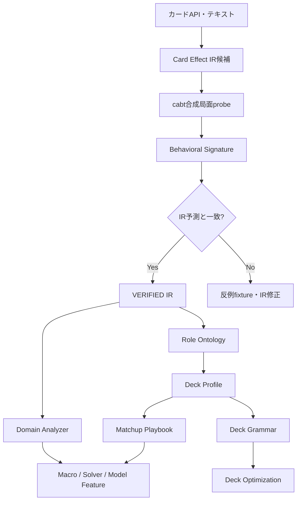
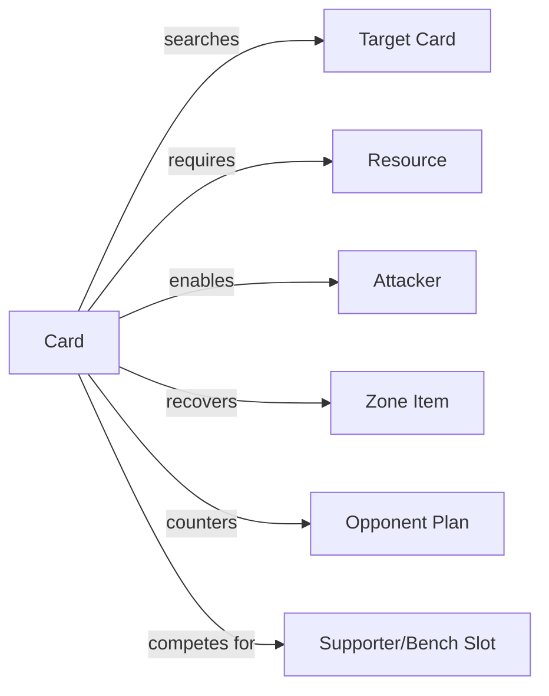
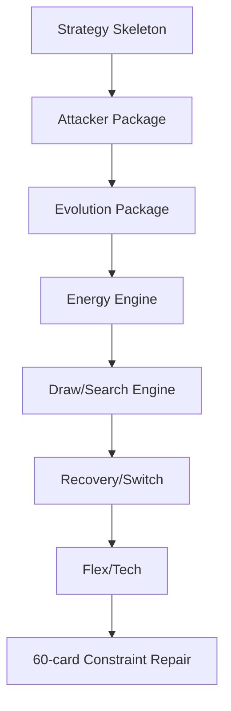
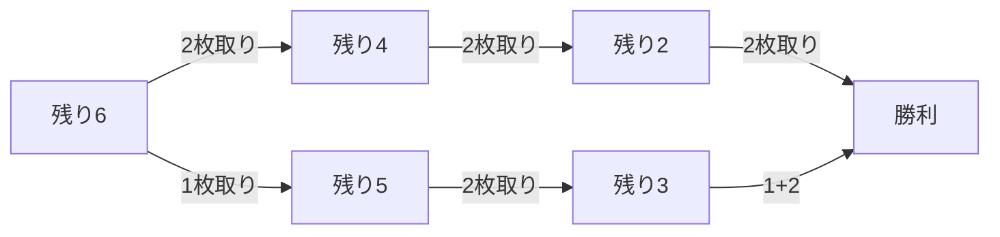
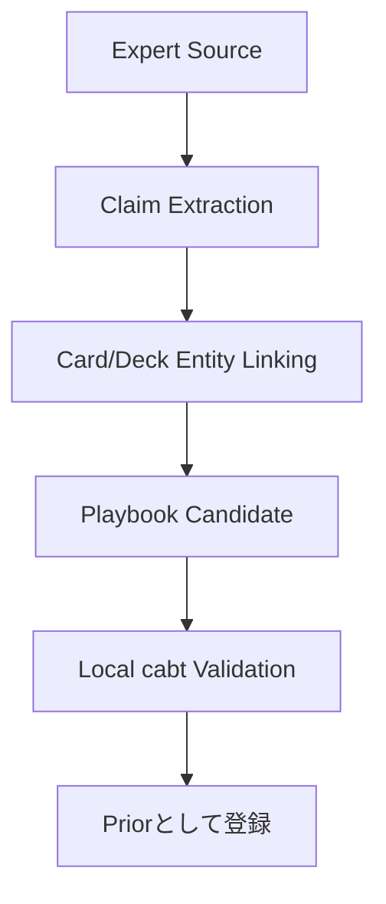

# ポケカ知識・デッキ戦略計画書

## 1. 目的

本計画は、ポケモンカードゲーム固有のルール、カード効果、デッキ構造、対面戦略を、AIが探索・学習・デッキ生成で利用できる形式へ変換するものです。

単にカードテキストを埋め込むだけではなく、次を明示的に扱います。

- カード効果の実行意味
- エネルギー、進化、ワザ、特性の依存関係
- サイド取得経路
- アタッカー継投
- ベンチ負債
- 山札到達確率
- デッキのCore/Engine/Flex/Tech構造
- 対面ごとの勝ち筋と保存資源

### 1.1 改訂スコープ（2026-07-14 第三者レビュー反映）

汎用Knowledge Platform（完全Card Effect IR、汎用Conflict Resolver、Published Agent framework、Deck Evidence基盤）を最初から完成させない。提出critical path（C2a）では、既存資産を素早く実判断へ届ける**Knowledge Pack v0**を先行し、本書の§3〜§13はその後の段階的拡張として維持する。

知識は正解集ではなく、出典、適用範囲、検証状態を持つEvidenceとして扱う。

**Knowledge Pack v0（C2a、必須）**

- Rule Agent v0／v1 adapter（Rule v0はChampion、Rule v1はopinion／counterexample源）
- Team Deckの完全60枚list
- Core／Engine／Flex／Techタグ
- simple Playbook／action score
- source、content hash、card pool version、cabt version、ActionKey schema versionを持つManifest
- immutable snapshot（更新時は新ID）
- compatibility検査
- bounded search／Runtimeへのsoft prior接続

v0の信頼性軸は`validity`（形式・整合）、`support`（裏付け量）、`freshness`（新しさ）の3つとし、戦略品質の評価はpaired evaluationから得る。

**Rule Knowledgeの成果物Level**

| Level | 成果物 | 利用 |
|---|---|---|
| K0 | action index | BC、baseline、fallback |
| K1 | score／ranking | prior、ordering |
| K2 | fired rule trace | disagreement分析 |
| K3 | declarative rule | scope検査 |
| K4 | cabt fixture | 制約候補 |
| K5 | 実戦校正 | gating |

**デッキ知識の区別（同一tableへ混ぜない）**

- VerifiedDeck：事前提供された完全60枚
- CandidateDeck：チーム案・探索候補
- DeckEvidence：Replay横断の採用推定分布（Optional）

**利用境界**

- cabtのlegal setだけをhard制約とする。Rule／Playbook／Knowledge priorはsoftとし、候補actionを削除しない
- prior floorとprimitive escapeを常に残す
- Playbookの`hard: true`化は、cabt legalityまたはEXACT／SOUND認証がある場合に限る
- snapshotなしでも同一Runtimeが動く（比較可能性）
- source追加の前後をpaired評価で比較する

**C2a完了条件**

- Rule v0／v1をadapterで読み込める
- Team Deckを60枚制約込みで検査できる
- simple Playbookをpriorへ変換できる
- immutable snapshotを生成・固定できる
- snapshotあり／なしを同一Runtimeで比較できる

---

## 2. 全体フロー



---

## 3. カード効果IR

カード効果を次の構造へ分解します。

```yaml
preconditions:
costs:
targets:
zone_reads:
zone_writes:
draw:
search:
shuffle:
attach:
move:
discard:
damage:
heal:
status:
continuous_modifier:
once_per_turn:
supporter_constraint:
chance_nodes:
termination:
```

### 3.1 なぜ知識グラフだけでは不十分か

「サーチする」「加速する」という関係だけでは、次を表せません。

- 使用前条件
- 手札やエネルギーのコスト
- 対象制約
- 効果解決順
- シャッフルの発生
- 1ターン1回制約
- ランダム分岐
- 継続効果の終了条件

したがって、実行意味IRを正典とし、OntologyやGraphはIRから派生させます。

---

## 4. 挙動検証

独自IRの正しさはcabt Engineの実行結果で確認します。

\[
\Delta s_{IR}(s,a) \stackrel{?}{=} \Delta s_{cabt}(s,a)
\]

比較対象：

- ゾーン別カード枚数
- 公開カード
- エネルギー付与
- ダメージ・HP
- 状態異常
- 使用済みフラグ
- 手札・山札・トラッシュ変化
- legal option変化
- ログイベント

### 4.1 認証レベル

| Level | 意味 | 使用範囲 |
|---|---|---|
| EXACT | 検証範囲で厳密 | 枝刈り、確定判定 |
| SOUND LOWER BOUND | 真値以下が保証 | 下界枝刈り |
| SOUND UPPER BOUND | 真値以上が保証 | 上界枝刈り |
| HEURISTIC | 経験的推定 | 候補順位付けのみ |

ヒューリスティック値で最善手候補を安全と称して削除しません。

---

## 5. カードオントロジー

### 5.1 基本役割

- ドロー
- サーチ
- トラッシュ
- 回収
- バトル場呼び出し
- 入れ替え
- エネルギー加速
- エネルギー移動
- 進化加速
- ダメージ増幅
- 回復
- 妨害
- 手札リセット
- スタジアム制御
- 壁役
- サイド操作

### 5.2 関係



Ontologyはカード単体の役割だけでなく、デッキ内の依存関係を表します。

---

## 6. デッキ構造

デッキを次に分解します。

\[
D=(D_{core},D_{engine},D_{flex},D_{tech})
\]

| 区分 | 説明 |
|---|---|
| Core | 主アタッカー、進化ライン、主要勝ち筋 |
| Engine | ドロー、サーチ、エネルギー、回収 |
| Flex | 枚数調整可能な安定化枠 |
| Tech | 特定対面・特定メタへの回答 |

### 6.1 デッキ文法



デッキ生成はカードを独立に60枚選ぶのではなく、相互依存するpackageを組み立てます。

---

## 7. 戦略モード

Aggro、Midrange、Controlを固定ラベルにしません。局面ごとの連続戦略状態として表します。

\[
z_t=[z_{tempo},z_{setup},z_{control},z_{resource},z_{prize}]
\]

例：

- 序盤はsetup優先
- 相手の事故時はtempoへ移行
- サイド先行後はresource/controlへ移行
- 終盤はprize raceへ集中

このモードはMacro prior、Value feature、Playbook分岐に使います。

---

## 8. 認証済みドメイン解析

### 8.1 ダメージ・きぜつ解析器

\[
P(KO\mid I_t,a)
\]

を、確定条件ではEXACT、未知手札等を含む場合はBelief上の確率として計算します。

### 8.2 サイド取得経路

勝利までのサイド取得経路を有向グラフとして表します。



目的値：

\[
V_{prize}= -E[T_{win}] - \lambda P(相手先行完走)
\]

### 8.3 エネルギーフロー

各アタッカーが必要とするエネルギーと供給経路を時系列で評価します。

\[
E_{deficit}(k,t)=\max(0,E_{required}(k,t)-E_{reachable}(k,t))
\]

### 8.4 アタッカー連鎖

現在のアタッカーが倒された後も攻撃を継続できるかを評価します。

\[
V_{chain}=\sum_{h=0}^{H}\gamma^h P(A_{t+h}\text{ ready})\,U(A_{t+h})
\]

### 8.5 ベンチ負債

ベンチ展開の価値と負債を同時に評価します。

\[
V_{bench}=V_{setup}+V_{option}-P_{gust}\,L_{target}-C_{slot}
\]

---

## 9. 対面プレイブック

対面知識を自然言語メモではなく構造化します。

```yaml
archetype:
opening_goals:
priority_targets:
prize_map:
resource_preserve:
disruption_timing:
bench_policy:
energy_policy:
winning_modes:
losing_modes:
transition_conditions:
known_traps:
```

Playbookは絶対ルールではなく、Policy priorとMacro proposalへ使用します。探索候補を削除しません。

---

## 10. トッププレイヤー知識の取り込み

対象：

- デッキリスト
- 大会結果
- 対面ガイド
- プレイ解説
- 採用枚数の理由
- 初動と勝ち筋
- Techカードの対象

取り込み手順：



人間知識は初期priorとして利用し、Kaggle AI環境と自己対戦の実測で更新します。

---

## 11. デッキ目的関数

デッキ単体の人間評価ではなく、方策とセットで評価します。

\[
\begin{aligned}
J(D,\pi)=
&\mathbb E_{z\sim p_{meta}}[W(D,\pi;z)]\\
-&\lambda_bP(事故)
-\lambda_tP(timeout)
-\lambda_eH(意思決定分岐)
-\lambda_rRisk_{worst}.
\end{aligned}
\]

分岐の多いデッキを一律に罰するのではなく、提出Agentが扱えず実戦性能を落とす場合だけ考慮します。

---

## 12. 評価

- Card IR差分一致率
- P0/P1カード検証率
- exact/sound枝刈りの健全性
- サイド取得経路のオラクル後悔
- エネルギー付与後悔
- マクロ候補の再現率
- デッキプロファイル分類
- Matchup Playbook有無の勝率差
- Flex/Tech変更の対面別効果
- unseen archetypeへの適応

---

## 13. 完了条件

提出critical pathの完了条件は§1.1のC2a完了条件を正とする。以下は汎用Knowledge Platformまで拡張した場合の完了条件であり、2026-07-14改訂ではOptionalである。

- Submission deckの全カードがP0検証済み
- 到達可能な主要相互作用にfixtureがある
- Card IRからOntologyとDeck Profileを再生成可能
- Domain AnalyzerがCertification Levelを返す
- 固定Playbookなしのprimitive baselineより改善
- Deck Grammarが常に合法60枚を返す
- Matchup Playbookの各claimが出典または実験Artifactを持つ
