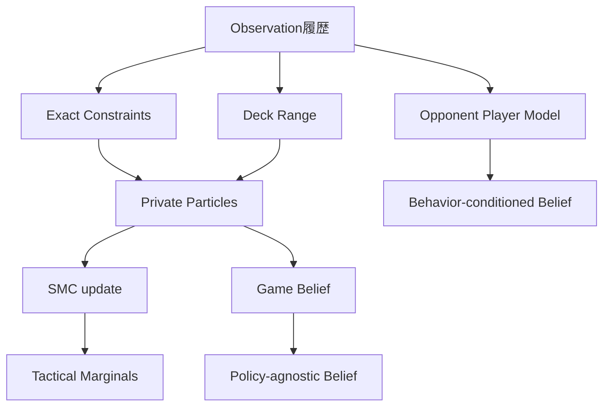
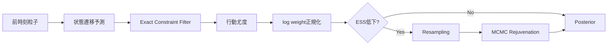
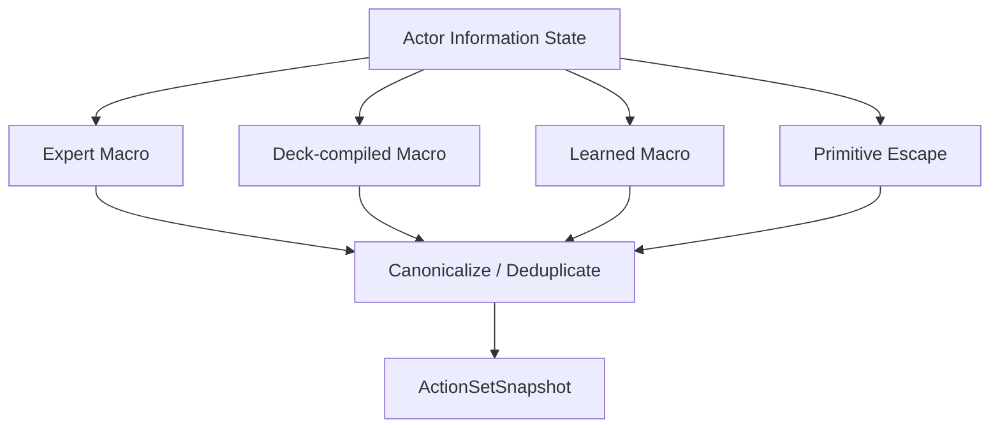
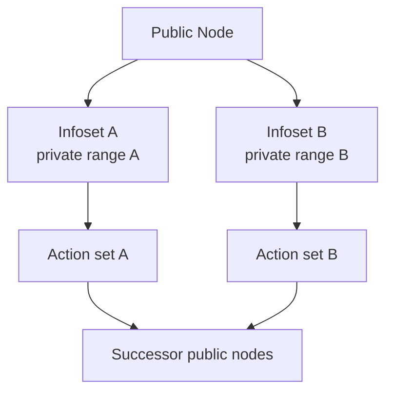
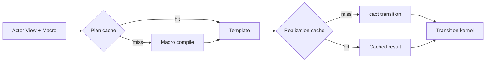

# 構造化公開信念・探索計画書

## 1. 目的

ポケカは、相手手札、山札順、サイド、デッキ構成が見えない不完全情報ゲームです。単一の「もっともらしい完全状態」を仮定して完全情報探索すると、strategy fusionやhindsight leakageが発生します。

本計画では、次を中核にします。

1. 確定情報を制約として厳密に保持
2. 不確定情報を分布として保持
3. Game BeliefとOpponent Player Modelを分離
4. 行動空間を戦術Macroへ動的抽象化
5. Public Tree上でExternal-Sampling MCCFRを実行
6. Blueprintとsafe re-solvingで局所探索の悪化を抑制

### 1.1 改訂スコープ（2026-07-14 第三者レビュー反映）

BeliefとSearchはそれぞれ段階（Level）へ分解し、上位Levelはaction品質とruntimeの両方で下位を上回った場合だけ昇格する。ES-MCCFR（S3）を既定経路にしない。提出critical pathはC1（Public Belief監査・統合）とC3（bounded search）であり、本書の§5 SMC、§9 ES-MCCFR、§11 safe re-solvingはL2以上／S2以上のOptional段階として維持する。

**段階的Belief**

- L0：Public／Own Exact State（public zones、own hand／deck knowledge、可視履歴、legal actions、reset、deterministic replay）
- L1：Constraints and Marginals（相手カードのobserved bounds、zone counts、Team／Published deck混合、unknown mass、tactical marginals）
- L2：Particle Belief（deck hypothesis、相手hand／prize、exact filter、ESS、resampling、collapse recovery）
- L3：Behavior-conditioned Belief（Policy cluster、Submission version、action likelihood、robust／exploitative arm）

**段階的Search**

- S0：Rule／Domain Ranking（Rule v0／v1、damage／prize／energy等のDomain解析）
- S1：短深度bounded forward search（fixed depth、fixed engine-call budget、Rule／Knowledge prior、primitive escape、guided／unguided比較）
- S2：offline root rollout（高impact rootの再解析）
- S3：ES-MCCFR（S1／S2よりTeacher品質／engine-callが優れる場合だけ採用）

**Deck Prior v0**

\[
P(D)=
(1-\epsilon_{unknown})
\sum_zP(z)\sum_vP(v\mid z)P(D\mid z,v)
+\epsilon_{unknown}P_{grammar}(D)
\]

v0はTeam Deck＋unknown massでよい。Published／Replay EvidenceはOptional。

**自己確認（self-confirmation）防止**

- primitive coverage 100%を必須とする
- non-rule explorationとprior floorを保持する
- guided／unguidedを同一root・seed・budgetで比較する
- structured ActionKeyで行動同一性を固定する
- coverage不足の情報集合を学習targetにしない

**Search Reliability**

初期は診断専用とし、iterations、engine calls、action／primitive coverage、uncertainty、guided／unguided gap、timeout、belief level、cache hitを記録する。heldout rootでerror probabilityと校正した後だけTeacher gatingへ利用する。

**完了条件（C1）**

- privacy-safeなActorInformationView
- deterministic trace
- episode reset
- Stable ActionKey最小版
- Rule v0が同じviewから動く

**完了条件（C3）**

- S1 bounded search
- primitive coverage 100%
- guided／unguided比較
- p95 latency budget内
- Rule v0に対するroot regretまたはpaired改善

改善がなければruntime searchを停止し、offline Teacher用途だけ残す。L2／L3、S2／S3、runtime resolvingはOptional。

---

## 2. 情報状態

### 2.1 公開状態

両者が観測可能な情報：

- 場、トラッシュ、ロスト等の公開zone
- HP、ダメージ、状態異常
- 付与エネルギー
- 使用済み権利
- 残りサイド枚数
- 公開行動履歴
- 残り時間

### 2.2 行為者情報状態

行動者だけが知る情報を含みます。

\[
I_t^i=(P_t,H_t^i,K_t^i,O_{1:t})
\]

- \(P_t\)：公開状態
- \(H_t^i\)：自分のprivate情報
- \(K_t^i\)：自分が得た限定公開情報
- \(O_{1:t}\)：自分から見える履歴

Actorの方策は同じInformation Stateで同一でなければなりません。

---

## 3. 構造化公開信念

### 3.1 厳密制約状態

確実な情報：

- 自分の既知デッキ、手札、場、トラッシュ
- 公開された相手カード
- 各zoneの枚数
- 既知の山札上部・下部
- サーチで確認した集合
- マリガンや初期公開イベント
- カード総数制約

### 3.2 デッキ範囲

相手デッキ候補を単一アーキタイプへ固定しません。

\[
P(D^{opp}\mid O_{1:t})
\]

既知カタログ、Deck Grammar、open-world成分の混合で表します。

### 3.3 非公開粒子

粒子は、探索に必要なときだけ具体的な完全状態を持ちます。

\[
h^{(m)}=(H^{self},H^{opp},S^{self},S^{opp},Q^{self},Q^{opp},D^{opp})
\]

- \(H\)：手札
- \(S\)：サイド
- \(Q\)：山札順または部分順序

---

## 4. ゲーム信念とプレイヤーモデル

### 4.1 ゲーム信念

\[
B_t^{game}=P(H_t^{self},H_t^{opp},D^{opp},Q_t,S_t\mid I_t)
\]

カード状態の不確実性だけを表します。

### 4.2 プレイヤーモデル

\[
B_t^{player}=P(C^{opp}\mid I_t,D^{opp})
\]

- 攻撃性
- 資源温存
- ベンチ展開
- バトル場呼び出しの選好
- 妨害のタイミング
- 意思決定時間プロファイル

### 4.3 二重信念

| Belief | 行動尤度 | 利用先 |
|---|---|---|
| policy-agnostic | 幅広く平坦化 | robust solver |
| behavior-conditioned | Player Model混合 | exploitative arm |

相手モデルへの依存度を`player_model_sensitivity`として測定します。

---

## 5. SMC更新

重み：

\[
w_t^{(m)}\propto w_{t-1}^{(m)}P(o_t\mid h_t^{(m)})P(a_{t-1}\mid I_{t-1},h_{t-1}^{(m)})
\]

robust Beliefでは行動尤度をtempered化または広い方策priorで周辺化します。

### 5.1 粒子全滅復旧

1. Exact ConstraintsからDeck Rangeを再構築
2. open-world質量を強制的に確保
3. 制約付き初期化で新粒子生成
4. Belief関連イベントだけ再生
5. 最低粒子数に達しなければDegraded Belief
6. exploitとsafe resolvingを停止

---

## 6. 戦術イベント事後分布

完全Beliefから意思決定に重要なイベント確率を周辺化します。

- 次ターンKO確率
- Gust到達確率
- 進化到達確率
- 手札干渉確率
- エネルギー完成確率
- 特定カードがサイド落ちしている確率

\[
P(E\mid I_t)=\sum_h \mathbf 1[E(h)]P(h\mid I_t)
\]

これらはBeliefの代替ではなく、PolicyやBudgetへ渡す要約です。

---

## 7. 動的行動抽象化

### 7.1 Macro例

- `SETUP_PRIMARY_ATTACKER`
- `SETUP_BACKUP_ATTACKER`
- `GUST_FOR_PRIZE_MAP`
- `DISRUPT_AND_WALL`
- `PRESERVE_RESOURCE_AND_PASS`
- `FORCE_TWO_HIT_KO_LINE`
- `CLOSE_GAME_NOW`

### 7.2 行動スナップショット

一つのsolve epoch内ではaction setを固定します。探索中に新行動を発見した場合は次epochでabstraction versionを更新します。

---

## 8. 公開木

Public Nodeは公開履歴を表し、同じPublic Node内に複数Information Setが存在できます。

Regret vectorはPublic NodeではなくInformation Setごとに保持します。

---

## 9. 外部サンプリングMCCFR

ES-MCCFRはS3段階であり、提出critical pathの既定経路ではない（§1.1）。S1／S2よりTeacher品質とengine-call効率で優れる場合だけ採用します。

正典は標準External-Sampling MCCFRです。

- traverser node：全actionを列挙
- non-traverser node：strategyから1action sample
- chance node：真の確率からsample
- regret：\(v(a)-v(I)\)
- sampled opponent/chance reachを再度掛けない
- average strategy：訪問したnon-traverser infosetで蓄積

\[
R_i^T(I,a)=\sum_{t=1}^T\left[v_i^{\sigma^t}(I,a)-v_i^{\sigma^t}(I)\right]
\]

後悔マッチング：

\[
\sigma(I,a)=
\begin{cases}
\frac{R^+(I,a)}{\sum_bR^+(I,b)} & \sum_bR^+(I,b)>0\\
\frac1{|A(I)|} & otherwise
\end{cases}
\]

sampling付きCFR+やvariance reductionは、標準版を小規模ゲームで上回った場合だけ昇格させます。

---

## 10. 葉ノード評価

### 10.1 3種類のValue

\[
V^{pub}(I_t)
\]

\[
V^{priv}(I_t,h_i)
\]

\[
V^{cf}(P,r_i,r_{-i},a)
\]

CFVは粒子条件付きモデルを集約します。

\[
V^{cf}(r_i,a)=\sum_{h_i}r_i(h_i)v_\theta(P,h_i,\mu(r_{-i}),a)
\]

---

## 11. 安全な再解法

局所solveでBlueprintより相手に有利な戦略を許さないため、Opponent Terminate Gadgetを使います。

相手private cluster \(c\) ごとのmargin：

\[
m(c)=\max(0,Q_{1-\delta}[V^{enter}-b^{blueprint}])+\epsilon_{CFV}+\epsilon_{abs}
\]

終了時価値：

\[
b^{safe}(h)=b^{blueprint}(h)+m(cluster(h))
\]

近似誤差が大きいclusterではmarginを増やすかruntime resolvingを停止します。

---

## 12. エンジン呼び出しの節約

Macroは毎iterationごとにcabtで再探索しません。

- 計画テンプレートキャッシュ
- 完全状態実現キャッシュ
- 公開遷移カーネルキャッシュ

を分けます。

---

## 13. 戦略上の境界

Macro実行は次で停止します。

- 新しいprivate observation
- 相手へdecisionが移る
- chanceで観測やlegal actionが変わる
- KO、サイド取得、ターン終了
- 主要進化、手札干渉、lock変化
- マクロの終了／失敗

sampled hidden truthを見て「重要そうだから止める」という判定はしません。

---

## 14. 実行時予算

残り時間 \(\tau\) から、粒子数、node数、iteration数、engine call上限を選択します。

\[
b^*=\arg\max_b\left(E[\Delta V\mid I,b]-\lambda P(timeout\mid b,\tau)\right)
\]

探索時間そのものをゲーム内actionとしてCFRへ入れず、外部Budget Controllerで扱います。

---

## 15. 評価

- 信念NLL、Brier、校正
- 真状態粒子の再現率
- ESS、collapse率、復旧成功率
- マクロ再現率@K
- 平均後悔
- 制限付きNashConv
- CFV誤差
- 外部選択肢違反
- engine call数
- cache hit率
- 情報状態の不変性
- timeout率

---

## 16. 完了条件

- ActorInformationViewから相手private truthへ到達不能
- 粒子全滅時も必ずRecoveredまたはDegraded Beliefを返す
- solve epoch内でaction dimension不変
- Kuhn/Leducで標準ES-MCCFRと整合
- v4型のreach二重計上実装が回帰テストで失敗
- cache hit/missで結果分布が一致
- safe resolving violationが設定分位点以下
- hard deadline前にfallbackする
