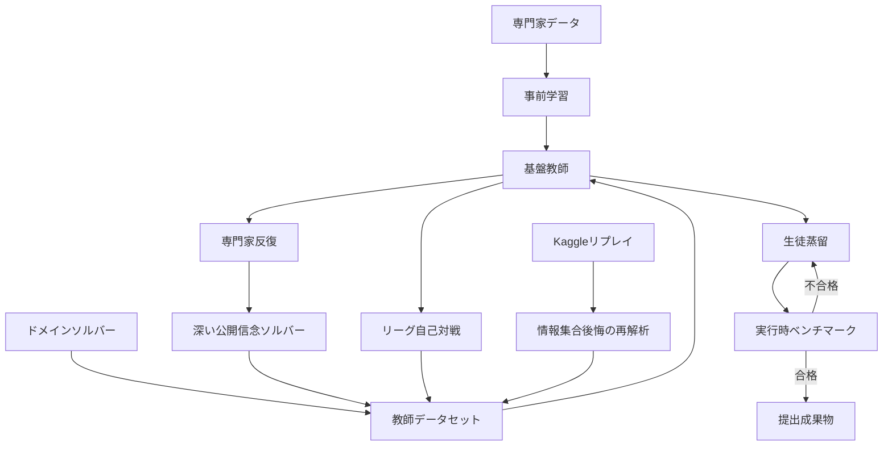
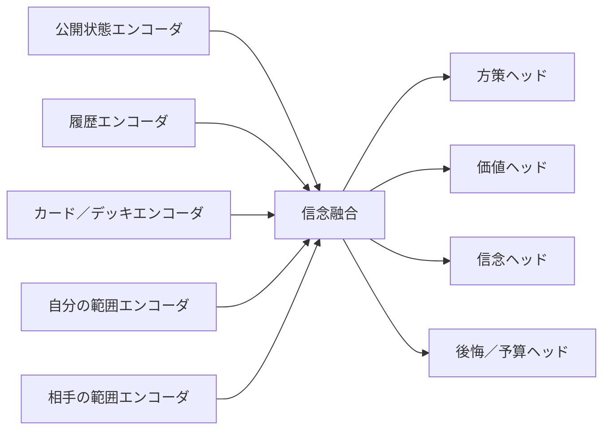
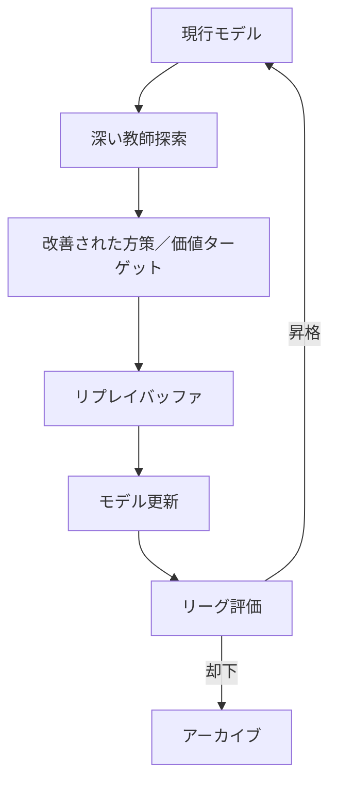
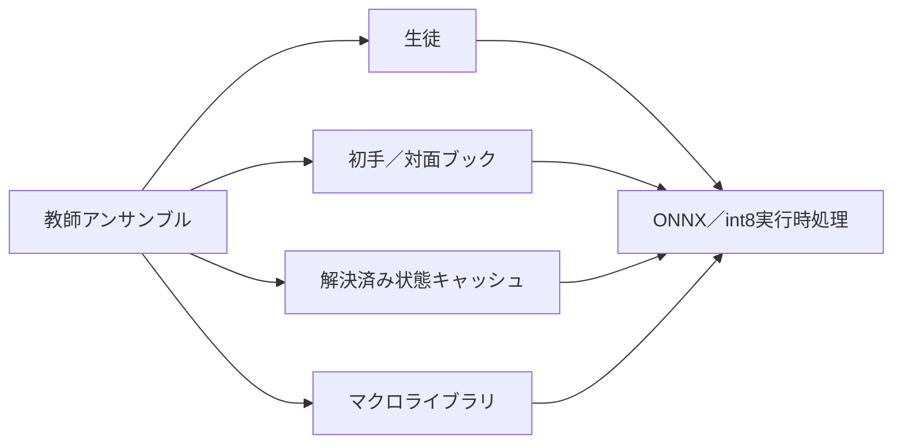

# 機械学習・教師／生徒計画書

## 1. 目的

本計画は、ポケカ固有知識、Structured Public Belief、Teacher探索、League自己対戦から学習信号を生成し、提出環境で動作するStudentへ蒸留するものです。

単一のPolicy/Valueモデルへすべてを押し込まず、役割の異なる出力を分離します。

- 公開方策
- マクロ提案
- 原始選択肢方策
- 公開価値
- 非公開状態条件付き価値
- 反実仮想価値
- 後悔予測
- 信念提案／粒子重み
- 相手プレイヤーモデル
- 探索予算

### 1.1 改訂スコープ（2026-07-14 第三者レビュー反映）

Knowledge-Accelerated Expert Iteration（§8以降）を最終像として維持するが、提出critical pathでは**Student v0（C4）の期限付きGO／NO-GO**を先に行う。Rule BC非劣性が確認される前に、DAgger、汎用Teacher Orchestrator、Mixed Leagueを必須化しない。

**C4-0｜Student v0（最小構成）**

- Rule Agent v0のdemonstrationによるBehavior Cloning
- Stable ActionKeyに基づくvariable legal-action policy
- 入力：public entities、own private entities、short visible history、legal ActionKey features（optionalでpublic-belief marginals、knowledge availability mask）
- headはprimitive／ActionKey policyのみ。必要な場合だけoptional scalar valueを追加
- trace／Episode単位のgroup holdout、near-duplicate分離、source provenance
- clean runtime export、Rule v0とのpaired評価

**判定期限：2026-07-30**

GO条件：

- legal action 100%
- holdout fidelity
- Rule v0とのpaired non-inferiority
- p95 latency budget内
- clean package

NO-GO条件（いずれか該当でStudentを提出critical pathから除外し、Teacher研究用途へ退避）：

- 2026-07-30までに非劣性未達
- runtime超過
- OOD入力でinvalid／NaN
- leakage解消不能

**C5｜Targeted Distillation／League-lite（C3またはC4成功時のみ）**

- Student rollout上のhigh-impact failure stateへtargeted relabeling（Rule v0 opinion＋品質Gate済みbounded search）
- disagreement mining（Rule v0 vs v1、Rule vs Student、Rule vs bounded search、guided vs unguided）はhigh-impact rootだけ再解析
- League-lite必須構成：Champion、Rule v0、Historical、Random／unknown。Published Agent／SurrogateはOptional。PSROは必須でない

**教師ラベルの規律**

- Rule Agent v1を正解教師として固定しない（Rule v0へ105–95で非昇格。opinion／counterexample源として扱う）
- Kaggle Replay actionを直接Policy targetにしない（§6.3）
- fallbackやunsupported contextで生成されたdemonstrationはsample weightを下げる
- DatasetにはKnowledge snapshot IDとCompetition cutoffを付与する

### 1.2 方策学習主経路（2026-07-26）

Rule BCは安全な初期値であり、最終方策の上限ではない。本計画の主経路を次の段階へ更新する。

1. Population由来のActorInformationView-only trajectoryを、終局`WIN`／`LOSS`／`DRAW`／`UNKNOWN`、teacher provenance、episode単位splitとともに保存する。
2. visible public historyをGRUで処理するRecurrent Legal-Action Actor-Criticを、state/action別encoder、masked scorer、public win-value、opponent-family補助headで事前学習する。
3. 既存ログにはAWRで、`A=terminal_return-V(I)`のbounded weightを用いる。行動別advantageまたはcriticが無い重み付きBCをAWRと呼ばない。
4. Student rolloutの低確信、value誤差、教師不一致、未知ActionKey構成、敗北直前状態をTargeted DAggerで再ラベルする。教師のqueryはActorの観測範囲内だけで行う。
5. Population LeagueではMain／Main Exploiter／League Exploiter／Deck Specialist／historical snapshotを役割分離し、empirical payoff matrixからPSRO meta-strategyを更新する。
6. online更新はRecurrent PPOを動作基準とし、actor/learnerを分離できる場合にV-traceへ移行する。報酬は勝利`+1`、敗北`-1`、引分`0`を正とし、手作業の中間報酬を主目的にしない。

この更新は実装・学習の優先順位を定める。提出Championの変更は§1.1のlegality、paired non-inferiority、latency、clean packageと、評価計画のpromotion gateを通過した候補だけに限定する。

---

## 2. 学習システム全体



---

## 3. 入力表現

### 3.1 公開状態エンコーダ

入力：

- バトル場／ベンチのポケモン
- HP、ダメージ、状態
- 付与済みエネルギー
- 公開領域
- 残りサイド
- ターン内使用フラグ
- 公開行動履歴
- 合法な選択肢の文脈
- 残り時間

### 3.2 非公開状態エンコーダ

自分のInformation StateまたはTeacher粒子を処理します。

- 自分の手札
- 既知のサイド位置
- 既知のデッキ区間
- サンプリング済み非公開粒子

### 3.3 カードエンコーダ

カードを次の融合で表します。

\[
e_c=e_{id}+e_{text}+e_{IR}+e_{role}+e_{graph}
\]

- ID埋め込み
- テキストエンコーダ
- カード効果IRエンコーダ
- 役割オントロジー埋め込み
- カード相互作用グラフ埋め込み

### 3.4 範囲エンコーダ

粒子集合を順序不変に集約します。

\[
e_r=\operatorname{SetEncoder}\left(\{e(h^{(m)}),\log w^{(m)}\}_{m=1}^{M}\right)
\]

Set Transformer、Perceiver、Deep Setsを比較します。

---

## 4. モデル構成



### 4.1 方策ヘッド

- マクロ方策
- 原始選択肢方策
- 対象選択方策
- デッキ条件付き初手方策

### 4.2 価値ヘッド

#### 公開価値

\[
V^{pub}_\theta(I_t)=P(\mathrm{win}\mid I_t)
\]

通常のStudent判断、Book照合、校正に使用します。

#### 非公開価値

\[
V^{priv}_\theta(I_t,h_i)
\]

粒子ごとの評価、Belief診断、range aggregationに使います。

#### 反実仮想価値

\[
v_\theta(P,h_i,\mu(r_{-i}),a)
\]

CFR葉評価用です。

### 4.3 後悔ヘッド

\[
\hat R_\theta(I,a)\approx R^{solver}(I,a)
\]

Runtime resolvingのwarm start、action orderingに使用します。Teacher正典strategyへ固定混合しません。

### 4.4 信念ヘッド

- デッキ仮説提案
- 手札／サイド補完提案
- 粒子重要度補正
- 戦術イベント事後分布

### 4.5 予算ヘッド

\[
\hat G(I,b)=E[\Delta V\mid I,b]
\]

追加計算予算による期待改善を予測します。

---

## 5. 教師システム

Teacherは一つの巨大モデルに限定しません。

| Teacher | 役割 |
|---|---|
| ドメイン教師 | 厳密／健全な戦術ターゲット |
| 深いソルバー教師 | 戦略、CFV、後悔 |
| 戦術教師 | 即時きぜつ、バトル場呼び出し、エネルギー付与 |
| 均衡教師 | 頑健な方策 |
| メタ活用教師 | 大会メタへの最適応答 |
| Deck Specialist | 特定デッキ・対面 |

Ensembleを利用し、局面ごとに信頼できるTeacherを選択します。

---

## 6. 学習データ

### 6.1 Dataset分類

```text
expert_pretraining/
domain_targets/
solver_targets/
selfplay_trajectories/
kaggle_information_set_regret/
belief_supervision/
calibration/
holdout/
```

### 6.2 ソルバーターゲット

1つのInformation Setについて保存：

- ActorInformationView
- 信念要約
- ActionSetSnapshot
- 現在戦略
- 平均戦略
- 行動CFV
- 瞬時／累積後悔
- 青写真CFV
- 安全余裕
- 探索予算
- ソルバー診断

### 6.3 Kaggleリプレイターゲット

Replay actionを正解とみなしません。

\[
R_t^{IS}=Q^{PB}(I_t,a_t^*)-Q^{PB}(I_t,a_t^{played})
\]

をTeacherで再解析し、IS Regretだけを学習に使います。

Oracle Regretは診断専用です。

---

## 7. 損失関数

\[
\begin{aligned}
\mathcal L=
&\lambda_{macro}\mathcal L_{macro}
+\lambda_{primitive}\mathcal L_{primitive}\\
+&\lambda_{pub}\mathcal L_{V^{pub}}
+\lambda_{priv}\mathcal L_{V^{priv}}
+\lambda_{cfv}\mathcal L_{CFV}\\
+&\lambda_{regret}\mathcal L_{regret}
+\lambda_{belief}\mathcal L_{belief}\\
+&\lambda_{budget}\mathcal L_{budget}
+\lambda_{cal}\mathcal L_{calibration}.
\end{aligned}
\]

### 方策

\[
\mathcal L_{macro}=\mathrm{KL}(\bar\pi_{solver}\Vert\pi_\theta)
\]

### 価値

\[
\mathcal L_V=\operatorname{Huber}(\hat V,V^{target})
\]

### 後悔

\[
\mathcal L_R=\sum_a\operatorname{Huber}(\hat R(a),R^{solver}(a))
\]

### 信念

- デッキ仮説の交差エントロピー
- 粒子重みのKL
- イベントBrierスコア
- 校正正則化項

---

## 8. 専門家反復



モデルが自分の探索を高速化し、探索がモデルの教師を改善する循環です。

---

## 9. 集団／リーグ学習

単一自己対戦相手へ過適合しないため、次のPopulationを維持します。

- 現在のチャンピオン
- 過去のチェックポイント
- 活用エージェント
- 頑健エージェント
- デッキ専門家
- Kaggle相手代理モデル
- ランダム／ドメインベースライン

PSROでは、新しいbest responseをPopulationへ追加し、meta solverで混合を更新します。

---

## 10. 生徒蒸留

Studentへ蒸留する対象：

- Macro policy
- primitive policy
- public value
- compact private/range value
- regret warm start
- belief proposal
- budget prediction

Teacherの完全なPublic-Belief TreeをRuntimeへ持ち込みません。

### 10.1 Knowledge Compilation



---

## 11. モデル拡張

固定で巨大化しません。

```text
30M → 100M → 300M → 1B
```

比較：

- search top-k recall
- CFV error
- Belief NLL
- regret prediction
- Student distillation quality
- win rate / training FLOP
- inference latency

2段階連続で限界改善が閾値未満なら拡大を停止します。

---

## 12. カリキュラム

### Stage 1：ルールと合法性

- legal option
- zone transition
- simple KO

### Stage 2：戦術

- immediate win
- prize route
- energy attach
- bench decision
- Gust target

### Stage 3：Belief

- hand/deck/prize posterior
- information gathering
- deception tolerance

### Stage 4：長期戦略

- resource preservation
- control transition
- attacker chain

### Stage 5：Competition adaptation

- unseen decks
- top-agent surrogate
- temporal meta shift

---

## 13. 校正

勝率Valueやevent probabilityは意思決定に直接使うため、精度だけでなく校正を評価します。

- reliability diagram
- expected calibration error
- Brier score
- deck/turn/prize別校正
- temporal holdout校正

必要に応じてtemperature scaling、isotonic regression、small calibration headを使います。

---

## 14. 実行時配備

候補：

1. ONNX Runtime INT8
2. 生成済みNumPy/C++推論
3. TorchScript

選定基準：

- package size
- cold start
- p95 latency
- memory
- numerical deviation
- official environment compatibility

---

## 15. 評価

- policy top-k recall
- macro recall
- public/private/CFV error
- regret rank correlation
- belief NLL/calibration
- search warm-start improvement
- paired win rate
- compute-normalized performance
- runtime latency/package size
- temporal/unseen holdout

---

## 16. 完了条件

- 3種類のValueが別head・別targetで学習される
- Actor pathにhidden truthが入らない
- Solver Target schemaがversion管理される
- Expert Iterationを再現可能に実行できる
- StudentがDomain baselineをpaired評価で上回る
- Runtime backendがpackage/latency Gateを通過
- Kaggle actionを無検証の教師ラベルとして使用しない
