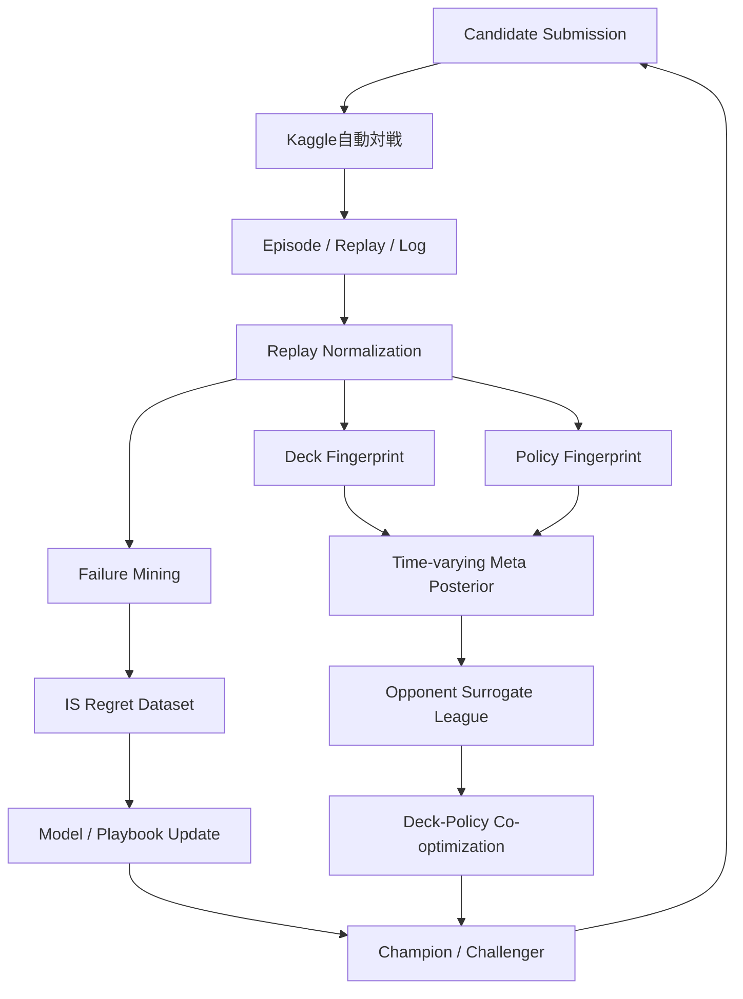
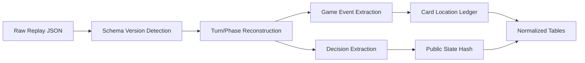
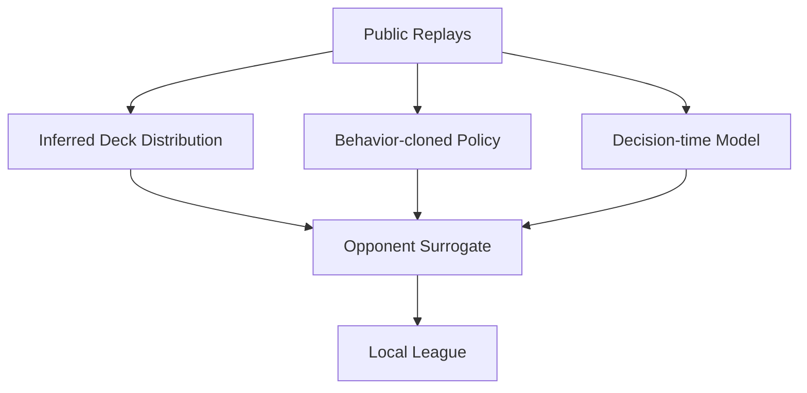

# Kaggle実戦適応・デッキ方策共同最適化計画書

## 1. 目的

Kaggle上の対戦を単なる最終評価ではなく、非定常な外部Populationから得られる実戦データとして利用します。

対象：

- 自SubmissionのEpisode、Replay、Agent Log
- Leaderboardとpublic-safe Submission
- 上位Submissionが参加した公開Episode
- 公式提供の日次Episodeデータ
- ローカル自己対戦と評価対戦

これらを用いて、環境理解、相手デッキ推定、敗戦再解析、Opponent Surrogate、デッキ・方策再最適化を循環させます。

### 1.1 改訂スコープ（2026-07-14 第三者レビュー反映）

Kaggle公開Populationは高価値だが取得可否が不確実な**Optional Evidence Plane**として扱う。提出critical pathではC2b（Capability ProbeとRaw Archive）だけを必須とし、Replay Intelligence、Surrogate、Meta推定、共同最適化（O1〜O2）はGateを通った場合だけ実施する。Competition dataはC3／C4／C5の開始条件にしない。Replayが取得できなくてもcritical pathを止めない。

**Competition mode（2026-07-17までにCapability Probeで固定）**

- `FULL_REPLAY`：Replayとlegal optionsを取得できる
- `REPLAY_WITHOUT_LEGAL_OPTIONS`：Replayは取得できるがlegal optionsが欠ける
- `PUBLIC_ARTIFACTS_ONLY`：leaderboard／公開Artifactのみ
- `LOCAL_ONLY`：外部データなしでローカル評価のみ

**取得想定（実測前の仮定を確定扱いしない）**

| 情報 | 判定 |
|---|---|
| Leaderboard／自Submission | 標準CLIで取得可能 |
| Episode一覧／Replay | API経路あり、実大会未実測 |
| legal options | 未実測 |
| private情報 | 利用可能と仮定しない |
| agent logs | 別管理、optional |
| 完全deck | 公開時のみ確定 |

**Raw First**

request、time、payload、status、auth scope、content hash、schema fingerprint、redaction reportを保存し、Normalizer変更後も再処理可能にする。取得不能の場合もraw responseまたはerrorをArtifact化する。credential、cookie、tokenは保存しない。

**共同最適化（O2）の前提条件（すべて満たす場合のみ）**

1. Policyが固定deckで安定している
2. deck差が主要ボトルネックである
3. deck candidateが複数ある
4. 2026-08-06以前にpaired tournamentを実行できる

**C2b完了条件**

- Capability Artifact（mode決定を含む）
- rawまたはerrorの保存
- credential／private情報のredaction
- local-onlyでもcritical pipelineが進行する
- Replay取得時だけ§5以降のnormalization等を追加する

---

## 2. 大会情報活用ループ



---

## 3. 収集可能なデータ

Kaggle Simulation CompetitionのCLIでは、一般に次の操作が提供されます。

```bash
kaggle competitions submissions pokemon-tcg-ai-battle
kaggle competitions episodes <SUBMISSION_ID>
kaggle competitions replay <EPISODE_ID> -p replays/
kaggle competitions logs <EPISODE_ID> <AGENT_INDEX> -p logs/
kaggle competitions leaderboard pokemon-tcg-ai-battle -s
kaggle competitions team-submissions <TEAM_ID>
```

実際のpermission、schema、rate limitはCapability Testで確認します。

完全デッキリストや全private truthが常に含まれるとは仮定しません。公開されたカードと複数Episodeを統合して確率的に推定します。

---

## 4. データの偏り

Kaggle Episodeを大会環境の無作為標本とはみなしません。

- 非公開matchmaker
- Rating帯への偏り
- active Submissionのみ
- 上位Episode datasetの選択偏り
- 同一Submissionの重複
- Agent versionの時間変化
- デッキと方策が一体化しており識別困難

対策：

- source別に保持
- Rating帯・時刻・Submission lineageで層別化
- hierarchical shrinkage
- uncertainty set
- local balanced tournamentとの併用

---

## 5. リプレイ正規化



抽出対象：

- Episode metadata
- player/submission/team
- turn、phase、first player
- legal optionsとselected action
- カード公開・zone移動
- attack、damage、KO、prize
- timeout、invalid、exception
- remaining timeが取れる場合は時間系列

---

## 6. 共同戦略フィンガープリント

Kaggle観測だけでDeck効果とPolicy効果を完全分離できないため、基本単位を次とします。

\[
\sigma_j=(D_j,\pi_j)
\]

### 6.1 Deck Fingerprint

- 公開カードcount sketch
- 進化graph
- エネルギーprofile
- attack/ability使用
- Trainer package
- 初動順序
- first attack/prize timing
- prize trade pattern

### 6.2 Policy Fingerprint

- bench expansion
- resource conservation
- gust target
- disruption timing
- tempo/control transition
- decision-time profile
- macro distribution

Policy推定ではhidden availabilityを周辺化します。

\[
P(a\mid I,C)=\sum_hP(a\mid I,h,C)P(h\mid I)
\]

---

## 7. オープンワールドのアーキタイプ発見

分類：

```text
KNOWN_ARCHETYPE
KNOWN_VARIANT
NEW_TECH_VARIANT
UNKNOWN_ARCHETYPE
```

既知デッキとの類似度だけでなく、カード共起、役割、進化graph、テンポ、サイド取得パターンを用います。

未知clusterが十分なEpisode数と一貫したfingerprintを持った場合、Leagueの独立Opponentへ昇格させます。

---

## 8. 非定常メタ推定

cluster \(z\) の有効観測量：

\[
N_t(z)=\rho N_{t-1}(z)+\sum_{e\in\mathcal E_t}w_eP(z\mid e)
\]

posterior：

\[
p_t(z)=\frac{N_t(z)+\alpha_z}{\sum_{z'}N_t(z')+\sum_{z'}\alpha_{z'}}
\]

\(w_e\) は次を反映します。

- データ源
- 新しさ
- 重複Submission
- posterior confidence
- Rating帯
- lineage

単一点ではなく複数のもっともらしいメタ分布集合 \(\mathcal U_t\) を構築します。

---

## 9. 対面モデル

Kaggleではjoint strategy単位で推定します。

\[
y_{ij}\sim\mathrm{Binomial}(n_{ij},\theta_{ij})
\]

\[
\operatorname{logit}\theta_{ij}=\mu+s_i-s_j+m_{ij}+\beta_f x_{first}+v_{version}
\]

Deck効果とPolicy効果の分離は、ローカルで同じDeck×複数Policy、同じPolicy×複数Deckのcross-playを行って識別します。

---

## 10. 意思決定後悔のリプレイ分析

### 10.1 Information-set Regret

当時利用可能だった情報だけでTeacher再解析します。

\[
R_t^{IS}=Q^{PB}(I_t,a_t^*)-Q^{PB}(I_t,a_t^{played})
\]

学習に使えるのはこちらだけです。

### 10.2 Oracle Regret

試合後に判明したtruthを使います。

\[
R_t^{oracle}=Q(s_t^{full},a_t^{oracle})-Q(s_t^{full},a_t^{played})
\]

診断専用であり、Policy targetへ混ぜません。

### 10.3 分類

- Prize Route error
- Energy attach error
- Bench liability
- Wrong Gust target
- Missed KO
- Resource overspend
- Disruption timing
- Setup failure
- Belief support failure
- Value calibration failure
- Time management
- Deck construction failure

---

## 11. 相手代理モデルリーグ

公開Replayから相手コードを再現するのではなく、観測行動分布を近似します。



Surrogate uncertaintyを保持し、未観測actionへ0確率を置きません。信頼度が低い場合はrobust方策を優先します。

---

## 12. デッキ・方策の共同最適化

\[
(D^*,\pi^*)=\arg\max_{D,\pi}\mathbb E_{z\sim p_t}[W(D,\pi;z)]
\]

ただし最終凍結用には、

\[
\max_{D,\pi}\min_{q\in\mathcal U_t}\mathbb E_{z\sim q}[W(D,\pi;z)]
\]

を併用します。

### 12.1 探索方式

- Hierarchical Deck Grammar
- MAP-Elites
- local mutation
- surrogate screening
- cabt tournament final evaluation
- PSRO best-response追加

MAP-Elitesのbehavior descriptor例：

- setup speed
- prize style
- control intensity
- energy complexity
- decision branching
- robustness to disruption

---

## 13. Champion/Challenger

### Champion

- 現時点で最も安定
- Rating観測基準
- rollback先

### Challenger

原則として一つの主要因だけ変更：

- deck
- model
- belief
- solver
- playbook
- runtime budget

昇格指標：

\[
\Delta=w_L\Delta_{local}+w_K\Delta_{KaggleAdjusted}-w_RRisk
\]

raw live score差だけで昇格しません。

---

## 14. 提出の情報価値

提出回数が限られるため、候補 \(c\) の価値を評価します。

\[
VOI(c)=\frac{E[\text{将来の選択改善}]}{\text{提出機会コスト}}
\]

提出理由：

- Champion候補
- 重要な不確実性を解消
- packaging/runtime検証

小差のランダム変更を大量提出しません。

---

## 15. 自動運用周期

### 毎時

- 新Episode差分取得
- Replay/Log正規化
- exception/timeout検出

### 毎日

- Leaderboard snapshot
- official daily dataset取得
- fingerprint更新
- meta posterior更新
- 高Regret局面再解析

### 1～2日ごと

- Student/Playbook更新
- Surrogate更新
- Flex/Tech再探索
- Champion/Challenger評価

---

## 16. 評価

- Replay取得成功率
- schema coverage
- Deck fingerprint calibration
- unknown archetype detection delay
- meta forecast log loss
- matchup posterior calibration
- surrogate fidelity
- IS regret低減
- temporal holdout win rate
- Champion昇格後のadjusted improvement
- final-freeze worst-case rating

---

## 17. データ利用方針

- public-safeなReplay、Log、公式datasetのみ
- accidental secret、コード断片、認証情報を利用しない
- source、visibility、allowed_useを記録
- private情報の利用範囲は規約・公開仕様を確認
- 最終評価期間中にモデル更新できない前提で選定

---

## 18. 完了条件

- 差分Episode ingestionが冪等
- Submission lineageを追跡可能
- meta posteriorに不確実性とsource compositionがある
- Replay actionを直接正解ラベルにしない
- IS/Oracle Regretが完全分離
- Surrogateのuncertaintyを保持
- local balanced tournamentとKaggle結果を併用
- final freeze候補をcurrent/robust両方で評価

---

## 19. 参考情報

- Kaggle CLI Simulation Competitions：`https://github.com/Kaggle/kaggle-cli/blob/main/docs/simulation_competitions.md`
- 公式大会サイト：`https://ptcg-abc.pokemon.co.jp/`

---

## 20. Competition Intelligence Sidecar｜データガバナンス拡張（2026-07-18追記）

本節は、§1–19が前提とする収集・解析ループへ証拠駆動のデータガバナンス層を追加する設計であり、§1–19の分析手法（Deck/Policy Fingerprint、Meta Posterior、Regret Mining、Surrogate等）の仕様を変更しない。実装配置と進捗は[実装計画書§23](../implementation/04_kaggle_competition_intelligence_and_joint_optimization_implementation_plan.md#23-competition-intelligence-sidecar-実装o1-2026-07-18)を正とする。

### 20.1 Immutable Intelligence Snapshot

進行中のOffline Training／Search／League／Evaluationは、収集直後のデータを直接読まない。「収集→正規化→解析→Knowledge Claim Registry」を経て、cutoff time、入力source ID一覧とhash、permission、split policy、source weightを持つ内容ハッシュ自己検証Snapshotとして固定された場合だけ、Offline TrainingがSelection-only（episode/source選択と分割のみ。損失・モデル形式は変更しない）で読み込める。

### 20.2 SourceEnvelopeとAllowed Use

すべての外部データはSourceEnvelope（`source_kind`、`acquisition_mode`、`allowed_uses`等）を伴う。`allowed_uses`が欠落・不明な場合は`ARCHIVE`のみを許可するdefault denyとし、「公開データだから使える」という推測で`ANALYSIS`／`TRAINING`／`REPORTING`／`REDISTRIBUTION`へ昇格させない。複数sourceを混ぜるSnapshotの許可範囲は、寄与する全sourceの`allowed_uses`の積集合とする。

### 20.3 Knowledge Claim RegistryとC2a Knowledge Packの関係

C2a Knowledge Pack（既存、[Evidence](../../evidence/knowledge-pack-v0.md)）はデッキ内容とRule tie-break用ActionPriorを保持する運用時immutable snapshotであり、本節が定めるKnowledge Claimはこれを置き換えない。Knowledge Claimは、人間の文章知識やReplay解析から得られる主張（`claim_type`、`scope`、`precondition`、`recommendation`、`evidence_grade`、lifecycle `status`）を保持する別の型である。ClaimがSUPPORTEDへ遷移するには`E3_CONTROLLED_LOCAL_EVIDENCE`以上のEvidence Gradeを要し、`E0`／`E1`はhard rule出力へ使用しない。矛盾するClaimは一方を上書きせず両方を保持する。

### 20.4 Runtime Isolation

提出runtime（`main.py`起点で到達可能な全import）は、本節のsidecar（`mage_ptcg.competition_intelligence`）、`mage_ptcg.dataops`、`sqlite3`、`pandas`、`scikit-learn`、学習用PyTorchのいずれもimportしない。既存C2b Capability Probe（`mage_ptcg.competition`）はsidecarから読み取り専用で再利用する対象であり、runtimeからの到達禁止という制約自体は変わらない。
