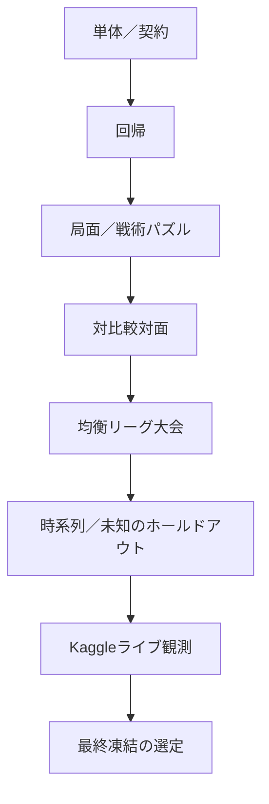
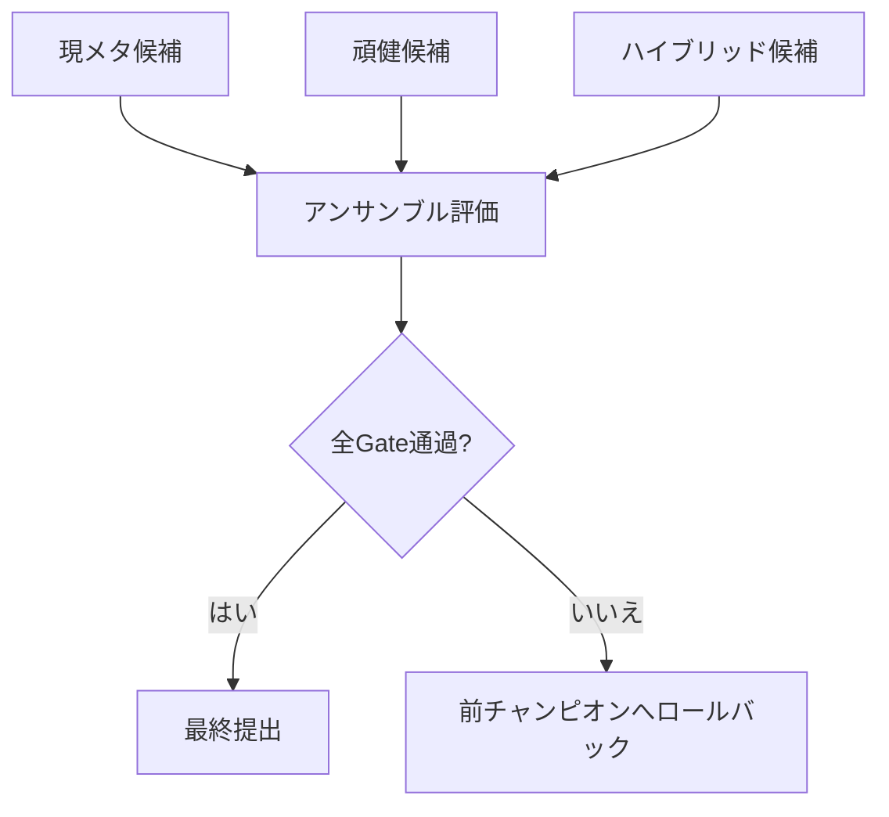

# 評価・提出・Strategy運用計画書

## 1. 目的

本計画は、MAGE-PTCGの改善を正しく測定し、期限内に安定したAgentを提出し、Strategy部門へ再現可能な戦略レポートを提出するための評価・運用方針です。

重要な原則：

- Kaggle live ratingだけで変更を採択しない
- 同じ乱数条件を使うpaired evaluationを基本とする
- current metaとunknown/frozen metaを分ける
- 実装済み機能をすべて最終Agentへ入れない
- invalid、例外、timeoutは勝率と同等以上に重視する
- Strategy証拠は最終週に作らず、開発時から自動収集する

2026-07-14の第三者レビュー反映で次を追加する。

- safety（invalid／exception／timeout）は失敗0件でも真の発生率0と解釈せず、上側95%信頼限界で評価する
- 目標はRule Agent v0の再現ではなく超越であり、比較はpaired evaluationで行う
- Competition dataの不足を評価のfailureとして扱わない
- rollback packageはPromotion前に固定する
- current／temporal／unknownのholdoutを分離して報告する

---

## 2. 評価階層



各層を飛ばしてKaggle提出へ進みません。

---

## 3. ベースライン

最低限比較するAgent：

| ベースライン | 内容 |
|---|---|
| 合法手ランダム | 合法手をランダムに選択 |
| 決定的安全策 | 即時勝利、基本ルール、フォールバック |
| ドメインマクロ | ドメイン解析＋固定マクロ |
| 生徒のみ | 学習済み方策／価値のみ |
| 生徒＋浅い探索 | 信念対応の浅い探索 |
| 完全実行時処理 | 生徒＋実行時再解法 |
| 深い教師 | オフライン上限の参考 |

各機能の効果は一つ前の強いBaselineに対して測ります。

### 3.1 改訂Baseline ladder（2026-07-14）

P0／C1〜C5のSlice構成に対応するBaseline IDを次で固定します。

| ID | 構成 |
|---|---|
| A0 | First Legal（Tier E） |
| A1 | Rule Agent v0（Tier D、現Champion） |
| A2 | Rule Agent v1 Challenger（Rule v0へ105–95で非昇格） |
| A3 | Knowledge Pack適用 |
| A4 | Bounded Search |
| A5 | Student v0 |
| A6 | Distilled／League-lite |
| A7 | Optional Competition-adapted |
| A8 | Population-trained Recurrent Legal-Action Actor-Critic（candidate-only、AWR／DAgger／League） |

---

## 4. 対比較評価

Agent A/Bで次を共有します。

- 初期乱数seed
- 先攻後攻
- デッキ組合せ
- shuffle/chance sequenceが可能な範囲
- opponent version

差分：

\[
d_j=y_j^A-y_j^B
\]

平均差と信頼区間、Bayesian posteriorを報告します。

\[
P(\Delta>0\mid data)
\]

Promotionには、単純勝率50%超ではなく、改善確率と最小実用差を使います。

---

## 5. レーティングモデル

複数Agent・デッキ・先後攻を扱うため、階層Bradley-TerryまたはTrueSkill系を使います。

\[
P(i>j)=\sigma(s_i-s_j+\beta_f x_{first}+m_{ij})
\]

報告：

- posterior mean
- 90/95% credible interval
- first-player adjusted rating
- matchup adjusted rating
- source-stratified rating

---

## 6. 分野別評価

### 6.1 カード／ドメイン

- Behavioral Signature一致率
- P0/P1 verification coverage
- exact/sound pruning violation
- Prize Route regret
- Energy attach regret

### 6.2 信念

- deck posterior NLL
- Brier score
- expected calibration error
- true-state support recall
- ESS
- collapse/recovery率
- decision-weighted belief error

### 6.3 マクロ

\[
Recall@K=P(a^*_{oracle}\in\mathcal A_K)
\]

- Macro Recall@K
- primitive escape利用率
- branching compression
- abstract action regret

### 6.4 ソルバー

- average external regret
- restricted NashConv
- Kuhn/Leduc convergence
- CFV leaf error
- outside-option violation
- warm-start gain
- node/engine-call efficiency

### 6.5 モデル

- policy top-k
- value error
- CFV error
- regret rank correlation
- calibration
- Runtime latency

### 6.6 大会情報活用

- Replay coverage
- Deck fingerprint calibration
- unknown archetype detection delay
- meta forecast log loss
- surrogate fidelity
- IS regret reduction
- temporal holdout performance

---

## 7. アブレーション

### ドメイン

```text
D0 primitive only
D1 + card roles
D2 + certified analyzers
D3 + expert playbook
D4 + deck-compiled macros
```

### 信念／ソルバー

```text
B0 no belief
B1 marginal event belief
B2 structured particles
B3 + dynamic macros
B4 + ES-MCCFR
B5 + safe resolving
```

### 機械学習

```text
M0 public policy/value
M1 + range encoder
M2 + private value
M3 + CFV/regret
M4 + expert iteration
M5 + distillation
```

### 大会情報活用

```text
K0 no Kaggle data
K1 meta frequency only
K2 + fingerprints
K3 + IS regret mining
K4 + surrogates
K5 + deck-policy adaptation
```

---

## 8. 実行時階層と撤退基準

Tier定義は2026-07-14改訂のA〜Eを正とし、[00_overall_plan.md](00_overall_plan.md)の§8と一致させます。

| Tier | 構成 | 位置付け・採用条件 |
|---|---|---|
| A | Structured Belief + Student + Knowledge Prior + Resolving | Stretch。correctness、latency、rating Gate通過時のみ |
| B | Belief + Student + Rule-guided Shallow Search | 条件付き。Tier Aが重い場合 |
| C | Student + Book／Macro + Rule Guard | 有力候補 |
| D | Rule Agent v0 | 必須Champion／fallback。常時build可能（P0） |
| E | Deterministic first-legal | 最終退避。常時build可能（P0） |

撤退は開発停止ではなく、提出Runtimeから外す判断です。Teacher開発は継続できます。

---

## 9. 日付付きGate

2026-07-14改訂により、日付付きGateは次の表を正とする（[00_overall_plan.md](00_overall_plan.md)の§9と一致させる）。旧G0〜G6は歴史的参照として下に残すが、新規の完了判定へ使わない。

| 期限 | 必須成果 | 未達時 |
|---|---|---|
| 2026-07-17 | C1統合、Tier D／E package、Competition mode確定 | patch分割、Replay依存停止 |
| 2026-07-23 | Knowledge Pack v0、bounded search初回結果 | 汎用基盤縮小 |
| 2026-07-30 | Student v0非劣性判定（GO／NO-GO） | Studentをcritical pathから除外 |
| 2026-08-06 | Champion候補、unknown holdout、高度機能継続判断 | 高度機能停止 |
| 2026-08-10 | Feature Freeze | 安全な下位Tierへ |
| 2026-08-14 | 10k soak、package validation、backup restore | 前Championへrollback |
| 2026-08-16 | checksum、dry run、候補固定 | 新規変更禁止 |
| 2026-08-17 08:59 JST | Simulation締切 | — |
| 2026-09-14 08:59 JST | Strategy締切 | — |

以下のG0〜G6の定義はDeprecated（旧体系、2026-07-14改訂前）である。ただし9.1（Bootstrap Kernel先行との整合）と9.2（Advanced Review完成前の暫定規定）は現行運用として有効である。

### G0：2026-07-13 Capability Baseline

- 最小Agent提出
- Runtime Contract測定
- Episode取得smoke test
- 全SelectType処理

### G1：2026-07-20 Fixed-deck Domain Baseline

- Submission deck固定
- P0 Card IR検証
- Domain Macro Agent
- 10,000-game soak

### G2：2026-07-27 Solver Correctness

- ES-MCCFR小規模テスト
- Belief collapse recovery
- action snapshot invariant
- engine call benchmark

未達ならruntime SolverをTier B/Cから外します。

### G3：2026-08-03 Student Integration

- Policy/Value/CFV/Regret
- Student export
- Tier B candidate

### G4：2026-08-10 Competition Adaptation

- Episode ingestion
- meta posterior
- IS regret
- opponent surrogate
- deck Flex/Tech探索

### G5：2026-08-13 Feature Freeze

新規アーキテクチャを禁止し、bug、calibration、packageだけを変更します。

### G6：2026-08-16 Final Readiness

- 100,000-game soak
- official-like package test
- backup Artifact
- final selection report

### 9.1 Bootstrap Kernel先行との整合

G0の計画期限は2026-07-13のまま保持します。一方、実装作業は最小のBootstrap Kernelを先行し、Kernel完成後にG0未達項目をWorkOrder化します。

この方針はG0遅延リスクを伴います。遅延した場合は次を区別して記録します。

- `planned_deadline`: 2026-07-13
- `actual_completed_at`: 実際に全合格条件を満たした日時
- `schedule_status`: on_time / delayed
- `delay_reason`
- `kernel_investment_hours`

### 9.2 Advanced Review完成前の暫定規定

R2/R3のAI監査機構が未完成の段階でR2/R3 WorkOrderを処理する場合、検証を免除しません。代わりに`ManualReviewSubstitution`を必須とします。

人間レビューでは最低限、次を記録します。

- reviewer
- subject digest
- checklist version
- public interface差分
- protected path不変性
- acceptance digest一致
- legal action／fallback保証
- unresolved risk
- decisionと日時

これはwaiverではなく、未実装のAI監査を人間が代替した記録です。

Simulation締切：2026-08-17 08:59 JST。

---

## 10. チャンピオン／挑戦者の昇格

必要条件：

- local paired improvement
- unseen/temporal holdout非悪化
- invalid/timeout非悪化
- package/runtime Gate
- live resultがある場合は対面分布補正

\[
Score=w_pE[\Delta_{paired}]+w_rE[\Delta_{robust}]+w_k\Delta_{live}-w_fRisk
\]

Promotionの前にrollback Artifactを固定します。

### 10.1 改訂Promotion Gate（2026-07-14）

Champion昇格は次をすべて満たす場合だけ許可します。

1. legality invariant（不正行動0を検証済み）
2. invalid／exception／timeout率の上側95%信頼限界がGate値以下
3. paired improvement、またはnon-inferiority＋robust改善
4. current meta改善
5. temporal／unknown holdout非悪化
6. Knowledge corruption（破損snapshot等）での悪化が上限以下
7. package／latency／memory Gate
8. rollback package固定済み
9. changed factorsとhypothesisの追跡

failure 0件を真の発生率0と解釈しません。

---

## 11. 長時間安定性試験

### 段階（2026-07-14改訂）

- 1 game：entrypoint dry run
- 100 game：smoke
- 1,000 game：nightly
- 10,000 game：final hard target
- 100,000 game：optional（計算資源が許す場合）
- 1,000,000 game：optional（Teacher/engine stress）

改訂前は100kをfinal minimumとしていたが、10kをhard target、100k以上をoptionalへ変更した。100k未達だけを理由に提出不可としない。safety failureで即停止し、昇格／却下が明確なら逐次評価で早期停止する。

収集：

- invalid
- exception
- timeout
- fallback level
- memory leak
- search session leak
- state hash inconsistency
- Belief collapse
- rare SelectType

---

## 12. 最終凍結の選定

最終候補を3軸で評価します。

1. current meta expected rating
2. posterior worst-case rating
3. unseen deck/policy robustness



特定Submissionの癖だけを突く機能は最終候補でweightを下げます。

---

## 13. Strategy部門

Strategy部門は、Simulation Agentの戦略ロジック、安定性、デッキコンセプト、Simulation成績を説明するレポートです。

### レポート構成

1. 課題設定
2. デッキコンセプト
3. カード知識と戦略表現
4. Beliefと不完全情報処理
5. Macro・探索
6. Teacher/Student学習
7. Kaggle実戦適応
8. 安定性
9. Simulation結果
10. 代表対局
11. Ablation
12. 限界と今後

### 証拠

- architecture diagram
- deck package表
- decision flow
- calibration plot
- Macro Recall
- solver convergence
- matchup matrix
- failure reduction
- paired win rate
- live rating推移

---

## 14. Strategyスケジュール

- ～8/16：証拠を自動保存
- 8/17～8/24：Simulation結果固定・case study選定
- 8/25～9/06：本文・図表作成
- 9/07～9/11：技術・ドメイン・再現性レビュー
- 9/12～9/13：最終整形・提出dry run
- 9/14 08:59 JST：締切

---

## 15. Strategy Claim規則

- すべての数値にexperiment ID
- 理論保証を近似条件以上に主張しない
- negative resultも保存
- Kaggle selection biasを明記
- 最終提出Agentと異なるモデル結果を混ぜない
- 安定性をinvalid/exception/timeout/fallbackで定量化

---

## 16. 完了条件

- 評価が1コマンドで再現可能
- paired seedとArtifact versionを固定
- Champion promotionが事前定義Gateに従う
- final candidateが10k soak通過（100kはoptional、§11）
- backup submissionを復元可能
- Strategyの主要claimがversioned evidenceへリンク
- deadline前にsubmission dry run済み

2026-07-14改訂で次を追加する。

- P0／C1〜C5の各GateをArtifact化できる
- paired／unknown／robustness評価を再現できる
- Competition mode（[04_kaggle_competition_intelligence_and_joint_optimization_plan.md](04_kaggle_competition_intelligence_and_joint_optimization_plan.md)の§1.1）に応じた評価構成へ切り替えられる
- Tier C／D／Eをclean buildできる
- Promotion／rollbackがpaired evidenceから判断できる

---

## 17. 公式参考

- 大会日程・ルール：`https://ptcg-abc.pokemon.co.jp/`
