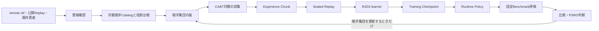

# 継続学習とオフライン対戦ベンチマークの設計・運用仕様

## 1. この文書の役割

この文書は、学習済みモデルを固定した対戦相手群へ対戦させ、環境で通用する見込みを一貫した方法で測る仕組みの正典です。新しい対戦相手やデッキを追加しながら学習を継続するための、設計、データの扱い、評価方法、運用手順を定めます。

| この文書に書くこと | この文書に書かないこと |
|---|---|
| 安定した設計、Artifact契約、評価方法、運用上の判断基準 | 実験結果、進捗、現在の勝率、提出履歴 |
| 実装の責務境界とCLIの用途 | 個別runのログや一時的なパラメータ変更 |
| 新しい相手を追加して学習を再開する手順 | Kaggle提出の実行手順 |

実行時の詳細なコマンドと引数は[Continuous League Runbook](../../runbooks/continuous-league.md)を参照します。現在の実験結果は`docs/status/`と`experiments/`に分離します。

### 1.1 目的と対象外

| 目的 | 対象外 |
|---|---|
| checkpointごとの強さを、同じ対戦相手集合で時系列比較する | 少数対戦の勝率から実環境の順位を断定すること |
| Team remote、`/agents`、`/dev`、公開Replay由来のデッキを安全に取り込む | 他者の方策を推測で複製すること |
| 相手集団の更新後も、来歴を保って学習を継続する | 学習結果からの自動Champion変更またはKaggle提出 |
| 学習で見た相手と見ていない相手を分けて報告する | 公開Replayの行動を教師ラベルとして直接学習すること |

## 2. 全体像

仕組みの中心は、可変な外部入力をそのまま学習へ流し込まず、検証済みの版付きArtifactへ順番に固定することです。

### 2.1 処理の責務

| 層 | 責務 | 入力 | 出力 | 変更してよいもの |
|---|---|---|---|---|
| Source intake | 外部資産の発見と資格確認 | remote ref、公開deck、既存台帳 | 資格結果、固定snapshot | Catalog候補だけ |
| Catalog | 実行可能な相手と用途を固定 | 資格済みasset、deck pool、役割台帳 | Catalog snapshot | 新しいentryの追加だけ |
| Collection | 固定相手集団との対戦を収集 | Runtime Policy、Population epoch | Experience Chunk | 新しいchunkだけ |
| Replay sealer | 学習入力を検証して固定 | Experience Chunk集合 | Sealed Replay | 新しいReplay versionだけ |
| Learner | 一つのReplayを使って学習 | Sealed Replay、設定 | Checkpoint、Runtime Policy | model状態だけ |
| Evaluation | Runtime Policyを固定ベンチで評価 | Benchmark、Exposure snapshot | Evaluation Result | game ledgerの追記だけ |
| Controller | 依存関係と資源枠を管理 | event、task inbox | subprocess task | queueとleaseだけ |

`Controller`はTorch model、CABT、remote Agentを同一processへ読み込みません。設定済みworker subprocessのtaskだけを起動し、Controller自身はArtifactと終了状態だけを扱います。Catalog更新と収集は明示CLIで実行するか、それらを実行するhandlerを明示設定した場合だけqueueへ載せます。

## 3. 用語と識別子

略語を増やさず、以下の用語を一貫して使います。

| 用語 | 意味 | 例 |
|---|---|---|
| 対戦相手Asset | 方策、デッキ、由来をまとめた候補 | remote上の`main.py`と`deck.csv` |
| 対戦相手instance | 実際に対戦する「方策×デッキ×runtime設定」 | 同じRule方策を別deckへ結び付けた相手 |
| Catalog | 実行を許可した対戦相手instanceの固定一覧 | `catalog_snapshot.json` |
| 役割台帳 | 相手を学習用・公開評価用・封印評価用へ割り当てる不変記録 | `role_ledger.json` |
| Population epoch | 学習時に抽選する相手分布の版 | `population_epoch.json` |
| Experience Chunk | 一回の収集で得た追記専用の系列集合 | `chunks/<id>/records.jsonl` |
| Sealed Replay | learnerが読む、検証済みで不変の系列集合。互換な外部R2D3 replayは来歴付きで一度だけ取り込める | `replays/<id>/manifest.json` |
| Training Checkpoint | 学習再開に必要な全状態 | model、optimizer、RNG、PER priority |
| Runtime Policy | 対戦評価に必要なmodelだけの状態 | weights、encoder、deck、行動規則 |
| Benchmark | 相手、席、反復数、deckを固定した対戦表 | `manifest.json` |
| Exposure snapshot | 学習済みかどうかを相手ごとに判定する記録 | `snapshot.json` |

### 3.1 Identityの原則

すべての固定Artifactは内容から計算したSHA-256系IDを持ちます。可変なbranch名、`latest`、作業ディレクトリ名は学習や評価のidentityに使いません。

| 対象 | identityに含めるもの | identityに含めないもの |
|---|---|---|
| 対戦相手instance | deck hash、policy hash、runtime設定 hash | branch名、表示名 |
| Sealed Replay | 採用chunk、系列、Population epoch | 作成者の端末、保存先 |
| Training Checkpoint | model、target、optimizer、scheduler、RNG、PER、Replay、Population | checkpointファイル名だけ |
| Runtime Policy | model、feature/action契約、deck、argmax規則 | optimizer、Replay、学習日時 |
| Evaluation Result | Runtime Policy、Benchmark、Exposure snapshot、game結果 | 実行順だけ |

同じIDの保存先に異なる内容を書こうとした場合は失敗させます。これは、停止後の再開と比較の再現性を守るためです。

## 4. 対戦相手の取り込みと分割

### 4.1 取り込み元の扱い

| 取り込み元 | deckの扱い | policyの扱い | 表示・利用上の注意 |
|---|---|---|---|
| Team remoteのAgent | refをcommit固定して隔離実行 | 資格確認を通った実装 | native runtimeとして扱う |
| Team remoteのdeckだけ | exact 60枚deckを固定 | ローカルのRule Agent v0 | 「deck忠実・ローカル方策」と明記する |
| `origin/dev`配下のdeck | exact 60枚deckを固定 | ローカルのRule Agent v0または資格済みsnapshot | 元のnative policyとは表現しない |
| Kaggle公開Replay | 観測できたexact 60枚deckを固定 | ローカルのRule Agent v0または資格済みsnapshot | 公開Replayの行動を教師ラベルにしない |
| 過去の自モデル | checkpointからRuntime Policyを生成 | 生成時のmodel | self snapshotとして来歴を保存する |

過去の自モデルは`runtime_policy`形式の対戦相手としてCatalogへ登録します。候補側と相手側は別々のmodel instanceとして読み込み、相手のRuntime Policyに埋め込まれたdeckがCatalogのdeckと一致しない場合は対戦を開始しません。同じ最終modelだけを自己対戦させず、学習途中の複数世代を残して方策の時間的な多様性を持たせます。

### 4.2 資格確認

新しいremote Agentは、実行可能Catalogへ入れる前に次を満たす必要があります。

| 確認項目 | 要件 |
|---|---|
| 固定方法 | refをcommit固定し、隔離snapshotから実行する |
| 対戦席 | subject firstとsubject secondの両方を実行する |
| 正常終了 | callback crash、illegal action、timeoutを記録し、失敗時は資格を与えない |
| 来歴 | source commit、policy hash、deck hash、entrypointを保存する |
| 権限 | 許可されたremoteだけを明示fetchする。checkout、commit、pushはしない |

### 4.3 役割台帳

Catalog entryには以下の役割を与えます。役割はAsset単位ではなく、deck、policy、sourceのいずれかを共有する連結成分単位で固定します。これにより、同じdeckや派生policyが学習とholdoutの両方へ漏れることを防ぎます。

| role | 学習への利用 | 日常評価 | 封印評価 | 用途 |
|---|---:|---:|---:|---|
| `TRAINING_ACTIVE` | 可 | 可 | 不可 | 現在の学習用相手 |
| `TRAINING_RESERVE` | 不可 | 可 | 不可 | 将来の学習候補 |
| `BENCHMARK_VISIBLE` | 不可 | 可 | 不可 | 繰り返し見る公開ベンチ |
| `BENCHMARK_SEALED` | 不可 | 不可 | 可 | 昇格判断だけに使う封印ベンチ |
| `CALIBRATION_ONLY` | 不可 | 校正だけ | 不可 | offlineとPublic scoreの対応観測 |

新しいAssetが既存のdeck、policy、source、親policyのどれかを共有する場合は、既存の役割を継承します。既存のholdoutを学習側へ移すために台帳を並べ替えてはいけません。

## 5. 学習データとReplayの契約

### 5.1 Experience Chunk

収集は固定されたRuntime PolicyとPopulation epochから行います。各系列には、少なくとも次を記録します。

| 分類 | 保存する情報 |
|---|---|
| 対戦ID | game ID、Population epoch、opponent instance、席、結果 |
| 行動 | 公開状態、合法行動集合、選択行動、報酬、discount、terminal |
| 方策来歴 | behavior Runtime Policy、相手policy/deck/source、抽選確率 |
| 学習可否 | multi-select境界、sequence分割、demonstrationかどうか |

観測にはActorInformationViewで利用可能な公開情報だけを使います。相手の非公開手札、山札の将来順序、乱数結果をmodel入力やラベルへ入れてはいけません。

### 5.2 Sealed Replay

Experience Chunkは直接learnerへ渡しません。Sealerが完結性、hash、行動契約、Population epochを確認してからSealed Replayを発行します。

| Sealed Replayの性質 | 理由 |
|---|---|
| 内容は不変 | update間で学習対象が変わることを防ぐ |
| 親Replayを参照できる | Population更新後も旧系列を保持できる |
| priorityはcheckpointに保存する | strict resumeで同じサンプリング状態を復元する |
| learner outputへ入力をコピーする | `/tmp`消失や入力パス変更後も再開できる |

同じReplayを更新だけ繰り返しても、新しい経験は増えません。運用では、収集数、sealされた系列数、Replay内の相手分布を監視し、古いReplayだけを無期限に反復しないことを原則とします。

互換な外部R2D3 replay を初期経験として取り込む場合は、source manifest と replay checksum、state/action の次元、合法 action、有限値、行動由来を検証する。取り込み後の Replay は source の版と hash を manifest に固定する。Kaggle 公開 Replay の action は教師ラベルとして取り込まない。sequence を別形式へ再展開せず、検証済み replay 本体を一度だけ保存する。

### 5.3 初期Replayの構成

初期Replayは一つの相手方策へ偏らせず、既存の互換Replayと追加収集を一つのSealed Replayへまとめます。収集数はrun manifestへ固定し、各区分の対戦数、系列数、席順、相手instance数を後から確認できるようにします。

| 区分 | 主な相手 | 目的 | 注意点 |
|---|---|---|---|
| 既存の互換Replay | 資格済みAgent、Rule、固定deck | 過去の有効な対戦を再利用する | 内訳を監査し、不足区分の代用にしない |
| Rule v0 | 現行の外部deck pool | deckごとの盤面多様性を増やす | native policyを再現したとは表現しない |
| Rule v1 | 固定した代表deck | Rule v0以外の決定規則を加える | Rule v0の件数へ埋没しないよう別stratumにする |
| 履歴モデル対戦 | 複数checkpointのRuntime Policy | 過去世代へのbest responseと循環的な弱点を学ぶ | 最終modelと同一重みの対戦だけにしない |

追加収集は区分ごとにMixtureを固定してよいものとしますが、すべて同じ新しいPopulation epochへ束縛します。Sealerは全区分のcomplete chunkと親Replayを一度に結合し、結合完了と再読込検証後にだけ再生成可能な中間gameを削除します。

## 6. 学習方式

### 6.1 R2D3 learner

learnerは、合法行動の中から期待値が最大の行動を選ぶ再帰型の分布価値モデルを学習します。モデルはQ値の一点予測ではなく、将来報酬の分布を51個のatomで表します。

| 要素 | 方式 | 意図 |
|---|---|---|
| 行動候補 | CABTが返す合法行動だけ | 不正行動を候補にしない |
| 状態 | 公開状態のfeature | 非公開情報の混入を防ぐ |
| 時系列 | GRUとburn-in付き系列更新 | 手札・盤面の履歴依存を扱う |
| TD target | Double-Q、n-step return | valueの過大評価を抑え、遅い報酬を伝える |
| 優先サンプリング | TD errorに基づくPrioritized Experience Replay | 学習効果の高い系列を多く使う |
| 安定化 | target network、gradient clipping、非有限値のfail-closed | 長時間更新の破綻を検出する |
| 補助損失 | 相手、deck family、次行動種別の予測 | 表現に対戦文脈を持たせる |

既定設定は[default.yaml](../../../configs/continuous_league/default.yaml)を正とします。設定を変える場合は、新しい学習identityとして扱います。

| 既定項目 | 値 | 意味 |
|---|---:|---|
| batch size | 32 | 1 updateで読む系列数の上限 |
| learning rate | 0.0001 | AdamWの学習率 |
| n-step | 5 | TD targetに含める将来step数 |
| target update interval | 250 | target networkの同期間隔 |
| checkpoint interval | 10,000 updates | benchmark比較に用いるRuntime Policyと、再開可能なcheckpointの発行間隔 |
| device | CPU | 標準の学習実行先 |

### 6.2 GPU高速プロファイル

十分なVRAMがある単一GPUでは、[gru256_cuda_fast.yaml](../../../configs/continuous_league/gru256_cuda_fast.yaml)を長時間学習用の高速プロファイルとして使用できます。既定CPU設定を置き換えるものではなく、同じSealed Replayを別の学習identityで最初から学習する設定です。

| 項目 | 値 | 既定CPU設定との整合 |
|---|---:|---|
| model hidden size | 256 | モデル容量を増やすため別identity |
| batch size | 512 | 1 update当たりの系列数を16倍にする |
| learning rate | 0.0004 | batch sizeに対する平方根則 |
| target update interval | 16 updates | 約8,192系列ごと。既定の約8,000系列と同程度 |
| PER beta steps | 12,500 updates | 6.4M系列でbeta=1。既定と同じ系列予算 |
| precision | BF16 | 数値計算が変わるため別identity |
| optimizer | fused AdamW | optimizer実装が変わるため別identity |
| replay配置 | CPU prepack＋pinned転送 | WSLのhost commitを過剰に消費せず、入力tensorとPER抽選規則を保つ |

高速化は、学習意味論を変える処理と実行方法だけを変える処理を分けます。

| 処理 | 契約 |
|---|---|
| Replay prepack | 全系列を一度だけcompactなNumPy配列へ変換する。参照batchとtensor単位で一致させる |
| GPU常駐Replay | 固定ReplayをGPUへ配置し、updateごとは抽選indexだけを転送する |
| PER sampling | priority更新を各update後に反映し、先読みqueueを使わない |
| burn-in | 系列ごとの反復呼出しを一括recurrent callへ変換し、最終hidden stateを一致させる |
| metric同期 | loss、TD error、priorityなどを一度のGPU同期でCPUへ集約する |
| pinned arena | GPU常駐を使わない場合だけ、再利用する固定CPU領域から転送する |

`prepack_replay`、`resident_replay`、`pin_memory`は入力tensorと抽選順序を変えない実行設定なので、単独変更では学習identityを変えません。batch size、model設定、BF16、fused optimizer、matmul precisionなど数値結果を変えうる設定はidentityへ含めます。`gru256_cuda_fast.yaml`はWSL長時間運用で実測済みのprepack＋pinned転送を使い、`resident_replay: false`とします。GPU常駐ReplayはVRAMだけでなくWindows側のhost commitも大きく消費するため、専用ホストでhost commitの余裕を別途確認した実験に限定します。

### 6.3 CheckpointとRuntime Policyの分離

| Artifact | 含むもの | 用途 | 含めないもの |
|---|---|---|---|
| Training Checkpoint | model、target、optimizer、scheduler、RNG、PER priority、Replay/Population identity | 学習の再開 | 評価専用の可変状態 |
| Runtime Policy | model weights、model設定、state/action契約、deck、argmax/tie-break規則 | 候補側または履歴モデル相手としての対戦収集・評価 | optimizer、Replay、RNG、PER |

同じReplayとPopulation epochに対する再開はstrict resumeです。入力identity、model設定、学習設定、checkpointのいずれかが異なる場合は失敗させます。

## 7. 評価設計

### 7.1 BenchmarkとExposure

Benchmarkは「誰と、どのdeckで、両席を何回ずつ対戦するか」を固定します。Exposure snapshotは、そのBenchmarkの各相手が学習データに含まれていたかを分類します。

| Benchmark | 相手 | 目的 | 繰り返し利用 |
|---|---|---|---:|
| Visible benchmark | `TRAINING_ACTIVE`、`TRAINING_RESERVE`、`BENCHMARK_VISIBLE` | 学習中の比較と診断 | 可 |
| Sealed benchmark | `BENCHMARK_SEALED` | 昇格候補の最終確認 | 不可 |
| Rolling meta benchmark | 新しく固定した公開・remote snapshot | 現在環境への追従確認 | versionごとに可 |
| Anchor benchmark | 固定された代表相手 | checkpoint間の長期比較 | 可 |

| Exposure cohort | 意味 |
|---|---|
| `EXACT_KNOWN` | 同じdeck-policy pairを学習に利用した |
| `KNOWN_DECK_NOVEL_POLICY` | deckは既知だがpolicyが未知 |
| `NOVEL_DECK_KNOWN_POLICY` | policyは既知だがdeckが未知 |
| `NOVEL_DECK_KNOWN_ARCHETYPE` | exact deckは未知だがarchetypeは既知 |
| `NOVEL_ARCHETYPE` | archetypeが学習外 |
| `FULLY_UNTOUCHED` | deck、policy、sourceのすべてが学習外 |

### 7.2 対戦表と集計

各対戦は`Benchmark × Runtime Policy × Subject deck × Opponent instance × Seat × Repetition × Execution block`で一意に識別します。両席を同数にし、中断後は完了済みgame keyを再実行しません。

| 指標 | 定義 | 用途 |
|---|---|---|
| game-weighted score | win=1、draw=0.5、loss=0の全局平均 | 全体の平均性能 |
| opponent-equal score | 相手ごとのscoreを等重みで平均 | 頻出相手だけへの偏りを抑える |
| worst-opponent score | 相手ごとの最低score | 苦手対面の検出 |
| Wilson 95% interval | score rateの区間推定 | 少数対戦の不確実性表示 |
| fault count | crash、timeout、illegal actionなどの件数 | 性能集計と分離した安全性判定 |

CABT engineの乱数をschedule seedだけで固定できない限り、candidateとbaselineを「同一乱数の完全paired比較」とは呼びません。比較時は相手、deck、席、反復blockを揃え、block bootstrapで差の不確実性を出します。

### 7.3 評価と学習の境界

- Visible benchmarkを繰り返し見た場合、その相手はmodel選択に使われた相手として扱います。
- Sealed benchmarkは一度使ったらconsumption markerを残し、同じholdoutを再利用しません。
- faultを含む評価は`FAULTED`として保存し、有効な勝率へ混ぜません。
- benchmarkの変更とモデルの変更を同じ比較へ混ぜません。相手集合が変わった場合は、共通Anchorで時系列を接続します。

### 7.4 Checkpoint監視と採用再確認

checkpoint監視は、学習とは別processのControllerとtask workerで行います。Learnerはcheckpoint eventを発行するだけで、評価完了を待ちません。Controllerはeventごとに一つのvisible evaluation taskを永続queueへ入れ、明示的な上限がない限り中間checkpointを間引きません。

| 用途 | 局数 | 実行 | 保存先 | 判断 |
|---|---:|---|---|---|
| Anchor監視 | 512 | 各checkpoint | `checkpoint_history/evaluation_history.jsonl` | 学習中の時系列比較 |
| 採用再確認 | 1,024 | 人が候補を指定 | 独立したEvaluation Result | 採用候補の確認。自動昇格しない |

Anchor監視では、固定した4相手、subjectの両席、固定seed、64反復で512局とする。`evaluation_history.jsonl`は不変の正本であり、`evaluation_summary.json`はそこから再構成する。summaryは各checkpointの全体score、Wilson 95%区間、相手均等score、最悪相手score、fault数、直前の完全評価からの差、最新と最高の完全評価を持つ。

1,024局の採用再確認は、512局と異なるBenchmark Manifestとして固定する。同じ相手集合、deck、seed規則を維持したまま反復数だけを128へ増やす。可視Anchorと再確認結果は、sealed holdout、Champion変更、Kaggle提出を自動で引き起こさない。

## 8. 相手集団の更新と学習継続

### 8.1 strict resumeとrollover

| 状況 | 許可する操作 | 禁止する操作 |
|---|---|---|
| ReplayとPopulationが同じ | 同じcheckpointからstrict resume | 他Replayへの強制resume |
| 新しい相手をCatalogへ追加しただけ | 資格確認・role継承・bootstrap収集 | 直ちに学習分布へ混入 |
| Populationを更新する | 新epoch、親Replay付きseal、rollover manifestを作る | 旧optimizer/PERを無検証で持ち込む |
| 新epochで学習を開始する | model/targetを継承し、scheduler/RNG/PERをresetして再開 | epoch identityを省略したresume |

### 8.2 rolloverの手順

1. 新しいremote refまたはdeckを発見する。
2. 資格確認を行い、Catalogとrole ledgerを新versionとして生成する。
3. 新しい相手を両席で最低1局ずつ収集する。
4. 旧Replayを親にして、新chunkを含むReplayをsealする。
5. 新旧Population、両席coverage、global stepを含むrollover manifestを作る。
6. modelとtargetを継承した新checkpointを発行する。
7. `population_transition_id`をresume identityとして、新epochのlearnerを開始する。

optimizerを継承するかは明示的に選択します。scheduler、process RNG、旧ReplayのPER priorityは新epochでresetします。これにより、新相手の少数系列が古いpriority構造に埋もれることを防ぎます。

### 8.3 PSROによる更新判断

PSROは、候補相手を増やすかを決める外側の手続きです。learnerの勾配更新やReplay管理は行いません。

| 判定条件 | 採用に必要な状態 |
|---|---|
| meta improvement | 0より大きい |
| 独立評価の改善 | 0より大きい |
| runtime品質 | faultが0 |
| 新規性 | 既存相手の単なる重複ではない |
| 過適合 | 単一相手だけへの過適合がない |

一つでも満たさない場合はPopulationを更新しません。

## 9. 長時間運用

### 9.1 実行単位

無期限の一つのprocessとして扱わず、以下の有限で再開可能な単位をつなげます。

| 単位 | 開始条件 | 完了Artifact | 次の操作 |
|---|---|---|---|
| 収集 | Runtime PolicyとPopulation epochが固定済み | Experience Chunk | seal |
| 学習 | Sealed Replayが存在 | Checkpoint、Runtime Policy、event | 評価またはstrict resume |
| 評価 | Runtime Policy、Benchmark、Exposureが固定済み | Evaluation Result | compare/report/PSRO |
| rollover | 新相手の両席chunkと新Populationが存在 | transition manifest、新checkpoint | 新epochでlearn |

各長時間runnerは、TTYでは1本の更新型progress barを使用します。非TTYでは進捗を10秒程度の集約値だけにし、詳細は`progress_summary.json`とArtifactへ保存します。局ごと、updateごとの行ログを端末へ流しません。

### 9.2 標準運用順

| 順番 | CLI | 固定する入力 | 主な出力 |
|---:|---|---|---|
| 1 | `qualify-ref` | remote ref | qualification ledger、snapshot |
| 2 | `build-catalog` | qualification ledger、deck pool、role ledger | catalog snapshot |
| 3 | `build-population` | catalog snapshot | Population epoch、mixture |
| 4 | `collect` | Runtime Policy、Catalog、mixture | Experience Chunk |
| 5 | `seal` | chunk manifest、Population epoch | Sealed Replay |
| 6 | `learn` | Sealed Replay、Population epoch、設定 | checkpoint、Runtime Policy、event |
| 7 | `build-exposure`、`evaluate` | Catalog、Benchmark、Runtime Policy | Evaluation Result |
| 8 | `compare`、`report`、`psro-decide` | 評価結果、payoff | 比較・更新判断 |
| 9 | `rollover-manifest`、`rollover-apply` | 新旧epoch、bootstrap chunk、checkpoint | 新epoch checkpoint |

`learn`は開始時に入力Replayをoutput配下の`replay_inputs/`へコピーします。再開はこの永続コピーを使い、`/tmp`をCatalog、Replay、checkpoint、learner outputの保存先にしてはいけません。

### 9.3 停止・再開・失敗時の扱い

| 事象 | 期待する扱い |
|---|---|
| 正常停止要求 | 現在update後にcheckpointと`STOPPED`状態を書いて終了する |
| learnerの非有限loss/gradient/TD error | fail-closedで停止し、更新を続けない |
| source資格化のcrash/illegal/timeout | 対象をCatalogへ入れない |
| 評価workerの失敗 | faultをgame ledgerへ保存し、成功結果へ置換しない |
| 入力hashの不一致 | strict resumeを拒否する |
| controllerの停止 | queue/lease/task resultから再開し、worker本体の状態を推測しない |

## 10. Public scoreとの関係

オフライン勝率はPublic scoreの直接推定値ではありません。matchmaking、対戦数、相手分布、提出runtimeが異なるためです。

| 段階 | 扱い |
|---|---|
| 観測不足 | offline benchmarkは候補比較だけに使う |
| 複数の独立Runtime PolicyとPublic score観測がある | 観測値をCalibration registryへ登録する |
| 30以上の独立Policyがそろう | leave-one-policy-outを用いてisotonic calibrationを評価する |
| 校正が不十分 | `OBSERVATION_ONLY`として、Public score予測を意思決定の根拠にしない |

校正用のPublic score観測を記録しても、Kaggle提出を自動実行してはいけません。提出は別途の明示承認を必要とします。

## 11. 実装の対応表

| 責務 | 実装 | 主要CLI |
|---|---|---|
| 共通hash・atomic write・契約違反 | `continuous_league/contracts.py` | 全コマンド |
| Catalogと相手instance | `continuous_league/catalog.py` | `build-catalog`、`build-runtime-catalog` |
| role ledger | `continuous_league/role_ledger.py` | `build-catalog` |
| BenchmarkとExposure | `continuous_league/benchmark.py` | `build-benchmark`、`build-exposure` |
| CABT収集とchunk | `continuous_league/cabt.py`、`collector.py`、`experience.py` | `collect` |
| Sealed Replay | `continuous_league/replay_sealer.py` | `seal` |
| 継続learner | `continuous_league/learner_service.py` | `learn` |
| Runtime Policy発行 | `continuous_league/checkpoint_stream.py` | `learn`、`publish` |
| CABT評価と比較 | `continuous_league/evaluation.py` | `evaluate`、`compare`、`report` |
| Population epochとrollover | `continuous_league/population_epoch.py` | `build-population`、`rollover-*` |
| PSRO判断 | `continuous_league/psro_manager.py` | `psro-decide` |
| source refreshと資格化 | `continuous_league/source_intake.py`、`qualification.py` | `refresh-sources`、`qualify-ref` |
| durable task queue | `continuous_league/controller.py` | `controller`、`task-worker` |

## 12. 完了条件

この仕組みを使って得た性能比較を判断材料にするには、少なくとも次を満たす必要があります。

- Catalog、Population epoch、Replay、Runtime Policy、Benchmark、Exposure snapshotがすべてhash照合済みである。
- 学習、評価ともfault、illegal action、timeoutを別集計し、勝率へ隠さない。
- 評価は両席を含み、対戦数とWilson区間を報告する。
- checkpointのstrict resumeでmodel、target、optimizer、scheduler、RNG、PER priorityを復元できる。
- Population更新では新相手の両席bootstrapを確認し、rollover manifestを残す。
- Sealed benchmarkは再利用しない。
- Public score校正が未達なら、オフライン評価をPublic score予測と表現しない。

## 13. 参照先

| 目的 | 参照先 |
|---|---|
| この仕組みの実行手順 | [Continuous League Runbook](../../runbooks/continuous-league.md) |
| 全体の提出critical path | [00｜全体設計](00_overall_plan.md) |
| 学習モデル一般の設計 | [03｜機械学習・教師／生徒](03_machine_learning_teacher_student_plan.md) |
| 評価・提出の上位Gate | [05｜評価・提出・Strategy](05_evaluation_submission_and_strategy_plan.md) |
| 旧設計案と詳細な検討履歴 | [06｜旧設計案](../proposals/06_continuous_training_and_offline_league_benchmark_plan.md) |
| 旧実装案とschema詳細 | [06｜旧実装案](../proposals/06_continuous_training_and_offline_league_benchmark_implementation_plan.md) |
