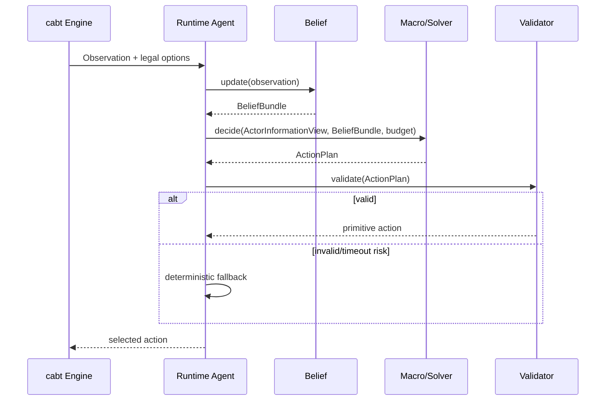
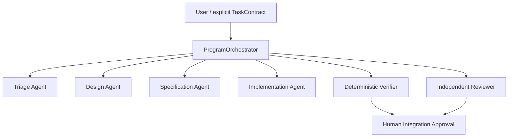
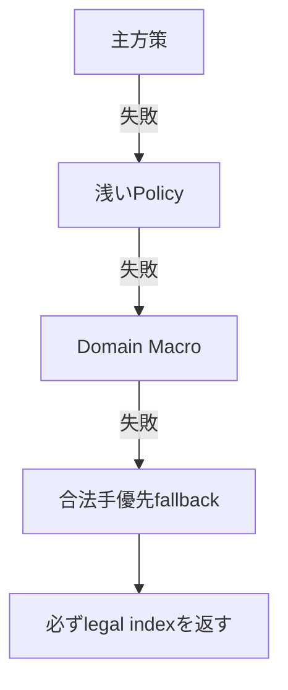

# MAGE-PTCG 全体実装計画書

## 1. 目的

本書は、MAGE-PTCG全体をリポジトリ、モジュール、データ契約、CLI、設定、テスト、Artifactへ分解し、各担当AIが追加の設計判断なしで実装を開始できる状態にするための正典です。

### 1.1 改訂実装方針と現在の基盤（2026-07-14 第三者レビュー反映）

完成単位は「入力から評価まで通るVertical Slice」とする。各Sliceを独立branch／worktreeで実装し、Bootstrap Kernelで検証・承認後に統合する。各Sliceは、E2E fixture、unit／contract／integration／regressionテスト、Artifactとresolved config、failure injection／rollback、簡潔なhandoffを備える。空packageやinterfaceだけを先に量産しない。

現在の基盤（詳細は[../../status/current_status.md](../../status/current_status.md)）：

- Bootstrap Kernel：完了（隔離worker、patch capture、clean verification、承認、crash-resume）
- Rule Agent v0：統合済み、現Champion
- Public Belief Decision Loop v0：実装・実cabt 400試合評価済み、独立監査・統合待ち
- Rule Agent v1：Rule v0へ105–95で非昇格
- focused tests 99 pass、repository tests 345 pass（2026-07-14時点の報告値）
- privacy／reset／no-state-leak：確認済み

---

## 2. リポジトリ構成

```text
mage-ptcg/
├── pyproject.toml
├── README.md
├── AGENTS.md
├── configs/
│   ├── orchestration.toml
│   ├── gates.toml
│   ├── model_profiles.toml
│   ├── base.yaml
│   ├── runtime/
│   ├── solver/
│   ├── training/
│   ├── league/
│   └── evaluation/
├── src/mage_ptcg/
│   ├── contracts/
│   ├── cards/
│   ├── domain/
│   ├── decks/
│   ├── belief/
│   ├── macros/
│   ├── solver/
│   ├── models/
│   ├── training/
│   ├── league/
│   ├── competition/
│   ├── runtime/
│   ├── evaluation/
│   └── reporting/
├── scripts/
│   ├── orchestrate.py
│   └── orchestration/
├── tests/
│   ├── unit/
│   ├── contract/
│   ├── integration/
│   ├── regression/
│   └── soak/
├── data/
├── artifacts/
├── experiments/
├── .orchestrator/
└── docs/
```

---

## 3. モジュール責務

| package | 責務 | 禁止事項 |
|---|---|---|
| `contracts` | cabt/Kaggle/Artifact契約 | ゲーム戦略を持たない |
| `cards` | Card IR、probe、検証fixture | 未検証効果でexact枝刈りしない |
| `domain` | KO、Prize、Energy、Evolution解析 | hidden truthへ直接アクセスしない |
| `decks` | Deck Profile、Grammar、生成・修復 | 60枚制約違反を出力しない |
| `belief` | Exact Constraint、SMC、Player Model | Actor Viewへ相手privateを漏らさない |
| `macros` | abstract action生成・コンパイル | solve中にaction dimensionを変更しない |
| `solver` | public tree、ES-MCCFR、safe resolving | Student固定混合をTeacher正典にしない |
| `models` | encoder/head/runtime推論 | Dataset生成責務を持たない |
| `training` | target生成、学習、蒸留 | Kaggle rawを直接教師正解扱いしない |
| `league` | population、PSRO、self-play | 評価用holdoutを学習へ混ぜない |
| `competition` | replay取得、meta、surrogate | 非公開情報・accidental secretを使わない |
| `runtime` | budget、fallback、agent entrypoint | hard deadlineを超過しない |
| `evaluation` | tournament、統計、Gate | 生のlive ratingだけで昇格しない |
| `reporting` | Strategy証拠と図表 | 再現不能な数値を掲載しない |

---

## 4. 共通データ型

```python
from dataclasses import dataclass
from typing import NewType

EpisodeId = NewType("EpisodeId", str)
SubmissionId = NewType("SubmissionId", str)
CardId = NewType("CardId", int)
PublicStateHash = NewType("PublicStateHash", str)
InformationSetKey = NewType("InformationSetKey", str)
ActionKey = NewType("ActionKey", str)
ArtifactId = NewType("ArtifactId", str)
ConfigHash = NewType("ConfigHash", str)
```

すべての主要Artifactに以下を付与します。

```python
@dataclass(frozen=True)
class Provenance:
    artifact_id: ArtifactId
    schema_version: str
    code_commit: str
    config_hash: ConfigHash
    source_ids: tuple[str, ...]
    created_at: str
    random_seed: int | None
```

### 4.1 共通契約（C1で導入、2026-07-14改訂）

システム横断の入力契約はActorInformationView、行動同一性はStable ActionKeyとします。

```python
@dataclass(frozen=True)
class ActorInformationView:
    actor: int
    public_state: PublicState
    own_private_state: OwnPrivateState
    limited_knowledge: LimitedKnowledge
    visible_history: tuple[GameEvent, ...]
    action_snapshot: ActionSetSnapshot
    remaining_time_ms: int | None
```

```python
@dataclass(frozen=True)
class ActionKey:
    selection_type: int
    context: int | None
    option_type: int | None
    semantic_operation: str
    source_entity_key: str | None
    target_entity_key: str | None
    card_id: int | None
    canonical_payload: tuple[tuple[str, JsonValue], ...]
    digest: str
```

structured fieldsを同一性の真値とし、`digest`は索引用とします。§4の`ActionKey = NewType("ActionKey", str)`はこのdigest文字列に対応し、構造化`ActionKey`が正典です。[02_structured_public_belief_and_solver_implementation_plan.md](02_structured_public_belief_and_solver_implementation_plan.md)の§3にあるfield粒度のActorInformationViewは、この共通契約を満たす内部詳細設計として扱います。

---

## 5. イベント駆動パイプライン



Runtimeの各callbackは次の順序を固定します。

1. Observation schema検証
2. ExactConstraint更新
3. Belief更新または復旧
4. 残り時間からBudget決定
5. Book/Cache照会
6. Policy/Macro/Solver実行
7. cabt合法性検証
8. fallback
9. telemetry保存

---

## 6. 設定管理

Hydra互換またはPydantic Settingsで構造化します。

```yaml
runtime:
  tier: B
  hard_deadline_margin_ms: 50
  fallback_policy: deterministic_domain

belief:
  runtime_particles: 32
  ess_ratio_threshold: 0.35
  open_world_mass_min: 0.05

solver:
  algorithm: external_sampling_mccfr
  iterations_min: 32
  iterations_max: 256
  max_tree_nodes: 2000

model:
  backend: onnxruntime
  quantization: int8
```

規則：

- 実験ごとにresolved configを保存する。
- config変更はArtifact IDへ含める。
- secretはconfigへ直書きしない。
- runtime用configはtraining configと分ける。

---

## 7. CLI設計

```text
mage-ptcg capability probe
mage-ptcg cards build-ir
mage-ptcg cards verify --priority P0
mage-ptcg decks analyze <deck-file>
mage-ptcg belief replay <episode>
mage-ptcg solver validate-small-games
mage-ptcg train teacher
mage-ptcg train student
mage-ptcg league run
mage-ptcg competition ingest
mage-ptcg competition analyze-meta
mage-ptcg evaluate paired --agent-a ... --agent-b ...
mage-ptcg submission build
mage-ptcg submission validate
mage-ptcg report build-strategy
```

各CLIは終了コード、JSON summary、Artifact pathを返します。

---

## 8. 成果物レジストリ

```text
artifacts/
├── cards/<version>/
├── decks/<version>/
├── beliefs/<version>/
├── models/<model_id>/
├── solver_runs/<run_id>/
├── league/<snapshot_id>/
├── competition/<snapshot_id>/
├── evaluations/<eval_id>/
└── submissions/<submission_id>/
```

最低metadata：

```yaml
artifact_id:
type:
schema_version:
code_commit:
config_hash:
parents: []
metrics: {}
created_at:
status: candidate | verified | promoted | rejected
```

---

## 9. インターフェース契約

### 9.1 実行時エージェント

```python
class Agent(Protocol):
    def initialize(self, context: RuntimeContext) -> None: ...
    def act(self, observation: Observation) -> int: ...
    def shutdown(self) -> None: ...
```

`act()`は必ずlegal option indexを返し、例外を外へ漏らしません。

### 9.2 意思決定サービス

```python
@dataclass
class DecisionRequest:
    actor_view: ActorInformationView
    belief: BeliefBundle
    legal_options: tuple[LegalOption, ...]
    budget: DecisionBudget

@dataclass
class DecisionResult:
    option_index: int
    source: str
    confidence: float
    elapsed_ms: float
    fallback_level: int
```

---

## 10. AI実装Control Plane

AI実装担当を常駐Lead Agentが統括する構成ではなく、Python製の決定論的Control Planeが必要なworkerを単発起動します。



ProgramOrchestratorはAIモデルではなく、次を担当します。

- run stateとGate選択
- riskの決定論的な再分類
- provider routing
- path/command policy
- approval digest
- clean verification worktree
- authoritative test
- patch integrationの停止・再開

高性能モデルは常駐しません。各stageで必要なcontextだけを受け取り、構造化結果を返した時点で終了します。

最初から全layerを実装せず、[`bootstrap_kernel_implementation_plan.md`](../../agent/ai_orchestrator/bootstrap_kernel_implementation_plan.md)のKernelを直接実装し、そのKernelへ残りのOrchestrator機能を実装させます。

## 11. 継続的インテグレーション・パイプライン

### プルリクエストごと

1. lint / type check
2. unit test
3. contract test
4. small deterministic integration
5. information-leak test
6. Artifact schema test

### nightly

- cabt regression
- Kuhn/Leduc solver validation
- 1,000-game smoke tournament
- belief collapse fuzz
- package build
- replay ingestion canary

### release candidate

- 100,000-game soak
- cold start
- official-like environment
- memory/latency profiling
- paired Champion comparison

---

## 12. エラー処理

```python
class MageError(Exception): ...
class ContractError(MageError): ...
class BeliefCollapseError(MageError): ...
class SearchBudgetExceeded(MageError): ...
class InvalidPlanError(MageError): ...
class ArtifactCompatibilityError(MageError): ...
```

Runtimeでは例外を分類してtelemetryへ残し、必ずfallbackへ遷移します。



---

## 13. 実装順序

### 13.1 Bootstrap Kernel

Bootstrap KernelをMAGE本体より先に実装します。ただし、完全版OrchestratorをG0の前提にはしません。

| Phase | 実装 | 目安工数 | 完了条件 |
|---|---|---:|---|
| BK0 | schema、state、policy固定 | 2〜4時間 | 明示的TaskContractを検証可能 |
| BK1 | event log、snapshot、fake/real provider 1種 | 4〜8時間 | 1 workerを隔離起動可能 |
| BK2 | patch capture、clean verification、承認、resume | 4〜8時間 | Kernel自身のR1変更を1件統合可能 |

BK0〜BK2をBootstrap Kernelと定義します。

### 13.2 Self-hosted Expansion

Bootstrap Kernelを用いて、次をWorkOrderとして追加します。

1. Triage Agent
2. Design Agent
3. Specification Agent
4. acceptance lifecycle
5. risk再分類
6. DESIGN_REUSE事後検証
7. role/risk別provider routing
8. token使用量記録
9. R2独立監査
10. R3理論監査・独立反証
11. Artifact Registryとevidence bridge
12. sandbox・並列性の強化

### 13.3 MAGE本体

Kernelが最小完了条件を満たした時点で、G0の未達Gate Itemを最初のMAGE WorkOrderとして投入します。

| MAGE Phase | 実装 | 統合Gate |
|---|---|---|
| 0 | contracts、logging、minimal agent | accepted submission |
| 1 | cards/domain/deck profile | fixed-deck baseline |
| 2 | belief/macros/evaluation | replay reproducibility |
| 3 | solver | small-game convergence |
| 4 | models/training | offline improvement |
| 5 | league/deck optimization | balanced tournament |
| 6 | competition intelligence | temporal holdout |
| 7 | runtime compiler/reporting | final soak |

G0期限は2026-07-13のままです。Bootstrap Kernel先行によって遅延した場合は、Gateを通過したことにせず実達成日時を記録します。R2/R3 AI reviewが未実装の期間は、検証免除ではなく`ManualReviewSubstitution`を必須とします。

### 13.4 改訂実装ロードマップ（P0／C1〜C5、2026-07-14）

13.3のMAGE Phase 0〜7直列は、[../design/00_overall_plan.md](../design/00_overall_plan.md)の§9に従い、次のSlice構成へ読み替えます。日付付きGateは同§9の表を正とします。

**P0｜Continuous Submission Baseline（全期間継続）**

- Rule v0 Tier D builder、First Legal Tier E builder
- official `agent()` entrypoint、deck loader
- dependency lock、deterministic package、checksum
- option type 12を含む全context fixture
- clean import、one-game dry run、100-game smoke
- rollback package

Gate：任意commitから30分以内に提出packageを再現できる。Submission Factoryを最終工程だけにしない。

**C1｜Public Belief Audit and Merge**

- patch独立監査（DecisionState／ActorInformationView境界、PublicBelief reset、hidden truth leakage）
- deterministic trace、Stable ActionKey最小版
- Rule v1非昇格結果の固定、Rule v0 Champion維持
- clean verificationとrollback可能な統合

**C2a｜Knowledge Pack v0** … [01_domain_knowledge_and_deck_strategy_implementation_plan.md](01_domain_knowledge_and_deck_strategy_implementation_plan.md)の§1.1

**C2b｜Competition Probe** … [04_kaggle_competition_intelligence_and_joint_optimization_implementation_plan.md](04_kaggle_competition_intelligence_and_joint_optimization_implementation_plan.md)の§1.1

**C3｜Bounded Search** … [02_structured_public_belief_and_solver_implementation_plan.md](02_structured_public_belief_and_solver_implementation_plan.md)の§1.1

**C4｜Student v0**（2026-07-30 GO／NO-GO）／**C5｜Distillation・League-lite** … [03_machine_learning_teacher_student_implementation_plan.md](03_machine_learning_teacher_student_implementation_plan.md)の§1.1

Slice単位のCLI最小集合（§7の`mage-ptcg`体系へ統合するまでの暫定名。実装時に§7と統一する）：

```text
project runtime build --tier D
project runtime validate-submission
project runtime dry-run
project contracts inspect-actions
project knowledge build-snapshot
project competition capability-probe
project search bounded-eval
project train student-v0
project evaluate paired
project evaluate runtime-profile
project submission soak
project promotion evaluate
```

## 14. 完了の定義

- すべてのpackageにowner、public API、schema versionがある。
- main branchから再現可能に環境構築できる。
- configとArtifactの親子関係を追跡できる。
- runtimeは例外時にもlegal actionを返す。
- full pipelineを1コマンドで実行できる。
- final submissionと同じArtifactからStrategy図表を生成できる。
- レビュー履歴ではなく、採用済み仕様のみがdocsへ残る。
- Bootstrap KernelがKernel自身のR1機能追加を1件処理できる。
- MAGE WorkOrderのpatchをworker環境とは別のclean worktreeで検証できる。

2026-07-14改訂で次を追加します。

- P0 packageを常時再現できる。
- C1を監査・統合済みにできる。
- Knowledge Packが実判断へ届く。
- bounded searchとStudent v0をGO／NO-GO判定できる。
- Competition dataなしでもcritical pathが動く。
- paired evidenceからPromotion／rollbackを判断できる。
