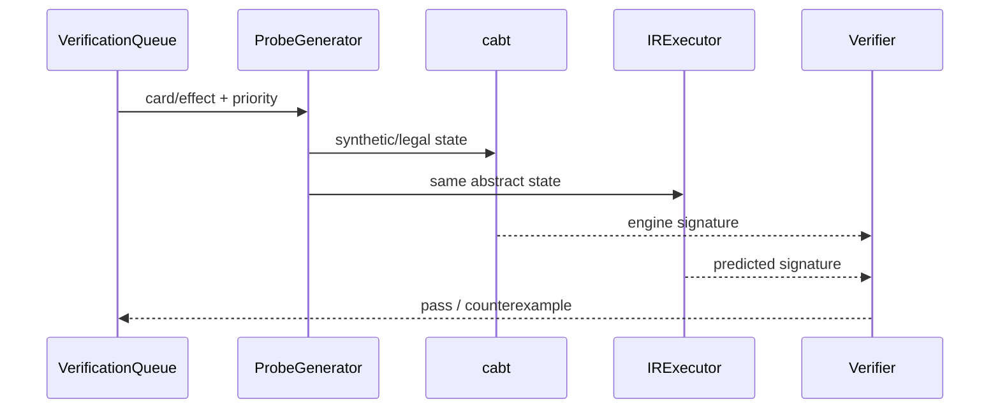

# ポケカ知識・デッキ戦略 実装計画書

## 1. 目的

本書は、Card Effect IR、Behavioral Verification、Card Ontology、Deck Profile、Domain Analyzer、Matchup Playbook、Deck Grammarを実装レベルへ落とし込みます。

### 1.1 C2a｜Knowledge Pack v0（critical path先行実装、2026-07-14改訂）

提出critical pathでは、§2以降の汎用基盤より先に、次のKnowledge Pack v0を実装します（設計は[../design/01_domain_knowledge_and_deck_strategy_plan.md](../design/01_domain_knowledge_and_deck_strategy_plan.md)の§1.1）。完了条件は「3実働日以内にRule＋Team Deckが実判断へ届く」ことであり、汎用Registryの完成を待ちません。

**構成**

```text
src/knowledge/
├── schemas.py
├── snapshot.py
├── validator.py
└── importers/
    ├── rule_agent.py
    ├── team_deck.py
    └── playbook.py

src/decks/
├── schemas.py
├── packages.py
└── validator.py
```

**Schema**

```python
@dataclass(frozen=True)
class KnowledgeManifest:
    artifact_id: str
    artifact_type: str
    schema_version: str
    source_kind: str
    source_uri: str | None
    source_commit: str | None
    content_hash: str
    retrieved_at: str
    card_pool_version: str
    cabt_version: str
    action_schema_version: str
    visibility: str
    allowed_use: str
```

```python
@dataclass(frozen=True)
class KnowledgeConfidenceV0:
    validity: float
    support: float
    freshness: float
```

```python
@dataclass(frozen=True)
class TeamDeckArtifact:
    manifest: KnowledgeManifest
    deck_id: str
    card_counts: Mapping[int, int]
    core_packages: tuple[str, ...]
    engine_packages: tuple[str, ...]
    flex_slots: tuple[str, ...]
    tech_slots: tuple[str, ...]
```

**Rule Adapter**

```python
class RuleAgentAdapter:
    def opinion(self, view, action_snapshot) -> RuleOpinion:
        index = self.agent.act(view.raw_observation)
        key = action_snapshot.to_key(index)
        return RuleOpinion.one_hot(key)
```

index、ActionKey、exception、fallback、elapsed、versionを記録します。

**Snapshot（immutable、更新時は新ID）**

```yaml
knowledge_snapshot_id:
schema_version:
rule_agent_ids: []
team_deck_ids: []
playbook_ids: []
card_pool_version:
cabt_version:
action_schema_version:
created_at:
```

**Compatibility検査**：schema、card pool、cabt version、ActionKey schema、60枚制約、allowed use、dependency。不一致Artifactは削除せずsnapshotから除外します。

**Prior Composer**：support外actionはneutral、prior floorを保証、primitiveを削除しない、source contributionを保存、snapshotなしでも同一APIで動作。

**実装順**

1. Manifest／schemas
2. Team Deck validator
3. Rule adapter
4. snapshot
5. Playbook importer
6. Prior Composer
7. bounded searchへ接続
8. paired ablation

**Tests**：schema round-trip、hash stability、60枚validation、index→ActionKey対応、snapshot determinism、mismatch検出、empty／Rule-only／Deck-only／mixed構成、wrong prior／stale source注入。

---

## 2. ディレクトリ構成

```text
src/mage_ptcg/
├── cards/
│   ├── api_loader.py
│   ├── effect_ir.py
│   ├── ir_parser.py
│   ├── probe_generator.py
│   ├── behavioral_signature.py
│   ├── verifier.py
│   ├── verification_queue.py
│   └── ontology.py
├── domain/
│   ├── certification.py
│   ├── damage.py
│   ├── prize_route.py
│   ├── energy_flow.py
│   ├── evolution.py
│   ├── attacker_chain.py
│   ├── bench_liability.py
│   └── reachability.py
└── decks/
    ├── profile.py
    ├── grammar.py
    ├── repair.py
    ├── playbook.py
    └── expert_ingestion.py
```

---

## 3. カード効果IRスキーマ

```python
@dataclass(frozen=True)
class CardEffectIR:
    card_id: CardId
    effect_id: str
    timing: TimingRule
    preconditions: tuple[Condition, ...]
    costs: tuple[Cost, ...]
    targets: tuple[TargetRule, ...]
    operations: tuple[Operation, ...]
    chance_nodes: tuple[ChanceNode, ...]
    continuous_modifiers: tuple[ContinuousModifier, ...]
    termination_rules: tuple[TerminationRule, ...]
    source_text_hash: str
    schema_version: str
```

### 3.1 Operation union

```python
Operation = (
    DrawOp
    | SearchOp
    | ShuffleOp
    | MoveCardOp
    | DiscardOp
    | AttachEnergyOp
    | MoveEnergyOp
    | DamageOp
    | HealOp
    | ApplyStatusOp
    | ModifyRuleOp
    | RevealOp
)
```

各Operationは入力zone、出力zone、対象条件、数量、公開範囲、失敗条件を持ちます。

---

## 4. 挙動シグネチャ

```python
@dataclass(frozen=True)
class BehavioralSignature:
    zone_count_delta: Mapping[ZoneKey, int]
    public_card_delta: tuple[CardDelta, ...]
    hp_delta: Mapping[PokemonRef, int]
    energy_delta: tuple[EnergyDelta, ...]
    status_delta: tuple[StatusDelta, ...]
    rule_flag_delta: tuple[FlagDelta, ...]
    legal_option_hash_before: str
    legal_option_hash_after: str
    normalized_log_events: tuple[LogEvent, ...]
```

正規化時はengine内部IDをstable entity keyへ変換し、順序非依存イベントはsortします。

---

## 5. 検証パイプライン



### 5.1 API

```python
class CardVerifier:
    def verify(
        self,
        ir: CardEffectIR,
        probe_suite: Sequence[ProbeCase],
    ) -> VerificationReport: ...
```

```python
@dataclass
class VerificationReport:
    card_id: CardId
    effect_id: str
    passed: int
    failed: int
    certification: CertificationLevel
    semantic_envelope: SemanticEnvelope
    counterexample_ids: tuple[str, ...]
```

`VERIFIED`はカード全体ではなく`semantic_envelope`に対して付与します。

---

## 6. 検証キュー

優先度：

```python
def priority(card: CardRecord, context: QueueContext) -> float:
    return (
        1000.0 * card.in_submission_deck
        + 200.0 * context.competition_frequency(card.id)
        + 100.0 * context.league_frequency(card.id)
        + 50.0 * context.interaction_centrality(card.id)
        + 30.0 * context.ir_uncertainty(card.id)
        + 100.0 * context.failure_severity(card.id)
    )
```

Queue class：

```python
class VerificationQueue:
    def enqueue(self, task: VerificationTask) -> None: ...
    def next_batch(self, limit: int, priority_band: str) -> list[VerificationTask]: ...
    def mark_complete(self, report: VerificationReport) -> None: ...
    def unresolved_reachable(self, deck_id: str) -> list[VerificationTask]: ...
```

---

## 7. 認証

```python
class CertificationLevel(Enum):
    EXACT = "exact"
    SOUND_LOWER_BOUND = "sound_lower_bound"
    SOUND_UPPER_BOUND = "sound_upper_bound"
    HEURISTIC = "heuristic"
```

```python
T = TypeVar("T")

@dataclass(frozen=True)
class AnalysisResult(Generic[T]):
    value: T
    certification: CertificationLevel
    assumptions: tuple[str, ...]
    confidence: float
    evidence_ids: tuple[str, ...]
```

枝刈り関数はCertification Levelを必須引数として受けます。

```python
def can_prune(result: AnalysisResult[float], threshold: float) -> bool:
    return result.certification in {
        CertificationLevel.EXACT,
        CertificationLevel.SOUND_UPPER_BOUND,
    } and result.value < threshold
```

---

## 8. カードオントロジー

```python
@dataclass
class CardRoleProfile:
    card_id: CardId
    roles: dict[str, float]
    requires: tuple[RequirementEdge, ...]
    enables: tuple[EnableEdge, ...]
    searches: tuple[SearchEdge, ...]
    recovers: tuple[RecoveryEdge, ...]
    counters: tuple[CounterEdge, ...]
    slot_competition: tuple[CompetitionEdge, ...]
```

OntologyはIRから自動生成した後、Expert Dataで補助ラベルを追加します。手動ラベルは`source=expert`を保持します。

---

## 9. デッキプロファイル

```python
@dataclass
class DeckProfile:
    deck_id: str
    card_counts: Counter[CardId]
    core_packages: tuple[DeckPackage, ...]
    engine_packages: tuple[DeckPackage, ...]
    flex_slots: tuple[SlotGroup, ...]
    tech_slots: tuple[SlotGroup, ...]
    evolution_graph: EvolutionGraph
    energy_graph: EnergyGraph
    strategy_prior: StrategyModePrior
    consistency_metrics: DeckConsistencyMetrics
```

### 9.1 Package extraction

1. Card Ontologyから依存graphを構築
2. 高centralityなattacker/evolution clusterをCore候補化
3. draw/search/energy/recovery clusterをEngine化
4. 枚数変動可能部分をFlex化
5. 特定相手にのみ価値が高いカードをTech化
6. expert metadataとself-play ablationで校正

---

## 10. Domain Analyzer Interface

```python
class DomainAnalyzer(Protocol[T]):
    def analyze(
        self,
        actor_view: ActorInformationView,
        belief: GameBelief,
        candidate: CandidateAction | None = None,
    ) -> AnalysisResult[T]: ...
```

### 10.1 PrizeRouteAnalyzer

```python
@dataclass
class PrizeRoute:
    target_sequence: tuple[TargetClass, ...]
    prizes_per_step: tuple[int, ...]
    expected_turns: float
    completion_probability: float
    opponent_race_probability: float
```

探索はshortest-pathまたはAND/OR graphとして実装します。

### 10.2 EnergyFlowAnalyzer

出力：

```python
@dataclass
class EnergyPlan:
    attachment_schedule: tuple[AttachmentDecision, ...]
    ready_probability: Mapping[PokemonRef, float]
    deficit: Mapping[PokemonRef, float]
    bottleneck_cards: tuple[CardId, ...]
```

### 10.3 BenchLiabilityAnalyzer

```python
@dataclass
class BenchLiability:
    setup_value: float
    option_value: float
    gust_loss: float
    spread_loss: float
    slot_cost: float
    net_value: float
```

---

## 11. 対面プレイブックのスキーマ

```python
@dataclass
class MatchupPlaybook:
    own_deck_profile_id: str
    opponent_archetype_id: str
    opening_goals: tuple[GoalRule, ...]
    priority_targets: tuple[TargetRule, ...]
    prize_routes: tuple[PrizeRouteRule, ...]
    preserve_rules: tuple[ResourceRule, ...]
    disruption_rules: tuple[TimingRule, ...]
    bench_rules: tuple[BenchRule, ...]
    energy_rules: tuple[EnergyRule, ...]
    transition_rules: tuple[ModeTransitionRule, ...]
    confidence: float
    evidence_ids: tuple[str, ...]
```

Playbook ruleは`hard=False`を既定とし、Macro priorへ加算します。

---

## 12. Deck Grammar

```python
class DeckGrammar:
    def sample_skeleton(self, rng: Random) -> StrategySkeleton: ...
    def expand_packages(self, skeleton: StrategySkeleton) -> DeckCandidate: ...
    def repair(self, candidate: DeckCandidate) -> LegalDeck: ...
    def mutate(self, deck: LegalDeck, mutation: DeckMutation) -> LegalDeck: ...
```

### 12.1 Repair制約

- 合計60枚
- カード別枚数上限
- 指定カードプール
- Basic Pokémon可用性
- 進化ライン整合性
- エネルギー供給可能性
- 必須packageの最小枚数

制約修復はILP/CP-SATを第一候補とし、失敗時はgrammar backtrackingへ戻します。

---

## 13. 専門家データ取り込み

```python
class ExpertKnowledgeImporter:
    def ingest_decklist(self, source: SourceDocument) -> DeckArtifact: ...
    def ingest_guide(self, source: SourceDocument) -> PlaybookCandidate: ...
    def validate_entities(self, candidate: PlaybookCandidate) -> EntityLinkReport: ...
```

抽出claimは次を保持します。

```yaml
claim_id:
claim_type:
subject:
condition:
recommendation:
source_uri:
source_date:
confidence:
validation_status:
```

---

## 14. テスト

### Unit

- IR serialization round trip
- Operation precondition
- Deck repair legality
- Prize graph consistency
- Energy deficit monotonicity

### Contract

- cabt signature一致
- Card API schema change
- legal option before/after

### Regression

- 全counterexample fixture
- Submission deckの全reachable interaction
- 特定カード組合せ

### Property-based

- EXACT枝刈りでoracle最善手を落とさない
- repair後は必ず合法60枚
- Energy planが存在しない場合にready=1を返さない

---

## 15. Artifact

```text
data/processed/card_effect_ir.parquet
artifacts/cards/<version>/verification_reports.jsonl
artifacts/cards/<version>/fixtures/
artifacts/decks/<deck_id>/profile.json
artifacts/decks/<deck_id>/playbooks/
artifacts/domain/<version>/benchmark.json
```

---

## 16. 完了の定義

提出critical path（C2a）の完了条件は§1.1を正とする。以下は汎用基盤まで拡張した場合の完了条件であり、2026-07-14改訂ではOptionalである。

- P0カードの全IRが検証済み
- unresolved reachable interactionが0
- AnalyzerがCertification Level付きで出力
- primitive baseline比でDomain Macroが改善
- Deck Grammarが10万sampleで違法デッキ0
- Playbook claimがevidenceを持つ
- fixtureからCard IR DBを再構築可能
