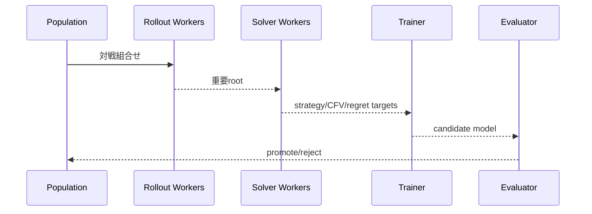

# 機械学習・Teacher/Student 実装計画書

## 1. 目的

本書は、特徴量生成、モデル構成、Teacher target、Dataset、Loss、Expert Iteration、League学習、蒸留、Runtime exportを実装するための仕様です。

### 1.1 C4｜Student v0（critical path先行実装、2026-07-14改訂）

提出critical pathでは、§3以降のfull構成より先にStudent v0（Rule v0 BC）を実装し、**2026-07-30にGO／NO-GO**を判定する（設計は[../design/03_machine_learning_teacher_student_plan.md](../design/03_machine_learning_teacher_student_plan.md)の§1.1）。

**構成**

```text
src/models/
├── state_encoder.py
├── action_encoder.py
├── policy_head.py
└── student_v0.py

src/training/
├── schemas.py
├── rule_bc.py
├── datasets.py
├── trainer.py
└── export.py
```

**Example schema**

```python
@dataclass(frozen=True)
class RuleBCExample:
    example_id: str
    actor_view_ref: str
    action_snapshot_ref: str
    target_action_key: str
    rule_agent_id: str
    fallback_used: bool
    sample_weight: float
    provenance: Provenance
```

**Model出力**

```python
@dataclass
class StudentV0Output:
    action_logits: Tensor
    public_value: Tensor | None
```

variable action、legal mask、padding invariance、optional featuresに対応する。

**Pipeline**

```python
class RuleBCPipeline:
    def collect(self, rollout_source, rule) -> DatasetRef: ...
    def train(self, dataset, init=None) -> ModelRef: ...
    def evaluate(self, model, holdout) -> EvalRef: ...
    def export(self, model) -> RuntimeArtifact: ...
```

**Split規律**：trace／Episode group split、near-duplicate state分離、rare context、failure state、calibration、OOD deck／context。

**Loss（v0）**

\[
\mathcal L =
\lambda_{policy} KL(\tilde\pi_{rule}\Vert\pi_\theta)
+ \lambda_V \mathcal L_V
\]

valueを使わない場合はPolicy項のみ。

**Targeted DAgger（C5、Student v0成功時のみ）**

```python
class TargetedDAgger:
    def rollout_student(self, model) -> TraceRef: ...
    def select_high_impact(self, traces) -> RootSetRef: ...
    def query_rule_and_search(self, roots) -> DatasetRef: ...
    def aggregate(self, previous, new) -> DatasetRef: ...
```

Search品質Gate未達ならSearch targetを使わない。RuleだけのDAggerで弱点を固定化しない。

**Tests（C4）**：action alignment、provenance、split leakage、padding invariance、mask、tiny overfit、deterministic resume、NaN protection、export fidelity、p50／p95／p99、fallback。

**完了条件（C4）**：legal action 100%、holdout fidelity、Rule v0 non-inferiority、p95 latency、clean package、2026-07-30のDecision Artifact。

**完了条件（C5）**：high-impact rootsの特定、target sourceの追跡、current／unknown holdout、Promotionまたは明確な棄却理由。

### 1.2 Policy Learning実装契約（2026-07-26）

主実装は`src/mage_ptcg/policy_learning/`へ置く。Rule v0／`main.py`をimport時または学習時に変更しないcandidate-only packageとする。

| module | 契約 |
|---|---|
| `data.py` | `RuleBCExample`を再検証し、episode/decision順、終局return、visible history、legal actionだけを学習recordへ変換する。複数選択promptは単一action actorへ偽装せず除外する。 |
| `model.py` | state/action encoder、GRU history encoder、masked legal-action policy、public value、family auxiliary headを持つ。paddingはlogit・lossへ入れない。 |
| `training.py` | offline AWR、value Huber、family CE、trust weight、checkpoint/resume、validationを実装する。AWR weightはcriticからdetachする。 |
| `algorithms.py` | PPO clipped surrogateとV-trace targetをtensor contractとして実装する。behavior log probabilityが無いoffline recordへPPOを適用しない。 |
| `online.py` | actorが記録したbehavior log probability付きtrajectoryへPPO/V-trace updateを適用する。raw observationをqueueへ保存しない。 |
| `dagger.py` | rollout queryのpriorityとrelabel aggregateを、episode provenanceを保って実装する。 |
| `league.py` | Population member、zero-sum payoff matrix、meta-strategy、opponent samplingを実装する。holdoutをPopulationへ入れない。 |
| `runtime.py` | CABTの単一選択promptでlegal candidateのみをscoreし、非有限値・非対応promptはtyped failureにする。 |

CLIは`python -m mage_ptcg.policy_learning train-offline/evaluate/dagger-select/dagger-merge/psro`とする。`offline_scaleup add-policy-learning-entry`は学習済みcheckpointをexact deckへcandidate-only登録する。実CABT、長時間学習、promotionは別runで証跡を生成してから実行する。

---

## 2. ディレクトリ

```text
src/mage_ptcg/
├── models/
│   ├── card_encoder.py
│   ├── public_state_encoder.py
│   ├── private_state_encoder.py
│   ├── range_encoder.py
│   ├── fusion.py
│   ├── policy_heads.py
│   ├── value_heads.py
│   ├── belief_heads.py
│   ├── regret_head.py
│   ├── budget_head.py
│   └── model.py
├── training/
│   ├── schemas.py
│   ├── datasets.py
│   ├── collators.py
│   ├── losses.py
│   ├── trainer.py
│   ├── expert_iteration.py
│   ├── distillation.py
│   ├── calibration.py
│   └── export.py
└── league/
    ├── population.py
    ├── matchmaking.py
    ├── psro.py
    └── rollout_workers.py
```

---

## 3. テンソルスキーマ

### 3.1 Public State

```python
@dataclass
class PublicStateTensor:
    card_ids: Tensor          # [B, N_public]
    entity_type: Tensor       # [B, N_public]
    owner: Tensor             # [B, N_public]
    zone: Tensor              # [B, N_public]
    hp: Tensor                # [B, N_public]
    damage: Tensor            # [B, N_public]
    status_flags: Tensor      # [B, N_public, F_status]
    energy_counts: Tensor     # [B, N_public, E]
    turn_features: Tensor     # [B, F_turn]
    action_history: Tensor    # [B, T, F_action]
    attention_mask: Tensor
```

### 3.2 Particle Range

```python
@dataclass
class RangeTensor:
    particle_card_ids: Tensor  # [B, M, N_private]
    particle_zone: Tensor      # [B, M, N_private]
    particle_weights: Tensor   # [B, M]
    deck_hypothesis: Tensor    # [B, M]
    particle_mask: Tensor      # [B, M]
```

### 3.3 Action Set

```python
@dataclass
class ActionSetTensor:
    action_type: Tensor       # [B, A]
    card_ids: Tensor          # [B, A, K]
    target_ids: Tensor        # [B, A, K]
    macro_features: Tensor    # [B, A, F]
    action_mask: Tensor       # [B, A]
```

Variable lengthはpadding + maskで処理します。

---

## 4. Card Encoder

```python
class CardEncoder(nn.Module):
    def __init__(self, cfg: CardEncoderConfig): ...
    def forward(
        self,
        card_ids: Tensor,
        ir_features: Tensor,
        role_features: Tensor,
        text_embeddings: Tensor | None,
    ) -> Tensor: ...
```

構成：

\[
e_c=W_{id}x_{id}+W_{ir}x_{ir}+W_{role}x_{role}+W_{text}x_{text}
\]

text embeddingはoffline事前計算し、Runtime packageへ全文モデルを含めません。

---

## 5. Encoders

### PublicStateEncoder

- entity transformer
- zone/owner positional bias
- history transformer
- global state token

### PrivateStateEncoder

- own hand set encoder
- known prize/deck segment encoder
- sampled particle encoder

### RangeEncoder

```python
class RangeEncoder(nn.Module):
    def forward(
        self,
        particle_embedding: Tensor,
        log_weights: Tensor,
        mask: Tensor,
    ) -> RangeEncoding: ...
```

候補実装：Set Transformerを正典、Deep Setsを軽量baselineとします。

---

## 6. 融合モデル

```python
@dataclass
class ModelOutput:
    macro_logits: Tensor
    primitive_logits: Tensor
    target_logits: Tensor
    public_value: Tensor
    private_value: Tensor | None
    cfv: Tensor | None
    regret: Tensor
    deck_proposal_logits: Tensor | None
    particle_log_weight_delta: Tensor | None
    tactical_event_logits: Tensor
    budget_gain: Tensor
```

```python
class MageModel(nn.Module):
    def forward(self, batch: ModelBatch, requested_heads: set[str]) -> ModelOutput: ...
```

requested headだけ計算し、Runtime costを抑えます。

---

## 7. Solver Target schema

```python
@dataclass
class SolverTrainingExample:
    example_id: str
    actor_view: SerializedActorView
    public_state_hash: str
    belief_summary: SerializedBeliefSummary
    action_keys: tuple[str, ...]
    current_strategy: tuple[float, ...]
    average_strategy: tuple[float, ...]
    action_cfv: tuple[float, ...]
    cumulative_regret: tuple[float, ...]
    public_value: float
    private_particle_values: tuple[float, ...] | None
    blueprint_cfv: tuple[float, ...] | None
    safe_margin: tuple[float, ...] | None
    solver_iterations: int
    solver_diagnostics: SolverDiagnostics
    provenance: Provenance
```

数値配列長は`action_keys`と一致させます。

---

## 8. リプレイバッファ

階層化します。

```text
replay_buffer/
├── tactical/
├── solver_roots/
├── selfplay/
├── kaggle_regret/
├── belief/
├── calibration/
└── rare_failures/
```

Sampling weight：

\[
w_i \propto
\alpha_{source}
(\epsilon+|R_i|)^\beta
(\epsilon+uncertainty_i)^\gamma
\]

同じSubmission・同じpublic stateの大量重複はdownweightします。

---

## 9. データセットクラス

```python
class PolicyDataset(Dataset): ...
class PublicValueDataset(Dataset): ...
class PrivateValueDataset(Dataset): ...
class CFVDataset(Dataset): ...
class RegretDataset(Dataset): ...
class BeliefDataset(Dataset): ...
class BudgetDataset(Dataset): ...
```

Multi-task batchではhead別欠損をmaskします。

---

## 10. Loss実装

```python
@dataclass
class LossBreakdown:
    total: Tensor
    macro_policy: Tensor
    primitive_policy: Tensor
    public_value: Tensor
    private_value: Tensor
    cfv: Tensor
    regret: Tensor
    belief: Tensor
    budget: Tensor
    calibration: Tensor
```

```python
def compute_loss(output: ModelOutput, target: ModelTarget, cfg: LossConfig) -> LossBreakdown:
    ...
```

### Policy KL

```python
def masked_policy_kl(logits, target_prob, mask): ...
```

### CFV

Huber + action rank lossを併用します。

\[
\mathcal L_{cfv}=Huber(\hat q,q)+\lambda_{rank}\mathcal L_{pairwise}
\]

### Regret

絶対値だけでなくpositive-action recallを測ります。

### Belief

- deck CE
- particle KL
- event BCE/Brier
- calibration penalty

---

## 11. 学習段階

### Phase A：Card/Rule pretraining

- card role
- effect type
- legal target
- simple transition

### Phase B：Domain targets

- KO
- prize route
- energy
- bench liability

### Phase C：Deep Solver

- average strategy
- CFV
- regret

### Phase D：League Expert Iteration

- self-play
- best response
- historical opponent

### Phase E：Competition adaptation

- IS regret
- temporal calibration
- surrogate league

---

## 12. 専門家反復サービス

```python
class ExpertIterationLoop:
    def generate_roots(self, policy_id: str) -> list[RootTask]: ...
    def solve_roots(self, tasks: Sequence[RootTask]) -> ArtifactRef: ...
    def train(self, dataset: ArtifactRef, init_model: str) -> ModelRef: ...
    def evaluate(self, candidate: ModelRef, champion: ModelRef) -> EvalRef: ...
    def promote(self, candidate: ModelRef, evaluation: EvalRef) -> bool: ...
```



---

## 13. League

```python
@dataclass
class PopulationMember:
    member_id: str
    deck_id: str
    model_id: str
    playbook_id: str
    role: str
    creation_step: int
    performance_summary: Mapping[str, float]
```

Matchmaking：

- 30% current Champion
- 20% historical
- 20% exploiters
- 15% deck specialists
- 10% Kaggle surrogates
- 5% random/domain

割合はPSRO/meta solverで更新可能にします。

---

## 14. 蒸留

```python
class DistillationTrainer:
    def train(
        self,
        teacher_ensemble: Sequence[TeacherRef],
        student: MageStudent,
        dataset: DistillationDataset,
    ) -> ModelRef: ...
```

対象：

- logits temperature distillation
- strategy distribution
- value/CFV
- regret ordering
- belief proposal
- budget gain

Teacher disagreementを保存し、高不一致例を重点学習します。

---

## 15. Calibration

```python
class Calibrator(Protocol):
    def fit(self, prediction: np.ndarray, target: np.ndarray, groups: GroupKey) -> CalibrationArtifact: ...
    def apply(self, prediction: np.ndarray, groups: GroupKey) -> np.ndarray: ...
```

Groups：

- deck/archetype
- turn bucket
- remaining prize
- source domain
- temporal split

Runtimeで重いisotonicを使わず、lookup tableまたはsmall headへコンパイルします。

---

## 16. エクスポート

```python
class RuntimeExporter:
    def export_onnx(self, model: MageStudent, sample_batch: ModelBatch) -> Path: ...
    def quantize_int8(self, onnx_path: Path, calibration_data: Dataset) -> Path: ...
    def validate_numerics(self, source: nn.Module, exported: Path) -> ExportReport: ...
```

検証：

- top-k一致
- value最大誤差
- NaN/Inf
- dynamic shape
- cold start
- p50/p95/p99
- package size

---

## 17. モデルレジストリ

```yaml
model_id:
architecture_version:
parameter_count:
training_data_ids: []
code_commit:
config_hash:
metrics:
calibration_id:
export_artifacts:
promotion_status:
```

Championへ昇格したmodelは削除せず固定します。

---

## 18. Tests

### Shape/Mask

- 可変粒子数
- 可変action数
- empty optional head
- padding不変性

### Leakage

- hidden truth perturbation
- source field監査

### Numerical

- FP32/ONNX/INT8差
- masked softmax
- zero-weight particle

### Training

- tiny overfit
- deterministic resume
- dataset provenance
- loss NaN recovery

### Performance

- batch throughput
- Runtime single state latency
- memory peak

---

## 19. 完了の定義

- 全headのDatasetとlossが独立テスト済み
- Solver targetから学習まで再現可能
- Expert Iterationを1コマンドで実行
- League memberとArtifactを追跡可能
- Studentがpaired評価で昇格Gate通過
- ONNX/int8の数値・性能検証済み
- temporal holdoutで校正悪化を監視
