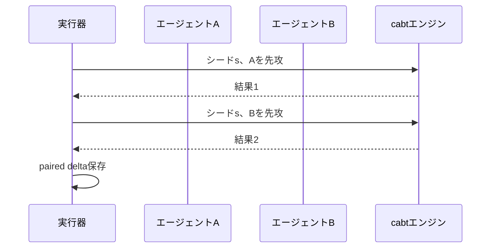

# 評価・提出・Strategy運用 実装計画書

## 1. 目的

本書は、対戦評価、統計推定、Ablation、Runtime Profiler、Soak Test、Promotion Gate、Submission Build、Final Freeze、Strategy証拠生成を実装するための仕様です。

### 1.1 改訂スコープ（2026-07-14 第三者レビュー反映）

P0（Continuous Submission Baseline）を全期間継続し、Tier D／Eを常時buildする。soakは10kをfinal hard target、100kをoptionalとする（[../design/05_evaluation_submission_and_strategy_plan.md](../design/05_evaluation_submission_and_strategy_plan.md)の§11）。safetyは失敗0件でも上側95%信頼限界で評価する。

**評価Plan／Resultの必須field（既存§3のschemaへ追加する差分）**

- `EvaluationPlan`：`knowledge_snapshot_ids`、`competition_cutoff`、`hypothesis`、`changed_factors`
- `GameResult`：両agentの`invalid`／`exception`／`timeout`／`elapsed_ms`に加えて`fallback_levels`と`deck_ids`

```python
@dataclass(frozen=True)
class EvaluationPlan:
    eval_id: str
    agent_a_id: str
    agent_b_id: str | None
    deck_pair_ids: tuple[str, ...]
    seed_set_id: str
    game_count: int
    knowledge_snapshot_ids: tuple[str | None, ...]
    competition_cutoff: str | None
    hypothesis: str
    changed_factors: tuple[str, ...]
```

**Safetyと逐次評価**

- failure 0件でも上側95%信頼限界を計算し、Gateはraw rateではなく上側限界で判断する
- safety failureで即停止、practical delta超過で昇格候補、明確に下回れば棄却、それ以外は追加試合
- partial結果とresumeを保存する

**Submission Manifest（Tier C／D／E）**

```python
@dataclass(frozen=True)
class SubmissionManifest:
    submission_id: str
    runtime_tier: str
    entrypoint: str
    deck_artifact_id: str
    model_artifact_ids: tuple[str, ...]
    knowledge_snapshot_id: str | None
    runtime_config_id: str
    dependency_lock_id: str
    source_commit: str
```

Tier C：Student（optional）＋Book＋Rule Guard。Tier D：Rule v0。Tier E：First Legal。Tier A／BはOptional。

**Package validation追加項目**：option type 12を含む全context fixture、missing optional Artifact耐性、fallback動作。

**Strategy Claim追加field**：`knowledge_snapshot_id`、`competition_cutoff`。Evidenceなし、別Agent、古いsnapshot、推定deckを完全deck扱いするclaimはreport buildを失敗させる。

**Gate CLI（Slice単位）**

```text
project evaluate paired
project evaluate runtime-profile
project evaluate robustness
project evaluate unknown
project evaluate soak --resume
project gate run <P0|C1|C2a|C2b|C3|C4|C5>
project promotion evaluate
project submission build --tier D
project submission validate
project submission dry-run
project freeze select
project report build-strategy
```

**Robustness注入**：empty snapshot、Rule dropout、stale snapshot、wrong Rule、wrong deck prior、scope-mismatched Playbook、Surrogate shift。

---

## 2. ディレクトリ

```text
src/mage_ptcg/
├── evaluation/
│   ├── tournament.py
│   ├── paired_runner.py
│   ├── scenarios.py
│   ├── rating.py
│   ├── bayes.py
│   ├── ablation.py
│   ├── runtime_profiler.py
│   ├── soak.py
│   ├── promotion.py
│   └── final_freeze.py
├── runtime/
│   ├── agent.py
│   ├── budget.py
│   ├── fallback.py
│   ├── telemetry.py
│   ├── package_builder.py
│   └── package_validator.py
└── reporting/
    ├── evidence.py
    ├── plots.py
    ├── case_study.py
    ├── strategy_report.py
    └── provenance.py
```

---

## 3. 評価データベース

```python
@dataclass
class EvaluationRun:
    eval_id: str
    agent_a_id: str
    agent_b_id: str
    deck_a_id: str
    deck_b_id: str
    config_hash: str
    seed_set_id: str
    game_count: int
    started_at: str
    completed_at: str | None
    status: str
```

```python
@dataclass
class GameResult:
    eval_id: str
    game_index: int
    seed: int
    first_player: int
    winner: int | None
    termination_reason: str
    elapsed_a_ms: int
    elapsed_b_ms: int
    invalid_a: bool
    invalid_b: bool
    exception_a: bool
    exception_b: bool
    timeout_a: bool
    timeout_b: bool
    replay_artifact_id: str
```

StorageはParquet + DuckDBを基本とし、集計SQLをversion管理します。

---

## 4. 対比較実行器

```python
class PairedMatchRunner:
    def run(
        self,
        agent_a: AgentArtifact,
        agent_b: AgentArtifact,
        matchup: MatchupSpec,
        seeds: Sequence[int],
        cfg: PairedRunConfig,
    ) -> EvaluationArtifact: ...
```

各seedで、可能な限り先後攻を入れ替えた2試合を実施します。



---

## 5. Scenario/Puzzle Evaluation

```python
@dataclass
class ScenarioCase:
    scenario_id: str
    initial_state_artifact: str
    actor_view_artifact: str
    allowed_action_keys: tuple[str, ...]
    oracle_action_values: Mapping[str, float] | None
    category: str
    difficulty: str
```

Categories：

- immediate win
- KO
- prize route
- energy attach
- Gust target
- bench decision
- disruption
- resource preserve
- belief information gathering
- time-critical

Metrics：top-1、top-k、regret、latency。

---

## 6. Rating Model

```python
class RatingEstimator(Protocol):
    def fit(self, games: Sequence[GameResult], priors: RatingPrior) -> RatingPosterior: ...
```

最低実装：

- Bayesian Bradley-Terry
- first-player term
- matchup random effect
- agent version effect

```python
@dataclass
class RatingPosterior:
    mean: Mapping[str, float]
    interval_90: Mapping[str, tuple[float, float]]
    pairwise_win_probability: Mapping[tuple[str, str], float]
    diagnostics: Mapping[str, float]
```

MCMCまたはvariationalの収束diagnosticsを必須とします。

---

## 7. 昇格ゲート

```python
@dataclass
class PromotionCriteria:
    min_probability_positive: float = 0.95
    min_practical_improvement: float = 0.005
    max_timeout_rate: float = 0.0
    max_invalid_rate: float = 0.0
    max_exception_rate: float = 0.0
    max_p95_latency_ratio: float = 1.25
    require_temporal_non_degradation: bool = True
```

```python
class PromotionGate:
    def evaluate(
        self,
        paired: RatingPosterior,
        robust: RobustEvalReport,
        runtime: RuntimeReport,
        live: LiveAdjustedReport | None,
        criteria: PromotionCriteria,
    ) -> PromotionDecision: ...
```

Decision：`PROMOTE`、`REJECT`、`NEED_MORE_DATA`。

---

## 8. アブレーション実行器

```python
@dataclass
class AblationAxis:
    name: str
    variants: tuple[ConfigPatch, ...]
    controlled_fields: tuple[str, ...]
```

```python
class AblationRunner:
    def materialize(self, base: ResolvedConfig, axes: Sequence[AblationAxis]) -> list[ResolvedConfig]: ...
    def execute(self, configs: Sequence[ResolvedConfig], evaluation_suite: EvalSuite) -> AblationArtifact: ...
```

Ablationで同時に複数因子を変えないことをvalidatorで確認します。

---

## 9. 実行時プロファイラ

```python
@dataclass
class RuntimeSample:
    callback_type: str
    elapsed_ms: float
    model_ms: float
    belief_ms: float
    solver_ms: float
    engine_calls: int
    cache_hits: int
    cache_misses: int
    memory_mb: float
    fallback_level: int
```

```python
class RuntimeProfiler:
    def profile_agent(self, artifact: AgentArtifact, scenarios: ScenarioSuite) -> RuntimeReport: ...
```

出力：

- p50/p95/p99
- cold start
- peak memory
- package size
- model load
- engine call分布
- cache hit率
- callback別内訳

---

## 10. Runtime Contract Probe

```python
class RuntimeCapabilityProbe:
    def run(self, environment: RuntimeEnvironment) -> RuntimeContract: ...
```

```yaml
runtime_contract:
  cpu_count:
  memory_limit_mb:
  package_limit_mb:
  model_load_p95_ms:
  action_p95_ms:
  engine_clone_p95_us:
  search_step_p95_ms:
  max_engine_calls_per_decision:
  transition_cache_memory_mb:
```

未測定値を推測で埋めません。

---

## 11. 長時間安定性試験

```python
class SoakRunner:
    def run(
        self,
        agent: AgentArtifact,
        opponents: Sequence[AgentArtifact],
        game_count: int,
        cfg: SoakConfig,
    ) -> SoakReport: ...
```

監視：

- invalid/exception/timeout
- memory growth
- search session count
- file descriptor
- cache size
- belief collapse
- fallback level
- deterministic replay mismatch

失敗時は最小ReplayとconfigをRegression Artifactへ登録します。

---

## 12. 提出物ビルダー

提出packageはmanifest drivenで作ります。

```yaml
submission:
  entrypoint: main.py
  runtime_config: configs/runtime/final.yaml
  model_artifacts:
    - student.int8.onnx
  books:
    - opening_book.bin
    - matchup_book.bin
  caches:
    - solved_states.bin
  card_db:
    - verified_cards.bin
  include_python_packages: []
```

```python
class SubmissionBuilder:
    def build(self, manifest: SubmissionManifest, output: Path) -> SubmissionArtifact: ...
```

要件：

- rootにentrypoint
- deterministic file order
- checksum manifest
- secret scan
- review/audit文書を含めない
-不要training dataを含めない

---

## 13. パッケージ検証器

```python
class PackageValidator:
    def validate(self, submission: SubmissionArtifact, env: ValidationEnvironment) -> PackageValidationReport: ...
```

Tests：

1. clean environment install/load
2. cold start
3. minimal game
4. all SelectType fixtures
5. no network assumption
6. read-only filesystem assumption
7. package size
8. memory
9. time budget
10. checksum

---

## 14. 実行時フォールバック

```python
class FallbackController:
    def decide(
        self,
        error: Exception | None,
        budget: DecisionBudget,
        legal_options: Sequence[LegalOption],
    ) -> FallbackDecision: ...
```

Level：

1. cached plan
2. Student policy
3. Domain Macro
4. deterministic legal heuristic
5. first legal option

Level 5まで到達してもlegal indexを返します。

---

## 15. 最終凍結選択器

```python
@dataclass
class FreezeCandidate:
    submission_artifact_id: str
    current_meta_eval_id: str
    robust_eval_id: str
    unseen_eval_id: str
    runtime_report_id: str
    soak_report_id: str
```

```python
class FinalFreezeSelector:
    def select(self, candidates: Sequence[FreezeCandidate], objective: FreezeObjective) -> FreezeDecision: ...
```

Hard constraintsを先に適用し、その後expected/worst-case ratingを比較します。

---

## 16. Gate Scheduler

```python
@dataclass
class ProjectGate:
    gate_id: str
    deadline: str
    required_artifacts: tuple[str, ...]
    pass_conditions: tuple[MetricCondition, ...]
    fallback_tier: str
```

Gate statusをdashboard表示し、未達時のRuntime Tierを自動提案します。

Gateの計画期限と実達成日時を分離します。

```python
@dataclass
class GateStatus:
    gate_id: str
    planned_deadline: str
    actual_completed_at: str | None
    schedule_status: str
    delay_reason: str | None
```

R2/R3 AI reviewが未実装の場合は、人間による代替監査を記録します。

```python
@dataclass
class ManualReviewSubstitution:
    run_id: str
    risk_level: str
    subject_digest: str
    reviewer: str
    checklist_version: str
    decision: str
    unresolved_items: tuple[str, ...]
    created_at: str
```

`ManualReviewSubstitution`は検証免除ではなく、必要な独立監査を人間が代替した証跡です。

---

## 17. 戦略根拠収集器

```python
class EvidenceCollector:
    def collect_architecture(self, artifact_ids: Sequence[str]) -> EvidenceArtifact: ...
    def collect_metrics(self, eval_ids: Sequence[str]) -> EvidenceArtifact: ...
    def collect_case_studies(self, episode_ids: Sequence[str]) -> EvidenceArtifact: ...
    def validate_claim(self, claim: ReportClaim) -> ClaimValidation: ...
```

Claim schema：

```python
@dataclass
class ReportClaim:
    claim_id: str
    text: str
    evidence_ids: tuple[str, ...]
    agent_artifact_id: str
    metric_definition_id: str | None
```

証拠なしClaimはreport buildを失敗させます。

---

## 18. 図表生成

自動生成対象：

- architecture Mermaid/SVG
- deck package表
- matchup matrix
- rating posterior
- calibration curve
- Macro Recall
- solver convergence
- runtime latency
- failure taxonomy
- Champion history

図は元データArtifact IDをmetadataへ埋め込みます。

---

## 19. 戦略レポートビルダー

```python
class StrategyReportBuilder:
    def build(
        self,
        template: Path,
        claims: Sequence[ReportClaim],
        evidence: Sequence[EvidenceArtifact],
        output: Path,
    ) -> ReportArtifact: ...
```

Section不足、Claim provenance不足、最終Agent不一致をvalidatorで検出します。

---

## 20. CI / Automation

### nightly

```text
unit → contract → regression → 1k tournament → runtime profile → dashboard
```

### candidate

```text
paired suite → unseen suite → 10k soak → package validation → promotion gate
```

### final

```text
10k soak (hard target) → optional 100k soak → final freeze selector → package rebuild → checksum compare → submission dry run
```

---

## 21. Tests

### Statistical

- synthetic known rating recovery
- first-player bias recovery
- credible interval coverage
- sequential testing leakage

### Operational

- DESIGN_REUSE runがpublic interfaceを変更した場合に統合拒否・DESIGN_CHANGEへ昇格
- R1 runのpatchがR3 pathへ触れた場合にescalateまたはblocked
- ManualReviewSubstitutionのsubject digest不一致
- external submission evidenceとpackage hashの不一致
- rollback
- interrupted tournament resume
- duplicate result prevention
- artifact checksum

### Submission

- missing model
- oversized package
- unsupported dependency
- corrupt cache
- secret scan

### Reporting

- evidence missing
- wrong agent version
- stale metric
- unreproducible plot

---

## 22. 完了の定義

- Paired Runnerがseed/先後攻を再現
- Rating modelのsynthetic recovery通過
- Promotion Gateが自動判定
- Runtime Contractが実測値で保存
- 10k以上のsoakを途中再開可能（100kはoptional）
- Submissionをclean環境で検証
- Final Freezeを再現可能
- Strategy ClaimがすべてEvidenceへリンク
- Simulation/Strategy deadline前にdry run完了
- planned deadlineとactual completionを分離して保存
- R2/R3 AI review未実装時のManualReviewSubstitutionを追跡可能
- Kaggle提出証跡と採用判断を`experiments/`へ永続化

## 23. O5 opponent population activation boundary

O5のOpponent Factoryは、Rules attestationとartifact単位のTeam permissionを検証したactive exact Deckだけを入力にする。Policy Packは合法候補のsoft score priorであり、Deck mismatch、unknown selection、例外、timeoutではRule Agent v0へ決定的にfallbackする。active Deck 3、runnable family 3、verified/high-confidence Agent–Deck link 3を満たさない場合、Benchmarkは`BENCHMARK_BLOCKED_INSUFFICIENT_ACTIVE_POPULATION`として保存し、実cabt試合数を水増ししない。詳細は[O5 activation evidence](../../evidence/o5-activation-opponent-factory-v1.md)を参照する。

### 23.1 Versioned Benchmark Manifest and Evaluation Runner

第23節のpopulation gateは変更せず、その出力へ run識別・再現性フィールド（`benchmark_id`／`seed_set`／`game_count`／`commit`／`manifest_hash`等）を付与する`VersionedBenchmarkManifest`と、opponent memberごと・seedごとに既存`league.actual_runner.run_actual_league`を呼び出す resumable な Evaluation Runner を追加した。scheduling／resume／seat-swapロジックは再実装しない。

`sets.safety`のラベル（`exception_agent`／`slow_agent`／`invalid_artifact`／`unknown_selection`）に対応する実装を追加し、crash/invalid/timeoutで勝者が決まらない試合をwin_rate・Wilson CIの分母（`decided_games`）から除外する集計を実装した。`current_meta`とarchetype系`adversarial`は、Rules attestationとTeam permission manifestが未受領のため引き続き0試合・blockedのままであり、本節の population gate を無効化・迂回しない。

`VersionedBenchmarkManifest`は`benchmark_kind`（`performance`／`safety`）で`sets`を排他的に分離し、fault-injection opponentとの試合が候補の性能勝率へ構造的に混入できないようにした。`candidate_artifact_hash`をmanifest hashへ含め、人間可読な`candidate_artifact_id`だけでは区別できない別checkpointとの衝突を防いだ。`neural_runtime.NeuralRuntimePolicy.load`を再利用したhash-pinned Candidate Factory（[o5_candidate_factory.py](../../../src/mage_ptcg/competition_intelligence/o5_candidate_factory.py)）で実データ学習済みChallengerを候補として接続できる。詳細は[O5 Candidate Activation evidence](../../evidence/o5-candidate-activation-v1.md)を参照する。

cabtにはseed制御や局面注入の確認済みAPIがない（`engine_seed_supported=false`）ため、シナリオレベルadversarial（setup事故、resource starvation等）は実装せず、既知の限界として記録した。詳細は[O5 Versioned Benchmark & Evaluation Runner evidence](../../evidence/o5-versioned-benchmark-evaluation-runner-v1.md)を参照する。
