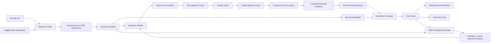
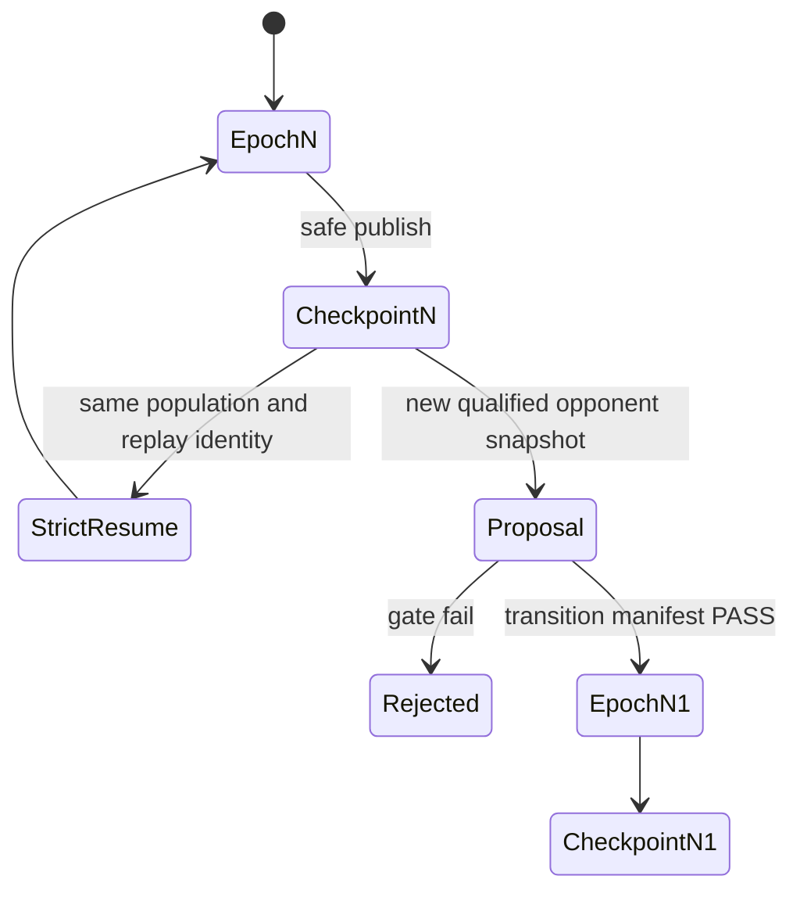

# 継続学習・オフラインリーグベンチマーク設計案

## 1. 結論

推奨構成は、対戦経験を作る `Experience Generator`、学習入力を版固定する `Replay Sealer`、勾配更新を担う `Continuous R2D3 Learner`、content-addressed checkpoint を発行する `Checkpoint Publisher`、固定ベンチと時変ベンチを実行する `Evaluation Scheduler`、remote／公開デッキを版固定で取り込む `Opponent Intake` を分離した常設リーグである。

R2D3 learnerとPSROは同じ常駐loopへ押し込まない。R2D3は一つの`population_epoch`内でsealed Replayからbest responseを学習する内側の学習器、PSROはpayoffを読み、相手混合分布と次のbest-response要求を発行する外側の`Population Manager`とする。

一つの勝率だけを「Kaggle環境での勝率」とみなさない。出力は次の3種類へ分ける。

1. 同じ相手集合で時系列比較できる `Anchor Score`
2. 現在のremote／公開デッキ分布に対する `Rolling Meta Score`
3. 過去の自チーム提出との対応データが十分な場合だけ出す `Calibrated Kaggle Rating Forecast`

新しい相手を追加するときは、実行中checkpointのpopulation hashを書き換えない。完全なcheckpointを親として新しい`population_epoch`を開始し、modelは継承し、target／optimizer／scheduler／Replay priority／RNGはtransition manifestに従って移行する。これは同一runのstrict resumeではなく、provenanceを保ったwarm continuationである。

本書は[03｜機械学習](../design/03_machine_learning_teacher_student_plan.md)、[04｜Kaggle適応](../design/04_kaggle_competition_intelligence_and_joint_optimization_plan.md)、[05｜評価](../design/05_evaluation_submission_and_strategy_plan.md)を置き換えない。既存の学習、相手取得、評価を常設運用へ接続する横断設計だけを定める。

## 2. 問題の再定式化

目的は、学習を長時間継続しながら、任意の時点のモデルを再現可能な固定条件で評価し、team remoteに追加された強いAgentや公開上位デッキを安全に次の学習世代へ取り込むことである。

### 2.1 成功条件

次をすべて観測できたとき、本構想を運用可能と判定する。

- 学習中に発行された完全checkpointだけを評価し、部分書込みを一度も読まない。
- qualified populationから新しい対戦経験を継続生成し、検証済みepisode chunkだけをsealed Replay versionとして学習へ戻せる。
- 同じcheckpoint、benchmark manifest、cabt runtimeを指定すれば、試合単位の乱数結果を除くscheduleと集計定義を再構成できる。
- 学習再開用の`training_checkpoint_id`と、評価重複排除用の`runtime_policy_id`を別identityとして追跡できる。
- 固定Anchor上の性能推移と、時変Rolling Meta上の性能を別系列で表示できる。
- `origin/agent/*`、`origin/agents/*`、`origin/dev:opponents/*`をcommit／path／content hash固定で実行できる。
- 新しい相手の追加後も、旧benchmark、旧population、旧checkpointを上書きしない。
- population変更後に親checkpointから学習を再開でき、親子関係とReplay継承範囲を追跡できる。
- illegal、exception、timeout、NaN／Inf、privacy違反、identity不一致のいずれかでfail closed停止する。
- exact opponent、deck、policy、lineage、archetype、学習利用、model選択利用のexposureを分離し、異なる既知度の結果を混ぜない。
- Kaggle予測値は校正データ不足時に`CALIBRATION_UNAVAILABLE`となり、推測値で穴埋めしない。

### 2.2 反証条件

次のいずれかが起きた場合、設計または実装が失敗している。

- branch名だけを参照し、評価途中に別commitへdriftする。
- 同一logical Agentの新旧版や同一deckがtrainingとholdoutへ分離される。
- 新populationを旧checkpoint identityへsilent適用する。
- populationが変わったのに旧PER priorityを現在modelに対する重要度として完全復元する。
- 公開Replayのdeckと、Replayを生成した非公開方策を同一視する。
- 頻繁に見たdevelopment benchmarkを未知性能の証拠として扱う。
- cabtの非制御乱数をpaired seedと誤認し、差の不確実性を過小評価する。
- Kaggleのrating近傍matchmaking下の観測勝率を、Agentの絶対的な強さとみなす。
- 評価キューが学習を恒常的に圧迫し、学習・評価のどちらも進まない。

### 2.3 今回扱わない範囲

- remote team codeの自動公開、submission bundleへの同梱、Kaggleへの自動提出
- 他チームの非公開方策の復元
- Kaggle Replay行動をexpert labelとして直接学習すること
- cabtが提供しないengine RNG snapshot／完全な共通乱数paired evaluation
- Championの自動昇格

## 3. 現在利用できる資産

2026-07-30時点のローカル観測では、構想の主要部品は存在するが、常設ループとして未接続である。

| 領域 | 現在の資産 | 観測された状態 | 主な不足 |
|---|---|---|---|
| Team remote | `origin/agent/*` 2 ref、`origin/agents/*` 12 ref、`origin/dev:opponents/*` 49 directory | Git plumbingでcheckoutせず読める | fetch、差分審査、population更新との接続 |
| 実行資格済み相手 | `submitted_opponents.py`と2026-07-30 snapshot | 16 assetをtraining 12／validation 2／deck holdout 1／final holdout 1へ分離済み | 新規assetを追加しても既存割当を動かさないledger |
| 公開上位deck | `analyze_leaderboard_decks.py`、`build_deck_opponent_pool.py` | 2026-07-29 snapshotで45 source／24 unique exact-60 deck | 定期更新とRolling Meta version化 |
| 固定ベンチ | O5 versioned benchmark／evaluation runner | resumable、seat swap、Wilson CI、候補hash固定 | 任意R2D3 checkpoint、native remote population、rolling setへの一般化 |
| 相手取り込み | O6／`opponent_ingest` | ref走査、static audit、quarantine、12時間timer | remote fetchと学習epoch rolloverの制御 |
| 長時間学習 | R2D3／PSRO performance controller | durable checkpoint、PER状態、Replay／population identity、stage resume | experience生成とlearnerの分離、checkpoint stream、population変更時の親子epoch |
| online collection | `r2d3/online_collection.py` | frozen PSRO mixture、collection provenance、offline／online Replay partition | 常設collector job、raw chunk、Replay sealing、version発行 |
| 評価Gate | development／deck／final holdout | source・deck・policy leakage防止、one-time reservation | 日常監視用benchmarkと一回限りpromotion holdoutの役割分離 |

既存16 assetのうち、初期training populationは`TRAINING_ACTIVE` 12件、反復評価は`DEVELOPMENT_EVAL` 2件であり、`DECK_HOLDOUT` 1件と`FINAL_HOLDOUT` 1件は日常population／Phase 0 benchmarkへ入れない。ただしremote上には未資格の候補がさらに存在し、同じ`opponents/` subtreeが複数branchへ複製されている。件数ではなく`logical_agent_id`、`policy_hash`、`deck_hash`、`lineage_root_id`で重複を除かなければならない。

## 4. 採用アーキテクチャ

学習、評価、外部更新の状態を直接共有せず、immutable Artifactとイベントで接続する。



### 4.1 制御面

`Continuous League Controller`は状態遷移とleaseだけを管理する。CABT、remote Agent、学習モデルをin-processで実行しない。

- sourceの新着を検知してqualification jobを作る。
- publish済みcheckpointから評価jobを作る。
- collection manifestからexperience generation jobを作り、sealed Replay versionだけをlearnerへ渡す。
- resource budgetに従い学習と評価の同時実行数を制限する。
- population更新を安全なcheckpoint境界でだけ適用する。
- stage statusとArtifact hashをatomicに保存する。

### 4.2 データ面

すべての入力はimmutable snapshotとして扱う。

- remote Agent：`ref + commit + path + blob hash + runtime closure hash`
- exact Deck：順序非依存のcanonical deck hashと元source snapshot
- population：member identity、sampling weight、role、permission scopeのmanifest hash
- raw episode chunk：behavior policy、population、deck、opponent、collection configに束縛された追記専用Artifact
- sealed Replay version：採用episode chunk集合、sequence変換、sampling schema、semantic feature versionのhash
- training checkpoint：model／target／optimizer／scheduler／RNG／PER state／training identityのhash
- runtime policy：model weights、model config、state／action encoder、action mode、Q reduction、tie-break、deck、runtime configのhash
- benchmark：opponent set、deck set、seat policy、game budget、cabt versionのhash
- result：runtime policy IDとbenchmark manifest hashの組

branch名、`latest.pt`、可変ディレクトリを実行identityに使わない。

### 4.3 学習内側とpopulation外側の責務

- `Experience Generator`は固定されたbehavior runtime policyとpopulation snapshotから対戦し、raw episode chunkを生成する。
- `Replay Sealer`はepisode完結性、ActionKey、behavior policy ID、exposure metadataを検証し、採用chunk集合をimmutableな`replay_dataset_version`へ確定する。
- `Continuous R2D3 Learner`は指定されたsealed Replay versionだけを読み、gradient update、target更新、checkpoint publishを行う。相手分布を独断で変更しない。
- `PSRO Population Manager`は評価済みpayoffからmeta strategyを計算し、次の相手混合またはbest-response training requestを提案する。Replay、optimizer、gradient loopを所有しない。

これにより、experience生成が止まった状態で同じReplayへ更新だけを繰り返すrunを「無限学習」と誤認しない。`new_episodes_per_hour`、`sealed_sequences_per_hour`、`replay_age_distribution`を学習healthとして監視する。

## 5. 相手資産の分類

相手をdeckとpolicyの組として扱い、由来に応じてfidelityを明示する。

| source kind | Deck | Policy | 許可する用途 | 表示ラベル |
|---|---|---|---|---|
| `TEAM_NATIVE` | remote同梱exact-60 | remote実装 | 許可scope内の評価／学習 | native |
| `TEAM_DECK_LOCAL_POLICY` | remote exact-60 | Rule／Family／snapshot | 評価／学習 | deck-faithful |
| `DEV_SNAPSHOT_NATIVE` | `origin/dev`同梱exact-60 | snapshot実装 | 許可scope内の評価／学習 | native snapshot |
| `KAGGLE_PUBLIC_DECK` | 公開Replay初期状態のexact-60 | Rule／Family／snapshot | 評価／学習 | exact public deck, local policy |
| `HISTORICAL_CANDIDATE` | version固定deck | 過去checkpoint | 学習／回帰評価 | self snapshot |
| `STRESS` | 対象deck | 合法stress／fault injection | safety評価 | synthetic stress |

公開Replayから取得できるのは観測されたdeckと公開Episode証拠である。`KAGGLE_PUBLIC_DECK`をsource teamのnative policyと表現しない。Replay行動はexpert labelへ直接変換しない。

集計上の単位は`deck → policy binding → opponent instance`の階層とする。同一deckへRule／Family／snapshotなど複数policyを結び付けても、deck多様性の証拠は1 deckとして数える。policyの違いはpolicy coverageとして別に数える。

## 6. PopulationとBenchmarkの分離

一つの相手集合を全用途へ使わない。各logical componentは初回登録時にroleを割り当て、その後の版でもroleを維持する。

### 6.1 identity connected component

次のいずれかを共有するassetは同じcomponentとする。

- `lineage_root_id`：同じlogical Agentの新旧commitを束ねる安定ID
- `policy_hash`
- `deck_hash`
- 明示的な派生元`parent_asset_id`

`source_commit`は版識別には使うが、同じAgentの新旧版を別splitへ逃がさない。現行のcommit-based `source_lineage`に加えて、stableな`lineage_root_id`が必要である。

### 6.2 role

| role | 学習利用 | 日常評価 | Promotion判断 | 説明 |
|---|---:|---:|---:|---|
| `TRAINING_ACTIVE` | 可 | training-exposure scoreのみ | 不可 | curriculum／PSRO対象 |
| `DEVELOPMENT_EVAL` | 不可 | 可 | 単独では不可 | 反復閲覧する未学習相手 |
| `ROLLING_META` | policyに依存 | 可 | 補助 | 現在環境の追従用 |
| `DECK_HOLDOUT` | 不可 | Gate時のみ | 可 | 未見deck Gate |
| `FINAL_HOLDOUT` | 不可 | 一回限り | 可 | sealed promotion用 |
| `SAFETY_ONLY` | 不可 | 可 | safety Gate | fault／stress |

role assignmentはappend-stable ledgerへ保存する。新componentはhashと不足quotaで空きroleへ割り当て、既存componentを再shuffleしない。

### 6.3 exposure model

`seen`／`unseen`の二値だけでは、既知deckへ未知policyを載せた場合と、未知archetypeへ初めて対戦した場合を区別できない。各opponent instanceについて次のaxisを記録する。

- exact opponent instance exposure
- exact deck exposure
- deck archetype exposure
- exact policy exposure
- policy lineage exposure
- exact deck-policy pair exposure
- training data利用
- model selection／early stopping利用
- 人間がreportを閲覧したdevelopment exposure

reportは少なくとも次のcohortへ分ける。

| cohort | 意味 |
|---|---|
| `EXACT_KNOWN` | exact deck-policy pairを学習に利用済み |
| `KNOWN_DECK_NOVEL_POLICY` | deck既知、policy／lineage未知 |
| `NOVEL_DECK_KNOWN_POLICY` | policy既知、exact deck未知 |
| `NOVEL_DECK_KNOWN_ARCHETYPE` | exact deck未知、archetype既知 |
| `NOVEL_ARCHETYPE` | archetype自体が学習外 |
| `FULLY_UNTOUCHED` | deck、archetype、policy、lineageが学習・model選択の双方で未使用 |

ユーザーが求める全remote相手への実用勝率は`training_exposure_coverage_score`として出し、一般化性能cohortと混ぜない。反復閲覧するdevelopment相手は学習データ外でもmodel選択へ影響しうるため、`FULLY_UNTOUCHED`には含めない。

## 7. Benchmark suite

固定比較と現在環境追従を両立するため、Benchmarkを4系統へ分ける。

### 7.1 Anchor Benchmark

`anchor-v1`は一度固定した後にmemberを入れ替えない。Rule v0、代表的なTeam Native、代表的なdeck-only相手、過去Champion、合法stressを含める。欠けたruntimeを別実装へsilent置換せず、member単位で`BLOCKED`を報告する。

目的はcheckpoint間の時系列比較であり、現在metaへの一致ではない。

### 7.2 Rolling Meta Benchmark

`meta-YYYYMMDD-N`はremote ref snapshotと公開leaderboard deck snapshotから生成する。新しいsnapshotは新versionとし、旧versionを上書きしない。

短期比較では最新version、長期比較ではAnchorを使う。Rolling Metaのscoreを異なるversion間で直接引き算せず、共通anchor memberを通じてrating scaleをlinkする。

### 7.3 Reusable Out-of-Training Benchmark

trainingとidentity component非交差の相手を反復評価する。人間が繰り返し結果を見るためmodel選択には既知となる。したがって名称に`Unknown`を使わず、再利用可能な学習外評価と位置づけ、最終Promotionの独立証拠にはしない。

### 7.4 Sealed Promotion Benchmark

`DECK_HOLDOUT`と`FINAL_HOLDOUT`を使用する。現行の予約／使用済みmarker、上流Gate、one-time consumptionを維持し、予約時にcandidateの`runtime_policy_id`とbenchmark manifestを固定する。消費markerは成功／中断を問わず残し、完走時はresult hashを結び付ける。日常dashboardからはmemberと途中結果を隠し、明示的なPromotion run以外から開かない。

## 8. 評価プロトコル

### 8.1 cabt乱数境界

ローカル実測ではschedule seedをcabt engine RNGへ固定できていない。同じseedの候補／baselineを「同一乱数paired game」と表現しない。

代わりに次を行う。

- opponent、deck、seat、実行時間帯を揃えたblockを作る。
- block内でcandidate／baselineの実行順を交互にする。
- seat 0／1を同数にする。
- candidateとbaselineは同数の独立gameを実行する。
- 差の区間は独立二標本区間またはblock bootstrapで計算する。

将来engine seed制御をCapability Testで確認できた場合だけ、benchmark manifestに`rng_pairing_mode=ENGINE_SEEDED_PAIRED`を新versionとして追加する。

### 8.2 game identity

gameの一意keyは次で構成する。

```text
benchmark_id
× runtime_policy_id
× subject_deck_id
× opponent_instance_id
× seat
× repetition_index
× execution_block
```

schedule seedは実行順決定の補助fieldであり、game identityやengine乱数再現の根拠にはしない。中断再開はこのkeyで既完了gameを判定する。

### 8.3 評価runtime契約

R2D3の標準評価runtimeは次を固定する。

- device：CPU、Torch thread 1
- model：evaluation mode、dropout無効、mixed precision無効
- exploration：epsilon 0、action mode `argmax`
- distributional Q reduction：`expected_value`
- legal action mask：必須
- recurrent state：毎game reset、各decision後に更新
- tie-break：最小のlegal action index
- invalid／NaN／Inf Q：評価faultとして記録し、そのgameを有効性能集計へ混ぜない

### 8.4 評価レベル

初期値は運用configで変更可能とし、hard-codeしない。

| level | trigger | 初期game budget | 用途 |
|---|---|---:|---|
| `L0_CONTRACT` | 全checkpoint | fixture＋実CABT 8局 | load、合法性、fault、latency |
| `L1_MONITOR` | 5,000 updateまたは60分ごと | 64局 | 明白な退行と学習曲線 |
| `L2_STANDARD` | 25,000 update、6時間、新best候補 | 384局 | Anchor／exposure cohort／development比較 |
| `L3_CANDIDATE` | L2の事前Gate通過 | 2,048局 | 強い候補の確認、baseline比較 |
| `L4_PROMOTION` | 人間が明示 | 既存Gate定義 | deck／final holdout、Promotion判断 |

評価キューが遅延した場合、すべての中間checkpointを消化しない。最新checkpoint、直近best、population epoch終端を残し、それ以外を`SKIPPED_BACKPRESSURE`として記録する。

### 8.5 Action mode

学習rolloutと評価を混同しない。

- 学習探索：manifestで明示した`sample`
- 提出候補評価：`argmax`
- stochastic policy評価：別benchmark kindとして明示

schemaから暗黙推定しない。既存DEC-021の契約を維持する。

## 9. 指標

### 9.1 game-level

- win／loss／draw
- candidate／opponent別illegal、exception、timeout
- step limit、fallback count、fallback reason
- seat、deck hash、opponent policy hash
- game duration、candidate callback p50／p95／max
- checkpoint、benchmark、cabt、source closure hash

drawはperformance scoreで0.5として扱うが、件数も別表示する。未決着faultをlossやdrawへ自動変換しない。

### 9.2 aggregate

| 指標 | 用途 |
|---|---|
| stratified win rate | source kind／family／seat別の期待性能 |
| game-weighted／opponent-equal win rate | 多数gameまたは多数instanceへの偏りを分離 |
| Wilson／Newcombe 95% interval | 単一率と二標本差 |
| block bootstrap interval | opponent／deck heterogeneityを含む差 |
| worst-component lower bound | 苦手componentの検出 |
| archetype／seat／execution block別delta | 分布差と時間帯差の診断 |
| Bradley–Terry rating | opponent間強度差を補正したAnchor rating |
| safety upper 95% bound | 0件観測でもfailure率0としない |
| forgetting delta | 旧Anchor／旧populationへの退行 |
| meta adaptation delta | 最新Rolling Metaへの追従 |

総合scoreだけでGateを通さない。最低条件はcandidate fault 0、safety上側限界、seat別退行、worst component、baseline差を別々に判定する。

per-opponentはW／L／DとWilson intervalを必須とする。candidateとbaselineは同じopponent／seat／execution blockへ交互に挿入し、Newcombe intervalとblock bootstrapで差を出す。補助診断としてdecided gameに対する次のblock logistic modelを使い、draw率は別に報告する。

```text
logit P(win) = beta_0 + beta_candidate + beta_opponent + beta_seat + beta_block
```

Rolling Metaのversion間比較はraw win rateを引き算せず、各version内で測った`candidate - fixed baseline`差を比較する。

### 9.3 多重比較

多数のcheckpointから最大値を選ぶとwinner's curseが生じる。dashboardのmonitoring結果とPromotion判定を分ける。

- monitoringは推移観測であり、昇格p値として使わない。
- L3候補は事前に選択規則を固定する。
- L3／L4は新しいgame blockを使う。
- 同一holdoutを繰り返し開かない。
- 複数候補を同時比較する場合はalpha spendingまたはBayesian posterior thresholdをmanifestへ記録する。

## 10. Kaggle環境性能の予測

### 10.1 生勝率を予測対象にしない理由

Kaggle公式説明では、提出は近いSkill Ratingの相手と継続対戦し、勝敗で`N(μ, σ²)`のratingが更新される。強いAgentほど強い相手へ割り当てられるため、live観測勝率は長期的に50%へ寄りやすく、Agentの絶対強度と一対一対応しない。

したがって第一予測対象は、十分なEpisode後のKaggle score／Skill Ratingとする。APIから`μ`、`σ`、Episode数を取得できるかはCapability Probeで確認し、取得不能なら公開scoreと観測期間を代替targetとして明記する。

### 10.2 校正feature

各提出runtime policyについて次を保存する。

- Anchor Bradley–Terry rating
- Rolling Meta weighted score
- exposure cohort別score
- worst-component lower bound
- Rule v0／直近Championとの差
- fault upper bound
- callback p95
- benchmark versionと公開meta snapshot時刻

### 10.3 校正条件

次を満たすまでforecastを出さない。

- 独立したruntime policy groupの提出結果が最低30件ある。
- 各targetが最低Episode数と最大許容`σ`を満たす。値はCapability Probe後に設定する。
- 同一モデルの重複提出を同一groupとしてcross-validationする。
- benchmarkとonline観測の時点差を記録する。

最初は単調isotonic calibrationをAnchor ratingへ適用する。データが増えた後だけ、正則化したhierarchical regressionへ拡張する。leave-one-runtime-policy-group-out error、予測区間、calibrator versionを必須出力とする。

条件未達時は`Calibrated Kaggle Rating Forecast: UNAVAILABLE`とし、Anchor／Rolling Meta scoreだけを表示する。

## 11. 継続学習とcheckpoint評価

### 11.1 閉じたtraining data loop

各`population_epoch`では、次のcycleを繰り返す。

1. collectorが固定されたbehavior `runtime_policy_id`とpopulation snapshotからepisode chunkを生成する。
2. Replay Sealerが完結性、legal ActionKey、behavior identity、opponent exposure、terminal reasonを検証する。
3. 採用chunk集合から新しい`replay_dataset_version`を発行する。
4. R2D3 learnerが既存partitionと新versionをsampling configに従って学習する。
5. checkpointとruntime policyを発行し、評価結果を次のcollection／best-response要求へ戻す。

raw episodeは追記専用とし、learnerは未sealed chunkを直接読まない。experience生成が停止した場合は学習自体を即停止するのではなくhealth faultを出すが、同一Replayへのupdateだけを新しい環境適応の証拠には数えない。

### 11.2 checkpoint publish

Trainerは学習loopから直接評価を呼ばない。安全境界で次を行う。

1. model、target、optimizer、scheduler、RNG、PER priorityを一時fileへ保存する。
2. fileとdirectoryを`fsync`する。
3. `training_checkpoint_id`とtraining identityを検証する。
4. immutable pathへ確定する。
5. model weightとruntime closureから`runtime_policy_id`を計算する。
6. 最後に`checkpoint_published.json`をatomic publishする。

Evaluatorはpublish eventだけを監視し、`.tmp`や`latest.pt`を読まない。評価jobのdedupe keyは`runtime_policy_id + benchmark_manifest_hash`とし、optimizerやReplayだけが異なる同一policyを重複評価しない。

### 11.3 一台構成のresource方針

日常評価はCPU submission相当runtimeを用い、学習GPU leaseを奪わない。

- Trainer：GPU 1 process
- CABT評価：CPU最大4 workerから開始
- candidate inference：CPU、thread 1、argmax
- native opponent：1試合1subprocess、明示timeout
- GPU action parity／full validation：safe checkpointで学習を一時停止し、GPU leaseを移譲

CPU評価が学習用Replay生成を圧迫する場合、schedulerは評価workerを減らす。GPUとCPUを無制限に競合させない。

### 11.4 backpressure

- evaluation queueはruntime policy IDとbenchmark hashでdedupeする。
- L1待ちが2件を超えたら中間checkpointをskipする。
- L2／L3は同時に1件だけ実行する。
- disk free、host memory、GPU lease、CABT worker healthを開始条件にする。
- 評価遅延は学習停止理由にせず、dashboardへlagを表示する。

## 12. 新しい相手を加えた学習継続

### 12.1 strict resumeとpopulation rollover

現行R2D3 checkpointは`population_hash`と`training_identity_hash`へ束縛される。この安全性を緩めない。

同じpopulationでの中断復旧を`strict resume`、新populationへの継続を`population epoch rollover`と呼ぶ。



### 12.2 rollover契約

`population_transition_manifest`は次を固定する。

- parent training checkpoint ID、global step、epoch step、epoch ID
- old／new population hash
- added／removed／updated component
- permission、runtime、CABT qualification evidence
- inherited model／target／optimizer／scheduler／RNGの範囲
- Replay partitionごとの継承／凍結／除外
- Replay priority移行modeと再計算進捗
- 新しいsampling configとforgetting guard
- semantic feature version

旧Replay recordはimmutable partitionとして残し、新相手のReplayを別partitionへ追加する。ただしPER priorityはmodel、target、loss、相手分布に依存するため、population rolloverで親の値をそのまま現在重要度として復元しない。

- `strict resume`：model／target／optimizer／scheduler／RNG／priority／stepを完全復元する。
- `population rollover`既定：modelを継承し、targetは互換なら継承、optimizerはparameter topologyが一致する場合だけ継承する。schedulerはepoch用に再初期化し、RNGは`epoch_seed`から開始する。
- 旧Replay item：priorityを共通初期値へresetし、sample後のTD errorで更新する。実験で有効性を確認した場合だけ`DECAY_THEN_LAZY_RECOMPUTE`を選べる。
- 新Replay item：同じ共通初期値から開始する。旧／新の初期priority差でsampling比率を暗黙に変えない。
- step：`global_step`は継続し、`epoch_step`は0へ戻す。

追加componentはlearner再開前に各両seatのbootstrap experienceを生成・sealし、新Replay partitionとsampling floorが有効になったことを確認する。semantic feature versionが変わる場合はrolloverを拒否し、新campaignを開始する。transition reportにはpriority reset件数、再計算済み率、旧／新partition別sample率を出す。

### 12.3 catastrophic forgetting対策

sampling weightはconfigで決め、次のfloorを持たせる。

- 固定Anchor／Rule v0
- 過去population
- 最新Team Native／Rolling Meta
- historical candidate snapshot
- stress

具体的な比率は実験で決める。新相手追加だけで旧相手のweightを0にしない。各epoch終端で現Anchorと直前epoch Anchorの両方を評価し、forgetting deltaが閾値を超えたら新populationをrollbackする。

## 13. remote／公開source更新

### 13.1 Team remote

remote更新は次の順で扱う。

1. 許可されたnamespaceだけを`git fetch`する。
2. 新ref／新commitをread-only Git plumbingでinventoryする。
3. logical Agent、deck、entrypoint、dependency closureを復元する。
4. static auditとpermission scopeを検査する。
5. isolated subprocessでdeck submission、legal selection、両seat smokeを行う。
6. fault、timeout、state leakage、determinism、runtime hashを検査する。
7. qualification済みsnapshotをOpponent Catalogへ追加する。
8. role ledgerへappendし、benchmark／population proposalを作る。

active populationをbranch tipへ直接追従させない。更新版は旧版と共存し、Catalog上で`supersedes`関係を持つ。

### 13.2 公開Kaggle deck

Kaggle公式APIと公開Episodeだけを使う。認証情報、raw Replay、deck cacheはGit管理外へ置く。

- leaderboard snapshotと取得時刻を保存する。
- Episode初期状態から観測できるexact-60 deckだけを利用する。
- 取得失敗、partial deck、古いcacheをexact current deckへ昇格しない。
- 同一deck hashを順位やTeam名の違いで多重weightしない。
- source policyは`UNKNOWN`、対戦policyは明示したlocal policyとする。

外部sourceの取得可否を学習継続の開始条件にしない。取得失敗時は直前のqualified snapshotを使い、stalenessを表示する。

## 14. 代替案と採否

| 案 | 利点 | 損失 | 判定 |
|---|---|---|---|
| A. 一つの巨大runnerで学習と評価を直列実行 | 実装が短い | 評価失敗で学習停止、resource競合、再利用困難 | 不採用 |
| B. 学習、評価、取り込みを独立process＋Artifact eventで接続 | crash分離、再開、版固定、継続運用 | control planeとschemaが必要 | 採用 |
| C. 新相手を見つけるたびに現在runのpopulation fileを書換え | 即時反映 | checkpoint identity、Replay意味論、再現性が崩れる | 不採用 |

## 15. 最強の反論と必要な証拠

- **最強の反論**：固定ローカルpopulationへの勝率を上げても、rating近傍matchmakingと未知のprivate policyで構成されるKaggle ladder性能は予測できない。
- **判断への影響**：この反論は「forecast可能」という主張を制限するが、固定回帰、苦手検出、継続学習の品質監視という価値は変えない。
- **決着に必要な証拠**：複数の自チームcheckpointについて、同時期のoffline vectorと十分なEpisode後のKaggle ratingを蓄積し、out-of-sample校正誤差を測る。

## 16. 推奨する導入順

### Phase 0：Standalone Benchmark

既存の非sealed 14 assetにRule v0／Rule v1を加えた16 opponent instanceと、24 unique public／remote deckを版固定し、任意R2D3 checkpointを評価できるようにする。既存`DECK_HOLDOUT`／`FINAL_HOLDOUT`の2 assetはinventoryには残すがPhase 0では実行しない。まず学習loopへ接続せず、手動CLIでAnchorとexposure cohort reportを作る。

実装順は、contract／manifest、単一game、固定benchmark、resume／並列実行、統計集計、report publisherとする。Phase 0には自動source watch、population更新、epoch rollover、PSRO、Kaggle calibration、sealed Promotion、Champion変更を含めない。

asset数だけを受入条件にせず、archetype、policy kind、deck-policy variant、seat、runtime資格、training exposureのcoverage matrixを同梱する。

### Phase 1：Checkpoint Stream

現行production controllerから再利用可能なexperience generationを抽出し、Replay Sealer、publish event、L0／L1を別processで接続する。R2D3 learnerはsealed Replayだけを読み、学習中断、評価backpressure、checkpoint破損、collector停止をfault injectionで検証する。

### Phase 2：Continuous Evaluation

L2 scheduler、dashboard、best checkpoint selection、forgetting reportを追加する。sealed holdoutはまだ接続しない。

### Phase 3：Population Epoch Rollover

新しいqualified Team Nativeを追加し、親checkpointから新epochへ一回だけrolloverする。旧／新Replay partition、optimizer継承、Anchor regressionを検証する。

### Phase 4：Automated Intake

remote fetchとKaggle public deck refreshを追加する。pre-approved namespaceだけを自動qualificationし、それ以外はreview待ちにする。PSRO Population Managerはこの段階以降の独立serviceとして追加し、best-response requestだけをtraining planeへ渡す。

### Phase 5：Kaggle Calibration

提出ごとのoffline vectorとonline ratingを収集する。最低データ件数を満たした後だけforecastを有効化する。

## 17. 決定メモ

- **決定**：固定Anchor、時変Rolling Meta、反復Out-of-Training、sealed Holdoutを分離した常設リーグを採用する。
- **理由**：時系列比較、現在meta追従、未知性能、Promotion証拠の役割が異なるためである。
- **決定**：population変更はstrict resumeではなくepoch rolloverとする。
- **理由**：現行checkpointのidentity契約を維持しながらモデル学習だけを継続できるためである。
- **決定**：PSROをContinuous R2D3 Learnerの外側へ置き、経験生成、Replay sealing、gradient更新を別責務にする。
- **理由**：相手分布の更新と個体policyの最適化を独立に検証し、固定Replayへの更新反復を環境適応と誤認しないためである。
- **棄却**：生offline勝率からKaggle勝率を直接推定する案。
- **理由**：rating近傍matchmaking、相手分布、時変metaの交絡を除けないためである。
- **未検証**：Kaggle APIから提出ごとの`μ`、`σ`、十分なEpisode数を安定取得できるか。
- **確認方法**：read-only Capability Probeを実行し、取得field、rate limit、欠測時のfallbackを記録する。
- **停止条件**：identity mismatch、privacy／permission違反、illegal／fault、NaN／Inf、Replay semantic drift、disk不足、resource lease競合。

## 18. 外部仕様

- Kaggle competition overview／Evaluation（2026-07-30確認）：<https://www.kaggle.com/competitions/pokemon-tcg-ai-battle/overview/description>
- cabt Engine documentation（2026-07-30確認）：<https://matsuoinstitute.github.io/cabt/>
- Kaggle Environments（2026-07-30確認）：<https://github.com/Kaggle/kaggle-environments>
