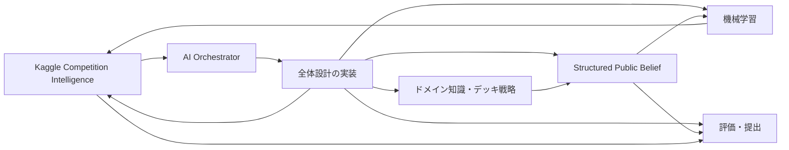
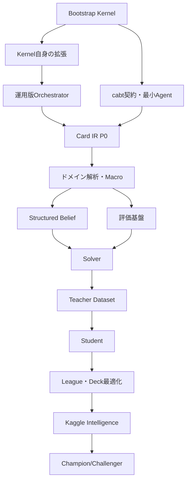

# MAGE-PTCG 計画書索引

## 1. 目的

この索引は、機能、実装モジュール、計画書、実装計画書の対応を示します。実装担当者は、担当する機能名から参照すべき文書を特定できます。

---

## 2. 文書構造



| 番号 | 分野 | 計画書 | 実装計画書 |
|---:|---|---|---|
| BK | Bootstrap Kernel | — | [`BK`](../../agent/ai_orchestrator/bootstrap_kernel_implementation_plan.md) |
| OR | AI Orchestrator | — | [`OR`](../../agent/ai_orchestrator/ai_orchestrator_implementation_plan.md) |
| 00 | 全体設計 | [`00`](../design/00_overall_plan.md) | [`00`](../implementation/00_overall_implementation_plan.md) |
| 01 | ポケカ知識・デッキ戦略 | [`01`](../design/01_domain_knowledge_and_deck_strategy_plan.md) | [`01`](../implementation/01_domain_knowledge_and_deck_strategy_implementation_plan.md) |
| 02 | Belief・探索 | [`02`](../design/02_structured_public_belief_and_solver_plan.md) | [`02`](../implementation/02_structured_public_belief_and_solver_implementation_plan.md) |
| 03 | 機械学習 | [`03`](../design/03_machine_learning_teacher_student_plan.md) | [`03`](../implementation/03_machine_learning_teacher_student_implementation_plan.md) |
| 04 | Kaggle適応・共同最適化 | [`04`](../design/04_kaggle_competition_intelligence_and_joint_optimization_plan.md) | [`04`](../implementation/04_kaggle_competition_intelligence_and_joint_optimization_implementation_plan.md) |
| 05 | 評価・提出・Strategy | [`05`](../design/05_evaluation_submission_and_strategy_plan.md) | [`05`](../implementation/05_evaluation_submission_and_strategy_implementation_plan.md) |
| 06 | 継続学習・オフライン対戦ベンチマーク | [`06`](../design/06_continuous_league_benchmark_and_training_specification.md) | `src/mage_ptcg/continuous_league/` |

---

継続学習・オフライン対戦ベンチマークの正典は[06｜設計・運用仕様](../design/06_continuous_league_benchmark_and_training_specification.md)である。運用手順は[runbook](../../runbooks/continuous-league.md)に分離する。旧提案は同仕様の背景資料として参照する。

## 3. 機能別索引

| 機能 | 説明 | 計画書 | 実装正典 |
|---|---|---|---|
| Bootstrap Kernel | run、snapshot、single worker、clean verification | — | BK |
| ProgramOrchestrator | state、risk、routing、approval、verification | — | OR |
| Card Effect IR | カード効果の実行意味表現 | 01 | 01 |
| Behavioral Verification | cabt実行結果との照合 | 01 | 01 |
| Card Ontology | カード役割・関係表現 | 01 | 01 |
| Deck Grammar | 60枚制約付きデッキ生成文法 | 01/04 | 01/04 |
| Core/Engine/Flex/Tech | デッキ構造分解 | 01 | 01 |
| Prize Route | サイド取得経路計算 | 01 | 01 |
| Energy Flow | エネルギー供給計画 | 01 | 01 |
| Attacker Chain | 攻撃役継投評価 | 01 | 01 |
| Bench Liability | ベンチ負債評価 | 01 | 01 |
| ExactConstraintState | 確定情報の制約集合 | 02 | 02 |
| GameBelief | 手札・山札・サイドの分布 | 02 | 02 |
| OpponentPlayerModel | 相手方策傾向 | 02/04 | 02/04 |
| SMC | 粒子によるBelief更新 | 02 | 02 |
| Belief Recovery | 粒子全滅からの復旧 | 02 | 02 |
| Dynamic Macro | 戦術抽象行動 | 02 | 02 |
| ES-MCCFR | 不完全情報探索 | 02 | 02 |
| Safe Re-solving | Blueprintを壊しにくい局所解決 | 02 | 02 |
| Public Value | 公開状態の勝率評価 | 03 | 03 |
| Private Value | 粒子条件付き評価 | 03 | 03 |
| Counterfactual Value | CFR葉評価 | 03 | 03 |
| Regret Head | 探索warm start | 03 | 03 |
| Expert Iteration | Teacher探索からの反復学習 | 03 | 03 |
| Distillation | TeacherからStudentへの圧縮 | 03 | 03 |
| League/PSRO | Population学習 | 03/04 | 03/04 |
| Episode Ingestion | Kaggle対戦取得 | 04 | 04 |
| Replay Normalization | Replayの表形式化 | 04 | 04 |
| Deck Fingerprint | 相手デッキ特徴推定 | 04 | 04 |
| Meta Posterior | 時変メタ推定 | 04 | 04 |
| Regret Mining | 敗戦局面の再解析 | 04 | 04 |
| Opponent Surrogate | 公開行動を模倣する対戦相手 | 04 | 04 |
| MAP-Elites | デッキ多様性探索 | 04 | 04 |
| Champion/Challenger | 提出候補比較 | 04/05 | 04/05 |
| Paired Evaluation | 共通乱数による比較 | 05 | 05 |
| Versioned Offline Benchmark | 固定Anchorと時変Metaの分離評価 | 05/06 | 05/06 |
| Continuous Checkpoint Evaluation | 学習中checkpointの非同期評価 | 03/05/06 | 03/05/06 |
| Population Epoch Rollover | 新相手追加時のidentity付き学習継続 | 03/04/06 | 03/04/06 |
| Opponent Intake | Team remoteと公開deckの版固定取り込み | 04/06 | 04/06 |
| Kaggle Rating Calibration | offline指標からonline ratingへの校正 | 05/06 | 05/06 |
| 継続学習・対戦ベンチマーク | 固定Replay学習、checkpoint評価、相手更新、rollover | 06 | `continuous_league` |
| Runtime Tier | 提出構成の段階化 | 05 | 05 |
| Soak Test | 長期安定性試験 | 05 | 05 |
| Strategy Report | 戦略部門提出物 | 05 | 05 |

---

## 4. 実装モジュール別索引

```text
scripts/orchestration/ → BK, OR

src/
├── cards/          → 01
├── domain/         → 01
├── decks/          → 01, 04
├── belief/         → 02
├── macros/         → 02
├── solver/         → 02
├── models/         → 03
├── training/       → 03
├── league/         → 03, 04
├── competition/    → 04
├── evaluation/     → 05
├── runtime/        → 00, 02, 03, 05
└── reporting/      → 05
```

---

## 5. データArtifact別索引

| Artifact | 生成元 | 利用先 |
|---|---|---|
| `card_effect_ir.parquet` | cards | domain, macros, simulator validation |
| `card_behavior_fixtures/` | cards | regression tests |
| `deck_profiles.parquet` | decks | belief, models, league |
| `belief_particles/` | belief | solver, models |
| `macro_trajectories/` | solver | models, option mining |
| `teacher_targets/` | solver | training |
| `selfplay_episodes/` | league | training, evaluation |
| `kaggle_replays/` | competition | meta, regret mining |
| `opponent_surrogates/` | competition | league |
| `evaluation_results/` | evaluation | promotion gate, report |

---

## 6. 実装開始順



最初に、単一provider・単一worker・clean verificationを備えたBootstrap Kernelを直接実装します。Kernelが自己変更を1件処理できた時点から、Triage、Design、Specification、R2/R3 review等をKernel自身へ実装させます。

MAGE本体はKernelの実用条件を満たした範囲から開始し、Gate Item単位で投入します。依存関係を無視して全moduleを同時結合せず、契約とfixtureを先に固定します。

G0期限は2026-07-13です。Kernel先行による遅延が発生した場合は、G0を通過したことにせず実達成日時を記録します。

## 7. 正典の参照方法

- 数式や概念の意味を確認する場合：計画書
- 型や関数の責務を確認する場合：実装計画書
- 大会日程や提出Gateを確認する場合：05
- 全体の接続や責務境界を確認する場合：00
- Bootstrap Kernelの直接実装範囲を確認する場合：[`bootstrap_kernel_implementation_plan.md`](../../agent/ai_orchestrator/bootstrap_kernel_implementation_plan.md)
- AI workerの状態・risk・承認を確認する場合：[`ai_orchestrator_implementation_plan.md`](../../agent/ai_orchestrator/ai_orchestrator_implementation_plan.md)
- 文書群の入口と正典順を確認する場合：[`MAGE_PTCG_v5_README.md`](../MAGE_PTCG_v5_README.md)
- 現在の作業状況・進捗・引き継ぎを確認する場合：[`../../status/current_status.md`](../../status/current_status.md)
- Notionページ対応と同期規則を確認する場合：[`../../notion/page_map.yaml`](../../notion/page_map.yaml)
