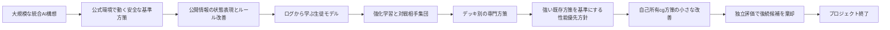
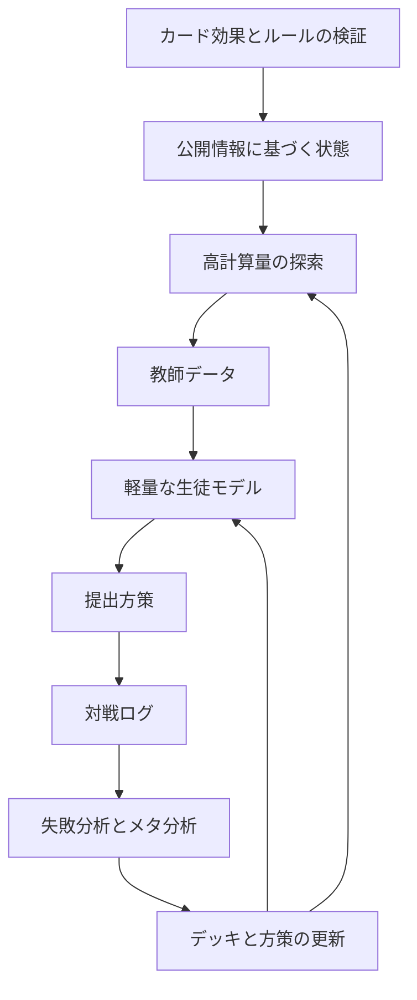
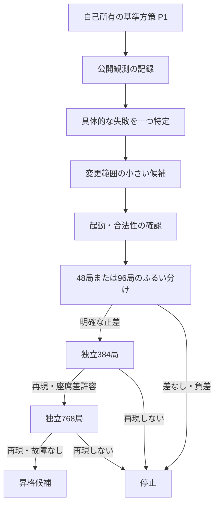
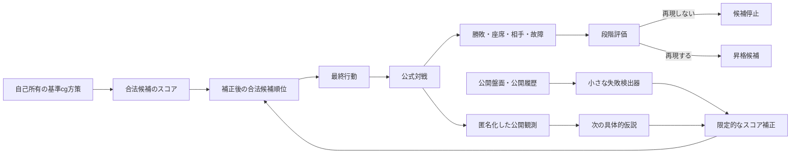
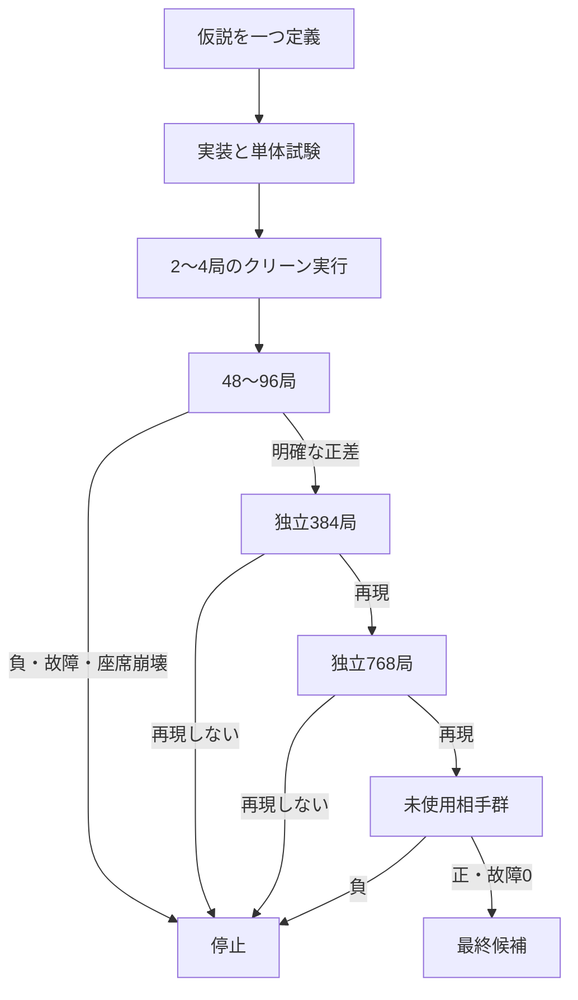

# MAGE-PTCG / Kaggle Pokémon TCG AI Battle プロジェクト総括報告書

> **対象期間**：2026年7月上旬〜2026年8月17日  
> **作成日**：2026年8月17日  
> **対象**：Kaggle Pokémon TCG AI Battle Challenge の Simulation 部門を主対象とした、デッキと対戦方策の開発プロジェクト  
> **状態**：プロジェクト終了後の振り返り  
> **文書の目的**：後から初めて読む人でも、何を目指し、何を作り、なぜ方針を変え、何が成功・失敗したのかを追える形で残す

---

## 目次

1. [この報告書の読み方](#1-この報告書の読み方)
2. [全体要約](#2-全体要約)
3. [プロジェクトの目的と制約](#3-プロジェクトの目的と制約)
4. [全体の流れ](#4-全体の流れ)
5. [時系列で見た取り組み](#5-時系列で見た取り組み)
6. [初期に考えていたアーキテクチャ](#6-初期に考えていたアーキテクチャ)
7. [アーキテクチャと方針が変わった理由](#7-アーキテクチャと方針が変わった理由)
8. [実際に行った作業](#8-実際に行った作業)
9. [主要な実験結果](#9-主要な実験結果)
10. [評価方法の変化](#10-評価方法の変化)
11. [最終盤の実効アーキテクチャ](#11-最終盤の実効アーキテクチャ)
12. [うまくいったこと](#12-うまくいったこと)
13. [うまくいかなかったこと](#13-うまくいかなかったこと)
14. [最大の反省点](#14-最大の反省点)
15. [判断・開発姿勢の変化](#15-判断開発姿勢の変化)
16. [理想的にはどう進めるべきだったか](#16-理想的にはどう進めるべきだったか)
17. [残った資産と再利用価値](#17-残った資産と再利用価値)
18. [最終状態と未確認事項](#18-最終状態と未確認事項)
19. [今後同種の企画で守るべき原則](#19-今後同種の企画で守るべき原則)
20. [用語集](#20-用語集)
21. [主要資料・成果物の索引](#21-主要資料成果物の索引)
22. [結語](#22-結語)

---

# 1. この報告書の読み方

## 1.1 情報の確度

本書は、次の情報を統合して作成した。

- 会話内で共有された進捗報告
- 引き継ぎ用のコンテキストパック
- `docs/status/` と `docs/evidence/` に相当する状態・証拠記録
- 実験結果の要約
- 計画書、設計書、実装指示書
- 提出物のローカル検証記録
- ファイルライブラリに残っている Markdown、差分、実験台帳

内容は次の4種類に分けて扱う。

| 表記 | 意味 |
|---|---|
| **確認済み** | 実行結果、勝敗、テスト結果、成果物などが記録に残っている |
| **当時の計画** | 設計・実装予定として文書化されたが、完了したとは限らない |
| **解釈** | 複数の結果から本書で整理した考察 |
| **未確認** | 現在参照できる資料だけでは確定できない |

本文では、成果物の識別子やアルゴリズムの固有名詞だけ原名を残し、意味は日本語で説明する。略語や内部名の定義は[用語集](#20-用語集)にまとめた。

## 1.2 数値を読むときの注意

このプロジェクトでは、対戦相手、デッキ、座席、乱数、評価器が何度も更新された。異なる時期の勝率を単純比較してはいけない。

- 96局と768局では、標本数だけでなく相手群も違う場合がある。
- 同じ方策名でも、デッキや設定が違えば別候補である。
- 公式ゲームエンジンの内部乱数を完全固定できない時期があった。
- オフラインの正解率や損失は、実対戦勝率を直接表さない。
- 公開順位表の得点は対戦局数や対戦相手が不明で、ローカル勝率へ変換できない。
- テスト件数は時期ごとに対象範囲が違うため、単純な進捗指標ではない。
- 本書に出る「ポイント」は、原則として勝率の百分率差である。

## 1.3 現在確認できていないもの

- 実際にKaggleへ最後に送信した提出物の識別番号
- 最終順位、最終レーティング、最終得点
- 2026年8月17日時点のKaggle画面上の確定結果
- 最終提出物と、ローカルで最良だった候補が同一かどうか
- Gitの全コミット履歴を通した完全な変更一覧

そのため、本書は開発・研究の過程を詳細に記録する一方、最終順位については推測しない。

---

# 2. 全体要約

## 2.1 一言でまとめると

当初は「カード知識、公開情報の推定、探索、教師モデル、生徒モデル、強化学習、デッキ最適化、対戦相手収集、提出物生成」を一体化した大規模システムを目指した。

しかし、実際の勝率改善より先に基盤、安全性、文書、評価制度が大きくなりすぎた。終盤になって、強い既存方策を壊さず、公開情報だけを使った小さな変更を段階的に評価する方式へ切り替えた。

最終的には、研究上の基準として **`cg-lethal-target-v1 + root deck`（終盤に固定した基準デッキとの組合せ）** が残った。一方、その後の候補は短い評価では良く見えても、独立した長い評価で改善が消えるか逆転した。最終目標だった「強い既存方策を上回り続ける改善ループ」までは到達しなかった。

## 2.2 達成できたこと

- 公式対戦環境で合法に動く、決定的な基準方策を構築した。
- デッキ60枚制約、提出形式、依存関係、クリーン環境実行を検証する仕組みを作った。
- 相手の非公開情報を保存しない観測記録を作った。
- デッキ、方策、対戦相手、乱数、座席、評価設定をハッシュで固定する再現基盤を作った。
- チーム内外の対戦相手を安全に取り込むための権限・検証・隔離基盤を作った。
- 行動模倣、価値学習、再帰モデル、方策勾配、探索教師、デッキ探索を幅広く実装・検証した。
- 短い評価の偶然を長い評価で棄却する仕組みが終盤に機能した。
- 最終候補のローカル提出パッケージは、クリーン環境の検証を通過した記録がある。
- 改善しなかった候補を無理に昇格させず、根拠とともに停止できた。

## 2.3 達成できなかったこと

- 強い既存方策がおよそ72%を記録した評価条件に対し、同等以上の自己所有候補を作ること。
- オフライン指標の改善を、安定した実対戦勝率の改善へ変換すること。
- デッキと方策を交互に改善し続ける長時間ループを開始すること。
- 独立した複数の評価群で、後続候補が基準方策を再現性高く上回ること。
- 最終盤の候補を、遠隔提出まで含めて完全に閉じること。
- 最終順位や提出結果を、プロジェクト内の正典記録へ確実に残すこと。

## 2.4 最終状態の整理

| 項目 | 最終的な位置づけ |
|---|---|
| 研究上の最良基準 | `cg-lethal-target-v1 + root deck`。`root deck`は終盤に固定した基準デッキ |
| 後続候補 | 独立評価で改善が再現せず、昇格なし |
| 最終CEM候補 | `cg-p1-cem-incumbent-g01-c83df4408b24`。未使用の上位相手群で約−2.99ポイント、予備相手群で約−0.94ポイント。昇格不可 |
| 既定方策 | 変更を確認できず。ルール方策v0系を維持した記録が中心 |
| 長時間学習 | 開始条件を満たさず、未開始 |
| ローカル提出検証 | `PASS / READY_TO_SUBMIT` の記録あり |
| 遠隔提出条件 | 認証・遠隔契約が未確認だった記録あり |
| 実際の最終提出 | 未確認 |
| 最終順位・得点 | 未確認 |
| 最終目標 | 未達 |

## 2.5 最も大きな結論

**最も大きな問題は、候補を作れなかったことではない。短い評価で良く見える候補を、独立した相手群・座席・乱数条件でも良い候補として維持できなかったことである。**

終盤には次の現象が繰り返された。

1. 48局または96局では改善して見える。
2. 384局では差が小さくなるか、座席差が問題になる。
3. 768局または別の対戦相手群では符号が反転する。
4. 昇格を止める。

最終的なボトルネックは次の3点だったと考えられる。

- 対戦相手群ごとの挙動差
- 先攻・後攻に相当する座席差
- 小標本における勝率分散

---

# 3. プロジェクトの目的と制約

## 3.1 競技上の目的

最初の目的は、Kaggle Pokémon TCG AI Battle Challenge の Simulation 部門で高い実戦性能を得ることだった。

最適化対象は単なる機械学習モデルではない。

| 対象 | 内容 |
|---|---|
| デッキ | 60枚のカード構成 |
| 方策 | 盤面に応じてどの合法行動を選ぶか |
| 知識 | カード効果、コンボ、対面ごとの計画 |
| 探索 | 将来の手順を読む処理 |
| 実行構成 | 制限時間、メモリ、パッケージ、依存関係 |
| 評価 | 対戦相手、座席、乱数、故障を含む比較方法 |

総合価値は次のように考えていた。

```text
総合価値
= 実戦での勝ちやすさ
+ 未知の相手への頑健性
- タイムアウト
- 不正な行動
- クラッシュ
- 提出環境でのみ起きる不具合
```

## 3.2 公式環境に由来する制約

- 提出物は決められた構造を持つ必要がある。
- `main.py` と `deck.csv` が提出物の上位に必要だった。
- デッキは正確に60枚でなければならない。
- 公式のカード識別番号を使う必要がある。
- 毎回、提示された合法候補の中から行動を返す必要がある。
- 単一選択だけでなく、複数の番号を同時に返す行動がある。
- 相手の手札、山札順、サイドの中身などを利用してはいけない。
- 実行時間、メモリ、依存関係、ファイルサイズに制約がある。
- ローカルで動いても、提出環境で動くとは限らない。
- 公開順位表だけでは、対戦相手や局数を知ることができない。

## 3.3 期限とスコープ

初期計画では、Simulation部門の締切を **2026年8月17日 08:59 JST** として管理していた。

この短い期間に対し、初期構想はかなり大きかった。

- 公式環境の理解
- ルール方策
- データ収集
- 外部対戦相手
- 公開情報推定
- 探索
- 教師データ
- 生徒モデル
- 強化学習
- デッキ探索
- 提出検証
- 長時間耐久試験

約5週間でこれらをすべて閉じる計画は、技術的には魅力的だったが、実行上は過大だった。

## 3.4 目標の変化

| 時期 | 主な目標 |
|---|---|
| 初期 | 完全な統合AIを作る |
| 7月中旬 | まず合法に動く基準方策と公開情報ループを完成させる |
| 7月下旬 | ログから学ぶ生徒モデルと強化学習を成立させる |
| 8月初旬 | デッキごとの専門方策を作り、メタ環境に合わせる |
| 8月第2週 | 実対戦勝率を最優先し、強い既存方策を起点にする |
| 最終盤 | 自己所有の強い方策を壊さず、小さな公開情報修正だけを段階評価する |

この変化自体は合理的だった。しかし、実戦中心の目標へ切り替わった時点が遅かった。

---

# 4. 全体の流れ

## 4.1 プロジェクトの変遷



## 4.2 当初想定した改善ループ



## 4.3 最終盤に実際に機能した改善ループ



この最終ループは初期構想よりはるかに小さい。しかし、実際の勝率改善を判断するという意味では、最も競技目的に近かった。

---

# 5. 時系列で見た取り組み

## 5.1 主要な出来事

| 時期 | 取り組み | なぜ行ったか | 結果 |
|---|---|---|---|
| 7月上旬 | 競技仕様、カード、公式実行環境の調査 | まず対戦を成立させる必要があった | 最小の合法エージェントとデッキ検証へ進んだ |
| 7月11〜12日頃 | MAGE-PTCGの大規模設計 | 探索・学習・知識・デッキを統合したかった | 技術的には詳細だが、期限に対して広すぎた |
| 7月13日頃 | 自動実装・監査用の制御基盤 | 複数AIによる変更を安全に統合したかった | 作業分離と証拠保存は進んだが、運用が重くなった |
| 7月14日頃 | 最初の公式対戦、決定的合法方策 | 実行不能な高度機能より、動く基準が必要だった | ルール方策v0の土台ができた |
| 7月14〜15日頃 | 観測記録、公開情報状態、知識パック | 非公開情報を使わず、判断根拠を構造化するため | 公開情報ループは成立した |
| 7月15日頃 | ルール方策v1、400局評価 | 公開情報と知識でv0を改善できるか確認 | 205対195だったが、同一挙動や乱数問題があり昇格根拠にならず |
| 7月中旬 | Kaggle API・OAuth・リプレイ取得の調査 | 実対戦ログを学習へ使いたかった | 提出メタデータは取得できたが、エピソードやリプレイは得られず |
| 7月20〜23日頃 | 対戦相手工場、権限管理、チーム方策の隔離実行 | 多様な相手で評価・学習するため | 再利用可能な対戦相手集団の基盤ができた |
| 7月23〜26日頃 | 生徒モデルv2、提出パッケージ、再帰モデル | ルール方策を模倣しつつ一般化する軽量モデルが必要だった | オフライン精度は高かったが、実戦優位を証明できなかった |
| 7月26〜28日頃 | 行動模倣、AWR、PPO、V-trace、DAgger | 固定ログ学習から閉ループへ進めるため | 学習更新は成立したが、ルール方策v0を安定して上回れなかった |
| 8月1日頃 | メタ駆動のデッキ専門方策へ再設計 | 汎用モデルより、主要デッキごとの専門化が有望と考えた | 1提出＝1デッキ＋1方策へ設計を整理した |
| 8月7〜10日頃 | メタ特化方策、再帰モデル、探索教師 | 上位メタに特化した勝率改善を狙った | 一部デッキで改善したが、全体では不安定だった |
| 8月11〜12日頃 | 性能優先への強制転換 | 残り時間が少なく、基盤より実勝率が重要になった | 強い既存方策を壊さず使う方向へ転換した |
| 8月13〜14日頃 | 自己所有の`cg`方策、提出互換、P1作成 | 外部方策の権限問題を避け、強い自己所有経路を作るため | `cg-lethal-target-v1` がP0より良い研究基準になった |
| 8月14日 | 公開観測4,077判断の収集 | 失敗に基づいて次の修正を設計するため | 非公開情報を使わず、候補設計が可能になった |
| 8月14〜15日 | 小変更、デッキ交互探索、交差エントロピー法（CEM） | P1周辺で再現可能なP2を探すため | 短期の正差が独立評価で消え、昇格なし |
| 8月17日 | プロジェクト終了 | 競技・作業期間の終了 | 最終目標未達。研究・実装資産と教訓が残った |

## 5.2 方針転換の節目

### 節目1：完全な統合AIから、動く基準方策へ

初期は、公開情報推定、探索、教師、生徒、強化学習まで一気に作る構想だった。

しかし、公式環境で合法に動くこと、デッキを正しく登録すること、複数選択を返すことなど、基本契約だけでも難しかった。そこでルール方策v0を常時動く基準として確立した。

### 節目2：外部リプレイ依存から、ローカル評価へ

Kaggle側から十分な対戦ログが得られなかったため、外部データを前提にした学習ループは成立しなかった。

この時点で、対戦相手集団、ローカル対戦、公開順位表、チーム内方策を使う方向へ切り替えた。

### 節目3：汎用学習から、デッキ別専門化へ

単一の汎用モデルでは、デッキごとの戦略差を吸収しにくかった。さらに、同じ状態でもデッキによって有効な行動が違う。

そのため、フーディン、オーロンゲ、イワパレス、ロケット団ミュウツー、ブリジュラスなど、主要な系統ごとに方策を分ける設計へ進んだ。

### 節目4：生徒モデル置換から、強い既存方策の限定修正へ

学習モデルはオフライン精度を上げても、実対戦でルール方策や強い既存方策を下回った。

そこで、全面置換をやめた。

```text
強い既存方策の提案
→ 公開情報だけで価値を確認
→ 十分な差がある場合だけ変更
→ それ以外は元の行動を維持
```

### 節目5：モデル中心から、評価中心へ

終盤は「何を学習するか」より「本当に改善したか」を重視した。

- 96局は故障と壊滅の確認
- 384局は方向確認
- 768局は再現性確認
- 座席差、相手群差、故障を別に見る
- 独立評価で符号が変われば停止

この評価中心への転換が、最終盤で最も重要な改善だった。

---

# 6. 初期に考えていたアーキテクチャ

## 6.1 初期構想の全体像

初期のMAGE-PTCGは、次の層を持つ統合システムとして設計された。

| 層 | 役割 |
|---|---|
| 公式環境層 | カード識別番号、合法手、ゲーム進行を検証 |
| カード効果層 | カード効果を機械可読な中間表現へ変換 |
| ドメイン知識層 | デッキ構造、コンボ、対面計画、勝ち筋を保持 |
| 公開情報推定層 | 観測できる情報から、相手の可能性を表現 |
| 行動抽象化層 | 多数の細かい行動を戦略的なまとまりへ変換 |
| 探索層 | 将来の手順を読み、高品質な行動を選ぶ |
| 教師層 | 高計算量で方策・価値・後悔値を生成 |
| 生徒層 | 提出環境で高速に行動を選ぶ |
| 実行時コンパイラ | モデル、ルール、キャッシュ、探索予算を提出物へ統合 |
| 評価・改善層 | 対戦ログからメタ、失敗、デッキ、方策を更新 |

## 6.2 初期構想が合理的だった理由

このゲームは単純な盤面分類では解けない。

- 相手の手札や山札順は見えない。
- 同じ盤面でも、過去に見えたカードによって意味が変わる。
- デッキごとに勝ち筋が異なる。
- 行動は複数段階で選ばれる。
- 1手の価値は数ターン後に現れる。
- ルール違反やタイムアウトは、勝率以前に致命的である。

したがって、公開情報に基づく状態、ドメイン知識、探索、軽量方策を分ける発想は正しかった。

## 6.3 公開情報に基づく状態

「ゲームの真の状態」ではなく、「プレイヤーが合法的に知っている情報」を正典にした。

含めるもの：

- 公開盤面
- 自分の手札
- 公開されたカード
- 過去の公開行動
- 自分が知った山札上部・下部
- ターン中の行動済みフラグ
- 相手デッキの候補分布
- 公開情報から導ける制約

含めないもの：

- 相手の実際の手札
- 相手の山札の正確な順番
- 相手のサイドの中身
- ゲームエンジン内部の非公開状態

この境界は、競技の公平性だけでなく、再現可能な学習データを作るうえでも重要だった。

## 6.4 認証付きドメイン解析

カードゲームの知識をすべて学習モデルへ任せず、確実な情報と推測を分ける構想だった。

| 種類 | 例 | 使い方 |
|---|---|---|
| 厳密 | 合法手、現在の打点、即時勝利 | 強制条件として使う |
| 安全な上限・下限 | 最短攻撃ターン、必要エネルギー | 枝刈りや危険判定に使う |
| 推測 | サイド経路、ベンチ負債、到達確率 | 特徴量や候補順位に使う |
| 経験則 | 対面ごとの定石 | 提案や優先順位に使う |

これは良い設計だった。ただし、厳密性を付与するための検証コストが大きく、短期競技では全範囲を完成させられなかった。

## 6.5 教師と生徒の分離

提出環境では計算量が限られるため、次の分離を考えた。

- **教師**：ローカルで時間をかけて探索し、高品質な正解候補を作る。
- **生徒**：教師を模倣し、提出環境で高速に動く。
- **価値モデル**：行動や状態の将来勝率を推定する。
- **短い探索**：重要な局面だけ、生徒の提案を再確認する。

理論上は妥当だった。しかし、教師の品質と公開情報境界が十分でないまま、生徒の構造や損失関数を多く試したことが後の問題になった。

---

# 7. アーキテクチャと方針が変わった理由

## 7.1 初期設計と実際の差

| 初期の想定 | 実際に起きたこと | 変更 |
|---|---|---|
| 外部対戦ログを継続取得できる | APIでエピソードやリプレイを得られなかった | ローカル対戦中心へ |
| 高品質な探索教師を作れる | 非公開情報境界、速度、クラッシュが問題 | ルール方策、公開探索、小さな教師へ |
| 生徒が教師を模倣すれば強くなる | 正解率が高くても勝率が上がらない | 勝率で早期に切る |
| 汎用モデルで複数デッキを扱える | デッキごとの差が大きい | 専門方策へ |
| 100局程度で候補を選べる | 96局の正差が384/768で反転 | 段階評価へ |
| すべての相手で非悪化を要求する | 低重要度の相手が全体判断を歪める | メタ重み付き評価へ |
| ルール方策を生徒へ置換する | 生徒化で強い挙動を失う | 既存方策を基準に限定上書き |
| 大規模な完全設計を期限内に実装する | 基盤が膨らみ、実勝率改善が遅れた | 最小変更・最大3タスクへ |

## 7.2 外部データ取得の失敗

Kaggle APIへの認証や提出一覧取得は成功した。しかし、学習に必要だった次の情報は取得できなかった。

- 対戦エピソード
- リプレイ
- 合法行動列
- 行動ログ
- 詳細な対戦相手情報

この結果、当初の「Kaggle対戦→ログ→学習→再提出」という閉ループは作れなかった。

代わりに整備したもの：

- ローカル公式環境での大量対戦
- チーム内の方策
- 公開コード・公開デッキの証拠登録
- 公開順位表の固定時点保存
- 対戦相手集団の版固定
- ローカル評価結果の台帳

## 7.3 行動表現の問題

大きな転換点の一つは、複数選択の重要性が明らかになったことだった。

800局の監査では次が確認された。

- 13,452回の判断のうち267回が複数選択
- 800局のうち218局、約27.25%で少なくとも1回の複数選択が発生

既存の学習経路には、複数選択を除外したり、不完全に変換したりする箇所があった。

単一の番号を当てる問題として学習しても、実際の環境では番号の集合や順序付きの複数選択が必要である。そのため、アルゴリズム比較より先に次を統一する必要が生じた。

- 合法候補の安定した識別子
- 単一選択と複数選択の共通契約
- 完全な行動が終了した時点でのみ状態を進める処理
- 物理的に同じ意味を持つ候補の正規化
- 不正確な行動列を学習データから除く仕組み

## 7.4 オフライン指標と勝率のずれ

学習モデルは、損失や正解率で改善しても、実戦勝率で悪化することがあった。

主な理由：

- 教師が必ずしも強くない。
- 教師のわずかな模倣誤差で、その後の局面分布が変わる。
- 勝敗に重要でない頻出行動が損失を支配する。
- 序盤の簡単な行動で正解率が上がり、終盤の重要行動が改善しない。
- 負けた局面の行動も模倣する。
- 学習データにない状態へ、生徒自身が入り込む。
- 学習相手と評価相手の分布が違う。
- 同じ損失でも座席ごとの性能が大きく違う。

このため、終盤はオフライン指標を「学習が壊れていないか」の確認に限定し、昇格判断は実対戦へ移した。

## 7.5 強い既存方策を壊す問題

複数の実験で、学習モデルはルール方策v0や強い既存方策より弱くなった。

```text
旧：
学習モデルがすべての行動を決める

新：
強い既存方策が行動を提案する
→ 学習・探索は、その提案より明確に良いと判断した場合だけ変更する
```

この変更により、学習側が不確かな状態では元の強さを維持できる。

## 7.6 すべて非悪化という過剰な条件

一時期は、複数の固定相手のうち大多数で悪化しないことを重視していた。

問題：

- 競技で重要でない相手の小さな悪化が、重要相手での大幅改善を阻害する。
- すべての相手へ均等に適応し、上位メタへの特化が弱くなる。
- 標本数が少ない対面の偶然に引きずられる。

最終的には次を主指標にした。

- 上位メタを反映した重み付き期待勝率
- 両座席での壊滅がないこと
- 複数の独立評価で方向が一致すること
- 故障が増えていないこと
- 一つの相手だけで稼いでいないこと

---

# 8. 実際に行った作業

## 8.1 開発統制・Git・自動実装基盤

### 8.1.1 目的

複数のAIエージェントを使い、長時間の実装と監査を進めるため、次を重視した。

- 作業領域の分離
- 変更可能なファイルの制限
- 保護ファイルの監視
- 実装と監査の分離
- 差分の自動検証
- 失敗時の停止
- 成果物のハッシュ
- 人間承認が必要な操作の分離

### 8.1.2 実装した考え方

- 元の作業領域を直接編集せず、別の分離作業領域（Git worktree）を使う。
- AIが出した差分だけを取り込む。
- 実装後に読み取り専用の監査を行う。
- 検証専用の分離作業領域を新しく作り、差分を再適用して試験する。
- 秘密情報、環境変数、絶対パスを報告へ出さない。
- 自動コミットを低リスク変更だけに限定する。
- 遠隔リポジトリへの反映、遠隔ブランチ作成、Kaggle提出は、人間の明示指示なしに行わない。

### 8.1.3 良かった点

- 既存の安定版を壊しにくかった。
- 複数AIの変更を分離できた。
- 差分と実験結果の追跡がしやすかった。
- 秘密情報や絶対パスの混入を抑えた。
- ブランチ整理時も、取り込み済みか確認してから削除できた。

### 8.1.4 問題点

- 制御基盤そのものの実装と検証に時間を使った。
- 作業開始までの確認項目が多かった。
- 未整理の変更が残った作業領域が原因で、処理が止まることがあった。
- 状態ファイル、引き継ぎ文書、監査文書が増えすぎた。
- 「安全に何も壊さないこと」が「勝率を上げること」より強い目標になった時期があった。
- AIが慎重すぎて、外部承認が不要な作業まで止める傾向があった。

### 8.1.5 後半の修正

- 読み取り、ローカル実験、限定実装は質問せず進める。
- 次に行う作業を最大3件に限定する。
- 同型の失敗を2回繰り返したら強制的に方針転換する。
- 文書を大量に作らず、目標整合ログと判断ログを中心にする。
- 最終勝率へつながらない監査は後回しにする。

---

## 8.2 公式実行環境と最小対戦基盤

### 8.2.1 最初に必要だったもの

1. デッキを読み込む。
2. 60枚であることを確認する。
3. 公式カード識別番号を確認する。
4. 公式環境で対戦を開始する。
5. 提示された合法候補から選ぶ。
6. 対戦終了を記録する。
7. 例外、タイムアウト、不正行動を分類する。

### 8.2.2 基準方策

| 段階 | 内容 |
|---|---|
| 最低限 | 最初の合法候補を選ぶ |
| 決定的合法方策 | 優先順位に従い、同じ状態では同じ行動を返す |
| ルール方策v0 | ルールと一般的なカードゲーム知識を使う |
| ルール方策v1 | 公開情報状態と追加知識を使う |

ルール方策v0は、学習モデルが失敗した場合にも戻れる基準となった。

### 8.2.3 提出形式

```text
submission.tar.gz
├── main.py
├── deck.csv
├── 方策またはモデル
├── 必要なライブラリ
└── 検証用マニフェスト
```

検証内容：

- 展開後に正しいファイルがある。
- ファイル順、属性、ハッシュが期待どおりである。
- リポジトリがなくても動く。
- クリーンなPython環境で読み込める。
- 公式環境の短い対戦を完了できる。
- 不正行動、例外、タイムアウトがない。
- 提出物内に不要な秘密・キャッシュ・絶対パスがない。

---

## 8.3 観測・プライバシー・公開情報の状態

### 8.3.1 観測記録

公式環境の観測をそのまま無制限に保存せず、許可した項目だけへ正規化した。

保存したものの例：

- 現在のターン
- 公開盤面
- 自分の公開・既知情報
- 提示された合法候補
- 選んだ行動
- 公開されたカード
- 攻撃、進化、手張り、終了などの行動種別
- 最終勝敗
- 座席、対戦相手、反復番号

保存しなかったものの例：

- 相手の非公開手札
- 相手の山札順
- 相手のサイド内容
- 不透明な内部検索入力
- 無制限に増えるログ
- 実行時間予算の内部情報

### 8.3.2 公開情報状態

公開情報状態は、単なる現在盤面ではなく、過去の知識履歴も含めた。

- 以前に見えたカード
- 公開された探索結果
- 捨て札
- 使われたカード
- 進化・手張り・攻撃の履歴
- 相手デッキ系統の証拠
- 盤面資源の変化

同じ盤面でも、過去に何を見たかが違えば別状態として扱う考え方だった。

### 8.3.3 最終盤の公開観測

P1方策について次を記録した。

- 96局すべて完了
- 故障0
- 4,077件の判断行
- 96件の匿名化されたデッキ登録行
- 非公開・不透明項目の検出0

これは性能評価ではなく、次の候補を作るための観測だった。

重要な判断は、「負けた局面で見えた行動」をそのまま正解ラベルにしなかったことである。勝敗との相関だけでは、行動が敗因だったと証明できない。

---

## 8.4 ルール方策、知識パック、公開情報ループ

### 8.4.1 知識パック

カード知識と定石を、自由文ではなく機械可読な記録へ整理した。

- カード効果
- デッキの核と自由枠
- 初動
- 進化経路
- エネルギー計画
- 攻撃者の交代
- サイド取得経路
- ベンチ管理
- 山札切れ
- 対面ごとの例外
- 優先順位
- 根拠となる証拠

### 8.4.2 知識の扱い

知識には確度を付けた。

- 厳密に確認済み
- 安全な上限・下限
- 経験則
- 未検証
- 評価専用
- 学習に使ってはいけない
- 提出物へ含めてはいけない

これにより、公開データの相関を正解行動と誤解することを防ごうとした。

### 8.4.3 ルール方策v1

ルール方策v1は、公開情報状態と知識を使い、ルール方策v0より良い行動を目指した。

ある400局では205対195だった。しかし、次の問題があった。

- エンジン乱数を厳密に固定できなかった。
- 既定条件でv1がv0と同じ行動を返す箇所があった。
- 10勝差は標本誤差の範囲に近い。
- どの行動変更が勝敗へ寄与したか分からなかった。

別の要約では105対95の比較も記録されているが、これも昇格根拠として十分ではなく、ルール方策v0が維持された。

---

## 8.5 外部情報・Kaggle情報・評価台帳

### 8.5.1 Kaggle側の調査

認証経路は成立し、提出一覧など一部情報を取得できた。

一方、期待していた次のデータは得られなかった。

- エピソード
- リプレイ
- 行動列
- 合法候補
- 詳細な対戦相手情報

そのため、競技側データは次のように分類した。

- 公開順位表の時点観測
- 提出得点
- 公開デッキ統計
- 公開コード・公開文書
- ローカルで再現可能な対戦
- 出所不明・利用範囲不明の情報

### 8.5.2 評価台帳

結果を一つの数値だけで保存せず、次を記録した。

- 対象デッキ
- 対象方策
- 対戦相手
- 基準
- 勝・敗・引き分け
- 局数
- 乱数
- 評価器
- 故障
- 信頼区間
- 不明な項目
- 利用可否
- 解釈上の注意

これは、公開順位表の高得点をローカル勝率や教師品質へ直接変換しないために重要だった。

### 8.5.3 早期の提出・ローカル評価例

| 方策 | 結果 | 注意 |
|---|---:|---|
| `psychic_aggro_v1` | 公開得点304.3または311.3 | 同一提出の時点違い。二重計上不可 |
| `psychic_aggro_v2_bench_fix` | 公開得点441.4 | 対戦局数不明 |
| `simple_priority_resubmission` | 公開得点116.3 | 対戦局数不明 |
| `psychic_aggro_v1` | 241/1300、18.54% | 古い13相手ローカル評価 |
| `ruruko_control_v2_v0` | 521/1300、40.08% | 同じ古い13相手ローカル評価 |

これらは初期改善の証拠ではあるが、後期の評価群とは比較できない。

---

## 8.6 対戦相手工場と対戦相手集団

### 8.6.1 目的

学習と評価には、多様で固定された対戦相手が必要だった。

単にファイルを集めるのではなく、次を分離した。

- デッキ
- 方策
- 互換処理
- 実行設定
- 出所
- 利用権限
- 技術検証
- 対戦相手としての個体

### 8.6.2 安全な取り込み

1. 出所とコミットを固定する。
2. 利用権限を確認する。
3. デッキを検証する。
4. ファイル走査を行う。
5. 秘密、絶対パス、危険な実行を確認する。
6. 未知の依存関係を勝手に導入しない。
7. 隔離した環境で読み込む。
8. 合法行動を返すか確認する。
9. 状態が対戦間で漏れないか確認する。
10. タイムアウト、例外、不正行動を分類する。
11. 速度を測る。
12. 版固定された対戦相手集団へ登録する。

### 8.6.3 権限の分離

- ローカル評価
- 学習相手
- 行動収集
- 教師ラベル
- 派生学習
- チーム内再配布
- 公開再配布
- 提出物への同梱

たとえば、ローカル評価だけ許された方策を、学習教師や提出物へ勝手に使わないようにした。

### 8.6.4 成果と限界

成果：

- チーム方策の版固定
- 隔離実行
- 不変な対戦相手集団
- ハッシュ付きマニフェスト
- 別環境から取得して使う経路
- 対戦リーグ
- 故障と座席の記録
- 公開ソースの証拠登録

限界：

- 一部方策は依存関係や実行形式で利用不能だった。
- 公開コードは権限不明のまま実行・学習へ使えない場合があった。
- 基盤整備は進んだが、競技期間中の勝率改善へ直結するまでに時間がかかった。

---

## 8.7 生徒モデルとオフライン学習

### 8.7.1 初期の再帰型分布Q学習（R2D3）

初期の学習は、固定ログから将来価値を学ぶ再帰型の分布Q学習だった。

主な特徴：

- 過去の行動列を扱う再帰状態
- 合法候補ごとの特徴
- 勝敗価値の分布
- 優先度付き再生
- 保守的なQ学習
- 教師データの補助損失
- 中断・再開

ただし、当時の実装では、学習済み方策が新しい対戦を行い、そのログを再び学ぶ完全な閉ループにはなっていなかった。

### 8.7.2 初期のオフライン成果

記録上、次の成果があった。

- 2,048エピソード
- 96,530判断
- 628,632候補
- 教師行動への一致率約94.33%
- 400局の生存性評価で約57.75%という記録
- 生徒モデルv2 Run A：
  - 検証正解率 93.92%
  - テスト正解率 93.84%
  - 対戦相手保留 94.91%
  - デッキ保留 83.38%

これらは「学習できている」証拠だった。しかし、「基準方策より強い」証拠ではなかった。

### 8.7.3 生徒モデルの提出パッケージ

生徒モデルを実際の提出経路へ接続する作業も行った。

- モデル読込
- 失敗時のルール方策v0への戻り
- 合法候補マスク
- 生徒モデルが選んだ回数の計測
- フォールバック回数の計測
- クリーン展開
- 公式環境の短い対戦
- パッケージのハッシュ

機能面では提出候補として成立した時期がある。一方、実戦性能の優位が証明できなかったため、最終基準の置換には至らなかった。

---

## 8.8 強化学習と閉ループ化

### 8.8.1 実装した方式

| 方式 | 日本語での意味 | 期待した効果 |
|---|---|---|
| 行動模倣 | 強い方策の行動を教師あり学習で真似る | 安定した初期方策 |
| 優位度重み付き回帰 | 勝ちやすかった行動を強く学ぶ | 良い行動へ重みを寄せる |
| PPO | 新しい方策を急に変えすぎない強化学習 | 安定した方策更新 |
| V-trace | 古い方策で集めたデータのずれを補正 | 分散収集と学習の両立 |
| DAgger | 現在の方策が訪れた状態を教師に再ラベルしてもらう | 自己分布での誤差修正 |
| PSRO | 複数方策と相手を集団として更新する | 相手への過学習を抑える |
| 探索教師 | 各候補を試し、価値の高い行動を教える | ルール方策を超えるラベル |

### 8.8.2 第4評価段階（内部名：Gate 4）

約2,000局ずつのデータを使った比較では、候補はルール方策v0を上回らなかった。

256局評価の代表値：

| 候補 | 勝数 / 256 |
|---|---:|
| 再帰型の行動模倣 | 100 |
| 再帰型の優位度重み付き回帰 | 88 |
| 非再帰型の優位度重み付き回帰 | 103 |
| 優位度重み付き回帰＋提案方策 | 102 |

結論は、行動模倣や優位度重み付けだけではルール方策v0を超えられない、というものだった。

### 8.8.3 第5評価段階A（内部名：Gate 5a）

最初のPPO実験は、800局中799局まで進んだところで強制タイムアウトとなり、更新を完了できなかった。

その後、DAggerを使って安定化した再実験では次を達成した。

- 800/800局完了
- 故障0
- 7,924ステップ
- 最初のPPO更新を完了
- 256局評価で113勝
- 行動模倣基準より約5.08ポイント改善

ただし、ルール方策v0を明確に上回る水準ではなく、昇格には至らなかった。

### 8.8.4 主な学び

- 強化学習の更新が動くことと、勝率が上がることは別である。
- 教師や初期方策が弱いと、学習も弱い範囲から出にくい。
- 対戦相手分布が固定されると、鏡像対戦へ過学習しやすい。
- 勝敗だけで重み付けると、どの行動が勝因か分からない。
- 重要な判断の行動条件付き価値が必要だった。
- 複数選択と再帰状態の契約が、アルゴリズムより先に重要だった。

---

## 8.9 メタ駆動のデッキ専門方策

### 8.9.1 再設計の理由

8月初旬には、汎用方策ではなく主要デッキごとの専門方策へ切り替えた。

対象例：

- フーディン
- オーロンゲ ex＋ユキメノコ＋マシマシラ
- イワパレス＋メガガルーラ ex
- ロケット団ミュウツー ex＋ワナイダー
- ブリジュラス ex
- 予備としてシロナのガブリアス

### 8.9.2 順位帯別モデルの修正

当初、Gold、Silver、Bronzeで別モデルを使うようにも読める設計があった。

しかし、提出後に順位帯へ応じてモデルを入れ替えることはできない。そのため次のように修正した。

- Gold、Silver、Bronzeは学習カリキュラムの段階にする。
- 同じモデルの系譜を継続更新する。
- 最終提出は1個のモデルと1個のデッキにする。
- 順位帯を実行時入力にしない。
- 複数デッキを育てても、最後は全系統で一つを選ぶ。
- 新しい提出は過去提出の順位進行を引き継ぐ前提にしない。

### 8.9.3 デッキと方策の交互最適化

候補の識別子を、方策だけでなく次の組として扱った。

```text
候補 = デッキ + 方策設定 + モデル + 評価設定
```

改善ループ：

1. 方策を固定してデッキ候補を比較する。
2. 上位デッキを残す。
3. デッキを固定して方策を学習する。
4. 独立評価する。
5. 良ければ次のデッキ探索へ戻る。
6. 悪ければ直前の組へ戻す。

この考え方は正しかった。ただし、候補の分散が大きく、長時間ループへ進む条件を満たせなかった。

### 8.9.4 非公開情報の複数仮説探索（PIMC）を使う教師

非公開情報を複数の可能な状態として補い、それぞれで行動を試す探索が検討された。

過去のローカル記録には、8対戦相手、約1,599局で、0.6867から0.7361へ約4.94ポイント改善した結果があった。

ただし主経路にするには次が必要だった。

- 新しい独立評価での再現
- 両座席
- 非公開情報漏れの監査
- 教師が実際の非公開状態を見ないこと
- 十分な局数
- 教師の故障と速度の確認

この再現が閉じないまま、最終的な主経路にはならなかった。

---

## 8.10 メタ特化方策、再帰モデル、探索教師

### 8.10.1 目的

上位メタの特定デッキに対して、デッキ別の再帰方策を作ることを目指した。

主な構成：

- 盤面上のカード集合をまとめる表現
- 行動候補同士を比較する機構
- 過去行動を記憶する再帰層
- 勝率予測
- 相手系統の推定
- 行動価値
- 教師の確信度
- 行動模倣
- PPO、V-trace、優位度重み付き回帰
- DAgger
- 公開情報探索
- 対戦相手の難しさに応じた更新

### 8.10.2 データ規模の例

| デッキ系統 | 全記録 | 学習 | 検証 |
|---|---:|---:|---:|
| フーディン | 249,299 | 199,414 | 49,885 |
| ブリジュラス | 162,925 | 130,335 | 32,590 |

エピソード重複や近似重複を避け、学習と検証を分離した。

### 8.10.3 表現と価値予測

メタ特化方策 v3では盤面表現と勝率予測を改善した。

代表例：

- 単純な結果予測の確率誤差（Brier score。低いほど良い）：約0.1261
- 新しい結果予測器：約0.0681
- 相手条件付き：約0.0889
- 無意味な乱数条件付きの負例：約0.1179

勝率予測そのものは改善した。しかし、良い勝率予測が自動的に良い行動方策へつながるわけではなかった。

### 8.10.4 行動模倣と優位度学習

24モデル規模の比較を行い、非線形表現や完全な行動表現が損失を改善した。

一方、優位度重み付き回帰には次の問題があった。

- 行動模倣なしで始めると、一様に近い方策へ崩れた。
- 行動模倣から始めると、初期モデルからほとんど変わらなかった。
- 最良モデルが実質的に初期値のままになる場合があった。

勝敗から得た重みが、行動単位の改善信号として弱かったことを示す。

### 8.10.5 デッキごとの差

V-traceを使った実験では、フーディンだけが大きく改善した記録がある。

- フーディン：約0.423から0.665、約+24.1ポイント
- 残り3系統の合計：約−1.1ポイント
- ブリジュラス：約−1.4ポイント

この結果から、アルゴリズムを全デッキへ一括適用してはいけないことが分かった。

### 8.10.6 Wave系実験

代表的な結果：

- Wave6基準：98/192、51.04%
- balanced v1：100/192、52.08%、+1.04ポイント
- 一様DAgger：96/192、50.00%、−1.04ポイント

balanced v1は全体では小さく改善したが、対面ごとの増減が大きかった。

- 一部の相手では約−15.6ポイント
- 別の相手では約+21.9ポイント

全体平均だけでは、どこで強くなり、どこで壊れたかを判断できなかった。

### 8.10.7 探索教師を使う反復学習（Search-guided ExIt）

公開情報の探索を教師にするExpert Iterationも試した。

短い評価では行動正解率や損失が改善した。

代表的な記録：

- 2乱数の短期段階：
  - 損失約1.78〜1.80
  - ルート行動正解率約0.64〜0.67
  - 完全行動正解率約0.57
  - 故障0
- 次段階の最良：
  - 損失約1.747
  - ルート正解率約0.684
  - 完全行動正解率約0.599
  - 故障0

しかし実対戦では候補の信頼区間が基準より低く、昇格しなかった。

**探索ラベルの正解率を上げるだけでは、実際の勝率を保証できない**という結果だった。

---

## 8.11 性能優先への転換

### 8.11.1 転換の背景

締切まで約1週間となった時点で、次の問題が明確になった。

- 過剰に安全性を重視しすぎている。
- 長時間学習へなかなか進まない。
- 問題の本質を早く見極める必要がある。
- 実際に強い方策を基準にすべきである。
- ルール方策v0やオフライン損失へ目的がずれている。
- 上位メタに対する勝率を優先すべきである。

これを受け、性能優先の方針へ切り替えた。

### 8.11.2 変更した原則

| 旧 | 新 |
|---|---|
| すべての固定相手で非悪化を重視 | 上位メタ重み付き勝率を主指標にする |
| 学習損失と正解率を多く見る | 実対戦を昇格指標にする |
| ルール方策v0を中心に比較 | 強い既存方策を基準にする |
| すべての安全条件まで長時間実験を止める | 384〜768局で明確なら次へ進む |
| モデル全体を置換 | 強い方策を残し、限定的に上書き |
| 同型の実験を別設定で繰り返す | 2回連続失敗で方式を停止 |
| 多数の並列課題 | 次の重要作業を最大3件へ限定 |

低重要度相手の小さな悪化は許容し、次だけを強く防ぐようにした。

- 高重要度相手での壊滅
- 片座席だけの崩壊
- 故障増加
- 一つの相手だけへの過学習
- 未使用相手群での符号反転

### 8.11.3 強い既存方策集団

終盤には、tomato、Lucifer、plamenなどの強い方策群が比較対象となった。

これらを一つへ早く収束させず、異なる挙動を持つ集団として維持する構想だった。

- 現在首位：60〜70%の計算資源
- 次点・異なる挙動：20〜30%
- 探索候補：10%

ただし、外部・チーム方策をそのまま提出へ使えるとは限らない。提出権限、依存関係、パッケージ化を考えると、自己所有の`cg`経路が重要になった。

---

## 8.12 最終盤の自己所有`cg`方策

### 8.12.1 `cg`経路を優先した理由

終盤の課題は、「強いこと」と「提出可能であること」を同時に満たすことだった。

ルール方策v0は提出しやすいが、上位相手に対して弱かった。

外部の強い方策には次の問題があった。

- 提出物への同梱権限
- 派生利用権限
- 実行時依存
- 速度
- クラッシュ
- 不透明な内部状態
- パッケージ化

自己所有の`cg`方策は、これらを避けながらルール方策v0より強い基準を作れる可能性があった。

### 8.12.2 P0：`root-cg-self-owned-v1`

まず、自己所有の基準方策P0を提出形式へ閉じた。

ローカル検証：

- 60枚デッキ
- `agent`関数
- 公式サンプル実行環境との整合
- クリーン環境
- 4局の短い公式対戦
- 故障0
- 不正行動0

初期の候補パッケージには重大な不具合があった。

追加した補助関数がファイル末尾にあり、Kaggle側のローダーが最後の呼び出し可能関数をエントリーポイントとして選んだため、`AGENT_INVALID`になった。

修正：

- ファイル末尾に明示的な`agent()`ラッパーを置く。
- 観測の型が不完全でも安全に処理する。
- 基準スコア計算の例外時はP0へ戻す。
- 無効な試行は性能値へ含めない。

この不具合は、関数単体テストだけでは見つけにくく、クリーンな提出環境の重要性を示した。

### 8.12.3 P1：`cg-lethal-target-v1`

P1は、公開されている相手のバトル場HPと攻撃ダメージだけを使う小さな変更だった。

```text
相手の現在HP <= 合法攻撃のダメージ
なら、その攻撃の優先度を上げる
```

利点：

- 非公開情報を使わない。
- 合法候補を増やさない。
- 元の方策を大きく壊さない。
- 変更理由を説明できる。
- 提出物へ組み込みやすい。
- 失敗時にP0へ戻せる。

### 8.12.4 P1の主な評価

| 評価 | P1 | P0 | 差 | 解釈 |
|---|---:|---:|---:|---|
| 共通24相手・96局（記録名：`common24`） | 19/96 | 15/96 | +4.1667ポイント | 短期で正差 |
| 独立384局 | 64勝1分 | 59勝 | +1.4323ポイント | 小さい正差 |
| 独立768局 | 161勝 | 106勝 | +7.1615ポイント | 大きい正差 |
| 別の独立768局 | 151/768 | 138/768 | +1.6276ポイント | 小さいが再度正差 |

全ブロックで故障0、両座席、24対戦相手を使った記録がある。

ただし、絶対勝率は対戦相手群に依存し、強い既存方策の約72%という別条件の結果とは直接比較できない。

### 8.12.5 因果解釈を保留したこと

P1が勝ったからといって、「とどめ攻撃の優先」が勝因だったとは限らない。

既存の勝敗台帳には次がなかった。

- どの局面でP1の変更が発火したか
- P0と実際に違う行動を選んだか
- 攻撃対象のHP
- 攻撃ダメージ
- エネルギー
- その行動後の勝率変化

そのため、「とどめ判断が因果的に改善した」と断定せず、公開観測を追加した。これは科学的に正しい判断だった。

### 8.12.6 P2候補のふるい分け

#### とどめ周辺の候補

| 変更内容 | 候補成績 | P1基準 | 差 | 判定 |
|---|---:|---:|---:|---|
| 全とどめ攻撃を強制的に優先 | 7/48 | 7/48 | 0 | 停止 |
| 準備行動と同時提示のときだけ優先 | 8/48 | 12/48 | −8.3333ポイント | 停止 |
| 複数とどめ攻撃で最小ダメージを優先 | 11/48 | 11/48 | 0 | 停止 |

#### 公開失敗に基づく候補

| 候補 | 96局差 | 後段 | 判定 |
|---|---:|---:|---|
| 高HP相手への攻撃優先 | −5.2083ポイント | 進めず | 停止 |
| 非常に高HP相手への攻撃優先 | −7.2917ポイント | 進めず | 停止 |
| 高HP相手で資源温存 | −1.0417ポイント | 進めず | 停止 |
| ユキノオー圧力 | −7.2917ポイント | 進めず | 停止 |
| ガチグマ圧力 | +10.4167ポイント | 独立384局で−2.9948ポイント | 停止 |

ガチグマ候補は、短期評価の危険性を最も分かりやすく示した。

```text
96局：明確に良く見える
384局：明確に悪化
```

### 8.12.7 デッキ交互探索

Festival系デッキを使った交互評価では、384局まで良く見えたが、768局で逆転した。

| 段階 | 候補 | 基準 | 差 | 判定 |
|---|---:|---:|---:|---|
| 96局 | 18/96 | 17/96 | +1.0417ポイント | 座席差により昇格不可 |
| 方策固定384局 | 63/384 | 59/384 | +1.0417ポイント | 継続 |
| デッキ固定384局 | 82/384 | 64勝1分 | +4.5573ポイント | 継続 |
| 方策固定768局 | 114/768 | 120/768 | −0.78125ポイント | 停止 |

384局の正差をそのまま最終判断にしなかったことは正しかった。

### 8.12.8 Crustle対策

Crustle相手に非ex攻撃を優先する候補は、P0に対しては改善した。

- 384局で約+3.91ポイント
- 768局で約+3.39ポイント

しかし、より強いP1と比較すると約−1.69ポイントだった。

**弱い基準に勝っても、現在の最良基準に勝たなければ更新ではない。**

### 8.12.9 交差エントロピー法（CEM）による終盤探索

交差エントロピー法を使い、パラメータ候補を集団から生成する探索も行った。

複数世代で候補生成自体は成功した。しかし、短い評価で選ばれた候補は、候補選択に使っていない上位相手群や予備相手群で改善しなかった。

最終候補の例：

- `cg-p1-cem-incumbent-g01-c83df4408b24`
- 未使用の上位相手群（実験記録上の名称：`fresh medal`）：約−2.9948ポイント
- 予備相手群（実験記録上の名称：`reserve`）：約−0.9375ポイント
- 判定：昇格不可

最終評価：

```text
候補生成：成功
性能昇格：失敗
```

原因は、探索アルゴリズムが候補を作れないことではなく、短期適合度の分散が大きく、相手集団と座席が変わると順位が安定しないことだった。

---

## 8.13 提出パッケージの最終検証

### 8.13.1 ローカルで確認した内容

`cg`候補の提出ブランチでは標準検証器を拡張し、次を確認した。

- 外側の提出マニフェスト
- 内側の`cg`用マニフェスト
- アーカイブ内の正確なファイル順
- ファイル属性
- ハッシュ
- 公式実行環境との整合
- Python環境の隔離
- クリーン環境で4局
- 4/4局完了
- 故障0
- 不正行動0
- パッケージ試験63件成功、10件スキップ
- Python構文検査
- 差分形式検査

ローカル判定は `PASS / READY_TO_SUBMIT` だった。

### 8.13.2 残った問題

記録には次が残った。

- 遠隔提出契約が未確認
- 認証情報が不足
- `submission_ready=false` の記録
- 実際のKaggle送信なし
- 最終提出識別番号なし

ローカルで提出可能な構造を作れたことと、実際にKaggleへ提出したことは分けて扱う必要がある。

---

# 9. 主要な実験結果

## 9.1 結果を段階別に整理

| 段階 | 主な結果 | 結論 |
|---|---|---|
| 初期ルール | ルール方策v0が安定した基準になった | 常時戻れる基準の価値が高い |
| ルール方策v1 | 205対195または105対95の記録 | 差が小さく、条件も弱いため昇格なし |
| 初期の生徒モデル | 正解率94%前後 | 模倣はできるが、勝率優位ではない |
| 第4評価段階 | 88〜103勝/256、ルール方策v0未満 | 行動模倣・AWRだけでは不足 |
| 第5評価段階A | 113勝/256、故障0 | 更新は成立したが昇格には不足 |
| V-trace | フーディンのみ大幅改善、他は横ばい・悪化 | デッキ別の適性差が大きい |
| balanced v1 | +1.04ポイント/192 | 小さすぎて決定的でない |
| 一様DAgger | −1.04ポイント/192 | 教師混合だけでは改善しない |
| Search-guided ExIt | オフライン正解率改善、実戦は基準以下 | 教師の見かけの品質と勝率がずれる |
| `cg` P1 | 複数のP0比較で正差 | 研究上の最良基準 |
| Festivalデッキ | 384局で正、768局で負 | 中間評価だけで昇格してはいけない |
| ガチグマ候補 | 96局で+10.42、384局で−2.99 | 小標本の偽陽性 |
| CEMによるP2探索 | 未使用の上位相手群と予備相手群の両方で負 | 後続候補の昇格なし |

## 9.2 成功と見なせる実験

### P1のP0比較

P1は複数の独立評価でP0より正方向だった。改善幅は評価ごとに異なるが、少なくとも単一の96局だけの偶然ではない可能性がある。

### フーディンのV-trace

一つのデッキ系統では大きな改善が出た。方式そのものが完全に無効ではなく、デッキと教師の組み合わせが重要であることを示した。

### 価値予測器

勝率予測の校正は改善した。行動選択へ結びつかなかったものの、表現学習の一部は成功した。

### クリーン提出検証

ローダーのエントリーポイント問題を発見し、修正後にクリーン環境で通したことは、実運用上の明確な成果だった。

## 9.3 失敗と見なすべき実験

### ルール方策v1の小差

見かけ上勝ち越しても、行動差や乱数対応が不明であり、改善と解釈できなかった。

### 高い模倣精度

94%前後の精度は目立つが、勝率改善へつながらなかった。競技目標に対する代理指標として弱かった。

### AWR

行動模倣なしでは崩れ、行動模倣ありでは初期値から変わらなかった。勝敗だけの重みでは行動価値を分離できなかった。

### 短期P2

多くの候補が48〜96局では有望に見えたが、384〜768局で消えた。終盤の主要な失敗パターンだった。

### CEM

候補生成はできたが、評価分散に適合してしまった。探索の適合度関数と、本当に欲しい独立勝率が一致していなかった。

## 9.4 数字がよく見えても昇格しなかった理由

昇格しなかった結果は、過度に慎重だったからだけではない。

- 10勝程度の差は評価揺らぎと区別できないことがあった。
- 片座席だけで勝っていた。
- 特定相手だけで差を稼いでいた。
- 学習や選択に使った相手群でのみ良かった。
- 独立相手群で差が消えた。
- 弱い基準には勝つが、現在の最良基準には負けた。
- 候補の行動がほとんど変わっておらず、差の原因を説明できなかった。
- 短い局数で候補選択を繰り返し、選択バイアスが生じた。

---

# 10. 評価方法の変化

## 10.1 初期評価の問題

初期は次のような結果を、そのまま性能差として解釈しやすかった。

- 100局の勝率
- 400局の単純勝ち越し
- オフライン正解率
- 公開順位表の得点
- 同じデッキ名の比較
- 単一乱数の結果

後から分かった問題：

- エンジン乱数を固定できない。
- 対戦相手が同じでない。
- 座席が均衡していない。
- 方策だけでなくデッキも違う。
- 故障が勝敗へ混ざる。
- 同じデッキでも方策が違う。
- 評価相手が学習に使われている。
- 局数が小さい。

## 10.2 終盤の評価規則

| 段階 | 局数の目安 | 目的 |
|---|---:|---|
| 起動確認 | 2〜4局 | 読込、合法性、故障 |
| 重み付き短期 | 48局 | 明らかな負差を切る |
| 共通24相手 | 96局 | 壊滅、座席崩壊、候補の方向 |
| 独立確認 | 384局 | 短期正差の再現 |
| 長めの確認 | 768局 | 相手群・座席・乱数への頑健性 |
| 最終比較 | 1,536局以上 | 最終候補同士の比較 |
| 正式昇格 | 4,096〜8,192局を計画 | 信頼区間を含む正式判定 |

実際には後続候補が384〜768局で止まり、正式昇格段階へ進まなかった。

## 10.3 昇格条件

- 現在の最良基準と比較する。
- 対応するデッキを固定する。
- 対戦相手、座席、反復、乱数の層を合わせる。
- 故障0。
- 両座席の片方だけで稼がない。
- 一つの相手だけで稼がない。
- 独立評価でも正方向。
- 差が同一候補の評価揺らぎより大きい。
- デッキと方策の識別子が固定されている。
- すぐ元へ戻せる。
- 提出可能性を説明できる。

## 10.4 「対応比較」という言葉の修正

公式エンジンの内部乱数を完全固定できない場合、厳密な同一ゲーム対応比較とは呼べない。

後半は次のように表現を修正した。

```text
対戦相手 × 座席 × 反復 × 外部乱数
をそろえた層別比較
```

これは統計表現を過大にしないための重要な改善だった。

## 10.5 評価群の分離

終盤の理想形は次だった。

| 評価群 | 用途 |
|---|---|
| META_TRAIN | 候補生成、難しい相手の特定、学習 |
| META_DEV | 候補選択としきい値調整 |
| META_FINAL | 最終確認。開発中は触らない |
| 予備・未使用の確認群 | 候補の選択に使っていない追加確認 |
| 強い既存方策群 | 実用上の比較基準 |
| ルール方策v0 | 安全性と最低性能の基準 |

実際にはこの分離が終盤に整ったため、最初から完全に未使用の最終群を保てたわけではない。

## 10.6 最も重要な評価上の学び

**96局は候補を証明する局数ではなく、壊れた候補を早く捨てる局数である。**

この認識がもっと早ければ、短期結果に対する過度な期待と、不要な実装拡張を減らせた。

---

# 11. 最終盤の実効アーキテクチャ

## 11.1 実際に残った構成



## 11.2 方策の基本原則

- 元の方策を残す。
- 公開情報だけを見る。
- 一つの明確な失敗だけを直す。
- 合法候補を増やさない。
- 元のスコアを小さく補正する。
- 例外時は元の方策へ戻す。
- 行動を実際に変えたか計測する。
- 勝敗との相関を因果と断定しない。
- 変更が効かなければすぐ捨てる。

## 11.3 なぜこの形が良かったか

- 実装が小さい。
- 説明可能である。
- 非公開情報漏れを防ぎやすい。
- パッケージ化しやすい。
- 元の強さを維持しやすい。
- 比較対象が明確である。
- 失敗箇所を特定しやすい。
- 独立評価へすぐ回せる。

## 11.4 それでも改善しなかった理由

- 公開観測だけでは、行動が敗因だったか判断しにくい。
- 状態ごとの支持数が少ない。
- 同じ公開状態でも、見えない要因や過去履歴が違う。
- 対戦相手ごとに有効な優先順位が違う。
- 座席差が大きい。
- 一か所を直すと、別の局面で元の方策を壊す。
- 勝率の絶対値が低く、数勝の差が大きなポイント差に見える。
- 短期評価への適合が起きる。

## 11.5 初期構想との比較

| 観点 | 初期構想 | 最終盤 |
|---|---|---|
| 状態 | 詳細な公開信念 | 公開観測と少数の明示条件 |
| 教師 | 高計算量探索 | 基準方策＋限定的仮説 |
| 学習 | 大規模な生徒モデル | 必要な場合のみ残差・補正 |
| 探索 | 実行時の広い探索 | 基本的に行わず、小さな候補生成 |
| デッキ | 広い同時最適化 | 基準方策を固定した段階比較 |
| 評価 | 多数の代理指標 | 実対戦、座席、相手群、故障 |
| 安全性 | 全経路へ強い事前ゲート | 起動・合法性は厳格、性能は早く試す |
| 目的 | 完全な統合AI | 現在の最良基準を少しでも上回る |

---

# 12. うまくいったこと

## 12.1 合法性と提出安全性

最も確実に成功した領域である。

- 不正行動を防ぐ。
- 複数選択を扱う。
- 60枚デッキを確認する。
- クリーン環境で動かす。
- フォールバックを持つ。
- パッケージ内の不要物を防ぐ。
- ハッシュで内容を固定する。
- 故障を勝敗と分ける。

競技AIでは、強くても動かなければ無価値である。この土台は必要だった。

## 12.2 情報境界を守ったこと

相手の非公開情報を使わず、観測可能な情報だけで判断する設計を一貫して守った。

特に終盤の`cg`候補では、HP、公開カード識別子、攻撃ダメージなどに限定した。

これは競技上の公平性だけでなく、結果を説明可能にするうえでも良かった。

## 12.3 証拠を残したこと

実験ごとに次を残す習慣ができた。

- 仮説
- 対象変更
- 比較基準
- 対戦相手
- 座席
- 乱数
- 故障
- 勝敗
- 出力先
- ハッシュ
- 継続・停止判断

終盤の結果が混乱しやすい中でも、どの結果が何を意味するかを復元できるのは大きい。

## 12.4 昇格しなかったこと

一見すると失敗だが、重要な成功でもある。

- 96局で+10ポイントの候補を384局で棄却した。
- P0に勝つCrustle対策をP1に負けたため棄却した。
- 384局で良かったFestivalデッキを768局で棄却した。
- CEMで選ばれた候補を、選択に使っていない相手群で棄却した。

短期結果だけで最終方策を更新していれば、実際には弱い候補を採用していた可能性が高い。

## 12.5 デッキごとの差を認識したこと

フーディンでは改善し、ブリジュラスなどでは改善しない結果から、全デッキへ同じ学習方法を適用しない方針へ進めた。

この認識は、今後のカードゲームAIでも重要である。

## 12.6 既存の強さを保つ発想

生徒モデルが強い既存方策を置き換えるのではなく、元の提案を限定的に修正する発想へ切り替えた。

これは、強いルール方策や既存エージェントがある状況での現実的な設計である。

## 12.7 結果を誇張しなかったこと

- 故障0を「故障率が真に0」とは扱わなかった。
- 乱数が一致しない比較を厳密な対応比較とは呼ばなかった。
- 公開順位表をローカル勝率へ変換しなかった。
- 相関を因果と断定しなかった。
- ローカル提出成功を実提出完了とみなさなかった。

この慎重さは、性能優先へ切り替えた後も残すべき良い部分だった。

---

# 13. うまくいかなかったこと

## 13.1 大規模設計の先行

初期の設計は研究論文としては魅力的だった。

しかし、短期競技で必要だった順番は次だった。

1. 提出できる。
2. 強い基準を持つ。
3. 実勝率を測れる。
4. 小さく改善できる。
5. 独立評価で確認できる。

実際には、公開信念、探索、教師、生徒、相手集団、証拠体系、Notion同期などが並行して大きくなった。

結果として、最も重要な「強い基準から勝率を上げる短いループ」が遅れた。

## 13.2 安全性と性能の重み付け

安全性は必要だったが、過剰になった時期がある。

- すべての相手で非悪化
- 大量の事前ゲート
- 監査完了まで実験を始めない
- 権限の細分化
- 多数の文書更新
- 全テストを頻繁に実行
- 不完全な状態をすべて停止理由にする

長期開発では妥当でも、締切まで数日の競技では重すぎた。

## 13.3 強い基準の発見が遅かった

ルール方策v0は安全な基準だったが、最終目標に対する強い基準ではなかった。

強い既存方策や`cg`経路を早期に評価し、その周辺だけを改善するべきだった。

弱い基準を超えることへ多くの時間を使うと、最終的な上位性能へ近づかない。

## 13.4 教師品質の不足

多くの学習方式を試したが、教師が本当に強いか、行動単位で価値があるかの確認が不足した。

- 負けた局面の行動も学ぶ。
- 勝った局面の全行動を良いとみなす。
- 探索が不完全でも教師として使う。
- 低確信の同点状態を一つの正解へ固定する。
- 教師の強さを同じ評価群で十分に比較しない。

そのため、モデル構造を変えても学ぶ対象の上限を超えにくかった。

## 13.5 オフライン指標への依存

損失、正解率、確率予測誤差、教師一致率は、実装の健全性には有効だった。

しかし、これらを性能の主指標に近いものとして扱った時期が長かった。

高い正解率が出ると進展しているように見えるが、実対戦で基準を下回るなら競技上の価値は小さい。

## 13.6 実験の同時多発

- R2D3
- 行動模倣
- AWR
- PPO
- V-trace
- DAgger
- PSRO
- PIMC
- ExIt
- 再帰モデル
- 注意機構（Attention）
- デッキ探索
- ルール調整
- CEM
- 対戦相手適応

多くの方式を実装したことで知見は増えたが、各方式を十分に閉じる前に次へ移った面もある。

「なぜ効かなかったか」を確定しないまま、候補だけが増えた。

## 13.7 評価分散への対応が遅かった

終盤になってようやく、96局の正差が384・768局で反転することを繰り返し確認した。

この分散を初期から測っていれば、次を早く決められた。

- 96局は選択ではなく棄却用
- 同一候補の繰り返し評価が必要
- 座席差を最初から分ける
- 評価相手を学習・開発・最終に分ける
- 候補探索の適合度へ不確実性罰則を入れる
- 一つの相手群で選んだ候補を別群で確認する

## 13.8 文書と状態の増殖

多数の計画、引き継ぎ、状態、監査、Notionページが作られた。

問題：

- 同じ内容が複数場所にある。
- 古い方針が残る。
- 最新の正典が分かりにくい。
- 英語の内部名や略語が増える。
- トップページの文章量が多くなる。
- 実装より文書同期へ時間を使う。
- AIが古い計画を再開する危険がある。

終盤の「末尾の最終上書きを正典とする」方式も、緊急対応としては機能したが、長期的には読みづらい。

## 13.9 AIエージェントの使い分け

複数AIを使った利点：

- 実装
- 独立監査
- 設計レビュー
- 実験案
- 文書化
- 並列調査

問題：

- 各AIが安全側へ寄りやすい。
- 大規模な設計を好みやすい。
- 既存の失敗を別名で再実装しやすい。
- 状態把握に多くの時間を使う。
- 監査結果の統合が新しい作業になる。
- 文書は増えるが、実勝率ループが遅れる。
- 「できること」より「すべきこと」の優先順位が曖昧になる。

## 13.10 運用上の問題

- GPUが使えない時期があり、正式な長時間評価が止まった。
- GPU復旧後も、候補が昇格条件を満たさず長時間学習へ進めなかった。
- multiprocessingを標準入力から起動して無効な診断が生じた。
- 途中成果物の要約生成で再帰不具合が起きた。
- 作業が停止しているのか、故障しているのか、候補待ちなのかが外から分かりにくいことがあった。
- 遠隔ブランチ、分離作業領域、未追跡成果物が増え、整理コストが生じた。

---

# 14. 最大の反省点

## 14.1 最終指標を最初から中心に置かなかった

最終指標は実対戦勝率または競技レーティングだった。

途中では次が進捗の中心になった。

- テスト件数
- 実装モジュール数
- 文書の完成度
- オフライン損失
- 正解率
- データ件数
- 監査項目の閉鎖

これらは補助指標であり、最終指標ではない。

### 対策：週ごとの主指標を一つにする

各週の最上位指標を一つにする。

```text
今週の主指標：
同じデッキ・同じ相手群・両座席で、
現在の最良方策を何ポイント上回ったか
```

## 14.2 提出経路を初日に完全確認しなかった

最終盤まで、ローカル提出互換と遠隔提出条件の間に不確実性が残った。

### 対策：初日に実提出まで確認する

競技初日に次を行う。

- 最小提出を実際に送る。
- 提出識別番号を保存する。
- 展開後のファイル構造を保存する。
- 遠隔環境のログを保存する。
- 同じパッケージをローカルで再現する。
- 最終提出画面の証拠を残す。

## 14.3 強い自己所有基準の確立が遅かった

ルール方策v0は安全だったが、性能上の上限が低かった。

### 対策：最初の3日で強い基準を選ぶ

最初の3日で、利用可能なすべての自己所有・提出可能な方策を比較する。

- ルール方策
- 既存ブランチ
- 過去提出
- `cg`経路
- チーム内で提出利用可能なもの
- 公開実装の合法な派生

最も強いものを基準にする。基準が弱いと、その周辺の改善も弱い。

## 14.4 データ量より教師の質を先に検証すべきだった

大量のログがあっても、教師が弱い、行動が曖昧、勝因が分からないなら学習効果は限られる。

### 対策：学習前に教師を評価する

学習前に次を評価する。

- 教師自身の勝率
- 教師の確信度
- 同点行動の扱い
- 行動を変えたときの価値差
- 教師間の一致率
- 対戦相手別の強さ
- 公開情報だけで再現できるか
- 教師ラベルの故障率

## 14.5 96局の使い方を誤った

96局で良かった候補に期待し、追加実装を行ったことが何度もあった。

### 対策：96局を棄却専用にする

96局は次だけを見る。

- 動くか
- 不正行動がないか
- 故障しないか
- 壊滅していないか
- 明確に悪いか

正差の証明には使わない。

## 14.6 変更範囲を早く小さくすべきだった

モデル全体を再学習すると、どの変更が効いたか分からない。

### 対策：一度に変える要素を一つにする

1. 観測だけ追加
2. 一つの失敗を特定
3. 一つの行動種だけ変更
4. 発火率を測る
5. 行動差を測る
6. 独立評価
7. 良ければ範囲を広げる

## 14.7 文書を読み手中心にしきれなかった

内部名、略語、英語名、長い追記が増え、初見で理解しにくくなった。

### 対策：正典と表示を分ける

- 各ページの冒頭に結論を書く。
- 一段落を3〜5文以内にする。
- 略語は最初に定義する。
- 旧案は本文から分離する。
- 「計画」「実装済み」「実測」を明示する。
- 最新状態は一つの表にする。
- 詳細なハッシュは付録へ移す。
- トップページは進捗、現在地、主要リンクだけにする。

---

# 15. 判断・開発姿勢の変化

## 15.1 初期の思考傾向

初期は、長期的に正しい完全設計を重視していた。

- 将来の拡張性を先に設計する。
- 例外や危険を網羅する。
- 監査可能性を重視する。
- すべての機能を一つの体系へ統合する。
- 理論的に優れた方式を幅広く比較する。
- 実装前に契約を詳細化する。

品質面では優れていたが、競技期間に対しては重かった。

## 15.2 中期の思考傾向

中期は、基盤が整ったことで多数のアルゴリズムを試す方向へ進んだ。

- 再帰モデル
- 強化学習
- 対戦相手集団
- デッキ専門化
- 探索教師
- 価値予測
- カリキュラム

「可能性のある方式を漏らさないこと」が重視され、選択と集中が弱くなった。

## 15.3 終盤の思考傾向

終盤は次の問いを毎回確認するようになった。

1. 今の最終目標は何か。
2. 直近の結果は目標へ近づいたか。
3. 実際の勝率を改善したか。
4. 強い基準を壊していないか。
5. 相手群は上位メタを表しているか。
6. 同型の失敗を繰り返していないか。
7. 続行、停止、方針転換のどれか。
8. 次の作業は最大3件か。

これは非常に良い変化だった。

## 15.4 最終的に望ましい思考様式

```text
目的
→ 現在の最良基準
→ 一番大きい観測可能な失敗
→ 最小の変更
→ 早い棄却
→ 独立確認
→ 昇格または即時に戻す
```

大規模な設計は、このループが回った後に必要な部分だけ追加するべきである。

---

# 16. 理想的にはどう進めるべきだったか

## 16.1 5週間の理想計画

### 第1週：提出と強い基準

- 最小提出を実際にKaggleへ送る。
- 公式環境の契約を固定する。
- すべての自己所有方策を同じ評価群で比較する。
- 最も強いデッキ＋方策を基準にする。
- 24〜32の強い対戦相手を固定する。
- 座席差と同一候補の評価分散を測る。
- 768局程度の基準評価を作る。

### 第2週：観測と限定修正

- 基準方策の公開観測を収集する。
- 発火頻度が高く、勝敗差が大きい失敗を3件以内に絞る。
- 一つずつ小さく修正する。
- 96局で負候補を切る。
- 384局で再現しない候補を切る。
- 768局で最初のP1を確定する。

### 第3週：デッキと方策の交互最適化

- P1を固定して、1枚・2枚交換のデッキ候補を比較する。
- デッキを固定して、方策の小変更を比較する。
- 開発用、確認用、最終用の対戦相手群を分離する。
- 相手群をまたいで再現した候補だけ残す。

### 第4週：価値ゲートまたは探索教師

P1周辺のルール修正で頭打ちになった場合だけ実施する。

- 重要な100〜300局面へ限定
- 合法行動ごとの公開情報ロールアウト
- 平均価値と不確実性を推定
- 明確な価値差がある場合だけ上書き
- 学習モデルは元方策の残差として使う

### 第5週：長い評価と提出

- 1,536〜4,096局で最終候補を比較
- 両座席
- 未使用相手群
- 故障
- 速度
- パッケージ
- バックアップ
- 実際の提出
- 提出識別番号と最終画面の保存

## 16.2 実装優先順位

1. 遠隔提出の実証
2. 強い自己所有基準
3. 公平な評価器
4. 公開観測
5. 小さなルール修正
6. デッキの小変更
7. 価値ゲート
8. 探索教師
9. 生徒モデル
10. 大規模強化学習
11. 完全な公開信念探索

実際のプロジェクトでは、9〜11へ進むのが早すぎた。

## 16.3 AIエージェントの理想的な役割

| 役割 | 担当させる内容 |
|---|---|
| 主担当 | 最終目標、基準、評価器、統合判断 |
| 実装担当 | 小さく定義された機能と試験 |
| 監査担当 | 変更後の読み取り専用確認 |
| 実験担当 | 既存評価器を使った候補比較 |
| 文書担当 | 最終結果の要約。設計を増やさない |
| 人間 | 提出、権限、基準変更、最終採否 |

避けるべき使い方：

- 複数AIへ同じ大規模課題を同時に渡す。
- 各AIに新しい全体設計を作らせる。
- 監査結果ごとに新しい基盤を追加する。
- AIの「安全のため停止」を無条件に受け入れる。
- 実験結果より文章量を進捗とみなす。

---

# 17. 残った資産と再利用価値

## 17.1 高い再利用価値があるもの

| 資産 | 再利用価値 |
|---|---|
| 公式環境の対戦ランナー | 他方策の比較へそのまま使える |
| デッキ60枚・カード識別番号検証 | 提出前検査へ使える |
| 合法候補・複数選択の共通契約 | あらゆる学習方式の前提になる |
| 公開情報だけの観測記録 | 公平な学習・分析へ使える |
| ルール方策v0 | 安全な基準・フォールバック |
| 知識パック | カード知識、定石、例外の土台 |
| 対戦相手工場 | 多様な方策を安全に評価できる |
| 権限・出所管理 | チーム開発や公開資産利用に使える |
| 不変な対戦相手集団 | 再現可能なベンチマーク |
| 失敗分類付き評価器 | 勝率と故障を分離できる |
| ハッシュ・マニフェスト | 実験の同一性を保証できる |
| 段階評価ランナー | 小標本の偽陽性を減らせる |
| `cg`提出検証器 | クリーンな提出物の確認へ使える |
| P1公開観測 | 次の局面価値分析の基礎 |
| 生徒モデル・強化学習コード | 研究用比較基盤 |
| メタ特化方策表現・価値予測 | 別データや別教師で再利用可能 |

## 17.2 研究用として残すもの

- 行動模倣モデル
- AWR、PPO、V-trace
- DAgger
- PSRO
- PIMC
- Search-guided ExIt
- 再帰表現
- 注意機構（Attention）を使う表現
- 相手系統推定
- 価値予測
- デッキ専門方策
- CEM
- デッキ・方策交互探索

これらは競技中に昇格しなかったが無価値ではない。

再利用時は、教師品質、行動表現、独立評価を先に閉じる必要がある。

## 17.3 整理して保管すべきもの

- 最終研究基準P1のパッケージ
- P1のデッキ
- P1の方策ソース
- P1の全評価マニフェスト
- P1の公開観測
- P2候補一覧と停止理由
- 最終CEM候補と未使用相手群での評価
- 最終提出物がある場合はそのままのアーカイブ
- Kaggle提出識別番号と最終順位の証拠
- 最終Gitコミット
- 主要ブランチとタグ
- 対戦相手集団の不変識別子
- 重要な再現コマンド

## 17.4 廃止または履歴化してよいもの

- 期限に合わない完全構想を現行計画として表示すること
- 同じ結果を重複記載した状態文書
- すでに否定されたしきい値だけの再試行
- ルール方策v0周辺の機械的なデッキ変更
- 既評価の同一乱数でのやり直し
- 失敗した候補を名前だけ変えて再実行すること
- 古い既定方策や旧ロードマップを現在形で残すこと
- NotionとGitの二重正典

履歴として残す場合は、明確に「旧案」「不採用」「再実行禁止」と表示するべきである。

## 17.5 研究資産と競技資産を分ける

今後は、リポジトリ内で次を分けるとよい。

```text
production/
  最終提出に必要な最小コード

research/
  学習、探索、失敗したモデル、分析

evaluation/
  対戦相手、評価器、局数、統計

evidence/
  結果、ハッシュ、判断

archive/
  旧案、廃止方式、過去の状態
```

これにより、提出経路へ研究コードが混ざる事故を減らせる。

---

# 18. 最終状態と未確認事項

## 18.1 確認できる最終状態

- 研究上の最良基準は `cg-lethal-target-v1 + root deck`（終盤に固定した基準デッキとの組合せ）。
- P1はP0より良い複数の評価記録を持つ。
- P1周辺の後続候補は独立評価で改善が再現しなかった。
- Festivalデッキは384局まで正差、768局で負差。
- ガチグマ候補は96局で正差、384局で負差。
- Crustle対策はP0に勝ったがP1に負けた。
- CEMの最終P2候補は、未使用の上位相手群と予備相手群の両方で負差。
- P2は昇格していない。
- 長時間学習は開始していない。
- 最終時点で動作中の実験はなかった。
- ローカルの`cg`提出パッケージ検証は通過した。
- 遠隔提出条件は未確認だった記録がある。
- プロジェクトの最終目標は未達だった。

## 18.2 研究上の最終判定

```text
P1基準の確立：部分成功
P2候補生成：成功
P2性能昇格：失敗
長時間改善ループ：未開始
提出物のローカル閉鎖：成功
遠隔提出の完全閉鎖：未確認
強い既存方策約72%の更新：未達
```

## 18.3 未確認事項

- 実際に最後にKaggleへ提出したか。
- 提出した場合の提出識別番号。
- その提出に使ったデッキと方策。
- 最終順位。
- 最終得点。
- 最終提出物がローカルP1と同一か。
- 競技終了後に順位が変動したか。
- Strategy部門へ引き継いだか。

## 18.4 本書で推測しないこと

- ローカルでREADY_TO_SUBMITだったから実際に提出した、とはみなさない。
- P1がP0に勝ったからKaggleでも高得点だった、とはみなさない。
- 公開順位表の上位方策と同じデッキだから同じ強さ、とはみなさない。
- 正解率が高いから勝率も高い、とはみなさない。
- 1回の768局で正差だから確実に強い、とはみなさない。
- 競技終了を技術的失敗だけで評価しない。

## 18.5 最終結果の確度表

| 項目 | 確度 | 備考 |
|---|---|---|
| P1の名称とデッキ | 高 | 複数の最終盤記録に一致 |
| P1対P0の複数評価 | 高 | 各評価は別成果物として記録 |
| P2非昇格 | 高 | 未使用相手群での負差と最終判断あり |
| 長時間学習未開始 | 高 | 開始条件未達の記録 |
| ローカル提出検証PASS | 高 | クリーン実行と試験結果あり |
| 遠隔提出未完 | 中〜高 | 最終盤記録では未完。終了直前の追加操作は未確認 |
| 最終順位・得点 | 不明 | 現在の資料にない |

---

# 19. 今後同種の企画で守るべき原則

## 19.1 最優先の10原則

1. **初日に実提出する。**
2. **最も強い自己所有基準を最初に決める。**
3. **候補は必ずデッキ＋方策の組で識別する。**
4. **96局は棄却用、昇格用ではない。**
5. **開発相手、確認相手、最終相手を最初から分ける。**
6. **座席差と同一候補の評価分散を先に測る。**
7. **教師の強さを、モデルより先に検証する。**
8. **強い既存方策は全面置換せず、限定的に修正する。**
9. **同型の失敗を2回繰り返したら方式を変える。**
10. **文書、試験、基盤は実勝率ループを支える範囲に限定する。**

## 19.2 実験の最低テンプレート

```text
目的：
観測した失敗：
仮説：
変更点：
変えないもの：
比較基準：
対戦相手：
座席：
局数：
故障条件：
継続条件：
停止条件：
結果：
解釈：
次の判断：
```

## 19.3 候補の昇格フロー



## 19.4 開発管理の原則

- Git Markdownを正典にする。
- 最新状態は一つのページにする。
- Notionは表示とナビゲーションに限定する。
- 実験結果を追記だけで増やさず、現行結論と履歴を分ける。
- AIへの指示は、目標、変更範囲、停止条件を短く書く。
- 実装と監査は分けるが、監査を目的化しない。
- 遠隔リポジトリへの反映、提出、既定方策の変更だけを人間承認にする。
- ローカル評価は自動で進める。
- 重要な結果はハッシュと再現コマンドを残す。
- 失敗した候補も、理由とともに保存する。

## 19.5 判断の優先順位

迷ったときは、次の順で判断する。

1. 公式提出契約に違反しないか。
2. 現在の最良基準を明確に上回る可能性があるか。
3. その仮説を一番小さな変更で試せるか。
4. 48〜96局で早く棄却できるか。
5. 384〜768局の独立確認へ進めるか。
6. 結果が負なら、理由探しより先に停止できるか。
7. 結果が正なら、未使用相手群で再確認できるか。

---

# 20. 用語集

| 用語 | 本書での意味 |
|---|---|
| 方策 | 盤面と合法候補を見て、行動を選ぶ仕組み |
| デッキ | 提出する60枚のカード構成 |
| 基準方策 | 新候補と比較する現在の最良または安全な方策 |
| 既定方策（内部名：Champion） | 既定として採用されている方策 |
| 挑戦候補（内部名：Challenger） | 既定方策を置き換えるために評価中の候補 |
| 現時点の最良候補（内部名：BestKnown） | その時点で最も良いと判断したデッキ＋方策 |
| 提出可能候補（内部名：SubmissionEligible） | 権限、形式、依存関係を含め、提出経路を説明できる候補 |
| ルール方策v0（内部名：Rule Agent v0） | 決定的なルールベースの安全な基準方策 |
| ルール方策v1（内部名：Rule Agent v1） | 公開情報状態と追加知識を使ったルール方策v0の改善候補 |
| `cg` | 自己所有の既存実行経路を使った方策群。本書では終盤の強い研究経路 |
| P0 | `root-cg-self-owned-v1`。終盤の自己所有基準 |
| P1 | `cg-lethal-target-v1`。公開情報のとどめ攻撃優先を加えた研究上の基準 |
| P2 | P1をさらに改善しようとした後続候補 |
| `root deck` | 終盤の比較で固定して使った基準デッキ |
| 公開情報 | プレイヤーが競技上合法に観測できる情報 |
| 公開情報状態 | 現在盤面と公開履歴から作る判断用の状態 |
| 知識パック（内部名：Knowledge Pack） | カード知識、定石、例外、根拠を構造化した集合 |
| CABT | 本プロジェクトで使った公式カードゲーム対戦環境の内部名 |
| 再帰型分布Q学習（R2D3） | 過去の状態を記憶しながら、合法行動ごとの将来価値の分布を学ぶ方式 |
| メタ特化方策 | デッキや上位環境ごとの違いを意識して学習する方策系列 |
| 注意機構（Attention） | 盤面の要素同士を直接比較して関係を表現するニューラルネットワーク部品 |
| 確率予測誤差（Brier score） | 勝率などの確率予測が実結果からどれだけ外れたか。小さいほど良い |
| 行動模倣 | 教師方策の行動を教師あり学習で真似る方法 |
| AWR | 勝ちやすかった行動を強く学ぶ、優位度重み付き回帰 |
| PPO | 方策を急に変えすぎないよう制御する強化学習 |
| V-trace | 古い方策で集めたデータのずれを補正する学習方法 |
| DAgger | 現在の方策が訪れた状態を教師に再ラベルしてもらう方法 |
| PSRO | 複数方策と対戦相手の集団を更新する方法 |
| PIMC | 非公開情報の複数候補を仮定して探索する方法 |
| 探索教師による反復学習（ExIt） | 探索結果を教師として、軽量な方策を繰り返し改善する方法 |
| CEM | 良かったパラメータ周辺から次候補を生成する交差エントロピー法 |
| 再帰モデル | 過去の行動列を内部状態として保持するモデル |
| ルート行動 | 一連の複数選択を始める最初の選択 |
| 完全行動 | 複数選択を含め、一つの環境遷移を完了させる選択列 |
| 座席差 | 先手・後手に相当するプレイヤー位置による勝率差 |
| 故障（内部名：fault） | 例外、タイムアウト、不正行動など、通常の敗北と別に扱う異常 |
| 起動確認試験（smoke test） | 少数局で起動、読込、合法性を早く確認する試験 |
| 保留評価群（holdout） | 学習や候補選択に使わず、確認用に残したデータ・相手群 |
| 未使用評価条件（fresh） | その候補の選択に使っていない新しい評価条件 |
| 固定記録（manifest） | デッキ、方策、相手、乱数、ファイルを固定する機械可読の記録 |
| 内容要約値（hash） | ファイル内容が同一かを確認する短い識別値 |
| 分離作業領域（Git worktree） | 同じGitリポジトリから分離して作る作業領域 |
| 異常時停止（fail-closed） | 不明・異常な場合に、危険な継続ではなく停止を選ぶこと |

---

# 21. 主要資料・成果物の索引

## 21.1 全体計画・設計

- `00_overall_plan.md`
- `MAGE_PTCG_v5_compiled.md`
- `MAGE_PTCG_v4_final_implementation_spec.md`
- `MAGE_PTCG_EXISTING_DOCS_INTEGRATION_PROMPT.md`

## 21.2 状態・引き継ぎ

- `docs/status/current_status.md`
- `docs/status/progress.md`
- `docs/status/handoff.md`
- `docs/status/decisions.md`
- `docs/status/chatgpt_full_context_pack_*.md`
- 2026年8月15日前後の、自己所有`cg`方策の最良候補に関するコンテキストパック

## 21.3 観測・公開情報・知識

- `src/mage_ptcg/observability/cabt_trace.py`
- `docs/evidence/cabt-observation-schema.md`
- `curate_team_knowledge.py`
- `evaluation_findings.jsonl`
- `evaluation_registry.jsonl`

## 21.4 対戦相手・権限

- `o6_continue_after_team_permission.md`
- `01_codex_o6_team_population_independent_audit.md`
- `02_claude_o6_audit_fixes_and_public_corpus_integration.md`
- `03_gemini_o6_live_acquisition_incremental_sync.md`
- `04_codex_o6_post_integration_final_audit.md`

## 21.5 デッキ専門方策・学習

- `メタ駆動デッキ専門方策_提出仕様反映レビュー版_2026-08-01.md`
- `META_SPECIALIST_V3_LUNA_MAX_IMPLEMENTATION_EXPERIMENT_PLAN.md`
- `mage_ptcg_performance_first_codex_mission_20260812.md`
- `mage_ptcg_autonomous_meta_finetuning_codex_instruction_20260813.md`

## 21.6 最終盤`cg`関連

- `docs/evidence/autonomous-cg-alternating-festival-v1-20260814.md`
- `docs/evidence/autonomous-cg-lethal-effect-decomposition-and-crustle-v1-20260814.md`
- `docs/evidence/autonomous-cg-p1-telemetry-p2-screen-20260814.md`
- `docs/evidence/autonomous-cg-p1-lethal-neighborhood-weighted48-20260814.md`
- `runs/final-sprint-autonomous/cg-p1-public-telemetry-96-20260814-v1/`
- `runs/final-sprint-autonomous/cg-p1-independent-768-20260814-v1/`
- P1・P2・CEMの未使用相手群での評価成果物

## 21.7 提出物

- `main.py`
- `deck.csv`
- `student-actual-v0`提出アーカイブ
- `cg`提出候補アーカイブ
- 標準提出検証器
- `cg`専用検証器
- パッケージマニフェスト
- SHA-256一覧

---

# 22. 結語

このプロジェクトは、最終目標である上位性能の達成という意味では成功しなかった。

一方で、単に「学習がうまくいかなかった」で終わるプロジェクトでもない。

作ったものは多い。

- 公式環境で動く方策
- 公開情報だけの状態表現
- 複数選択を含む行動契約
- 対戦相手集団
- 権限管理
- 再現可能な評価
- 学習基盤
- 強化学習基盤
- デッキ専門化
- 提出検証
- 公開観測
- 段階評価
- 失敗を棄却する仕組み

最も価値があるのは、最後に「良く見える結果」と「本当に良い結果」を分けられるようになったことである。

96局で大きく勝ち越した候補を、384局で棄却した。  
384局で良かったデッキを、768局で棄却した。  
弱い基準に勝った候補を、強い基準に負けたため棄却した。  
探索で選ばれた候補を、候補選択に使っていない相手群で棄却した。

これは、結果が出なかったというだけではない。評価の仕方が成熟したということである。

最大の反省は、そこへ到達するのが遅かったことだ。

次に同じ種類の競技へ挑むなら、最初から次の順にするべきである。

```text
実提出
→ 強い自己所有基準
→ 評価分散の測定
→ 公開観測
→ 一つの小さな変更
→ 独立384局
→ 独立768局
→ 良ければ拡張
→ 悪ければ即停止
```

完全なアーキテクチャは、そのループが回り始めてから作ればよい。

このプロジェクトの最終的な成果は、最強方策そのものではなかった。  
**何を作れば強くなるかではなく、何をもって「本当に強くなった」と判断するかを、実験を通じて学んだこと**が最大の成果である。

---

## 付記：最終確認用チェック欄

プロジェクトを完全に閉じる際は、次の記録が揃っているか確認する。

- [ ] 最終Gitコミット
- [ ] 最終ブランチ
- [ ] 最終提出アーカイブ
- [ ] 最終提出アーカイブのSHA-256
- [ ] 最終デッキ
- [ ] 最終方策
- [ ] Kaggle提出識別番号
- [ ] 提出日時
- [ ] 最終順位
- [ ] 最終得点
- [ ] 提出画面の保存
- [ ] 最終研究基準P1の成果物
- [ ] P2を昇格しなかった理由
- [ ] 最終対戦相手集団
- [ ] 最終評価器
- [ ] 再現コマンド
- [ ] 未追跡成果物の退避
- [ ] 不要な分離作業領域の整理
- [ ] 旧文書の履歴化
- [ ] 本報告書の正典位置への保存
