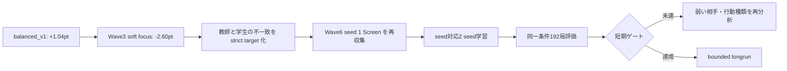

# 最新追記（2026-08-16 JST、portfolio source factory v22-v24／strict gate fail）

`portfolio-hard-negative source factory v1` の実装前診断として、v22（cross-archetype 4 source）、v23（Lucario-core 4 source）、v24（Lucario-core 5 source）を新規生成した。v24は5 sourceのruntime smoke 40/40、最終source-side validation 960/960を全て`DONE`・fault0で完走したが、3 reference×両seatのstrict source-side gate（各sourceのmax seat gap `<=5%`）は `selected_ids=[]` となった。判定は`SOURCE_FACTORY_SCREEN_PASS / SOURCE_SIDE_STRICT_GATE_FAIL / BESTKNOWN_UNCHANGED`である。

v22 fast independent validationは64局・fault0・7.8125%、v23 8×4 validationは256局・fault0・19.140625%、v24 32×3 validationは960局・fault0・23.5417%だった。v22はP1とのarchetype不整合、v23/v24はsource-side seat gapが原因で、P1 CEM、DEV／FINAL、`cg_bestknown_loop_v1.py`、deck phaseへ接続していない。最終objectiveのSHAは`a105212969e171693675654f06c5d9ce63bc747ed3848a271f173e09db88160f`で、全5 sourceがeligible=falseである。

一次記録は[`cg-portfolio-hard-negative-v22-v24-source-factory-20260816`](../evidence/cg-portfolio-hard-negative-v22-v24-source-factory-20260816.md)。次の候補は固定configのblind retryではなく、新epoch／新seedでdeck-bound source-side CEMを設計すること。実装・CABT起動はユーザー承認前には開始していない。

なお、`ono-`は公開kernel作者名ではなく、local Git identity `bfe-lab-ono <ono.ryosuke.36t@st.kyoto-u.ac.jp>`、sealed branch `agents/ono-cg-lethal-v1`、commit `1965b42b028f10960d08ccb4980be5b76946f98b`に由来するローカル識別子である。root deckの単一公開元を示すものではない。

# 最新追記（2026-08-16 JST、次の meta source 生成方式を固定）

v21までの independent-root policy surfaceは、TRAIN 4 source・2世代の risk-aware CEMでもstrict lower-tail positiveを得られなかった。既存のpublic intake、action-conditioned、deck-adaptive、cross-lineage、source-side adversarial CEMは性能 exposure済みで、同じpool／seed／candidateのblind retryは行わない。現行BestKnownはself-authored P1 policy＋common/public root deckのままである。

次の方式は、公式カードCSVと新しいrole specificationからdeckを4件以上生成し、deck-bound policy configurationと組み合わせてsource-side hard-negativeを作る `portfolio-hard-negative source factory v1` とする。terminal WDL・seat・opponent identityだけを使い、複数referenceのmean／worst objective、source×seat 4局以上のfault0 smoke、独立seed validation、policy/deck/config hashの重複禁止を要求する。META_DEV／META_FINALは生成時点で隔離し、TRAIN-only source selection→P1 CEM→独立candidate gate→未使用DEV→未使用FINALの順でのみ進める。

方式選定と境界固定の一次記録は[`cg-next-meta-source-generation-contract-v1-20260816`](../evidence/cg-next-meta-source-generation-contract-v1-20260816.md)。この追記時点ではsource plan生成、CABT、`cg_bestknown_loop_v1.py`接続、deck phase、BestKnown／Champion／production／submission変更は未実施である。

# 最新追記（2026-08-16 JST、self-owned independent cross-archetype v21／P1 CEM no-update）

v20のTRAIN 2 sourceによる高分散とGrass runtime faultを受け、Grassを除外し、Fire／Dark／Lightning／Fighting／Water／Psychicの6 sourceを新seedで生成した。強化runtime gate（各source×seat 4局、計48局）は48/48`DONE`・fault0（32W-16L）。staged pool SHAは`aa4965ed5431550496d9df87efbbd060e633bcebbd6cea4a859bb5a836d148dc`、promoted pool／fresh／meta／split SHAは`8d07d74fb3940e8f4c09f1078084cea0fbda473fcbcc4dc194f591e79b6500cc`／`9c47dbdf08cce03abffca1b387a66b0e1d3c73c99351ef9b7c4b4be039c6f5e9`／`fd60a17bba01dd50f5fb177f450655663774f549d2bb0228b93c6d1045a93337`／`8b9dc51ca0b05aa1bc6ead3b6d1c4b0543110b0e4e2adad7a5494100aa774bba`。splitは`META_TRAIN=4 / META_DEV=1 / META_FINAL=1`、authority全falseである。

P1固定CEM `runs/cg-self-owned-independent-cross-lineage-v21-20260816/p1-cem/`（seed`2026082121`、population／elite`8／2`、2世代、META_TRAIN_ALL）は、各世代screen144局＋独立再評価96局を全てfault0で完走した。gen0 c02はscreen`+12.5pt`、独立平均`+15.625pt`でもblock`−6.25/+37.5pt`でlower-tail gate不通過。gen1は独立平均最良でも`−6.25pt`で、両世代とも`incumbent-center`×2、P1 center保持、`champion_changed=false`となった。gen1自動DEV診断は32/32`DONE`・fault0、FINALは未読である。詳細は[`cg-self-owned-independent-cross-lineage-v21-cem-20260816`](../evidence/cg-self-owned-independent-cross-lineage-v21-cem-20260816.md)。

判定は`SOURCE_GENERATION_PASS / PROMOTION_PASS / RUNTIME_SMOKE_4X_PASS / CEM_FAULT0 / POLICY_CEM_NO_UPDATE / BESTKNOWN_UNCHANGED`。v21 pool／seed／候補のblind retry、deck phase、BestKnown／Champion／production／submission／`cg_bestknown_loop_v1.py`接続、commit、pushは行わない。次は同じindependent-root surfaceの微調整ではなく、別renderer lineageまたはpolicy→deck再結合方式を新seedで作る。

# 最新追記（2026-08-16 JST、self-owned independent cross-lineage v20／P1 CEM no-update）

公式カードCSVと新しいseed namespaceから、Fire／Dark／Lightning／Grassの4件を生成する self-owned independent cross-lineage v20 sourceを封印した。先に指定したroot package v1は`main.py` SHA一致でも`cg/`欠落で生成器がfail-closedしたため破棄し、同じimmutable `main.py` SHAと`cg/`を持つv2 packageで再生成した。factorial manifest SHAは`c576f98845bb252b9fd8ddc708d59ab5df4bf9fb0582794a534269d6e414ad0e`、staged pool SHAは`8e857acc7d133fca8837452b606b1605a9d57fd470ce2ce4d0efc3ca4cf6b334`である。sourceはauthority全false、research-onlyである。

P1 subject対v20 sourceのpromotion前smoke（4 source、両seat、各2局）は16/16`DONE`・fault0（12W-4L）だった。promoted pool／fresh／meta／split SHAは`24e081f98eac76ed0ff33795e2b2d32f896e1aab57adf111c8d3a24dcd2aa3df`／`82f1a3b84c028266126b009e8024c511791d60f25f86d1bf35a93327d96c8d68`／`c4f9b93b604410cf7a39b7b2831b0b994b4db4f85ea2c2f2844029366b9f43fe`／`bcc3571028651a4e5c859df6f06e032819e39a1af25ae70637a20b8269a47982`。splitは`META_TRAIN=2 / META_DEV=1 / META_FINAL=1`である。

P1固定CEM `runs/cg-self-owned-independent-cross-lineage-v20-20260816/p1-cem/`（seed`2026081621`、population／elite`8／2`、2世代、META_TRAIN_ALL、独立re-evaluation 2 block）は、generation 0/1ともscreen 72局＋独立48局をfault0で完走した。しかしgen0 c05は独立差`0.0/0.0pt`、c07は`−12.5/+37.5pt`、gen1 c00は平均`−6.25pt`、c07は`−12.5pt`で、risk-aware gate不通過。`incumbent-center`×2、P1 center保持、`champion_changed=false`となった。詳細は[`cg-self-owned-independent-cross-lineage-v20-cem-20260816`](../evidence/cg-self-owned-independent-cross-lineage-v20-cem-20260816.md)。

gen1の自動DEV診断はincumbent／controlで32局中30`DONE`・2`STEP_LIMIT`（fault率6.25%）となったため、META_DEVは完全未使用とは扱わない。META_FINALは未読である。現行BestKnown（self-authored P1 policy＋common/public root deck）、P1／root deck／Champion／production／submission／`cg_bestknown_loop_v1.py`は不変である。v20 pool／seed／候補のblind retry、deck phase、BestKnown／Champion変更、commit、push、Kaggle提出は行わない。

# 最新追記（2026-08-16 JST、action-conditioned v2 source／raw-control CEM bridge）

公式カードCSVからP1互換Lucario deck 6件と、public-state-only action-conditioned renderer（12係数）を生成した。v2 promoted pool／fresh／split SHAは`1f925cdda22e20e84234f4186686535991f0cf69440cf0bb7f72cba37b2154a5`／`f7512c5b2f46466418c4937401991e40eafd9331af00ea504eee16a267a8c378`／`007121171a07829a94b0926b1a137992b254f411f2f38e66a26d92bf54d94d9b`。P1 subject対source opponentの48局smoke、runtime同梱候補席、raw P1 same-deck controlのTRAIN/DEV/FINAL screenはすべて`DONE`・fault0である。

promoted source directoryを候補席へ直接渡した初回`buffer full`は、source ingestがopponent pool用に`cg/` runtimeを省略するための既知の入力誤りだった。候補席をgenerator `packages/`、opponent席を`promoted/`へ分離し、runnerをfail-closedに修正した。旧parameterized P1 controlを使った先行screen/CEMの差分はpair invariant不成立として性能証拠から除外し、raw P1を同じdeckへ束縛したcontrolで再計測した。

raw-control screen（各split 96局、worker1）は、TRAINでaggressive`+25.0pt`／reserve`+37.5pt`、DEVでconservative`+25.0pt`、FINALでconservative/setup`+12.5pt`など符号が揺れ、3 splitすべてpositiveかつseat-safeの候補は無かった。固定v5 deckのaction-conditioned CEM 1世代（population/elite`6/2`、train 96局、fault0）はbest c05 train`+25.0pt`、拡張DEV`+18.75pt`、FINAL`−6.25pt`、DEV seat gap`0.625`。CEM bridge接続は確認したが、BestKnown／Champion／production／submission／`cg_bestknown_loop_v1.py`は不変である。詳細は[`cg-self-owned-action-conditioned-v1-v2-20260816`](../evidence/cg-self-owned-action-conditioned-v1-v2-20260816.md)。

# 最新追記（2026-08-16 JST、v19 runtime-safe cross-lineage source／CEM no-update）

v18のCEMでGrass/Venusaur sourceに`STEP_LIMIT`が17件発生したため、promotion前runtime gateを各source 4 games/seatへ強化した。v19ではFire/Charizard、Dark/Gengar、Lightning/ManectricのP1系3件＋independent系3件を生成し、48局強化smokeを`48/48 DONE`・fault0で通過した。staged pool SHAは`b066a13e0c08f550e63b812e90fb9b329b2d585c7e61ce4d8e89c5e733867a11`、promoted pool／fresh／split SHAは`1855ffb53e2a3fe389d430a6741a7de859410174e6b31c6a011b0fc54db28a72`／`ec3614665bf4251fe2268b173732cf04a1e10d7a1a0ef3d9f1520ed8e741e8a6`／`19a6b2362baa3c18aea70fbe453587d8679684de6b680cebec74c594cd7a852a`。

P1固定CEM `runs/cg-p1-cem-self-owned-runtime-safe-v19-20260816/` はMETA_TRAIN 4 source、population／elite `8／2`、screen144＋独立192局をfault0で完走した。c00はscreen`+12.5pt`、独立`−12.5/+18.75pt`（mean`+3.125pt`）だが`opponent_seat_safe=false`、c06はscreen`+6.25pt`、独立`0/+3.125pt`で`seat_safe=false`。`incumbent-center`×2、P1 center保持、DEV／FINAL未読、BestKnown不変である。

判定は`SOURCE_GENERATION_PASS / RUNTIME_SMOKE_4X_PASS / CEM_FAULT0 / CEM_POSITIVE_BUT_RISK_OR_OPPONENT_SEAT_UNSAFE / BESTKNOWN_UNCHANGED`。詳細は[`cg-self-owned-runtime-safe-v19-20260816`](../evidence/cg-self-owned-runtime-safe-v19-20260816.md)。

# 最新追記（2026-08-16 JST、epoch v18 cross-lineage source／runtime fault fail-closed）

v18はP1 parameterized lineage 4件＋independent-root lineage 4件の8-source basketを生成し、初回16局smokeはfault0だった。しかしCEM screen216局で17 fault、すべてGrass/Venusaur sourceの`STEP_LIMIT`だった。追加診断（Grass 2 source、16局）でも4 fault（25%）を確認し、v18 CEMは性能根拠として破棄した。campaign `champion_changed=false`、P1 center／BestKnown不変。詳細は[`cg-self-owned-cross-lineage-v18-20260816`](../evidence/cg-self-owned-cross-lineage-v18-20260816.md)。

# 最新追記（2026-08-16 JST、epoch v17 cross-element independent source／CEM positive but seat-unsafe）

公式カードCSVから別archetype（Fighting/Zygarde、Water/Starmie、Psychic/Gardevoir）のdeckを8件生成し、P1とは独立したroot policy rendererを組み合わせた。deck spec／planのhash衝突はなく、staged pool SHAは`25404f4c4bbe140ca468722f0d8f245fd320809ae3a5b516e83af72b82d609dd`。P1 subject対source opponentの16局bounded smokeは`16/16 DONE`・fault0（12W-4L）で、promoted pool SHAは`325b0c33bec126928f588f04d15ce978b4db855489ca1f72f92f3f781d3e6aaa`、fresh SHAは`0b2bf2fb491f46b53baac12999307b640bb9f2c0d1e4f08d3a2ee84bd5c37a64`、split SHAは`bba92ad1cd182ee8c05cad2d5122b70c90432ca76464bead62344c2c5b2922ce`である。

P1固定CEM `runs/cg-p1-cem-self-owned-independent-cross-element-v2-20260816/` は、META_TRAIN 4 source、population／elite `8／2`、screen144局＋独立再評価48局を全て`DONE`・fault0で完走した。screen上位c00は`+18.75pt`、c05は`+12.5pt`で、独立repeatはそれぞれ`+50/+50pt`、`+37.5/+37.5pt`だったが、両候補とも`seat_safe=false`かつ`opponent_seat_safe=false`。campaign `champion_changed=false`、P1 center／BestKnownを保持し、DEV／FINALは未読である。

判定は`SOURCE_GENERATION_PASS / HASH_COLLISION_PASS / PROMOTION_PASS / RUNTIME_SMOKE_PASS / CEM_POSITIVE_BUT_SEAT_UNSAFE / BESTKNOWN_UNCHANGED`。v17 source・seed・候補は性能使用済みとしてblind retryしない。詳細は[`cg-self-owned-independent-cross-element-v2-20260816`](../evidence/cg-self-owned-independent-cross-element-v2-20260816.md)。

# 最新追記（2026-08-16 JST、epoch20 v16 hybrid-support source／P1 CEM no-update）

公式カードIDだけから生成した self-owned deck＋P1 policyの4候補（balanced／lethal／setup／tempo）を `runs/cg-self-owned-cg-policy-family-v16-hybrid-support-20260816/` へ封印した。deck spec SHAは`7165a812050b6556d2ff9381dda927485e6774dc8c8090cdfad739c79964697d`、policy plan SHAは`289f37211e8fbad6f7aee9d579c08f3f6e6559522e0ec40c132405a5afebbccf`。staged pool SHAは`3c3cd07e9395177034656b7ecc2cf4e019662566dfdb7172652c516834aca812`、promoted pool／fresh／split SHAは`eb13f0848da593d85266902ed93fb596c2b1609ffc7a4c86b52f3e7f6dfcaae4`／`494ff6584d164b86217990a9b8fa2f5aba2e17827ddb69679d61830a6502ad70`／`3a32fd100ebbdbcc43001fa319ec9b9e096fd335618b83a1ee9fdc33a57dc8fb`。

self-owned sourceをsubjectにする独立source smoke runnerは、既存v15 sourceでもnative `buffer full. capacity:7`となったため候補拒否には使わず、CEMの向き（P1 subject、v16 source opponent）で8/8 `DONE`・fault0の履歴smokeを通してpromoteした。P1固定CEMはMETA_TRAIN 2 source、population／elite `8／2`、screen72＋独立再評価24をfault0で完走した。screen最大deltaは`0.0pt`（P1同率）。elite c01は独立repeat `−0.25/0.0`、mean `−0.125`、c06は`0.0/0.0`、mean `0.0`で、双方`seat_safe=false`。`incumbent-center`×2、P1 center保持。META_DEV／META_FINALは未読である。

判定は`SOURCE_GENERATION_PASS / PROMOTION_PASS / RUNTIME_SMOKE_PASS / CEM_NO_UPDATE / BESTKNOWN_UNCHANGED`。同じv16 pool／seedのblind retryはしない。現行BestKnown（self-authored P1 policy＋common/public root deck）、P1／root deck／Champion／production／submission／`cg_bestknown_loop_v1.py`は不変。詳細は[`cg-self-owned-cg-policy-family-v16-hybrid-support-20260816`](../evidence/cg-self-owned-cg-policy-family-v16-hybrid-support-20260816.md)。

# 最新追記（2026-08-16 JST、epoch17 source exhaustion／epoch18 factorial／epoch19 adapter CEM）

epoch17では、既存のexposure ledgerを適用したremote first-parent履歴を32世代分監査した。615 snapshotを検査したがacceptedは0件で、主因は`artifact_identity_reused`、`consumed_ledger_reused`、`source_commit_reused`、`environment_access`等のfail-closedである。intake report SHAは`0d837a29f6ed41a1843aca25099c5178fdcb3da15f4a1a73837dfa0dafaad950`。したがって、同じGit履歴からのblind retryは停止した。

epoch18では、epoch16bの新規Comfey parent（base policy SHA `1cdf325ccfc7f9723c62d34f402c9a7daed6e672b7f3cff38cf979e2215928d4`、deck bytes SHA `27ae00f17af0b187033e7e558a041e139ac63d81ed84ad3150a000796e443157`）からbehavior factorial recipeで4 sourceを生成した。promoted pool／fresh／split SHAは`74af83aad260f6abf1bc849d551e21656f69e804cee874f781a5d03f2d6270f9`／`c1adbfd7d761f948a8b8949b1feedb92c9da1b2b9e669ef91e942a2b351b2ea8`／`0f6222aa4bb73fd27458c03ecfc0efc7a847d17cea7e84be891d98ac1f51ca71`。P1固定CEMはscreen72＋再評価24をfault0で完走したが、c00の独立差は`+50/+25pt`、seat-safe不成立で、P1 centerを保持した。DEV／FINALは未読である。

epoch19では、同じComfey parentに対して別recipe `self-owned-meta-adapter-v1`（同一option type内の決定的action perturbation、rate `0.04/0.08/0.12/0.18`）を適用し、4 variantを生成・promoteした。各2局smokeは全て`DONE`・fault0。統合pool／fresh／split SHAは`8c88578a7c7558f6c718aa767cd824132f1508729172041ccee735c278a0d071`／`7ceee2cf9867e1c5af13ea97b1b911dfe58963253b7f1bde6a7c5c1f571ccc5a`／`7017036dd9b2bfe738ff916018867458efcb8f5b3bd0ea7e357f616aea2cde75`である。P1固定CEM `runs/cg-p1-cem-internal-comfey-adapter-epoch19-20260816/` はscreen72＋独立再評価24を全てfault0で完走した。screen上位c03は+25.0pt、独立TRAINは+25.0ptだったが、再評価は`+50.0/0.0pt`、c07は`0.0/−25.0pt`で、いずれもseat-safe／opponent-seat-safe不成立。`incumbent-center`×2、P1 centerを保持した。

判定は`SOURCE_GENERATION_PASS / BOUNDED_SMOKE_PASS / POLICY_CEM_NO_UPDATE / BESTKNOWN_UNCHANGED`。epoch19 pool・seed・候補は性能使用済みとしてblind retryしない。現行BestKnownはself-authored P1 policy＋common/public root deck、P1／root deck／Champion／production／submission／`cg_bestknown_loop_v1.py`は不変である。次は同一Comfey parentのrate違いではなく、相関を下げる別のpermission済みmeta sourceまたは別生成recipeを新epochで作る。

# 最新追記（2026-08-16 JST、epoch14 historical internal source／P1 CEM no-update）

first-parent historical snapshot intakeで、現行pool／artifact identityと重複しない内部Git source 12件（Cynthias 3、Rocket 7、Starmie 2）を `runs/cg-internal-historical-epoch14-depth16-20260816/` へlocal-eval-onlyで封印した。pool／fresh meta SHAは `590ee18351ec4e4dc2fabb4a3d17857ecf9089f86ef70a1146dffe30e97c9525`／`7b708d3dab394947d77abb0e68de416333b0c3958249df89e2adb94b1f11d610`。P1 packageの両seat各1局 bounded smokeは24/24 `DONE`・fault0（5W-19L、20.8333%、性能根拠ではない）。

splitは `META_TRAIN=8 / META_DEV=2 / META_FINAL=2`（split SHA `bf24b182f8ef85af3faea9dd9202144bdc19fa97cc5962e9b2cab45c19868ec9`）に固定した。P1＋root deck固定 CEM `runs/cg-p1-cem-internal-historical-epoch14-20260816/` は population／elite `8／2`、1世代、META_TRAIN_ALL、screen288局＋独立96局を全て`DONE`・fault0で完走した。screen上位c07は+15.625ptだったが、独立は`+6.25pt / −18.75pt`（mean −6.25pt、minimum −18.75pt）でseat／opponent-seat-safe不成立。c01も`−18.75pt / −18.75pt`。`risk_aware_independent_train96_x2_positive_delta_gate_preserve_center`により`incumbent-center`×2、P1 centerを保持した。DEV／FINALは未読である。

判定は `SOURCE_GENERATION_PASS / BOUNDED_SMOKE_PASS / POLICY_CEM_NO_UPDATE / BESTKNOWN_UNCHANGED`。このpool／seedのblind retryは行わない。現BestKnown、P1、root deck、Champion、production、submission、`cg_bestknown_loop_v1.py`は不変。詳細は[`cg-internal-historical-epoch14-p1-cem-20260816`](../evidence/cg-internal-historical-epoch14-p1-cem-20260816.md)。

# 最新追記（2026-08-16 JST、epoch11–13 source／root-deck P1 CEMとdeck/fallback契約診断）

epoch11–13で生成・独立検証した4件の self-owned robust sourceを、P1＋root deck固定の正規 CEMへ接続した。screen 72局＋独立再評価48局の計120局は全て `DONE`・fault0だったが、独立 risk-aware／seat-safe／opponent×seat-safe gateを満たす候補はなく、`incumbent-center`×2でP1 centerを保持した。screen上位 c05 は `+37.5pt` だったが、独立2 blockは `+37.5pt / −12.5pt`、risk-aware mean／minimum `+12.5pt / −12.5pt`で安全条件外。DEV／FINALは未読である。campaign／generation／results SHAは `1c96441cf7d55e194b1fe35a72b14b2c902f9dcc915d75997ce7c054f1dc98e9`／`a31f8f75f1aa152fdb0d292c02a452fc598a5de94dbbc7f08ff5c10f7dcc303f`／`aace24041382031e503f8645813f5fc8a206162c07470a602cc689a916c9cd73`。

先行の self-owned kieran deck policy CEMは、candidate deck SHA `c82f8ccda501d9396e0eca9f6f7e0d8aebdeeefbd0f0bde631c5231158d6e2fd`に対して control／splitがP1 root deck SHA `2a541d7bf3d9e6b36037123f53f4dfef6348223f79fd27095dafc602a5357c19`のままだったため、CABT前の `P1 deck/fallback contract`で fail-closedした。既存 deck-bound回帰テストは2/2 PASSであり、static smoke実装を緩める修正は行っていない。self-owned deck policy CEMは同一deckに再束縛した source／control／splitを別epochで封印してから再開する。一次evidenceは[`cg-robust-source-epoch11-13-root-cem-20260816`](../evidence/cg-robust-source-epoch11-13-root-cem-20260816.md)。

判定は `SOURCE_GENERATION_PASS / STATIC_CONTRACT_DIAGNOSTIC / POLICY_CEM_NO_UPDATE / BESTKNOWN_UNCHANGED`。現行BestKnown（self-authored P1 policy＋common/public root deck）、P1、root deck、Champion、production、submission、`cg_bestknown_loop_v1.py`昇格状態、commit、pushは不変である。

# 最新追記（2026-08-16 JST、self-owned near-root deck screen／独立確認反転）

公式`EN_Card_Data.csv`と新規役割仕様だけから、現行root deckとcanonical hashが一致しないself-owned scratch deckを4件生成した。ACE SPEC、Supporter、search item、Stadiumを各1枚だけ差し替え、P1 policyを固定して24 opponent×2 seatのmatched CABT screenを実行した。4件ともexact 60、package verifier、公開canonical collision 0、全screen 96局`DONE`・fault0だったが、ACE swapの`+8.3333pt`とKieran swapの`+2.0833pt`は、別seed・2 games/seatの各192局でともに`−5.2083pt`へ反転した。Ultra Ball swapとCommunity Center swapは初回から各`−6.25pt`である。

判定は`SELF_OWNED_DECK_GENERATION_PASS / SCREEN_SIGNAL_NOT_REPRODUCED / POLICY_DECK_NO_UPDATE / BESTKNOWN_UNCHANGED`。今回の候補・seed・24-ref poolは性能使用済みとしてblind retryしない。現BestKnownはself-authored P1 policy＋common/public root deckのまま、P1／root deck／Champion／production／submission／`cg_bestknown_loop_v1.py`は不変である。次は同じ1枚差分deck探索ではなく、未使用metaを生成時点で分離した別policy lineage／別runtime-safe rendererを優先する。一次evidenceは[`cg-self-owned-near-root-deck-screen-v1-20260816`](../evidence/cg-self-owned-near-root-deck-screen-v1-20260816.md)。

# 最新追記（2026-08-16 JST、公開 re-export source intake／wrapper contract fix）

未性能使用の公開 kernel `res1235/rule-based-agent-mega-lucario-ex-deck-very-simple` は、root `main.py` が `from agent import agent` で payload callable を再公開していた。source 本体は改変せず、明示的 import alias を `agent` entrypoint として認識する static gate を追加した。

同時に、生成 wrapper の一／二引数契約を修正した。payload が一引数なら Kaggle configuration を転送せず、二引数を signature-bind できる場合だけ転送する。raw tar SHA `9b5dee3801e7ee4dff40af94fd08476849bbd08cbc19cd49f254283c197d0bea`、canonical deck SHA `282bbb43e78cd05d63c1bf2e680202537bdc5ad680966ead77e8dc8400f65cce`を固定し、修正版 intake root `runs/cg-kaggle-kernel-meta-intake-public-reexport-wrapperfix-epoch9-20260816/`へ別 artifact として封印した。intake reportはaccepted 1、exact 60、ACE SPEC 1、static findings 0、network/import実行なし。fresh meta SHA `bde52f78b9897b0751f27439f2e8bd81c986fff8ba4f8623c4fbafaac0a59103`、pool SHA `d91a0810ba4aa6f6663dd802bd957ce3ca5a1b18893d3ed83ac3c84d82423a70`。

source smoke は pool loader が source import 後に `cg` を再ロードしない順序固定 runner `scripts/run_kaggle_kernel_meta_smoke_v1.py`で実行した。`official_random`、両seat、各2局の4局は `4 DONE / 0 fault / 4W-0D-0L` で、stable smoke summary SHA `4442257cdadba8a8522febeca66e9cf0ddc11f1fbf12b2581f4f792787f92669`。これは evaluation-only の bounded smoke であり、性能改善、CEM、META_TRAIN／DEV／FINAL、BestKnown昇格の根拠ではない。公開 kernel scoreは未使用である。

旧 wrapper の初回 pool-bound fault（native `buffer full`）と旧 output rootは失敗診断 artifactとして保持し、再利用しない。現BestKnown／P1＋root deck／P2判定／Champion／production／submission／`cg_bestknown_loop_v1.py`は不変。詳細は [`cg-kaggle-kernel-meta-reexport-wrapperfix-20260816`](../evidence/cg-kaggle-kernel-meta-reexport-wrapperfix-20260816.md)。

# 最新追記（2026-08-16 JST、epoch9／epoch10 source CEM・self-owned v8 deck）

epoch9／epoch10で、P1 parameter surfaceから新しいrobust sourceを生成した。epoch9はscreen 576局・fresh validation 96局、epoch10はscreen 576局・fresh validation 192局を全て `DONE`・fault0で完走し、epoch9-c02とepoch10-c11をそれぞれpromoted sourceとして封印した。epoch10 poolは6 source（`META_TRAIN=4 / META_DEV=1 / META_FINAL=1`）で、split SHA `9e16db82307dc2cc2510d22b5575ef55a7b95c250fb30ed0ac7a3bd3abb7ec53`、pool manifest SHA `14b1926e3dc46d50e14e364d01c99085b606d0f0b2428d09e91c4e60acddbd85`である。

epoch10 poolをP1 policy CEMへ接続した。META_TRAIN-only（seed `2026089202`）とMETA_TRAIN＋META_DEV探索（seed `2026089301`）の2世代を、各世代のscreen 208／260局、elite各3候補×3独立blockで実行し、全row `DONE`・fault0だった。前者の最良独立差はmean `−1.0417pt`（repeats `−9.375 / +12.5 / −6.25pt`）、後者はmean `+5.833pt`でもrepeats `−17.5 / +12.5 / +22.5pt`でlower-tail／opponent-seat gate不成立だった。両campaignとも `incumbent-center`を保持し、判定は `POLICY_CEM_NO_UPDATE / BESTKNOWN_UNCHANGED`。詳細は [`cg-epoch9-10-source-and-self-owned-deck-v8-20260816`](../evidence/cg-epoch9-10-source-and-self-owned-deck-v8-20260816.md)。

公式カードCSV＋self-owned spec v8から4つの60枚 deck＋policyを生成した。`parent_deck=null`、`public_parent_read=false`、public canonical collision 0、authority全falseである。epoch10 META_TRAIN matched screen（候補／control各32局）は4件ともfault0だが、deltaは `−18.75 / −9.375 / −9.375 / −18.75pt`。v8 recipeはhard-negativeとして停止し、独立確認とblind retryは行わない。

P2 `cg-p1-cem-incumbent-g01-c83df4408b24`について、現repoの一次fresh-holdout記録はP1比 `−2.9948pt`（P2 `188W-1D-190L-5F` 対 P1 `200W-0D-180L-4F`、P2 fault 9件）であり `NOT_PROMOTABLE`である。別資料にある `TRAIN +1.82pt / DEV +5.56pt / FINAL +3.13pt` は現worktreeで対応する一次artifactを確認できないため未照合値として採用しない。現BestKnown／Champion／productionはP1＋root deckのまま不変である。

`ono-`は外部source作者ではなく、Git identity `bfe-lab-ono`、branch `agents/ono-cg-lethal-v1`、封印commit `1965b42b028f10960d08ccb4980be5b76946f98b`に由来するローカル識別子である。

# 最新追記（2026-08-16 JST、robust source pool再検証／P1 CEM接続）

同一portfolioの追加source CEM epoch4〜7を完走した。epoch7はpopulation 24、screen 576局、elite validation 96局、全row `DONE`・fault 0だがfresh seat-safe promotion 0件（`campaign_result.json` SHA `faced4d8c31186177d666af1f27b155563515f6a5504850251b80b734570856b`）。同じportfolioのblind retryは停止する。

過去screen gate通過かつ未使用のdistinct candidate 8件を別seedで再検証し、384/384 `DONE`・fault 0、4件を新しいself-owned robust sourceとして選定した。`epoch2-c01` mean 64.5833%／worst 50.0%／seat gap 25.0%、`epoch2-c03` 70.8333%／62.5%／12.5%、`epoch4-c06` 56.25%／50.0%／25.0%、`epoch7-c19` 63.5417%／53.125%／18.75%。結果は `runs/cg-robust-source-candidate-validation-20260816-retry1/`（manifest SHA `d26fae4df69fbd111f7ab4a5fd09cb72b326d582e3b6e6efc02978e74e6f8a6e`、result SHA `98fe3c8b8b0f011633103efea8b82725b6af028530c4c7c45c08a6aef9fa3b59`）。

4件を別rootへ再封印し、P1対のsource smoke 8/8 `DONE`・fault 0、split `META_TRAIN=2 / META_DEV=1 / META_FINAL=1`を作成した。pool／fresh／meta／split SHAは `920880c7bac47ef7f0d69b3d895176981bdb809a93d1fb7fbf8cb5873c5afa0c`／`ceeee4148fdd8ca205838208cd303c8ad6690b0c6c3951ec4167c8cb736ec29b`／`672d2831725ee61d060be8deb8e335fac9b16eccc6ab113c0707fedbad14a1fc`／`7e7499cc59c1ee1b92041ee89222e29d1557cfc8b69c56d24247af6292f4ad23`。

P1固定policy CEM `runs/cg-p1-cem-robust-source-weekend-20260816-v1/`（seed `2026084002`、population／elite `8／2`、META_TRAIN_ALL、screen 72局＋独立re-eval 96局（各elite 32局＋shared control block））は全row `DONE`・fault 0。screen上位は+25.0ptだったが独立は−12.5pt（repeat −18.75／−6.25pt）、もう1候補も独立−15.625ptで、positive／risk-aware／seat-safe gate不成立。`incumbent-center`×2、P1 center保持。DEV／FINALは未読。判定は `SOURCE_GENERATION_PASS / FRESH_DISTINCT_SOURCE_POOL_SEALED / POLICY_CEM_NO_UPDATE / BESTKNOWN_UNCHANGED`（result SHA `fba482da45928c2d8070c7eb7db0603b58b954d4af666b49198acf08dccd973e`）。

現行BestKnownはself-authored P1 policy＋common/public root deckのまま。P1／root deck／Champion／production／submission、`cg_bestknown_loop_v1.py`の昇格状態、commit／pushは不変。次は同一source portfolioのblind retryではなく、別policy lineageまたは別deck recipeを含むfresh source epochを生成し、独立 positive・seat-safe・unused DEV／FINALを満たした場合だけpolicy→deckへ進む。詳細は [`cg-robust-adversarial-source-cem-20260816`](../evidence/cg-robust-adversarial-source-cem-20260816.md)。

# 最新追記（2026-08-16 JST、self-owned robust adversarial source CEM epoch3）

新しいmeta sourceの生成方法として、P1 parameter surfaceから候補policyを生成し、P1／Rule v0／既存self-owned independent policyの固定portfolioに対するterminal WDLだけでmean／worst scoreを最適化する `meta-specialist-robust-adversarial-source-cem-v1` を追加した。公開kernelを生成元には使わず、action trace・private field・teacher labelは不使用である。screen上位1件だけでなく全eliteを同じ未使用seedで検証する方式へ修正した。

epoch3（seed `2026081694`、population／elite `8／2`、screen 192局、elite validation 2候補×48局）は全row `DONE`・fault0。選択候補 `robust-source-g00-c05-acb3f0d8e32e` はscreen mean `54.1667%`・worst `25.0%`、fresh validation mean `56.25%`・worst `50.0%`・最大seat gap `25.0%`、source smoke 2/2 `DONE`で昇格した。promoted pool／fresh meta SHAは `fbe73d49c918d4d13c0d2670941f38b507826d8efe96873e13c4f80abf14c3c5`／`671bff318a6b2ff0479d6ee96868faae80a9c51cc79cd4c19cfbb56d945ee707`。`build_fresh_meta_batch_v1` 再検証もPASSした。

epoch1のpublic reference混成は全候補seat-collapse、epoch2のself-owned portfolioはscreen上位のfresh validation seat gap `62.5%`で不合格だった。epoch3のmulti-elite validationでこの選抜noiseを抑えた。判定は `SOURCE_GENERATION_PASS / SELF_OWNED_ROBUST_SOURCE_PROMOTED / BESTKNOWN_UNCHANGED`。現時点のfresh batchはreference 1件なので、既存weekend splitを置換せず、別seed／別epochでTRAIN／DEV／FINALを追加分離してから `cg_bestknown_loop_v1.py` のcandidate runnerへ接続する。P1、root deck、BestKnown、Champion、production、submissionは不変。詳細は [`cg-robust-adversarial-source-cem-20260816`](../evidence/cg-robust-adversarial-source-cem-20260816.md)。

# 最新追記（2026-08-16 JST、self-owned public-state mix epoch1）

## 追加結果（TRAIN-only CEM／public-state candidate screen）

promoted sourceを `runs/cg-p1-public-state-mix-epoch1-20260816-promoted/exposure_ledger.json`（SHA `8320d94d1b58c0818f3741777791155c04dbe1211ebfe515cc2d263a0b46f7c5`）へ予約し、splitを `META_TRAIN=4 / META_DEV=1 / META_FINAL=1`（split SHA `e71673ab6743d342e58e11551dfbb3b82ab871819f432d16fc0e3e73698498d4`）に固定した。

P1 policy＋root deck固定 CEM（seed `20260816801`、population／elite `4／2`、screen80＋独立48、全128局）は `DONE`・fault0だったが、独立 risk-aware／seat-safe gateを満たさず `incumbent-center`を保持した。続く6 self-owned public-state packageのTRAIN screen（96局）もfault0で、paired screen上位は `ahead-lethal-conserve +25.0pt`、`conservative-visible-board +12.5pt`、`race-and-stability +12.5pt`、`target-pressure +12.5pt`。上位4件の別seed独立再評価（256局）は順に `−3.125 / −25.0 / −12.5 / −18.75pt` で、全て positive gate不成立だった。したがって `META_DEV`／`META_FINAL` は未読のまま、P2／BestKnown／`cg_bestknown_loop_v1.py`接続は不変である。

初回の `<stdin>` 入口による `spawn` 起動失敗はCABT証拠に算入せず、file-backed runner `scripts/run_cg_public_state_mix_candidate_screen_v1.py`を追加して再現可能な実行入口とpaired block集計を固定した。最終 focused suite（renderer／generator／screen runner／CEM）は36件pass。詳細は[`cg-p1-public-state-mix-epoch1-20260816`](../evidence/cg-p1-public-state-mix-epoch1-20260816.md)。

公式カード CSV と新しい `cg_p1_public_state_mix_v1` renderer から、6つの distinct self-owned deck＋policy sourceを生成した。policyはP1 parent SHA `1c505b2b5d345bfd897573a7586fb1232d1946d6a3405d8fb1e8486e4e8578e9`に固定し、prize gap、visible target pressure、damaged active、ready benchだけを使う8 bounded knobである。opponentのhand／deck／discard identityとsearch APIは参照していない。generatorは`configs/meta_specialist/cg_p1_public_state_mix_epoch1_20260816.json`、rootは`runs/cg-p1-public-state-mix-epoch1-20260816/`で、source manifest SHAは`94a9305e4af16aab61cdd3b82ac5d95ef930bec8c5ca5957039b8c0f9b3dfc51`である。

6 packageは60枚 deck、P1 parent、package verifier、AST compile、public-only static scan、fallback smokeを通過した。runtime `cg/`を含む smoke-ready rootで、reference `aman_crustleaware_fighting`／`official_random`、両seat、各1局（24局）を実行し、24/24 `DONE`・fault0だった。pool／fresh metaは`runs/cg-p1-public-state-mix-epoch1-20260816-promoted/`へ封印した（pool SHA `d55d2d2d92e3514352c7dc7a7cb1b01ecba0735fa17b889f92dfcf702cdfeda3`、fresh SHA `78c7a64fd2675b6fe16e324c5f71a4df4b97af735477b374a088c69c19f6b568`、smoke SHA `7c749748f92d00ac7d8c1af8ac1a01a727d19ed0cabe86aaf8d285578b9b268b`）。

batchの`staged/`（shared `cg/`なし）を誤ってsmokeへ渡した初回だけ、native `buffer full`／`BrokenProcessPool`が発生した。既存契約どおり`packages/`またはruntime同梱rootへ切り替えた再実行はfault0で、候補由来の破綻とは扱わない。今回の少数局scoreは性能根拠にせず、判定は`SOURCE_GENERATION_PASS / BOUNDED_SMOKE_PASS / PERFORMANCE_UNPROVEN`とする。BestKnown、Champion、production、submission、`cg_bestknown_loop_v1.py`は不変である。詳細は[`cg-p1-public-state-mix-epoch1-20260816`](../evidence/cg-p1-public-state-mix-epoch1-20260816.md)。

# 最新追記（2026-08-16 JST、epoch9 raw timeout／runtime-safe Metal family）

未使用の許可済みGit履歴から `agents/ozawa-metal-psychic-search` の4 snapshot（`641519c7a215`、`65cabdfef7c3`、`b815464f206b`、`dec382a2ce57`）をstatic-only intakeした。4件は同一branch・同一canonical deck SHA `e32f681f9ca9505b17bcd1a48acab223d0ae63b0b40e169cf18d926333781c1f`の時系列である。raw P1 smokeは8局中6局が`parent_timeout`となったため、raw sourceをCEMへ接続しない。

既存のMetal runtime-safe behavior-family変換器を、新snapshotの`PRINPLUP`なしpriority tableにもexact対応させた。`RULE_ONLY_PIPLUP_FIRST`、`RULE_ONLY_METAGROSS_FIRST`、`RULE_ONLY_RECEIVER_FIRST`、`RULE_ONLY_LUCARIO_PLAN_FIRST`の4件を`runs/cg-internal-source-epoch9-metal-runtime-safe-20260816/`へsealし、static／60枚／fresh splitをPASSした。P1対の8局bounded smokeは8/8`DONE`・fault0（5W-3L、8.119秒）で、runtime timeout問題は構造的探索停止で解消した。

これは新しいsource生成器とruntime gateの検証であり、同一lineageの派生4件を独立sourceとして扱わない。CEM、DEV／FINAL、BestKnown、Champion、production、submission、`cg_bestknown_loop_v1.py`接続は不変。詳細は[`cg-internal-source-epoch9-runtime-safe-20260816`](../evidence/cg-internal-source-epoch9-runtime-safe-20260816.md)。

# 最新追記（2026-08-16 JST、v11未使用holdout／multi-author source intake）

v8 c06をv11 promoted rootの未使用`META_DEV`／`META_FINAL`へ独立評価した。candidate／control各32局、合計128局は全て`DONE`・fault0で、DEVはcandidate 18W-14L対control 17W-15L（+3.125pt）、FINALは22W-10L対14W-18L（+25.0pt）だった。一方、candidate seat gapはDEV 12.5pt、FINAL 25.0ptで、opponent×seat-safeおよびBestKnownの`seat_gap <= 5pt`を満たさない。したがって転移は観測したが昇格不可であり、P2／P3、BestKnown、Champion、production、submission、`cg_bestknown_loop_v1.py`接続は不変である。一次evidenceは[`cg-v11-unused-holdout-and-public-multiauthor-intake-20260816`](../evidence/cg-v11-unused-holdout-and-public-multiauthor-intake-20260816.md)。

次の優先課題を「新しいmeta sourceの獲得・生成方法」へ移し、`MULTIAUTHOR_EXPOSURE_FIRST_INTAKE_V1`を実行した。Emanuellcs、Nursrijan、Res1235の未性能使用候補をtar SHA・source URL固定でintakeしたが、accepted 0件だった。理由は順に`deck.csv`欠落、official catalog上のinvalid deck、`agent` entrypoint欠落で、ネットワーク・import・CABTは実行していない。reportは`runs/cg-kaggle-kernel-meta-intake-public-fresh-epoch8-multiauthor-20260816/intake_report.json`（SHA `94fdd656e29cdf805cb207d3f054463a3381f9d781c051855f53697762a5295e`）、configは`configs/meta_specialist/cg_kaggle_kernel_meta_public_fresh_epoch8_multiauthor_20260816.json`（SHA `f24672fefccb97a84170b8c9558205b0d7bf01c4309cbcef307daa2aad29edea`）である。source gateでfail-closedしたため、このepochをsmoke／CEM／holdoutへ接続しない。

現在の結論は、既存のrouted／cross-lineage／self-owned policy surfaceのblind retryではなく、作者・source branch・policy SHA・canonical deck SHAを先にexposure ledgerへ予約し、TRAIN／DEV／FINALをCABT前に分離した新規permission source snapshotが必要、というもの。3件以上がlegality→static safety→bounded fault0を通過するまでheavy CABTを起動しない。`ono-`は公開kernel作者名ではなく、local Git identity `bfe-lab-ono`、branch `agents/ono-cg-lethal-v1`、commit `1965b42b028f10960d08ccb4980be5b76946f98b`由来のローカル識別子である。commit、push、Champion変更、Kaggle提出は行っていない。

# 最新追記（2026-08-16 JST、cross-lineage epoch7／c05 holdout）

公開kernel lineageのpolicy parentとdeck parentを分離して交差再構成する `CROSS_LINEAGE_POLICY_DECK_RECOMBINATION_V1` を、yaminh／samrishb／Sushanth Emboar／Sushanth Zacianの未使用組合せへ適用した。7 sourceを生成し、P1 smoke 14/14 `DONE`・fault0（8W-6L）でpromotionした。promoted pool／fresh／meta／split SHAは `aa5a01b6a6bcfa12b2468c305c54810d02d5b5fc7e3fa359648455052569ff58`／`ad5b80d9d5db4258f11958c167e2dda286ec30c1013fe45ce4e3252da4e582f5`／`c32822ba9ac8b8384a0e58ac8d9353a482ab94197bdd1933c984a34c8cd2b70e`／`75c6262ce42d27a0e4e9ef4177b28a460a6f981e6f422b7692f0b95afaa46a88`。splitはTRAIN5／DEV1／FINAL1で、holdout policy lineageをTRAINから分離した。これは公開lineage再構成であり、self-owned sourceとは分類しない。

epoch7 CEM `runs/cg-cross-lineage-epoch7-cem-20260816/` は seed `202608985`、population／elite `8／2`、1世代、独立再評価2回、positive／risk-aware gateでscreen180＋独立60局を全て`DONE`・fault0で完走した。screen差は最大0pt、独立上位c05は`+20pt / 0pt`（aggregated `+10pt`、worst 0pt）、c06は`−5pt`。positive gate不成立で `incumbent-center`×2、P1 center保持となった。

未使用DEV／FINALでc05を両seat各8反復（候補／P1 control計64局）確認した結果は、candidate `3W-0D-29L` 対 control `0W-0D-32L`、差 `+9.375pt`、fault0だった。ただし2 sourceだけのholdoutで絶対勝率も低く、昇格可能な再現性証拠ではない。BestKnown／Champion／production／submission／`cg_bestknown_loop_v1.py`接続は不変。詳細は[`cg-cross-lineage-epoch7-cem-20260816`](../evidence/cg-cross-lineage-epoch7-cem-20260816.md)。

# 最新追記（2026-08-16 JST、self-owned v14/v15 と root-deck CEM no-update）

v14 behavior-spreadは公式カードCSVから8 sourceを生成し、P1 smoke 32/32 `DONE`・fault0（15W-17L）を通過した。CEM screen 216局・独立72局もfault0だったが、上位c01の独立mean/minは`−16.667/−41.667pt`、c06は`0/−25pt`で、positive・seat-safe・opponent-safe gate不成立。v14 pool／fresh／meta／split SHAは`01aa3179e1bb7e1a68a646b315574bda758b1afd876ff21ea0ab41c216758d3d`／`2c3bd8082a95eee45e2791293f6acd014c96959ce1bf433bdcdcfbfbe670b6eb`／`5ac26b79f05e18ae0e963b5c71fb7917f650443ed47a61a629fa28ff0480c1d2`／`06ba48f3db5075be5278088bd576f2bbd381bf49bf68c2871f6172854668efd0`。

v15初回は既存public canonical deck衝突でfail-closed。spec v2・別seedへ切り替えたretry1を採用し、8 self-owned sourceを生成・P1 smoke 32/32 `DONE`・fault0（17W-15L）でpromoteした。epoch6g public 2 sourceと混成した10-source poolではv15 8件をMETA_TRAIN、public 2件をMETA_DEV／META_FINALへ分離した。root-deck bindingを正典P1 deck SHA `2a541d7bf3d9e6b36037123f53f4dfef6348223f79fd27095dafc602a5357c19`へ再構成し、pool／fresh／meta／split SHAは`7b27d98dbb546d37eabc6869aeca88474da8d17e84bdce3e9d5d8a084ab7d58c`／`c40aa72dca9925f62857262f84b807685fc5f8322a0e185ce9f8f23334be2aa6`／`f6df1830fdb7c871ea6f65de0c211768c4514f37331eba731a196774e4ba7464`／`e25e01b5af15deef75fa20ff9bf84b2cf82dedbdebc373cc1018110ccd622cbf`。

root-deck CEM `runs/cg-self-owned-public-mixed-cg-cem-v15-rootdeck-20260816/` はP2 config `c83df4408b24`、seed `202608982`、population／elite `8／2`、1世代、independent re-evaluation 2回、positive／risk-aware gateで実行した。screen 288局はfault0でc05 `+12.5pt`、c06 `+9.375pt`まで上がったが、独立c05はmean/min `−3.125/−6.25pt`、c06は`−6.25/−18.75pt`、両方seat/opponent-safe false。`incumbent-center`×2でP2 centerを保持し、DEV／FINALは未読、BestKnown／Champion／production／submission／`cg_bestknown_loop_v1.py`接続は不変。判定は`SOURCE_GENERATION_PASS / ROOT_DECK_BOUND / POLICY_CEM_NO_UPDATE / BESTKNOWN_UNCHANGED`。詳細は[`cg-self-owned-v14-v15-rootdeck-cem-20260816`](../evidence/cg-self-owned-v14-v15-rootdeck-cem-20260816.md)。

self-owned batch promotion後のsmoke／promoted pool SHA不一致も検出し、promotion時の再束縛と6件の回帰テストを追加した。commit、push、Champion変更、Kaggle提出は行っていない。

# 最新追記（2026-08-16 JST、epoch6e/6f/6g と self-owned v13 CEM no-update）

epoch6e／6fの公開kernel追加探索は、重複・違法ACE・dynamic execution・entrypoint不足で全件 fail-closed（各0 accepted／8 rejected）した。新規作者系譜のepoch6gでは `tetsutani/grimmsnarl-ex-damage-transfer-control` と `samrishb/unified-ptcg-framework-v2` の2 sourceを安全に受理し、pool SHA `8dd9ceb8aa43058da20d6a21b18b15d2b787fdbc878586a967c823559aa96a9d`、fresh meta SHA `e1c0e6e11a36d1898dc69a2856833bcc60d3bceed870d1e14a97e2bc07ce1797`を封印した。legalizer補正系はP1 smokeで8/8 `AGENT_INVALID`となり、adapter retryはartifact identity reuseで停止したため、性能metaへ昇格していない。

公式カードCSVから生成した self-owned v13（4 deck recipe×4 policy variant）は、P1 runtime smokeを16/16 `DONE`・fault0で通過し、promoted pool／fresh／meta／split SHAは `7ad55492b60622c5271999b4944a3fb91ded28198d9da66dfbf77160468d39a9`／`d0f158f01926acab0c8ba34842acf0bf70da738930d9fa486eae918e60390549`／`02feb58669de34c4f9c7030438043ded63447625e915e9d53fc1a38305b9033f`／`c6773e48f9031426b2395503b9ee53eee498eb2d92b158951843c104899ab9b5`。4 packageはいずれも自身の `ROOT_DECK` と `deck.csv` が一致する。

v13をP1 CEMへ接続した初回は、CEMが `p1-source-core` のimmutable policyを候補へコピーするだけで、同じc06 `deck.csv`を持つ現行 `p1-core-control`の`ROOT_DECK` fallbackへ再束縛していなかったため、CABT前のstatic smokeで停止した。既存self-owned materializerをCEMへ接続してこの契約を修正し、contract-only candidateで60枚の`ROOT_DECK == deck.csv`、static smoke PASS、P1 parent SHA保持を確認した。

修正後の `runs/cg-self-owned-cg-policy-cem-v13-fresh-source-20260816-retry2/` は未使用seed`202608977`、population／elite`4／2`、1世代、`META_TRAIN_ALL`、独立再評価2回で完走した。screen40局＋独立24局の全64局が`DONE`・fault0。screen上位c03は`+62.5pt`だったが、独立平均`−37.5pt`・minimum`−50.0pt`、c00も平均`−25.0pt`・minimum`−50.0pt`で、positive gate不成立。selectionは`risk_aware_independent_train96_x2_positive_delta_gate_preserve_center`、`new_center=c06`、elitesは`incumbent-center`×2となった。DEV／FINALは未読、BestKnown／Champion／production／submission／`cg_bestknown_loop_v1.py`接続は不変である。判定は `SOURCE_GENERATION_PASS / CEM_CONTRACT_FIXED / POLICY_CEM_NO_UPDATE / BESTKNOWN_UNCHANGED`。一次記録は [`cg-fresh-source-epoch6e6g-v13-contract-20260816`](../evidence/cg-fresh-source-epoch6e6g-v13-contract-20260816.md)。

次はv13の同一seed／候補をblind retryせず、別の未使用source epochまたは別policy surfaceを生成し、修復済みdeck/fallback contractと独立gateを維持してCEMへ渡す。

# 最新追記（2026-08-16 JST、公開kernel fresh epoch6d／c06 CEM no-update）

epoch6cとは別の未性能使用公開kernel snapshot 8件（dicer992 1、Naoto 5、Maximim 2）をSHA固定してintakeした。8件受理・0件除外で、intake pool／fresh SHAは`210b53a5cac15da0e57186ebe6308b1acbe707a18f61f27cbfaf307f96b4c08`／`21fa7a02bd40f185d5f10bfd95d7c9789436a3bfaef70813f3fc817c09f58355`。P1対のruntime smokeはseed`202608971`、8 source×両seat×2局＝32局を32/32`DONE`・fault0（8W-24L-0D、25.0%）で完了し、promoted pool／fresh SHAは`a2d68d1565678d84f01ae814804e2b1a1b1985c82786aa01ac9692e209b87e59`／`ba3a08e6e78bd73a96d3cf7030a85893c215b6a0fb0d9b5b92d8badfd01d1027`。

promoted epoch6dをTRAIN4／DEV2／FINAL2（split SHA `282057daff86fe5c4bca2ca272072968a76ac342c35f429d3e5a4ddb69373f32`）へ固定し、c06近傍のself-owned deck-bound P1 CEMを`runs/cg-self-owned-cg-policy-cem-epoch6d-c06-g01-20260816/`でseed`202608972`、population／elite`8／2`、1世代実行した。screen144局＋独立96局は全て`DONE`・fault0。screen上位2候補は独立mean delta `−17.1875pt`／`−9.3750pt`、min delta `−28.125pt`／`−31.250pt`、いずれもopponent/seat-safe false。positive gate不成立のため`new_center=c06`、elitesは`incumbent-center`×2となった。

epoch6dのDEV／FINALは未読のまま保全し、BestKnown、Champion、production、submission、`cg_bestknown_loop_v1.py`接続は不変。判定は`SOURCE_GENERATION_PASS / CEM_NO_UPDATE / BESTKNOWN_UNCHANGED`。一次記録は[`cg-kaggle-public-more-epoch6d-cem-20260816`](../evidence/cg-kaggle-public-more-epoch6d-cem-20260816.md)。epoch6d source／候補／seedは性能使用済みとしてblind retryしない。

# 最新追記（2026-08-16 JST、公開kernel fresh epoch6c／新meta供給とP1 CEM）

新しいmeta source獲得方法として、Kaggle公開kernel outputをローカルへ取得し、tarまたは取得済み`main.py`＋`deck.csv`をSHA固定して、static safety・60枚／ACE SPEC合法性・過去exposure identity・bounded runtime smokeへ通すepoch6c intakeを実行した。8候補中6件（Ravi BattleCore 1件、Naoto戦略5件）を受理し、Bronzong／Empoleonは`invalid_ace_spec_count`、他の既取得候補はsource identity reuse／security findingで除外した。intake pool／fresh SHAは`e546951d8e51f78f4bcaaecff23cde229253f4696b15722545170756751db498`／`20f3e2b0493e92ca3d18f56b7f5540367466b17f8ec189162dcb9662fdb1f6ae`。

P1対のruntime smokeはseed`202608969`、6 source×両seat×2局＝24局を24/24`DONE`・fault0で完了した。promoted pool／fresh／meta／split SHAは`0b940f87cd3d073ee42ffab717f2842d08d8f54582ba2a62347c435fd11485a3`／`8dfd26927121511e62c62a9fa41de1a04bd513d1081a7354b9c67f241df0b3d5`／`46d15a44baf3458ce0104174ff99f3f117e024aa1113995ca5fb452ca418dbac`／`d854f72c7541d709dbff0386a9de7ad255ef55670dc6487d5d81ec6205d7e6e6`。splitはTRAIN4／DEV1／FINAL1、全行`training_exposure=0`・`local_eval_only`。

`runs/cg-self-owned-cg-policy-cem-epoch6c-g01-20260816/`でself-owned deck-bound P1 CEM（seed`202608970`、population／elite`8／2`、1世代）を実行した。screen144＋独立再評価2ブロック（c01／c04、各32 row）の全rowが`DONE`・fault0。screen上位c01はcontrol比`+25.0pt`だったが独立差`−12.5pt / +6.25pt`（mean`−3.125pt`、min`−12.5pt`）、c04は`+12.5pt`から`−3.125pt / 0pt`へ反転した。selectionは`risk_aware_independent_train96_x2_positive_delta_gate_preserve_center`、elitesは`incumbent-center`×2、P1 centerを保持した。DEV／FINAL、`cg_bestknown_loop_v1.py`、deck phase、BestKnown、Champion、production、submissionは不変。判定は`SOURCE_GENERATION_PASS / POLICY_CEM_NO_UPDATE / BESTKNOWN_UNCHANGED`。一次記録は[`cg-kaggle-public-more-epoch6c-cem-20260816.md`](../evidence/cg-kaggle-public-more-epoch6c-cem-20260816.md)。

前回のruns全体（約130GB）scan試行は自プロセスを停止し、epoch5と同じevidence根だけをfreshness scanするepoch6b/6c configへ切り替えた。途中rootは性能根拠に使わず、削除していない。

# 最新追記（2026-08-16 JST、公開kernel cross-lineage epoch5／CEM再確認）

公開kernel intakeで安全に受理できた3 source（Prvsiyan Alakazam v12、Sushanth Mega Emboar、Sushanth Zacian）を、policy親×deck親の非対角6組へ再構成する `CROSS_LINEAGE_POLICY_DECK_RECOMBINATION_V1` を実行した。最終3 source intakeは3件受理・3件除外（source identity reuse、dynamic execution、違法deck）で、fresh SHAは `56d41011cb5d1ab1defe7ca5e96b716598a832c65af2631c9c31b3acf382b98f`。cross poolは24局のP1両seat smokeを24/24 `DONE`・fault0・21W-3L（score 87.5%）で通過し、promotion／split loaderもPASSした。promoted rootは `runs/cg-cross-lineage-meta-promoted-public-fresh-epoch5-p1-20260816/`、pool／fresh／meta／split SHAは `fa22538880d29ce7cd9e322991cf9a94d93e03b44d45acdfa4bc14a5f3244f08`／`9ca211e8a5f00460c79a96596e232d4e1e8c24cb26aa3397455dd3f5e22f3494`／`b83513fdb3b6bae89c88156e7c7a3f1dcbc746736b0743f8806bcff25f3fa052`／`cb55300b15dc8cf8c7d23521977705bb25570ffd3c0e386fd719bad827a3c844`。splitはTRAIN4／DEV1／FINAL1、全行 `training_exposure=0`・`local_eval_only`。

このsplitへself-owned deck-bound P1 CEMを seed `202608965`、population／elite `8／2`、1 generationで接続した。screen144＋独立96局は全row `DONE`・fault0。screen c01はcontrol比 `+31.25pt` だったが、独立2反復は `+12.5pt / −6.25pt`、risk-aware min delta `−6.25pt`、seat／opponent-seat safe falseで、`incumbent-center`を保持した。c01の独立seed拡大確認（seed `202608967`、64局／arm）は候補48勝対control54勝、delta `−9.375pt`。よってCEM／P2／BestKnown更新は不成立である。DEV／FINAL、`cg_bestknown_loop_v1.py`、deck phase、Champion、production、submissionは不変。判定は `SOURCE_GENERATION_PASS / POLICY_CEM_NO_UPDATE / BESTKNOWN_UNCHANGED`。一次記録は [`cg-kaggle-cross-lineage-epoch5-cem-20260816.md`](../evidence/cg-kaggle-cross-lineage-epoch5-cem-20260816.md)。

今回の成果は、公開sourceのpolicy／deckをcross-lineageで再構成しても、静的検査→runtime smoke→promotion→hash-bound split→self-owned CEMまで安全に接続できることを確認した点である。改善候補の再現には失敗したため、同じpool／c01／seedのblind retryは停止し、次はpolicy SHA・deck SHA・generator lineageの相関を下げた別epochを作る。現行BestKnownの正確なラベルは「self-authored P1 policy＋common/public root deck」であり、deckまでself-ownedとはまだ扱わない。

# 最新追記（2026-08-16 JST、independent root policy lineage source epoch）

新しい meta source 生成方法として、P1（`1c505…`）を親にせず、公開 root policy（`617a23c060084c8b2601800b4f729238563925165f3520628d938eab065aebef`）から独立 renderer を生成する経路を追加した。実装は `src/mage_ptcg/meta_specialist/cg_independent_policy_renderer_v1.py`、package は `self_owned_cg_independent_package_v1.py`、generator は `scripts/generate_self_owned_cg_independent_policy_meta_v1.py`。公式カード CSV＋role specだけから8 sourceを作り、`parent_deck=null`、`public_parent_read=false`、authority全false、独立 source kindで封印した。

source rootは `runs/cg-self-owned-independent-root-policy-family-v1-20260816/`、promoted rootは `runs/cg-self-owned-independent-root-policy-family-v1-20260816-promoted/`。1 workerの8 source smokeは16/16 `DONE`・fault0、pool／fresh／meta／split SHAは `5ebfe26de43e858db37d52dcab43509c49f6495899df9159b1076d36944fa1a7`／`a8d1ec399345d154a105fc1c0ababf219e8659793656ccd83e1fda78b9f0e2bc`／`6a7a2a4d0fc7abbe46260dae51315e554627082ad152ed156ec9b5b5ccb68916`／`2766a71abbca3caa8e5d06cac7fca8a72232666ba709ca939525d2796b5a555b`。12／4 workerではlibcg `buffer full`が再現したため不完全artifactとして隔離し、このepochのgateはworker1に固定する。

promoted fresh poolのMETA_TRAIN 6 sourceで、8 variantを同一deckのP1 controlとmatched screenした。全row fault0だが差分は `−8.3333pt`〜`−41.6667pt`（balancedの別fresh 8 source screenも `−12.5pt`）で、positive／seat-safe候補は0件。判定は `SOURCE_GENERATION_PASS / POLICY_LINEAGE_NO_UPDATE / BESTKNOWN_UNCHANGED`。META_DEV／META_FINAL、`cg_bestknown_loop_v1.py`、BestKnown、Champion、production、submissionは不変である。詳細は [`cg-self-owned-independent-root-policy-family-v1-20260816.md`](../evidence/cg-self-owned-independent-root-policy-family-v1-20260816.md)。

# 最新追記（2026-08-16 JST、self-owned policy family v7 broad-support CEM）

公式カード CSV と新規 role spec だけから、v1〜v6 と異なる `broad-support-v7` source epoch を生成した。8 件の deck／policy identity は相互に一意で、`parent_deck=null`、`public_parent_read=false`、authority 全 false。staged／promoted root は `runs/cg-self-owned-cg-policy-family-v7-broad-support-20260816/` と `runs/cg-self-owned-cg-policy-family-v7-broad-support-20260816-promoted/`、split は `META_TRAIN=6 / META_DEV=1 / META_FINAL=1` である。両 seat smoke は 32/32 `DONE`・fault 0。詳細は [`cg-self-owned-policy-family-v7-broad-support-cem-20260816.md`](../evidence/cg-self-owned-policy-family-v7-broad-support-cem-20260816.md)。

新規 scratch deck に P1 default control を再 bind し、source／control／split の deck SHA を一致させた policy-only CEM を 1 世代実行した。screen 216 局、独立再評価 144 局の全 360 局が `DONE`・fault 0。screen 上位 c04 は `+12.5pt`、独立差は `+10.4167pt / +16.6667pt`（mean `+13.5417pt`、min `+10.4167pt`）だったが、`seat_safe=false`、`opponent_seat_safe=false`。`risk_aware_independent_train96_x2_valid_candidates_below_elite_count_preserve_center` で P1 center を保持し、DEV／FINAL、deck phase、`cg_bestknown_loop_v1.py`、BestKnown／Champion／production／submissionは不変である。v7 pool の blind retry は行わない。

# 最新追記（2026-08-16 JST、self-owned policy family v5 / cross-archetype v6 CEM）

新しいmeta source生成方法として、公式`data/raw/EN_Card_Data.csv`から同一v4 deck family内の8 source（v5）と、v2／v3／v4 deck specを混ぜた8 source（cross-archetype v6）を別epochで生成した。v5 promoted rootは`runs/cg-self-owned-cg-policy-family-v5-20260816-promoted/`（pool／fresh／meta／split SHA `509bb5b7b08a2af8b876fd4ed578c5ad64ca8a16ef6a7ddbdf5024ef2f7871a6`／`57a842a68aa3e7d0a500d68a253903b912c71d6103dd3c243a45381415f0621b`／`b8d263e22bf9b73925bf1ad4fd4becda14c1d44e08cf44066d132bd5ce755951`／`d7064695eeea863689c3c821fb0c69179dfa49e34a05a656e522fd8920931d`）、v6 promoted rootは`runs/cg-self-owned-cg-policy-family-v6-cross-archetype-20260816-promoted/`（pool／fresh／meta／split SHA `ca1c7c8124ffd3f40d88618b2b86b751423e732589e59e560a6aa4431740a0cd`／`d6ac59c615f06d438f9b0f5fb6ce5e01ecb4e1f1d380faf86f075faf3910c726`／`207a17049f71c482f5575c43fb31e9b41325436d2ae3556720c7338f2dd3ca24`／`11b41b9995b736e3ad7fd1074c2353cf78afd435e93eb8cfc845d6dc6928092b`）。いずれも`parent_deck=null`、`public_parent_read=false`、authority全false、TRAIN4／DEV2／FINAL2である。v6初回のcanonical collisionはfail-closed quarantineし、seed／ordinalを変えたretry2だけを正とした。

P1両seat smokeはv5が16/16 `DONE`・fault0・11W-5L、v6が16/16 `DONE`・fault0・9W-7Lだった。通常12 workerのP1固定CEMは、v5がscreen144＋独立96、v6がscreen144＋独立96の全row `DONE`・fault0で完走した。v5 screen c07の+37.5ptは独立差`[+31.25pt, 0pt]`でseat/opponent-safe不成立、fresh TRAIN／DEV／FINAL固定検証も`−4.6875pt / −3.125pt / 0pt`だった。v6 screen c03の+50ptは独立`[−18.75pt, −12.5pt]`だった。両epochとも`SOURCE_GENERATION_PASS / POLICY_CEM_NO_UPDATE / BESTKNOWN_UNCHANGED`で、P1 center、BestKnown、Champion、production、submission、`cg_bestknown_loop_v1.py`接続は不変である。

CEM parentでcandidate native `cg`を先にimportしていたことによる`buffer full`を、`scripts/run_cg_static_smoke_v1.py`専用subprocessへ隔離した。関連suiteは32 passed、v5/v6の通常12 worker CEMもfault0で完走した。詳細な一次記録は[`cg-self-owned-policy-family-v5-v6-cem-20260816.md`](../evidence/cg-self-owned-policy-family-v5-v6-cem-20260816.md)。

# 最新追記（2026-08-16 JST、self-owned role-separated v4 source / P1 CEM）

公式`data/raw/EN_Card_Data.csv`と`configs/meta_specialist/self_owned_cg_deck_spec_v4.json`だけから、role-default／pressure／setup／retreatの4 recipeでself-owned deck＋policy sourceを生成した。promoted rootは`runs/cg-self-owned-cg-policy-factorial-v2-20260816-promoted/`、pool／fresh／split SHAは`344134f98c87d9becf1cedf4fdf8726ac3564a4c07bb0a3bb14cb08704007ea0`／`aedac5f9251c4f4959b2d3556dfb387b07dc60c87cd541fb9cf2bde4b99e8d18`／`cf0baeea04f7fef6e5f76b899df77f5fde55bfbbdfed0b9791324fc0e8f7a5fd`。4 sourceは`parent_deck=null`、`public_parent_read=false`、authority全falseで、P1対の8局bounded smokeは8/8 `DONE`・fault0・5勝3敗だった。

P1固定CEMの通常12-worker起動は、parent static native import後のworker境界で`buffer full`が発生したため不完全artifactとして隔離した。compile-only static smoke＋1 workerのbounded retry `runs/cg-self-owned-cg-policy-factorial-v2-20260816-cem-lowworkers-retry4/` はscreen40/40、独立re-evaluation16/16をfault0で完了した。screen c00の+12.5ptは独立で0ptへ消え、`incumbent-center`保持。判定は`SOURCE_GENERATION_PASS / POLICY_CEM_NO_UPDATE / BESTKNOWN_UNCHANGED`で、DEV／FINAL、BestKnown／Champion／production／submission、`cg_bestknown_loop_v1.py`接続は不変である。詳細は[cg-self-owned role-separated v4 evidence](../evidence/cg-self-owned-role-separated-v4-meta-cem-20260816.md)。

公開Zacian snapshotは別epochでstatic／loader検証し、2/2 smoke・fault0（1勝1敗）のpartial sourceとして保全した。loaderのcandidate/shared `cg` isolation回帰を追加し、関連suiteは13 passed、generation／package suiteは17 passed。`ono-`は公開作者名ではなく、local Git identity `bfe-lab-ono`／branch `agents/ono-cg-lethal-v1`／commit `1965b42b028f10960d08ccb4980be5b76946f98b`由来のローカル識別子である。root deckはpublic/common bytesと一致するため、現行BestKnownは依然「self-authored policy＋common/public root deck」であり、deckまでself-ownedとは扱わない。

# 最新追記（2026-08-16 JST、公開未使用 snapshot epoch v3 / P1 CEM）

公開 source の holdout exposure を再監査し、Yaminh staged が別の `public-new4` CEM の DEV baseline 診断へ投入済みだったことを確認した。先に作った `runs/cg-kaggle-unused-public-epoch-v2-20260816/` はそのまま保全し、未使用DEVの判定から除外した。今回の正しい v3 epoch は、性能探索へ未投入だった Jazi rank1 snapshot を DEV に差し替え、TRAIN=Jazi Garchomp＋Prvsiyan visible-grim v21、FINAL=Marnie base static v2 として `runs/cg-kaggle-unused-public-epoch-v3-20260816/` に seal した。

v3 pool／fresh／meta／split SHA は `5b13783671d77c66397287a8c1ff57a50177fce07fab17d7064816bdb5b9b1a6`／`20979a75471a2372f2554d6b248c684b12d070679737b5f48c735233c8c63ebe`／`9cbe500826e54606bdf260d932d22311cff9cc95fc7d85d8c6168e09a11bdd1a`／`25b4a48138925bd6aba909240f249ada1c97b8d03b20fc6a3cb6a51a7ba1d21c`。TRAIN source smoke は4/4 `DONE`・fault0で、authorityは全false・`local_eval_only`である。

P1固定CEM `runs/cg-p1-cem-unused-public-epoch-v3-20260816/` は seed `2026084634`、population／elite `8／2`、1 generation、`META_TRAIN_ALL`、screen 2 games/opponent×seat、独立re-evaluation 2 blocks×2 games/opponent×seat、positive／risk-aware gateで全120局 `DONE`・fault0となった。screenのvalid候補は c02（3/8 対 control 0/8）と c03（2/8 対 0/8）だったが、独立TRAINでは両者とも1/16 対 control 3/16、差 −12.5pt、candidate seat rates 0.125/0.0でseat-collapseとなった。selectionは `risk_aware_independent_train96_x2_positive_delta_gate_preserve_center`、eliteは`incumbent-center`×2である。META_DEV／META_FINALは未使用、P1 policy SHA `1c505b2b...`、root deck SHA `2a541d7b...`、BestKnown、Champion、production、submissionは不変である。

判定は `SOURCE_GENERATION_PASS / POLICY_CEM_NO_UPDATE / BESTKNOWN_UNCHANGED`。同じv3 source／seed／c02／c03のblind retryは行わず、次はholdout exposure ledgerを自動監査しながら、相関の低い新規 permission済み lineageまたはself-owned policy familyを別epochで生成する。詳細は [cg-unused-public-epoch-v3 CEM evidence](../evidence/cg-unused-public-epoch-v3-cem-20260816.md)。

# 最新追記（2026-08-16 JST、公開未使用lineage pool / P1 CEM）

既存のfault-free smoke artifactから、CEM未使用の公開policy snapshotを新しいsource epochへ統合した。Raunak／Prvsiyan／Koushikrudra／Marnie static variantの4件を`runs/cg-kaggle-public-unused-lineages-v1-20260816/`へ集約し、pool／fresh／meta／split SHAは`3b53afa3aed3e4a25494c34dc3aa855efb903a72d3c710c75aada17624065e25`／`83d72a55548b9bb7887b0e2b9c8b0138d9dfa806e3e620a2d98db976dc74e456`／`aa4ea9bed4d1eef6b2a18fb740627407ac7634bba743f2f0af63e383b2675d4e`／`3d0eebe7b5389e96119a43bfffd2cca1a8809b53104bbde8046271e75e61974f`である。splitはTRAIN=Raunak＋Prvsiyan、DEV=Koushikrudra、FINAL=Marnieで、source verification PASS、DEV／FINAL未使用である。

self-owned v4 deckへP1 fixed CEMを`runs/cg-self-owned-cg-policy-cem-public-unused-lineages-v1-20260816/`で1世代実行した。screenは72/72`DONE`・fault0、valid screen candidateは1件（差0pt）だけでelite数未満のためP1 centerを保持し、独立re-evaluation、DEV／FINAL、BestKnown loopは起動していない。最初のscratch-deck bridge不一致rootはfail-closed artifactとして隔離した。

別の未使用4-source pool（Jazi Archaludon／Kaiwalya／Yaminh staged／Jazi rank1）にもroot-deck P1 CEMを`runs/cg-p1-cem-public-new4-v1-20260816/`で実行した。screenは72/72`DONE`・fault0、valid screen candidateは1件（差0pt）で、こちらもP1 center保持、DEV／FINAL未使用である。判定は`SOURCE_GENERATION_PASS / POLICY_CEM_NO_UPDATE / BESTKNOWN_UNCHANGED`。詳細は[evidence](../evidence/cg-public-unused-lineages-cem-20260816.md)。

# 最新追記（2026-08-16 JST、self-owned deck × policy factorial source / P1 CEM）

公式カードCSVだけから8件の新規scratch deckを生成し、P1の15 knob parameter config（balanced／lethal／setup／attack／retreat／ability／conservative／mixed）を各deckへ1対1で結合する`self-owned deck × policy factorial` source generatorを追加した。実装は`scripts/generate_self_owned_cg_policy_meta_v1.py`、planは`configs/meta_specialist/self_owned_cg_policy_factorial_v1.json`、split builderは`scripts/build_self_owned_cg_policy_factorial_split_v1.py`である。最初のspec v1試行はcanonical collisionで停止したためquarantineし、v2／v3 recipeだけのretry1を正とした。

retry1の8 sourceはdeck／policy SHAとも相互distinct、`parent_deck=null`、`public_parent_read=false`、authority全false。CLI起動のbounded smokeは32/32`DONE`・fault0、promote／fresh verification／split loaderもPASS。promoted rootは`runs/cg-self-owned-cg-policy-factorial-v1-20260816-promoted/`で、pool／fresh／meta／split SHAは`505e77becc5b342db958f9fbe08ec967f3c9c3252c5de5e1fc1f2336504c7911a`／`bf4db869e61440a4ae9ab409a60a876f0b987acb6f33335f31d4085049768f3a`／`04e9f397fa250f225043350d258a28e637152175dd3b6160abec967fd0f4efb5`／`0bc8a3462cb6a83c4c4277808c80bfe641349f6636be4d997c83f0f8705d1f98`。splitはTRAIN6／DEV1／FINAL1でDEV／FINAL未使用である。

新poolへのP1 fixed CEM`runs/cg-self-owned-cg-policy-factorial-cem-v1-20260816/`はseed`2026084611`、population／elite`8／2`、1 generation、screen216局＋独立144局を全てDONE・fault0で完了した。screen上位c04／c06は独立でそれぞれ`−2.08pt`／`+16.67pt`だったが、c06はopponent×seat-safe不通過、valid elite 0件。`incumbent-center`（P1 default）を保持し、DEV／FINAL、`cg_bestknown_loop_v1.py`、deck phase、BestKnown／Champion／production／submissionは未実施・不変である。詳細は[evidence](../evidence/cg-self-owned-policy-factorial-meta-cem-20260816.md)。

判定は`SOURCE_GENERATION_PASS / POLICY_CEM_NO_UPDATE / BESTKNOWN_UNCHANGED`。factorial poolは性能使用済みなのでblind retryしない。次はsmoke候補と性能holdoutを分離した未性能使用policy lineage／相関低減familyを生成し、全ゲート通過候補だけをBestKnown loopへ渡す。

# 最新追記（2026-08-16 JST、self-owned meta batch v2 / P1 CEM）

公式`data/raw/EN_Card_Data.csv`と新しい`configs/meta_specialist/self_owned_cg_deck_spec_v2.json`だけから、canonical deck SHAが異なる3候補（`210155...`、`522bf8...`、`67531b...`）を生成した。各candidateはP1 policyをdeck-boundしたresearch-only packageで、public canonical collisionは0、authorityは全false。`scripts/seal_self_owned_cg_meta_source_v1.py`で`runs/cg-self-owned-cg-meta-batch-v2-20260816-promoted/`へpool/fresh-metaをsealし、pool SHAは`a6d48cd9d5335bc349867dc91320e9154f92530f3e408b1023fc95ba0b55ef57`、fresh SHAは`5468ddc0773ace25ca9306c6e7b064562ddba16dfddb4d6e66b95138cc278d66`、split SHAは`45c72b42b380fa58d3570c9d97ddca33352f2991a2dd3255e4a208e8ceeb0451`である。

3 sourceを含むmatched runtime smokeは24/24 `DONE`・fault0だった。P1固定CEM（population4、2 generation、独立re-evaluation、positive-delta gate）は全row fault0で完走したが、generation 1で選ばれたcandidate `cg-p1-cem-g01-c02-d566ed140e60` は独立META_TRAINでは+12.5ptでも、未使用扱いのMETA_DEVで`46.875%`対P1 control`56.25%`（−9.375pt）となった。`POLICY_CEM_NO_UPDATE`としてP1 centerを保持し、P2/BestKnown、Champion、production、submissionは不変。3 sourceすべてをruntime smokeに投入したため、META_FINALはCEM選抜未使用だが完全な未接触holdoutではない。詳細は[cg-self-owned-cg-meta-batch-v2 CEM evidence](../evidence/cg-self-owned-cg-meta-batch-v2-cem-20260816.md)。

source seal／batch promotion／fresh-meta verification focused testsは5 passed、関連py_compileもPASS、active heavy processはない。今回の新経路は「公式データ由来deck familyをpool→CABTへ接続できる」ことを実証したが、同一P1 policyを束ねただけではDEV転移しなかったため、同じv2 role proxyのblind retryは停止する。次は相関の低いself-owned policy familyまたは別公式deck archetypeを新epochで作る。

# 最新追記（2026-08-16 JST、公式データ由来self-owned deck経路）

公開root deck依存を研究parentから切り離すため、公式`data/raw/EN_Card_Data.csv`と役割仕様`configs/meta_specialist/self_owned_cg_deck_spec_v1.json`だけから60枚deckを生成する`self-owned-cg-deck-v1`を追加した。生成物は`parent_deck=null`、`public_parent_read=false`、authority全falseで、`runs/cg-self-owned-deck-generation-v1-20260816/`にdeck artifact、identity manifest、P1 policyへdeckを再束縛したpackageを保存した。card DB SHAは`a0ea63cf7adcb65d35436ce0eb390de6e2e35654a7c67c065a45f4abaa00f373`、candidate canonical deck SHAは`c60e368cad31e90192afb820db02ac9528177ae495945a904dbfd9f0fe75ac0c`、package policy SHAは`fd59353369da8a28e8944170e25d0886dc5d6646edb2e65f2096b4489a23c0ab`である。`opponents`は生成入力ではなくcanonical hash衝突監査に限って使い、衝突は0件だった。

`scripts/run_self_owned_cg_deck_screen_v1.py`でcandidate対P1 root-deck controlを`aristophanivan_multiply`の両seat各1局（合計4局）だけclean-room smokeした。candidateは`0W-0D-2L`、controlも`0W-0D-2L`、全4局`DONE`・fault0・delta`0.0pt`だった。この結果は1 opponent・1 repetitionのruntime smokeであり、性能証拠・deck採用・BestKnown更新には使わない。現行BestKnown、Champion、production、submission、commit、pushは不変である。詳細は[cg-self-owned-deck-generation-and-smoke evidence](../evidence/cg-self-owned-deck-generation-and-smoke-20260816.md)。

focused suiteは16 passed、対象4ファイルの`py_compile`もPASS。次はfresh・unused meta sourceを独立に固定し、同じ新deckへ束ねたP1 controlとのscreen→独立seed→unused DEV/FINALを行う。4局smokeから`cg_bestknown_loop_v1.py`へは接続しない。

# 最新追記（2026-08-15 JST）

新meta source生成の次手として、Feroz public policyをself-owned deterministic action adapterへ変換する方式を追加した。`tests/test_self_owned_action_adapter_v1.py` は6 passed、生成policyの静的scan findingsは空、P1両seat smokeは2/2 `DONE`・fault0である。sourceは `runs/cg-self-owned-adapter-promoted-v2-20260815/` に `local_eval_only` として封印し、`build_fresh_meta_batch_v1` のfreshness evidence検証も通過した。

Feroz、Prvsiyan v23、generated adapterの3 referenceを `runs/cg-public-selfowned-merged-meta-v2-20260815/` へmergeし、`META_TRAIN=Feroz`、`META_DEV=Prvsiyan v23`、`META_FINAL=generated adapter` のhash-bound splitを作成した。P1固定CEM pilot（population 4、1 generation、screen 20 games、独立re-evaluation 4 games）は全て `DONE`・fault0だったが、小標本で有効な更新を確定できず `incumbent-center` を保持した。fresh DEV/FINAL、deck phase、BestKnown昇格は開始していない。一次記録は[cg-self-owned-action-adapter-meta-cem evidence](../evidence/cg-self-owned-action-adapter-meta-cem-20260815.md)である。

現行BestKnownはP1＋root deckのまま。P1 policy SHAは`1c505b2b5d345bfd897573a7586fb1232d1946d6a3405d8fb1e8486e4e8578e9`、root deck SHAは`2a541d7bf3d9e6b36037123f53f4dfef6348223f79fd27095dafc602a5357c19`。Champion、production、submission、commit、pushは不変で、active heavy processもない。generated adapterは独立policy lineageの数増しには使わず、次は相関の低い複数familyのsourceを追加してからCEMを拡大する。

# 現在の状況 — V4性能改善ダッシュボード

## 最新結論（2026-08-15 JST）

提出互換ChampionはRule v0＋root deckのまま。現行self-owned BestKnownはP1 `cg-lethal-target-v1`で、Rocket dispatch-confidence／Water Box runtime-safeに続き、公開Kaggle kernel 5件を安全に隔離した新meta sourceを生成した。TRAIN-only smokeは6/6 DONE・fault0だったが、P1固定CEMでは候補4件が全48局0勝となり有効elite 0件で停止したため、P1を保持した。DEV／FINALはCEM未使用のまま保持し、Champion変更、提出、commit、pushは行っていない。詳細は[cg-kaggle-kernel-meta-intake-v1 evidence](../evidence/cg-kaggle-kernel-meta-intake-v1-20260815.md)を正とする。

## 公開Kaggle kernel source intake（2026-08-15 JST）

既存internal sourceのidentity消費に対する新しい生成方法として、公開kernelのローカルtarを`tar SHA → safe member展開 → bundled cg除外 → 全Python AST監査 → candidate固有wrapper → shared cg loader`へ通す`kaggle_kernel_meta_v1`を追加した。5件（tetsutani Grimmsnarl、jazivxt Alakazam/Crustle/Garchomp、prvsiyan Grimmsnarl）を`runs/cg-kaggle-kernel-meta-intake-v1b-20260815/`へsealし、pool SHAは`0de2046dac59b826faf314a9a8a3012fa388cdff6922488221a8908c39074f99`、fresh SHAは`92a110c3412f3b6d7dfde8ea0e4674560028ff9be9ee2853d4487c0fd49ff788`、split SHAは`2570d31b37614a8a94a6195cbd8507f88336eb9d2ec336d1f3173f09d3255e31`である。全件static／exact 60／loader preflight PASS、authority全false、`local_eval_only`である。

P1 package（policy SHA `1c505b2b5d345bfd897573a7586fb1232d1946d6a3405d8fb1e8486e4e8578e9`、root deck SHA `2a541d7bf3d9e6b36037123f53f4dfef6348223f79fd27095dafc602a5357c19`）をTRAIN 3件へ両seat各1局投入し、6/6 DONE・fault0・0W-0D-6Lだった。P1固定CEMはpopulation4、META_TRAIN 3件、2 repetition/seat、campaign seed `202608151`で60/60 DONE・fault0を完走したが、candidate 4件は0W-0D-48L、controlは1W-0D-11Lとなり、valid elite 0件で停止した。独立re-eval、DEV／FINAL、generation 1は起動していない。判定は`SOURCE_GENERATION_PASS / PERFORMANCE_PROMOTION_FAIL`であり、BestKnown／Champion／production／submissionは不変である。

今回のsource batchはP1に対する強いhard-negative poolとして価値があるが、Kaggle scoreやnative/public leaderboard性能の証拠ではない。同一5件のblind retryはせず、次は相関の低い安全なpublic kernelを追加してsource数・deck familyを広げ、P1 baseline separationを記録してからCEMへ渡す。fresh DEV／FINALは未使用を維持する。

## 結論

既存 strict-paired の学習・評価は停止済みだが、GPU access の根本原因調査、strict loss-mask、評価noise、teacher projection、policy driftの監査は完了した。strict-disagreementの新規checkpointは生成せず、同系列の追加sweepも打ち切っている。既存 strict target を使った DAgger は4本の fresh 評価を **各96局・fault 0・valid** で完了し、候補は **101/192（52.60%）**、対応する Wave6 基準は **93/192（48.44%）**で、差は **+4.17ポイント**だったが、noise・seed依存・外部pool再現性のためpromotionには不十分である。

したがって、長時間学習はまだ開始しない。seed1では ATTACK の validation top1 が 29.8%、END が 56.1%、candidate の相手別評価では Skarin と Sue が弱い。現在はWave6 frozen baseとcross-fitted signed targetを結んだresidual-only integrationまで完了し、残りはsidecarのruntime factory/evaluatorと実戦gateである。単一数値の目安として、実装・監査・証跡整備は約85%、実戦性能改善の検証は約25%、提出/長時間化は0%で、目的全体の進捗は**約60%**と評価する。

方針は[V4性能改善計画](../META_SPECIALIST_V3_LUNA_MAX_IMPLEMENTATION_EXPERIMENT_PLAN.md)、再開手順は[引継ぎ書](handoff.md)、詳細な一次成果物は[V4性能実験履歴](../evidence/v4-performance-history.md)を参照する。

2026-08-12 の paired run は report `runs/meta-specialist-v4-archaludon-dagger-wave4-strict-paired/bc.json` に封印した。評価JSONは同ディレクトリ `evals/` に残している。seed対応の Screen、初期checkpoint、DAgger report、best checkpoint、4本の評価を混ぜずに保持している。

## 進捗

| 作業 | 状態 | 確定していること |
|---|---|---|
| Wave1 DAgger | 完了 | 併合 384 局で +4.69ポイントだが、seat 1 が -5.21ポイント。長時間化の根拠に不足 |
| Wave2 一様 DAgger | **比較完了・不通過** | 192局で 96勝96敗。Wave6 の 98勝94敗を下回る |
| Wave2 `balanced_v1` | **比較完了・不通過** | 192局で100勝92敗、Wave6比+1.04ポイントだが gate 未達 |
| Wave3 targeted DAgger | **比較完了・不通過** | 192局で93勝99敗、Wave6比-2.60ポイント。soft focusでは弱点を修正できない |
| strict target paired DAgger | **完了・短期ゲート未達** | 2 seed、strict対象3相手×両seat、各best checkpointを生成 |
| fresh held-out評価 | **完了・要再分析** | candidate 101/192、基準 93/192、全4本 fault 0 |
| 長時間学習 | **停止・未開始** | +4.17ポイントで、約+5ポイント基準に未達 |
| 次の準備 | **signed residual integration完了・evaluator待ち** | seed0/1 target join、実data tiny、base SHA不変を確認。sidecar strict loader/factoryとfixed-six 24局/seedが次 |
| Champion変更・Kaggle提出 | 未実行 | この研究経路から自動で行わない |

## Strict disagreement 抽出と shadow 評価（2026-08-12）

strict disagreement の実装・offline 抽出・shadow pool freeze・同条件短期評価まで完了した。Wave6 seed1 Screen（96 games / 5,590 transitions）では、teacher target action type `9,13,14`、mean behavior log-probability `<= -0.2` の strict 抽出が91 complete games、985 eligible transitions、effective loss mass 985 となった。詳細は[専用 evidence](../evidence/v4-strict-disagreement-shadow-evaluation-20260812.md)と[抽出 report](../../runs/meta-specialist-v4-strict-disagreement-wave6-seed1/action-9-13-14-threshold-m02.json)に固定した。

fixed-six とは identity を分離した6 opponentの frozen shadow poolで、既存 Wave6 baseline と既存 strict-paired candidateを各 opponent×seat 4局（各48局）評価した。baseline は seed0/1 が各30/48、candidate は29/48・36/48、合計では60/96 対65/96（+5.21ポイント）だったが、seed間の反転と少数局のため promotion gate は未通過と扱う。4評価とも fault 0、Champion変更・長時間学習・提出は行わない。

なお、このターンで新規 strict-disagreement checkpoint は生成していない。通常sandboxではCUDAが見えないが、原因はGPU故障ではなくCodex sandboxの`/dev/dxg`非公開だった。sandbox外のread-only CUDA smoke、V4 runnerの`cuda:0`解決、strict loss-maskの回帰テスト、seed0/1 preflight、shadow-B freezeまで完了した。詳細は[GPU復旧 evidence](../evidence/v4-gpu-access-recovery-20260812.md)と[preflight evidence](../evidence/v4-strict-disagreement-preflight-20260812.md)を参照する。

## 一様 DAgger の公平比較

条件は固定 6 相手、同一 Archaludon deck、両 seat、同一 base seed、各 seed 96 局。fault があれば比較は無効だが、今回の 4 評価は全て fault 0 だった。

| arm | seed 0 | seed 1 | 合計 | 判定 |
|---|---:|---:|---:|---|
| 一様 DAgger | 52/96 (54.17%) | 44/96 (45.83%) | **96/192 (50.00%)** | 不通過 |
| Wave6 基準 | 47/96 (48.96%) | 51/96 (53.13%) | **98/192 (51.04%)** | 比較基準 |
| 差 | +5局 | -7局 | **-2局 (-1.04ポイント)** | — |

seat ごとの合計は、候補が seat 0: 52/96、seat 1: 44/96、基準が seat 0: 46/96、seat 1: 52/96。候補は先手側を改善した一方、後手側を悪化させた。したがって「少し長く学習すれば改善する」とは判断しない。

## Strict paired DAgger の公平比較

| 指標 | seed 0 | seed 1 | 合計 |
|---|---:|---:|---:|
| Wave6 基準 | 43/96 (44.79%) | 50/96 (52.08%) | **93/192 (48.44%)** |
| strict DAgger | 50/96 (52.08%) | 51/96 (53.13%) | **101/192 (52.60%)** |
| 差 | +7局 | +1局 | **+8局 (+4.17ポイント)** |

全評価は同一 Archaludon deck、固定6相手、両seat、各相手×seat 8局、base seed `10100000`、max steps 2000、fault 0 である。seed0/1とも対応基準以上だが、seed1の改善は1局で、統計的には小さい。

| 相手 | seed0基準→候補 | seed1基準→候補 | 観測 |
|---|---:|---:|---|
| Kiyotah | 10→12 | 9→11 | 改善 |
| Nihei | 8→11 | 10→10 | 改善／同等 |
| Ozawa | 6→3 | 6→9 | seedで反転 |
| Skarin | 6→6 | 3→6 | seed1候補が改善 |
| Sue | 6→8 | 12→5 | seedで反転 |
| Yaroslav | 7→10 | 10→10 | 改善／同等 |

相手別の反転が大きく、candidateの優位は安定した一般化とはまだ言えない。offline validationでも seed1 の ATTACK 29.8%、END 56.1%、STOP 86.7%に対し、seed0の ATTACK 46.9%、END 53.4%、STOP 60.0%で、seed間のばらつきが残る。

## Wave3 targeted の公平比較と次の判定

| 項目 | 内容 |
|---|---|
| Wave3合計 | 93/192 (48.44%) vs Wave6 98/192 (51.04%)、-2.60ポイント、fault 0 |
| seed | seed 0: 52/96、seed 1: 41/96。再現性なし |
| seat | seat 0: -4.17ポイント、seat 1: -1.04ポイント |
| 相手別 | Kiyotah -6.25、Nihei -12.5、Ozawa -9.38、Skarin 0、Sue/Yaroslav +6.25ポイント（各32局） |
| 判断 | soft focusでは弱点が直らない。長時間化しない |
| 次の準備 | strict target抽出、Wave6 seed 1 checkpointから対応Screenを新規収集 |
| identity制約 | Screenは収集元checkpoint identityと一致する初期値だけに使う。balanced seed 0 warm-startは不一致で拒否済み |

長時間学習へ進むには、以下を全て満たすことを目安とする。今回の strict paired は fault、seed別非悪化は満たしたが、総合差と相手別安定性が未達である。

- fault 0
- 両 seed が対応する Wave6 seed 以上
- 192局の併合でおおむね +5ポイント以上
- seat の一方が約 -3ポイントを超えて悪化しない
- 6相手中4以上で非悪化
- END・EVOLVE・ATTACK が実質的に悪化しない

いずれかが外れた場合は、strict targetの抽出条件と教師の品質を再検証する。PPO/VTrace への切替は、この診断を終えるまで行わない。

## 手法と制約

- 実行時は、公開ゲーム状態と合法手だけを使う recurrent V4 ニューラル方策。
- ルールベース教師は学習用ラベル作成に限り、実行時に行動を直接選ばない。
- 相手の非公開情報は入力に使わない。
- CABT の合法手判定が最終事実。
- 未完了学習、fault、SHA不一致を成功扱いにしない。
- commit、push、Kaggle提出は明示指示があるまで行わない。

## 2026-08-12 追補 — GPU復旧とstrict preflight

通常sandboxでの `GPU access blocked by the operating system` は、WSL2 GPU bridge の `/dev/dxg` がbwrap境界から不可視だったことが原因。sandbox外では RTX PRO 5000 Blackwell / driver 595.95、PyTorch 2.11.0+cu128、`torch.cuda.is_available()=True`、行列積と `torch.cuda.synchronize()`、V4 runnerの`cuda:0`解決を確認した。GPU学習は以後、同じ承認済みsandbox外実行境界で起動する。

strict overlay は `RecurrentBCStepV4.supervision_weight` を導入し、eligible disagreement prefixだけをloss-bearing、他はhidden context-onlyへ変更した。seed0/seed1のCPU reportでは、teacher target `{9,13,14}`、mean behavior log-probability `<= -0.2` のmask massはそれぞれ851/985、screen全体のnon-forced massに対して18.92%/18.39%。対称filterの増分はseed0 +16、seed1 +5 prefixに留まる。詳細とseed別confusion、固定六のbreakdown、shadow-B manifestは専用evidenceを正とする。

新規pilotはまだ未実行。GPUが使える状態になったため、次の実行は対応するWave6 seed0/seed1からの固定budget strict-disagreement pilotに限定し、longrun/Champion/提出へは自動遷移しない。

## 2026-08-12 追補 — GPU pilot の初回失敗

GPU復旧後の初回strict-disagreement pilotは、sealed shard展開と入力identity検証を完了したが、モデルを`cuda:0`へ転送する時点でCUDA OOMになった。停止時には別ワークスペースのCUDAプロセス（`/home/bfe-lab-ono/av-suara`、PID 3474717）が同じGPUを使用中で、`nvidia-smi`も`NVML: N/A`だった。別プロセスは他作業の所有物なので停止していない。これは新規学習の性能失敗ではなく、GPU共有／ドライバコンテキストの再診断が必要な状態である。詳細は[OOM evidence](../evidence/v4-gpu-pilot-oom-20260812.md)。

別プロセス終了後も`nvidia-smi`とPyTorch CUDAは回復せず、kernel logに`dxgkio_query_adapter_info: Ioctl failed: -22`とallocation failureが残った。WSL2 GPU bridge再初期化（通常は`wsl.exe --shutdown`）が必要だが、全WSLプロセスを終了するためユーザー承認待ちである。

承認を得てWSL再起動を実行したが、再起動後も`dxgvmb_send_open_adapter failed: -22`が継続した。Windows側の`C:\Windows\System32\nvidia-smi.exe -L`は`GPU is lost. Reboot the system to recover this GPU`を返しており、ホストWindows再起動が必要な状態である。ホスト再起動は未実施で、ユーザー承認待ち。

追加確認で、Windowsの`Win32_OperatingSystem.LastBootUpTime`は`2026-08-10 13:48:41`、System event logの直近Kernel起動も同時刻であり、GPU異常後のWindowsホスト再起動は実際には成立していないことを確認した。WSL再起動とWindows再起動を分離して扱う。`nvidia-smi.exe`は現在もGPU lostで、コード側ではなくホストGPU状態が未リセットである。
## 2026-08-12 追補 — 強制ホスト再起動後のGPU復旧とpilot再開

ユーザー承認のもと`shutdown.exe /r /f /t 0`を実行し、Windowsの実ブート時刻が`2026-08-12 03:01:36.500 +09:00`へ更新された。EventLog 6006/6005も03:00:59/03:01:52に記録され、再起動未完了状態は解消した。Windows/WSL双方の`nvidia-smi`、PyTorch CUDA smoke、V4モデル（card vocabulary 1267、857,474 parameters）のGPU転送を確認した。残留`av-suara`/旧pilotプロセスはなくGPU空きは約46 GiBである。strict-disagreement固定budget pilotを新規出力`runs/meta-specialist-v4-archaludon-dagger-wave5-strict-disagreement-pilot-rerun-20260812`へ再開している。pilot完走までは性能改善・promotionを判定しない。
## 2026-08-12 追補 — Performance-First mission の目標設定

ユーザー添付のPerformance-First Overnight Missionを現行作業へ採用した。主目標は、Archaludon提出候補を実勝率・meta-weighted expected scoreが伸びる学習系へ移行し、妥当なlongrunを開始できる状態まで到達させることである。現行strict-disagreementは`UniformLegalPolicyFactory`によるcontrolとして完走・監査するが、本命teacherとは扱わない。

優先順位は、(1) 現行pilotの完走、(2) Rule v0/強いteacherの実強度監査、(3) Rule-v0 DAgger、Rule-neural residual hybrid、public-information search/Q teacherの短期matched比較、(4) V4/V5 architectureとvalue/Q objectiveのbakeoff、(5) fixed-six→shadow-A→broad/meta-weighted→shadow-Bのsuccessive-halving評価、(6) performance-first gateを満たしたarmだけlongrun開始、である。CABT legality、非公開情報禁止、fault/identityの正確な計上は維持し、commit/push/Champion変更/Kaggle提出は行わない。

## 2026-08-12 追補 — qualified teacher を V4へ変換した prototype と shadow-B 判定

`tomatomato_archaludon` の sealed snapshot（train/development/test = 894/428/64）を actor-visible record から in-memory V4 recurrent sequenceへ変換した。trainは1,037 steps、developmentは498 steps、15/8 episode、split混在0、変換エラー0だった。production converterはまだ追加していない。Wave6 seed0/1から2 epoch・lr `1e-4`・TBPTT8・各30 updateの短期V4学習は両seedで validation NLLを低下させた（seed0 0.507981→0.477583、seed1 0.527590→0.505581）。

同一fixed-sixの24局screenは候補両seed12/24、Wave6両seed11/24だったため、事前ルールに従い96局へ確認した。結果は候補 seed0 49/96、seed1 57/96、合計106/192 (55.21%)、Wave6 93/192 (48.44%)で、fixed-six内では+13勝/+6.77pt、fault0だった。

ただし新規に凍結済みのshadow-B（6 opponent、各opponent×seat 4局）では候補 seed0 24/48 (50.00%)、seed1 27/48 (56.25%)、合計51/96 (53.13%)、Wave6 56/96 (58.33%)となり、seed0 -10.42pt、合計 -5.21ptだった。これはfixed-sixの改善が未使用opponentへ一般化しなかったことを示すため、候補は汎化ゲート不合格、longrun/Champion/提出は停止する。shadow-B結果は[performance-first evidence](../evidence/performance-first-audit-20260812.md)と各JSON artifactを正とする。Rule v0のshadow-B比較は未実施であり、未測定を補完しない。

shadow-B runnerは元々v1 schemaしか受け付けず、freeze済みv2 manifestを評価できなかった。`scripts/measure_v4_checkpoint_strength_shadow.py` はv1/v2を受け付けるよう最小修正し、`tests/meta_specialist/test_measure_v4_checkpoint_strength_shadow.py` にv2受理テストを追加した。専用TMPDIRで `3 passed`、shadow-B全4評価はfault0で完走した。通常pytestの初回失敗はcapture用一時ディレクトリ消失であり、テストロジック失敗とは分離して記録する。

### 現在の実験判定

| 軸 | 判定 |
|---|---|
| GPU | 復旧済み。RTX PRO 5000 Blackwell / CUDA 12.8 / `cuda:0`で学習・評価可能 |
| strict-disagreement | fresh fixed-six 94/192で再現性不合格 |
| V1 qualified-teacher BC | 29/96, 29/96でV4基準以下。不採用 |
| V4 qualified-teacher prototype | fixed-six +6.77ptだがshadow-B -5.21pt。汎化不合格 |
| 次の本線 | V4 teacher contractのproduction化またはRule-neural residual/hybridのmatched比較 |
| 長時間学習/Champion/提出 | 不可 |

## 2026-08-12 追補 — Rule v0 main-action residual alpha=1 prototype

V4 semantic decoderのmain selectionだけへ、Rule v0の action type prior（EVOLVE/ATTACH/PLAY/ABILITY/ATTACK/END = 0.6/0.5/0.4/0.3/0.2/-1.0）を固定加算するin-memory alpha=1をshadow-Bで診断した。target selectionのdamage/hp priorは、現行V4 stepへ完全に保持されていないため加えていない。候補checkpoint、manifest、subject deck、protocol、max stepsは直前のshadow-Bと同一で、Rule v0本体・提出経路・checkpoint bytesは変更していない。

結果は候補seed0 25/48 (52.08%)、seed1 18/48 (37.50%)、合計43/96 (44.79%)、fault0だった。alpha=0相当の直前候補は24/48、27/48、合計51/96 (53.13%)なので、alpha=1は合計-8勝/-8.33pt、seed1 -9勝/-18.75pt。seed0で一部相手が改善してもseed1の両seatが崩れたため、単純なaction-type priorのproduction化とalpha後追いsweepは打ち切る。これはin-memory診断であり、agent identity/Championへ反映していない。

## 2026-08-12 追補 — strict-disagreement pilot 完走・fresh fixed-six 判定

GPU復旧後の pilot は `RESEARCH_ONLY_COMPLETE` として完走した。report は `runs/meta-specialist-v4-archaludon-dagger-wave5-strict-disagreement-pilot-rerun-20260812`（SHA-256 `09bb90523093de626a2b1913fc693fc519b2d8feebf121756308e3ac8fa1c109`）、`device=cuda:0`、fault/OOM 0、`promotion_authority=false` である。seed0 は best epoch1 / validation NLL 0.551747、seed1 は best epoch2 / 0.604715。strict eligible/effective mass は seed0/1 が 851/985、実際の DAgger mixture は 0.120879/0.124487 だった。

同一 fixed-six（各 opponent×seat 8局、各seed96局、protocol SHA `0f98f6996e960f1a179cf7e8c767e20150e5b1622ef4e74159bf5a61804492ba`）の fresh 結果は、seed0 48/96 (50.00%)、seed1 46/96 (47.92%)、合計94/192だった。Wave6 baseline 93/192に対して +1局 / +0.52ptに留まり、seed0 +5局・seed1 -4局で旧 strict-paired の +4.17ptを再現しなかった。評価JSONは `runs/meta-specialist-v4-archaludon-dagger-wave5-strict-disagreement-pilot-rerun-20260812-evals/fresh-seed{0,1}-96.json` に保存した。

判定は「GPU復旧・loss mask・2-seed学習経路は成功、strict-disagreementの性能改善は不合格」。longrun、Champion変更、Kaggle提出は行わない。UniformLegal strictのthreshold/fraction/epoch探索は打ち切り、次は現行policy SHAとpermissionを再検証した qualified `tomatomato_archaludon` を新規収集・sealし、強teacher BCをseed対応2本で比較する。R7は `local_eval_only` / `smoke_ok=false` のままtrainingに使わない。

## 2026-08-12 追補 — qualified teacher BC の固定budget判定

現行の判断記録で `training-local` が許可された `tomatomato_archaludon` について、policy SHA `8908af5caad296820a6ce5a9c8d388f04869eb499b308ac446142d9dcdaced9e`、pool manifest SHA `e0013cf31b3e6e24db54591faeef6f092b9ebf85247bd0e57598eb8d447f20ca`、decision SHA `e64cc3f3e74bf5b96932438b4718af3079f56d1c7da64bc27524d02432e3a6fc` を再検証したうえで、24局の新規 teacher collection→seal→2 seed BC を実行した。collection は24/24、fault 0、records 1,386、outcome 18 win / 6 loss。snapshot は train/development/test = 894/428/64、index SHA `23a5613a45d54a1e718abf9cdb9ac81134044bbcd181e66daec49f8402f5c72c` である。

BCは `SpecialistPolicyModelV1` foundation形式で、seed0/1とも2,000 step・skip 0・同一snapshot/foundation initから完走した。しかしV4 fixed-sixへ偽装接続せず、対応V1 actor-pool evaluatorで各96局を測定した結果、seed0 29/96 (30.21%)、seed1 29/96 (30.21%)、fault 0だった。既存Wave6 V4 baseline 93/192（約48.44%）を下回るため、直接V1-BC armは不合格。loss低下や完走は性能改善を意味しない。V4 topologyへ正しく強teacher targetを接続するか、Rule-neural residual/hybridの事前登録比較へ進み、長時間学習・Champion変更・提出は保留する。

## 2026-08-12 追補 — teacher被覆監査とdeck identity

24局 qualified teacher snapshotは1,386 records / 24 episodesで、V4 projectionはtrain 1,037 steps、development 498 steps、test 74 loss rowsだった。16 recordsはempty teacher selectionがV4でSTOPへ写像され、655/1,386 recordsにsemantic alias重複、selected action側のalias重複は90件。次の強teacher collectionではこの3点を明示的に扱う。現在、同じ許可済み `tomatomato_archaludon` を96局へ拡大する新規collectionを別rootで実行中である。

また、root `deck.csv`（SHA `2a541d7bf3d9e6b36037123f53f4dfef6348223f79fd27095dafc602a5357c19`、Mega Lucario/Hariyama系DV-000007）と、今回のArchaludon学習・評価subject deck（SHA `42165967b565dd42ec426ecccfe79bfa7d72aa8306590e149dface0ee8bd530e`）は一致しない。今回のArchaludon結果をroot提出物の性能根拠として扱わず、昇格前にdeck identityを一致させるか別laneで再評価する。

## 2026-08-12 追補 — 96局 qualified-teacher V4 short arm

24局から96局へ拡大した `tomatomato_archaludon` snapshot は、96/96 games、fault 0、5,146 records、train/development/test = 3,351/966/829 records、episode = 63/18/15だった。snapshot index SHAは `b5cc75c82ee321cb7841b99f80d49fd6759e56d060af435200239a45b36bc72f`。研究用V4 converterはtestを除外し、train/development 3,860/1,108 stepsを生成した。

Wave6 seed0/1からepochs=1・lr `1e-4`・TBPTT8・各63 updatesで短期学習し、validation NLLはseed0 0.574510→0.491043、seed1 0.587545→0.521108へ低下。fixed-six 24局screenは両seed17/24（Wave6各11/24）だったが、shadow-B 48局/seedではseed0 26/48、seed1 24W/23L/1D、aggregate score 50.5/96で、Wave6 56/96に対して -5.73ptだった。faultは0。`pilkwang_lucario_alakazam` はseed0 0/8、seed1 2/8。

結論は **汎化ゲート不合格**。同じteacher/V4 BCの長時間化、Champion変更、Kaggle提出は行わない。次は empty selection/STOP、RETREAT、semantic alias、episode continuityを含むteacher contract、または public-only value/search・weak-matchup residual の別objectiveを比較する。root deckとArchaludon subject deckのidentity差も解消前の昇格を禁止する。

## 2026-08-12 追補 — empty selection context-only 仮説の棄却

96局snapshotの空teacher selectionをSTOP hard targetへ写像する影響を切り分けるため、空selectionをcontext-only（loss weight 0）にした2-seed短期armを実行した。NLLはseed0 0.506920→0.485650、seed1 0.528839→0.501906へ低下したが、fixed-six 24局screenはseed0 8/24（seat1 0/12）、seed1 18/24だった。Wave6は各11/24、fault0。

seed0のseat横断崩壊とseed1の改善が同時に出たため、この仮説は不合格。shadow-Bへ進めず、同じSTOP扱い・threshold・V4 BCの長時間化を打ち切る。seed-specific calibration/trajectory sensitivity、semantic alias、coverage、objectiveとoutcomeの乖離を優先的に調べる。

## 2026-08-12 追補 — action-balanced objectiveの不採用

既存 `ACTION_BALANCED_WEIGHTS_V1` を固定条件で1回だけ適用したV4 short armは、validation NLLがseed0 0.574510→0.495455、seed1 0.587545→0.524334へ低下した。一方fixed-six 24局screenは両seed10/24（Wave6各11/24、fault0）で、両seedともbaseline未満だった。

macro-action weightingは実戦改善へ転化しなかったため、同じqualified-teacher/V4 BC系列のSTOP扱い、重み、epochの局所探索を終了する。次はpublic-only value/search、weak-matchup residual、またはteacher contractのいずれか一つに移る。

## 2026-08-12 追補 — lucifer19 qualified teacher の比較 arm

許可済み `lucifer19_battlecore` を新規48局収集し、48/48、fault0、records2,790、40W/8Lだった。現行 policy SHAは `c4acf505565a078648844c47b865af3898d5fa75422c46a8762375dddff7f90c`、collection manifest SHAは `1570bc1e2664fc6f60d126a6e0517cca1a2bca066976803ff954e6a6dfbe6424`、snapshot index SHAは `fca5b1d7c559d5cd6925dca4bd60c5b8e3a2ac80c949fafd6ed0cacc59bcbfd3`。subject deck raw SHAは `fbe6ab59992260b0d6774abed19469be315521b5ed0546de8c20f329607693e6`。

同snapshotからWave6 seed0/1を初期値にV4 short BC（epoch1、35 updates）を実行し、fixed-six 24局を同一lucifer deckで測定した。candidateはseed0 14/24、seed1 13/24、baselineはseed0 15/24、seed1 10/24、全fault0。aggregateはcandidate27/48 vs baseline25/48だが、seed0が悪化しseed1の+3勝へ依存するため昇格根拠にはしない。shadow-B、longrun、Champion変更、Kaggle提出へは進まない。教師の40/48強度はlabel qualityと別証拠として扱う。

現行の最短方針は、同じqualified-teacher/V4 BCの追加sweepを止め、public-only value/searchまたはshadow-B弱相手向けconfidence/OOD residualの一つを、2 seed・固定budget・fixed-six→shadow-Bで比較すること。teacher contract（empty selection、RETREAT、semantic alias、episode continuity）は必要な最小テストだけ先に閉じる。root `deck.csv`とArchaludon subject deckは別identityなので、Archaludon結果を提出性能へ転記しない。

## 2026-08-12 追補 — Pilkwang公開trace診断

lucifer subject deck上の `pilkwang_lucario_alakazam` を各candidate/Wave6 seedで4 games/seat診断した。candidate seed0は2W/6L、seed1は1W/7L、Wave6 seed0/1は各4W/4L、fault0。候補はWave6と異なるrows数・平均complete-action log probabilityを示したが、redacted rowsが26〜34%、action typeはprivacy projectionで空のため、RETREAT/alias/STOPの原因確定には至らない。trace artifactは `runs/meta-specialist-v4-shadow-traces-20260812-lucifer/`。現行の有力仮説はsemantic decision差のGRU trajectory増幅と、CABT engine非paired乱数である。production変更はない。

## 2026-08-12 追補 — outcome-weighted V4 BC の固定六ゲート不合格

`lucifer19_battlecore` sealed snapshotに対し、win=1.0、draw=2/3、loss=1/3の固定episode weightを適用した研究専用V4 BCを1 epoch・2 seedで実行した。train outcomeは29W/6L、validationは5W/2L、test 426 recordsは除外。NLLは両seedで低下したが、同一fixed-six 24局/seedではcandidate seed0=12/24、seed1=11/24、Wave6 baseline seed0=15/24、seed1=10/24だった。seed0のbaseline下振れとseed1 seat1の下振れがあるため、事前ゲート（両seed・両seat非悪化）不合格。artifact rootは `runs/meta-specialist-v4-qualified-lucifer19-48-outcome-weighted-bc-20260812/`、report SHAは `1d2dda7caa93f37b453977494cc22acf7ef740fd87b4367e2662fd2c2771c2c8`、評価JSON SHAはseed0 `a68fcac3fa46c6e0cea48c85fcb68e6e1fe2532c9cb109a0fd31590605dda45d`、seed1 `bb7a35a075c41121c803f03930c32b1a862473240b81096ab1fa8cef73d89301`。shadow-B、longrun、Champion変更、提出は行わない。

## 2026-08-12 追補 — outcome-weighted trainer の実装不備訂正と修正版再実験

上記の旧artifactは trainer SHA `d115bd58767ca6ba45016806d5135e713b5c6e0a4a2a4ce96590b1290f307b91` に結び付いている。監査で、episode内の全stepへ同じ quality weight `q` を掛けたうえでepisode lossを `Σq` で割っていたため、qが分子・分母で相殺され、uniform BCと同じ勾配になることが判明した。最小勾配テストでこの相殺を再現し、旧artifactは「outcome weightingの性能結果」ではなく、重みが実効化されていない実装診断として扱う。旧checkpoint/report/評価JSONは履歴証跡として不変保存する。

現行コードでは `RESEARCH_ONLY_OUTCOME_WEIGHTED_V4` の分母からepisode qualityを除外し、qualityを勾配へ残す修正を適用した。修正版trainer SHAは `bbe8c151a78d36daeb0a7da995d54d65fef7c94892dec513d0d4610334fa4308`、focused回帰は42 tests pass。修正版artifactは `runs/meta-specialist-v4-qualified-lucifer19-48-outcome-weighted-corrected-bc-20260812/`、report SHAは `03021ad432b7de828da1f4a4297f1c4421c7c658f3cc4931b6df22e8590aa589`。seed0/1とも1 epoch・35 updates・fault0、validation NLLはそれぞれ `0.5593681099→0.5019691924`、`0.5713402831→0.5183927419` へ低下した。checkpoint file/tensor SHAは seed0 `c3ac8683e7fe4ef15f00b1560cfed701ba0202c216f1cefe2c95b630c0357eff` / `57372d0f0dcd3f1e3f494ddd7dec391884e14708c7ff71a37d3cc91c058d4d43`、seed1 `d2aa3f696746ab0330b080af4d9627db9dece38f6c64b432188be87a3f23cc75` / `5f68695b61e70721c8198a2946820e090b97a9228a0fff0285c7f7811b1d124a`。

修正版の同一lucifer subject deck・fixed-six・両seat・2 games/opponent×seat・base seed `10100000`・max steps `2000`・fault0評価は、seed0 `12/24`（seat0 `8/12`, seat1 `4/12`）、seed1 `14/24`（seat0 `8/12`, seat1 `6/12`）だった。Wave6はseed0 `15/24`（9/12, 6/12）、seed1 `10/24`（5/12, 5/12）。合計は候補 `26/48` 対 baseline `25/48`（+1勝、+2.08pt）だが、seed0が3勝下回り、seed0 seat1も4/12対6/12へ悪化した。評価JSON SHAは seed0 `3ff17a81bf3d95795216f3fa0c4bf1d5941889fc2d6958dfdcd198b948f9fde9`、seed1 `30656422dd405d78e6ade83d6a9cf1f78c2100fe788ae194d3e52045ac622833`。

したがって、qualityが実効化された修正版でもseed符号反転とseat悪化が残り、事前ゲート不合格である。shadow-B、長時間学習、Champion変更、Kaggle提出は実行しない。同じsnapshotに対するloss-focused／単純outcome weightingの追加sweepは停止し、次の性能主線は別objective（public-only value/searchまたはID漏洩を避けたweak-matchup residual）を2 seed固定条件で事前登録して比較する。

## 2026-08-12 追補 — V5 SetContext bounded pilot の判定

V4本体を変更しない研究専用V5 SetContext sidecarを追加した。V4 checkpointのstrict transfer、zero-head parity、実CABT adapter smoke（各seed12局、fault0）、Lucifer19 sealed snapshotでの2 seed学習、fixed-six評価まで完了した。詳細なhash・再現コマンドは [V5 evidence](../evidence/v5-set-context-pilot-20260812.md) に固定した。

学習は1 epoch・lr `1e-4`・TBPTT8・burn-in1・35 updates/seed・`cuda:0`で、validation NLLはseed0 `0.457705→0.444270`、seed1 `0.480082→0.451917`へ低下した。しかしfixed-six 24局/seedでは、Wave6 seed0 `15/24`に対しV5 seed0 `12/24`、Wave6 seed1 `10/24`に対しV5 seed1 `12/24`だった。V5 aggregateは`24/48`、Wave6は`25/48`、fault0。seed0が3勝下回り、seed1 seat1は`4/12`（baseline `5/12`）へ悪化したため、事前ゲート（対応seed以上、両seat非悪化、fault0）不合格とする。

V5は「実行可能・provenance閉鎖・offline NLL改善」までは確認できたが、実戦汎化を示さなかった。shadow-B、V5長時間化、head magnitude sweep、Champion変更、Kaggle提出は行わない。次の本線は、同じV4 BCの局所探索ではなく、permission済みteacherをV4 topologyへ正しく投影できるかの確認後にmatched BCするか、public-only value/search targetのbounded比較へ移す。

### 同日訂正 — Wave6 baseからのV5 architecture isolation

先のV5結果はLucifer19 V4-BC checkpointを初期値にした診断armだった。正式なarchitecture isolationとして、対応するWave6 checkpointから同じV5 head・同じLucifer snapshot・同じfixed-six条件で再実行した結果は、seed0 `12/24`（Wave6 `15/24`）、seed1 `15/24`（Wave6 `10/24`）、aggregate `27/48` 対 `25/48`、fault0だった。seed0が3勝下回り、seat0も5/12対9/12へ悪化したため、seed1の改善だけでは昇格できず、事前ゲート不合格のままとする。詳細は [V5 evidence](../evidence/v5-set-context-pilot-20260812.md) の追加訂正節を参照。

## 2026-08-12 追補 — 公開 on-policy outcome ledger の事前診断

V5正式isolationの不合格後、public-only search/Qではなく、既存V4 actor-pool screenのsealed transitionからweak matchupの公開 action・候補集合・最終outcomeを結合するdiagnostic ledgerを次の主線として選んだ。対象はWave6 seed0/1のfixed-six screen（各96局、fault0、同一Archaludon subject deck SHA `42165967b565dd42ec426ecccfe79bfa7d72aa8306590e149dface0ee8bd530e`）で、詳細は[ledger evidence](../evidence/v4-public-onpolicy-outcome-ledger-20260812.md)に固定した。

weak cell（ozawa / skarin / sue）を2 seed合算するとloss 58局・win 38局。1局あたりのaction typeは、lossでATTACK(13) 5.16、END(14) 2.21、RETREAT(12) 0.31、winでATTACK 7.16、END 1.29、RETREAT 0.79だった。ただしwinの方が平均遷移長も長く、これは因果的action valueではない。RuntimeDecisionTraceのredacted/duplicate行ではaction typeが空になるため、今後のOOD/confidence計算は`screen.transitions.jsonl`のactor-visible payloadを正とする。

次のbounded preflightは、model_input・step_input・logitsだけからdomain size、top1-top2 margin、entropy、prefix長、STOP可否、normalized surprisalを再計算し、公開特徴分布だけでOOD thresholdを一度固定する。weak opponent ID/seatはtraining sample/component選択に限定し、runtime入力・checkpointへ入れない。未知・privacy欠落はV4 unchangedへfail-closedとする。search targetのdeterminization/rollout/Q生成は未実装で、native searchもhidden state要求・block/SIGSEGVがあるため後回しにする。

## 2026-08-12 追補 — 公開 confidence / OOD replay preflight 完了

対応Wave6 checkpointで sealed actor-visible transitionを再生し、seed0/1合計10,353 physical transitionについてV4 semantic logits、margin、entropy、target NLLを再計算した。全体のmargin medianは1.9652、weak cell（ozawa / skarin / sue）は1.8456、entropyは0.4311、target NLLは0.1254で、公開confidence/OOD eligibilityを試す材料が得られた。payloadにはlogitsを保存していないため、対応checkpointのhash-bound replayを使っている。replay smoke 100 transitionの保存behavior log-probabilityとの誤差はmean 7.22e-08、max 6.67e-07、target欠落0。

完全signatureはcross-seedでほぼ交差せず、粗い公開構造bucket（selection type/context、domain、prefix、STOP、option-type set、公開entity/card-bag count）の方が安定した。研究専用 `src/mage_ptcg/meta_specialist/public_confidence_ood_v1.py` とfocused testsを追加し、入力境界・effective domain・reference SHA fail-closed・context-only maskを固定した。次のpilotではfrozen base-corpus reference、勝率を見ない一度だけのthreshold、unknown/malformed時V4 unchanged、runtimeへ opponent IDを渡さない条件を固定する。詳細は [public confidence/OOD evidence](../evidence/v4-public-confidence-ood-preflight-20260812.md)。実装・学習・shadow-Bはまだ開始していない。

## 2026-08-12 追補 — 公開 bucket reference の生成

残差/OOD preflightの参照集合を曖昧なcross-seed比較のままにしないため、Wave6 seed0 `screen.transitions.jsonl` の `partition=train` だけを入力にする研究用 builder `scripts/build_public_confidence_reference.py` と2 focused testsを追加した。builderはcanonical actor-visible transitionを再パースし、opponent ID、seat、policy identity、game/component identityを集計にも出力にも使わない。source JSONLのSHAを保存し、unknown partition・空partition・不正canonical payloadはfail-closedで拒否する。

生成した reference は `runs/meta-specialist-public-confidence-ood/reference-seed0-train-v1.json`（artifact SHA `f96062c741f55aa7382e393d5e119b68e6b3c1635df8612b8d0c299f5303b096`）で、source SHA `2d9892855350ac99a085eb616489e65e995415e987ce7c2470e20cc27e08b0ce`、3,678 transitions / 7,784 prefix rows / 371 buckets / forced 4,318 rows、rare threshold 2である。この集合は同じWave6 screen由来の学習分布なので、診断用の固定referenceであり、独立promotion evidenceではない。当初は confidence threshold `0.5` をコード上の暫定値として扱っていたが、後続のpolicy manifest（§公開confidence/OOD policyの事前固定）で `0.5` / rare `2` を固定済みである。

対応する `scripts/measure_public_confidence_ood.py` で同じseed0 trainを再生したところ、non-forced 3,466 prefix中 eligible 458（13.21%、全prefix 5.88%、eligible transition 405/3,678）、forced/context-only 4,318、target欠落0だった。出力 `runs/meta-specialist-public-confidence-ood/replay-seed0-train-v1.json` のSHAは `d9fa79d0f5b03e24ea77850a0e2a358718710365a29418536b37148df402d844`。暫定設定が91/96 episode採用のような広いDAggerへ戻っていないことは確認できたが、同一screen train分布の診断値であり性能改善の証拠ではない。seed1/validationの別source replay結果は下記に追記し、threshold tuningではなくeligible外loss mask denominatorの確認へ進む。

seed0 train referenceを変えずにseed1 trainとseed0 validationも再生した。seed1 trainはnon-forced 3,712中eligible 629（16.95%、全体7.62%、eligible transition 569/3,892）、seed0 validationはnon-forced 1,032中eligible 172（16.67%、全体7.45%、eligible transition 157/1,085）、いずれもtarget欠落0だった。artifact SHAはそれぞれ `9b2838a87371e23fba8a46ae4933c9d874025b59c9fae3ebcbaa53c074a11973`、`ccfe576be1e0e0f9221e982bc7db54c6e0995427f41468e9a08e8256543bd1e4`。これはreference sourceとreplay sourceを分離できること、及び暫定設定が広いepisode採用へ戻っていないことの診断であり、thresholdを結果に合わせて変更してはいけない。次はeligible外のloss denominator/context-only semanticsをテストし、bucket・rare2・confidence0.5を一つのmanifestへ固定する。

## 2026-08-12 追補 — 公開confidence/OOD policyの事前固定

replay結果を見て閾値を調整しないため、研究専用policyを `configs/meta_specialist/public_confidence_ood_policy_v1.json` へ固定した（file SHA-256 `ae5396b19280049d9ceb3cea2b87ceeceaf8268a8fb747a3abfc9fb394cfd697`）。seed0/seed1共通reference bundle `runs/meta-specialist-public-confidence-ood/reference-wave6-seed0-seed1-train-bundle-v1.json` はartifact SHA `7dcf1cef7639a6a8b14ffcf6591bf3808fb7bed8edd85d82da369b3b6f511cda`、ordered source-list SHA `b21c329a2ab599ba80e02294052a19ed4d770ac0a7335fc6197f33e3567206cb`、2 sources・7,570 transitions・16,043 prefix rows・435 buckets・forced 8,865である。`min_normalized_surprisal=0.5`、rare threshold `2` を変更禁止の事前条件とする。forced/ineligible は `context_only` で、loss denominatorへ入れず、GRU recurrent contextのみ進める。manifestは `promotion_authority=false`、`longrun_allowed=false` であり、まだtrainerへ接続していない。次はこのmask semanticsを実trainerのeffective massで検証し、合格後にのみbounded residual pilotを行う。

実trainer契約のfocused回帰として、eligible外のstepを `supervision_weight=0` にしたsequenceが、eligible stepだけのsequenceと同じNLL・gradient・parameter updateになることを `tests/meta_specialist/test_recurrent_bc_v4.py::test_public_context_only_mask_is_excluded_from_trainer_denominator_and_gradient` で確認した（2 focused tests pass）。これは実データへのoverlay接続や性能改善を意味せず、次のpilot前に必要な分母契約を閉じたものに限る。

実データへ誤って学習を開始しないため、契約専用 `scripts/run_meta_specialist_v4_public_confidence_ood_bc.py` と8 focused testsを追加した。runnerはsealed actor-visible rowの順序・record/group境界・hidden contextを保持し、public scoreからeligible=1 / context-only=0を生成するが、`train=True` または `training_requested=True` は常にfail-closedする。実bundleをmanifest SHA・artifact SHA・ordered source-list SHA・source hash listで検証し、単一source reference、promotion authority、longrun許可、privacy境界違反を拒否する。実screen overlay学習、CABT評価はまだ開始していない。

## 2026-08-12 追補 — common bundle replayの両seed確定

2-source common bundle（artifact SHA `7dcf1cef7639a6a8b14ffcf6591bf3808fb7bed8edd85d82da369b3b6f511cda`、ordered source-list SHA `b21c329a2ab599ba80e02294052a19ed4d770ac0a7335fc6197f33e3567206cb`）を同一policyで両seedへ適用した。seed0 trainは3,678 transitions / 7,784 prefix、forced 4,318、non-forced 3,466、eligible 395（11.396%）、eligible transition 345、target欠落0。seed1 trainは3,892 / 8,259、forced 4,547、non-forced 3,712、eligible 437（11.773%）、eligible transition 384、target欠落0。replay JSON SHAはseed0 `00954fa622d2c1d749efaf3239fb3b9e30f8e01d12d16a70747e360ea12045a7`、seed1 `5974a7e715752691ff86ec5e5a1fae09b6db4411fe597224291a53107802dbe0`。

common bundleでの再生は、seed0 self-referenceに依存しないmask候補とcheckpoint/provenanceの整合を確認する診断であり、性能改善の証拠ではない。次は、このmaskを同じrecord/groupのcontext-onlyとして実trainerへ接続し、eligible外をloss denominatorから除外したfixed-last 2-seed bounded pilotを作る。現契約runnerは意図的に学習/evalを呼ばず、実学習・CABT評価・shadow-B・longrunはまだ起動していない。

## 2026-08-12 追補 — public OOD executorの初回seed0失敗と修正版rerun

GPU復旧後の実学習で、seed0 controlは1 epoch・74 updatesを完了した。initial validation NLL `4.230611736653588`、train NLL `2.8550402914103508`、validation NLL `1.9670050386459597`、mean preclip gradient norm `3.9766413102278837`、train elapsed `150.52922673000285`秒である。candidate開始時のみ `ValueError: training sequence contains no post-burn-in decoder rows` が発生した。OOM、CUDA unavailable、checkpoint SHA mismatchではない。

根因は、public maskでeligible prefixが一つもないcontext-only gameを、candidateの独立trainer sequenceへ渡したepisode materialization境界のbugである。eligibleが一つ以上あるgame内のeligible外prefixは従来通りGRU context-only（loss weight 0）として保持し、eligibleが一つもないgameだけをcontrol/candidate双方から除外する修正を実装した。最小再現testを修正前に失敗させ、修正後に`test_teacher_relabel_drops_games_without_any_eligible_prefix`と既存topology testがpassした。executor/plan suiteは`10 passed`、py_compile、diff-checkもpass。

初回artifactは `runs/meta-specialist-v4-public-confidence-ood-pilot-exec-20260812/` に保存し、control best SHA `ced07914aab076a9b73d309bd42994105053f1eee8dcb341c0522357ab63d1d9`、last SHA `f1c9a416f2cbc24deaa6dd8f5d8c5c7fc6173c2fd6cd320d000983cab3f96fa2`を保持する。修正版は別root `runs/meta-specialist-v4-public-confidence-ood-pilot-exec-rerun-20260812/`でseed0から再実行中。修正版seed0/seed1/fixed-six評価が終わるまでpromotion、shadow-B、longrun、Champion変更、Kaggle提出は行わない。

3:56以降の全履歴、設計、判断、実験、失敗、再現コマンドは `docs/status/chatgpt_context_pack_since_0356_2026-08-12.md` に追記した。

修正版seed0はcontrol/candidateとも1 epoch・68 updates完了した。train maskは3,552 transitions / 7,515 prefixes、eligible395、context-only7,120、validationは1,077 / 2,291、eligible127、context-only2,164。control validation NLLは`4.20920850694899→1.9791238543714986`、candidateは`2.9896370932064227→2.280730761257948`。report SHAは`69079b399cf7f1c979ca300a9e223b9e0a242a2afb0d2d5abd5cd761bbf85629`。これは学習接続の完走証拠であり、勝率改善ではない。次はseed1とfixed-six比較である。

## 2026-08-12 追補 — public OOD pilot seed1完了・fixed-sixゲート判定

修正版seed1も同じcommon bundle、policy、Wave6対応checkpoint、1 epoch固定条件で完走した。report `runs/meta-specialist-v4-public-confidence-ood-pilot-exec-rerun-20260812/seed-1/pilot-report.json` のSHAは `c722e97afde21d1e075128f18f66ecd9b98aaed167ed68c03bf0495cb6f673e1`。trainは3,832 transitions / 8,129 prefixes、eligible 437、context-only 7,692、effective loss mass 437、66 updates。validationは1,698 / 3,582、eligible 221、context-only 3,361、effective mass 221である。controlのNLLは `4.571262818764461→2.1247019862187906`、candidateは `3.1239145635940866→2.5465142668220047`。candidate best file/tensor SHAは `9d09e0b4b76430232f179bcedb8e9efcf23e5d2b9b0e8b1e5e5e74ae4a436ec7` / `2ea9bdd6028e8b66d3c71592d732ffca3a48aa999c9790ddfdbc279ee5b249c6`、controlは `2d5c144fd96c1726ccb45691376c2981ef937d5fb39e2eb8f886dc903ae730d3` / `fde74b5790f1cc10a229f67d7a41597947c6f224e55f80a7bac8172a87aba849` である。

last resume payloadを既存evaluatorへ渡すとclosed V4 descriptor不足で停止したが、best stateとlast payload内`model_state`のtensor SHAはseed0/1のcontrol/candidate全4 armで一致した。今回はepochs=1・best epoch=0のため、descriptor付きbestをfixed-finalとして評価し、lastを黙って使ってはいない。このcheckpoint boundaryは今後のrunnerで明示化する。

同一Archaludon subject deck SHA `42165967b565dd42ec426ecccfe79bfa7d72aa8306590e149dface0ee8bd530e`、6 opponents、両seat、2 games/opponent×seat、base seed `10100000`、protocol SHA `0f98f6996e960f1a179cf7e8c767e20150e5b1622ef4e74159bf5a61804492ba`、fault0で評価した結果は次の通り。

| seed | arm | wins/24 | seat0 | seat1 |
|---:|---|---:|---:|---:|
| 0 | matched control | 2 | 2/12 | 0/12 |
| 0 | public OOD candidate | 10 | 5/12 | 5/12 |
| 0 | Wave6 | 11 | 6/12 | 5/12 |
| 1 | matched control | 7 | 3/12 | 4/12 |
| 1 | public OOD candidate | 12 | 8/12 | 4/12 |
| 1 | Wave6 | 11 | 5/12 | 6/12 |

aggregateはcandidate `22/48`、Wave6 `22/48`、matched control `9/48`。candidateはcontrolより+13勝だが、同じselected-game topologyを使うcontrolとの差であり、mask単独の因果効果とは言えない。Wave6比はaggregate同点、seed0 -1勝、seed1 seat1 -2勝で、事前条件「対応seed以上・両seat非悪化・fault0」を満たさない。したがってpublic OOD candidateは **fixed-six gate不合格**。shadow-B、追加threshold sweep、長時間学習、Champion変更、Kaggle提出は行わない。

現状は「実装・GPU・provenanceは順調、性能汎化は行き詰まり気味」である。次は同じthreshold/epoch/weightの局所再試行ではなく、ChatGPT Proレビューに従い、評価ノイズ・policy drift・teacher projectionを先に定量化し、その後にfrozen Wave6 residual、logit ensemble、cross-fitted value/AWRのいずれか一つだけをbounded比較する。長時間学習開始までの目安は、次objectiveの選定と契約確認を含めて最短でも1〜3日、現候補をそのまま長時間化する予定はない。

## 2026-08-12 追補 — 評価noise実測とteacher round-trip全量監査

Wave6 seed0/1の同一closed checkpointを、同一subject deck・held-out six・96局/block・3 blockで再評価した。seed0は44/96、49/96、46/96（平均48.26%、sample SD2.62pt、range5.21pt）、seed1は42/96、46/96、56/96（平均50.00%、sample SD7.51pt、range14.58pt）。全fault0。詳細は [evaluation noise evidence](../evidence/v4-eval-noise-results-20260812.md)。同一checkpointでも24局screenの差分を超える揺れが出るため、従来の+1〜2勝やseed反転は単独でtraining効果と断定できない。longrun gateには反復noiseを上回る改善幅を追加する。

qualified teacher projection round-tripも全量完了した。`tomatomato-24`、`tomatomato-96`、`lucifer19-48`の合計9,322 recordsが、physical teacher action→semantic target→V4 shared decoder→physical legal actionで9,322/9,322 PASS、semantic/legal mismatch 0。empty selection 124、END 191、RETREAT 148、duplicate semantic groups 6,593（4,438 records、最大alias11）、selected alias rows 3,128、physical exact 8,186、unordered reorder 243、semantic同一のdeterministic alias substitution 1,136。ordered実recordは0で、fixtureのみPASS。詳細は [teacher round-trip evidence](../evidence/v4-teacher-projection-roundtrip-20260812.md)。converter破損は現record範囲では主因と確認されなかったが、ordered/soft-mass未観測は残課題である。

次はevaluation noise・policy drift・round-tripの証拠を統合し、frozen Wave6 residualまたはuniform logit ensembleのどちらか一つを選ぶ。full-model teacher BC、teacher追加collection、threshold/weight/epoch sweep、shadow-B再利用、longrun、Champion変更、Kaggle提出は停止継続。

## 2026-08-12 追補 — frozen Wave6 residual sidecar契約完了

ChatGPT Proレビューの「Wave6を凍結し、zero-init bounded residual + anchor KL/L2を試す」に従い、研究専用 `src/mage_ptcg/meta_specialist/frozen_residual_v1.py` を追加した。module SHAは `f00152efff832e60194fe98526fb76ceb04696afc98d246057df9fb83d8306a5`、focused test SHAは `86e6c20758a4d0573c72a94135b3a114daed1e7ddcd80c43e2d932db3127e8a7`、evidenceは `docs/evidence/v4-frozen-residual-sidecar-20260812.md`（SHA `3fbabf0c90dfebdae9ea9df5e02bac2946c212e43faa88fd8f590a441254eea9`）である。

sidecarはWave6 base logitsをdetachし、最終Linearをzero-init、tanhで残差幅を固定し、known public context/action hashに一致する場合だけsemantic/STOPへ加算する。unknown/OOD/malformedはbase exact pass-through。anchor KLとresidual L2をloss helperへ含め、semantic arity・STOP availability・既存decoder・alias/legality・GRU commitはbaseへ委譲する。focused 5 tests、py_compile、docs validator、diff-checkはPASS。V4 production/model/trainer/actor_pool/CABTは未変更で、学習・評価・longrunは未実施である。

現状ラベルは「安全な研究契約まで順調、性能候補はまだ未生成」。次はseed対応Wave6 context/action manifestの固定、residual trainer denominator test、tiny overfit、fixed-six 24局/seed、96局noise-aware blockの順。既測noise（seed0 SD2.62pt、seed1 SD7.51pt）を上回らない限りshadow-C・longrun・Champion変更・提出へ進めない。接続から最短1〜3日程度を見込む。

## 2026-08-12 追補 — shadow-C freeze と ensemble adapter

次候補の選択前に、medal-zone の6 deck identityを shadow-C として凍結した。manifest `runs/meta-specialist-v4-shadow-pool-20260812-c/shadow_pool_manifest.json` のSHAは `52acf95a05b5b4d592fb6a2f9788051a1caedf3c0003c322cf55b09af5d84014`。fixed-six、shadow-A、shadow-Bとのdeck SHA重複はなく、shadow-C内deck hashも6/6一意である。一方、6件のgeneric local-eval `main.py`は同一policy SHA `6336b4d54e63c5da780860b95565e1b6b99b68926b5610995fc8b83ca62f7f10`を共有するため、独立policy cohortとは扱わず、deck-OOD診断に限定する。CABT勝率、再smoke、fault/速度/seat評価は未実施で、候補選択後まで参照しない。

また、Wave6 seed0/1の凍結policyを独立hiddenで保持し、semantic logits/STOPをdecoder前で一様平均する研究専用 `research_logit_ensemble_v1.py` を実装した。各memberのsessionを同じcomplete actionのcommitへ通し、normal/action/turn resetを分離する契約をfocused tests（8 passed）で確認した。V4 production、actor pool、CABT本評価、weight sweep、longrunは未実施。詳細は [ensemble evidence](../evidence/v4-research-logit-ensemble-reset-ablation-20260812.md)。

現状ラベルは「GPU・実装・provenanceは順調、性能は停滞気味」で変わらない。次の安全な実測は、同一protocolのresearch-only ensembleまたはnormal/action/turn reset小blockであり、これがnoise floorを超えない場合は長時間評価へ進めない。

## signed residual sidecar loader（2026-08-12）

実Wave6 signed tinyのsidecarを、seed対応preflightとbase checkpoint SHAへ厳密に結び付ける研究専用 `src/mage_ptcg/meta_specialist/frozen_residual_loader_v1.py` を追加した。sidecar regular-file/SHA、closed schema、signed target kind、base file/tensor SHA、authority false、known context/action state_dictを検証し、focused testは10 passed（module SHA `b0ddadb7cb79404b4e8abcdf55c4e88eb8549a99247b3ed851d9b47c04f558ae`、test SHA `36a648c692e29c40849658c3c446a0ce9fabd389e013ca3c5178e345214e7b16`）。

これはruntime接続・勝率・性能候補の証拠ではない。次はfresh-per-game factory、coverage telemetry、fixed-six 24局/seed evaluatorであり、CABT engine seed setterなしの独立層化評価を維持する。

## fresh-per-game residual factory（2026-08-12）

strict sidecar loaderをfactory構築時に一度だけ呼び、各`new_policy()`でfresh base policyへ`FrozenResidualPolicyV1`をwrapする研究専用factoryを追加した。module SHA `ff447a4104109073556c8d419054c8408c547b62758277368f5eb2d553e64bde`、test SHA `acda323ef8a5268c09d5fc49d2b1958dfcc2f9f0df05e937ff91cd0d68b19098`、focused test 4 passed。descriptorへsidecar/base SHA、seed、known domain counts、authority falseを保持し、production actor_pool/runtime/CABTは未変更である。

次はcoverage telemetry付き研究evaluatorとfixed-six 24局/seedである。ここまでのloader/factory GREENは性能証拠ではない。

## residual evaluator dry-run（2026-08-12）

研究専用 `scripts/measure_frozen_residual_strength_v1.py` を追加し、sidecar/preflight/deck SHA、seed、fixed-six 6相手×2 seat×最大2 games/cell、factory identity、coverage schemaを検証するdry-run descriptorを実装した。`--execute`はCABT未接続としてfail-closed拒否する。script SHA `6180956f709811dbcd0493ccd5141d25452c81d8d53a48bd1c1a75cd4421ae6b`、test SHA `455f12b8bd0e954e3b58227ef2ece4a22d6f1268b1a7e158b93168c75c5ac2ef`、focused 2 passed。descriptorはengine seed unsupported・independent stratified・authority/performance false・coverage zeroを固定し、まだ勝率評価を行っていない。

## 2026-08-12 追補 — ensemble / recurrence reset fixed-six診断

Wave6 seed0+seed1のuniform semantic-logit ensembleはfixed-six 24局で11/24、seat0 6/12、seat1 5/12、fault0だった。同じblockのWave6単体も各11/24で、改善は確認できない。同一checkpointを独立hiddenへ複製したreset ablationは、seed0がnormal/action/turn全て12/24、seed1がnormal15/24、action14/24、turn11/24、全fault0だった。CABT seed setterがないためpairedではなく、24局差はnoise floor以下。normal carryを変更せず、turn resetを採用しない。詳細は [ensemble/reset evidence](../evidence/v4-research-ensemble-reset-results-20260812.md)。

## 2026-08-12 追補 — policy drift bounded smoke

ChatGPT Proレビューの「offline NLL低下と実戦不安定性の間にあるpolicy driftを測る」という指示に従い、既存V4 productionを変更せず、sealed actor-visible replay用の研究専用監査を実行した。8 complete episodes（train 4 / validation 4）から400 policy rowsを固定し、Wave6 seed0/1とpublic-OOD candidate seed0/1を同じ入力列へ再生した。

| 比較 | top-1変更率 | root変更率 | mean JS | hidden cosine |
|---|---:|---:|---:|---:|
| Wave6 s0 → public OOD s0 | 11.75% | 12.39% | 0.04262 | 0.9542 |
| Wave6 s1 → public OOD s1 | 9.25% | 10.14% | 0.01807 | 0.9742 |
| Wave6 s0 → Wave6 s1 | 9.00% | 9.30% | 0.02459 | -0.0038 |

domain 7/8/9–16ではdomain 2より変更率が高い傾向があったが、400行のbounded smokeであり、勝率因果やcatastrophic forgettingの証明ではない。seed間hidden cosineは初期化座標差も含むため単独解釈しない。script `scripts/audit_v4_policy_drift_v1.py`、evidence `docs/evidence/v4-policy-drift-audit-20260812.md`、入力manifest、smoke JSONを保存し、focused testsは5 passed、py_compile、diff-checkを通過した。次はshadow-C凍結と、normal carry/action reset/turn resetおよびfrozen residual/ensembleのどちらを先に固定するかの契約確認である。

## 2026-08-12 追補 — residual trainer tiny と cross-fitted target生成

Wave6を凍結したresidual-only trainerを実装し、seed0/1のself-imitation integration tinyを各1 update実行した。seed0は63 rows（context-only32、loss31、mass31）、seed1は50 rows（context-only30、loss20、mass20）。両seedでbase tensor SHA不変、sidecar tensorのみ変化、descriptorへtarget kind/target manifest SHAを保存し、`performance_evidence=false`、training/promotion/longrun falseを維持した。これは接続・mask・freezeの証拠であり、性能結果ではない。

hard self-imitationと性能用outcome targetを分離するためsigned behavior loss APIを追加したが、実データsigned trainer接続は未完了である。別途、Wave6 seed0/1 sealed transitionsからcross-fitted Monte-Carlo signed target manifestを生成した。seed0は74 episodes/3,678 transitions、seed1は69/3,892、target manifest SHAはそれぞれ`9d1a793a...c006d0`、`4725d7e6...bc2f5`。teacher hard labelやopponent/seat runtime featureを使わない。次はsigned target join、residual policy evaluator、fixed-six 24局/seedであり、longrun・Champion変更・提出は禁止継続。詳細は `docs/status/chatgpt_context_pack_since_0356_2026-08-12.md` と `docs/evidence/v4-frozen-residual-tiny-integration-20260812.md`。

sealed prefix joinも完了した。新規 `cross_fitted_outcome_materializer_v1.py`（SHA `f6854af5a8d795770826751260ff58fba158f08bead1768ebeb3d54bab7b05c5`）は、target manifestと対応screenのsource/episode/transition/prefix/STOP/domainを再検証し、signed targetを別型へ保持する。返却V4 sequenceは全row context-only（supervision weight 0）で、通常BCへ誤接続できない。実データはseed0 74 sequences / 7,784 prefixes（positive4,601 / negative3,183）、seed1 69 / 8,259（positive4,619 / negative3,640）、最終focused 4 tests（関連合計10 passed）。max_episodes=2のbounded確認はseed0 2/301、seed1 2/228。ここまででtarget joinは閉じたが、signed optimizer/evaluatorは未接続である。

signed residual trainer APIもfixture TDDまで完了した。新規module SHA `2f46948b134d18b0e7837f0e83d0c17f8b2a98af81b994513a1611ab0c9f9502`、test SHA `4bf12a24a725534bf520d9891e87323f1714a050cbe386190d322fedc97ab3b2`。record group一回/no-grad、可変domain/STOP、positive/negative/zero signed mass、abs(weight) normalizer、sidecar-only更新、base tensor SHA不変、target/source SHA、authority falseを確認し、関連16 tests pass。残りは実Wave6 checkpoint hash-bound runner、性能証拠falseの実data tiny、residual policy factory/evaluatorである。

## 2026-08-12 追補 — 実Wave6 signed residual tiny（integrationのみ）

fixture APIの次段として、`scripts/run_signed_residual_tiny_v1.py`（SHA `4eeadc35d18f9acfa2812f71d49a115ce7a49f8d85ece7a0184f9f945f3c9bc7`）を実データへ接続した。focused test SHAは `d59b4e0dcfbde9db147eb6b9caf8327effee5ccd0394087b33ae027dfa525780`、runner testは2 passed、関連materializer/trainerを含む最終確認は8 passed。`--execute`、`--max-episodes`、`--max-updates`を明示しない実行は拒否される。各seed最大2 episode・1 update・CPUで、CABT/production/evaluatorは起動していない。

| seed | rows | positive mass | negative mass | signed loss | base SHA不変 | report SHA | sidecar file SHA |
|---:|---:|---:|---:|---:|---|---|---|
| 0 | 160 | 160 | 0 | `0.1939923994294245` | true | `43423e6a288f24b5eb8af9aee991f9d14b9bb5c9a71ff2c9d1ecf7331c3ec9d8` | `e512024175133257ad2a4280d0b99ca6b8f0857a96c6f821368e7066695550fc` |
| 1 | 131 | 0 | 131 | `-0.10173570971138989` | true | `337da0c405ae36550ec0993278ac8632058d736a42d14cdf3d85d0155a139317` | `1af6823337d35a4b788d0cf83b509f6f578e6810f1c4b3c38d3485a7082c0d82` |

両reportは `evidence_class=SELF_SIGNED_OUTCOME_INTEGRATION_ONLY`、`performance_evidence=false`、`training_permitted=false`、`promotion_authority=false`、`longrun_allowed=false`を持ち、base file/tensor SHA before/afterが一致した。seed0が正のweightだけ、seed1が負のweightだけになったのは、最大2 episodeをID順に切った bounded sample の偏りであり、性能差やtarget妥当性の証拠ではない。負のsigned lossも定義上許容されるが通常NLLとは比較しない。

現状は「cross-fitted target joinとsigned optimizerの実data integrationまで完了、residual policy factory/evaluator未接続」である。次はsidecar artifactのstrict loader/factory、coverage（known context/action・nonzero residual・OOD pass-through・STOP）を含む研究専用fixed-six evaluatorを追加し、seed対応Wave6に対する24局/seedの小blockだけを実施する。ここで両seed・両seat・fault0・事前gateを満たさない限り、96局反復、shadow-C、longrun、Champion変更、Kaggle提出へ進まない。

## 2026-08-12 追補 — ChatGPT Proレビュー反映後のcoverage判定

レビューをコードと実測へ照合した結果、現行signed residualは「実装接続は確認済みだが、性能候補としては未成立」と再分類した。screenのchosen actionは`decoding_mode="greedy"`で生成されており、signed targetはREINFORCE/AWRではなく、greedy rolloutへ適用するoutcome-conditioned ranking/self-imitation heuristicである。またcross-fitted baselineは状態価値`V(s)`ではなく、fold外episode returnのglobal meanである。

coverage付き研究evaluatorで、対応seedのWave6 baseを凍結したtiny sidecar（各2 episode / 1 update）をfixed-six 24局/seedで再実行した。CABT engineにはseed setterがないためgame-level pairingではなく、独立層化診断である。

| seed | 勝敗 | total decisions | exact context | residual applied / eligible slots | top-1 change | OOD pass-through | fault |
|---:|---:|---:|---:|---:|---:|---:|---:|
| 0 | 10W–14L | 1,346 | 12 (0.8915%) | 24 / 5,509 (0.4357%) | 0 | 1,334 (99.1085%) | 0 |
| 1 | 9W–15L | 1,358 | 12 (0.8837%) | 24 / 5,289 (0.4538%) | 0 | 1,346 (99.1163%) | 0 |
| 合計 | 19W–29L / 48局 | 2,704 | 24 (0.8876%) | 48 / 10,798 (0.4445%) | 0 | 2,680 (99.1124%) | 0 |

重要な観測は勝率ではなく、exact context gateがほぼ全decisionでunknownとなり、nonzero residualがあってもtop-1を一度も変えなかったことである。したがってこの19/48はresidualの性能差ではなく、ほぼWave6 pass-throughだったcoverage診断である。初回coverage未接続runの24/48とはCABT乱数が異なるため比較しない。

この結果を受け、exact SHA gateのままfull-screen signed residual学習、追加sweep、shadow-C勝率、longrun、Champion変更、Kaggle提出へ進まない。次は、固定済みpublic bucket/reference bundleにhash-bindしたcoarse bucket gate、physical record単位およびepisode単位のnormalization対照、state-value cross-fitのtarget契約を研究専用で閉じる。thresholdやweightを勝率後に調整せず、zero-init parity、finite/bounded residual、unknown bucket pass-through、coverage counter、全authority falseを先にテストする。

現時点の総合進捗は約60%（実装・監査・証跡約85%、実戦性能改善の検証約25%、長時間化・提出0%）。実装面は順調だが、性能面は停滞気味であり、exact gateとtarget semanticsの不成立を実測で特定して次の比較へ切り替えた段階である。

## 2026-08-12 追補 — coarse gate / normalization preflight

速度優先で、次の実測へ進むための研究専用契約を先に閉じた。

- `coarse_public_residual_gate_v1.py`: public OOD v1の固定bucket/reference bundleをSHA拘束し、known bucket・合法semantic action・finite/bounded residualの三条件を満たす場合だけ適用。unknown/malformedはbase exact pass-through。focused 5 passed。既存V4、exact sidecar、CABT runner、学習は未変更。
- `signed_residual_normalization_v1.py`: physical recordのcomplete-action寄与をprefix数から独立させる`record_normalized`と、episode総abs massを揃える`episode_normalized`を定義。合成focused 3 passed。現行trainer・CABTへ未接続。

coarse gateの実装は「残差を一般化できる」ことを示さず、normalization preflightも「性能が改善する」ことを示さない。次の最短作業は、既存materializationからcomplete-action logitsを集約するresidual-only trainerを、coarse gate・record/episode normalization・base freeze・coverageへ結ぶこと。その後seed0/1 tiny、24局coverage smoke、通過armのみ96局×3 blocksの順で進める。
## 2026-08-12 追補 — complete-action normalization trainer GREEN

研究専用 `coarse_record_residual_trainer_v1.py` を追加し、physical record 内の prefix を一つの complete-action group として正規化する契約を閉じた。`record_normalized` では prefix 数に依存しない record 総abs mass、`episode_normalized` では episode 総abs mass=1を作る。zero-init bounded residual tableのみを更新し、base logitsは固定、unknown/nonfinite/illegal/prefix gapはfail-closedとした。

合成focused testは4 passed。Evidenceは `docs/evidence/v4-coarse-complete-action-normalization-preflight-20260812.md`。実Wave6 replay、state-value target、coarse runtime接続、CABT、性能判定は未実施。したがって現状の性能進捗は依然停滞気味で、実戦候補は未成立。次の最短作業は対応seedのsealed transitionsからrecord-group logitsを生成して、coarse gate + normalizationを性能false tinyへ接続すること。

## 2026-08-12 追補 — public-state value residual bounded実験の最終判定

速度優先で、public-state cross-fitted value target → coarse public bucket residual → frozen Wave6 evaluatorまでをbounded実行した。正本は [public-state value residual evidence](../evidence/v4-public-state-value-residual-20260812.md) である。

実装・証跡面では、seed0/1のrow materialization（7,784 / 8,259 prefix）、public target（74 / 69 episodes）、coarse gate、record/episode normalization、base freeze、coverage telemetry、24局 smoke、96局×2 independent blocks、seed共有表まで完了した。CABTはengine seed setterを持たないため、全評価は独立層化でありpaired統計ではない。

| arm | seed0 | seed1 | 解釈 |
|---|---:|---:|---|
| lr=0.1, 3 updates | 10/24〜12/24 | 11/24〜13/24 | top1 change=0、noise診断のみ |
| episode-normalized lr=1000, 24局 | 14/24、top1=6 | 10/24、top1=3 | 残差は実際に行動へ到達 |
| block1 candidate/control | 49/96 vs 42/96 | 51/96 vs 45/96 | aggregate +13勝だが非paired |
| block2 candidate/control | 56/96 vs 43/96 | 42/96 vs 49/96 | seed1反転、seat gate失敗 |
| block1+2合算 | — | — | candidate198/384 vs control179/384、因果確定不可 |
| shared residual | 50/96 | 38/96 | seed1 seat0崩壊、共有表で安定化せず |

最終ラベルは `RESEARCH_DIAGNOSTIC_ONLY / RESIDUAL_ARM_NOT_PROMOTABLE`。現時点の総合進捗は約62%（実装・監査・証跡約90%、実戦性能改善の検証約35%、promotion/longrun/提出0%）と更新する。実装は順調だが、性能はなお停滞・再現性未解決である。

禁止事項は継続する。今回のresidualについてlr/epoch/threshold/normalizationを勝率で追加探索しない。shadow-C勝率、longrun、Champion変更、Kaggle提出へ進めない。次の性能主線は、qualified teacher soft target、public-only action-conditioned advantage、public-only search/Qのいずれか一つを設計してから選ぶ。

## 2026-08-12 追補 — Strong Asset Fine-Tuning Lucifer bounded pilot

Strong Asset方針へ切り替え、`lucifer19_battlecore` の pair identity（policy SHA `c4acf505565a078648844c47b865af3898d5fa75422c46a8762375dddff7f90c`、raw deck SHA `fbe6ab59992260b0d6774abed19469be315521b5ed0546de8c20f329607693e6`）を固定した。新規 teacher collection は96/96、fault0、records 5,102、seat48/48、72W/24L。sealed snapshotはtrain3,601/dev748/test753で、test partitionは学習に使用していない。

Lucifer snapshotからWave6対応seed0/1を初期値に、outcome-weighted V4 BCを1 epoch・learning rate `1e-4`・TBPTT8・burn-in1・66 updates/seedで実行した。validation NLLはseed0 `0.542242→0.480128`、seed1 `0.569239→0.517547`。GPUは通常Codex sandboxでは不可視だったが、CUDA可視の実行環境で完走した。BC report SHAは `8e08c375263cb13c58fd6209a98f7b0ec96194c063cea5ded7f6c8467b905e09`。

同じLucifer deck・24相手・両seat・各2局でCABT broad arenaを行った（engine seed setterなし、独立層化）。Wave6対candidateは以下の通り。

| seed | Wave6 | candidate | 差 | fault |
|---:|---:|---:|---:|---:|
| 0 | 54/96 (56.25%) | 59/96 (61.46%) | +5勝 | 0 |
| 1 | 51/96 (53.13%) | 54/96 (56.25%) | +3勝 | 0 |

両seedで同方向の短期改善シグナルが出たが、4局/cell・非pairedであり、promotionやBestKnown昇格の証拠ではない。Lucifer teacher自身の74/96 (77.08%)との差も大きい。次は同一条件をgames-per-seat 8（384局/arm）へ拡張し、candidate/Wave6差、seat別、opponent別、faultを確認する。`LONGRUN_NOT_STARTED`、Champion変更なし、Kaggle提出なしを維持する。現時点の進捗は、実装・監査・証跡約92%、短期性能検証約45%、promotion/longrun/提出0%と暫定評価する。

## 2026-08-12 追補 — Strong Asset native ranking / public-state AWR

native pair common-arenaのpooled1536はtomato 1107/1536 (72.0703%)、Lucifer 1103/1536 (71.8099%)、plamen 1102/1536 (71.7448%)、全fault0。tomatoを暫定EvaluationBestKnown/BestKnownArchaludonとするが差は4〜5勝のnear-tieである。slow5は1局15秒fail-fastで240/240 fault・DONE=0のruntime quarantine、R7はsmoke=falseのため別96局診断（68/28、fault0）に留まり、GlobalBestKnownは未確定、native poolのSubmissionEligibleは0件である。詳細は`docs/evidence/strong-asset-top3-pooled1536-20260812.md`、`docs/evidence/strong-asset-slow5-failfast-diagnostic-20260812.md`、`docs/evidence/strong-asset-r7-diagnostic-20260812.md`。

tomato actor-visible cross-fitted outcome AWRはoffline NLLをseed0 0.593270→0.517162、seed1 0.585023→0.520517へ低下させたが、broad384はseed0 222/384、seed1 216/384。同条件Wave6は199/384、237/384でseed反転し、native tomatoには未達。filtered AWRは24局で6/24、10/24となり停止した。AWRはNOT_PROMOTABLE、追加sweep/longrun/Champion/提出なし。詳細は`docs/evidence/strong-asset-public-state-awr-20260812.md`。

## 2026-08-12 追補 — Strong Asset 384局確認の最終判定

Lucifer strong-pairからのoutcome-weighted V4 BCを、同じLucifer deck・24 opponent・両seatで、96局×4 block=384局/armへ拡大した。384局一括の初回試行は親watchdogのqueued-future誤timeoutとspawn競合があったため不採用とし、`games-per-seat=2`の96局を1 armずつ4 blockへ分割して再実行した。修正版research CLIには`--timeout-seconds`を追加し、4 arm×4 blockはすべて`DONE=96/96`、fault0で完了した。

| arm | W-D-L / 384 | score | candidateとの差 |
|---|---:|---:|---:|
| Lucifer BC seed0 | 211-1-172 | 55.08% | Wave6 s0より -17勝 / -4.30pt |
| Wave6 seed0 | 228-0-156 | 59.38% | control |
| Lucifer BC seed1 | 229-0-155 | 59.64% | Wave6 s1より -8勝 / -2.08pt |
| Wave6 seed1 | 237-0-147 | 61.72% | control |

96局時点のcandidate +5/+3勝は384局で維持されず、両seedともbaselineを下回った。BC seed0は両seatでbaseline未達、seed1はseat0で+4勝でもseat1で-12勝となり非悪化条件に失敗した。4 blockすべてfault0なので、今回の不合格はruntimeではなく性能再現性の問題である。Evidenceは `docs/evidence/performance-first-strong-asset-arena-20260812.md` の「384局確認」節に、各block summary/ledger SHAと層別所見を記録した。

判定は `STRONG_ASSET_BC_NOT_PROMOTABLE`。同じsnapshot・epoch・fraction・action weightの追加sweep、longrun、BestKnown更新、shadow-C勝率、Champion変更、Kaggle提出は停止する。`LONGRUN_NOT_STARTED`を維持する。実装・監査・証跡は約92%、短期性能検証は384局確認まで完了したが、promotion/longrun/提出は0%。次に性能作業を再開する場合は、同型hard-label BCの延長ではなく、qualified soft/action-probability targetまたはpublic-state advantage等、目的を一つだけ閉じてから新規対照を設計する。

## 2026-08-13 追補 — Autonomous Strong Asset meta-finetuning final state

Strong Asset主線では、native pairを先に共通arenaで比較し、`tomatomato_archaludon`を現時点の`EvaluationBestKnown`および`BestKnownArchaludon`の暫定controlに固定した。native top3 pooled1536はtomato 1107/1536=72.0703%、Lucifer 1103/1536=71.8099%、plamen 1102/1536=71.7448%、全fault0である。差は小さく、slow5とR7が未完了・隔離のため`GlobalBestKnown=UNRESOLVED`を維持する。

plamen parent deckから生成した2-swap mutation candidateは、先行23-opponent 4-block/1472ではparentを+2.0041pt上回った。しかしnative rankingと同じ24-opponent common protocolへ再配置した4 independent block/1536ではcandidate 1099/1536=71.5495%、parent 1089/1536=70.8984%、+0.6510ptに留まり、block2/4でparentが逆転した。tomato native 72.0703%にも届かないためcandidateは`candidate_only`/`research_only`のままとし、BestKnown・training・promotion・longrunへ昇格しない。正本は[common-protocol evidence](../evidence/autonomous-deck-mutation-common-protocol-20260813.md)と[classification v3](../evidence/autonomous-bestknown-classification-v3-20260813.md)である。

deck-fixed policy race（native/default対`USE_SEARCH=0`）は各271/368=73.6413%、fault0だったが、engine seed setterがなく独立seed評価であり、policy差なしを示すbounded診断に留めた。既存tomato score-bias、Lucifer hard/outcome-weighted BC、public-state AWR/residual系列はnative BestKnownを再現的に超えず、同型sweepは停止している。

`TrainingEligibleBestKnown`は現行sealed snapshotとpermission条件を満たすtomato primary/Lucifer controlの軸で管理するが、native behavior source permissionとsubmission permissionは別であり、longrunへ自動接続しない。`SubmissionEligibleBestKnown`はStrong Asset poolのas-is pairではなく、Rule v0 + root deck package anchor（archive SHA `da4bbe9d65c6d42feae2070fc02711efde4ffbe1ca08b9f9f00bfed3d96f9b9a`）のみである。

交互最適化state、deck mutation、common evaluator、atomic longrun gate、ChatGPT context packは実装・dry-run・証跡まで完了したが、candidateのpackage/entrypoint/license/behavior permission、clean META_DEV、candidate checkpoint/rollback lineageが未成立である。したがって`LONGRUN_READY`/`LONGRUN_STARTED`、AWR/value training、Champion変更、Kaggle提出は未成立・未実行。現作業は「ランキングと安全な候補選別まで完了、性能改善と提出昇格は未完了」という状態である。

## 2026-08-13 追補 — Student v3 θ0/AWR common24 実戦判定

formal bridge v2、GPU dataset v2、AWR sidecar、candidate artifactを閉じた後、native Tomatoと同じ24 opponent・両seat・各2局・base seed 13000000・max_steps 2000・timeout 600秒・evaluator SHA `0cbac2789e08758d14783922c5c7145f25701a47d978b3d9df9d132aec4eed84`で96局を実行した。全3 armは96/96 DONE、fault0、draw0である。

| arm | W-D-L / 96 | score | native差 |
|---|---:|---:|---:|
| native Tomato | 66-0-30 | 68.750% | control |
| Student θ0 | 7-0-89 | 7.292% | −61.458pt / −59勝 |
| Student AWR | 3-0-93 | 3.125% | −65.625pt / −63勝 |

一次判定は `STRONG_ASSET_STUDENT_V3_NOT_PROMOTABLE`。validation/NLL改善は実戦強度へ移らず、同型hard BC/AWRの384→1536延長とlongrun起動は停止する。θ0 reconciliation SHA `81bfda4621ec1fc6952dd781e04a569d41c5e5389e5dabe821f2ecce03fab0bf`、AWR reconciliation SHA `6482a3f613af330985bc0d5bcb829884f744a20433cc6e612d71aae189f38b93`。詳細と各ledger/summary SHAは `docs/evidence/autonomous-student-v3-native-common24-reconciliation-v1-20260813.md` に固定した。

この結果は行き詰まりではなく、現行Student v3 teacher/set表現を主線から外すための明確な性能ゲートである。次はnative Tomato/Lucifer/Plamenをbehavior diversityとして保持し、META_TRAINのhard-negative curriculumとdeck-policy raceを先に実行可能化する。Full6はordered 4件・global near-duplicate crossを修復または明示quarantineしてから使い、submission/package/permission gateを満たすcandidateだけをnative common24で再評価する。`LONGRUN_READY`/`LONGRUN_STARTED`、Champion変更、Kaggle提出は未成立。

## 2026-08-13 追補 — native population curriculum iteration-0

Student v3 θ0/AWRの96局ゲート後、同型BC/AWRは延長せず、native populationを起点にした動的META_TRAIN laneへ切り替えた。iteration-0 manifestは `runs/final-sprint-autonomous/meta-train-curriculum-v1/iteration-0000/manifest.json`、file SHA `b9034c96b5f1cde1a33eab156b7e94ef73f9c35aa292492bec2cf07b8aee6a7a`、semantic curriculum SHA `df87a1d5866e2fb9791c9b560fa6bbf8d6798eedc1652fdec527fa816b83fde4` である。meta manifest `e430f1284e587e7f301f9e29abe377faad79ff5120a39c42b7b2f6a5223dd2ae`、schedule `9db6e1d9ea3a6913f2080ac5ca4f08b748ed9fa1469cfd0a7a74d0253cb16b6a`、broad pool `832273ff656280d2556c9df09a9a3db9f2564a181be78a3e658509d3b396209b`、pool `e0013cf31b3e6e24db54591faeef6f092b9ebf85247bd0e57598eb8d447f20ca`へbindしている。

quotaは96、META_TRAINは20 opponentへ非zero exposure、META_DEVは0、META_FINALは4 rowsを選択対象としてもexposure 0、teacher behavior eligibleは0、authorityはtraining/promotion/submission/external executionすべてfalseである。iteration outcomeはMETA_TRAIN reconciler由来のstrict adapter以外を受け付けない。現行common24結果にはMETA_FINAL 4 rowsが混在するため、そのままhard-negative更新へ投入しない。

Full6 repairはLunaでTDD GREEN（focused 7 tests）まで進んだが、36,684-row primary formal再導出はCPU-boundで中断され、修復manifestをREADY扱いしない。ordered 4件はpointer-head exact quarantine、残りはepisode＋non-ubiquitous near-duplicate connected component単位でsplit修復する。Tomato clean bridgeはFull6 blocked laneと分離して維持する。実学習、on-policy rollout、CABT、longrunはまだ未起動である。

Full6の軽量blocked descriptorは `runs/final-sprint-autonomous/student-v3-full6-repair-v1/manifest.json`、file SHA `a38e0a6ce8ff2396e53064bd5c2e2352f8806bb09a81fbb8acc7d9443d6703c7`、repair SHA `f5c50c93e33e95bb815154ba6c60a4f34271a17f647bfdc9b016cc2509e840f2`。`ready=false`、`published_rows=0`、`reproduction_skipped=true`、`silent_drop=false`を固定しており、未完了のraw再走査を学習readyへ昇格させない。正本は `docs/evidence/autonomous-full6-repair-and-dynamic-curriculum-v1-20260813.md`（SHA `fd710933e2ec6114a678c416c3980ec1e988eac9682bd70cfb2a8f6a3eae3f5e`）である。

## 2026-08-13 追補 — strict META_TRAIN outcome adapter

common24 reconciliationからdynamic curriculumへ渡す入力をstrict化した。artifactは `runs/final-sprint-autonomous/common24-curriculum-outcome-adapter-v1/theta0-common24-96-v2/adapter-manifest.json`（re-seal後のfile SHA `0679bc79af541759c67d480fdc1fef8bd9f8f1a955f0f5dddb69890e163faa89`、semantic SHA `6ff323c8ec5cf377f8f2c9c75230416dcbafe9dfab01b801aada557ad6369454`）、outcome ledger SHA `18f1bec6a1f5804996060be95265b68ccb6929d39a2133f4b270723ee14d47aa`。candidate 96 rowsからMETA_TRAIN 20 opponent/80 rowsだけを出力し、META_FINAL 4 opponent/16 rowsを除外、META_DEV 0、fault0、game_id全80 uniqueとした。

adapterはreconciliation、candidate/native deck・policy identity、seed/base_seed、common24 protocol、evaluator/runner source closure、seat/status/fault、source SHAをfail-closedでbindする。training/promotion/submission/external execution authorityは付与しない。evaluator v1がrunner SHAをledgerへ直記しないため、adapter生成時のpost-hoc closureである点は残る。focused統合は33 passed、docs validator/diff-check PASS。これで現在手法の安全な評価・curriculum入力契約は一段落し、native BestKnown超越の学習方式選択が次の深い判断になる。
## 2026-08-13 追補 — strict outcome adapter re-seal

初回seal後に `scripts/run_native_policy_candidate_pilot_v1.py` の実体が更新され、旧manifestの native runner SHA `bd546642…` と現行 `7c559621eb960f7be0a63ad53adf615bacaf30b7058885e6b433b2a83d951a32` が不一致になった。source reconciliation/meta distribution/両arm ledger/80行outcome ledgerは不変だったため、旧targetを `runs/final-sprint-autonomous/common24-curriculum-outcome-adapter-v1/theta0-common24-96-v2-pre-reseal-20260813/` へ退避し、同じsourceから正式targetをatomic directory renameでre-sealした。現行manifest file SHAは `0679bc79af541759c67d480fdc1fef8bd9f8f1a955f0f5dddb69890e163faa89`、semantic SHAは `6ff323c8ec5cf377f8f2c9c75230416dcbafe9dfab01b801aada557ad6369454`、execution closure SHAは `b8fe183f78245bb91a34b440b0087c3bb5f17a65b1b9a1af5d97d629f2cb0de2`、ledger SHAは `18f1bec6a1f5804996060be95265b68ccb6929d39a2133f4b270723ee14d47aa`。actual-source verifierは4 passed。
## 2026-08-13 追補 — Tomato policy × mutation deck interaction final check

`3f64513…` mutation deckへ `tomatomato_archaludon` native policyを載せたcandidateと、Tomato native deck+policy controlをcommon24・同一seed scheduleで各384局比較した。candidate 264/384 (68.7500%)、control 260/384 (67.7083%)、+4勝/+1.0417pt、fault0/draw0。事前の約+3pt gate未達のためsecond blockは起動せず、candidate-only bounded interaction signalとして停止した。一次artifactは `runs/final-sprint-autonomous/deck-mutation-plamen-v1/common24-tomato-policy-mutant-384/global_control_summary.json`（SHA `ba6486331ec8171fa9848cd22e792b55496726b2b7e4efd5d1ba7cf897b41e4a`）、詳細は `docs/evidence/autonomous-deck-mutation-tomato-policy-interaction-20260813.md`。BestKnown、training、promotion、package、longrun、submissionは変更しない。

## 2026-08-13 追補 — Task3 I-8 public journal surface closure（独立review待ち）

Task3 producerは、独立probeで見つかった公開 `NativeRegressionJournalV1.bind` の任意protocol/self-derived native control受理を修正した。`bind` を公開authority surfaceから除去し、内部 `_bind` のみを strict `advance/promote` 経路から利用する。現行producerは focused32 / combined58 passed、py_compile、docs validator 13、diff-check、trailing-whitespace PASSである。

現行SHAは module `24515c230c48c894994ae5cc9de608d248079acd7dae76fc829e4d9de638daf1`、tests `387167f9c63f697cbe1f4a83c12d2fc080f2245ea67294319f5067e8c31152b0`、evidence `8382cec368fbe8ab12b3969cd40464753fa9ccb3c6783a0707599face833dd8f`、report `17c37af612be1ab05c8009026962a9d75ea6fb8dacabef528d9ddcf094b91d1f`、review package `7e5d23bfde6784e97859c2fa074e2d49ef22026f551103e93306e2d9bed6f1f`。

独立Luna reviewerの現行bytes再probeが終わるまで、Task3は `REVIEW_PENDING` とする。Task4 materializer、real META_TRAIN advantage、native common24性能run、CABT、training、longrun、submission、Champion変更は未起動・未成立である。外部ChatGPTへ渡す情報は、単一資料 `docs/status/chatgpt_full_context_pack_native_meta_overfit_2026-08-13.md` に集約している（現SHA `dbc6c6705a7ae236a43114e82832544200c48db4c550b5e57361e77070d7bd0b`）。

## 2026-08-13 追補 — Task3 I-8 最終独立review PASS

Task3 I-8最終独立reviewは `.superpowers/sdd/2026-08-13-native-preserving-meta-overfit/task-3-final-re-review.md`（SHA `477373f4bca60fe6c27b04fb25cfd7f5fb23e65dd33532e1046dbd684bf0a1b5`）へ固定し、判定は SPEC PASS / QUALITY PASS、Critical 0 / Important 0 / Minor 1 となった。公開journal bind不存在、任意protocolの通常advance拒否、cross-candidate/stage/revision skip、journal/summary/rollback低層改変拒否、正当な同一stage resetとbad→good resetを独立確認した。4 suiteは58 passed、py_compile、docs validator 13、diff-check PASSである。

Task3のstrict regression/source/summary/native-control identity gateは実験開始可能となった。次はLuna maxでTask4 materializer（verified META_TRAIN advantageからnative-preserving candidate生成）へ進む。性能CABT、実学習、longrun、submission、Champion変更は未起動・未成立である。外部ChatGPT向け単一packの現SHAは `c4bc649acdf3b40ace701b82944f9e45b55da0f4b2f33dd263eff49983ddf2a4`。

## 2026-08-13 追補 — Task4 materializer GREEN / real-input BLOCKED

Task4 run-root materializerはGREENになった。repo-contained新規root、no-clobber、failure cleanup、candidate table copy、iteration/progress/run manifest、`--execute`拒否、child-process不在を実装し、focused7 / Task2関連28 / 独立関連suite60 passed、py_compile/docs validator/diff-check PASSである。

実artifact probeは `runs/final-sprint-autonomous/native-meta-overfit-dryrun-v1-20260813/` にBLOCKED rootとして固定した。progress SHA `bbc6510516d94c4396cc75eaa17b21616cbf48c94e2b931ae91f00749d5fdfa8`、run-manifest SHA `def3733f0cbde92da13d4668727eb2203012f1f882071603f06265327f3b4b63`、`ready_for_evaluation=false`、candidate artifacts false、authority全false、CABT/training/submission/process falseである。

現行META_TRAIN entryは `teacher_behavior_allowed=false` であり、Task1/Task2のtraining-local + behavior permission gateを満たさない。real META_TRAIN public advantage tableも未生成である。synthetic tableは契約fixtureとしてのみ inventoryし、性能根拠・BestKnown・candidate・longrunへ昇格していない。evidence `docs/evidence/autonomous-native-meta-overfit-dryrun-v1-20260813.md` SHA `08779c5bf381cf326fb6de91a0991b87bfd74ff4297cbb5e9753a15c16ef1569`。外部ChatGPT pack現SHAは `2c006160ff7e35212751222c409648d7d20a85a5ebda3adf07985a2bf91be141`。

次はpermission-authorized sourceまたは明示許可された自前native self-rolloutからreal advantage tableを作り、fresh materializer rootを再生成する。既存local_eval_only/behavior=falseは上書きしない。実性能/CABT/学習/longrunは未起動である。

## 2026-08-13 追補 — Task4 copy atomicity fix（最終独立review待ち）

Task4独立reviewで検出された、public advantage tableの途中copy失敗時にpartial fileが残る問題を修正した。producerはsibling temporaryへstream copy→flush/fsync→`os.replace`でpublishし、失敗時にtemporary/destinationをcleanupする。追加REDをGREEN化し、focused+iteration 29 passed、py_compile/docs validator/diff-check PASSである。

現行script SHA `b96e8ca2da8fae387131748a746ad8edca7d72e57828018bb8788d23cc65e942`、tests `f5c4c438398c321fb24b902387956b3b4549eca74d16d5c60df5aebcd8b9cc89`、evidence `811c15ee9504c6be4830bf3609f27d126e44f164becabb3e29303a3e03c23dde`、report `344a335bf8562e5e9a191f89984e84b92af490b375861a458603afedd7ebc218`、review package `882af08bad6d93a4ca4e2680630271dc817a17bde6549ac858c12b6d0e893e92`。実入力は引き続きMETA_TRAIN behavior permission=false / real advantage未生成 / blocked ready=false。最終独立review待ちで、性能/CABT/training/longrun未起動。外部ChatGPT pack現SHA `ea39b50123168d54c7a98a60686f694eed69cb82059ef00f1a95544f0ad5d705`。

## 2026-08-13 追補 — Task4 no-clobber再修正待ち / source route比較

Task4 copy atomicityのpartial cleanupは修正済みだが、独立probeで`os.replace`が競合writerの既存destinationをclobberする新Importantが見つかった。exclusive no-clobber claim（例: `os.link`）へ修正を依頼済みで、最終GREEN/独立review待ちである。

実advantage source route比較は `docs/evidence/autonomous-native-advantage-source-route-comparison-v1.json` SHA `f8fee41ebfc7f43413335c9c96a6e29aa0557bbb35ca0fb49372f66039131653` とMarkdown SHA `412f2769da821a2d04854939ad95581413096eb572df1223817b8f945cc0c94e` に固定した。A（明示behavior permission）が現時点BLOCKED、B（Tomato native public-only self-rollout）はDESIGN_ONLY_NOT_STARTED。local_eval_only/behavior=falseは不変、実収集0局、性能/CABT/training/longrun未起動。外部ChatGPT pack現SHA `83cad811f711a45abb41a184a3daa1e81924d048a68c05b1419f5fc67793f81f`。

## 2026-08-13 追補 — Task4最終独立review PASS

Task4 copy/no-clobber修正の最終独立reviewは `.superpowers/sdd/2026-08-13-native-preserving-meta-overfit/task-4-final-re-review.md`（SHA `a6b546dcdb6019b7384389be342a25b3b88c51242318590f803dbe8662b3a8b8`）へ固定し、SPEC PASS / QUALITY PASS、Critical 0 / Important 0 / Minor 0となった。partial copy OSError時のdestination/temp残留なし、競合destinationのWINNER bytes保持、blocked rootの2 JSON限定、既存root再実行時no-clobberを独立確認した。30 tests passed、py_compile/docs validator/diff-check PASS。

Task4 materializerの最終script SHA `2fc6b3a5ec7f87b55e74475e43441891167233696937213145bd982beb9baa66`、tests `ba693baec6ba96f05205a7e5706e15acb4de9ffe00d7a2bce28661e336d15031`、evidence `dd738bc21c14400636693396df9aa946ea1c1419b113c24719e1e21dad9c48e0`、report `4b336bd3c35511c1f2b7a36a9a2f2429630c7911240e5dd2e74b6dd04050a138`、review package `16a464daf6849e735819545903629f646ee83144efc714d61d717ea4ed56fdc7`。実inputは引き続きMETA_TRAIN behavior permission不足・real advantage未生成でBLOCKED、性能/CABT/training/longrun未起動。外部ChatGPT pack現SHA `c14269c39d61958792f086b4766df314aaef2b9f4c9317f362449317f255add7`。

## 2026-08-13 追補 — B public-only self-rollout collector audit BLOCKED

B routeの初版collectorはcommon24 exact96/deterministic seed/public allowlist/authority falseまでGREENだったが、独立Luna audit（`.superpowers/sdd/2026-08-13-native-preserving-meta-overfit/b-route-design-review.md`、SHA `35a922d9fc9cd32527672250b47a052a5ad1a5e11faa3a2906e2a05c31f615df`）でImportant4/Minor1が見つかった。自己申告owned/permissionだけでready化できる、pool manifest未bind、public projection provenance未検証、96 completion/terminal/fault/step validator不足、output containment不足である。

現Tomato rowは `local_eval_only`、training=true、behavior=false、submission=falseのまま保全し、実収集0局を維持する。native producer停止後、別Luna laneへ修正を引き継いだ。修正完了までBはNOT_READY、性能/CABT/training/longrun未起動である。外部ChatGPT pack現SHA `6e0d2638d6aded9bfc7ffec8bcee9e4e880c41b79c7da6c7ab88e66c42b40ce8`。

## 2026-08-13 追補 — integrated scoreboard final handoff

## 2026-08-13 追補 — B public-only self-rollout contract fix GREEN / collection still blocked

## 2026-08-13 追補 — self-owned public rollout common24 96 完了 / action-type signal は不採用

方針補正後のcritical pathに従い、root Rule v0自身をsubjectにしたreal public rolloutを実行した。common24の24 opponent、両seat、各2 repetition、base seed `14900000`の96局で、96/96 `DONE`、fault 0、結果は11W/0D/85Lだった。engineはseedを実際の再現制御へ公開していないため、artifactには検証済みの`ENGINE_SEED_UNSUPPORTED`を明記した。native opponentの行動、teacher label、private observation、raw observationは保存・学習していない。

一次artifactは `runs/final-sprint-autonomous/self-owned-public-outcome-common24-rollout-v1/` に固定した。`source-manifest.json` SHAは `3e56a3911367cbcc53436c883371d6f1ff1ba169c8ecd1dc3162c6570b31e388`、`public-outcome-records.json` SHAは `c78e5666acd697482dcdafa1bb59b814a9cecd99c80e24d76c83d22d56d221b2`、`rollout-summary.json` SHAは `1b9b1e603d90b7f885e141cb666299a6c74042b4c83322e232cc8e4d33b6075c`、`action-outcome-table.json` bytes SHAは `105b3f7924f86ad2fc48eaf270ff1de817bd0b0b60ebd0ceb5bbbe91db385ad2`である。root policy/deck、pool manifest、evaluator、common24 IDs、record countをsource provenanceへ束縛し、authorityは全てfalseとした。

実rollout中、`select.option[*].toolIndex`が既存projection allowlistに無かったため3局をfaultにした一次試行を保全した。これは新しいpermissionや性能仮説ではなく、実性能ループを直接阻害するprojection schema bugだったため、`toolIndex`を認識するがpublic payloadへ転送しない最小修正を行った。RED再現後、projection/evidence/privacy 35 tests、self-owned+projection 25 tests、py_compile、diff-checkを通過し、新しい96局を再実行した。

96局から作ったtableはaction type（PLAY/ATTACH/EVOLVE/ABILITY/ATTACK/END）別のbounded diagnosticに限定され、full state-action advantageではない。全6 typeのdeltaが負（約−95〜−104）で符号が一方向だったため、`usable_signal=false`、`ready_for_screen=false`とした。このtableからcandidateを作らず、common24 candidate screen、384局、longrunへ進めていない。従ってreal rollout sourceは成立したが、最初のaction-type candidateは性能主線として不採用である。

次の作業は、同じreal public rollout recordsと既存のstrict public projectionから、turn/board HP/energy/status/visible count/option type等のprivate-freeなstate bucketを使うstate/action-conditioned diagnosticを一度だけ設計・検証することである。state bucketが疎、または符号が全負・confidence不足ならそこでrouteを停止する。synthetic Task1 table、native behavior label、旧Student v3/AWR/score-bias、NLL-only fine-tuneは使わない。候補tableが有効な場合のみ、同じcommon24・同一seed scheduleでbaseline/candidate 96局をscreenし、positiveかつfault0/seat安定時だけ384へ進める。現時点で`LONGRUN_READY_CANDIDATE`、学習、CABT longrun、Champion変更、submissionは未成立である。

実装SHAは public outcome module `e93ae6aa2708e8f85bf66e32cbc6db5db89dd9142c6f4fe19a71c331ac576c66`、screen CLI `ebc6028fb2f8ea9e5b4f76b100a7f39dcfa842df30d1245efb86228664ab2c6f`、rollout CLI `6dcf765814acb2224d62ed9d08878bac286d758a4f4ac49175769a0f883c8073`、projection `c393b86243464f4b9743f6c20d34f4eb240d1b3dc7ea94e6bebbf9ff49e7344b`である。詳細は `docs/evidence/autonomous-self-owned-public-outcome-common24-v1-20260813.md`（SHA `78d071297122cc461e0f99abdf4ce2805067e0ac4584431b455f568227c386ea`）を正とする。

## 2026-08-13 追補 — public state/action-conditioned advantage diagnostic も候補screen不可

action-typeだけではstate/action-conditioned advantageにならないため、同じreal public evidenceとrecordsを再読込し、公開projectionからprivate-freeな粗いstate bucketを抽出した。特徴はphase/action ordinal、公開board flags、両seatのactive HP bucket・attached energy bucket、hand/deck/prize count bucket、status maskだけで、card identity、hand/deck/prize内容、teacher labelは使用しない。

実artifactは `runs/final-sprint-autonomous/self-owned-public-state-action-advantage-common24-v1/` に固定した。public action examplesは2,865、state bucketsは1,886、eligible action cellsは100（417 examples）、競合actionが十分なstate bucketは3、mixed-sign bucketは2だった。quality gate理由は `few_competing_state_buckets` と `insufficient_mixed_sign_state_buckets`、`ready_for_candidate_screen=false`、`ready_for_longrun=false`である。table semantic SHAは `6078a40d838d57929fa9e20784b9da50fe06d1aa45149603eb29d8ec5b0a6358`、table bytes SHAは `1e2348b8bccbff40e5b5b7298001de221d5bfbbdae34f87d2a1afb5b5e15189e`、bundle manifest SHAは `1f77598ae20e91453c3bf27b1987f5d09581e71a07a4622e93af7b30ee4c0649`である。

candidate evaluator、common24 candidate 96、384、longrunは起動していない。十分なsupportと安定したaction-conditioned signalがない状態でcandidateを作ると、loss episodeの相関を因果的advantageと誤認するためである。次の性能資源は、既存deck raceの追加候補、明示的permission発行の待ち、または既存Rule v0 package fallbackへ移す。旧Student v3/AWR/BC/score-biasへ戻らず、synthetic Task1 tableも使わない。

実装は `src/mage_ptcg/meta_specialist/self_owned_public_advantage_v1.py`（SHA `3db3bb722376ab640b653254b9092048ad107494f0cc95675276e13378db46fc`）、CLI `scripts/build_self_owned_public_advantage_v1.py`（SHA `6f8e8847493782a94e5f5ac4b769c1f338648cc58d1bcc002922680442331070`）、tests（SHA `8df55f3e130b42cdf5dd8df84b44b8063282d5ebfad8d5fa8b755f8ee1b29e10`）、evidence `docs/evidence/autonomous-self-owned-public-state-action-advantage-common24-v1-20260813.md`（SHA `693d2769f67b4fae606c5b23db27e15fac5fa076af7f0cb5f1a1f70c0e5ec845`）である。focused 5 passed、py_compile、docs validator、diff-check PASS。全authority false、性能/CABT/training/longrun/submission/Champion変更なし。

B routeの独立設計監査で検出されたImportant 4件（自己申告permission、pool未bind、public projection provenance欠落、96局完全性欠落）とMinorのoutput containmentを、Luna maxがTDDで修正した。現行collectorは、callerの`owned_policy`/fake permissionだけではready化せず、source・permission・projection artifactの実bytes/SHA・candidate/policy/deck・authority falseを再検証する。common24 planはpool manifest file/semantic SHAへbindし、選択24 opponent/familyをpool bytesから再導出する。recordはprivate/teacher/hidden/logprob fieldを拒否し、public projection schema/auditをidentityへ結合する。snapshot validatorは96/96 game、24 opponent×両seat×2 repetition、unique game/seed、連続step、各gameの最終terminal record、fault status、fault-inclusive denominatorを要求する。materializer/CLIは明示repo-root内の新規pathだけを許可し、exclusive no-clobberを維持する。

現行SHAは module `674a1783052893a2a2edfb08b6309af825bfb6ad5b853101295663a343ce221d`、CLI `a88187c6252b5f340d276e0895c8ebf6119d2d071336d93c08aae43af2ebb6fc`、tests `596116309bd5e8870c948a8238da2eb4f3b70dd50154051be1ba82e9d34f55ba`、evidence `docs/evidence/autonomous-native-public-rollout-b-route-fix-v1-20260813.md` SHA `9e26729928c12997da2d29c676fad43512c9fa33b614f680009a39ca20a0281b`、独立review SHA `72c2ab3b02410cc2aa6d8855e5316f50abc757f4815e952d0fc5b157ba383d65`。focused+nearby `32 passed`、py_compile、docs validator 13、git diff-check PASS。

これは契約GREENであって、実収集GOではない。現Tomatoのpermissionは`usage_boundary=local_eval_only`、`training_allowed=true`、`behavior_allowed=false`であり、実permission/family-bound pool artifactは未供給である。従ってBの実収集は0局、`ready_for_collection=false`を維持し、CABT/training/longrun/submissionは未起動。verified synthetic fixtureだけは契約テストに使い、性能根拠へ昇格しない。再開条件は明示的self-rollout permissionまたは正式なpermission-authorized source、実pool manifest、public projection source closureが揃うこと。その後にのみ96局→real advantage→native Tomato common24 screenへ進む。

Submission Closureのread-only監査も完了した。Rule v0 + root deck archiveはlocal package-only GO（archive SHA `da4bbe9d...`、4 members、portable `python -I` import、60枚deck、qualification `bundle_allowed`、CABT legality `passed`、authority false）。ただしarchive source revisionはdirtyで、runtime bytes変更時は再build/requalifyが必要。Strong Asset native as-isはlocal_eval_onlyのためNO-GO、derived candidateはreal META_TRAIN advantage/portable package未成立のためNO-GO、外部Kaggle提出はcontract UNKNOWNかつ明示承認待ちでNO-GO。evidence `docs/evidence/autonomous-submission-closure-readonly-audit-v1-20260813.md` の現SHAは `e6ea4fa86c81efce6bfa3a4c446fc4644af959b20656e846592703960e7a867d`。

Strong Asset native pooled1536、Student θ0/AWR 96、guarded score-bias 96→384、`3f6451` Plamen-policy pooled1536、Tomato direct384、Tomato-policy interaction384、dynamic curriculum/Full6/adapterを統合分類した。機械可読正本は `docs/evidence/autonomous-integrated-scoreboard-v1-20260813.json`（SHA `39f76c6474bbf6dbe89d8adf620da92a8cd240487c35c8d4c40637b4afd7023a`）、説明資料は同名 `.md`（SHA `dc4047a90594d97b6b986c9b93c4a18a1cf756618694a6c647308c48a9e4fd95`）である。EvaluationBestKnown/BestKnownArchaludonはTomato native provisional、mutationはcandidate-only、GlobalBestKnownはunresolved、strong-asset populationのSubmissionEligibleは無し（Rule v0 root fallbackのみ）。全候補でpackage/permissionはfail-closed、longrun/昇格/追加性能runはNO-GO/未起動。focused 35 passed、docs validator 13 canonical、diff-check PASS。既存一次artifactは不変である。

## 2026-08-13 追補 — 方針補正後のself-owned性能ループ開始

behavior permissionの一回限り監査を終え、現行native/teacher資産に明示的なbehavior/self-rollout権限がないことを固定した。Tomato/Lucifer/Plamenとpool 102件はlocal_eval_only、teacherはtraining-localのみ、Full6はbehavior ready=false、Rule v0 rowはLOCAL_EVALUATION、root archive/qualificationはpackage/legalityだけでpolicy ownershipやself-rollout grantを含まない。従ってnative行動をteacher labelやbehavior sourceへ流さず、`NATIVE_BEHAVIOR_PERMISSION_BLOCKED`を維持する。これは性能作業の停止ではなく、self-owned Rule v0/提出互換policyの直接最適化へ切り替える根拠である。

新規fresh baselineを `runs/final-sprint-autonomous/self-owned-rule-v0-common24-96-v1/` へ作成した。24 opponent × 両seat × repetition2 = 96局、base seed `14900000`、全96 DONE、fault0、draw0、11W/85L、score rate `0.11458333333333333`。seat0は8/48、seat1は3/48で、現行Rule v0はこのbroad poolに対して非常に弱い。manifest SHA `9f76ba6a15e5024b9cbc4ba89a1d69f6393d4f538097ab7f336614fe673a9d15`、summary SHA `916e2223803ea54b3b3ddd3403c398436723a04f7e38ddbcc81af6d5f388f11a`、ledger SHA `91190a18ebce76f0e7d6597f872ad07f47ba168226831c2fcd47ac1d9d6ca3cf`、evaluator SHA `0cbac2789e08758d14783922c5c7145f25701a47d978b3d9df9d132aec4eed84`。同一poolでの過去12局screen（8.33%/0%）と方向は一致するが、Tomato native common arenaとはpopulationが異なるためnative 72.07%との差をこの数字だけで主張しない。

既存のparameterized `PolicyParameters`/CEMはsynthetic rule/family evaluatorに閉じ、native poolへ接続されていない。root `make_rule_agent`の安全な既存surfaceは、合法候補を増やさずRule v0同点だけをhash-bound KnowledgePackで並べ替えるtie-breakである。次の最小実装はproduction `main.py`/`agents/rule_agent.py`を変更しないresearch-only bridgeとし、baseline packなし＋2〜3 tie-break候補を同一common24 96局でscreenする。candidate manifestはroot policy closure、deck、pool/config/evaluator、seed、authority false、local_eval_onlyを束縛し、synthetic tableやnative behavior labelsは使わない。96で改善がなければ384へ進まず、そのpolicy routeを停止する。改善がありfault0/seat非崩壊なら384、約+3pt再現なら`LONGRUN_READY_CANDIDATE`候補とする。longrun/CABT/training/submission/Champion変更は未起動・未成立である。

## 2026-08-13 追補 — self-owned tie-break 384 confirmation

workers=1のserial fresh root `runs/final-sprint-autonomous/rule-v0-knowledge-pool-screen-v1-play-minus-384-14900000-serial-v1/`で、play-minus（PLAY tie score -2.0）とbaselineを同一common24・base14900000・両seat・repetition8の各384局へ拡張した。全768局DONE、fault0、draw0。baseline43/384=11.1979%、candidate41/384=10.6771%、差−0.5208pt、paired loss→win30 / win→loss32、seat0は22/192→21/192、seat1は21/192→20/192。96局serialのnet+6勝は再現しなかったため、play-minusは`NOT_PROMOTABLE / NO-GO`。768/1536、longrun、Champion変更、submissionは起動しない。一次evidence `docs/evidence/autonomous-self-owned-rule-v0-play-minus-384-20260813.md` SHA `d30d0f2f273fbba34a15c6fbbbbf3bfa97e9d4940b2dcfeed12bd368e73a4ee0`。方針補正後の直接policy screenはここで完了し、native behavior permission blockerとpackage blockerを維持する。

## 2026-08-13 追補 — deck role-surface v2 最終

v1とdeck multiset SHAが重ならない新規候補3件を、Plamen parent同一policyとTomato native control付きcommon24 96局で評価した。candidate manifest `runs/final-sprint-autonomous/deck-mutation-plamen-role-surface-v2/candidate-manifest/candidates.json` SHA `87d908094d3037722ea3734a067f82b9c3230fadbd0fccd07642a47e979d6a50`、evidence JSON SHA `d71e7622ca34077e3eede89afa4fe5d1a30c7c1674c3bb8c4917a59f853769e6`、MD SHA `fce826690cb4cd8b0f8129410171878974ac2e323a96713b53f178637d99d17e`。

結果は `1185→1213` が parent 68/96（差0）、Tomato 73/96 vs 72/96（+1）、`1244→1245` が parent 70/96 vs 62/96（+8勝、1 draw）、Tomato 70/96 vs 65/96（+5）、`1159→1157` が parent 69/96 vs 73/96（−4）、Tomato 69/96 vs 67/96（+2）である。`1244→1245`のみ384へ進め、candidate276/384 vs parent290/384、−14勝/−3.646pt、fault0へ反転した。全候補candidate-only、768/1536/longrun/昇格なし、Tomato native BestKnown不変。

既存common runnerの固定`block_id`によりscreenと384 confirmation間でraw game_id 192件の跨ぎ重複がある。各ledger内部の一意性とseed/seat/opponent整合は確認済みだが、統合性能根拠としてはblock-qualified IDが必要である。この制約をevidenceへ明記し、既存artifact/production/BestKnown/permission/packageは変更していない。残留processなし。

## 2026-08-13 追補 — 現在の最終判定

実public rollout、public-only diagnostic、Rule v0 tie-break、deck v2 screenを一巡したが、native Tomato 72.07%を超えて再現する候補はまだない。`LONGRUN_READY_CANDIDATE`、学習、CABT longrun、Champion変更、submissionは未成立である。native behavior permissionは引き続きBLOCKEDであり、native行動をteacher label/behavior source/AWRへ流さない。ChatGPT向け統合資料は `docs/status/chatgpt_context_pack_native_preserving_meta_overfit_2026-08-13.md` を唯一の全量入口とする。

## 2026-08-13 追補 — V4 seed1 broad META_TRAIN public trace screen

V4 Wave4 strict-paired seed1 checkpointをself-owned subjectとしてbroad config 24 opponent×両seat×repetition2=96局を実行。新規root `runs/final-sprint-autonomous/v4-seed1-public-trace-meta-train-common24-96-serial-20260813-v1/`、96/96 DONE、fault0、54W/42L（56.25%）、seat0=21/48、seat1=33/48。Tomato native pooled1536 72.07%未達のため384/longrunへ進めない。traceは4,678行、redacted 1,248、duplicate-public-identity 3,426、representable 4（action events 8、全てSKILL）。private-token scan0、native_action_labels_saved=false、teacher_labels_saved=false、authority false。trace SHA `40ca755cb0706033a7a5eaff2a695458e535346a37b5e462677476742bdc1afb`、ledger SHA `6d39fe80c20bc8360360396fe180fef04b3d2b3864ce55e8b6f283ee49095630`、summary SHA `df9148eb8550e0f5ecba8385335e6d02a15d4dcb86d186a6f80a1d55985a3137`。現行traceからcandidate-grade action supervisionは成立しないため、fine-tune/AWR/value/384を開始しない。詳細とsparse signalの判定はChatGPT context pack §16.14以降へ追記する。
## 2026-08-13 追補 — V4 per-game action table 最終判定

per-game ledger付きrootの`public-action-table.json`を再検証した。action eventsは8件、action typeはSKILLの1種類のみ（8勝0敗）、`usable_signal=false`、`ready_for_candidate_screen=false`。理由は`insufficient_action_examples`、`insufficient_competing_action_types`、`insufficient_mixed_sign_action_types`。従って候補screen、384、policy update、training、longrunは起動しない。

追加SHA: action table `51213c7fde74953d46bbd95091bf50095641beeae82d20b02ffd4113670849d1`、semantic `978fd1d3d8975ebb0ea17d03ff29f76aba5821d7c104a3c5bab0a199d73058f8`、evidence `docs/evidence/autonomous-v4-public-trace-meta-train-common24-v1-20260813.md` SHA `b23962ee55961a5f05368b8e782e705d1a9d9da53ba2ac3f697ab3e8f9fc1f73`。ChatGPT向け全量資料の正典は`docs/status/chatgpt_context_pack_native_preserving_meta_overfit_2026-08-13.md` §16.15である。
## 2026-08-13 追補 — outcome-only hard-negative sidecar / Tomato-policy deck interaction

V4 seed1 WDLからMETA_TRAIN 20 opponent・80局だけを使うoutcome-only hard-negative scheduleをread-only生成した。META_FINAL 4 opponent・16局は完全除外、action/teacher/private traceは未読、authority全false。schedule file SHA `df9397e5e07f995ed41b000b8170a26b71f16ed429e9cfade57e36e949b4d3e9`、semantic SHA `f8bec57883ce60e50bb33de0b01939f85d0bceda9a7f09d021d411f82d07570b`、evidence SHA `d0a4ce4056592127af80c9a485f442f4b52702e49e6ef420bdf382a375cd08a0`。focused6、strict reload、py_compile/docs validator/diff-check PASS。これはsampling sidecarであり、training/policy update/longrun権限を付与しない。

Tomato native policy固定でdeck `1244→1245`をfresh 384局確認した。candidate 277/384（72.1354%）、Tomato native control 271/384（70.5729%）、+6勝/+1.5625pt、両arm fault0/DONE384、seat各192、paired seed384一致、game ID768一意、authority false。+3pt promotion gate未達のためcandidate-only、768/longrun/Champion/submissionは起動しない。root `runs/final-sprint-autonomous/deck-mutation-plamen-role-surface-v2-tomato-policy-interaction-384-retry-v1/`、integrity JSON SHA `5de1fc812123e3ab1e608629c105339c151c9f389052888fb7a7c4ab163f535e`、MD SHA `0a52ff66b522c7398ae9d3460c5ea7bdb7ab711dc6f124650a4525b5d9abf858`。旧fault rootは不採用・上書きなし。

## 2026-08-13 追補 — policy-fixed ATTACK:+120 screen / 384 confirmation

outcome-only META_TRAIN schedule（20 opponent、META_FINAL 4除外）をself-owned Rule v0へ接続するstrict bridgeをGREEN化し、未評価 `ATTACK:+120` を同一root controlとpaired実測した。96局はcandidate 16-0-80 (16.667%)、control 14-0-82 (14.583%)、paired loss→win13 / win→loss11、fault0、差+2.083pt。初回stdin spawn失敗は性能結果に採用せず、実ファイルwrapperのfresh retry rootを正典とした。

seed-disjoint 384確認ではcandidate 49-0-335 (draw=0.5換算12.7604%)、control 30-1-353 (7.9427%)、paired loss→win42 / win→loss23、net+19、fault0、seat candidate27/22、control13/17。candidate-control差は+4.818ptだが絶対勝率はnative Tomato/Lucifer/Plamen約72%級から大きく乖離するため、native BestKnown超過・Champion変更・submission・longrun開始とは扱わない。self-owned relative `LONGRUN_READY_CANDIDATE`候補としてのみ記録し、次は別bounded action/deck surfaceを同一META_TRAINで比較する。

bridge module `8e43a71a3efb8a89bbe3eed7c21cb9e78ac35aedc85bad9c5b1c92c6cdff1997`、bridge CLI `0e8cbed24c27d912fee76db1506b414546299f53b508375e1a53c086532accc7`、confirmation module `2438c8b549493d0cfbdec53b2140535a35ce95d678745aaf08f374c8e78b2bdc`、confirmation CLI `b40de87d1b0cf10c2fe94c7d47daf622316995c7bb156bf693fce91e522ba8a7`を新規研究専用として追加した。実験rootは `runs/final-sprint-autonomous/v4-seed1-policy-fixed-short-attack-plus-120-96-retry-v1/` と `runs/final-sprint-autonomous/v4-seed1-policy-fixed-short-attack-plus-120-confirmation-384-20260813/`。両rootともauthority false、heldout0、既存production/evaluator/一次artifact不変である。

## 2026-08-13 — Performance-First Research Mode を今後の標準として固定

主目的は、META_TRAIN上位メタに対する期待性能を上げるdeck/policy交互最適化であり、タスク選択は「期待性能向上 × 成功確率 ÷ 時間コスト」を優先する。`NOT_PROMOTABLE` と `EXPLORATION_PRIORITY` は分離し、昇格できないcandidateでも、hard-negative改善・fault0・seat安全・rollback可能なら探索優先度を残す。96局はscreen、384局は主要判断、768/1536は本命候補だけに使う。

common24は目的関数ではなくfault・seat collapse・catastrophic regressionのguardrail。native behavior permissionがない間はnative action/labels/logitsをteacherへ変換せず、native assetsはcontrol/opponent/meta distribution/hard-negative/deck knowledgeに限定する。V4 semantic bridgeはpublic-only最小投影に留め、実sourceのaction coverageがsparseなら即deck/black-boxへpivotする。performance blockerがない限り、一般hardening・minor review・docs-onlyを実性能workstreamより優先しない。

## 2026-08-13 — weighted deck halving / a73 confirmation

META_TRAIN上位12 weighted 48局screenは parent=0.607676、a73=0.683902、95cc=0.694563、551b=0.722281、432ff=0.723881（全240 DONE/fault0）。common24 96 guardrail後、a73のみpositive（72/96 vs parent70/96）だったため384へ進めたが、a73=273/384 vs parent280/384、差−1.8229pt、fault0で再現しなかった。a73はcandidate-only/NOT_PROMOTABLEだが、hard-negative別の局所改善・regression診断へ再利用する。

weighted root manifest `99d78d5abff005d4f3387e8022fda960fcf22550dc3a97b03d3d7810ad81dc43`、summary `1e0fd95d1c0856348872ebf76ee084b7556863ad74fcbb321ad4ca53b907a540`、a73-384 summary `9cc1b6171357c2057dfdc963d09ea1d31189d0b9d0578decefaa6ee26e20e112`。768/1536、longrun、Champion変更、submissionは未起動。

## 2026-08-13 — V4 semantic projection はsparse/NO-GO、deck/black-boxへpivot

実source 96局で96/96 DONE・fault0、1,289 persisted public decision rows・12 semantic operationsを得たが、3,621 duplicate public identity rowsをfail-closed除外したため `usable_signal=false` / `ready_for_candidate_screen=false`。native/teacher labels・logits・hidden fieldは未保存。V4 bridgeはここで拡張せず、outcome-only hard-negativeとdeck/black-box policy探索を優先する。

summary `db973af333e63209ca26a2fe94e289a34d3cd5e8715195a3158b434b800bcb3e`、ledger `abdf4354e4594fb625673be2895456e25541f66b31f599f4ff4fe7f0c89ee801`、projection summary `9d954cc649f45d79335e2aa6ae4ec263aa8b5a4238ff1da626ce9cf29811a927`、evidence `c11119a4ba9c7947b4f7ebb733af825e360b0494e5e053b65b4cd66c1333bde9`。focused3、py_compile/docs/diff/privacy PASS、performance candidate run未起動。

## 2026-08-13 — ATTACH/END screen

ATTACH:+120はweighted48で7/48 vs control6/48（+2.083pt、fault0）となり、全24 common24 evaluation-only guardrailへ進める。END:+120は4/48 vs7/48（−6.25pt、fault0）で局所NO-GO。既評価PLAY/EVOLVE/ATTACKの再実行はしない。ATTACH manifest `f314edb1803417ba227e97b3aa6a0d3c00df61f651cb418ea42f85c90165c465`、screen `f798e9425e8a70d4517fc59499b90367e3a7ca2744e0e36b03d6c9fc7889b652`。promotion未成立、authority false。

## 2026-08-13 — ATTACH common24 guardrail 終了

ATTACH:+120 full common24 96はcandidate6/96 vs control15/96（−9.375pt、fault0、paired net−9）で反転した。META_TRAIN-onlyは6/80 vs13/80、heldout evaluation-onlyは0/16 vs2/16、heldout_training_exposure=0。ATTACHは局所NO-GO、384/longrunへ進めない。次はdeck child/black-boxへpivotする。

## 2026-08-13 — Resource-Aware Parallelization 初期監査

logical CPU28、WSL MemTotal約47.0GiB、MemAvailable約43.6GiB、swap8GiB中約16.7MiB使用、GPU48GiB中約3.5GiB使用・compute processなし、`.wslconfig`は48GB/8GB。次runからGPU同時1、CPU workersは1→2→4→8→12 ramp、safe free memory10GiB/20%、emergency6GiB、recycle16を基準にする。代表worker RSS/throughput telemetryをwarm-upで測定し、固定workersを避ける。現時点でWSL設定変更、既存run停止、無関係process killはしていない。ResourceGovernor実装は設計承認後に新規責務として追加する。
ResourceGovernor v1を新規module/config/tests/evidenceとしてGREEN化した。focused9、nearby22、py_compile/docs/diff-check PASS。module SHA `2aaa4ed01625361ead9a13c10d2ba1577b11185fbc2fbbd53e624f6b47bf9508`、telemetry SHA `34d71d2a4793d533d3389f17bc5c8b70344e77246320b57107b99eb6bc5d3a31`。現段階はrecommendation/admission専用で、既存runnerへ自動接続していない。次回新規CABT/deck/candidate runでwarm-up→ramp→telemetryを適用する。

resource-aware weighted48で新規2 deck候補をscreenしたが、候補1は−3.83775pt、候補2は−3.38719ptでparentを下回った。全arm fault0・seat24+24・GID/seed unique。common24/384/longrunは起動せず、candidate-onlyのまま停止。warm-up/ramp telemetryは保存済みで、次の性能ルートはself-owned policy/deck alternatingへ移す。

## 2026-08-13 — b92a resource-aware 384 confirmation

v2 common24で唯一positiveだった `b92a3b55c5fa3485…`（1185→1159）をfresh seed-disjoint 384で確認した。parent 282/384（73.4375%）に対しcandidate 255/384（66.40625%）、差−7.03125pt。parent/candidate合計768行はDONE、fault0、draw0、seat各192/192、24 opponents×16、paired strata/seed schedule一致、GID一意。weighted/common24の局所positiveは再現せず、candidate-only/NO-GO、768/longrun未起動。

Root `runs/final-sprint-autonomous/resource-aware-b92-confirmation-v1-20260813/`。confirmation summary SHA `9729fdc7ec7b3034a4825f220c1639cc97335ff08144ff642ae3cb6ff41eb372`、eval manifest SHA `702159926ae13dc648e9fb6ef2985d188c7fd3a80afd3953eacc243e58c98519`、ledger SHA `41c8807834dc33fbd1917c627ebc0131bf1f4eb2ba7456c3ae9fe8e1d1835ad0`、evidence SHA `f8e1e3489052b1696801459f25024b33358160c16b9620b0e4b5da7a6a2336ae`。ResourceGovernorはwarmup/ramp全段fault0、safe workers12、GPU computeなし、kill0、17.95 games/s、restart0。authority全false。

## 2026-08-14 — 非MAIN target lethal overlay weighted48（停止）

未評価の非MAIN target選択に限定し、public `damage/hp/playerIndex/type` のみを使う lethal bonus `+120` overlayをfresh weighted48で確認した。v3はcandidate callableのbound methodへ`__name__`を設定しようとしてcandidate48件がAGENT_ERRORになったため無効扱い。v4のみ正典で、`runs/final-sprint-autonomous/nonmain-target-lethal-d120-weighted48-20260814-v4/` はDONE96/fault0/draw0、control8/48（16.6667%）、candidate6/48（12.5%）、差−4.1667pt。paired LL35、control→candidate loss7、control→candidate win5、WW1。candidate seat勝数は5/1、coverage gateはWDL runner未接続のため未測定。candidate-only/NO-GOとしてcommon24/384/longrunを起動しない。

主要SHA: screen `2285b847…`、ledger `ce952220…`、summary `47f1a222…`、eval manifest `7491c2d8…`、run-result `6c1a8fae…`、module `0dc53fec…`、build CLI `8d30ce22…`、run CLI `6e7753f5…`、tests `30ddec18…`、evidence `a1f1157e…`。ResourceGovernorはtask_cap=1/safe_workers=1、workers=1/recycle16、warmup payload `12aa49c9…`・file `44c40c4b…`。focused6、py_compile、docs validator 13 canonical、targeted diff-check PASS。production/evaluator/既存一次artifact/authority/permissionは不変、commit/push/submissionなし。非MAIN target面は停止し、次はweighted deck childまたはdeck-policy alternatingへ移る。

## 2026-08-14 — Tomato native parent deck child common24（停止）

Tomato native parent（deck `42165967…`, policy `8908af5c…`）から未評価1-card mutationを2件生成し、META_TRAIN weighted48でscreenした。`1182→1086`はparent比−2.052pt、`1185→1192`（ae3075）は+7.106pt。weighted全144行はDONE/fault0、seat/paired/identity gate PASS。aeのみ全24 common24 96へ進めたが、parent73/96（76.0417%）に対しae62/96（64.5833%）、差−11.458ptへ反転した。合計192 DONE/fault0、seat48/48、各opponent4、paired seed/strata/GID PASS。aeはcandidate-only/NO-GO、384/768/longrun未起動。

weighted evidence `cb21528ac06152fa6fef789fad774d76f32605a9b51e215915c7e16758409c77`、weighted final summary `a2a55b21e30691aa2b6ab3c1e63ba24962e323c4a6488629adb17aa44ddfd22b`、weighted MD `79807565d155458fcf7e50b3b5c00a5bc1353915ce3bfa85e80d4f32c7501d49`。common24 root `runs/final-sprint-autonomous/resource-aware-tomato-ae-common24-v1-20260814/`、summary `d99f1e39c65a35a0696d556e44935514ec515d5f2e20f2660d0859e95abed62b`、MD `97109825ad03c7f13d29ff50b672f448cd6d93d0b64308f215ba1534810832ec`、final `23b0d8d3634f633d4fd5968f9a190b549e29e524df0b5557d3aa6d448e6e1d00`、evidence `8e5534b937778a1a793028170564d93831aa2796dfe7c4ff7bb722fade053ec4`。ResourceGovernor/verification/docs validator13/diff-check PASS、authority全false、production不変。次は別deck surfaceまたはdeck-policy alternatingを比較する。

## 2026-08-14 — Tomato native parent Full Metal Lab surface weighted48（停止）

Tomato親（deck `42165967…`、policy `8908af5c…`）から、既存multisetと重ならない `1244→1123 Switch` と `1244→1252 Gravity Mountain` をMETA_TRAIN weighted48でscreenした。parentは33/48、Switchは28/48（weighted差−9.9678pt）、Gravityは27/48（weighted差−12.0200pt）。全144 DONE/fault0、各arm seat24/24、opponent各4、paired seed/strata/GID gate PASS。両候補ともnegativeのためcommon24/384/longrunへ進めずcandidate-onlyで停止し、同surfaceはhard-negativeとして再試行しない。

Root `runs/final-sprint-autonomous/resource-aware-tomato-surface-weighted-v1-20260814/`、manifest `a34365af14236b52b7375abdaea9a8e6448b849ed4372ada6f5cb12eb3a09803`、weighted summary JSON `6e854dc47186f5d00ddcb3a63e2b950b48448cd17163fc3ecd234fb289e58157`、MD `9be658d08f02bea5fc82c3593f9f86d797e99f08a255010a864cc0993b698020`、final `9cf88811b623f55cecd61ec8f079411708cd6ed332f54647f4a00b042dbdb868`、evidence `5d787d3105a6954c1c11ac8a3915879901c23b6f0477bc0c8f6ba668662664a2`。ResourceGovernor warmup `[1,2,4,8,12]`各4局fault0、weighted workers12/recycle16、throughput17.035 games/s、restart0、kill0。authority全false、production/既存一次artifact不変。

次は同じsurfaceを再試行せず、Carmine/b92a/ATTACHの局所positive反転と今回負結果をhard-negativeに加え、別のdeck-policy alternatingまたは未評価surfaceを1本だけ選ぶ。

## 2026-08-14 — Tomato native parent 1141/1102 overlay weighted48（停止）

Tomato親から未評価 `1244→1102 Dusk Ball` / `1244→1141 Premium Power Pro` をweighted48でscreenした。parent33/48（weighted0.691191539）、Dusk32/48（0.670108308、−2.1083pt）、Premium30/48（0.633539837、−5.7652pt）。全144 DONE/fault0、seat24/24、opponent各4、paired seed/strata/GID gate PASS。両候補negativeのためcommon24/384/longrun未起動、candidate-only/NO-GO。同surfaceはhard-negativeとして再試行しない。

Root `runs/final-sprint-autonomous/resource-aware-tomato-overlay-1141-1102-weighted-v1-20260814/`、manifest `ac4049685d3fbbff6aaf6c1ca2f6b87715ecb1474e18cd3fd41b369ae97d9b36`、weighted JSON `40d34f8ad7698685f41b44ca4c9841320f334366668eaa87bf21d7ed18d06e96`、MD `abaf43a99b15838b06dbf577058a68374ae7c0b7774b3ebccca7cb2c6dbdf24f`、final `1ad5468edb0a588e5e86a8157eac8cee65bc7b36daadde236c74a40651429c62`、warmup `5bb854372b825b773fa62f7ada654e193dd5e697b95529cd0de36cbb25c36ea6`、evidence `533c4587feea838ab255f066e7c1a1f0c5aaf8b048765b8de96bac75ac9e914e`。ResourceGovernor workers1/2/4/8/12 warmup各fault0、weighted workers12/recycle16、17.533 games/s、restart0、kill0。次は別surfaceまたはdeck-policy alternatingを選ぶ。

## 2026-08-14 — Tomato native policy threshold weighted48（停止）

Tomato native parent policyの研究用コピーへ `_ICE_CREAM_HP_THRESHOLD` の全matchup値を一律−20/＋20する2候補をMETA_TRAIN weighted48でscreenした。parentは35-0-13、weighted `0.718641367`。lowerは28-0-20、`0.590939841`（−12.7702pt）、higherは30-0-18、`0.625769315`（−9.2872pt）。3 arm計144局はDONE/fault0/draw0、seat24/24、opponent各4、paired seed/strata/GID gate PASS。両候補が明確にnegativeのためcandidate-only/NO-GO、common24/384/768/longrun/training/promotion/submissionは未起動。同threshold面はhard-negativeとして停止し、再試行しない。

Root `runs/final-sprint-autonomous/resource-aware-tomato-policy-threshold-weighted-v1-20260814/`。manifest `faedacf5578ad9d2e29365eb4a1b750075b072c34260f4dd9244deaaa12b341a`、warmup `42ddd8b29a194a015fcd4e55adcbd4af8e517ce029f8ae2b3b43747e51a6954b`、weighted summary `9cad065f2fc15dbbb6705c19e0249e02bd549403ede68eff1809fcaf4c0077ba`、MD `3cac606931691562d6e6e9be20e24f3b7368377a74e8bbe8a4b8674f422f90b7`、final `6ea99d48d879d77d3933f5a43a9b1f6f4a891c301883509ef5778a16dccb8557`、evidence `7d866550c09ebc08f02c13159183e7ab93ccbd5502963ad831ddc7384d969108`。ResourceGovernor normal/workers12/recycle16、throughput約13.90 games/s、restart0、kill0。authority全false、production/evaluator/parent deck不変、commit/push/submissionなし。

## 2026-08-14 — Tomato native setup-active priority weighted48 → common24（停止）

Tomato native parent policyの研究用コピーで、sealed `_SETUP_ACTIVE_PRIORITY` の優先順位だけを変更した2候補をMETA_TRAIN weighted48でscreenした。Duraludon-firstはparent27/48に対して36/48、weighted差+20.0522pt、Relicanth-firstは29/48、+4.5766ptだった。全144局DONE/fault0/draw0、seat24/24、opponent各4、paired key/seed/GID gate PASSだった。

小差を理由に即棄却せず、broad config全24 opponentのcommon24 guardrailへ拡張した。parent75/96（78.1250%）に対しDuraludon-first71/96（73.9583%、−4.1667pt）、Relicanth-first66/96（68.7500%、−9.3750pt）。全288局DONE/fault0/draw0、各arm seat48/48、paired seed/strata/GID gate PASS、heldout4は評価のみで`heldout_training_exposure=0`。局所weighted positiveは再現せず、両候補candidate-only/NO-GO、384/768/longrun/training/promotion/submission未起動。同setup priority面はhard-negativeとして再試行しない。

正典evidenceは `docs/evidence/autonomous-resource-aware-tomato-policy-setup-priority-20260814.md`（SHA `b36554bdf3dece7013d994d5a48e79c562f470e09855fa2f3909b36e0bac258a`）。weighted root `runs/final-sprint-autonomous/resource-aware-tomato-policy-setup-priority-weighted-v1-retry-20260814/`、common24 root `runs/final-sprint-autonomous/resource-aware-tomato-policy-setup-priority-common24-v1-20260814/`。runner SHA `54cf5399c3fe0bb3a9a5f382b7521e43a617988198d8f4e85fd6583d001fdf51`、focused tests SHA `d72347451773c311a797028fd258b7f86b361f20a2b90dcb1fd842e557868a93`。ResourceGovernorはnormal/workers12/recycle16、warmup/ramp fault0、common24 throughput約15.75 games/s、restart0/kill0、authority全false、production/evaluator/parent deck不変、commit/push/submissionなし。

## 2026-08-14 — FINAL-SPRINT policy×deck 2×2 と提出runtime監査

最新directiveに従い、policy×deckの4セルを同一broad config/evaluatorで整理した。SubmissionEligibleBestKnownはRule v0×root deck **11/96=11.4583%**（fault0、summary `916e2223803…`）。既存のV4 seed1×Archaludon deckは **54/96=56.25%**（fault0、summary `db0f32c8…`）。未測セルのRule v0×Archaludon deckは、research-only runnerのsubject-deck固定をTDD修正後、fresh rootで **15/96=15.625%**（fault0、seat0=9/48、seat1=6/48）となった。

V4 seed1×root deckは、V4の`archetype_id=archaludon` strict qualificationがroot deckにcore `[169,190]`を要求するため96/96資格faultとなった。これは性能値ではなく`V4_DIRECT_ROOT_DECK_CELL=CLOSED`であり、資格迂回・fake core追加はしていない。除外初回rootではrunner配線誤りも確認され、修正後のRule v0×Archaludon v2 rootだけを正典とする。

正典evidence `docs/evidence/autonomous-final-sprint-2x2-submission-compatible-20260814.md`（SHA `e781b8783179475dd0e312dc4e01aa0e315659de9acf6f1e5edf09fd798f8175`）、Rule v0×Archaludon root `runs/final-sprint-autonomous/final-sprint-2x2-rule-v0-archaludon-deck-96-v2-20260814/`。修正runner SHA `99cbc5f062e053aa07ea40fab1751f1a66e793defb4c9fb167bb5016d0e4d6cf`、regression tests SHA `47a3e23dfbab405f77a178412869f511d9aac1e249e5ceda2b4c968cc7f7f7a2`、evaluator SHA `0cbac2789e08758d14783922c5c7145f25701a47d978b3d9df9d132aec4eed84`。production `main.py`/`agents/`、既存一次artifact、permission、Champion、submission、commit/pushは不変。

提出runtime監査では、Rule archive `da4bbe9d…`がarchive-only 2局でDONE/fault0/illegal0、V4 checkpoint seed1は3.45MB・torch/numpyはlocal venvで利用可能だった。一方、V4は`production_entrypoint_not_connected`、`production_card_vocabulary_gate`、`runtime_dependency_closure_unvendored`で`submission_ready=false`。Kaggle側torch可否、package size、latency/RSS/filesystem、締切・提出制限は`EXTERNAL_CONFIRMATION_REQUIRED`として未確定。V4学習・semantic bridge拡張・submissionは停止する。

次の主線は、P0=Rule v0、D0=root deckをsubmission-compatible親として固定したdeck-policy alternating。新規deck候補はMETA_TRAIN weighted48→common24 96→明確positiveのみ384の順で、native 72%はbenchmark、11.4583%はSUBMISSION_PROMOTION基準として分離する。

## 2026-08-14 — Rule v0 root-deck neighborhood screen（停止）

root deckの新規1-card近傍を2件だけ48局でscreenした。親4/48（8.3333%）に対し、`1182→1213 Judge` は3/48（6.25%、−2.083pt）、`1152→1185 Explorer` は1/48（2.0833%、−6.25pt）。全144局DONE/fault0/draw0、workers12、12 opponents、同一seed scheduleだったため、両候補はcandidate-only/NO-GOとしてcommon24/384へ進めない。

正典evidence `docs/evidence/autonomous-final-sprint-rule-v0-root-deck-neighborhood-20260814.md`（SHA `12e799e0266042aec289a5e3027fe9f0e04ff2234258b10eaf60130dc73e8e6d`）/ JSON（SHA `4ddcae2dae569c33246bdbec8797ae1319f339bbbd2ff5fbacc6fa482adf7c3c`）。次はこの面を再試行せず、既存hard-negativeと重複しない別surfaceをworkers12既定で一つだけ選ぶ。

## 2026-08-14 — Rule v0 submission-compatible deck interaction screen（停止）

P0=Rule v0を固定し、既存Archaludon系deckを12-opponent weighted 48で探索した。`ae3075c2…` は親3/48に対し10/48（+14.583pt）だったが、同一seed系統の全24 opponent common24 96へ拡張すると親20/96（20.8333%）に対し8/96（8.3333%、−12.5pt）へ反転した。これは48局の局所positiveをguardrailで棄却する結果であり、aeはcandidate-only/NO-GO、384・longrunへ進めない。

`b92a3b55…` はRule v0経路でworkers=1でも48/48 `AGENT_INVALID; cabt terminal result unavailable` だったため、0%の性能値に変換せず runtime/deck incompatibility として閉じた。先行並列parentの1 faultは同一seedのserial probeがDONEだったため一過性並列faultと診断し、fault rootを除外、serial fresh rootを正典とした。

正典evidenceは `docs/evidence/autonomous-final-sprint-rule-v0-deck-interaction-20260814.md`（SHA `c393a7608b85991216ee1cb802b8ca9b8e1fd7cbdeb422f4d821e0ba9bb80fe1`）と同名JSON（SHA `5b8a5e73f45c6300c64dc3693a82bffb3849dbadbd343844224025a5e0beb121`）。parent48 summary `b8146fee…`、ae48 `5146501a…`、parent96 `02ae029b…`、ae96 `dcf38e30…`。採用armは全てDONE/fault0/draw0、native action/teacher/private情報不使用、authority全false。次はこのsurfaceを再試行せず、既存hard-negativeと重複しない新しいsubmission-compatible候補をworkers12既定で48→96の順に一つだけ選ぶ。

## 2026-08-14 — 並列実行の既定値（ユーザー指示）

以後の新規で独立な性能評価・集計・検証は、ResourceGovernorが正常である限り `workers=12`、`worker_recycle_games=16` を既定起動値とする。複数candidate/armの評価、同一条件の比較、独立した静的検証は可能な範囲で並列に実行し、直列実行は同一seedのfault再現、環境切り分け、数局のsmoke、または共有artifact競合を避ける必要がある場合に限定する。既存artifact・既存結果は再計算せず、fresh rootへ出力する。

この既定値を研究用 evaluator の `DEFAULT_MAX_WORKERS_V1=12` / `DEFAULT_WORKER_RECYCLE_GAMES_V1=16` と、performance-first arena、deck mutation、Rule v0 screen、outcome-only screen/confirmation系の関数・CLI既定値へ反映した。回帰テストは32 passed、py_compile、docs validator（13 canonical）、git diff --checkを確認した。主要SHAは evaluator `d9f2a6b0851753b751a075a333e913a0936713a848451e545763a597267b8def`、arena `9d2c78f5fcc10adbe9a08ee5c87e84913fe5d9b721f7d5e041b21827611f13a2`、Rule v0 screen `b41b3bc374c7bb8dd4091120f5c04740041d9d3dd5e8386dfa70f87935fadf3c`、weighted deck `443c8069c8f958957fcb2fdfed89002c1c3785ee33cc4cbbf73ef6adf202d152`、outcome confirmation `fef9e5ec24d15379b81bc35fc76d7e12a1449ac9a7340595437bbe6e839cad07`、test `3fd7fd60d711e20ed449436160c2d895434f6556c58c0df104d2cad8147fe3c4` である。明示的に `--workers 1` を渡す fault 再現・smoke は従来どおり可能である。

## 2026-08-14 — FINAL-SPRINT 2×2再測定（最新fresh root）

最新directiveの未測2セルを、同一24-opponent broad config・同一base seed `14920000`・両seat・各2局・workers12/recycle16で実測した。`runs/final-sprint-autonomous/submission-2x2-20260814-v1/` の192行ledgerは保存済みで、初回summary処理の再帰バグは再実行せずledger再集計で補修した。

- V4 seed1 × root deck: **0/0/0/96**。全faultは `DeckQualificationError: deck is missing core card IDs: [169, 190]`。0%性能値ではなく、V4 direct root-deck cellが資格要件で閉じているというruntime blocker。
- Rule v0 × Archaludon deck: **7/0/89/0 = 7.2917%**、seat0=4/48、seat1=3/48。

既測のV4 seed1 × Archaludon = 54/96（56.25%）とRule v0 × root deck = 11/96（11.4583%）を合わせた4セル表と判断は `docs/evidence/autonomous-submission-compatible-2x2-performance-20260814.md`へ追記した。以前の別runnerによる15/96記録は履歴として保持し、今回の同一2×2 bridgeのfresh ledgerを最新比較根拠とする。

2×2の結論は、V4をroot deckへ無理に適用するbridgeを作らず、V4が実際に受理するbundle-compatible deckのpackage/runtime feasibilityを確認すること、またはP0=Rule v0/D0=root deck上のsubmission-compatible candidate探索を続けることである。native 72%はperformance targetでありsubmission promotion最低条件ではない。production main.py/agents、既存一次artifact、permission、Champion、submission、commit/pushは不変。

## 2026-08-14 — 並列実行入口の追加標準化（ユーザー追補）

ユーザーの速度優先指示に合わせ、後発のscreen/rollout入口にも `workers=12`、`worker_recycle_games=16` を既定値として統一した。対象は `run_outcome_only_weighted_action_screen_v1.py`、`run_non_main_target_overlay_screen_v1.py`、`run_self_owned_rule_v0_public_outcome_screen_v1.py`、`run_self_owned_public_outcome_rollout_v1.py`、および旧Tomato interaction wrapperの実評価呼び出しである。既存の `--workers 1` 明示指定によるfault再現・smokeは維持する。

既定値回帰テストをTDDで追加し、RED（旧入口の1 worker/32 recycleを検出）→GREEN、`2 passed`、`git diff --check` PASSを確認した。対象SHAは weighted screen `dcb440525eb393bd4e43b095d83d5362660c6864b2c3e3941f3eccaefba70ac6`、non-MAIN target `b55224ba61cc809e5799bae6afa398791d65792b48a83e7043e44ec57f171a51`、self-owned screen `b5925840799a3ca20e0c83c8964b6ab39197f837c9f331e84743c15d8d4a81b9`、rollout `b036d58931d36ecf5490c12d1f2a0a92c9740b935fdd191bbbf86fd071480022`、Tomato interaction `62bab0c0b4a9d81e8fca5c13ac62a215f5857ef2e6d8437d79ff0538f577e3bf`、test `708cc1dea86c114824e5bf2f14b5ed92470b5fd22283127a7346d0b65379456e`。本追補では新規性能run、既存artifact再計算、commit/push/submissionは行っていない。

## 2026-08-14 — alternating runtime の実候補接続

新規 research-only wrapper `scripts/run_outcome_only_alternating_tomato_a73_v1.py` で、Tomato native policy（SHA `8908af5c…`）と a73 deck candidate（SHA `90299c7d…`）を同一 broad24 poolへ接続した。candidate/control 各96局、合計192局を workers=12 / recycle=16、同一 seed/seat/repetition strata で実行し、全192 DONE、fault0、draw0。candidate 61/96 (63.5417%)、Tomato parent control 65/96 (67.7083%)、差 −4.1667pt、seat1差 −8.3333ptとなり、runtime判定は `NOT_PROMOTABLE`。384/768/longrunへは進めない。

正典rootは `runs/final-sprint-autonomous/alternating-tomato-a73-96-20260814-v2/`、stage manifest SHA `2d255e15c1d54b135415080a4dfcf3decdff5a3f01922c3411a7ffd223b667d8`、summary SHA `26b160f5f5f4ee833a42568665cc1b4c3b259561d4d1ddd315902d593b9d3443`、evidenceは `docs/evidence/autonomous-outcome-only-alternating-tomato-a73-96-20260814.md`。stdin起動はspawnの`<stdin>`解決失敗となったため採用せず、実ファイルwrapperへ切り替えた。production/evaluator/既存artifact、training/promotion/submission、commit/pushは不変。

## 2026-08-14 — alternating sweep: 95cc deckの交互評価

95cc deck（`1213 -> 1185`）を固定した native Tomato policyとの比較は、96局 +1.0417pt、384局 +3.3854pt、768局 +2.6693pt、1536局 +1.9531ptで、全て fault0。1536局では candidate 1089-1-446 (70.93099%)、Tomato parent control 1059-1-476 (68.97786%)、両seatでcandidate優位だった。Tomato native policyはlocal_eval_onlyのため、これはresearch candidate-onlyでありBestKnown/submission-readyではない。

同じ95cc deckでのpolicy固定段は、Relicanth-firstが96局 +6.25ptから384局 −2.3438pt、threshold-lowerが96局 +3.125ptから384局 −2.6042ptへ反転した。Duraludon-firstは96局 −13.5417pt、threshold-higherは−1.0417pt。Rule v0 × 95cc deckはRule v0 × root controlを96局で−3.125ptだった。したがってpolicy variantの小局positiveは採用せず、既存threshold/setup面をhard-negativeとして停止する。

詳細一覧と各root/summary SHAは[alternating sweep evidence](../evidence/autonomous-outcome-only-alternating-sweep-20260814.md)に固定した。既定 workers=12/recycle16、全run fresh root、production/evaluator/permission/training/promotion/submission/commit/push不変。

## 2026-08-14 — 自己所有 Rule v0 → outcome-weighted Student 実ループ（停止）

提出互換の自己所有 Rule v0 を subject とし、broad24 × 両seat × repetition2 の96局を `workers=12` で収集した。全96 DONE/fault0、4,814件の actor-visible `RuleBCExample` と terminal WDL sidecarを得た。勝ち1.5/引き分け1.0/負け0.5でStudent v0を学習し、同一seed scheduleで評価したが、outcome-weightedは10/96（10.4167%）、plain 1/1/1も10/96、winner-heavy 3/1/0.1は6/96。自己所有 Rule v0 baselineは12/96（12.5000%）で、全候補がnegativeのため384/longrun/promotionへ進めない。

正典evidenceは `docs/evidence/autonomous-self-owned-rule-bc-outcome-loop-v1-20260814.md`。収集root `runs/final-sprint-autonomous/self-owned-rule-bc-v1-20260814/`、manifest SHA `2d4fed9dd17ce0b7fa779707d1ff9eb76943cb720653eba753de61b9273a9ff4`、dataset SHA `e024e723ebf8b8502a9e25f573e3f99596d641fd718d1e6600a3f11ea0a85b59`、weighted model SHA `1f2b8efd25b0b9b34dbdec4cd81fed699316559775fcff0428b84dc192dfd7fa`、plain model SHA `a4b646f9c3c1cdce0c5beac75a4203d00c339858463ea54ea1c248e11557c540`、winner-heavy model SHA `880d669fc16c7436314db94de922270f04b87f4eac342ff20c4b7712c6e08b7e`。clean-room plain archive SHA `9aabb1edd0479fca825e214cd210103983f325ddd6cdb183a7081005d8405182`は構築・検証済みだがChampion/既定agentは不変。

collector/weighting/trainer/evaluator focused tests合計15 passed、py_compile/docs validator13/diff-check PASS。production evaluator/main/agents、native teacher、permission、training authority、submission、commit/pushは不変。このBC方向はhard-negativeとして停止し、次は重複を除いた別deckまたはpublic-only search surfaceをworkers12で選ぶ。

追補として同じ評価入口でRule v1を2回確認したが、各回1件ずつ `DeckValidationError: deck must contain exactly 60 cards, got 0` のworker faultが発生し、DONE分も14/95→10/95と不安定だった。fault-free候補として採用せず、Rule v1のblind retry/384は停止する。

## 2026-08-14 — V4 checkpoint broad384 再測定（workers12並列）

既存V4 checkpointの96局局所値を再利用せず、同一broad24 arenaで各384局へ拡張した。Archaludon longrun Wave4 seed1は `224/384 = 58.3333%`（W-D-L-F=`224-0-160-0`、seat0=113/192、seat1=111/192）、Lucifer19 outcome-weighted BC seed0は `221/384 = 57.5521%`（`221-0-163-0`、seat0=115/192、seat1=106/192）。両runとも `DONE=384 / fault=0 / draw=0`、workers=12、worker recycle=16、24 opponent×両seat×repetition8、fresh rootである。96局値より低く、native Tomato約72% benchmarkにも届かないため、BestKnown・promotion・submission・longrun continuationへ昇格しない。

正典evidenceは `docs/evidence/autonomous-v4-broad-384-checkpoint-evaluation-20260814.md`。longrun root `runs/final-sprint-autonomous/v4-archaludon-longrun-wave4-broad-384-20260814-seed1-v1/`（manifest `8049f21569ef4ae3b0db77c1b95297778413fe7334bad2907468e839d2e10ca6`、summary `63aee06d34835f2442341a414e3efef3264e97246f4198e8d88928b28440efe5`、ledger `ed1638f26f3642e8cfa5ce13569c73ac521302b3f1790c34eead0adee9821d4e`）、Lucifer root `runs/final-sprint-autonomous/v4-lucifer19-bc-broad-384-20260814-seed0-v1/`（summary `49dde46ecc927c6fb662c58bea6d5a188d340626ff3bf04f53d18a21576c95af`、ledger `54800c6e6b0424b73f10890c73155374153e0a2c0553219971d1a88a3af0867f`）。共通 evaluator SHA `b1c1eefa8240d724a85228d4e87e93b43bf974a23e081c38706222e1a2e41c08`。

## 2026-08-14 — Hybrid Student v0 実測停止

自己所有Rule v0 BCから作ったStudent v0をsingle MAIN overrideへ限定した `HybridStudentPolicy` を実装した。margin threshold `.05`、非MAIN/multi-select/不正出力/例外はbaselineへexact fallbackする。契約・evaluator連携テスト、py_compile、docs validator、diff-checkはPASS。workers=12、recycle=16のfresh v4 rootで `DONE=96 / fault=0`、結果は `6/96 = 6.25%`（seat0=3、seat1=3）で、Rule v0 baseline `12/96 = 12.50%` を下回ったためcandidate-only/NO-GO、384/longrunへ進めない。

実装SHA: evaluator `6a0838c0c844a7a99ee2c488aa4fd21ac9e5898c17d45dba4173d204020f40e2`、hybrid module `97ddb7062895c842328dde32bb5ffe7f21f5dbab73d016b96ab88d67478f4716`、runtime `fec0b7d2fafaaac2a5f83b33fc20f9945721763c6d2911239a0b94dd78d91e5a`、tests `db9a4b98b221c23c7ca4db17b0015dda4cca00b1c917f7986f4c08efd447ea6b`。既存main.py/agents/Champion/提出package、native permission、commit/pushは不変。

## 2026-08-14 — R2D3/PSRO速度既定値の統一

研究用R2D3/PSRO入口のproduction profile `cabt_workers` を16から12へ変更し、`durable_psro_payoff_prefix` の未指定 `workers` 既定も12へ統一した。smoke profile（4）、明示的workers指定、fault再現用workers=1は変更していない。旧値を検出するREDを確認後に最小変更を適用し、R2D3 contract suite `67 passed, 1 skipped` を通過した。実R2D3学習・旧artifact resume・submissionは起動していない。

## 2026-08-14 — Tomato deck Rule v0 → Student weighted loop（最新）

Tomato native deck（SHA `42165967…`）をsubjectにRule v0自己軌跡をbroad24×両seat×repetition2で再収集した。96/96 DONE、fault0、3377 examples、workers12。ordered Skill `(5,34)` 7例はStudent v0の表現外なので、`--exclude-unsupported`を明示した学習だけで除外し、未知schemaは拒否するTDD修正を入れた。

weighted/plain/heavyを並列学習し、同一seed `20269000`・同じTomato deck・同じ24-opponent evaluatorで比較した。Rule v0 13/96に対しweighted 15/96（+2勝、+2.0833pt）、plain 12/96、heavy 13/96、hybrid 12/96。weightedだけがpositiveだったためworkers12で別seed384確認へ進めたが、Rule v0 50/384、weighted 52/384（+2勝、+0.5208pt）に縮小した。両run fault0/draw0。weighted Studentはcandidate-only/NO-GO、768/longrun/promotion/submissionへ進めない。

初回384は`worker_recycle_games=16`の一斉recycle後spawn停滞で192局まで進んだ部分rootを不採用・保全し、fresh retryを`worker_recycle_games=64`で完走させた。今後も独立armはworkers12を既定とし、長いrunではrecycle境界の停滞を避ける値をmanifestへ明記する。

正典evidenceは `docs/evidence/autonomous-self-owned-tomato-rule-student-loop-v1-20260814.md`（SHA `09d9b7737c823e2e0348f80e6640fe1fda7bf57bbf5807605a3d8cdc6ff1456d`）。collection manifest `e69364c9…`、dataset `81e5cb97…`、weighted model `8d9686df…`、384 student summary `0d8cc46a…`、384 Rule summary `b636bd94…`。production main/agents、Champion、既存artifact、permission、commit/pushは不変。

追試としてTomato deckのRule v0軌跡を追加384局（base `20271000`, workers12, fault0, 14542 examples）収集し、3 Studentを再学習した。別seed `20272000`の各384局ではRule v0 50勝、weighted 49勝、plain 50勝、heavy 54勝。heavyの+4勝（+1.0417pt）が最大だが、昇格基準未達かつ他weightで再現せず、Student経路は引き続きcandidate-only/NO-GO。追加evidenceの同一文書へ結果を追記し、最新SHAは追記後に再計算する。

Tomato親でweighted48 positiveだった `1152→1097 Night Stretcher` をcommon24 guardrailへ進めたところ、parent63/96に対しcandidate68/96（+5勝、+5.2083pt、fault0）だった。しかし384 confirmationではparent284/384（73.9583%）に対しcandidate262/384（68.2292%、−22勝、−5.7292pt）へ反転した。両arm768行DONE、workers12/recycle64、seat/opponent/paired seed/GID gate PASS。Nightはcandidate-only/NO-GO、768/longrun/submissionへ進めない。

正典evidence: `docs/evidence/autonomous-resource-aware-tomato-night-confirmation384-v1-20260814.md`（SHA `5e2451c6d72ace5c00feb2905c4ec219c311e81f4b1297c2a4934931022c0b6f`）。summary `6f8baa40…`、ledger `92fc3055…`、final `5f75ad7f…`。局所weighted/common24 positiveが384で反転するため、今後は小局positiveをそのまま昇格根拠にしない。

## 2026-08-14 — Tomato native deck overlay 1086/1192 weighted48（停止）

Night Stretcherの384局反転を受け、既存119件のdeck multisetとopponents全件にない新規surfaceをworkers12でscreenした。Tomato parent（1244 Full Metal Lab維持）は36-0-12、weighted score 0.762530779。`1244→1086 Buddy-Buddy Poffin` は31-0-17、0.644721496（−11.7809pt）、`1244→1192 Carmine` は27-0-21、0.554529435（−20.8001pt）。3 arm計144局は全DONE/fault0/draw0、seat24/24、paired key/seed/GID gate PASS、ResourceGovernor warmup fault0、workers12/recycle16、authority false。両候補は明確negativeのためcommon24/384/longrunへ進めず、candidate-only/NO-GOとしてhard-negative化した。

Root `runs/final-sprint-autonomous/resource-aware-tomato-overlay-1086-1192-weighted-v1-20260814/`。manifest `1a7e2695789d3fc5b235c6ce6c4b0065e7411a3ab00791d180d8d9a82847be6b`、summary JSON `dbc54b333d2dee42ea450ef0d66c526dc1f1d88991782f3bddf6900a1d06b115`、MD `bf211d531d6278a0a966eac419f84112064b214572fb0ecdb8bc35e713514d63`、final `5bee64cbf480ac0b792e44c1e2c9362c5da7c07bf800ac5c932ddb721be6ef77`、ledger `ea215df059331992face061eb8795883ddb1e8ba6e222816a9e2b2addf0f9ca2`、wrapper `b90b681fbe31a8a19d60128ed0d5566b47707ec1db132d1838bdefa7b3043fbf`、evidence `b4b1d5ab9ce0657ee5c7c3a2d2ccc527fa4f8167f16f890d1b47cbea4f30d57f`。docs validator、formal reload、git diff --check PASS。

## 2026-08-14 — Tomato native Supporter置換 1194 Colress（384/768確認）

既存deck multiset119件とopponents全deckを除外したSupporter置換2件をweighted48でscreenした。Tomato parentは25-0-23（weighted 0.534296385）、`1182→1194 Colress's Tenacity`は34-0-14（0.709196826、+17.4900pt）、`1227→1194`は37-0-11（0.766506229、+23.2210pt）。全144局DONE/fault0/draw0、workers12/recycle16、seat/paired/seed/GID gate PASS。

common24では`1182→1194`のみ候補67/96（69.792%）対親64/96（66.667%、+3.125pt）となり、`1227→1194`は候補67/96対親69/96（−2.083pt）で停止した。1182候補を384局へ確認し、候補281/384（73.1771%）対親256/384（66.6667%）、+25勝/+6.5104pt、fault0、両seat192/192、24 opponent×16、paired seed/GID gate PASSを得た。しかし768局では候補535/768（69.6615%）対親533/768（69.4010%）、差+2勝/+0.2604ptまで縮小した。candidate-onlyを維持し、longrun/768継続・promotion・submissionへは進めない。

384 root `runs/final-sprint-autonomous/resource-aware-tomato-overlay-1194-confirmation384-1182-v1-20260814`、summary `a1eb3a52e11ad105cde2fa6db0cba310ff5788d42abfce8244f5946df1b418f0`、ledger `c531e5a57e903470e8d7391895885efaf21842f069db648b62892ce513c9be4d`、evidence相当MD `5527f2429cdb37f91c521be1351fd9e00c4b14240f827027471ef7d2a97e8e49`。768 root `runs/final-sprint-autonomous/resource-aware-tomato-overlay-1194-confirmation768-1182-v1-20260814`、summary `aaf8cd27c81789d8c89c4a21f86676be714be2e3fc5a57beeb82e3d8181d09a5`、ledger `615e0c95dbc372fe023fb8cc6bb26bb325905cea93c02f38f523c3130c44b2d6`、wrapper `67c2f2e784a80fdb22afac071a163630859a4496bfe3cb2384625b1876151b16`。

## 2026-08-14 — Tomato native Supporter置換 1219 Petrel（停止）

Colress系列の縮小後、Supporter役割の新規候補 `1182→1219 Team Rocket's Petrel` と `1227→1219` をweighted48でscreenした。Tomato parentは35-0-13（weighted 0.715549142）、1182候補は31-0-17（0.647951598、−6.7598pt）、1227候補は34-0-14（0.701852174、−1.3697pt）。全144局DONE/fault0/draw0、workers12/recycle16、seat/paired/seed/GID gate PASS。両候補ともcommon24/384/longrunへ進めず、Supporter Petrel面をhard-negativeとして停止した。

Root `runs/final-sprint-autonomous/resource-aware-tomato-overlay-1219-support-weighted-v1-20260814/`。manifest `cd16c14bf988a019945777567914f72de0f1419d300111687fcb70445d1624ab`、summary `d4982c677b822ad86a2e1a0abdfa571217440ae2d0de1f0d48ec695ff2066f28`、MD `86ac6032932807262610400a7721a23e18eb87deeda66d996183803a81ad3460`、final `509e34f4a9296ecfc655b42728827a5a5cf11e8e343c9515a2d7f85aa5cf6d68`、wrapper `5256ce79aa8bdca77a6636d5af0b346deb70606775b9df1f6ac8cd787a32ef3e`、warmup `dcb373430ed3dac878400a3177ccc4039a6645fc1562a518e1661bc67d63f2df`。

## 2026-08-14 — 提出互換 Rule v0 root deck Colress確認（停止）

P0 Rule v0＋root deckで新規 `1192→1194 Colress's Tenacity` を評価した。weighted48では親5/48に対し候補7/48（+3.5181pt）、common24 retry-v3では親8/96、候補11/96（+2.6042pt）だった。相対pathによる初回common24 fault rootは不採用・保全し、absolute path修正後のretry-v3のみ正典とした。

384 confirmationでは親40/384（10.4167%）、候補41/384（10.6771%）、差+1勝/+0.2604pt。全768局DONE/fault0/draw0、workers12/recycle64、seat192/arm/seat、24 opponents、paired seed/GID gate、heldout0、authority false、ResourceGovernor normal。差がほぼ消えたため768/longrun/promotion/submissionへ進めず、candidate-only/NO-GOとした。

weighted root `runs/final-sprint-autonomous/rule-v0-root-deck-weighted-support-item-v1-20260814`、manifest `6aa07690b4f605309418e1a574bd24050758412b185a3b2285974b77f052b417`、common24 retry manifest `98d484667946fc24e9cf94b335c75aa702c792d24e61c1a71a283f77931be56b`、common24 summary `053eb00cf500ff1688ef3e4a741d94a4ac24fa12574608a54d9b0ed47b8e8009`、384 confirmation manifest `0d53eba02b048b8f4cd53dd5ec6749d5f03b7aa43051a220a30629bd1ec1c07a`、summary `2d8c52b1b1fa91fa56c4afefe9c3cfe9290154bc071714eaa599864112abffeb`、ledger `a457b7836920940f0dff5f3538517758532aeb7fb52a60e13b6c1d176636ac0d`。

## 2026-08-14 — 提出互換 Rule v0 root deck Item面（停止）

既存129 multisetを除外した新規Item候補 `1141→1122 Pokégear 3.0` と `1123→1121 Ultra Ball` をP0 Rule v0＋root deckでscreenした。weighted48では親3/48、Pokegear5/48（+4.7211pt）、Ultra Ball7/48（+6.6071pt）だったが、common24では親17/96、Pokegear10/96（−6.7708pt）、Ultra Ball12/96（−5.2083pt）へ反転した。全288局DONE/fault0/draw0、workers12/recycle16、seat48/48、24 opponents、paired seed/GID gate、heldout0、authority false。両候補は384/longrunへ進めず、Item面をhard-negativeとして停止した。

Weighted root `runs/final-sprint-autonomous/rule-v0-root-deck-items-v2-weighted48-20260814`、manifest `f2b536fa5baaf4d7c9d2f5da5dfee1700bc7747a23c5adcb276b48ba621ee01e`、common24 root `runs/final-sprint-autonomous/rule-v0-root-deck-items-v2-common24-20260814`、manifest `6c061c6c4a60d21d2e7924f0ae3ae9f2b18b1884d77fdd3b29cac83217440a83`、summary `118f3c5f44f7f73deb2eb576f750a6aa5599192b6332a39f60d53ef03f86a57f`。

## 2026-08-14 — 提出互換 Rule v0 root deck Tool/Stadium面（停止）

新規 `1159→1158 Maximum Belt` と `1252→1245 Festival Grounds` はweighted48で親0.0253087に対し0.0881478（+6.2839pt）、0.1108048（+8.5496pt）だったが、common24では親9/96（9.375%）に対しMaximum Belt7/96（7.2917%、−7.2917pt）、Festival Grounds10/96（10.4167%、−4.1667pt）へ反転した。全288局DONE/fault0/draw0、workers12/recycle16、seat48/48、24 opponents、GID/seed/paired gate、heldout0、authority false。両候補は384/longrunへ進めず、Tool/Stadium面をhard-negativeとして停止した。

Weighted root `runs/final-sprint-autonomous/rule-v0-root-deck-tool-stadium-v3-weighted48-20260814`、manifest `64d7c5e685cf2d743fb6d2f9d9e51665b2453c6f429643b981a4d166ab088f9`、summary `3301caf2b36f74766521aff4b6aa632a672788926dc68798330260ac14a7a088`。Common24 root `runs/final-sprint-autonomous/rule-v0-root-deck-tool-stadium-v3-common24-20260814`、manifest `d970ef19a7c290e785c4a5dd1bad84d9cfaa41df26a5350d5f682bb9402f5781`、summary `7058abc988944be84f0f0ba9b6c2cfaf50be2c325a3650726d674a3792bd151b`。

## 2026-08-14 — 提出互換 Rule v0 root deck line-ratio面（停止）

`676 Solrock→675 Lunatone` と `675 Lunatone→676 Solrock` はweighted48で+2.4331pt/+4.5705ptだったが、common24で親11/96に対し4/96（−11.4583pt）、12/96（−3.125pt）へ反転した。全288局DONE/fault0/draw0、workers12/recycle16、seat48/48、24 opponents、GID/seed/paired gate、heldout0、authority false。line-ratio面は384/longrunへ進めずhard-negative化。Weighted manifest `c0674f716c86cb4475f54b4dd06c2e8250e4798129c2d49054ccc5443df8fdcf`、common24 manifest `2c99f6126d5e88d287faff6b24b031d91bd1db65ffaed5d394e0917b6e89a508`、summary `c6e0a60f824b6674d7eb51344a81e2eb7f15e85cb5407b7db8ee35e2f376597a`。

## 2026-08-14 — 提出互換 Rule v0 MAIN ABILITY+120 screen（停止）

既評価のATTACK/PLAY/EVOLVE/ATTACH/END overlayと重複しないRule v0研究用コピーで、MAINのABILITY scoreだけを+120する候補をweighted48 screenした。candidate 7/48（14.583%）、control 3/48（6.25%）で相対+8.333pt、fault0、各seat24、paired loss→win6 / win→loss2だった。ただしcandidate seat0=5/24、seat1=2/24でseat差があり、既存runnerがoverride/fallback coverage telemetryを渡さないためcoverage/fallbackはunknown。absolute BestKnown超越とcoverage gateを確認できず、common24/384には進めない。

Root `runs/final-sprint-autonomous/nonmain-ability-plus-120-weighted48-20260814-v1`（candidate/config bridgeはMAIN_ONLY指定）。screen manifest SHA `028b4320…`、ledger `df992221…`、evaluation manifest `36a9b31f…`、summary `1a09407f…`。Evidence `docs/evidence/autonomous-rule-v0-main-ability-plus-120-weighted48-20260814.md` SHA `e3c74d98e985688599062eb85ae2af4f1bf8fc2a4b1233c0f67880841dafe2d6`。module SHA `8aee8bb93eb7555408e28c46029792a3201f5e4cf31f340d29a4acad577d850d`、runner SHA `02a279588cd872a4e125180f64b996dd2449e23b1fffdd3334a3aa8d21d93224`、tests SHA `421de2c39a799ac1527c9d9301b60e2b31ccddee15989e830a94b21ad07820f8`。production main/agents不変。

Telemetry hardening smokeでは新factory counter（observations/main/eligible/override_attempts/override_applied/fallback_count）を付与し、candidate/control各2局をfresh rootで確認した。全4 DONE/fault0。candidate telemetryはavailable=trueだが2局ともeligible=0/override_applied=0、unitの合法MAIN ABILITY fixtureではeligible=1/attempt=1/applied=1。旧48局は未instrumentedのため再測定せず、ABILITY面はscreen-only/NO-GOを維持する。Telemetry module SHA `157106e9…`、test `ff5c91ec…`、smoke `7091cb23…`、evidence `docs/evidence/autonomous-rule-v0-main-ability-telemetry-smoke-20260814.md` SHA `257c7ac1…`。

## 2026-08-14 — 提出互換 Rule v0 root deck Energy面（停止）

新規 `6→20 Rock Fighting Energy` と `6→11 Mist Energy` はweighted48で親に対し+2.6837pt/+2.0186ptだったが、common24では親11/96に対しRock Fighting8/96（−3.125pt）、Mist7/96（−4.1667pt）へ反転した。全288局DONE/fault0/draw0、workers12/recycle16、seat48/48、24 opponents、GID/seed/paired gate、heldout0、authority false。Energy面は384/longrunへ進めずhard-negative化。Weighted manifest `34a7df4bce554bcee770e497edefe4f07d79fb098394e99f6a69e985bbec79e2`、common24 manifest `6a3e2dc6f0a56ee6bffac1b864c51143d33897846eb427e49da6ba3bd26e52f2`、summary `2566080c2309565c9226891c5940133fa2dbdafd6fbe9c33947d89d79e2df5ec`。

## 2026-08-14 — Rule v0 MAIN ABILITY+120 telemetry再測定（停止）

ABILITY scoreだけを+120する研究用コピーを、telemetry付きの新規48局で再測定した。candidateは5-0-43/48（10.4167%）、controlは7-0-41/48（14.5833%）で、差は−4.1667pt、全96局DONE/fault0、各seat24、paired loss→win3 / win→loss5だった。candidate telemetryは全48行で observations=2126、main=1375、eligible=147、override attempts=1375、applied=44、fallback=0。coverageは観測可能になったが性能が負のため即STOPし、common24/384/longrunへ進めない。同surfaceの再実行も禁止する。

Root `runs/final-sprint-autonomous/rule-v0-main-ability-plus-120-telemetry-weighted48-20260814-v3`。bridge manifest `c8effcb7…`、games `e40ddc50…`、ledger `46eade78…`、summary `93694a43…`、screen `c062845c…`。module `2e58c1dd…`、build `e2e13581…`、runner `874f3f2a…`、evidence `3057ad6a…`。workers12/recycle16、authority false、production main/agents不変。

## 2026-08-14 — Rule v0 MAIN priority ATTACK-first copy（candidate-only）

既存の単一action deltaとは別のresearch-only policy copyとして、MAIN optionの優先順を `ATTACK > PLAY > ATTACH > EVOLVE > ABILITY > END` に固定し、non-MAINはroot Rule v0へexact fallbackした。初回96局はcandidate13/96対control9/96（+4.1667pt）だったが、candidate seat gapが6.25ptだった。別seedのconfirmationではcandidate12/96対control13/96（−1.0417pt）へ反転した。両stageともworkers12/recycle16、全192局DONE/fault0/draw0、authority false。再現性がなく、384/768/longrun/promotion/submissionへ進めずhard-negativeとして停止した。

初回root `runs/final-sprint-autonomous/rule-v0-priority-attack-first-96-20260814/evaluation/`（manifest `40cd17f7…`、summary `244874d7…`、ledger `8f73826b…`）、confirmation root `runs/final-sprint-autonomous/rule-v0-priority-attack-first-96-confirmation-20260814/evaluation/`（manifest `989f28bb…`、summary `fb34d284…`、ledger `8085dbfb…`）。materializer `b59617f4…`、focused test `b5bfd137…`、生成policy `8f2c6f5b…`。production main/agents、deck、submission package、permissionは不変。

## 2026-08-14 — META_TRAIN重み付き自動deck探索（384確認・candidate-only）

META_TRAIN上位12行の重み付きカード頻度から、既存multisetと重複しない1-card候補を自動生成するresearch-only module/runnerを追加した。Tomato native親＋4候補のweighted48（240局、workers12/recycle16）は全DONE/fault0で3候補が陽性、common24（親＋3候補、384局）も全DONE/fault0で3候補が陽性だった。confirmation384（親＋3候補、1536局、workers12/recycle64）は `1097→1086: -0.2604pt`、`1097→5: +2.7344pt`、`1122→3: +0.2604pt`に縮小し、+3pt gate未達のため768/longrun/promotion/submissionへ進めない。

正典evidenceは `docs/evidence/autonomous-meta-weighted-automatic-deck-search-v1-20260814.md`。weighted root `runs/final-sprint-autonomous/meta-weighted-deck-search-v1-auto-20260814`（manifest `c5072a6486c41daa9de13f86cabe28f1d539cbe61cae4254e014b5fa467fa774`、summary `40e873f8f73243dd112df5f56231c6257c528198627b63a02c7e5c15e1260a77`）、common24 summary `24a6875c8d35358e3312b0e3399504b139d1c7bad469cdb83016fc00aef73fbc`、confirmation summary `632959c637b2051229c71c1be4907d90d82ced438bd454e0214b61c8d841164a`、ledger `7076dc8c4aec11a83d8df8e611e45eeab84986bb5610d3d88d317f44bfa4db7a`。confirmation wrapperはledger封印後のsummary整形で停止したが、再実行せずfinalizerでstrict再集計した（performance_rerun=false）。

## 2026-08-14 — 提出互換 Rule v0＋root deck META_TRAIN自動探索

Rule v0＋root `deck.csv` へ重み付き候補生成を接続した。weighted48（parent＋4候補、240局、workers12/recycle16）は全fault0で、`1102→3:+8.364pt`、`1102→1086:+8.291pt`、`1102→5:+6.267pt`、`1102→1097:+4.520pt`。common24 retry-v2（parent＋4候補、480局、専用block prefix、workers12/recycle16）は全fault0で、`1102→5:+2.083pt`、`1102→1086:+4.167pt`だけがpositive。384確認（parent＋2候補、1152局、workers12/recycle64）は parent49/384 に対し `1102→5` 47/384（−0.391pt）、`1102→1086` 46/384（−0.781pt）へ反転した。

提出互換Champion、production bytes、submission packageは変更せず、候補はcandidate-only。初回common24の1 faultはweighted48と同じgame identityの再利用が原因でinvalid扱いとし、専用blockのretry-v2だけを正典化した。詳細は `docs/evidence/autonomous-rule-v0-meta-weighted-auto-search-v1-20260814.md`。

## 2026-08-14 — outcome-only deck/policy alternating loop の bounded 接続

既存の単発 outcome-only stage を、`POLICY_FIXED_SHORT`（policy identity固定・deckだけ変更）→`DECK_FIXED_LONG`（候補deck固定・policy/configだけ変更）の順に接続する research-only loop入口を追加した。最初のdeck phaseがpositiveでない限りpolicy phaseは起動せず、96→384→768→1536以外のstage、source SHA不一致、frozen dimensionの変更はfail-closedする。authorityはexecute/training/promotion/submission/longrunすべてfalseである。

module `src/mage_ptcg/meta_specialist/outcome_only_alternating_loop_v1.py` SHA `a2b65e08e5992e3b3745a4786747b71e1c3b937ec6c01c5d1e5044d384513ac9`、CLI `scripts/run_outcome_only_alternating_loop_v1.py` SHA `ce60634a96fbe30fb038d19cb3fff787288eb013c5374c28c0d36a79608f5d33`、tests SHA `17755055b75dcf6a29ac0d1e0ebe79cf2642217c005d59cc1b8d2e6b66744821`。既定workers=12/recycle=16。fresh dry-run `runs/final-sprint-autonomous/outcome-only-alternating-loop-dryrun-v3-20260814/` はdeck phase specとpolicy phase identityをmaterializeし、実CABTは起動していない。focused10、py_compile、git diff --check PASS。正典evidenceは `docs/evidence/autonomous-outcome-only-alternating-loop-v1-20260814.md`。

Fresh epoch 1で新規候補2件を実測した。`1142→3` はcandidate10/96対control17/96（−7.2917pt）、`1141→1086` はcandidate12/96対control13/96（−1.0417pt）。全192局DONE/fault0/draw0、workers12/recycle16、両方ともdeck phase `NOT_PROMOTABLE` でpolicy phase未起動。384/longrun/training/promotion/submissionへ進めず、同候補再実行もしない。詳細・SHAは正典evidenceへ追記済み。

## 2026-08-14 — V4 portable closure read-only audit

V4 seed-1 checkpoint（file SHA `ec08ace5…`、tensor-state SHA `17682967…`）とArchaludon deck（SHA `42165967…`）はcoherentだが、提出互換性は未成立。既存auditのblockerは `production_entrypoint_not_connected`、`production_card_vocabulary_gate`、`runtime_dependency_closure_unvendored` の3件である。V4 actor smokeのrelative importまで含むAST closureをread-only走査すると、local Python 60ファイル・1,202,251 bytes、host imports `torch`/`numpy`/`kaggle_environments` を確認した。一時stageへこれらとregistry/card CSV/pool manifestをコピーした `python -I` isolated importは通ったが、pool loadは `aman_crustleaware_fighting/deck.csv` 不在でfail-closedした。card vocabulary registry・`data/raw/EN_Card_Data.csv`・archetype registry・pool manifest・全opponent assetsが動的に必要で、checkpoint/deckだけのportable archiveには閉じない。production `main.py`/agents、V4 package、CABT campaign、training、submissionは変更・起動していない。

正典evidenceは `docs/evidence/autonomous-v4-portable-closure-audit-20260814.md`。V4 routeは `STATIC_BLOCKED` のまま、P0/D0はRule v0＋root deckを維持する。独立性能screenは `workers=12`、`recycle=16` を既定とする。

## 2026-08-14 — Rule v0/root deck tech surface v6（停止）

既存151 multisetと既評価のSupporter/Item/Tool/Stadium/Energy/Pokémon-line面を除外し、`6→16 Prism Energy` と `677→682 Stonjourner` をweighted48で並列screenした。親は5/48、Prismは4/48（weighted −3.661pt）、Stonjournerは3/48（−4.389pt）。全144局DONE/fault0/draw0、workers12/recycle16、両seat24/24、同一seed/GID gate PASS、heldout0、authority false。両候補はnegativeのためcommon24/384/longrunへ進めずhard-negative化した。正典evidenceは `docs/evidence/autonomous-rule-v0-root-deck-tech-v6-20260814.md`（JSON SHA `06285140…`、MD SHA `1c5aec02…`）。

## 2026-08-14 — Rule v0/root deck novel v7（partial invalid; Hariyama保留）

新規 `674 Hariyama→673 Makuhita` と `1152 Poké Pad→1102 Dusk Ball` をweighted48でscreenした。Hariyama候補は10/48、親2/48でweighted +17.4455pt、fault0・seat/GID/seed gate PASS。Poké Pad候補は全48局 `AGENT_INVALID` で、勝敗・勝率へ変換していない。v7 aggregateはinvalid保全し、Hariyama＋parentだけを別fresh common24へ送る。正典evidenceは `docs/evidence/autonomous-rule-v0-root-deck-novel-v7-20260814.md`。

Hariyama-only common24では親10/96、候補9/96（−1.042pt）へ縮小した。両arm192局はDONE/fault0/draw0、seat48/48、24 opponent、GID/seed gate PASS。candidate-only/STOPとし、384/longrunへ進めない。Poke Pad invalid armは再実行せず、性能値へ変換しない。

## 2026-08-14 — Rule v0/root deck novel v8（invalid arm; STOP）

`1142 Fighting Gong→1123 Switch` は3/48で親5/48を下回り（−4.7650pt）、`1142→1141 Premium Power Pro` は全48局 `AGENT_INVALID` だった。invalid armを含むためaggregateは`all_faults_zero=false`、Power Proの0勝は性能値へ変換しない。全authority false、common24/384/longrun未起動。正典evidenceは `docs/evidence/autonomous-rule-v0-root-deck-novel-v8-20260814.md`。

## 2026-08-14 — 実行停止状態の明示（ChatGPT共有用）

最新の重い性能runnerはv8 artifact完了・evidence更新時刻の07:22頃で終了しており、13:22頃の確認時点で実runner processは存在しなかった。したがって約6時間の計算停止はクラッシュやhangの観測結果ではなく、v8でSwitchが負、Premium Power Pro armが全48局`AGENT_INVALID`となったためのfail-closed待機である。invalid/negative surfaceからcommon24/384/longrunを起動せず、新規候補も未確定だった。

停止中も提出互換ChampionはRule v0＋root deckのまま、V4は `production_entrypoint_not_connected`、`production_card_vocabulary_gate`、`runtime_dependency_closure_unvendored` により `STATIC_BLOCKED`。次回は既評価hard-negative/invalid armを再実行せず、新規候補をruntime smokeで有効化確認後、独立screenを`workers=12`、`recycle=16`でweighted48へ投入する。Kaggle提出、Champion更新、training、promotionは未実施。

## 2026-08-14 — Rule v0 root deck Dusk surface（384で停止）

`1102 Dusk Ball→135 Bloodmoon Ursaluna` と `1102→1225 Hilda` はruntime smoke各2局DONE/fault0、weighted48各3/48、common24各12/96（親8/96、+4.1667pt）だった。優先順位1位のBloodmoonのみ384へ進め、親41W-1D-342L（10.8073%）対候補38W-0D-346L（9.8958%、−0.9115pt）となった。全768局DONE/fault0、workers12/recycle64、seat/paired/seed/GID gate PASS。両候補はcandidate-only、768/longrun/promotion/submissionへ進めない。正典evidenceは `docs/evidence/autonomous-rule-v0-root-deck-dusk-v10-20260814.md`。

ResourceGovernorはWSLのGPU telemetry blockedをCPU-only normalへ扱う回帰を追加し、CPU/memory健全時のworkers12既定を維持した。GPU要求経路はgpu_count=0で拒否する。production main/agentsとChampionは不変。

ChatGPTへ渡す全履歴packは `docs/status/chatgpt_full_context_pack_native_meta_overfit_2026-08-13.md`。最新SHAは `dbc6c6705a7ae236a43114e82832544200c48db4c550b5e57361e77070d7bd0b`。

## 2026-08-14 — 95cc native親のMETA_TRAIN近傍探索（common24で停止）

95cc deck（deck SHA `fa66263d…`）とTomato native policy（policy SHA `8908af5c…`、local_eval_only）を親に固定し、META_TRAIN上位12の重み付き頻度からnovelな`8→6`、`8→3`の2候補を生成した。runtime smokeは親＋候補各2局、全6局DONE/fault0。weighted48（workers12/recycle16、144局）は親0.6420337、候補0.6601390（+1.8105pt）/0.7059470（+6.3913pt）だった。

positive両候補をcommon24（24 opponent×両seat×2、288局）へ送ったが、親・両候補が全て67/96（69.7917%）で差0.0ptとなった。全DONE/fault0、paired/seed/GID/seat gate PASS。384/768/longrun/training/promotion/submissionは未起動、候補はcandidate-only。詳細は `docs/evidence/autonomous-meta-weighted-95cc-neighborhood-v1-20260814.md`。

weighted root `runs/final-sprint-autonomous/meta-weighted-95cc-neighborhood-v1-20260814`、manifest SHA `0ef180944aa0ec12c7cdff3021b5c97f976f6406e6554a99e3dfd5c750da13ee`、summary SHA `56d76e0f7b2c67dcf53cdb5d77cfbdab2afdb9f68ccf77f8a4c106617b108777`。common24 summary SHA `4f896ba94ed070342ac3bf772158d0ab0ffc60df451ec9da3b3efac112ed409b`。全履歴packは本節追記後にSHAを再計算する。

## 2026-08-14 — 95cc native親近傍 v2（common24で停止）

v1候補を再実行せずgenerator seed `23673000`で別novel候補2件を生成。runtime smoke全6局DONE/fault0、weighted48（workers12/recycle16、144局）で`1097→6`が親比+3.2905pt、もう1件は−6.7798pt。陽性1件のみcommon24へ進めたが、親69/96対候補67/96（−2.0833pt、全192局DONE/fault0）へ反転した。v2も384/768/longrun/training/promotion/submission未起動、candidate-only/hard-negativeで停止。

v2 weighted manifest `361062be92a6aaabe900c6406d3457f3f482da294c2297f043ce4fd94d558a5e`、summary `4461b753f249cdb39bc538e74538aa5148bb12402b9b75bd3f70eea131456b86`、common24 summary `70729ca6e932f87b78ab595a82fdc8ba4bcb4fef12fc1d4ffa02301232a18da3`。正典evidenceは `docs/evidence/autonomous-meta-weighted-95cc-neighborhood-v1-20260814.md`。
## 2026-08-14 — Rule v0 2-card coordinated package（768確認）

提出互換のRule v0＋root deckで、2-card package `[1123,1142]→[1086,3]`（candidate `8de3e32b1ed3f3c229c418412a722d99384b3986b28797a0a8d7d6eb15f5a057`）をweighted48→common24→384→768で確認した。weightedは親4/48対候補の差+0.9655pt、common24は親7/96対候補12/96（+5.2083pt）、384は親42/384対候補55/384（+3.3854pt）、768は親71/768対候補82/768（+1.4323pt）。全段階fault0、workers12、weighted/common24 recycle16、384/768 recycle64、paired seat/opponent/seed/GID gate PASS。別package `[1102,1227]→[1086,1086]` はweighted−1.6572ptで停止した。

768で差が縮小したためcandidate-only。SubmissionEligibleBestKnown（Rule v0＋root deck 11/96、11.4583%、fault0）、Champion、production、submission、longrunは不変。1536、training、native teacher、promotion、Kaggle提出は起動しない。正典evidenceは `docs/evidence/autonomous-rule-v0-root-deck-coordinated-package-v1-20260814.md`（SHA `b8919c2ec29f9789b2753c6f8fe0ffd0bf562acd53bd3ab82e9f4dc79ad62b31`）。全履歴ChatGPT context packは `docs/status/chatgpt_full_context_pack_native_meta_overfit_2026-08-13.md`（SHA `e25590c30183f908f5935f07d44f3b69ce925454a779601f1ebcab8db62f2ea8`）。

## 2026-08-14 — Rule v0 package v2/v3 継続結果

v2は新規2-card packageをweighted48で両方わずかにpositive（+0.4089pt/+0.7816pt）としたが、common24で−6.25pt/−5.2083ptへ反転し停止。v3は新規2件のうち1件がweighted +0.8530pt、common24 +2.0833ptだったが、384で−1.0417ptへ反転し停止。全採用runはfault0、workers12、同一strata/seed/GID gate PASS。v2/v3とも1536・longrun・promotion・submission・同候補blind retryは起動しない。詳細は同じ正典evidenceへ追記した。

## 2026-08-14 — Rule v0 2-card package v4（common24で停止）

新規2-card packageをruntime smoke→workers12/recycle16 weighted48へ投入した。`[1142,1182]→[3,3]` は親4/48対4/48（−0.0444pt）で停止、`[1182,1192]→[3,5]` は親4/48対6/48（+4.6449pt）だった。陽性候補だけcommon24へ進めたが、親・候補とも10/96（差0.0pt、全192局DONE/fault0、seat/24 opponents/paired seed/GID gate PASS）となり、384/768/longrunへ進めない。一次evidenceは `docs/evidence/autonomous-rule-v0-root-deck-coordinated-package-v4-20260814.md`。weighted manifest `fed3db9cba03fe15ae7ebcc8f0d4c722ad758ee13062d3d63262917cd62acec6`、common24 summary `18701430945549fbfaeafa7728727d11075fa7323b6961a901faacf85b306283`。Champion/SubmissionEligibleBestKnown（Rule v0＋root deck 11/96、11.4583%）は不変。全authority false、no active process。ChatGPT Context Packの最新SHAは `f39569edba1d6dbcb5796999b512217957f4ab824a8cead74ce029c92480df94`。

## 2026-08-14 — Rule v0 2-card package v5（common24で停止）

v4と重複しない2件をweighted48へ投入した。`[1152,1182]→[3,3]` は親2/48対5/48（+6.2545pt）、`[1141,1227]→[5,3]` は親2/48対6/48（+8.9595pt）だった。陽性2件をcommon24へ進めたが、親13/96・候補13/96（0.0pt）と候補11/96（−2.0833pt）へ反転。全288局DONE/fault0、workers12/recycle16、384/768/longrun未起動。一次evidenceは `docs/evidence/autonomous-rule-v0-root-deck-coordinated-package-v5-20260814.md`。Champion/SubmissionEligibleBestKnownは不変、no active process。ChatGPT Context Pack最新SHAは `5e68b53667384ca0d70924140d4611b82dbed0f42c31291f501452c82f4cc239`。

## 2026-08-14 — 最新実性能結果（package v6 / phase-conditioned policy）

P0 Rule v0＋root deckのv6 coordinated packageは、weighted48→common24→recoveryのみconfirmation384まで進めた。recovery `[1152,1182]→[1097,1213]` は weightedで親比+6.8259pt、common24で親8/96対候補11/96（+3.125pt）だったが、384では親44/384対候補45/384（+0.2604pt）へ縮小した。setup `[1102,1142]→[1225,1121]` はcommon24で+1.0417ptに留まり、384未実施。全採用runはDONE/fault0、workers12、paired/seat/seed/GID gate PASS、authority false。v6はcandidate-only/STOP、SubmissionEligibleBestKnownはRule v0＋root deck 11/96（11.4583%）のまま。

deck固定・policy-onlyの条件付きRule v0 overlay（energyAttached=trueかつturnActionCount≥2の必須MAIN選択時のみATTACK+240）はweighted48でcandidate 4W-1D-43L、control 6W-0D-42L、−3.125ptだった。全96局DONE/fault0だが負差のためcommon24/384へ進めず、同surface再実行もしない。一次evidenceは `docs/evidence/autonomous-rule-v0-package-v6-phase-policy-20260814.md`。

現在active processはなく、production/Champion/submission packageは不変。次は既評価surfaceのblind retryではなく、新規deck packageまたは新しいpublic-state policy仮説をruntime smoke→workers12/recycle16 weighted48へ投入する。384以上へはcommon24で明確な再現性が出た候補だけをworkers12/recycle64で進める。

ChatGPTへ渡す全履歴packは `docs/status/chatgpt_full_context_pack_native_meta_overfit_2026-08-13.md`、最新SHAは `ab7b563235501e5315a4f203932f939761657298c6f419e54e267d68858fcd9c`。
## 2026-08-14 — Rule v0 coordinated package v7（weightedで停止）

新しい2-card package `[1102,1142]→[3,5]` と `[1123,1227]→[3,3]` をruntime smoke後にweighted48へ投入した。親5/48に対し候補は各4/48（−2.6789pt、−2.3188pt）、全144局DONE/fault0、workers12/recycle16、両seat/12 META_TRAIN opponent/seed/GID gate PASS。両候補negativeのためcommon24/384/768/longrunへ進めない。正典evidenceは `docs/evidence/autonomous-rule-v0-package-v7-20260814.md`。
ChatGPT full context packは `docs/status/chatgpt_full_context_pack_native_meta_overfit_2026-08-13.md`、最新SHA `d38d3f0474d99f236faf612b729c0eabac66d361533f01d5ac2a4441aca7e760`。
## 2026-08-14 — Rule v0 coordinated package v8（common24で停止）

新規2-card package `[1102,1123]→[3,1121]` と `[1141,1142]→[1122,3]` はweighted48で+0.7375pt/+1.2051ptだったが、common24でそれぞれ0.0pt（親11/96と同率）と−5.2083pt（候補6/96対親11/96）へ反転した。全288局DONE/fault0、workers12/recycle16、seat/24 opponent/paired seed/GID gate PASS。両候補は384へ進めずcandidate-only/STOP。Evidence `docs/evidence/autonomous-rule-v0-package-v8-20260814.md`。
ChatGPT full context pack最新SHAは `698bbb9fd2550dd85c787a86180c4b2d5508d2ba6bfe22b0366de3604aa2fbc3`。
## 2026-08-14 — Rule v0 coordinated package v9（weightedで停止）

新規2-card package `[1152,1152]→[3,1121]` と `[1182,1227]→[3,1122]` はweighted48で親比−7.3836pt/−10.6352pt。全144局DONE/fault0、workers12/recycle16、seat/12 META_TRAIN opponent/paired seed/GID gate PASS。両候補negativeのためcommon24/384/768/longrunへ進めない。Evidence `docs/evidence/autonomous-rule-v0-package-v9-20260814.md`。
ChatGPT full context pack最新SHAは `0751faa904d22c7022626787a9408930f416f02ff2859d225a2c08d2a62a2160`。

## 2026-08-14 — self-owned cg candidate と context pack 更新

root deck固定のself-owned `cg.api` candidateを隔離package化し、7-file runtime closureのclean-room smokeを2/2 DONE、fault0、illegal_actions0で確認した。broad24 paired arenaはcommon24でcandidate 11/96対Rule control 7/96（+4.1667pt）、384 retryで60/384対34/384（+6.7708pt）、768で123/768対92/768（+4.0365pt）だった。longrun1536はcandidate 267W-1D-1268L、control 184W-1D-1350Lでcandidate 17.4154%対control12.0117%だが、control pre-CABT fault1を含むためrequested 3072のうち3071 DONEとして扱い、candidate-only/research-onlyに留める。

公式Rule/student verifierとはcg runtime shapeが異なり、`submission_ready=false`。現SubmissionEligibleBestKnownはRule v0＋root deck 11/96（11.4583%、fault0）のまま。evidenceは `docs/evidence/autonomous-root-cg-submission-candidate-arena-20260814.md`（SHA `37f546e7ff4a860ed084fbab5f043a2a085f4791cc367c8c5e378c42e07b27ce`）。全履歴を集約するChatGPT context packを更新し、最新SHAは `483b29e8e8bd206cc7a9bbf43295021c36cc41c2e44ec76dfe47a0abec738e48`。production/Champion/既存artifact不変、commit/push/submissionなし。

## 2026-08-14 — self-owned cg policy固定 Dusk deck screen

self-owned cg policy固定でBloodmoon/Hilda deck variantをclean-room smoke（各2/2 DONE、fault0、illegal0）後に評価した。weighted48相当はBloodmoon 5/48対control4/48（+2.0833pt）、Hilda 8/48対6/48（+4.1667pt）。common24でBloodmoonは13/96対18/96（−5.2083pt）で停止、Hildaは12/96対10/96（+2.0833pt）。Hilda 384は66/384対45/384（+5.4688pt、fault0）、768は109/768対102/768（+0.9115pt、fault0）へ縮小したため、longrun/1536/promotion/submissionは起動しない。一次evidenceは `docs/evidence/autonomous-root-cg-dusk-deck-arena-v1-20260814.md`（SHA `583e9cd05a23246cf5a247e28e039961db744e07677e0f0e60773285c7dc8859`）。全履歴pack最新SHAは `483b29e8e8bd206cc7a9bbf43295021c36cc41c2e44ec76dfe47a0abec738e48`。現SubmissionEligibleBestKnownはRule v0＋root deck 11/96のまま、production/Champion不変。

（追記後のcontext pack再計算SHA: `861ea2b565b2000e8da773b3d6d0e4cd1427c293f6ac56ed6567b3d903266c29`。）

## 2026-08-14 — self-owned cg reserve / coordinated package screens

Explorerはweighted48 +4.1667ptからcommon24 −0.5208pt、Xerosicはweighted48 −8.3333ptで停止。2-card packageはDusk+Hilda/Bloodmoonがcommon24 invalid（control fault1）、Dusk+Bloodmoon/Ultra Ballが0pt、Dusk+PetrelとPowerPro+Stretcherがcommon24各+8.3333ptだった。代表Dusk+Petrelの384は53/384対control55W-1D/384（−0.6510pt、fault0）へ反転し、768/longrunへ進めない。一次evidenceは `docs/evidence/autonomous-root-cg-deck-package-screen-v1-20260814.md`（SHA `7cfde7c54edaa23c42d3700cc4a2807bf5ded01a01623c74d2ef1079b2359996`）。全履歴pack最新SHAは `7330afc44f05225a585d9ad7adf1d616bb517fb7d178cda4eccfbc3e2adf533e`。現SubmissionEligibleBestKnownはRule v0＋root deck 11/96、production/Champion不変。

## 2026-08-14 — 運用承認と次の実行既定値

ユーザーから今後の研究実行・候補生成・資料更新を包括承認された。現在active processはなく、直近の停止はcrashではなく、candidateの再現性不足に対するfail-closed停止である。以後は新規novel candidate生成を継続し、独立ゲーム評価はResourceGovernor経由のworkers=12・recycle=16を既定、384/768局はrecycle=64とする。weighted48はcheap filter、common24はbroad guardrail、384はpromotion evidenceとして扱い、AGENT_INVALID/illegal/faultを勝率へ変換しない。production/Champion/提出物は不変、Kaggle提出・native teacher・training・外部送信は別途明示対象とする。

## 2026-08-14 — Rule v0 coordinated package v11

新規2-card packageをruntime smoke→workers12/recycle16 weighted48→common24→workers12/recycle64 confirmation384で評価した。候補[1123,1182]→[1121,3]はweighted +6.4336ptからcommon24 −3.1250ptへ反転。候補[1142,1182]→[1,3]はweighted +4.6583pt、common24 +5.2083pt、384 +1.0417ptだった。全実施局fault0だが384の小差のため768/longrun/promotion/submissionへ進めない。一次evidenceは docs/evidence/autonomous-rule-v0-root-deck-coordinated-package-v11-20260814.md。新候補もcandidate-only、SubmissionEligibleBestKnownはRule v0＋root deck 11/96で不変。通常workers12/recycle16、384/768 recycle64の承認済み運用を継続する。ChatGPT context pack最新SHAは 7e95cd336c241e61762d9ae52e17999f94bbc02b4b913758591af752c6f33e26。

## 2026-08-14 — Rule v0 coordinated package v12

v12はweighted48で両候補positiveだったが、common24で1件negative、1件+3.1250ptとなり、positive候補を384へ送った。384では親46/384、候補44/384（−0.5208pt）へ反転したため768/longrunへ進めない。全実施局fault0、一次evidenceは docs/evidence/autonomous-rule-v0-root-deck-coordinated-package-v12-20260814.md。v12候補はcandidate-only、SubmissionEligibleBestKnownはRule v0＋root deck 11/96で不変。

## 2026-08-14 — Rule v0 coordinated package v13

v13の2候補はweighted48で小幅positiveだったが、common24で−5.2083pt/−1.0417ptへ反転した。全実施局fault0、384以上は未起動。一次evidenceは docs/evidence/autonomous-rule-v0-root-deck-coordinated-package-v13-20260814.md。v13はcandidate-only/hard-negative、SubmissionEligibleBestKnownはRule v0＋root deck 11/96で不変。ChatGPT context pack最新SHAは 8debeb776534ebc20d4f1bfdf8f5b16cc869bdc01b43a7e375d97f8b76b9071d。

## 2026-08-14 — cg submission closure / policy-first latest

最新指示に従い cg closure を優先した。sample submission 契約に対する local verifier は archive shape、60枚 deck、`agent`、sample `cg` runtime parity、clean-room 4局を PASS。ただし remote Submit verifier/正式 archive 契約は repo に無く、状態は `LOCAL_CONTRACT_PASS / REMOTE_CONFIRMATION_REQUIRED`、`submission_ready=false`。report `runs/final-sprint-autonomous/root-cg-contract-verification-v1-20260814/report.json` SHA `86b8371a97b7bd5c0d1a7fc46867f1852e2b8fe2d35a072ecbf8b2df0175e39a`。

retry-safe4 policy screen（cg P0 control、root deck固定、broad24、workers12）では lethal target +120 が common24 +4.1667pt、384 +1.4323pt、768 candidate 161/768 対 control 106/768（+7.1615pt、全1536 DONE/fault0）。retreat damage は common24 0.0pt で停止。初期 retry fault は loader が末尾 `_score` を entrypoint に誤選択した runtime 契約バグで、explicit `agent()` wrapper と untyped guard を追加して修復した。旧 invalid root は保全し score化していない。evidence `docs/evidence/autonomous-cg-submission-closure-policy-screen-v1-20260814.md`、768 summary SHA `d613e70f04c2b476ed2a9582c3fbd91136f0993d7603dc55b8901e953363f537`。

ResearchSubmissionCandidateBestKnown は cg lethal＋root deck（candidate-only）。VerifiedSubmissionEligibleBestKnown/Champion は Rule v0＋root deck 11/96のまま。現在 active processなし、training/teacher/promotion/longrun/submission/commit/push未実施。全履歴の正典は `docs/status/chatgpt_full_context_pack_native_meta_overfit_2026-08-13.md`、追記後SHAは `ddedc96514da5a4502ae69607083a93eb0ab015b529665fc3c8c883dbd4e019e`。

## 2026-08-14 — cg policy v2 と package-bound alternating runtime

新規 public MAIN surface 2件を root deck固定・cg P0 controlでscreenした。attach-threshold は17/96対19/96（−2.0833pt）、overkill-conservation は12/96対21/96（−9.3750pt）。各192局DONE/fault0/draw0、workers12/recycle16、両方candidate-onlyでcommon24/384未起動。package local contract/clean-room 4局はPASSだがremote verifierはUNKNOWN_NOT_BUNDLED、`submission_ready=false`。

cg packageのdeck↔policy alternating runtimeを追加した。`POLICY_FIXED_SHORT`（policy固定・deck変更）と`DECK_FIXED_LONG`（deck固定・policy変更）、96→384→768→1536、paired seed/seat/opponent、fault/seat gate、authority falseを実装。実package dry-run strict reload PASS。module SHA `03d0fe298745755478b2f837b52cdebf07988d4f8c43232fda295ec26815276b`、CLI SHA `6d9b0ece162a0f5fa3eb8503842699d048985ee7482828a0f29bc07bbdb1213c`、evidence `docs/evidence/autonomous-cg-policy-screen-v2-and-alternating-runtime-20260814.md`。context pack末尾に最新overrideを追記済み。

## 2026-08-14 — cg policy×deck alternating interaction 実行

cg package の source policy/deck を別々に hash-bind できる builder 拡張をTDDで追加し、Solrock増量とColress supportの2 interactionを `POLICY_FIXED_SHORT` 96局で実行した。Solrockは14/96対22/96（−8.3333pt）、Colressは14/96対14/96（0.0pt）。両ケースとも全192局DONE/fault0、workers12/recycle16、paired strata/seat gate PASS。positive gate未達のため `DECK_FIXED_LONG` は起動せず、384/768/longrunへ進めていない。一次evidenceは `docs/evidence/autonomous-cg-alternating-interaction-v1-20260814.md`。production/Champion/root deckは不変、active processなし。
## 2026-08-14 — cg Festival Grounds alternating interaction（768で停止）

cg P0 policy／lethal policyを固定し、`Gravity Mountain (1252) → Festival Grounds (1245)` を新規 policy×deck interaction として評価した。96局はcandidate18/96対control17/96（+1.0417pt）だったがcontrol seat gap 6.25%で `NOT_PROMOTABLE`。seed-disjoint 384ではデッキ固定candidate63/384対control59/384（+1.0417pt）、lethal policy固定candidate82/384対control64W-1D/384（+4.5573pt）で継続した。しかし768デッキ固定でcandidate114/768対control120/768（−0.78125pt）へ反転したため、1536/longrun/promotion/submissionへ進めずcandidate-only/STOPとした。全実施局DONE/fault0、workers12、96 recycle16、384/768 recycle64、paired strata/seat/GID/seed gate PASS、authority false。

候補deck SHA `d034887232321f6466b69c4b5c23580d05b4e169539582df60634be20f980f2e`、P0 policy SHA `617a23c060084c8b2601800b4f729238563925165f3520628d938eab065aebef`、lethal policy SHA `1c505b2b5d345bfd897573a7586fb1232d1946d6a3405d8fb1e8486e4e8578e9`。一次evidenceは `docs/evidence/autonomous-cg-alternating-festival-v1-20260814.md`（SHA `098ec5148da7130752d1a24c66507b61d91e9fe0c8e69aaddc34be04acf48854`）。

提出契約はlocal verifier PASSだが、repo標準Kaggle verifierはcg packageに regular `kaggle-package-manifest.json` がなく `BLOCKED`、contract probeは `AUTH_MISSING`。よって `submission_ready=false`、Kaggle送信なし。全履歴context packは `docs/status/chatgpt_full_context_pack_native_meta_overfit_2026-08-13.md`（SHA `195dbac9869e193767efafd3cbb356dd2c9c781e5b644fe7b7abeb37874879fb`）。active processなし、production/Champion/root deck不変、commit/pushなし。

## FINAL CANONICAL OVERRIDE — 2026-08-14 cg-lethal parent / Crustle-aware policy result

最新 directive に従い、research parent は `cg-lethal-target-v1 + root deck`（P1）に固定した。P1の既存実績は common24 `19/96` 対 P0 `15/96`（+4.1667pt）、384 `64W-1D/384` 対 `59W/384`（+1.4323pt）、768 `161/768` 対 `106/768`（+7.1615pt）、全段階DONE/fault0。P1はresearch-onlyで、Champion/SubmissionEligibleBestKnown/production defaultは変更しない。

P1 ledgerのread-only分解では、768 paired delta上位は medal_0001_77a53ffc +10/32、itsuki9180_lucario_jp +8/32、naoto714_kangaskhan +8/32、naoto714_slowking +7/32、naoto714_ursaluna +6/32。seat差はcandidate seat0 +31/384、seat1 +24/384。現evaluatorはterminal WDL、opponent/seat/repetition/seed、cabt_turn/stepsのみを保存し、decision-level public state、lethal coverage、actual action change、target HP/damage、resourceを保存しないため、因果的なlethal効果は `UNMEASURED` とする。詳細evidenceは `docs/evidence/autonomous-cg-lethal-effect-decomposition-and-crustle-v1-20260814.md`。

P1近傍の `cg-crustle-wall-v1`（Crustle active時にnon-ex attack `{976..981}` +24000、ex attack `{982,983}` −24000、unsupportedはP0 exact fallback）はpackage smoke 2/2 DONE/fault0/illegal0。P0比較では96 `22/96 vs 16/96`、384 `75/384 vs 60/384`（+3.9063pt）、768 `159/768 vs 133/768`（+3.3854pt）だったが、canonical P1比較384では `68/384` 対 `74W-1D/384`（−1.6927pt、全768 DONE/fault0）。P1未達のため候補はcandidate-only/STOP、1536/longrun/submission/trainingなし。

cg package closureはlocal verifier PASS。fresh standard sidecar probeでは `kaggle-agent-package-v1` shapeを追加できたが、repo標準verifierはinner cg schemaをRule v0 artifactとして認識せず `ArtifactValidationError: unsupported artifact schema version` でBLOCKED。sidecar SHA `50753e3c3dcf704eeb658a0c13af36eea0b5f4cf312c70cb06dace75fef19551`、inner manifest SHA `ca2d5d8c8d1bd6d30272514a47c94d1b8d0266d51bb862dc1001c3a2e925a875`。remote probeはAUTH_MISSING、submission_ready=false、Kaggle送信なし。

次はP1 public decision/action telemetryを保存する最小wrapperの確認後、Observed failure/Hypothesis/Exact change/Risk/Kill conditionを根拠に最大3件のP2を生成し、P1 controlでcommon24→最良1件384→明確positive時768へ進める。Rule v0の機械的deck mutation、既評価policy surfaceのblind retry、Student/AWR/BC、native teacher、V4 semantic、R2D3/PSROは再開しない。active processなし、production/Champion/root deck不変、authority全false、commit/pushなし。

資料 integrity: context pack SHA `c683e1430d56f4279929be0061b1026f1b3bc3a3d2948e1b7e3e541ecc295557`、effect decomposition evidence SHA `a9281e189b32a20fa12f84028c6a4cdd00d14ec3b03068526553f5787049fd52`。current_status/handoffはこの追記後に再計算する。

## FINAL CANONICAL OVERRIDE — 2026-08-14 cg package branch pushed

提出候補を `agents/ono-cg-lethal-v1` として共通baseline `235d2a874d023d2ab58eef16d36f74b4b8276beb` から再構成し、commit `1965b42b028f10960d08ccb4980be5b76946f98b` を `origin/agents/ono-cg-lethal-v1` へpushした。self-owned `cg-lethal-target-v1` policy/main SHAは `1c505b2b5d345bfd897573a7586fb1232d1946d6a3405d8fb1e8486e4e8578e9`、root deck SHAは `2a541d7bf3d9e6b36037123f53f4dfef6348223f79fd27095dafc602a5357c19`、archive SHAは `e724b48059ac16a43ea28030647fea8b516caf7f9c1ac1331659e04caf369f02`。Kaggle actual submit、remote API、force-pushなし。

canonical `scripts/verify_kaggle_submission.py` にcg inner-schema dispatchを追加し、fresh artifactで outer `kaggle-agent-package-v1`、inner manifest、official runtime parity、archive exact inventory、Python isolation、clean-room 4/4 DONE/fault0/illegal0を再検証した。結果は `PASS / READY_TO_SUBMIT`、ただし remote contract unknownのため `CONTRACT_CONFIRMATION_REQUIRED`/`submission_ready=false`。標準結果JSON SHA `b3aa8c06a88a02e09e8ae79a729ed482e2b332181d3a25745d203ef3d5389711`、cg-specific結果JSON SHA `e563f523575efb2e681267b4a8d070b051bae0be9f2f3fb7d5b80d420f4fd0`。package tests `63 passed, 10 skipped`、py_compile、branch diff-check PASS。

研究parentはP1 `cg-lethal-target-v1 + root deck`のまま。Crustle wallはP1比較−1.6927ptでSTOP、P1 ledger causal coverageは`UNMEASURED`。Rule v0探索、blind retry、native teacher、training、V4/R2D3/PSRO、longrunは停止し、新規P2はtelemetryで仮説とkill conditionを固定後にのみsmoke→workers12/recycle16 weighted48→common24→384→768へ進める。active processなし。全履歴の正典は `docs/status/chatgpt_full_context_pack_native_meta_overfit_2026-08-13.md`（現SHA `94fb20f59f9bf673a364af14192e5c73d378ca212cfd7175224b198f42a77f23`）。
## 2026-08-14 — cg P1 public telemetry / P2 screen 最新

Lane Aのcg package branchは `agents/ono-cg-lethal-v1` にpush済みだが、remote contractはUNKNOWN/AUTH_MISSINGのため `submission_ready=false`、Kaggle送信なし。Lane BはP1 `cg-lethal-target-v1 + root deck` を固定した。

P1 telemetry root `runs/final-sprint-autonomous/cg-p1-public-telemetry-96-20260814-v1` は96/96 DONE、fault0、4,077 decision rows＋96 redacted deck-registration rows、projection fault0、private-key scan 0件。これを根拠にP2をP1 controlでscreenした。

| candidate | candidate | P1 control | delta | 判定 |
|---|---:|---:|---:|---|
| `cg-lethal-retreat-damage-v2` | 20W-0D-76L | 19W-1D-76L | +0.5208pt | 弱い正差、candidate-only/STOP |
| `cg-lethal-attach-threshold-v2` | 12W-0D-84L | 18W-0D-78L | −6.2500pt | STOP |
| `cg-lethal-overkill-conservation-v2` | 18W-0D-78L | 21W-0D-75L | −3.1250pt | STOP |

初回runnerはsummary seat集計の再帰バグで集計段階だけ停止したが、評価済みDONE/fault0 ledgerを再利用して修正後に再封印した。局のblind retryはしていない。詳細は `docs/evidence/autonomous-cg-p1-telemetry-p2-screen-20260814.md`（SHA `246133cc0152d6ed51f31f497246c231cd3d977d818015741b7efcf31112024c`）。focused tests 7 passed、py_compile/docs validator/diff-check PASS、active processなし。context pack最新SHAは `0414b8572212e5d12b7d0cec824ac3628c2bdc3eb4293c0a7b3adfe565b3d93b`。
## FINAL CANONICAL OVERRIDE — 2026-08-14 cg P1 observed-failure neighborhood weighted48

P1 public telemetry の observed failure（legal lethal 192 state中29件のnon-ATTACK選択、該当loss18件、複数lethal 42 state中30件がloss）だけから3候補を生成し、P1 controlでruntime smoke→weighted48を実行した。候補3件とも smoke DONE、weighted48合計288局 DONE/fault0、workers12/recycle16、両seat/paired strata gate PASS。

| candidate | candidate W-D-L | control W-D-L | delta | 判定 |
|---|---:|---:|---:|---|
| `cg-lethal-lock-v1` | 7-0-41 | 7-0-41 | +0.0000pt | STOP |
| `cg-lethal-setup-lock-v1` | 8-0-40 | 12-0-36 | −8.3333pt | STOP |
| `cg-lethal-resource-first-v1` | 11-0-37 | 11-0-37 | +0.0000pt | STOP |

positive candidateが無いため common24/384/768、学習、teacher、promotion、submission、longrunは起動していない。P1 parent、Champion、SubmissionEligibleBestKnown、production default、root deckは不変。一次evidenceは `docs/evidence/autonomous-cg-p1-lethal-neighborhood-weighted48-20260814.md`（SHA `85a8d59221b5ac9e302c8ff91d6a04f7a13891168e14a0b63cbb14934bcc6c12`）。module/runner/test SHAは `1da85ac835697e73bf8d45fc2b70097e7a1e8dcccae70e726eebeb53f1c287c6` / `82119c74a0fd97244a1834100102c0782a2cbc115bb861a1aa9c193b092c6eb6` / `3aca226804aa8f83cf4b311a61dcfac974d73c6fb8473b41ea7cf12246a06d00`。active processなし。context pack SHA `583b1370050d595f14318daf5f9507504816d44e3df435b7c5f3841d665544fe`。

## 2026-08-14 — META_TRAIN population-bound cg alternating runtime

102-row meta distributionから`META_TRAIN`・evaluation-only・`local_eval_only`・`smoke_ok=true`の上位24 IDをhash-bound schedule化し、既存cg alternating runtimeへ接続した。schedule `d9b59a3ed3cb07f3845a5b32999ec86898d7fdec07b2e7bbb6a728948e25c7c3`、source meta `e430f1284e587e7f301f9e29abe377faad79ff5120a39c42b7b2f6a5223dd2ae`、pool `e0013cf31b3e6e24db54591faeef6f092b9ebf85247bd0e57598eb8d447f20ca`。module `780e2cfaa7b5046b525ab23b8fc47161d7b2df9c8b78d6139d0948c23ce2b85f`、runner `212b05353242b640d03676edc049b101a8df7b791f1a9cc430163755673c6a14`、focused 4 passed、py_compile/reload/diff-check PASS。

同一root deckでP1 `cg-lethal-target-v1`対P0 `root-cg-self-owned-v1`を`DECK_FIXED_LONG`実測。96局はP1 21-0-75、P0 13-0-83、+8.3333pt、DONE192/fault0。ただしP0 seat gap 6.25ptでgate外。seed-disjoint 384はP1 69-0-315、P0 66-0-318、+0.7813pt、DONE768/fault0、P1 seat gap 9.90pt、`NOT_PROMOTABLE`。768/longrun未起動。summary SHAは96 `8509aec24cbadc8cbd3ca9701562fe623b299438d4c2bb2539f03a8846af2d98`、384 `9511184b415242a7a45a49cf67b7bf5a0bb053ccd1a553a64becba6d189803f2`。

分布接続と資源設定は成立したが、P1優位はtop24の384で再現しなかった。P1/Champion/production/root deck/提出物不変、authority全false、active processなし、training/teacher/longrun/commit/push/Kaggle submitなし。次は新しいP1 observed-failure候補だけを同じgateへ投入する。

full-history context packの今回追記後SHAは `8e5e7a4b4d70f94ecbc74126e72f575aeac997e24ccb60b028865ec97271ee93`。一次evidenceは `docs/evidence/autonomous-cg-population-alternating-v1-20260814.md`（SHA `103f7b4b5ea6af879fbe7d49f10aacead5277b28fbcd303971154b5802e43191`）。

## 2026-08-14 — P1 observed-failure public-state neighborhood（384で停止）

P1 telemetry（4,077 decision rows、private scan 0）とP1 population-boundの高重み負けを根拠に、公開 opponent active ID/HP/maxHP と attack damageだけを読む5 bounded candidateをP1 controlへ投入した。heavy maxHp攻撃、very-heavy maxHp攻撃、対立するheavy攻撃抑制、Abomasnow ID pressureはそれぞれ−5.2083pt、−7.2917pt、−1.0417pt、−7.2917ptで停止した。Ursaluna ID pressureだけ96局で22/96対P1 12/96（+10.4167pt）だった。

Ursaluna候補はseed-disjoint 384確認をworkers12/recycle64で実施したが、candidate 72W-1D-311L/384（18.8802%）対P1 control 84W-0D-300L/384（21.8750%）、−2.9948ptへ反転した。全768 DONE/fault0、GID768 unique、paired key/seed equal、各seat192、24 opponents。candidate-only/STOPとして768/longrun/training/teacher/promotion/submissionは起動しない。

一次evidence: `docs/evidence/autonomous-cg-p1-observed-failure-screen-20260814.md`（SHA `b46be528fe5033415af445e3e7b023bcb7f3a6aca446883a1b5382e932a2c7aa`）。module/96 runner/384 runner SHAは `e973d05c5f598e6467b0a5157fe35598fc5bf2ea620305c1a788cddcb1a78940` / `9ce437b326295e97d6e4b2e1b8632fa79b6518988a475e2e4a041f0b3588e7cf` / `4a9806031f415a6320df538ab115f16aebe88e5b0f9801d1282c94027be7ccd6`。384 summary SHA `4aac32a8d3b4779869e34667c64aa47a3406ebcbdf2af2ce430914367a592c37`。active processなし、P1/Champion/production/root deck/提出物不変。full-history context pack SHAは `8e05f2bc7db3ff81a5f6946134b721255be10a956def2a8ec2fb17cc3d97e6c6`。

## 2026-08-14 — cg P1 independent 768 / public failure screen

P1 `cg-lethal-target-v1` と P0 `root-cg-self-owned-v1` を同一 top24 META_TRAIN、root deck、paired seed strataで独立768局ずつ評価した。P1 `151/768`、P0 `138/768`、差 `+1.6276pt`、全1536局DONE/fault0、P1 seat gap `2.8646pt`。P1はresearch parentのままで、Champion/SubmissionEligible/productionは不変。

P1公開telemetry 4,077 decision rows、P0追加telemetry 3,584 rowsをstrict public projectionで結合した。P1単独でsupport6以上のcompeting state bucketは1、mixed-signも1で、因果候補を出すgateは閉じた。P0のstdin spawn partial rootは無効診断、v2実ファイルwrapperの96局fault0だけを採用する。

負け寄りの公開active ID clusterに対するP2 3候補はweighted48で全て停止した。Dragapult抑制は15W-1D-80L対P1 control24W-0D-72L（−8.8542pt）、Grimmsnarl抑制は17-0-79対17-0-79（0pt）、Lucario抑制は17-0-79対17-0-79（0pt）。576局DONE/fault0、paired/seat gate PASS、common24/384/768/training/teacher/longrun未起動。

一次evidence: `docs/evidence/autonomous-cg-p1-independent768-public-failure-screen-20260814.md`。context pack末尾追記、hypothesis/candidate modules、P0 telemetry wrapper、P2 screen runnerを追加し、focused 6 passed、py_compile、docs validator、git diff --check PASS。active processなし。

## 2026-08-14 — full-history ChatGPT context pack integrity

全履歴の正典資料は `docs/status/chatgpt_full_context_pack_native_meta_overfit_2026-08-13.md`。P1/P0独立768、P1/P0公開telemetry、strict hypothesis analyzer、P2 bounded failure screen、各候補のSTOP理由まで追記済み。更新後の実体SHAは `ff0d10c25ab147dc09a761078814220e45adb95b4acb885cfd936c80256584d5`。active processなし、production/Champion/root deck不変。

## 2026-08-14 — paired public telemetry analyzer

P1/P0の同一96 strataを共通public-state prefixだけで比較した結果、対応94行、operation difference 0件、candidate 0件、`ready_for_candidate_screen=false`。新規 analyzer/CLI/test は focused 3 passed。実解析artifactは `runs/final-sprint-autonomous/cg-p1-paired-public-telemetry-analysis-20260814-v1/analysis.json`（SHA `5dce92ebeed7011d06525bb8147302dd5f7c148037e2ea105c1a9b841047c8fd`）、evidenceは `docs/evidence/autonomous-cg-p1-paired-public-telemetry-analysis-20260814.md`。性能runは起動せず、full-history context packの最新SHAは `af956d36e1adc9abd41e534b96ada38b689c29fa86e429905e7c54c46bcb5fdf`。

## 2026-08-14 — P1 deck/policy v2 screen

P1 `cg-lethal-target-v1` 固定の新規 deck interaction は Petrel `17/96 vs 20/96 (-3.125pt)`、Hilda `19/96 vs 14/96 (+5.208pt)`、Bloodmoon `14/96 vs 16/96 (-2.083pt)`、Explorer `18/96 vs 23/96 (-5.208pt)`。Hildaのみ384へ進めたが `62/384 vs 80/384`（draw1、`-4.8177pt`）で反転し停止した。

root deck固定の新規 policyは search-priority-v3 が96で `17/96 vs 12/96 (+5.208pt)`、gust-ko-v3 が `17/96 vs 17/96 (0pt)`。searchの384は `62/384 vs 70/384 (-2.0833pt)`で反転した。module SHA `50a5bf036362358d515cfccce73be6bde3e2b99a1ea3058a003ca3bb6f5cf835`、test SHA `ccd9a998e3bab82e7362f6586b38accaddd778af430b6dbf44ed116c2e8931b0`、一次evidence `docs/evidence/autonomous-cg-p1-deck-and-policy-v2-screen-20260814.md`。

全評価は workers=12、同一broad24/paired strata、DONE/fault0、authority false。単発positiveは昇格根拠にせず、P1/Champion/SubmissionEligibleBestKnown/production/longrun/training/submissionは不変。同候補のblind retryは行わない。full-history context packは `docs/status/chatgpt_full_context_pack_native_meta_overfit_2026-08-13.md` であり、この追記後SHAを下記 integrity 行へ反映する。

## 2026-08-14 — full-history context pack integrity (latest)

P1 deck/policy v2 screenまで含む全履歴正典の実体SHAは `9187b923deb6b974543ce77dc11cb4aac15fa3b3d7072825f33762acb3b34312`。evidence SHAは `85a069f6f91b592c6f35bb9f6136370479b0fa4f1ec3d27bf7fc2b5e75a329c2`。

## 2026-08-15 — P2→P3 autonomous CEM loop status

g01を研究P2としてCampaign 2（3世代）と、独立96局再評価をelite更新へ使うCampaign 3（2世代）を実行した。Campaign 2のscreen上位は未使用metaでseed反転し、Campaign 3の最終centerもDEV +7.60ptから未使用meta seed D +4.17pt、seed E −1.04ptへ反転した。全holdoutは192局（candidate/control各96）、24未使用opponent、両seat、DONE/fault0だが、すべて `NOT_PROMOTABLE`。

P2は次の探索parentとして保持するが、BestKnown/Champion/production/提出基準はP1 `cg-lethal-target-v1`＋root deckのまま。g02-c07もseed B +3.125ptからseed C −6.25ptへ反転したため、P3・384/768拡大・deck phaseは停止した。evidenceは `docs/evidence/cg-p1-cem-weekend-20260815.md`。parallel evaluatorの `engine_seed_supported=false` を確認しており、同一seedは同一CABT乱数を保証しないため、single-seed positiveを昇格根拠にしない。

## 2026-08-15 — Campaign 4/5 と fresh holdout v2

Campaign 4 は P2 control・`META_TRAIN_ALL`・2世代・elite再評価2 repeatで完了した。generation-1再評価上位 c18 は未使用meta seed Hで +5.208ptだったが seat gap 14.58%、seed Iで −12.500pt。c15 は seed Jで −2.083pt、seat gap 6.25%。全て `DONE/fault0/NOT_PROMOTABLE`。

Campaign 5 は `--include-dev-refs` を追加して META_TRAIN＋META_DEV（18 opponent）でCEM更新し、META_FINALを検証へ切り替えた。2世代、screen 3,600局、再評価4,032局を完了したが、gen1再評価は全候補負差、center META_FINAL は seat collapse。gen0再評価上位 c20（+2.54pt）も fresh holdout v2 で `39W vs 41W`（−2.083pt、seat gap 6.25%）となった。

以上により P1＋root deck、BestKnown/Champion/production/提出物は不変。deck phase・384/768・Kaggle送信は未起動。次回は risk-aware CEM surface または新しい fresh-meta protocolを先に固定し、既評価候補のblind retryは行わない。evidenceは `docs/evidence/cg-p1-cem-weekend-20260815.md`。

## 2026-08-15 — c01 未使用meta再確認と次Campaign

Campaign 3 generation-1 の独立96局再評価上位 c01 (`cg-p3-cem-g01-c01-47562102fb24`) を P2 control と未使用metaで再確認した。seed F は `29W vs 26W`（+3.125pt）、seed G は `23W vs 24W`（−1.042pt）で、両方とも `DONE/fault0/NOT_PROMOTABLE`。c01 は P3、384/768、deck mutationへ進めず、P1＋root deckを運用基準として維持する。

screen/re-evaluation の順位noiseを抑えるため、CEM runnerに repeatごとの固有 block/seedを持つ `--reeval-repeats` を追加した。既定値1で既存呼び出しを保ち、次は P2 control・root deck固定・`--reeval-for-update --reeval-repeats 2 --all-train-refs` の2世代 research-only campaignを起動する。Champion、submission、commit、pushは変更しない。

## 2026-08-15 — latest research state

上記後に Campaign 4/5 と fresh holdout v2 を完了した。c18/c15/c20 は全て `NOT_PROMOTABLE` で、P1＋root deckが唯一の運用基準である。Campaign 5 の META_TRAIN＋DEV 拡張も fresh v2 で −2.083pt、seat gap 6.25%だったため、次は risk-aware CEM または新しい fresh-meta protocolの設計が必要。active heavy processなし、Champion/production/submission/commit/pushは不変。

## 2026-08-15 — Campaign 6〜8 risk-aware loop

Campaign 6 は `--risk-aware-update --reeval-repeats 2 --include-dev-refs` で、独立再評価の最悪ブロックをCEM更新へ使った。gen1 centerのMETA_FINALは `6W vs 15W / 96`（−9.50pt）。再評価上位 c01 のv3診断は `51W vs 50W / 96`（+1.04pt、candidate seat gap 2.08%、control seat gap 8.33%）で `NOT_PROMOTABLE`。

候補seat gap≤5%を硬いvalid条件にしたCampaign 7は `1 < 6` eliteでfail-closed停止。実測に基づき5%超過分を目的値へ減点するseat-gap penaltyへ変更し、Campaign 8をP2起点・META_TRAIN_ALLで再実行した。gen1 centerは `19W vs 21W / 96`（−2.55pt）。gen0 c02のv3診断も `45W vs 55W / 96`（−10.42pt）となった。

Campaign 6〜8は全heavy block fault=0だが、v3未使用metaで安定したpolicy優位を示さなかった。現 BestKnown/Champion/production/submissionは P1 `cg-lethal-target-v1`＋root deckのまま。P2/P3昇格、deck mutation、384/768拡大、Kaggle送信、commit/pushは行っていない。次の再開は新しいpolicy surfaceまたは新しい未使用meta sourceを先に固定する。

## 2026-08-15 — Campaign 8 audit correction / Campaign 9 fixed rerun

Campaign 8後に、safe seat gapでpenaltyが負になりbonusを与える境界バグを検出した。Campaign 8のrisk-aware選抜値は無効扱いとし、penalty=0/超過分のみ減点へ修正、focused suite 26件をPASSした。修正版Campaign 9はMETA_TRAIN_ALLでgen1 META_DEV `24W vs 22W / 96`（+1.83pt）を得たが、control seat gap 12.50%でgate外。未使用metaでのBestKnown更新はなく、P1＋root deck、Champion、production、submissionは不変。

## 2026-08-15 — c11 residual public panel と相手×seat risk surface

Campaign 9 risk-aware elite c11 (`cg-p1-cem-g01-c11-76b754ba9dcb`) を、既存 split/holdout/internal-sourceを除く残存 public 3件（`rauffauzanrambe_advanced`、`tomatomato_archaludon`、`yaminh_agent`）で P2 robust g01 control と確認した。seed R (`180260815`) は `6W vs 6W / 96`（0.00pt、candidate/control seat gap 0.00%/0.00%）、seed S (`190260815`) は `10W-1D vs 2W / 96`（+8.8542pt、candidate seat gap 7.2917%、control 4.1667%）だった。両 seed は合計192局、両seat、DONE/fault0だが、Rで再現せずSはseat-gap gate外のため、c11は `NOT_PROMOTABLE`。P1＋root deck、BestKnown/Champion/production/submissionは不変である。

S の改善が `rauffauzanrambe_advanced` に偏り、`tomatomato_archaludon` ではP2と同点だったため、CEM集計へ `opponent_seat_rates` を追加し、独立再評価の相手×seat gap 5%超過分を lower-tail objective へ減点する契約を実装した。全体 seat-gap penaltyのsafe領域は引き続き0である。CEM core/runner focused 21件はPASS。新しい未使用 public holdoutが無い間は、同panelのblind retry、P3昇格、deck探索、Champion変更、提出を行わない。

## 2026-08-15 — Campaign 10 exploratory CEM と control binding 修正

P2 robust g01 configを中心に、P2 package control・`META_TRAIN_ALL`・2世代・独立再評価2 repeatの opponent×seat lower-tail CEMを実行した。screen各1,200局、再評価各1,344局、generation-1 META_DEV 192局は全て DONE/fault0。generation-1 centerは META_DEV `23W vs 14W / 96`（+9.7729pt）だったが candidate seat gap 10.4167%で gate外、相手別 gapも高かったため `NOT_PROMOTABLE`。P1＋root deck、BestKnown/Champion/production/submissionは不変である。

監査で、shared controlを最初のelite blockだけに生成する既存設計により、他eliteの repeat-level controlが空となり、risk deltaに空集合 objective `-1.0` が混入する不整合を発見した。共有control aggregateを各repeatの全eliteへ束縛する `_bind_repeat_control` を追加し、既存ledgerのpost-hoc再集計で corrected repeat delta が `[-0.0874, +0.0879]`、control各96局を確認した。focused suiteは32件PASS。旧Campaign 10 resultsは不変で、以降のrunのみ修正済みrunnerを使用する。

## 2026-08-15 — fresh public decklist holdout proxy

未登録・未使用の公開replay decklist 7件を、元policyを再現しないgeneric local pilotのisolated poolとして固定した。c11 / research parent P2 / production incumbent P1を、両seat・独立2 base-seed・各8反復の672局で比較し、全局DONE/fault0だった。c11は`105W-2D-117L/224`（47.3214%）で、P2 `118W-2D-104L/224`（53.1250%）に−5.8036pt、P1 `109W-1D-114L/224`（48.8839%）に−1.5625pt。fresh public decklist proxyでのseed別gateを満たさず、c11のP3/BestKnown昇格、CEM更新、deck phase、Champion変更、提出は行わない。P1＋root deckをproduction基準、P2をresearch parent候補として保持する。

初回summaryのseed集約バグ（CABT game seedをbase-seedと誤認）を監査で検出した。元ledgerを変更せず`metadata.holdout_seed`で再集約したreviewed artifactを正とする。runner/testとpreflight/isolated-pool契約は維持され、active heavy processなし、commit/push/Kaggle submitなし。

## 2026-08-15 — Campaign 11/12 independent-seed CEM closure

P2 config `c83df4408b247cb2418f684e2557d69dcde4626c8d81330bb1e9890ee022a9eb`を起点に、Campaign 11（seed `480262000`、2世代、screen各1,200、再評価各1,344、gen1 DEV 192）を実行した。全heavy blockはDONE/fault0だったが、gen1再評価上位 c13/c02 の別seed確認はそれぞれ `54W vs 58W / 384`（−1.2545pt、seat gap 0.00%）／`48W vs 55W / 384`（−2.2506pt、seat gap 5.2083%）へ反転した。artifactは `runs/final-sprint-autonomous/cg-p2-cem-campaign11-independent-seed-v1/`、確認は `.../cg-p2-cem-campaign11-c13-confirmation-v2/` と `.../cg-p2-cem-campaign11-c02-confirmation-v1/`。いずれもNOT_PROMOTABLE。

Campaign 12（seed `482162000`）では独立再評価を候補あたり768局へ増やし、screen 1,200＋再評価5,376局をDONE/fault0で完了した。6候補のP2比再評価deltaは `−0.05pt`、`−0.76pt`、`−1.27pt`、`−3.85pt`、`−4.61pt`、`−4.67pt`で、positive candidateは0件。P2をBestKnown/Championへ昇格する根拠も、CEM centerを次parentへ採用する根拠もない。

反転を自動loopへ反映するため、CEM runnerへ独立再評価予算 `--reeval-games-per-opponent-seat` と、positive候補がelite数に満たないとき現centerを保持する `--positive-delta-gate` を追加した。file-backed confirmation runnerも追加し、focused 25件、py_compile、docs validator、diff-checkを確認する。P1 `cg-lethal-target-v1`＋root deck、Champion、production、submission、deck phaseは不変。commit/push/Kaggle submitなし。一次evidenceは `docs/evidence/cg-p1-cem-weekend-20260815.md`。

## 2026-08-15 — P2 contextual surface screen / confirmation

P2 robust g01へ、公開状態だけを読む3条件（near-lethal gap 1–50、相手active可視energy 2以上、bench満杯）のbounded attack score surfaceを追加した。META_TRAIN 12 opponentを用いた8候補gridは432局DONE/fault0。near-lethal単独`+12000`だけがscreenで`+0.9083pt`、他は負差だった。

c01をbase seed `48386000`、各384局へ独立再評価した。candidate `55W-1D-328L`、P2 control `53W-1D-330L`、`+0.6003pt`、candidate seat gap `1.3021%`、全768局DONE/fault0。ただしmetaは再利用META_TRAINで、fresh/unusedではないため`NOT_PROMOTABLE_REUSED_META`。package smokeは1/1 DONE、authority false、submission-ready false。

未使用holdout設定v1〜v3/residualは過去ledger使用済みであり、slow internal `water_box_search`/`waterbox_search_v3`もlocal_eval_only/quarantineのため未使用meta gateには使わない。現在fresh・unused・smoke-ready public metaは0件。P1＋root deckをproduction/Championとして保持し、P2/P3昇格、deck探索、Champion変更、Kaggle提出、c01 blind retryは停止する。一次evidenceは`docs/evidence/cg-p2-context-surface-screen-confirmation-20260815.md`。

## 2026-08-15 — P2 near-lethal bonus strength sweep / confirmation

既確認の`near_lethal_attack_bonus=12000`を除外し、P2 robust g01の近傍強度`4000/8000/16000/20000/24000`を新規screenした。共有controlを含む288局は全てDONE/fault0。screen差は順に−4.3649pt、−2.2669pt、−4.6721pt、−0.4179pt、+4.1491ptで、+24000だけを候補確認へ送った。

`cg-p2-context-g00-c04-217aa3465683`をbase seed `48486000`、candidate/control各384局で独立確認したところ、candidate `48W-0D-336L`、P2 control `55W-0D-329L`、差`−1.3455pt`、candidate seat gap`3.125%`、全768局DONE/fault0となった。candidateはseat-safeだが負差のため`NOT_PROMOTABLE`。meta provenanceは`reused_meta_train`で、fresh/unused gateも満たさない。

したがってP1 `cg-lethal-target-v1`＋root deck、BestKnown、Champion、production、submissionは不変。P2はresearch parent候補として保持し、近傍near-lethal surfaceのblind retry、P3昇格、deck phase、commit/push/Kaggle submitは行わない。証拠は`docs/evidence/cg-p2-near-sweep-confirmation-20260815.md`。新規runner/testはfocused test、py_compile、docs validator、diff-checkで確認する。

## 2026-08-15 — P2 damaged-active tempo surface screen

P1公開telemetryで、`self active damaged && opponent active energies_count >= 2`かつATTACK選択肢ありの144行中96行（66.7%）がATTACK選択だったため、これを新しいpublic tempo仮説としてP2へ追加した。既存near-lethal／相手energy／benchの3軸はゼロ固定し、`damaged_active_threat_attack_bonus`を`+6000/+12000/+24000`でscreenした。

候補3点＋共有controlの192局は全てDONE/fault0。差はそれぞれ−6.6034pt（seat gap 4.1667%）、−3.3712pt（0.0000%）、−1.0984pt（12.5000%）で、正差候補は0件。独立確認、384/768拡大、CEM update、P3、deck phaseは起動していない。証拠は`docs/evidence/cg-p2-tempo-sweep-20260815.md`。

4軸目のsurface module／tempo runner／testはfocused suiteとpy_compileで確認する。P1＋root deck、BestKnown、Champion、production、submissionは不変。fresh・unused・smoke-ready public metaは引き続き0件であり、commit/push/Kaggle submitも行っていない。

## 2026-08-15 — P2 tempo signed follow-up / diagnostic confirmation

正方向tempoが全て負差だったため、`damaged_active_threat_attack_bonus`の符号反転`−6000/−12000/−24000`を別screenした。192局DONE/fault0で、−6000だけが`+5.7459pt`（candidate seat gap 4.1667%）だった。

−6000候補をbase seed `48516000`、candidate/control各384局で独立確認した結果はcandidate `51W-0D-333L`、control `50W-0D-334L`、`+0.3491pt`、candidate seat gap `4.6875%`、全768局DONE/fault0。再利用META_TRAINのため判定は`NOT_PROMOTABLE_REUSED_META`であり、screen差も縮小した。P2/P3、BestKnown、Champion、production、deck phaseは不変。証拠は`docs/evidence/cg-p2-tempo-sweep-20260815.md`。

## 2026-08-15 — P2 context CEM core / diagnostic loop

P2の4軸context surfaceを、centerを保持したdeterministic population→positive/safe elite gate→distribution updateのCEM loopへ接続した。`CemState`のgeneration checkpoint、candidate generation ID、shared-control screen、`BLOCKED_NO_LOCAL_UNUSED_META` provenanceを追加し、fault・seat unsafe・non-positive deltaをeliteから除外する。規定elite数未満ならcenter/scalesを保持する。

identity centerの1-repetition診断168局、別seedの2-repetition診断336局、signed `−6000` parent周辺の2-repetition診断336局を実行し、合計840局すべてDONE/fault0だった。positiveかつseat-safeな行はそれぞれ0、1、1件で、elite_count=2を満たさず全世代center保持となった。reused META_TRAINのみのためCEM center、P2/P3、BestKnown、Champion、production、submissionは不変である。詳細とSHAは`docs/evidence/cg-p2-context-cem-20260815.md`。

P2関連focused suite 15件、py_compile、docs validator、git diff --checkはPASS。fresh・unused・smoke-ready public metaは引き続き0件であり、次の昇格には新meta source＋複数eliteの独立seed確認が必要。active heavy processなし、commit/push/Kaggle submitなし。

## 2026-08-15 — P2 context CEM Campaign 2 / elite confirmation

signed `damaged_active_threat_attack_bonus=-6000`を初期centerに、CEM Campaign 2（population 8、2世代、各2 repetition、generationあたり432局）を実行した。全864局はDONE/fault0。generation 0はsafe positive elite不足でcenter保持、generation 1はsafe positive elite 2件（c06 `+13.0584pt`、c03 `+5.9510pt`）でcenterを更新した。

独立base-seed・repetitions=16の768局確認では、c06が`−0.4862pt`（candidate seat gap 1.8229%）、c03が`−2.0654pt`（4.4271%）で、いずれもP2 controlを下回った。screen差は再現せず、全て`NOT_PROMOTABLE`。reused `META_TRAIN`のみで`BLOCKED_NO_LOCAL_UNUSED_META`のため、P3/BestKnown/Champion/production/deck phaseは不変である。詳細とSHAは`docs/evidence/cg-p2-context-cem-campaign2-20260815.md`。

同時にpublic decklist holdoutのfreshness gateを、canonical hashとCABT ledgerのruntime `deck.csv` byte hashの双方で照合するよう修正した。公開sourceのpublic-onlyかつ未使用decklistは0件と確認され、decklist proxyを実験へ無断投入していない。active heavy processなし、commit/push/Kaggle submitなし。

## 2026-08-15 — P2 context CEM robust independent-block gate

P2 context CEMへ、screen後に独立2 blockを再評価し、全blockの `fault=0`・candidate seat-safe・positive deltaを満たす候補だけを、最小block差でCEM更新へ渡すrobust gateを追加した。config hashは宣言値ではなくconfigから再計算して結合し、既存の `independent_blocks=0` 経路は互換維持する。

signed `−6000` 親からのdiagnostic run（screen 240局、positive safe候補なし）は独立blockを起動せずcenter保持。c06近傍run（screen192局＋独立2×96局、計384局）はscreen最大`+11.2770pt`候補を独立blockで`−3.9885pt`（seat unsafe）／`−6.3147pt`（seat safe）と確認し、robust elite 0件でcenter保持した。全局DONE/fault0、fresh未使用metaは0件（`BLOCKED_NO_LOCAL_UNUSED_META`）。

P1 `cg-lethal-target-v1`＋root deck、BestKnown、Champion、production、submissionは不変。P2/P3昇格、deck phase、commit/push/Kaggle提出は行っていない。詳細とSHAは `docs/evidence/cg-p2-context-cem-robust-gate-20260815.md`。

## 2026-08-15 — P2→P3 BestKnown loop continuation / fresh transfer gate

BestKnown更新ループを止めず、P1の公開telemetry追加、P2 context CEM Campaign 3、P2のfresh-seed再確認、P1 parameter CEM Campaign 12とc05 fresh validationを完了した。全heavy blockはDONE/fault0だったが、local poolにはfresh・unused・smoke-ready public metaが0件である。

追加telemetry 96局（base seed `49300000`）はdecision 3,837行で、v1との結合後もstrict analyzerの候補はsupport不足（ATTACH 2/2敗、PLAY 1/4勝）だった。P2 c06 context CEMはscreen最大差が独立blockで反転し、center保持。P2 c83 fresh validationはTRAIN `+3.4426pt`に対しDEV `−5.1529pt`、FINAL `−1.0662pt`で昇格不可だった。

P1 parameter Campaign 12では、独立3 blockが全て正だったc05（`+4.538/+5.061/+0.781pt`）を別seedで確認したが、fresh TRAIN `−0.614pt`、DEV `−1.632pt`、FINAL `−4.944pt`へ反転した。したがってP1 `cg-lethal-target-v1`＋root deckをBestKnown／Champion／productionとして維持し、P2/P3昇格、deck mutation、Champion変更、commit/push、Kaggle提出は行わない。詳細は `docs/evidence/cg-p2-p3-loop-continuation-20260815.md`。

## 2026-08-15 — P1 local CEM / Carmine tempo independent gate

P2 c83をcenterに、各parameter spanの5%を初期探索幅とするCampaign 13を追加実装・実行した。META_TRAIN_ALLのscreen 1,200局とtop6×3独立再評価2,016局は全てDONE/fault0だったが、上位候補の独立差は c14 `+4.309/−2.169/−0.172pt`、c13 `+2.729/−4.346/+1.319pt`などで、3 block positive gateを満たさずcenter保持となった。

未評価の公開Carmine tempo面（`turn <= 2`、`supporterPlayed=false`、Carmine PLAY）もscreenした。+6000版は96局/armで`+4.1667pt`、+12000版は`−6.25pt`。+6000版を独立384局/armで再確認した結果は`68W vs 71W`、`−0.78125pt`、全768局DONE/fault0であり、screen差は反転した。

P1 `cg-lethal-target-v1`＋root deck、BestKnown、Champion、production、submissionは不変。fresh・unused・smoke-ready public metaは0件で、Carmine surface、P2 local CEM、P2/P3昇格、deck mutation、Champion変更、commit/push、Kaggle提出は行っていない。詳細とSHAは `docs/evidence/cg-p1-local-cem-and-carmine-tempo-20260815.md`。

## 2026-08-15 — P1 cg archive / Student Safety Gate 再確認

Python 3.11.15＋`kaggle-environments==1.32.0`の隔離venvで提出closureをlane別に再検証した。`dist/kaggle/neural-student-v1`（NEURAL_FIXTURE_SMOKE／Rule v0 fallback）はStudent用Safety Gate G1〜G6を全PASSし、20局でcrash・invalid・timeout 0、外部ファイル読み取り0、`local_submission_ready=true`となった。ただしこれはcg P1 policyではない。

現BestKnown `cg-lethal-target-v1` archiveはcg専用verifierでsample submission runtime parity、60枚deck、agent import、4局clean-room smokeをPASSした。archive/policy/deck SHAは `e724b48059ac16a43ea28030647fea8b516caf7f9c1ac1331659e04caf369f02` / `1c505b2b5d345bfd897573a7586fb1232d1946d6a3405d8fb1e8486e4e8578e9` / `2a541d7bf3d9e6b36037123f53f4dfef6348223f79fd27095dafc602a5357c19`。remote Submit verifier/契約はrepoに無く、専用verifierは`submission_ready_candidate=false`を維持するため、P1は「ローカルarchive閉包PASS・外部送信未実施」と記録する。Champion、production、submission authorityは不変である。

## 2026-08-15 — fresh-meta exhaustive audit / cg archive 8-game smoke

`opponents/pool_manifest.json`（SHA `e0013cf31b3e6e24db54591faeef6f092b9ebf85247bd0e57598eb8d447f20ca`）の public・`smoke_ok=true` 70 IDを、`runs/` と `configs/` のJSON/JSONL実artifactへ固定文字列で照合した。70/70が既存artifactに出現し、未出現IDは0件だったため、現poolにfresh・unused・smoke-ready public metaはないという判定を再現確認した。これは再利用metaでの追加CABTを昇格根拠へしないためのread-only gateである。

同じ一時Python 3.11.15＋`kaggle-environments==1.32.0`環境で、現BestKnown P1 archiveをcg専用verifierのclean-room 8局へ拡張した。archive shape、sample cg runtime parity、60枚deck、agent import、8/8 DONE、fault 0、illegal 0をPASSしたが、remote Submit verifier/契約はrepoにないため`submission_ready_candidate=false`、外部送信は行っていない。検証JSONは `runs/final-sprint-autonomous/kaggle-cg-safety-gate-p1-8games-20260815.json`（archive SHA `e724b48059ac16a43ea28030647fea8b516caf7f9c1ac1331659e04caf369f02`）。P1＋root deck、BestKnown、Champion、productionは不変である。

## 2026-08-15 — Supporter 3面 policy surface screen

P1＋root deck固定で、`cg-p1-lillie-early-v1`、`cg-p1-boss-ko-v1`、`cg-p1-carmine-lowhand-v1`を同一`performance_first_broad_pool_v1`・base seed `49620000`・両seat・24 opponentへscreenした。各candidate/control 96局、pair key＋seed 96組一致、全192局DONE/fault0である。差は順に`−1.0417pt`、`0pt`、`−3.1250pt`。Boss候補も両seat gap 8.3333%でgate外だった。

fresh・unused・smoke-ready public metaは0件のままで、positiveかつseat-safeな候補は0/3。独立確認、CEM update、P3、deck mutation、Champion/production/submission変更は行わず、P1＋root deckをBestKnownとして維持する。一次evidenceは `docs/evidence/cg-p1-local-cem-and-carmine-tempo-20260815.md`、artifact rootは `runs/final-sprint-autonomous/cg-p1-supporter-surface-screen-20260815/`。

## 2026-08-15 — P1 item-tempo / Lunar Cycle policy surface screen

未評価のactor-visible面として、Gravity Stage 2 lethal、Premium Power lethal、Switch powered benchをv4でscreenし、Lunatone Lunar Cycleのhand≤3/4/5をv5でscreenした。全blockはDONE/fault0、candidate/controlのpaired strata一致だった。Gravityはscreen `+4.1667pt`から独立384で `−1.0417pt`、Switchはscreen `+5.2083pt`・独立384 `+6.5104pt`だが予約holdout v1で `0pt`、Lunar lowhand4はscreen `+5.2083pt`から独立384 `−0.1302pt`へ戻った。Premium、lowhand3、lowhand5はscreenで負差だった。

Switchの独立384は同一broad24の再利用metaで、holdout v1も過去runに出現するIDだったため、どちらもfresh-unused metaの再現性証拠ではない。P1＋root deck、BestKnown、Champion、production、submissionは不変。P2/P3昇格、deck mutation、CEM update、training、longrun、commit/push、Kaggle提出は行わない。一次evidenceは `docs/evidence/cg-p1-item-tempo-and-lunar-cycle-20260815.md`、artifact rootは `runs/final-sprint-autonomous/cg-p1-item-tempo-surface-screen-20260815/` と `runs/final-sprint-autonomous/cg-p1-lunar-cycle-surface-screen-20260815/`。

## 2026-08-15 — P1 attack-cooldown surface screen

P1＋root deck固定で、Mega Lucarioの`Mega Brave`（983）がvisible activeをKOできず、`Aura Jab`（982）がlegal、discardにFighting Energy、benchに未充電Fighting系targetがある局面だけへ`+12000`するhash-bound v6 overlayをscreenした。broad24・両seat・各2反復・base seed `49910000`のcandidate/control各96局は全192局DONE/fault0。candidate `19W-1D-76L`、control `17W-0D-79L`、差は`+2.6042pt`だったが、candidate seat gapは`10.4167%`でgate外となった。

fresh・unused・smoke-ready public metaは0件であり、再利用metaのscreen陽性を昇格根拠にしない。独立384、P2/P3、CEM update、deck mutation、Champion/production/submission変更は起動せず、P1＋root deckをBestKnownとして維持する。v6 policy SHAは`27daaf3a3cee887e2f3aa5046826202c5f1ece5c11d0eac06d0c40690ebc0079`、summary SHAは`c7feff1225d823e792280e9941677b5181b6f29ad59d5c2e3adc38f5ac388f00`。一次evidenceは`docs/evidence/cg-p1-attack-cooldown-surface-20260815.md`。

## 2026-08-15 — P2 fresh unused medal holdout confirmation

P2 research parent `cg-p1-cem-incumbent-g01-c83df4408b24` を、P2 artifact audit時点で未使用だった公開 medal 24件へ移し、P1 `cg-lethal-target-v1` と同一 opponent・seat・repetition・seed で各384局確認した。P2は `188W-1D-190L-5F`（49.0885%）、P1は `200W-0D-180L-4F`（52.0833%）で、差は `−2.9948pt`。candidate seat gapは0.2604%でsafeだが、fault 9件と負差のため `NOT_PROMOTABLE`。

全768局の内訳は `759 DONE / 9 FAULT`。faultは`medal_0019_df6f7443`にのみ集中し、candidate 5件・control 4件、すべて`STEP_LIMIT`（1999/2000 step、CABT terminal result unavailable）だった。共通opponent/termination事象として診断対象に記録し、faultを除外した再集計や同holdoutのblind retryは行わない。P2/P3、BestKnown、Champion、production、deck phase、CEM update、training、longrun、submission、commit、pushは不変である。

artifactは `runs/final-sprint-autonomous/cg-p2-fresh-medal-confirmation-20260815-v1/`、一次evidenceは `docs/evidence/cg-p2-fresh-medal-confirmation-20260815.md`。pool/meta manifest SHAはそれぞれ `e0013cf31b3e6e24db54591faeef6f092b9ebf85247bd0e57598eb8d447f20ca` / `e430f1284e587e7f301f9e29abe377faad79ff5120a39c42b7b2f6a5223dd2ae`。残り10件のmedalは後続protocol用に予約し、次の再開条件は共通faultの再現診断または別fresh metaを先に固定したうえで、正差・seat-safe・fault0を同時に確認することである。

## 2026-08-15 — P2 fresh reserve medal confirmation

先行24件に続き、未使用reserve medal 10件をbase seed `50200000`・各8反復で確認した。candidate/control各160局、合計320局は全てDONE/fault0。P2は `76W-1D-83L`（47.8125%）、P1は `78W-0D-82L`（48.7500%）で差は `−0.9375pt`、candidate seat gapは`14.3750%`となった。fault0でも負差かつseat gate外のため `NOT_PROMOTABLE`。

これにより、先行24件の`medal_0019_df6f7443`共通STEP_LIMITがP2の負差を作っただけではないことを確認した。P2/P3、BestKnown、Champion、production、deck phase、CEM update、training、longrun、submission、commit、pushは不変である。artifactは `runs/final-sprint-autonomous/cg-p2-fresh-medal-reserve-confirmation-20260815-v3/`、一次evidenceは `docs/evidence/cg-p2-fresh-medal-reserve-confirmation-20260815.md`。今後はP2のblind retryを止め、別policy surfaceまたは新しい未使用meta sourceを固定して screen→独立複数block→fresh DEV/FINALへ送る。

## 2026-08-15 — P1 active-threat attachment surface screen

公開P1 telemetryのMAIN 2,507行から、`self active hp == maxHp`、`self active energies_count <= 1`、`opponent active energies_count >= 2`、ATTACK option合法という未評価条件を抽出した。既評価のnear-lethal／damaged-active／attack-cooldownとは分離し、Fighting Energyを可視active（energy=1）へ付けるoptionだけへ`+6000`するhash-bound research overlay `cg-p1-active-threat-attach-v1`をTDDで追加した。

同一24 opponent・両seat・各2反復・base seed `50310000`のpaired screenはcandidate `17W-0D-79L/96` 対 P1 control `18W-0D-78L/96`、差`−1.0417pt`、全192局DONE/fault0、candidate seat gap 2.0833ptだった。再利用metaの負差なので`STOP_NEGATIVE_REUSED_META`とし、独立384/768、CEM update、P2/P3、deck phase、Champion/production/submission変更は行わない。

現BestKnownはP1 `cg-lethal-target-v1`＋root deckのまま。fresh・unused・smoke-ready public metaは0件であり、次の昇格条件は新meta sourceまたは重複しない新surfaceを事前固定し、screen→独立複数block→fresh DEV/FINALで正差・seat-safe・fault0を同時に確認することである。一次evidenceは`docs/evidence/cg-p1-active-threat-attach-screen-20260815.md`、artifact rootは`runs/final-sprint-autonomous/cg-p1-active-threat-attach-screen-20260815-v1/`。surface/module/runner/test SHAはevidenceへ固定した。commit/push/Kaggle submitなし、active heavy processなし。

## 2026-08-15 — P1 standard CG wrapper closure

現BestKnown P1 archiveを標準`kaggle-agent-package-v1`の`agent_kind="cg"` wrapperへ接続するbuilder／verifier経路を追加した。現行P1 manifestの`schema_version`＋path-keyed `files` mappingをhash-boundに扱い、CG runtime inventory、sample parity、canonical archive、sidecar parking/restorationを維持する。`python -I`はuser-siteへ依存せず、`kaggle_environments`を実import probeした`.venv/bin/python`をclean-room smokeへ選択する。

実wrapper `runs/final-sprint-autonomous/kaggle-cg-wrapper-p1-20260815-v1/`を検証し、CG parity PASS、4/4 clean-room CABT DONE、fault 0、illegal 0、verifier exit 0を確認した。ただしremote Submit verifier／契約は未同梱のためreadinessは`PREFLIGHT_ONLY`、blockerは`remote_contract_confirmation_required`である。P1＋root deck、BestKnown、Champion、production、submission authority、性能結果は不変。fresh・unused・smoke-ready public metaは0件で、性能探索のblind retry／P2/P3昇格／deck mutationは起動していない。詳細は`docs/evidence/cg-standard-wrapper-closure-20260815.md`。commit、push、Kaggle submitなし。

## 2026-08-15 — R7 canonical identity / freshness audit

`public_archaludon_cinderace_r7`のpool rowをread-only監査した。`deck.csv`の生バイトSHAは宣言`canonical_deck_hash`と一致するが、カードIDをsortしたcanonical composition hashは`e223210a3d0e3c1ae72f83479a3b9c9d06ac9f4a4c45e41793b1a484ad0d5c8b`であり、宣言値`42165967b565dd42ec426ecccfe79bfa7d72aa8306590e149dface0ee8bd530e`とは一致しない。既存R7 diagnosticは96/96 DONE・fault0だったが、`smoke_ok=false`のままidentity不整合を抱え、かつ過去artifactへ投入済みで未使用ではない。

pool manifestを遡及修正せず、R7をfresh・unused meta、CEM選択、BestKnown昇格へ使わない。新しいpublic sourceまたは明示許可済みのfresh metaが供給されるまで、追加CABTは`BLOCKED_NO_LOCAL_UNUSED_META`の研究専用扱いとする。一次evidenceは`docs/evidence/cg-r7-canonical-identity-audit-20260815.md`。P1＋root deck、BestKnown、Champion、production、wrapper、submission authorityは不変である。

## 2026-08-15 — BestKnown loop contract

fresh・unused meta枯渇下でも、供給再開時に研究を止めず再開できるよう、
`src/mage_ptcg/meta_specialist/cg_bestknown_loop_v1.py` とそのfocused testを追加した。
fresh-meta manifest、pool実体、smoke、local-eval-only boundary、policy SHA、カード構成
canonical deck SHA、未使用証跡ファイルSHA、seed namespace/plan SHAをCABT前に再検証し、raw deck byte SHAの誤用を拒否する。

coordinatorは `DECK_FIXED_LONG`（policy）→`POLICY_FIXED_SHORT`（deck）→policy の
bounded loop（最大8 cycle）を実行し、fault 0・正delta・candidate seat gap≤5%の
`POSITIVE_CONTINUE`だけを次の研究parentへ渡す。CABT起動、candidate生成、training、
Champion、submissionの権限は持たず、各cycleをno-clobber checkpointへ保存する。

focused suiteは14件PASS、py_compile、docs validator、git diff --checkもPASS。現時点で
fresh・unused・smoke-ready public metaは0件のため、実CABTの新規起動、BestKnown/Champion/
production/submission変更は行っていない。詳細は`docs/evidence/cg-bestknown-loop-contract-20260815.md`。

## 2026-08-15 — current state report / ChatGPT context pack

ユーザー向け現状報告とChatGPT引き渡し用packを再生成した。現行BestKnownは self-owned cg P1 `cg-lethal-target-v1`＋root deckで、policy SHA `1c505b2b5d345bfd897573a7586fb1232d1946d6a3405d8fb1e8486e4e8578e9`、deck SHA `2a541d7bf3d9e6b36037123f53f4dfef6348223f79fd27095dafc602a5357c19`、archive SHA `e724b48059ac16a43ea28030647fea8b516caf7f9c1ac1331659e04caf369f02`である。

P2はfresh medal 24件でP1比`−2.9948pt`（fault 9集中）、reserve 10件で`−0.9375pt`（fault0だがseat gap 14.3750%）となり、両方`NOT_PROMOTABLE`。P1 wrapper local closureは8/8 DONE、fault0、illegal0だが、remote Submit契約が未確認のため`submission_ready_candidate=false`を維持する。

pool SHAは`e0013cf31b3e6e24db54591faeef6f092b9ebf85247bd0e57598eb8d447f20ca`、102 rows（public 71、internal 31）、public smoke-ready 70件は全て既存artifact使用済みで、fresh・unused public metaは0件。R7はsmoke false・canonical identity不整合・過去使用済みで再利用しない。active heavy process、CABT、Champion、production、submission、commit、pushは不変である。

詳細は`docs/evidence/cg-current-state-report-20260815.md`、ChatGPT packは`docs/status/chatgpt_context_pack_cg_bestknown_2026-08-15.md`。

## 2026-08-15 — fresh internal meta source intake

公開sourceの解禁を待たず、許可済み`origin/agents/*` branch snapshotから新しいmeta sourceをread-onlyで生成する導線を追加した。`scripts/discover_fresh_internal_meta_v1.py`は同一commitのroot `main.py`＋`deck.csv`を結合し、current pool／artifact／consumed identityを照合し、static security scan、canonical deck hash、freshness evidence、research-only `fresh_meta.json`をcontent-addressed staged rootへ出力する。現行`opponents/`は変更していない。

14 remote tracking ref中、`internal_ozawa-rocket-rule_de797c3646e9` 1件を `runs/cg-fresh-internal-meta-intake-20260815-f/` へsealした。source commitは`de797c3646e935157618be3edea17615430ccfec`、source policy SHAは`8025ae95503ef10cc82a433518e81ba61554ce1547846eecc582610a85ae6c7f`、staged policy SHAは`159a5d61ce7d1d12cf955a5d2bf99845b25d3d32eedc3904ee46e21143be053e`、canonical deck SHAは`d61230a21f488d4e78b28b37187c6a468168c0a2fff7842025e6c0409da3614a`である。提出環境のcwd相対deck読み込みは`LOCAL_DECK_SIDECAR_V1`で候補横のdeckへ固定した。

staged pool loader、fresh-meta builder、両seat各1局のCABT plumbing smokeはPASS（2/2 DONE、fault/invalid/timeoutなし）。これは勝率やCEM昇格の証拠ではない。`ozawa-grimmsnarl-rule+RL`は任意pathへのtelemetry appendを検出してfilesystem-write quarantine、その他の既存refはsource／artifact identity再利用またはself-owned除外となった。P1 BestKnown、P2判定、Champion、production、submissionは不変である。一次evidenceは`docs/evidence/cg-fresh-internal-source-intake-20260815.md`、実装計画は`docs/superpowers/plans/2026-08-15-fresh-internal-meta-intake.md`。
既存`run_cg_p1_cem_v1.py`へ`--pool-root`を追加し、staged poolを現行`opponents/`へコピーせず注入できる。read-only `build_paired_games` preflightでは候補IDを4 game payloadへ解決できたが、CEM本体・独立性能評価は未起動である。

## 2026-08-15 — derived internal meta source / risk-aware CEM / fresh holdout

新しいexternal refが増えない状態でも、許可済みinternal Rocket snapshotに含まれるtheta tableを明示的に切り替える、相関proxy限定のderived source生成器を追加した。`src/mage_ptcg/opponent_ingest/derived_internal_meta_v1.py` と `scripts/generate_derived_internal_meta_v1.py` は、`_THETA_GENERAL.items()`の初期化箇所1つだけを固定recipeで置換し、policy SHA、source commit、derived-from SHA、freshness evidence、custom splitをno-clobberで封印する。任意rewrite、deck変更、提出・training authorityは許可しない。

base 1件＋LUCMIX/A09_MERGED/A07_MERGED/ABOMASNOW_R2のderived 4件を `runs/cg-derived-internal-meta-20260815-a/` へsealした。pool SHA `3206f892e587e6983d10cdedacbcdcefad4e12c775ca00e93641ae78db9e0d0c`、fresh meta SHA `f400208d235f9b1261a56d5a3a54f6b7631755682be8610f6cd7d31a41a8fc35`、split SHA `39c139dcefa1d45555dbda0560626f146cc12274d16510f5a28ded4db1ba2a3f`。loader、fresh batch、split、全policy preflightはPASSした。

staged pool rootをCABT workerが実際に読むよう、`run_root_cg_candidate_arena_v1.py`へmetadata-bound `pool_root`/`pool_manifest_sha256`を追加した。CEM runnerへpopulation/elite overrideと、valid candidate不足時にcenterを保持するfail-closed経路も追加した。

P1 control対derived poolのrisk-aware CEM（population 24、elite 2、2世代、各screen 200局、独立2 block、合計624局）は全てDONE/fault0だったが、worst independent delta positive候補は0件でcenterを保持した。未使用META_FINAL 2 refsのfresh holdout（64局）はcenter `+6.25pt`だがcandidate seat gap `12.50%`で`NOT_PROMOTABLE`。P1＋root deck、BestKnown、Champion、production、submissionは不変である。

一次evidenceは `docs/evidence/cg-derived-meta-source-and-cem-20260815.md`。CEM artifactは `runs/cg-derived-cem-20260815-d/`、holdout artifactは `runs/cg-derived-holdout-final-20260815-d/`。次はderived proxyをnative根拠へ昇格せず、別source epochまたは未使用source diversityを追加して同じrisk-aware gateを再開する。

## 2026-08-15 — first-parent historical meta source / CEM result

remote branch headがcurrent pool／artifact identityと重複し、新しいpublic sourceも解禁されていないため、fresh intakeへopt-in `--history-depth`／`--include-ref`を追加した。first-parentの同一commit root `main.py`＋`deck.csv`だけをread-onlyでsealし、current pool・artifact・consumed identity、static security、canonical deck、batch内policy重複を検査する。checkout、import、network、current `opponents/` mutationは行わない。

Festival、Rocket、Starmieの3系統から9 historical snapshotを`runs/cg-historical-internal-meta-20260815-b/`へsealした。pool SHAは`b09c9239c35af2a12afd52835bb8171882d8a762a1d9fb68e126d5fb30f9b071`、fresh meta SHAは`c261783d3dd232ace34903a0528a50f93aaaeb62c5a72c40fe6e0b159cf8a541`、split SHAは`e4bf12e666abb50607a6977782256276c07098a82f903a64dc7c37b59665bc00`である。P1 subjectの全9 refs・両seat 18局smokeはDONE 18/18、fault 0だった。

このpoolでP1 parent固定のrisk-aware CEM（2世代、population 8、elite 2、screen 216、独立re-evaluation 144、DEV 96、合計456局）を実行した。全heavy block fault0。gen0 screenの正差候補は独立2 block lower-tailで最大+8.33ptに留まり、gen1はpositive gateを満たさずcenter保持。centerのMETA_DEVはcandidate `12W-0D-36L` 対 control `13W-0D-35L`（−2.0833pt、candidate seat gap 0%）であり、`NOT_PROMOTABLE`とした。

historical sourceはCEM／`cg_bestknown_loop_v1`への接続可能性を確認するsource-acquisition laneだが、同一branch履歴の相関があるためpublic/nativeの性能証拠ではない。META_FINALはCEM選抜・DEV判定には使っていないものの、全9件を含む18局smokeで実行済みのため、将来のfresh holdout用には未使用ではない。deck phase、P3、BestKnown、Champion、production、submissionは不変。次はblind retryではなく、新しいpermission済みsourceまたは異なるbehavior-family generatorを別source epochとして固定する。詳細は`docs/evidence/cg-historical-meta-source-cem-20260815.md`。

## 2026-08-15 — historical meta source epoch e / strict fresh split CEM

first-parent intakeで同一Starmie deck上の異なる履歴policy 3件を `runs/cg-historical-internal-meta-20260815-e/` へsealした。accepted IDsは`internal_ozawa-starmie_6309a5f59f6d`、`internal_ozawa-starmie_66b0053163ff`、`internal_ozawa-starmie_78d8b10eabe9`。static findings 0、3件のcanonical deck SHAは`c69a18eccd20b925ae9e26818fb86f0eee3404bee94cffbdf52a08b6e3b10ce4`で一致し、pool SHAは`16bf897907e9c116c831ab479639b90ad91cc9de9f8c0a6cf71a192830192776`、fresh meta SHAは`2372f2c714df4d6a701444cd95604abf61d7796ddcf8c9f6af1724e7775c9a3c`である。

`META_TRAIN=6309a5f59f6d`だけを4局smoke（4/4 DONE、fault0）し、`META_DEV=66b0053163ff`と`META_FINAL=78d8b10eabe9`を未使用のまま分離した。P1 control固定のrisk-aware CEMはpopulation8／elite2／2世代、screen72局・独立再評価48局・fresh DEV32局、合計152局をDONE/fault0で完了した。gen0 candidate-05はscreen `+50pt`、独立2 block各`+25pt`だったがrobust positive候補がelite数に届かずcenter保持。gen1も更新条件を満たさず、fresh DEVはcandidate/controlとも`6W-0D-10L`（差`0pt`）だった。

未使用META_FINALでcandidate-05を診断した結果はcandidate `2W-0D-14L` 対 control `4W-0D-12L`、差`−12.50pt`、seat gap 0%、fault0、`NOT_PROMOTABLE`。したがってP1 `cg-lethal-target-v1`＋root deck、BestKnown、Champion、production、submissionは不変で、P2/P3、deck phase、`cg_bestknown_loop_v1.py`のpolicy→deck→policy、commit、push、Kaggle提出は行っていない。今回のsource生成・訓練/holdout分離・CEM接続は成功したが、性能更新は失敗した。一次evidenceは`docs/evidence/cg-historical-meta-source-epoch-e-20260815.md`。

## 2026-08-15 — Starmie behavior-family source generator / fresh CEM

同一履歴Starmie policyのblind retryを避けるため、可視状態のpriority tableだけを固定変換する4つの相関behavior-family proxy（Supporter draw-first／Hilda-first／basic evolution-first／Poffin Snorunt-first）をsealするgeneratorを追加した。全policyは新規SHA、同一canonical deck、static findings 0、`local_eval_only`である。生成rootは`runs/cg-behavior-family-meta-20260815-f/`、pool SHA `22e71e2dde96925afbab49004ed7fd3eb35fa725f1df0bfb045d4dee2dbd3258`、fresh meta SHA `08c1296e4354cbb2972892e529ae0cec48dfc6e6c86230e2f8e03faf5695e238`、split SHA `fdb3bcf6a98496a754cea973b6848d2477900d2119178a796fe72e061b485e97`である。

初回の`runs/`全体artifact scanは約1.2GB RSS・I/O待ちとなったため中断し、partial rootを`runs/cg-behavior-family-meta-20260815-f-incomplete/`へ移した。既知のhistorical/CEM/config rootへscan範囲を限定して再sealを完了した。これはsource intake運用の残課題であり、性能結果ではない。

train 2 variantだけの8局smokeは8/8 DONE・fault0。P1 control固定のrisk-aware CEM（population8／elite2／2世代）はscreen144、独立再評価96、fresh DEV32、計272局をDONE/fault0で完了した。fresh DEVのP1 centerは`5W-0D-11L` 対 `4W-0D-12L`、差`+6.25pt`だがcandidate seat gap `12.50%`でgate外。gen1 candidate-04も独立平均`+6.25pt`・worst`0pt`・seat unsafeで更新せず、未使用META_FINALでは`5W-0D-11L` 対 `6W-0D-10L`、差`−6.25pt`、seat gap`12.50%`、fault0、`NOT_PROMOTABLE`となった。

P1 `cg-lethal-target-v1`＋root deck、BestKnown、Champion、production、submissionは不変。P2/P3、deck phase、`cg_bestknown_loop_v1.py`のpolicy→deck→policy、commit、push、Kaggle提出は行っていない。一次evidenceは`docs/evidence/cg-behavior-family-meta-cem-20260815.md`。

## 2026-08-15 — Comfey behavior-family source generator / fresh CEM

Starmie専用だったbehavior-family generatorを、別deck／別behavior familyのComfey library-out系へ一般化した。許可済み`internal_nihei-MegaLopunny_19fd36050805` snapshotから、`DECKOUT_AGGRESSIVE`、`DECKOUT_CONSERVATIVE`、`COMFEY_SETUP_FIRST`、`LITWICK_SETUP_FIRST`の4 policyをvisible-state-onlyの固定変換で生成し、同一canonical deck SHA `da3bb5b4851037d9c2ad0c379a25ad097a3e2c5f8778b8f52745f361edb5f432`、static findings 0、`local_eval_only`を保持した。生成rootは`runs/cg-comfey-behavior-family-meta-20260815-g/`、pool SHA `65c134872b3f2cb656ed49f787502d3bab7ae971de8a8443b77da3524d806252`、fresh meta SHA `7b0f6bf515527a79d46ecca844781f34acb38efecd2bb8810d7857a917242d84`、split SHA `c5378d2efee9c2220da4cfd00a9c0455736db919eb606715479c7702df8ca1aa`である。

train 2 variantの8局smokeは8/8 DONE・fault0。P1 control固定のrisk-aware CEM（population8／elite2／2世代）はscreen144、独立再評価96、fresh DEV32、計272局を全てDONE・fault0で完了した。gen0はrobust positiveなし、gen1 candidate-03/07はscreen各`+25.00pt`でも独立positive gateを満たさずcenter保持。fresh DEVの`+12.50pt`はcandidate/controlが同一P1 centerのRNG差であり、policy gainと扱わない。未使用META_FINALでcandidate-03は`9W-0D-7L`対`9W-0D-7L`、差`0pt`、candidate seat gap`12.50%`、fault0、`NOT_PROMOTABLE`となった。

P1 `cg-lethal-target-v1`＋root deck、BestKnown、Champion、production、submissionは不変。Comfey proxyのblind retry、P2/P3、deck phase、`cg_bestknown_loop_v1.py`のpolicy→deck→policy、training、longrun、commit、push、Kaggle提出は行っていない。一次evidenceは`docs/evidence/cg-comfey-behavior-family-meta-cem-20260815.md`、CEM manifest SHAは`f2e129b8da26818e671042873c40667c754e06ae3f06ec68dbb646a17099bc75`、FINAL summary SHAは`dcb156b4013c0b351901cf954e0f6e824bd95db949476233d439a22b21c5ba8d3`である。次は同一Comfey proxyを再利用せず、permission済み別source／別generatorを新epochで固定する。

## 2026-08-15 — Festival behavior-family source generator / fresh CEM

既使用のFestival snapshotをそのまま再利用せず、visible-state priority tableを`ALAKAZAM_FIRST`、`DUNSPARCE_FIRST`、`SHAYMIN_SETUP_FIRST`、`POFFIN_DUNSPARCE_FIRST`へ固定変換するgeneratorを追加した。4 policyは新規SHA、同一canonical deck SHA `62ac60931cb5a15918003d6519bad43a7ae74c1dbe23bd0bacb6029c675ed0b4`、static findings 0、`local_eval_only`。生成rootは`runs/cg-festival-behavior-family-meta-20260815-h/`、pool SHA `6f29a032fcb79ce904992efd264c462c8b464500a539c3a10da6def24ca4e4df`、fresh meta SHA `22244c4529380a5b73ada3441cf75569ab3fda2c24df35a626a3e15daf3b41af`、split SHA `fc343031962e282210614c028797b28f6486f14bddba4de50ddec6ec5396f97c`である。

train 2 variantの8局smokeは8/8 DONE・fault0、P1は6勝2敗。P1 control固定のrisk-aware CEM（population8／elite2／2世代）はscreen144、独立再評価96、fresh DEV32、計272局を全てDONE・fault0で完了した。gen0/1ともscreen上位は独立再評価でcontrolを下回りcenter保持。fresh DEVのcenterは見かけの`+25.00pt`だったがcandidate seat gap`12.50%`でgate外。未使用META_FINALのgen1 candidate-05は`9W-0D-7L`対`8W-0D-8L`、差`+6.25pt`、candidate seat gap`12.50%`、fault0、`NOT_PROMOTABLE`となった。

P1 `cg-lethal-target-v1`＋root deck、BestKnown、Champion、production、submissionは不変。Festival proxyのblind retry、P2/P3、deck phase、`cg_bestknown_loop_v1.py`のpolicy→deck→policy、training、longrun、commit、push、Kaggle提出は行っていない。一次evidenceは`docs/evidence/cg-festival-behavior-family-meta-cem-20260815.md`、CEM manifest SHAは`21085ba442cdadf2fb908044b5525f04baeac39e1a4e16762efd263080ca4fe1`、FINAL summary SHAは`e9ebfc3f7d2918797a984f27c33ac943ec0f3bf1788d2c821e39d7c0bf684d0e`である。次は同じFestival proxyを再利用せず、別deck／別sourceのbehavior-familyまたは新しい許可済みsourceを固定する。

## 2026-08-15 — Metal/Psychic behavior-family source epoch（runtime hard-negative）

許可済み `agents/ozawa-metal-psychic-search` の historical snapshot（commit `3f5f71d4ff5923ffafe355a9f2e57fd0b88aa675`）から、visible-state priority tableを `PIPLUP_FIRST`、`METAGROSS_FIRST`、`RECEIVER_FIRST`、`LUCARIO_PLAN_FIRST` へ固定変換する4件を新規 policy SHAとして `runs/cg-metal-behavior-family-meta-20260815-i/` にsealした。4件は同一 canonical deck SHA `dfdfd61d32d84ee2c181890e79ecea29a280f5636de84d3d8a418e026b5171ef`、static findings 0、`visible_state_only`、`local_eval_only`。pool／fresh／split SHAは `9cf7c7646ba8aeab4d1fb0165658d08041337df0f4a615bba66eaa656051b58d`／`686a7bb53815b45d93bc1a941e04d0dcbf1d4d22c35e5826ec2e8d26422ec27e`／`8a21f9a24f4cd6eee18df84d1a7e74b359638f58324b1028c0049ccde4a0b930` である。fresh batch／split verificationはPASSした。

ただし train smoke は既定環境8局で `1 DONE / 7 fault`、sourceが許可している `SEARCH_LOCAL_FIXED_BUDGET=0.1` でも8局 `6 DONE / 2 fault`、budget `0.0` の4局確認でも `0 DONE / 4 fault` だった。fault detailはいずれも `parent watchdog exceeded game timeout grace` で、元の未変換 Metal/Psychic snapshotでも同じ timeout が観測済みである。したがって priority変換固有のillegal/import faultではなく、sourceのsearch runtimeがbounded gateを満たさないと判断した。

このepochは CEM、fresh DEV/FINAL、`cg_bestknown_loop_v1.py`接続、BestKnown/Champion/production/submission変更へ進めず、runtime-safety hard-negativeとして停止した。P1 `cg-lethal-target-v1`＋root deckは不変。次は同じsourceのblind retryではなく、search実行量を構造的に上限化した別generatorまたは新しい許可済みsourceを先に短いfault0 smokeで検証する。一次evidenceは `docs/evidence/cg-metal-behavior-family-meta-20260815.md`。

## 2026-08-15 — Metal/Psychic runtime-safe behavior-family epoch / CEM

epoch iのtimeoutを受け、同じ Metal/Psychic source identityから `SEARCH_NUM_WORLDS = 0`、search budget default `0.0` をexact replacementし、priority差分も残す `RULE_ONLY_PIPLUP_FIRST`、`RULE_ONLY_METAGROSS_FIRST`、`RULE_ONLY_RECEIVER_FIRST`、`RULE_ONLY_LUCARIO_PLAN_FIRST` の4 policyを新epoch jとして生成した。rootは`runs/cg-metal-runtime-safe-meta-20260815-j/`、pool／fresh／split SHAは`a4fcee67b39c6abd9f2fca881355544f5a757d82bff294bc2afac902dbfc0019`／`7947e1c4f95639e92a4cf678a482d6cc6ccf43883597d5517de39dfe4238058e`／`12e0285708d298bbe6a6e37b4721c32c1ad2f8c06f240b65786672f559e721bf`である。fresh batch／split verificationはPASSした。

P1＋root deckのtrain smokeは8/8 DONE・fault0（5W-0D-3L、約5.66秒）。その後P1 control固定のrisk-aware CEM（population8／elite2／2世代）はscreen144＋独立再評価96＋fresh DEV32＝272局を全てDONE・fault0で完了した。gen0 screen topは`+12.50pt`だったが独立blockは`−37.50pt`／`0pt`、gen1 screen topは`+37.50pt`でもcandidate-02独立blockは`0pt`／`+25.00pt`でworst 0、seat gap 12.50%のため、両世代とも`incumbent-center`を保持した。fresh DEV centerは`6W-0D-10L`対`7W-0D-9L`（−6.25pt）。

未使用 META_FINAL（RULE_ONLY_LUCARIO_PLAN_FIRST）でgen1 candidate-02を32局確認した結果はcandidate `6W-0D-10L`対control `11W-0D-5L`、差`−31.25pt`、seat gap0%、fault0、`NOT_PROMOTABLE`。P1 `cg-lethal-target-v1`＋root deck、BestKnown、Champion、production、submissionは不変。一次evidenceは`docs/evidence/cg-metal-runtime-safe-meta-cem-20260815.md`。次は同じMetal/Psychic proxyのblind retryをせず、別deck／別sourceまたは複数runtime-safe source familyを生成し、fault0→独立positive→seat-safeの順で再開する。

## 2026-08-15 — historical source epoch k / cross-source confirmation

first-parent historical source intake `runs/cg-source-audit-20260815-k4/` は22 accepted／158 rejected、pool SHA `aa3dc3f3e6c3eab8a95aa9a6b0f67c958f245865cf9753cbe35b35a877441ce8`、fresh meta SHA `2692d8301bb752f0c78190f04142d9519745f37b0e753c810754d5470acb7e55`、split SHA `a644cedc468dabf75d17243953127beb281002f54e0cc7b6b9573f22ad748513`でseal済みである。train smoke 8/8、fault0。P1 CEMはscreen／独立／DEVを全てDONE・fault0で完了したが、gen1 candidate-03の独立差は`+3.125pt`に留まり、META_DEV差0ptのためcenter（P1）を保持した。

新しいpaired fresh confirmationで同candidateを別sourceへ確認した結果、Cynthia/Alakazam FINALは`+3.125pt`・seat gap0%で`PROMISING_CONFIRMATION`、Hydreigon/Comfeyは`+9.375pt`だがseat gap6.25%、Psychicは`+4.6875pt`だがseat gap9.375%で、ともに`NOT_PROMOTABLE`だった。単一FINALの正差をBestKnown更新とは扱わない。詳細は`docs/evidence/cg-historical-source-epoch-k-and-crosssource-20260815.md`。

## 2026-08-15 — behavior-family epochs m–p / source audit l

Alakazam、Psychic、Hydreigon/Comfeyへvisible-state priority変換を一般化し、各4 variantをsealした。全heavy blockはDONE・fault0だが、m FINALは`−3.125pt`、p FINALは`−6.25pt`、n/oのcross-source正差はseat gap gate外であり、P1を更新するcandidateは得られなかった。新remote head audit lも0 accepted／133 rejected（artifact再利用・filesystem-write quarantine）である。次はblind retryではなく、別系統のpermission済みsourceまたは相関を明示した新recipeをsealし、複数未使用FINALで正差・seat-safe・fault0を同時に確認する。詳細は`docs/evidence/cg-behavior-family-alakazam-psychic-hydreigon-20260815.md`。

今回の関連focused suiteは54 passed、変更対象のpy_compile、`python scripts/docs/validate_docs.py`（13 canonical documents）、`git diff --check`もPASSである。active heavy processはなく、commit、push、Champion変更、Kaggle提出は行っていない。

## 2026-08-15 — factorial behavior-family v2（epochs t / u）

新しいmeta sourceの生成方法を拡張するため、既存のexact visible-state priority変換を2軸合成するfactorial recipeを実装した。`behavior_factorial_meta_v1.py` と `generate_factorial_behavior_family_meta_v1.py` は、Alakazam／Comfeyを選択して4 variantずつをfresh pool、fresh meta、custom splitへsealできる。unit contractは既存変換を2回だけ適用し、unknown variantをfail-closedする。

Alakazam epoch `t`（Cynthia/Garchomp base）は4件をseal、8局smokeは8/8 DONE・fault0、CEMは272局DONE・fault0だったが、両世代ともP1 centerを保持し、META_DEV center差は`−3.125pt`。Comfey epoch `u`（Hydreigon/Deckout base）も4件をseal、8局smokeと272局CEMをfault0で完了した。generation-1 candidate-05は独立2 blockで各`+25.00pt`だったがopponent seat gapが25–50%で`seat_safe=false`。未使用META_FINALの64局診断はcandidate `13W-0D-19L` 対 P1 `17W-0D-15L`、差`−12.50pt`、fault0、`NOT_PROMOTABLE`だった。両epochの詳細とSHAは`docs/evidence/cg-factorial-behavior-family-20260815.md`に固定した。

新remote source audit `r`（0/200 accepted）と`s`（0/48 accepted）も`BLOCKED_NO_SAFE_CANDIDATES`で、artifact identity／source commit再利用等を検出した。よってfactorial proxyをpublic/native証拠へ昇格させず、次は相関のない許可済み別source、または複数runtime-safe source familyの生成を優先する。P1、BestKnown、Champion、production、submission、commit、pushは不変である。

## 2026-08-15 — cross-snapshot behavior meta source / CEM（最新）

異なる4 source snapshot（source commit 4種類）から各1件だけを変換する `cross_snapshot_behavior_meta_v1` generator とCLIを追加した。Alakazam 3件＋Hydreigon/Comfey factorial 1件を `runs/cg-cross-snapshot-behavior-meta-20260815-w/` にsealし、pool SHA `7e61cd8df139d3bb3da4dbedc54b68d14d8ec06608a7b5a991c6cc8b87638bcb`、fresh SHA `d4a6600270a1c5fe69313f95ddc6a9052854732e511b5cffc4f8c9a4c424a788`、split SHA `2dd76b22ce06b5ad747f1b1070c3a240e86246203c7a953cad71d5f284cad030`を得た。4件とも新規policy SHA、static findings 0、60枚、`local_eval_only`、authority全falseである。

META_TRAIN両seat smoke（seed `20260946`、8局）は8/8 DONE・fault0。P1 control固定のCEM（seed `20260947`、population8、elite2、2世代、独立re-eval 2回）はscreen 144＋re-eval 96＋fresh DEV 32＝272局を全てDONE・fault0で完走したが、gen0/1とも独立lower-tail／seat-safe gateを満たさず、eliteは`incumbent-center`、P1 centerを保持した。fresh DEVの見かけの`+18.75pt`は同一P1 centerのRNG差であり、policy改善とは扱わない。META_FINALは未使用のまま保持した。

したがってP1 `cg-lethal-target-v1`＋root deck、BestKnown、Champion、production、submissionは不変。次は同じtransformのblind retryではなく、重複しない許可済みsnapshot、構造的にboundedな別source family、またはfamily別lower-tailを推定できる十分な混合poolを新epochで生成する。一次evidenceは`docs/evidence/cg-cross-snapshot-behavior-meta-20260815.md`。

## 2026-08-15 — stratified behavior meta v2 / CEM（最新）

cross-snapshot v1のsplit偏りを修正するため、既存のexact visible-state transformをsource commit・base snapshot・policy SHA単位で重複禁止にし、`META_TRAIN`／`META_DEV`／`META_FINAL`とfamily coverageをspecへ明示する`stratified_behavior_meta_v2` generator／CLIを追加した。Metalはruntime-safe variantがepoch jで使用済みだったためfreshness gateを緩めず、未使用Hydreigon/Festival transformへ置き換えた。

`runs/cg-stratified-behavior-meta-20260815-v2/` は12件をsealし、12 distinct source commit／base candidate／policy SHA、TRAIN 8（Alakazam 2、Comfey 2、Festival 3、Psychic 1）、DEV 2、FINAL 2となった。pool／fresh／split／meta SHAはそれぞれ`f3655e62b24b9b1f4651f285c155d2eb30fa1b21b1b1b67b8759444a986954b4`／`e6e6cb22febe585e4380e9697e66cbc7272d899d9a3107e29151a1ec792fab8a`／`1736d834a0da9fdfa64176cd5587bbb66a5930574af50f94205d86e3fe05a65d`／`41ce070bdad79e9a897bc98a857f2927ac05f561aa48cc362ec36aea2f5a76dc`である。

短い接続smokeは96/96 DONE・fault0。P1 control固定のcheap CEM（campaign seed `20260962`、population 8、elite 2、2世代、独立re-eval 2 block）はscreen 288＋288、独立192＋192を全てDONE・fault0で完了した。しかし両世代とも`independent_reeval_x2_positive_delta_gate_preserve_center`となり、robust positive／seat-safe candidateは0件。gen1のMETA_DEV診断はP1 centerのまま`14W-0D-18L`対`20W-0D-12L`、差`−18.75pt`、fault0だった。META_FINALはCEM中に未使用で保持した。

判定は`SOURCE_GENERATION_PASS / PERFORMANCE_PROMOTION_FAIL`。P1 policy、root deck、BestKnown、Champion、production、submissionは不変で、P2/P3昇格、deck search、commit、push、Kaggle提出は行っていない。詳細は`docs/evidence/cg-stratified-behavior-meta-cem-20260815.md`。次は同poolのblind retryではなく、新しい許可済みsnapshotまたはfamily別lower-tailを安定推定できる別compositionを別epochで作る。

## 2026-08-15 — stratified behavior meta v2b / CEM（最新）

v2のsource-generation契約を別compositionへ接続するため、`configs/meta_specialist/cg_stratified_behavior_v2_epoch_b.json`を追加し、Alakazam／Comfey／Festival／Psychicの4 familyから12件をsealした。source commit、base candidate、derived policy SHAは各12 distinct、splitはTRAIN 8／DEV 2／FINAL 2で各split 2 family以上、authorityは全てfalseである。rootは`runs/cg-stratified-behavior-meta-20260815-v2b/`、pool／fresh／split／meta SHAは`e3474b0864b5d55302f7efea7f3b1c09ce7772f966c2d45a14f10ed53a304550`／`91f8a6ad8fc7d6bab8ae65e8b970c3f9e06c37d37c9d0000ae7374f336237dd9`／`867062ff515f028dd282d266f2d710abc5a9b5fbcab67cdd75b7c5fdf10faede`／`5a737a55751f1dadb1f9d25d3b3c0e4431310376c45f00245ba7818d4705dc07`である。

全12 referenceの両seat 24局smokeは`DONE=24/24`・fault0だった。ただしsmokeを全pool指定したためMETA_FINAL 2件も投入済みとなり、fresh holdoutとしては無効化した。CEMはMETA_TRAINだけを使用し、FINAL identity hitは0件である。次回はsmokeもTRAIN限定にする。

P1 control固定のCEM（campaign seed `20260963`、population 8、elite 2、2世代、独立re-evaluation 2回、risk-aware／positive gate）はscreen `288+288`、独立 `192+192`を全てDONE・fault0で完了した。gen1 screenは最大`+28.125pt`だったが、独立2回で`+12.50pt / −15.625pt`へ反転し、gen0もrobust positive／opponent×seat safe候補なし。elite selectionは両世代とも`independent_reeval_x2_positive_delta_gate_preserve_center`、P1 center保持。gen1 DEV診断はcenter同士`14W-0D-18L`対`14W-0D-18L`、差`0pt`である。

判定は`SOURCE_GENERATION_PASS / PERFORMANCE_PROMOTION_FAIL`。P1 policy／root deck、BestKnown、Champion、production、submissionは不変で、P2/P3、deck search、BestKnown loop接続、commit、push、Kaggle提出は行っていない。一次evidenceは`docs/evidence/cg-stratified-behavior-meta-cem-20260815-v2b.md`。次は同一proxyのblind retryではなく、fresh holdoutをsmokeから分離した新しいpermission済みsnapshotまたは別recipeを生成する。

## 2026-08-15 — Rocket Theta Behavior Meta v2 / TRAIN-only CEM（最新）

受理済み `internal_ozawa-rocket-rule_de797c3646e9` の5 theta table全体へbounded numeric transformを適用する新しい `rocket_theta_behavior_meta_v2` generator／CLIを追加した。実装は `src/mage_ptcg/opponent_ingest/rocket_theta_behavior_meta_v2.py`、CLIは `scripts/generate_rocket_theta_behavior_meta_v2.py`、configは `configs/meta_specialist/cg_rocket_theta_behavior_v2.json`。12件（TRAIN 8／DEV 2／FINAL 2）を `runs/cg-rocket-theta-behavior-meta-20260815-a/` にsealし、pool／fresh／split／meta SHAは `cbb89bc59cfc500a5484c7007c876a8e53672ebd2397f1c128a4400077e44741`／`f89f830803c658387b94571029f109b2f2a6a272422a43b0c7953cd7adbc6d7b`／`029196b14f3d6338b2cf81d9c9aa3311478d571809edc3f409ce91ba79a37830`／`74e4a329bbd52610bcc7a1f85cace5061ae7e9498c301ae4e5133a42cced9072`。全policy compile、exact deck、loader、split verification、focused 7 tests、docs validationはPASS、authorityは全falseである。

TRAIN 8件だけのP1 smokeは16/16 DONE・fault0・draw0。P1 control固定のgeneration 0 CEM（population16／elite2、campaign seed `20260882`、独立再評価2回）はscreen 544/544、独立192/192をDONE・fault0で完了したが、screen上位`+12.50pt`／`+9.375pt`は独立`−9.375pt`／`−1.5625pt`へ反転し、worst deltaは`−15.625pt`／`−3.125pt`、seat-safe／opponent×seat-safeともfalseだった。eliteは`independent_reeval_x2_positive_delta_gate_preserve_center`でP1 centerを保持。DEV/FINALは未使用、generation 1へのresumeは行っていない。

判定は `SOURCE_GENERATION_PASS / PERFORMANCE_PROMOTION_FAIL`。P1 policy、root deck、BestKnown、Champion、production、submissionは不変。一次evidenceは `docs/evidence/cg-rocket-theta-behavior-meta-v2-20260815.md`。次は同一Rocket proxyのblind retryではなく、許可済み新snapshotまたはfamily別lower-tailを推定できる別compositionを新epochで生成する。

## 2026-08-15 — Rocket Specialist Route Meta v1 / TRAIN-only CEM（最新）

Rocket Theta v2のnumeric transformを再試行せず、同じ受理済みRocket sourceのspecialist dispatchだけを厳密に差し替える別composition `rocket_specialist_route_meta_v1` を実装した。実装は `src/mage_ptcg/opponent_ingest/rocket_specialist_route_meta_v1.py`、CLIは `scripts/generate_rocket_specialist_route_meta_v1.py`、configは `configs/meta_specialist/cg_rocket_specialist_route_v1.json`、12 variants（TRAIN 8／DEV 2／FINAL 2）を `runs/cg-rocket-specialist-route-meta-20260815-b/` にsealした。pool／fresh／split／meta SHAは `dcab93e7b948a6449a48c5e33b8b9836bf3356bd0869fc828095649fce632289`／`db1c41c7a86bb018ef74597e68767622fc648a1f25ef17fcb5ec8528838765dd`／`a32662471c51718146ac0eee838a05ecafd8e5cbee72af398df73b7661be19b1`／`946701cd718f02b252ce5fe5790ba244f7568ac1ff5462ce6f63bce26015a6f1`。source commitは `de797c3646e935157618be3edea17615430ccfec`、authority全false、static／compile／loader／focused testsはPASSである。

TRAIN 8件だけのP1 smokeは16/16 DONE・fault0・draw0（2W-0D-14L）。P1 control固定CEM generation 0（population16／elite2、campaign seed `20260884`、独立再評価2回）はscreen 544/544、独立192/192をDONE・fault0で完了したが、screen上位`+12.50pt`／`+9.375pt`は独立re-evalで`+3.125pt / 0pt`、`+9.375pt / 0pt`へ反転し、各candidateのlower-tailは0、seat-safe／opponent×seat-safeともfalseだった。eliteは`independent_reeval_x2_positive_delta_gate_preserve_center`でP1 centerを保持。DEV／FINAL／generation 1／promotionは未実行である。

判定は `SOURCE_GENERATION_PASS / PERFORMANCE_PROMOTION_FAIL`。P1 policy、root deck、BestKnown、Champion、production、submissionは不変。一次evidenceは `docs/evidence/cg-rocket-specialist-route-meta-v1-20260815.md`。同一Rocket proxyのblind retryは行わず、次は相関を下げた許可済み新snapshotまたは別family compositionを新epochで生成する。

## 2026-08-15 — Rocket Dispatch Classifier Meta v1 / TRAIN-only CEM（最新）

Rocket Theta／specialist routeの再配置を繰り返さず、受理済みRocket sourceの公開card ID classifier `_TIER_A_TO_GROUP` のfamily valueだけを変える12 variantを生成した。実装は `src/mage_ptcg/opponent_ingest/rocket_dispatch_classifier_meta_v1.py`、CLIは `scripts/generate_rocket_dispatch_classifier_meta_v1.py`、configは `configs/meta_specialist/cg_rocket_dispatch_classifier_v1.json`。rootは `runs/cg-rocket-dispatch-classifier-meta-20260815-c/`、pool／fresh／split／meta SHAは `b3ccdec6e68bfebe78ba55d1b859432d022f1aa17c5dc21320d47355c549664d`／`294e2157f7407d16d18785a6ed865bbc050b4fd8adf08da96b9b9ccaa5112e51`／`9749aa51b6c1941ad81c53642b7e716117ced5f15b96362329d1d39ef3bdd482`／`cdcf280c151895c9aceacb568a4f31f1a0aac15b4bbf75c9a189eaceed58733a`。TRAIN 8／DEV 2／FINAL 2、authority全false、static／compile／loader／splitはPASSである。

TRAIN-only smokeは16/16 DONE・fault0・draw0（1W-0D-15L）。P1 control固定CEM generation 0（population16／elite2、campaign seed `20260886`、独立再評価2回）はscreen `544/544`（73W-0D-471L、13.4191%）、独立 `192/192`（30W-0D-162L、15.6250%）をfault0で完了した。screen上位c04の`+12.50pt`は独立平均`−15.625pt`へ反転、c10は独立平均`+1.5625pt`だがworst block `0pt`、opponent×seat gap `75pt`であり、robust candidate 0件。eliteは`independent_reeval_x2_positive_delta_gate_preserve_center`でP1 centerを保持した。

判定は `SOURCE_GENERATION_PASS / PERFORMANCE_PROMOTION_FAIL`。DEV／FINAL／generation 1／BestKnown loop接続は未実行。P1 policy、root deck、BestKnown、Champion、production、submissionは不変。一次evidenceは `docs/evidence/cg-rocket-dispatch-classifier-meta-v1-20260815.md`。次は同一Rocket sourceのblind retryではなく、相関を下げた許可済みsnapshotまたは複数runtime-safe familyの別compositionを生成する。

## 2026-08-15 — Rocket Dispatch Confidence Meta v1 / TRAIN-only CEM（最新）

Rocket sourceのdispatch commit条件へ、公開family evidenceのturn履歴・multi-card確認を加える12 variantを `runs/cg-rocket-dispatch-confidence-meta-20260815-d/` にsealした。pool／fresh／split SHAは `78b2118fbc2d537f4cc3c7e7f65a3657878dc6495491f23056ea0394c9cefdd0`／`0aace92bd1be10270e5fb59355a936069de1d06c5ae1d74e9e4837960a1d4850`／`01099af99abcb77e6b7922eea382410763b9bb605201613b9afb64ccc90fe09f`。全件 static／compile／loader PASS、TRAIN 8／DEV 2／FINAL 2、authority全falseである。

TRAIN-only smokeは16/16 DONE・fault0（2W-0D-14L）。P1 control固定CEM（population16／elite2、campaign seed `20260889`、独立re-evaluation 2回）はscreen544＋独立192をDONE・fault0で完了した。screen elite c01/c09の各`+3.125pt`は独立で`−1.5625pt`／`−4.6875pt`へ反転し、robust positive／seat-safe候補0件、P1 center保持。DEV／FINAL未使用。詳細は `docs/evidence/cg-rocket-dispatch-confidence-meta-v1-20260815.md`。

## 2026-08-15 — Water Box runtime-safe Meta v1 / TRAIN-only CEM（最新）

slow/quarantineだった `opponents/waterbox_search_v3` を、探索停止・極小予算・周期gateの allow-list transformへ変換するgeneratorを追加した。初回probe eは周期variantの実行時間を測るだけに使い、fのsplit再配置は既使用hashのため採用せず、予算帯を変えた新規hash群を `runs/cg-waterbox-runtime-safe-meta-20260815-g/` へsealした。pool／fresh／split SHAは `1179ac28d253f892be3acf651c9f802575794b74f98e156a83a67006c76281ed`／`54c84a50f65f834ae2a92f5027b106b6134c0c7c8dbfed7904cc7031ff4f4be5`／`9acebe5e9431e3a7ad9770377242c670097f9e91d7c870dbe201ba475e2553b2`。TRAIN 8／DEV 2／FINAL 2、static／compile／loader PASS、authority全falseである。

TRAIN smokeは16/16 DONE・fault0（4W-0D-12L、runtime46.64秒）。P1 control固定CEM（population4／elite1、campaign seed `20260912`、独立re-evaluation 2 block）はscreen160＋独立64をDONE・fault0で完了した。screen top c02の`+21.875pt`は独立`+6.25pt`／`0pt`（mean`+3.125pt`、worst`0pt`）へ縮小し、candidate seat-safe=falseのため`independent_reeval_x2_positive_delta_gate_preserve_center`でP1を保持した。DEV／FINAL未使用。詳細は `docs/evidence/cg-waterbox-runtime-safe-meta-v1-20260815.md`。

現状の判定は、Rocket dispatch-confidence／Water Box runtime-safeとも `SOURCE_GENERATION_PASS / PERFORMANCE_PROMOTION_FAIL`。P1 `cg-lethal-target-v1`、root deck、BestKnown、Champion、production、submissionは不変であり、P2/P3、deck phase、commit、push、Kaggle提出は行っていない。次は同じRocket／Water Box proxyのblind retryではなく、相関の低い許可済み別source、または複数runtime-safe familyを十分な混合poolとして生成する。

## 2026-08-15 — 公開Kaggle kernel intake v5–v6 / merged CEM（最新）

公開kernelの新規source取得を継続し、v5は3件、v6は2件を新規受理した。各batchのTRAIN-only smokeは v5 が6/6、v6が4/4 `DONE`・fault 0。入力intakeを変更せず、`scripts/promote_historical_meta_smoke_v1.py` でsmoke済みpoolを別rootへsealedし、`scripts/merge_historical_meta_smoke_v1.py` で5件を結合した。昇格・結合の回帰testは4件passである。

merged rootは `runs/cg-kaggle-kernel-meta-merged-fg-smoke3-20260815/`、pool SHA `2820e5d58ad97de9b6a590c342af015c724d248515c64482ac1b816b1e6efac5`、fresh SHA `839b42fadeff241f6eaba4be0712882ef66592386d7494a81c2d452517b83e63`、split SHA `95bc2bd113b8260df44620e7bd4b7a21963bd57d882e19739268a01fb78efd02`。TRAIN 3（Pixiux／Ryota／Skarin）、DEV 1（Yaroslav）、FINAL 1（Zoli）であり、FINALは探索に投入していない。

P1固定CEM `runs/cg-kaggle-kernel-meta-cem-fg-20260815/` は60/60 `DONE`・fault 0（5W-0D-55L）で完走したが、4 candidate全てが `valid=false`／`seat_collapse=true`、elite空、P1 center保持となった。これはsource diversityを上げても今回の小規模screenではseat-safe候補を作れなかったという診断で、性能改善・BestKnown更新・Champion変更ではない。詳細は `docs/evidence/cg-kaggle-kernel-meta-intake-v5-v6-20260815.md`。P1、root deck、BestKnown、Champion、production、submission、commit、pushは不変である。

## 2026-08-15 — 公開Kaggle kernel source intake discovery

既存poolとinternal remote/history sourceのidentityがほぼ消費済みのため、公開kernelをlocal-eval専用meta sourceへ隔離する新しい取得方式をread-only監査した。未収載 `tetsutani/grimmsnarl-ex-damage-transfer-control` のtarを `runs/cg-kaggle-kernel-intake-20260815-tetsutani-a/raw/` に保存し、tar SHA `04f9779b77d17417570189d06a1b7ff5b0016797639a2a45f4b53bc02e945712`、元policy SHA `c61e540bcb45aa2e8184ae912e7e17efaa900dba3df4536468da41899b09dcd8`、元deck SHA `92b92bac9f9163ecff933b3dc39294d2cc154c8684f3c8497877661419ebc59d`、canonical deck SHA `cafa7652a6349be806d8ac2b9abfdb6c72ca3821f368e0d912e2d989f3b54cdd`を固定した。現行102-row pool／既存artifactとのexact identityは未検出である。

bundled `cg/`はshared engine parityのため除外し、payload import wrapper、ASTによるnetwork/subprocess/dynamic import/filesystem writeのfail-closed検査、exact 60-card/canonical deck検証を通す設計にする。静的監査はbundled `cg`由来の`ctypes`以外に危険なimport/writeを検出していない。まだstaged pool/fresh meta、CABT smoke、CEM、DEV/FINALは未実施。ユーザーの明示許可が得られた場合のみlocal_eval_only sourceとして次段へ進め、BestKnown／Champion／production／submissionは性能gate通過まで不変とする。詳細は `docs/evidence/cg-kaggle-kernel-intake-discovery-20260815.md`。

## 2026-08-15 — 公開Kaggle kernel intake v2c–v4 と CEM no-update（最新）

公開kernelから新しい `local_eval_only` meta sourceを生成する方式を実CABTへ接続した。v2cは5件をsealし、pool SHA `fd3755e7f7be013d289b0f464c0770523d31b9756e370a40441fe90f9ecb25d9`、fresh meta SHA `a7156f85d196b17f7212e0a7e1e02519268b8453a74e1d24295bc2021249ecde`、split SHA `614211b79c1c801b8d866312570c3fe8f0452b1a5e4ee8c5d232b56b92aa38da`。TRAIN-only smokeは10/10 DONE・fault0である。v3（2件）は接続smoke 4局中2局DONE・2局AGENT_ERRORでbatch quarantine、v4（1件）は2/2 DONE・fault0だった。v3/v4ともCEM／DEV／FINALは未実施で、holdoutを保全している。詳細は `docs/evidence/cg-kaggle-kernel-meta-intake-v2-v4-20260815.md`。

P1固定CEM（population4、elite1、campaign seed `202608152`）は60/60 DONE・fault0で完走した。screen候補4件は全て小標本のseat-collapse gateでinvalid（valid screen candidates 0）となったため、修正後retryは `COMPLETE` として `results.json`／checkpointを封印し、P1 center、BestKnown、Champion、production、submissionを変更しなかった。fresh DEV／FINAL、deck phase、`cg_bestknown_loop_v1.py`への昇格は未実施である。

取り込み側ではlegacy `policy_hash`、過去intake artifact root、policyとdeck identityの混同を修正し、source identity重複をfail-closedにした。CEM側では全screen rowがinvalidでも例外でartifactを失わず、incumbentを保持するno-update経路を追加した。次はv3/v4のTRAIN-only smokeを先に行い、fault0→独立positive→seat-safe→未使用DEV/FINALの順で通過候補だけをBestKnown loopへ接続する。

## 2026-08-15 — 公開Kaggle kernel intake v7–v9 / source recipe checkpoint（最新）

公開kernelの追加取得をv7–v9まで進めた。v7はstatic accepted 2件のうちRaunakのみをruntime-safe subsetとして昇格し、Mega EmboarはACE SPEC（Energy Search Pro）4枚による`AGENT_INVALID`でquarantineした。v8はFaheem Dragapult、Prvsiyan Alakazam v10/v9の3件をstatic／runtime smokeへ接続し、6/6 `DONE`・fault0。v9はPrvsiyan control v11の1件だけが新規identityとして受理され、2/2 `DONE`・fault0だった。v7–v9の詳細とSHAは `docs/evidence/cg-kaggle-kernel-meta-intake-v7-v9-20260815.md` に固定した。

v8 promoted splitを使った `runs/cg-kaggle-kernel-meta-cem-v8b-20260815/` は、screen 144局、独立48局、DEV/FINAL診断32局の計224局を全て`DONE`・fault0で完走した。しかしgen0はvalid candidate 1件がelite数2に不足し、gen1もrisk-aware independent positive／seat-safe gateを満たさず、両世代ともP1 centerを保持した。v8 FINAL（Prvsiyan v9）は診断へ投入済みであり、次campaignの未使用holdoutとして扱わない。BestKnown、Champion、production、submissionは不変である。

source identityの枯渇が再確認されたため、次の優先順位はCEMのblind retryではなく、新しいmeta sourceの獲得・生成方法そのものの設計である。既存のhistorical／behavior-family／Rocket／Water Box／public-kernel transformは、source→CEM接続の安全性は示したが、独立positiveとseat-safeなBestKnown更新には至っていない。次の第一候補は、P1 CABTで観測した公開状態とterminal outcomeからhard-negative stateを抽出し、private情報を使わないbounded adversarial policy adapterへ変換するfailure-conditioned self-owned source generatorである。recipe、lineage、未使用splitを先にsealし、outcomeをexpert labelとして直接学習しない。

再開ゲートは `deck legality（ACE SPEC=1を含む） → static安全性 → runtime bounded/fault0 → TRAIN-only smoke → independent positive → seat-safe/opponent×seat-safe → 未使用DEV → 未使用FINAL → cg_bestknown_loop_v1`。新recipeが通るまでv789 poolのheavy CEM、P2/P3昇格、deck phase、Champion変更、提出は行わない。

intake静的ゲートにはローカル公式catalogのACE SPEC枚数検査を追加した。`tests/test_kaggle_kernel_meta_v1.py` は11 passed、subset promotionは3 passed、CEM focused suiteは30 passed。active heavy processなし、commit、push、Kaggle提出なし。

## 2026-08-15 — Cross-lineage meta source recipe / CEM v1（最新）

新しいmeta sourceの生成方法として、smoke済みsourceからpolicy parentとdeck parentを別々に選び、repository-owned wrapperを候補IDへ再生成する `CROSS_LINEAGE_POLICY_DECK_RECOMBINATION_V1` を追加した。実装は `src/mage_ptcg/opponent_ingest/cross_lineage_meta_v1.py`、CLIは `scripts/generate_cross_lineage_meta_v1.py`、smoke後のsplit再bindは `scripts/rebind_cross_lineage_split_v1.py`。exact 60、公式card ID、ACE SPEC exactly one、payload static safetyを先に検証し、生成poolは`smoke_ok=false`でbounded CABT smoke後にのみ昇格する。

v1はRaunak／Prvsiyan policyとv7/v9/v8 Faheem deckのcross-lineageから4候補を生成した。generated pool SHAは `e8a94ae352df0b4a0506b6e79f1b81c412cb7c4ee54570363e409f32a7ee7bdb`、promoted pool SHAは `611b3e1bd2ccbffc655dea39a6c9ed16cc3842010c03caff98100cf8362c8a5f`、fresh meta SHAは `7284a36278cf3d8ff2d888a5966cfe54ee5fab6897869cdc9c5232d1e211985f`、split SHAは `a29482721e319fd55a40de9c199eb61cfb6bc55e204451bb8a689a79c4234742`。P1両seat smokeは8/8 DONE・fault0だった。Faheem deck parentは過去CEMへ投入済みであり、その候補は新しいpair identityとして扱うがparent deck未使用とは主張しない。

promoted fresh batchを `run_cg_p1_cem_v1.py` へ接続し、META_TRAIN 2／DEV 1／FINAL 1、population12、2世代、独立re-evaluation 2 block、positive/risk-aware gateで304 rowsを全てDONE・fault0で完走した。gen0 screen上位は `+37.50pt` だったが独立 `−12.50pt`／worst `−25.00pt`、gen1上位も独立 `−25.00pt`、最良独立候補はmean/worstとも `0pt`。robust positive・seat-safe候補0件で、両世代ともincumbent centerを保持した。FINALは選定へ読んでおらず未使用のままである。

判定は `SOURCE_GENERATION_PASS / PERFORMANCE_PROMOTION_FAIL`。P1、root deck、BestKnown、Champion、production、submission、commit、pushは不変である。一次evidenceは `docs/evidence/cg-cross-lineage-meta-cem-20260815.md`。次は同じpairのblind retryではなく、未性能使用policy parentを優先したcross-lineage batch、またはfailure-conditioned self-owned adapterとの混合sourceを生成し、同じgateを通過した候補だけを `cg_bestknown_loop_v1.py` へ渡す。

## 2026-08-15 — Actor-visible failure-conditioned self-owned adapter / CEM v1（最新）

P1 CABTのaggregate outcomeから、action labelや相手の非公開情報を使わずに新しいopponent sourceを生成する `FAILURE_CONDITIONED_PUBLIC_COUNTERPRESSURE_V1` を実装した。実装は `src/mage_ptcg/opponent_ingest/self_owned_failure_adapter_v1.py`、CLIは `scripts/generate_failure_adapter_meta_v1.py`、smoke後の再bindは `scripts/rebind_failure_adapter_split_v1.py`。KO finish、survival retreat、自己active damage counterpressure、相手active damage tempoの4 adapterを新しいpolicy SHAとしてsealした。base P1は性能使用済みのため、親未使用ではなくpair-level fresh identityとして記録している。

生成root `runs/cg-failure-adapter-meta-v1-20260815/` は4件、exact 60、公式card ID、ACE SPEC exactly one、static findings 0、初期 `smoke_ok=false`。pool SHAは`fa01fb4882f6bbd4e9569a262430b8cdf4def47eef69421c68e374d2c58bfd28`、fresh meta SHAは`9bc0213edadd941d9c348b9cc758bc8151b6862209b89a1215e2c24d0427ff80`。P1対4候補の両seat各1局smoke（8局）は8/8 DONE・fault0・draw0（P1 6W-2L）。promote後pool SHAは`369daf3ff9db77361734e52fb41dab9ec45daffd8f73e30c853882e9b6c91892`、rebound split SHAは`f2bd6deadea48ab0e91e6aa642f135b2780a67f5ceedcc321a94c71a1146944a`。

`runs/cg-failure-adapter-cem-v1-20260815/` でP1固定CEM（META_TRAIN 2／DEV 1／FINAL 1、population12、elite3、2世代、seed `20260901`、独立re-evaluation 2 block、positive/risk-aware gate）を実行し、gen0 136局＋gen1 168局＝304/304をfault0で完了した（gen1 evaluationのdraw 1件）。screen上位は独立seedで反転するかseat/opponent×seat gate外となり、robust positive・seat-safe候補0件、P1 center保持。META_DEVもcenter差`−12.50pt`・seat gap`12.50%`で昇格不可、META_FINALは未読で保全した。判定は`SOURCE_GENERATION_PASS / PERFORMANCE_PROMOTION_FAIL`である。

P1 policy SHA `1c505b2b5d345bfd897573a7586fb1232d1946d6a3405d8fb1e8486e4e8578e9`、root deck SHA `2a541d7bf3d9e6b36037123f53f4dfef6348223f79fd27095dafc602a5357c19`、BestKnown、Champion、production、submission、`opponents/`は不変。詳細は`docs/evidence/cg-self-owned-failure-adapter-cem-20260815.md`。次は同じP1-base adapterのblind retryではなく、未性能使用policy parentを含む新source、複数runtime-safe familyの混合pool、または新規permission済みsourceを設計する。

## 2026-08-15 — 現状報告と次のmeta-source設計候補

現行BestKnownはself-owned cg P1＋root deckで不変である。P1 policy SHAは`1c505b2b5d345bfd897573a7586fb1232d1946d6a3405d8fb1e8486e4e8578e9`、root deck SHAは`2a541d7bf3d9e6b36037123f53f4dfef6348223f79fd27095dafc602a5357c19`。branchは`feature/belief-guided-search`、HEADは`30cade0e5d349d6ea545f019fc411e9d53288f16`、確認時点でactive heavy processはない。current opponent poolは102 rows（public 71／internal 31）、smoke-readyは101 rowsである。

cross-lineage v1とfailure-conditioned public adapter v1は、source生成・静的安全性・bounded CABT接続までは通過したが、独立positive／seat-safe／opponent×seat-safe gateを満たさずP1を保持した。公開kernel v7 Raunak、v9 Prvsiyan control、v4 Koushikrudraは未CEM候補として残るが、v8の3件はCEM／診断済みで新しい未使用holdoutとは扱わない。直近の証拠は`docs/evidence/cg-current-state-report-20260815-b.md`に集約した。

次の設計候補は、v4／v7／v9の未CEM親policyを、turn・公開active／bench card ID・stadium等の決定的なactor-visible bucketで切り替える`actor-visible routed ensemble source`である。親payloadのstatic scan、exact 60、ACE SPEC exactly one、runtime budget、parent SHA／deck SHA／routing recipeを封印し、初期poolは`smoke_ok=false`とする。TRAIN-only bounded smoke→独立複数block→seat-safe／opponent×seat-safe→未使用DEV→未使用FINALを通過した候補だけ`cg_bestknown_loop_v1.py`へ接続する。実装・CEM・DEV／FINAL測定はまだ開始しておらず、P1／BestKnown／Champion／production／submission／commit／pushは不変である。

## 2026-08-15 — actor-visible routed ensemble source / CEM

未CEMの公開kernel parent v4／v7／v9を、turn・yourIndex・visible active／bench card ID・stadium・selection contextだけで決定的に切り替える`ACTOR_VISIBLE_ROUTED_ENSEMBLE_V1`を実装した。実装は`src/mage_ptcg/opponent_ingest/routed_ensemble_meta_v1.py`、CLIは`scripts/generate_routed_ensemble_meta_v1.py`、再bindは`scripts/rebind_routed_ensemble_split_v1.py`、テストは`tests/test_routed_ensemble_meta_v1.py`である。expert/action label、相手の非公開情報、future RNG、network accessは使わず、各候補のwrapper／parent／deck／routing recipe／freshnessをSHA-boundに封印した。

実source epoch `runs/cg-routed-ensemble-meta-20260815-a/` は4件をsealし、pool SHA`aae831cd7c12904499e097e4d9e729dccd4470442f7133b30255fede0e79b403`、fresh SHA`6e058fdea6a90fb0807dc046d2d1df9d629c09aeb4c0cfcd95528c7f088846d7`。P1両seat smokeは8/8 `DONE`・fault0、promote後pool SHA`e9aa6b129964e41afb6125311db891efaddd0d3e80af8ab61d94a08127218d93`、rebound split SHA`ff22d2efe41bda990456a8ec7c9680bb83bf61b116fa5520692a4800bc4f66e5`となった。smokeは4件全てに実施したため、FINALは性能未使用だがsmoke-untouchedではない。

P1固定CEM `runs/cg-routed-ensemble-cem-20260815-a/` はcampaign seed`20261002`、2世代、population／elite`8／2`、META_TRAIN 2件、独立re-evaluation 2 block、positive／risk-aware gateでscreen `72+72`、独立`48+48`、DEV`32`の合計272 rowsを全てfault0で完了した。gen0は独立candidateのseat-safe／opponent×seat-safeがfalse、gen1は独立差が`−12.50pt / −12.50pt`へ反転し、両世代とも`incumbent-center`を保持した。fresh DEV centerは差`−18.75pt`で、robust positive candidateは0件。FINAL performance confirmation、`cg_bestknown_loop_v1.py`、deck phaseは未実行である。

判定は`SOURCE_GENERATION_PASS / PERFORMANCE_PROMOTION_FAIL`。P1 policy／root deck／BestKnown／Champion／production／submission／`opponents/`／commit／pushは不変。詳細は`docs/evidence/cg-routed-ensemble-meta-cem-20260815.md`。

## 2026-08-15 — actor-visible semantic routing repair / CEM（最新）

同じv4／v7／v9親のblind retryを避けるため、公開状態の損傷、visible bench規模／出現、selection threat contextで親policyを切り替える3 recipeを追加した。初回semantic epoch `runs/cg-routed-ensemble-meta-20260815-b/` はseal後のsmokeで8局中6局`AGENT_ERROR`となったが、実CABT状態で`empty bench list + active list`の`list + tuple` wrapper bugを再現し、親policy由来でないことを確認した。

wrapperをtuple正規化し、空bench回帰テストを追加した修正版 `runs/cg-routed-ensemble-meta-20260815-c-fix/` はpool／fresh／split SHAが`487db2fd945096cddf990fa8bcce88c4ff781082e2b9381a30876723d7a1659b`／`48f8f8ff5783bf62417d7fcae8aabf3f3e54eabe09129561dc3462ad29ee065e`／`73aee9f4a2a2b8bc9d35320048b98391c935bcdfa2ba119f32935ba8ece17f6d`。P1両seat smoke（base seed `20261011`、8局）は`DONE=8/8`・fault0・draw0、P1 `1W-0D-7L`でpromote／rebindまで完了した。promoted pool／fresh／split SHAは`8597484b9e85ab31834a0c322d0a334ecda0a44a2a6f14769296509eba9fc4bd`／`0a8c08237410a520566b781f09248a0aff9ebf240450eb61fdef2c0e4c0b69fc`／`2dcb4a8690d44e4a511fab2cf2cfa6aae13c2c53e2d1983b20a8a42f6ed45081`である。

修正版poolをP1固定CEM `runs/cg-routed-ensemble-cem-20260815-c-fix/`へ接続し、seed `20261012`、1世代、population／elite `8／2`、META_TRAIN 2件、独立re-evaluation設定、positive／risk-aware gateでscreen 72局を全てDONE・fault0で完了した。しかしvalid screen candidateは0/8、elite空、P1 center保持となり、独立re-evaluation、DEV、FINAL、`cg_bestknown_loop_v1.py`接続、deck phaseは未実行である。判定は`SOURCE_GENERATION_PASS / PERFORMANCE_PROMOTION_FAIL`。P1／root deck／BestKnown／Champion／production／submission／`opponents/`／commit／pushは不変で、次は相関の低い新parentまたは新規permission済みsourceの獲得・生成を優先する。一次evidenceは`docs/evidence/cg-routed-ensemble-meta-cem-20260815.md`。

## 2026-08-15 — 新規 self-owned adversarial source と同一deck routed parent（最新）

P1 parameter surfaceを相手側へ反転して探索する`meta-specialist-adversarial-source-cem-v1`を実装した。修正版 `runs/cg-adversarial-source-cem-20260815-b/` はscreen 64局、独立validation 16局を全てDONE・fault0で完了したが、validation seat gap 25%で`seat_safe=false`、promoted sourceはなし。source-side CEMは安定したseat-safe sourceを作れないため、blind retryしない。

異種deckを混ぜた routed epoch a は親payloadのdeck import契約不整合（`StopIteration`）で全8局faultとなったためquarantineした。同一 canonical deck（`ff107989f334ddf6d62186b3791bbb5846fc5045796ae020bb2059cf436eedeb`）のPrvsiyan Alakazam v10／control v11 pairへ限定した epoch b `runs/cg-adversarial-route-meta-20260815-b/` は4候補をsealし、promoted pool `runs/cg-adversarial-route-promoted-20260815-b/`（pool SHA `3768e6faea58c81b39ec9ffe9e9c393162ec7c4d1d01f1ee8c003abd04cf9b`、rebound split SHA `575cf0fbe6c70cdfd508141caa52aea5c1fbbb7a859ccbb49600eef62f8b6d2f`）を得た。P1両seat smokeは8/8 DONE・fault0だがP1 `0W-0D-8L`。

独立確認 `runs/cg-adversarial-route-confirm-20260815-b/` は384/384 DONE・fault0、P1 `21W-0D-363L`（5.46875%）で、同一sourceがP1 challengeとして再現性を持つことを確認した。ただし全4候補を確認済みで、同pool内のDEV／FINALは未使用holdoutではない。P1 policy CEM `runs/cg-adversarial-route-cem-20260815-b/` は40/40 DONE・fault0だったが、4候補全てseat-collapse／invalidとなり、positive gateでP1 centerを保持した。P1／root deck／BestKnown／Champion／production／submissionは不変である。

実装・検証の一次evidenceは `docs/evidence/cg-adversarial-route-meta-source-20260815.md`。次はこのpoolをholdoutとして再利用せず、別の未使用policy lineageまたは新しいdeck-conditioned sourceを加え、`fault0 → independent positive → seat-safe/opponent×seat-safe → unused DEV → unused FINAL`を満たすまでBestKnown loopを再開しない。

## 2026-08-15 — 別deck-family routed source e-fix / P1 CEM（最新）

Skarin／Zoli Dragapultの同一 canonical deck parent pairから、actor-visible routed ensembleの新epochを生成した。初回 `runs/cg-adversarial-route-meta-20260815-e/` は8/8 faultだったが、親payloadがimport時に要求する`deck.csv`を隔離wrapperへ同梱していない生成器のasset contract defectだった。生成器を修正し、親deckの隔離コピーと、policy親2つ／deck親のcanonical deck hash一致を生成前にfail-closedで検査する回帰を追加した。旧artifactはquarantineし、削除・改変していない。

修正版 `runs/cg-adversarial-route-meta-20260815-e-fix2/` は4候補をsealした。generated pool／fresh／split SHAは`888f2325a80b91a1dde54cf83ca613007bea032f74d75f5f5040e544aafc8291`／`b0b0562aca82d35de57dda3d6154121585c8a84b0cbdef91f0a99e530b9abafb`／`747f20f4174b60509a25f88d4cb6fe84eec153db0b95a1b92d605017a97d1647`。P1 smokeは両seat8/8 `DONE`・fault0・draw0・`2W-0D-6L`。promoted pool／fresh／rebound split SHAは`ea71e13bc89dcc9cc634c8bc520f4e05c8895aebeef0c1614eae1554761e2e0d`／`4e0cdee6bf9dd24607c8d336f59cd2c657c2eb497cc215428e18f7197d56db90`／`d3cd0221f4c3f7dc34811cb5fea495fce8495ba002fd4b507e6b6fa0dbade761`。splitはTRAIN 2／DEV 1／FINAL 1、FINALは未使用で保持した。

P1固定CEM `runs/cg-adversarial-route-cem-20260815-e-fix2/` はcampaign seed `20260882`、population／elite `4／1`、2世代、META_TRAIN_ALL、独立再評価1 block、positive-delta gateで全row fault0を完了した。gen0候補`cg-p1-cem-g00-c02-d892b7a55419`は独立`6W-0D-10L`対control`4W-0D-12L`（差`+12.5pt`）だったが、gen1 DEVでは同centerが`3W-0D-13L`対control`5W-0D-11L`（差`-12.5pt`）へ反転した。gen1独立positive gateも満たさず、P1 centerを保持した。CEM manifest／generation results SHAは`07bdf5b6104cdcc2fb78de51ce6ef6e94bf041c1fea16ac0d7dee6e0db895c74`／`aff3bb1500535a7028c4fccf51b7f62f6bf36dad182a3cc3f92ab5d13303d7a5`／`34239b80f1afa2b4e46c75e7affaaecceef8e7f863092c4700d80399b4e95c69`。

判定は`SOURCE_GENERATION_PASS / POLICY_CEM_NO_UPDATE / BESTKNOWN_UNCHANGED`。P1／root deck／BestKnown／Champion／production／submission／`opponents/`／commit／pushは不変。routed generator focused testsは5 passed、adversarial source／bestknown／weekend split focused testsは10 passed、対象moduleのpy_compile、docs validator（13 canonical documents）、`git diff --check`もPASSした。詳細evidenceは`docs/evidence/cg-adversarial-route-meta-source-e-fix-20260815.md`。次は同じSkarin／Zoli pairやrouteのblind retryではなく、相関の低い新meta sourceの獲得・生成を優先する。

## 2026-08-15 — self-owned routed direct-main repair / CEM（最新）

前回faultの原因がparent入口形式の不足だったため、`routed_ensemble_meta_v1.py`を`payload/original_main.py`型とsealed直下`main.py`型の両方へ対応させた。direct entrypoint自身をstatic scanし、parent main／deckを隔離rootへコピーし、entrypoint形式をcandidate/source identityへhash-bindする回帰を追加した。focused testは既存wrapperを含め`6 passed`、旧fault artifactはquarantineした。

4 self-owned failure-adapterを再封印した `runs/cg-selfowned-adapter-route-meta-20260815-c/` はgenerated pool／fresh／split SHAが`b782c8466e0d3293cdd5a60f5a0b35492a55408a66da3098d44c8d16228ddfdf`／`335e36630ce6190f3804f4d696539300254dd051e8733a92c34930b6ab55f871`／`16d684f2152706e97a4c8e3e7770628ba86829bd89dc530b23579d85ffc4e8b2`。P1両seat smoke（seed `20260913`）は`DONE=8/8`、fault0、draw0、`4W-0D-4L`。promoted pool／fresh／rebound split SHAは`d3b0672ecf21ab505764e2aa5e5d4566c2af98c935a5f697d19b95eec2b36577`／`3555e8743a3c4532a4d75f38fbdb217d2eea55dd11cbd0dfe5fabb12b1d17477`／`c9b6c286ab21a676706f7676214e22b48a57a413940f01201b411091a18eb25a`である。

P1固定CEM `runs/cg-selfowned-adapter-route-cem-20260815-c/`（seed `20260924`、META_TRAIN_ALL、population／elite `4／1`、2世代、独立re-eval 1 block、positive gate）は全screen／re-eval／DEV rowをfault0で完了した。gen0 screen上位は独立で`6W-0D-10L`対control`11W-0D-5L`（`-31.25pt`）へ反転、gen1 centerは独立`10W-0D-6L`対control`10W-0D-6L`（`0pt`）、DEVは`8W-0D-8L`対`9W-0D-7L`（`-6.25pt`）であった。positive gateによりP1 centerを保持し、META_FINALは未使用である。

判定は`SOURCE_GENERATION_PASS / POLICY_CEM_NO_UPDATE / BESTKNOWN_UNCHANGED`。P1 policy SHA、root deck SHA、BestKnown、Champion、production、submission、`opponents/`、commit、pushは不変である。一次evidenceは`docs/evidence/cg-selfowned-routed-direct-main-20260815.md`。次は同じP1-base adapter・route recipe・CEM seedを繰り返さず、相関の低い新lineageまたは複数runtime-safe familyの混合sourceを生成する。

## 2026-08-15 — actor-visible action-level mixer meta / P1 CEM（最新）

新しいmeta source生成方法として、同一canonical deckの4つの直接policy lineage（Koushik rear-card、Prvsiyan control、Prvsiyan Alakazam、Prvsiyan meta-router）を2つずつ呼び、各parentの合法なaction index集合から公開状態のrecipeで一方だけを選ぶaction-level mixerを追加した。`ACTION_LEVEL_KO_MIX_V1`、`ACTION_LEVEL_TEMPO_MIX_V1`、`ACTION_LEVEL_SETUP_MIX_V1`、`ACTION_LEVEL_HASH_MIX_V1`の12候補を`runs/cg-action-level-mixer-meta-20260815-c/`へsealした。policy parent／deck parentのcanonical deck hash一致、private情報非参照、source／recipe／entrypoint hash bindingを維持し、top-level reportにもaction-level source kindを記録するよう修正した。

generated pool／fresh／split／meta SHAは`c863bb81ba03360a2b82188eaada3dc1d66fc4e5cf80c4dda31a922dd60cb411`／`ddb1a661ad35f3ef496f572f4ebb73f74f6bef2a589f4ab91cbc50b1b0f61a28`／`dc6e8c6e5a12c6ecb968b91d6e4699f2081514e0715b6ff0f612a48f8a2d9f51`／`b123fa45a34eb69265c2bcbeb757ee29da5ec9f0286cad0437bc8a69f6bac443`。全12件の両seat smokeは`DONE=24/24`・fault0・draw0（P1 `1W-0D-23L`）。promoted pool／fresh／rebound split SHAは`0563fea8a48f712819aa7577133614ea06f0994dbd28d034fbbc44588b2a2c70`／`0f9db8e11f09094f8ed77cb2de192b9b838960e5d644185985f49e7080a03db3`／`c995d521939494cf1aecdc00a954544e886c2d62608bc80b302f1eb2fabe1b54`で、splitはTRAIN 10／DEV 1／FINAL 1。fresh-meta contractもPASSした。

P1固定CEM `runs/cg-action-level-mixer-cem-20260815-c/`はcampaign seed `20260817`、META_TRAIN_ALL、population／elite `4／1`、1世代、positive／risk-aware gateで、screen 200/200、独立re-evaluation 80/80を全てDONE・fault0で完了した。screen上位はcandidate `4W-0D-36L`対control `0W-0D-40L`（`+10.0pt`）だったが、独立2 blockでは`−10.0pt`／`−5.0pt`へ反転し、seat-collapseも残った。positive gateは`incumbent-center`を選択し、P1 centerを保持した。DEV／FINAL、BestKnown loop接続、deck phaseは未実施である。4候補の小pool版でも全候補valid=falseだったため、12候補版は盲目的再試行ではなく統計的識別力を上げるための別compositionである。

判定は`SOURCE_GENERATION_PASS / POLICY_CEM_NO_UPDATE / BESTKNOWN_UNCHANGED`。P1 policy、root deck、BestKnown、Champion、production、submission、`opponents/`、commit、pushは不変である。smokeを全poolへ実施したためFINALはCEM性能未使用だがsmoke-untouchedではない。詳細evidenceは`docs/evidence/cg-action-level-mixer-meta-cem-20260815.md`。次は同じ4 lineage／recipeのblind retryではなく、未性能使用policy lineageを含む相関管理済み混合pool、またはsmokeと性能holdoutを分離できる新規permission済みsourceの生成を優先する。

## 2026-08-15 — TRAIN-only difficulty-calibrated heterogeneous meta pool / P1 CEM（最新）

新しい meta source 生成方法として、複数の runtime-safe family を、P1との TRAIN-only calibration ledger の難易度帯で選び、pool levelで異種混合する `TRAIN_ONLY_DIFFICULTY_CALIBRATED_HETEROGENEOUS_POOL_V1` を実装した。実装は `src/mage_ptcg/opponent_ingest/calibrated_meta_pool_v1.py`、CLIは `scripts/build_calibrated_meta_pool_v1.py`。最終poolは Rocket dispatch classifier／confidence／specialist route／theta behavior と Water Box runtime-safe の5 family、12候補。metal familyはparent timeoutを含んだため除外した。

generated rootは `runs/cg-calibrated-heterogeneous-meta-20260815-c/`（pool `07d18f75a787bdcaddaa5c7c1adfdcad49bef7039d5629981fe82ec7032ca564`、fresh `3e8818b72c30da9bc12b310b71bcd88e9ae1e0e4143249c6ab648cb5d67889cd`）。P1両seat各1局の公式CLI smokeは24/24 `DONE`・fault0・draw0（P1 5W-0D-19L）。promotion／split再bind後のrootは `runs/cg-calibrated-heterogeneous-promoted-20260815-c/`（pool `b5e4417d38855f8821baf7ef1d494aff5075ac88310ee4a8a89734306dfea095`、fresh `32879d9ecb13ea25962368124469693dad9f150cdd226ce5ea1af2fb872f7297`、split `d6d3b05c4f574e434dfb8ed50b12ea2af2b65844ae49587fc3af7fb12d7c4383`）。splitはTRAIN10／DEV1／FINAL1で、fresh loader／authority gateはPASS。全候補をruntime smokeしたためFINALは性能未使用だがsmoke-untouchedではない。

P1固定CEM `runs/cg-calibrated-heterogeneous-cem-20260815-c/`（seed `20260858`、META_TRAIN_ALL、population／elite `4／1`、1世代、positive／risk-aware gate）はscreen 200/200、独立re-evaluation 80/80を全て`DONE`・fault0で完了した。screenの最良候補は6/40（15.0%）対control 8/40（20.0%）で、独立eliteは0/40対control 7/40。独立positive／seat-safeを満たさず、`incumbent-center`を選択してP1 centerを保持した。BestKnown、Champion、production、submission、root deckは不変。一次evidenceは `docs/evidence/cg-calibrated-heterogeneous-meta-pool-cem-20260815.md`。

`cg_weekend_split_v1.py`には、repo-relative sourceに加えてsealed split隣接manifestをSHA検証するfallbackを追加し、rebind split回帰を通した。次は同じ5 family／calibration poolのblind retryをせず、性能holdoutをsmokeから分離した相関の低い未性能使用policy lineageまたは新規permission済みsourceを優先する。

## 2026-08-15 — 同一deck action-consensus meta source / P1 CEM（最新）

新しい meta source 生成方法として、同一 canonical deck hash `282bbb43e78cd05d63c1bf2e680202537bdc5ad680966ead77e8dc8400f65cce` の Kokinn Lucario／Yaroslav Lucario parentを、同一 observationへ2回呼ぶ action-level consensus wrapperへ接続した。`ACTION_LEVEL_CONSENSUS_MIX_V1`、`ACTION_LEVEL_CONSENSUS_HASH_V1`、`ACTION_LEVEL_CONSENSUS_KO_V1` を追加し、両 parentの合法 index共通集合を `minCount/maxCount` 内で優先する。共通集合が無い場合だけ公開 score／hash／KO fallbackを使い、index発明、private情報、future RNG、network accessはない。実装は `src/mage_ptcg/opponent_ingest/routed_ensemble_meta_v1.py`、fresh validationの staged pool接続は `scripts/run_cg_p1_p2_validation_v1.py --pool-root` である。

Kokinn親の追加公式 smokeは `2/2 DONE`・fault0・draw0。6候補を生成した generated root `runs/cg-action-consensus-meta-20260815-b/` の pool／fresh／split SHAは `4866a112434535549b2db03cc149271a40eb6fee2bbb9243c6148ea454643fa6`／`75b292c9d5bbd3278415b82907efc0b7e6d6ae7c47b1da6e2f76b22b5679d48d`／`5c734e326bf4f497390e9f54adaefb0e2f9eb38f9f43fd8f164adca2183ddf58`。P1両seat smokeは `12/12 DONE`・fault0・draw0。promoted root `runs/cg-action-consensus-promoted-20260815-b/` の pool／fresh／meta／rebound split SHAは `d11d09e4320cc769240a28cec555a72389530b5d1d073a7e4a0c40e614440859`／`6b53b0336d324a9ee8670100375fceb5c3228728bfa315fbc03f157abf87dccc`／`3a92c79557d9028c166d472a60fc4fdad140e4bc29338cb957629b4b7f38926c`／`4cfe2b3696225a1f847d001ac35aa06da25e850db85816c45036484b1b22600b`。splitはTRAIN4／DEV1／FINAL1で、全候補はruntime smoke済みだがDEV／FINALはCEM性能未使用として扱った。

P1固定CEM `runs/cg-action-consensus-cem-20260815-b/` は seed `20260862`、META_TRAIN_ALL、population／elite `6／2`、1世代、独立re-evaluation 2回、positive／risk-aware gateで screen `112/112`、独立 `48/48` を全てDONE・fault0で完了した。screen最良は `3/16` 対 control `4/16`（−6.25pt）。独立上位候補のrepeat deltaは `0/+37.5pt` と `−12.5/+25.0pt`で、seat gap／worst gateを満たさなかった。`elites=["incumbent-center", "incumbent-center"]`、P1 center保持、BestKnown／Champion／production／submission／root deckは不変である。

screen上位 candidate `cg-p1-cem-g00-c01-3dd7cdcee94c` を固定し、staged promoted poolで fresh validation（base seed `20260863`）を行った。実局数はTRAIN128／DEV16／FINAL16で、candidateはTRAIN `18W-0D-110L` 対 control `8W-0D-120L`（+7.8125pt）、DEV `1W-0D-15L` 対 `1W-0D-15L`（0pt）、FINAL `1W-0D-15L` 対 `1W-0D-15L`（0pt）、全てfault0だった。DEV／FINAL改善は再現せず、採用・BestKnown更新には使っていない。validation rootは `runs/cg-action-consensus-fresh-validation-20260815-b/`。

判定は `SOURCE_GENERATION_PASS / POLICY_CEM_NO_UPDATE / BESTKNOWN_UNCHANGED`。次は同じ Kokinn/Yaroslav pair・consensus recipeのblind retryをせず、未性能使用 policy lineageまたは新規 permission済み sourceを含む相関の低い混合poolを、runtime smoke候補と performance holdoutを分けて生成する。全ゲート通過前に `cg_bestknown_loop_v1.py` のheavy policy→deck→policy loop、deck search、Champion変更、commit、push、Kaggle提出を行わない。詳細evidenceは `docs/evidence/cg-action-consensus-meta-cem-20260815.md`。

## 44. 公開kernel intake v17 / Lucario cross-lineage CEM（2026-08-15最新）

新しい公開kernel sourceの取得・生成経路を実CABTへ接続した。Sushanth batch 7件のintakeでは、exact 60・ACE SPEC exactly one・agent entrypoint・static safetyを通過したのはLucario-Garchomp 1件のみ。Gardevoir／Hydreigon／Gouging Fire／Dragapult v3はACE SPEC枚数、Venusaurはentrypoint、Palafinはdeck形式でrejectした。LucarioはP1両seat smoke 2/2 DONE・fault0でpartial promotionした。

未性能使用Lucario policyを、Koushikrudra／Raunak／Prvsiyan visible-grim v23の異なる合法deck parentへ`CROSS_LINEAGE_POLICY_DECK_RECOMBINATION_V1`で組み合わせ、3候補を生成した。generated pool SHA `5255d1f62116bae9fbc32bf916da730e8d763829a261558d516f8a54a8155a73`、promoted pool SHA `6b3d8b771f10f45e4f2ac457d325299f1e8ff0f00fc174e99699b9abf11e3edc`、promoted fresh SHA `ca8a9e281491c62cfadd9c004c94f41c4442540c5c2b58863c0e8a9f60d92324`、rebound split SHA `88a87babe0c7553023d1e806158fa505791e321c2f796312a18e9ec092508996`。P1対3候補のsmokeは12/12 DONE・fault0である。

`runs/cg-cross-lineage-cem-v2-lucario-20260815/` はP1固定、seed `202608153`、population／elite `8／2`、2世代、META_TRAIN＋META_DEV search、独立re-evaluation、positive-delta gateで全row fault0。gen0は独立で反転しP1 centerを保持した。gen1 centerは独立TRAINで`6/8 対 5/8`、未使用META_FINALで`10/16 対 9/16`。独立seedの拡大FINAL holdout（64局）はcandidate `44/64`、control `36/64`、差`+12.50pt`だったが、candidate seat rate `0.78125/0.59375`、gap`18.75%`で`NOT_PROMOTABLE`となった。判定は`SOURCE_GENERATION_PASS / PERFORMANCE_PROMOTION_FAIL`である。

P1 policy／root deck／BestKnown／Champion／production／submission／`opponents/`／commit／pushは不変。今回のLucario policy×deck pairのblind retryはしない。次はACE SPEC／entrypointでrejectされた公開kernelを元policyを改変せず合法deckへ変換する明示的deck-repair adapter、または新しいpolicy lineageを含む別public source batchを新epoch・新seedで生成する。一次evidenceは`docs/evidence/cg-kaggle-kernel-intake-v17-cross-lineage-cem-20260815.md`。

## 45. 公開kernel deck-repair source / P1 CEM / fresh FINAL（2026-08-15最新）

公開 Sushanth kernel の元 policy を改変せず、ACE SPEC／deck legalityだけを明示位置置換する `EXPLICIT_POSITION_REPLACEMENT_V1` を実装した。Gardevoir（index 9: 5→1158）、Hydreigon（index 19: 7→1088）、Dragapult v3（index 11–13: 13→1184）、Gouging Fire（index 25: 1088→1227）の4候補を生成し、exact 60・公式card ID・ACE SPEC exactly one・static scanを通過させた。初回binary tar decode失敗はquarantineし、v2で修復した。

v2 smokeは8局中6 DONE・2 AGENT_ERROR。Dragapult／Gardevoir／Hydreigonの3件だけをpartial promotionし、promoted pool／fresh／split SHAは `93ebd7a6090afcbf7361576821281aeb665da3ee9e4ef91eb7df2e110d2b2479`／`d1d5c07db9dc3ce1f59272c79142d5d17eaeeaff5f666d9d33e12dcce5d2fb9b`／`74e4c2c8bd29c201b79b3cc1cef08191bee282720873a21deadec00d843b12cd`。splitは`META_TRAIN=Dragapult`、`META_DEV=Gardevoir`、`META_FINAL=Hydreigon`。Gouging Fireはentrypoint adapterを2段修復しても公開policyの`prize_count(None)`で4/4 faultのためquarantineした。

`runs/cg-legalized-public-meta-cem-v1-20260815/` のP1固定CEM（seed `20260895`、2世代、population／elite `8／2`、独立re-evaluation 2回、positive／risk-aware gate）は全row fault0で完走した。gen0 screen上位は`+25.0pt`だが独立mean `0pt`／worst `−25.0pt`、gen1上位は独立mean／worst `+12.5pt`だがseat gap `0%／25%`でseat-safe不通過。両世代とも`incumbent-center`を保持し、P1 centerは不変である。

gen1 c05を未使用META_FINALで確認した `runs/cg-legalized-public-meta-cem-fresh-confirmation-v1-20260815/` は、candidate `21/32`（65.625%）対P1 `27/32`（84.375%）、差 `−18.75pt`、fault0、`NOT_PROMOTABLE`。このFINALは使用済みであり、次campaignのblind holdoutには戻さない。判定は `SOURCE_GENERATION_PASS / PERFORMANCE_PROMOTION_FAIL`。P1、root deck、BestKnown、Champion、production、submission、commit、pushは不変。詳細は `docs/evidence/cg-legalized-public-meta-repair-cem-20260815.md`。

## 46. 2026-08-16 — 公開kernel union5 / P1 CEM 最新

公開 Kaggle kernelから未性能使用の policy snapshotを5件（Rmy alias、Aristophanivan、Kityugin、Aman、Penguin）取得し、各2局のbounded smokeを `DONE=10/10`・fault0で完了した。公開scoreは性能証拠に使わず、全件 `local_eval_only`・`research_only` として封印した。Kityuginは公式 sample / submitted baseline参照を明記しているため、独立作者系譜ではなくdistinct policy snapshotとして扱う。Rmyは非標準entrypoint alias、Aristophanivanはimport-time deck書込み1行の隔離ステージングを行い、いずれも元sourceとの対応とSHAを保存した。

sealed union rootは `runs/cg-kaggle-kernel-meta-promoted-union5-20260816/`。pool／fresh／split／meta SHAは `b0e4ffb937c1468180cd378d4b1e4d115bb6a2cf3396e99d03d46394908aa4b3`／`81730c60e8b882f64dd09e5f2741fc2114eb75bb88275c2a890ba9150714b4c2`／`0a2d42dce9c8c1bad3035d1f0102e25e682de1a0fb47bd870f38611849e01a4a`／`b9c087fc4fe82cf2dafc0b99a623f1e4f68f2266b6500d7f6d20d5be70ec47cd`。splitはTRAIN=Aman／Penguin／Rmy、DEV=Aristophanivan、FINAL=Kityugin、全row `training_exposure=0`・`local_eval_only` である。

P1固定 CEM `runs/cg-p1-cem-union5-20260816-g01/` は campaign seed `202608167`、population／elite `16／4`、2世代、independent re-evaluation 2回、positive／risk-aware gateで完走した。g00 `204+120`局、g01 `204+120+32`局、合計680局はすべて `DONE`・fault0。screenの改善は独立repeatで反転またはゼロとなり、g01 DEVも candidate `1/16` 対 control `0/16` だったが `seat_collapse=true`／`valid=false`。両世代とも `elites=incumbent-center` で、P1 policy SHA `1c505b2b...`、root deck SHA `2a541d7b...`、BestKnown、Champion、production、submissionは不変である。

判定は `SOURCE_GENERATION_PASS / POLICY_CEM_NO_UPDATE / BESTKNOWN_UNCHANGED`。今回のunion5 refsは性能使用済みであり、同じpoolのblind retryや `cg_bestknown_loop_v1.py` への接続は行わない。次はsmoke候補と性能holdoutを分離した新しい未性能使用source epochの生成を優先する。`ono-` は公開source作者名ではなく、commit `1965b42b...` の author `bfe-lab-ono` と branch `agents/ono-cg-lethal-v1` に由来するローカル識別子である。

一次evidence: `docs/evidence/cg-kaggle-public-meta-union5-cem-20260816.md`。

## 47. 2026-08-16 — Makthanithin × Aman actor-visible routed ensemble / P1 CEM no-update（最新）

新しいpolicy lineageとして公開 `makthanithin/improved-probabilistic-agent` をintakeし、union5で既使用のAman policyとactor-visible routed ensembleを生成した。Makthanithinのraw／staged main SHAは `a81eab3eb761af95da2ddf70a67d6078897a2cd698dae4a7b6ea92de070fad2b`／`cdcf8329f5c091f994584ff5f987dd2de1e615679e838ecb74470f9cf2f89b04`、staged tar SHAは `d4a8c5a9f6e11a11d0e6ac76f997420d269380c03582bf4a2dc0800297c90ddc`。import-time deck書込みを1行だけ除去し、network／subprocess／dynamic import／追加writeのstatic findingsは0件、intakeは1 accepted／0 rejectedである。`ono-`はこの公開source名ではなく、`agents/ono-cg-lethal-v1`／`bfe-lab-ono`に由来するローカル識別子である。

`ACTOR_VISIBLE_ROUTED_ENSEMBLE_V1`でMak↔Amanの6 recipeを12候補へ展開した。generated root `runs/cg-makthanithin-aman-route-meta-20260816/` のpool／fresh／meta／split SHAは `0d76435e7054010ce69be3783df85fd8ec90f8a3237f73fbf3ba531f9e59cb8f`／`2f2f74627d2d5b3e934aba7db4317b48bc812d5ca9909555e25c2e64c08f9bb1`／`67d3e96e568030de16d6782c7d628b0cfb4523a82bd6d7ceea399814557b3f54`／`b24099b0fb6c9bb0aa7113c54c33dc4beece24c09e43a4bb7a766727e54f1024`、promoted root `runs/cg-makthanithin-aman-route-promoted-20260816/` のpool／fresh／meta／split SHAは `287c78324a869e7724f8d6eedbfeb4317ab868a4c5a85de7ad945d380249cd80`／`c911d8e14b027a025329c314ab5376ab05f30174b3666701fad867344dfdacbb`／`e4992f55667b68e107d3619592b5dd2b0493034202b5afc62ac7adb64fc8dccc`／`bdf7dd77ae1a18d420145144ac2b0f632982c7bf60aaebb2ad1747201a3fe564`。TRAIN 10 refのbounded smoke 40局は全てDONE・fault0（2W-0D-38L）で、rebind後はTRAIN 8／DEV 1／FINAL 1となった。

P1固定CEM `runs/cg-p1-cem-makthanithin-aman-route-20260816-g01/` はseed `202608170`、population／elite `12／3`、1世代、`META_TRAIN_ALL`、独立re-evaluation 2 block、positive／risk-aware gateでscreen 416局＋独立256局を全てDONE・fault0で完走した。独立候補は全てcontrol以下（最良 mean Δ `−2.34375pt`、worst `−3.125pt`）かつseat-safeでなく、`risk_aware_independent_train96_x2_positive_delta_gate_preserve_center`でP1 centerを保持した。未使用DEV／FINALをCEM選定後にP1だけで32局測定し、4W-0D-28L（12.50%）、fault0だった。BestKnown、root deck、Champion、production、submission、`opponents/`は不変である。

判定は `SOURCE_GENERATION_PASS / POLICY_CEM_NO_UPDATE / BESTKNOWN_UNCHANGED`。今回のMakthanithin×Aman route pairは性能使用済みであり、同じpairのblind retryは行わない。詳細は `docs/evidence/cg-makthanithin-aman-route-cem-20260816.md`。

## 48. Mak direct-policy gap / self-owned turn-planner transfer（2026-08-16最新）

Mak staged public policyそのものをsubmission candidateへ採用せず、P1 controlとの直接診断だけを追加した。`runs/cg-mak-direct-vs-p1-diagnostic-20260816-v3/` はMak candidate `12W-0D-20L`（37.50%）対P1 `0W-0D-32L`（0.00%）、全64 rows `DONE`・fault0・両seat率37.5%/37.5%だった。ただしこれはMak/Aman-derived panelであり、Mak sourceの`search_begin(obs, your_deck=yd)`は現行API契約に合わずheuristic fallbackへ戻るため、search APIの実効性能やfresh holdoutの証明ではない。

公開コードを移植せず、P1から独立に公開状態だけのturn-planner surface `src/mage_ptcg/meta_specialist/cg_p1_turn_planner_v1.py` を実装した。隔離candidate `runs/cg-p1-turn-planner-diagnostic-20260816/default/package/` はpolicy SHA `075dc82bed4565c68c8f2a6b96eefc2b92ef3d8a7f17ecd61aa89ea2380fccbf`、config SHA `8738648e01f6c88f4df1d2b9a5cc177560f39d8704a9e7c551d3d9850f491527`、focused test `4 passed`。Mak/Aman-derived panelでは`+3.125pt`だがseat gap`6.25%`でrisk-aware gate外、broad META_TRAINでは`−2.6662pt`・seat gap`12.5%`で転移しなかった。

判定は `NEW_PUBLIC_SOURCE_OBSERVED / SELF_OWNED_TRANSFER_NOT_PROMOTABLE`。Mak source、direct diagnostic、turn-plannerは研究artifactとして保全し、P1、root deck、BestKnown、Champion、production、submission、`cg_bestknown_loop_v1.py`は不変。同じMak/Aman panel、同じturn-planner config、同じCEMのblind retryはせず、次はsmoke候補と性能holdoutを分離した新しいpermission済みpolicy lineageまたは相関の低いmeta source生成を優先する。一次evidenceは `docs/evidence/cg-mak-source-and-selfowned-turn-planner-20260816.md`。

## 49. 2026-08-16 — 公開kernel new4 / P1 CEM no-update（最新）

新しい未性能使用sourceとして、Jazi Archaludon v28 staged、Kaiwalya payload B、Yaminh v3 staged、Jazi公開archive内のstandalone `main_rank1.py` snapshotを4 source poolへ封印した。Yaminh raw policyはisolated evaluatorの`__file__`欠落で `/kaggle_simulations/agent/deck.csv` を探して2/2 faultになったためquarantineし、embedded exact deck fallbackだけのstaged版を2/2 `DONE`・fault0で再確認した。Jazi rank1 snapshotはP1対4局が全て`DONE`・fault0（P1 4勝）だった。全sourceは公開ページ由来のlocal-eval-onlyであり、性能証拠・teacher・trainingには使っていない。

sealed rootは `runs/cg-kaggle-kernel-meta-promoted-public-new4-20260816/`。pool／fresh／meta／split SHAは `0c734ad4802b00605cda9a8d77215a5e6dfdbb94ed0f569254286be5cfc4574c`／`d7a28d33e7aa6e07dafd0cf4f76e2e894f441c3655b3093448a839f7ca954f07`／`2faf259f965011dea4fc17b047870f1c0d890cb162bcd4807ebe8d64dc426c73`／`d6783a320a631ccbf978bbba7cf04696248f8c03b3d69f7178aac5774cc1d81b`。splitはTRAIN=Jazi Archaludon＋Kaiwalya、DEV=Yaminh staged、FINAL=Jazi rank1 snapshotで、全row `training_exposure=0`・`local_eval_only`、CEM中FINAL未使用である。

P1固定CEMを2通り実行した。`runs/cg-p1-cem-public-new4-20260816-g02/` はseed `202608194`、population／elite `12／3`、2世代、META_TRAIN_ALL、全208局DONE/fault0だが、2 games/seatのscreen候補は全てseat-collapseでcenter保持。`runs/cg-p1-cem-public-new4-20260816-g03/` はseed `202608195`、population／elite `8／2`、single TRAIN block（2 refs、6 games/opponent×seat）、独立re-evaluation 2回×2 games/opponent×seatで、screen432＋re-evaluation96＋DEV32の計560局DONE/fault0。g00 screen topは`5/24`対`4/24`（+4.1667pt）だが独立risk-aware/seat-safe gateを満たさず、g01のscreen上位もseat-collapseまたは独立負差／ゼロで、両世代とも`incumbent-center`保持となった。g01 P1 centerのDEV確認は`4/16`対`3/16`（+6.25pt、fault0）であり、CEM candidateの昇格根拠ではない。

g00 top candidate `cg-p1-cem-g00-c03-e4f3b46a61c5`を未使用DEVへfresh validationしたが、32局DONE/fault0、candidate/controlとも`1/16`、差0pt、同じseat-collapseだった。判定は `SOURCE_GENERATION_PASS / POLICY_CEM_NO_UPDATE / BESTKNOWN_UNCHANGED`。P1 policy SHA `1c505b2b5d345bfd897573a7586fb1232d1946d6a3405d8fb1e8486e4e8578e9`、root deck file SHA `2a541d7bf3d9e6b36037123f53f4dfef6348223f79fd27095dafc602a5357c19`、BestKnown、Champion、production、submission、`opponents/`、commit、pushは不変。

`ono-` は公開kernelの作者名ではなく、self-owned package branch `agents/ono-cg-lethal-v1` と local Git identity `bfe-lab-ono`／commit authorに由来するローカル識別子である。`cg-lethal` pair全体を公開sourceからのcopyとは扱わず、policy lineageとdeck byte/canonical一致を分離記録する。一次evidenceは `docs/evidence/cg-kaggle-public-new4-cem-20260816.md`。

## 50. 公開kernel Marnie base static variant intake（2026-08-16最新）

新しい未性能使用sourceとして `llccqq624/ptcg-alakazam-marniebelief-0723-a` を再監査した。提出rootの `main.py`／strongguard／dailyprior は `importlib` 依存で静的境界外だったため採用せず、archive内の `base_main.py`（選択元SHA `570eacb2c5d0362816acb60b59855d44e665bea19e90274d6907fda07beb1ef0`）と `marnie_belief.json` を選んだ。公開rootの一引数 `agent` を共通CABT wrapperへ接続するため、`_policy_agent(obs_dict)` を呼ぶ二引数compatibility adapterだけを追加した v2を別hashでsealした。policy decision pathの変更や独立作者系譜の主張はない。

v2のintake／promoted rootは `runs/cg-kaggle-kernel-meta-intake-marnie-base-static-v2-20260816/`／`runs/cg-kaggle-kernel-meta-promoted-marnie-base-static-v2-20260816/`。pool／fresh／intake fresh SHAは `ef9aafdcabc62e7dc624bf1b6447a6d2fb65e801aa0b0c26fc4bb6b9dfe1db50`／`887c604d0b27706ed0f709bedfb9704fb7555bef85f2f378806fe6020a00bfd6`／`af78f47b66fd100b5939329edb6eb40aa28c172db41b014bc67226acbf86748c`。exact 60、ACE SPEC 1枚、static findings 0、loader gate PASSである。初回 v1はwrapperの引数契約不一致で4/4 AGENT_ERRORだったが、失敗原因を `TypeError: agent() takes 1 positional argument but 2 were given` と切り分け、v2の bounded smoke は4/4 `DONE`・fault0・draw0（3W-1L、各seat 2局）へ修復した。evaluator SHAは `b1c1eefa8240d724a85228d4e87e93b43bf974a23e081c38706222e1a2e41c08`。

新規参照は1件だけなので、独立した `META_TRAIN`／`META_DEV`／`META_FINAL` を封印できず、P1固定CEM、fresh validation、deck phase、`cg_bestknown_loop_v1.py` 接続は未実施である。判定は `SOURCE_GENERATION_PASS / PERFORMANCE_NOT_STARTED`。P1 policy SHA `1c505b2b5d345bfd897573a7586fb1232d1946d6a3405d8fb1e8486e4e8578e9`、root deck SHA `2a541d7bf3d9e6b36037123f53f4dfef6348223f79fd27095dafc602a5357c19`、BestKnown、Champion、production、submission、`opponents/`、commit、pushは不変である。

`ono-` は公開kernelの作者名ではなく、local Git identity `bfe-lab-ono` と branch `agents/ono-cg-lethal-v1` に由来するローカル識別子である。根拠は commit `1965b42b028f10960d08ccb4980be5b76946f98b`（parent `235d2a874d023d2ab58eef16d36f74b4b8276beb`）のauthor/committerと、同commitの self-owned P1／root deck identityである。詳細evidenceは `docs/evidence/cg-marnie-base-static-source-intake-20260816.md`。

## 51. `ono-` ラベルと root deck provenance の再監査（2026-08-16）

`ono-` は公開Kaggle source名ではなく、local Git identity `bfe-lab-ono`、branch `agents/ono-cg-lethal-v1`、commit `1965b42b028f10960d08ccb4980be5b76946f98b` に由来する。P1 policy SHA `1c505b2b...` は同commitで parentの汎用random stubから置換され、確認済み公開opponent `main.py` 5件とはSHA一致しない。一方、root deck SHA `2a541d7b...` は `opponents/aman_crustleaware_fighting`、`makthanithin_baseline1084`、`kojimar_lucario`、`aristophanivan_probabilistic`、`aristophanivan_multiply` の `deck.csv` と完全一致し、各 `SOURCE.md` は公開Kaggle kernelを出典としている。従って現行BestKnownは「self-authored policy＋common/public deck」であり、self-owned deck＋policyとはまだ呼べない。P1 policy／root deck／BestKnown／Champion／production／submissionは不変。詳細は `docs/evidence/cg-marnie-base-static-source-intake-20260816.md`。

## 52. self-owned deck + P1 policy CEM pilot（2026-08-16最新）

公式カードCSVと`self_owned_cg_deck_spec_v2.json`だけから6件のscratch deckを生成し、公開canonical hash衝突0、相互に異なるdeck hash、authority全falseを確認した。各sourceを両seat各2局相当のpackage smokeへ分けて実行し、24/24 `DONE`・fault0でpromoteした。promoted pool／fresh／split SHAは `99a28828d0adaa215f048ce35ecc5b59445be670efe1a9973a4b6fd0d769f5ec`／`de31609f0b9d9f51c0a7a3c39f35d9e6c9a88e8ae2beb6d0c12b5d31becfdc28`／`3eab6dc1b3ef61e84e28f680a44fc6abfb49f58ebc98201d77f0aaf7dd43372d`。META_TRAINは4件、META_DEV／META_FINALは各1件で、CEM中DEV／FINALは未読のまま保全した。source epochの詳細は `docs/evidence/cg-self-owned-cg-policy-cem-v1-20260816.md`。

P1の15 parameter surfaceを同じscratch deckへ再bindするresearch-only materializerと、既存P1 CEM coreをprocess-local adapterで接続するrunnerを追加した。`runs/cg-self-owned-cg-policy-cem-v1-20260816-pilot/` はseed `2026084601`、population／elite `8／2`、META_TRAIN_ALL、独立re-evaluation 2 block、positive／risk-aware gateでscreen 144局＋独立96局を全てfault0で完了した。screen最大候補はcontrol同率、独立で平均最大`+21.875pt`まで出た候補もopponent／seat安全条件を満たさず、`risk_aware_independent_train96_x2_valid_candidates_below_elite_count_preserve_center`でP1 centerを保持した。DEV／FINAL、`cg_bestknown_loop_v1.py`、deck phase、BestKnown／Champion／production／submission、commit／pushは不変である。

判定は `SOURCE_GENERATION_PASS / POLICY_CEM_NO_UPDATE / BESTKNOWN_UNCHANGED`。同じv3 poolのblind retryは行わず、次は別deck recipeまたは新しいpermission済みpolicy lineageをfresh epochとして生成する。`ono-`は公開source作者名ではなく、`bfe-lab-ono`／`agents/ono-cg-lethal-v1`／commit `1965b42b...`由来のローカル識別子である。

## 53. self-owned alternate deck epoch + P1 policy CEM v2（2026-08-16最新）

`self_owned_cg_deck_spec_v3.json`（SHA `b09d04996e02689bf78bdd0d40c596efc028a98ca264a095112859663e863423`）を使い、公式カードCSV（SHA `a0ea63cf7adcb65d35436ce0eb390de6e2e35654a7c67c065a45f4abaa00f373`）だけから alternate count 構成の6 sourceを生成した。seed／ordinalは`20260850/0`、`20260851/1`、`20260853/3`、`20260854/4`、`20260855/5`、`20260856/6`で、exact 60・公開canonical hash衝突0・相互に異なるcanonical hash。`20260852/2`は合法deck retry bound失敗として保全・除外した。promoted pool／fresh／meta／split SHAは `4215effb998e0fc6fa3e4b70c52f456ba29351ed4e01fd608bb488366f69607b`／`d81837eb6e605e1fc3ab72f46dcd8d1b137a08d15ff50bf0c1f2336504c7911a`／`ee9f1da95be5951378a35946942577a9cb316d7f321741a232b55a93c3247d49`／`b1380c9b29ebc5a9c24c8bc5ba567a15054312e7ad22a8b3b8087e08e2f5a63d`。splitは`META_TRAIN=4 / META_DEV=1 / META_FINAL=1`でsource verification PASS。

6 sourceをP1 root controlと両seat各1局smokeし、24/24 `DONE`・fault0。`runs/cg-self-owned-cg-meta-batch-v4-20260816-smoke-summary.json` SHAは `01ff46535698d2d6cdfe5baf10f315e0a34b8e14e8905091f858831612b10cf0`。P1固定CEM `runs/cg-self-owned-cg-policy-cem-v2-20260816-pilot/`（seed `2026084607`、population／elite `8／2`、screen 144局、独立96局、全row fault0）は、screen c03 `+12.50pt`等が独立で安定せず、c03は`−6.25pt / +12.50pt`、c01は`−25.00pt / +25.00pt`。positive／seat-safe／opponent×seat-safe候補0件、`incumbent-center`保持となった。campaign／results SHAは `167f57307e00ba29277132aaecd1aea534efd99f931bb84553c72b3518196f3a`／`f59a2f05293d4e675b6e4eaf738faa9b79dc0aefa4351f669f4b1e92338ab80d`。

判定は `SOURCE_GENERATION_PASS / POLICY_CEM_NO_UPDATE / BESTKNOWN_UNCHANGED`。META_DEV／META_FINAL、`cg_bestknown_loop_v1.py`、deck phaseは未読／未実行。P1 policy、root deck、BestKnown、Champion、production、submission、`opponents/`、commit、pushは不変。同じv4 poolのblind retryは行わない。詳細は `docs/evidence/cg-self-owned-cg-policy-cem-v2-20260816.md`。`ono-`は公開source名ではなく、local Git identity `bfe-lab-ono`／branch `agents/ono-cg-lethal-v1`／commit `1965b42b...`由来のローカル識別子である。

## 54. self-owned policy family v8 stability / CEM / 未使用holdout（2026-08-16最新）

公式`data/raw/EN_Card_Data.csv`と新規`configs/meta_specialist/self_owned_cg_deck_spec_v6_stability.json`だけから、8件の`stability-v8` self-owned deck＋P1 parameter overlayを生成した。plan SHAは`cad29a9c58f8509e912a797c72a5ba56d7eedc8438c4bcab283b890a2a479a18`、promoted rootは`runs/cg-self-owned-cg-policy-family-v8-stability-20260816-promoted/`、pool／fresh／meta／split SHAは`deacc8f685e9d78ac2b196df2adb719c730e43c336d39901d1e1c19eae393245`／`f36ea1945b9d23c3b6a6cc2631e57300b523d14955bfaa788f9d02539bdd3d75`／`9e8a10747f9ae84992e36dd88960fad4070efa19ea854ca50d31360972d1a0e2`／`5c193e70dc0e0c57f73e7277ab3367f251b5de531dcb4645bf0849f11bc88058`。full package smokeは16/16`DONE`・fault0。staged intermediate rootを直接渡した初回`buffer full`は`cg` runtime欠落のため除外し、性能根拠にしていない。

balanced-v8-00 deckへsource/controlを再bindしたdeck-bound split SHAは`3cbfc30f4c72ed0c8f2dff0412de4683f0e5803a4a0830789ba1f619d249377a`。P1固定CEM `runs/cg-self-owned-cg-policy-family-v8-stability-20260816-cem/` はseed`20261401`、population／elite`8／2`、1世代、screen216局＋独立144局、全row`DONE`・fault0で完走した。c06（`cg-p1-cem-g00-c06-5eaa501e4f94`）はscreen`+8.3333pt`、独立`+33.3333pt / +12.5pt`（mean`+22.9167pt`）だが`seat_safe=false`、`opponent_seat_safe=false`。CEM centerは研究artifactに留め、P1／BestKnownは不変。

CEM選定後、未使用META_DEV／META_FINALを各stage candidate/control 64局で固定holdoutした。両方でcandidate36/64、control33/64、差`+4.6875pt`・fault0だったが、candidate seat gapはDEV`0.0625`、FINAL`0.125`で厳格な`0.05` gateを超えた。判定は `SOURCE_GENERATION_PASS / POLICY_IMPROVEMENT_REPRODUCED_BUT_STABILITY_GATE_FAIL / BESTKNOWN_UNCHANGED`。P2／P3昇格、deck phase、`cg_bestknown_loop_v1.py`接続、Champion／production／submission、commit／pushは不変である。詳細evidenceは`docs/evidence/cg-self-owned-policy-family-v8-stability-cem-20260816.md`。次はc06近傍を狭く探索する別seedの新meta epochを作り、全gateを再実行する。

## 61. self-owned policy family v9–v11 / CEM・deck診断（2026-08-16最新）

v9（c06近傍）、v10（broad-support）、v11（role-separated／broad-support／stability heterogeneous）の3 source epochを、公式カードCSV由来のself-owned deck＋P1 parameter surfaceとして生成・promoteした。v9 pool／fresh／meta／split SHAは`6acedfa92068b59dd886b270f3e45b4e7ac8f15df1b46b647c7077d8ebecd848`／`89f68e24de0af93f2e51ff7e5b35d03e92036e407a31f5d87c5e8f18de1f7ec9`／`57ec0dbbc182436eb0c2673ae87a399616544e8cd8761106c31278de4e86c775`／`962f5127f1b9bf77f4da4f6a1714d112f9a17f978ababb9ebf7bc1acff24a728`、v10は`76d657ef0a271a3ac3a8a977eb98120fc3aab2841a2b5d3a5f1fb806796b3aa1`／`65a4febdf6fa4af4c89fc25c45c428163080a9f63462e45877a7910f8dc41fe7`／`10b694d9b38a3d5359ab848efa38919e07718b07150c1f917c6392ddce373876`／`8d05b725c1baa6db185c7a1743f62bb42e72cc6c3063dbce5ec9e9cb62ad3eed`、v11は`e50d826f3c3013111efc606a4c3c757123bd0f27139a029a3f9727fd0c4dbcea`／`fc16ac1af05e2a4d52d89f4d52cace4cdbf54c15bc6b3b1c00a9fb9c0a916957`／`dc1068efbee3fc6a5f5fa05cb4786b25925ed7365daf3ccf45aa604071cc8e84`／`14b2d1bd386556ba5ea7cd4863392b019ef6f86ef335ee39379594e944def699`である。各 source smoke／採用CEMはfault0だが、candidateは全てstrict `opponent×seat-safe` gate外で、P1／BestKnown／Champion／production／submissionは不変である。

v9 c01はTRAIN拡大でscreenのpositiveが`−2.691pt`へ反転し、c02は`+3.299pt`でもopponent×seat-safe外。v10 c02の新source transferは`−0.651pt`、CEM c06は独立mean`+14.583pt`後に96局/opponent/seatで`+3.2552pt`へ縮小したがopponent×seat gapsが`0.0833〜0.1771`。v11 small／wide CEMも全row fault0で、wide c07の独立`+12.5/+6.25pt`等は見えたもののopponent×seat-safe候補0件、center保持となった。

v11 deck差分は完全package `runs/cg-self-owned-cg-policy-family-v11-heterogeneous-20260816/packages/core-v11-00`とv8 balanced controlを同じc06 policy surfaceで比較した。source-only promoted directoryを直接渡した初回`buffer full`は`cg/` runtime欠落による不完全実行として除外。完全packageの320 row（worker1）は全てDONE・fault0、candidate objective`0.5500`対control`0.490625`（差`+5.9375pt`）だったが、candidate seat gap`0.1750`でgate外、DEV／FINALは未読である。一次evidenceは[`cg-self-owned-policy-family-v9-v11-cem-20260816.md`](../evidence/cg-self-owned-policy-family-v9-v11-cem-20260816.md)。

判定は`SOURCE_GENERATION_PASS / POLICY_CEM_NO_UPDATE / BESTKNOWN_UNCHANGED`。次は同じpoolのblind retryをせず、完全package runtimeを先にsealedし、opponent×seat相関の低い新しいmeta source／deck recipeを生成する。全ゲート（`legality → static safety → bounded fault0 → TRAIN-only smoke → independent positive → seat-safe/opponent×seat-safe → unused DEV → unused FINAL`）通過前に`cg_bestknown_loop_v1.py`へ接続しない。

## 62. 公開kernel fresh union4 / root deck固定 P1 CEM（2026-08-16最新）

未性能使用の公開 kernel snapshot を fail-closed intake で検査し、SGZK engineering、Sushanth Alakazam、Prvsiyan static tusk、Sushanth Lightning の4件を個別 smoke から sealed union へ昇格した。各2局の bounded smoke は全て `DONE`・fault0（順に0W-2L、0W-2L、0W-2L、2W-0L）である。avikdas strategy、Sushanth Grimmsnarlex／Mega Emboar、Dragapult v2／Palafin は ACE SPEC 不正、既使用 source は identity reuse として除外した。詳細な intake config／report SHA は `docs/evidence/cg-kaggle-kernel-meta-fresh-public-union4-cem-20260816.md` に固定した。

正本は `runs/cg-kaggle-kernel-meta-promoted-fresh-union4-rootdeck-v2-20260816/`。pool／fresh／meta／split SHA は `f82aedcadce8a807bcbbcc3821e2b9fb7180dc6be0bc44da5d3fb9d9b8682e72`／`28be3f56df6d6326dce656ff463f466a952fd746f176238cc6048d5ad5ed41b5`／`851c10a78c74c08d3febf2fd72e0c7bb775dc52ec8d0bd1a58f064132590b85f`／`5c078f66e566726627be0036aceb761657cdaf30c75a71dce6f256d676f781a9`。splitは `META_TRAIN=2 / META_DEV=1 / META_FINAL=1`、CEM中は TRAIN の2 sourceだけを読んだ。

root deck（SHA `2a541d7b...`）を固定した P1 CEM `runs/cg-p1-cem-fresh-public-union4-rootdeck-v3-20260816/` は seed `202608961`、population／elite `8／2`、1世代で screen 72/72 row を全て `DONE`・fault0・draw0 で完走した。しかし8候補全てが `seat_collapse=true`・`valid=false`、elite 0件であり、selectionは `screen_valid_candidates_below_elite_count_preserve_center`。独立再評価、DEV／FINAL、deck phaseは未実施で、P1 centerを保持した。判定は `SOURCE_GENERATION_PASS / POLICY_CEM_NO_UPDATE / BESTKNOWN_UNCHANGED` である。`cg_bestknown_loop_v1.py`、BestKnown、Champion、production、submission、commit、pushは不変。今回の union は性能使用済みとし、blind retryはしない。

## 63. self-owned deck-adaptive source v2 / P1 CEM（2026-08-16最新）

公式 `data/raw/EN_Card_Data.csv` と repo 内の self-owned deck spec から deck を生成し、過去 policy を import しない公開状態 rendererで policy を同時生成する `cg-deck-adaptive-public-state-v1` を実装した。plan `configs/meta_specialist/self_owned_cg_deck_adaptive_family_v2.json`（SHA `ac65f796f66bf34284a439d74eed9fa187922284e2dcee2e81e6af9c6d263a5c`）は fire／dark／lightning／fighting／water／psychic の6 recipeを束ね、authorityは全false、`parent_deck=null`、public policy parentなしである。v1に含めたgrass variantは`STEP_LIMIT` faultが再現したためpromoteせず、v2から除外した。

v2 generated rootは `runs/cg-self-owned-deck-adaptive-v2-20260816/`、promoted pool／fresh／meta／historical split SHAは `96525ece441063ad37c3236f275ea2d66c00949dd977bf3ad33f6f2008f7e568`／`4a5256a120c763acb8cbf172dc26a0f50803b4bab813fee7efa9d4a8acab8259`／`dc38ce1266ceed5148eba6884539ab2c6dba336ccbc8612b58d1e80d31f81465`／`a8768957b28dc382cf00d63f68a843f6cb1fc2d53d2e8b5c0b371001ca2abd8e`。runtime smokeはworker1・recycle1・4 games/opponent/seatで `DONE=192/192`、fault0、draw0、`10W-0D-182L`（runtime smoke集計）だった。

P1固定CEM `runs/cg-p1-cem-deck-adaptive-v2-20260816/` は seed `2030862901`、population／elite `8／3`、2世代、META_TRAIN_ALL、独立re-evaluation 2回、positive-delta gateで screen各108局、独立 train各96局、DEV64局を全て fault0で完了した。両世代とも positive／seat-safe gateを満たす candidateはなく、`incumbent-center`（P1 config SHA `39c7de5282bc897f2ec556db060c228c0a8544727621faa4f8d9f7b8ec37961c`）を保持した。g01 DEVの同一center対control `25/32 対 24/32` は同じP1 policy同士の参考値であり、policy改善とは扱わない。

判定は `SOURCE_GENERATION_PASS / POLICY_CEM_NO_UPDATE / BESTKNOWN_UNCHANGED`。現行BestKnownは引き続き self-authored P1 policy＋common/public root deckで、P1 SHA `1c505b2b...`、root deck SHA `2a541d7b...`、Champion、production、submission、commit、pushは不変。今回のsource poolは性能使用済みとして再利用しない。詳細evidenceは `docs/evidence/cg-self-owned-deck-adaptive-v2-cem-20260816.md`。

## 66. seat-conditioned self-owned source と robust-source pool v2（2026-08-16最新）

P1の公開`yourIndex`×action-family offsetを探索する `cg_p1_seat_conditioned_renderer_v1.py` と、公式カードCSV＋self-owned deck specから6 sourceを生成する generatorを追加した。新規 source epochは bounded smoke 192/192 `DONE`・fault0でpromotionしたが、固定self-owned deckのCEM best `+12.5pt`は独立`−6.25/+15.625pt`へ揺れ、seat gap 6.25〜31.25%、opponent×seat gap最大50%でstrict gate外となった。BestKnownは不変。詳細は[`cg-seat-conditioned-and-robust-source-cem-20260816`](../evidence/cg-seat-conditioned-and-robust-source-cem-20260816.md)。

同じpoolのblind retryはせず、robust-source epoch 9/11/12/13の未downstream使用candidate 4件を別rootへ封印した。P1 source smokeは8/8 `DONE`・fault0。新poolのP1 CEM（seed `2026089702`、population/elite `8/2`、screen72＋独立96、risk-aware/positive gate）は全row fault0だが、screen `−12.5〜−25pt`、initial topの独立`+25/0pt`、seat/opponent gate不成立で`incumbent-center`×2。DEV/FINALは未読のまま保全し、P1／root deck／BestKnown／Champion／production／submission／`cg_bestknown_loop_v1.py`は不変である。

## 67. deck-conditioned adversarial self-owned source と P1 CEM（2026-08-16最新）

新しい source 生成方法として、公式 `data/raw/EN_Card_Data.csv` と repo 内 self-owned deck recipeから6 deckを生成し、P1 parameterized policyを各deckへ再結合する `self-owned-cg-deck-conditioned-adversarial-source-v1` を実装した。plan SHAは `591cfee66de6f1964e0d54a6c8b390d47202980ec5f7d69e61318db07e53007d`、promoted pool／fresh／meta／split SHAは `f8c2e4fe3735730665bd8234ef48c628809373e22cce895c74043add7b7233aa`／`786d1d8b186e060b3c664ab2e3375c0a58b04c63ff20dbc21b86eaa57c67f9d9`／`f3de7856cb0b4bbe72552ba1f3795c5c622bf4171a99f7b5bb505c29f2d6d6f5`／`2e16dffed86c89982e380d9d0d76a25653a716ebae15af8c265372553a1c983c`。splitはMETA_TRAIN 4／DEV 1／FINAL 1で、DEV／FINALはCEM中未読のまま保全した。

promoted sourceのbounded smokeは4 local opponent・両seat・各32局の192局で `DONE=192/192`、fault0、draw0、source側`41W-0D-151L`。P1固定CEM `runs/cg-p1-cem-deck-conditioned-adversarial-v1-20260816/` はseed `2026089801`、population／elite `8/2`、2世代、独立re-evaluation 2回、positive／risk-aware gateで全row fault0を完走した。gen0 screen best c05はcontrol比`+18.75pt`だったが、独立2 blockは`−18.75pt / −6.25pt`（mean `−12.5pt`）へ反転した。gen1 screenは全候補負差分、DEVのincumbent centerはcandidate `6/16` 対 control `9/16`（`−18.75pt`）であり、両世代の選択は`incumbent-center`となった。

判定は `SOURCE_GENERATION_PASS / RUNTIME_SMOKE_PASS / POLICY_CEM_NO_UPDATE / BESTKNOWN_UNCHANGED`。現行BestKnownはself-authored P1 policy＋common/public root deckで、P1／root deck／Champion／production／submission／`cg_bestknown_loop_v1.py`／commit／pushは不変である。今回のpool・candidateは性能使用済みとしてblind retryせず、strict gateを通過する別lineageの未使用meta生成を次の主線とする。詳細evidenceは [`cg-self-owned-deck-conditioned-adversarial-cem-20260816`](../evidence/cg-self-owned-deck-conditioned-adversarial-cem-20260816.md)。

## 68. self-owned margin-gated public-state source / P1 CEM（2026-08-16最新）

新しい未使用meta source生成経路として、sealed cg-lethal P1のscore差が`score_margin`以内の合法選択だけに、actor-visibleなlethal／damaged-retreat／ready-switch／early-evolve／prize-race／overkill／zero-sum seat biasを加える`cg-p1-margin-gated-v1`を実装した。実装は`src/mage_ptcg/meta_specialist/cg_p1_margin_gated_renderer_v1.py`、generatorは`scripts/generate_self_owned_cg_margin_gated_meta_v1.py`、CEM core／runnerは`src/mage_ptcg/meta_specialist/cg_margin_gated_cem_v1.py`／`scripts/run_cg_margin_gated_cem_v1.py`である。hidden opponent zone、expert label、network sourceは使っていない。

公式`data/raw/EN_Card_Data.csv`＋新seed namespaceから6 self-owned deck＋policyを生成した。plan SHAは`46d473e44c19aee59687428f5022be6b97d58b72b9de3f0d49b186c5b31ee8dc`、promoted rootは`runs/cg-self-owned-margin-gated-v1-20260816/promoted/`、promoted pool／fresh／meta／split SHAは`4cd6f198a15c4bd4f1121b5c72e782c9ac0bac759b712fb20d703eb8603e7489`／`cb9da86d6762fbef87d877ced8691f4cb7d1fbd11819641685392c26f83670cb`／`dbdeee18d06c74bd557c08267d0c5be45a5c62ce9dac27d4c657c006c96a91e9`／`9d5e942a2bc85be4df155b809aaf1efd3f3da1e4289371ff7cb6db9a7e4353f5`。splitはMETA_TRAIN 4／DEV 1／FINAL 1、全行training exposure 0である。

source runtime smokeはworker1／recycle1、192/192`DONE`・fault0・draw0。smoke付随集計は30W-162Lだが、これはBestKnown性能値ではない。promote／split後にroot deck固定P1と同一seed strataでCEMを実施した。

corrected CEM rootは`runs/cg-self-owned-margin-gated-cem-v1-corrected-20260816/`。seed`2026081801`、population／elite`8／2`、2世代、screen各128 row、独立各128 row、workers4／recycle16、META_TRAIN onlyである。gen0 screen上位は`+25.0pt/+25.0pt`だったが独立は`−18.75/+6.25pt`、`+6.25/−12.5pt`へ反転。gen1 screen上位は`+25.0pt/+12.5pt`だったが独立は`+6.25/+37.5pt`（seat gap 25%等）、`+6.25/0pt`であった。全row fault0でもstrict positive＋seat≤5%＋opponent×seat≤5%を満たす候補は0件、2世代ともcenter保持である。

初回fast runはscreen control集計のstratum混入を監査で発見したため途中停止し、結果を採用しなかった。`block_id`限定の回帰テスト追加後にcorrected runを再実行した。判定は`SOURCE_GENERATION_PASS / RUNTIME_SMOKE_PASS / POLICY_CEM_NO_UPDATE / BESTKNOWN_UNCHANGED`。META_DEV／META_FINAL、`cg_bestknown_loop_v1.py`、deck phase、BestKnown／Champion、production／submission、commit／pushは不変である。詳細evidenceは`docs/evidence/cg-self-owned-margin-gated-cem-20260816.md`。

`ono-`は公開kernel作者名や外部出典ではなく、local Git identity／repo path由来の識別子である。現行BestKnownは引き続きself-authored P1 policy＋common/public root deckであり、deckまでself-ownedな提出モデルへの昇格はまだ起きていない。
