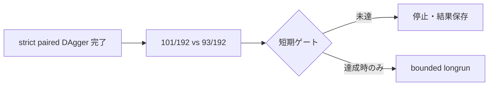

# 最新引継ぎ（2026-08-16 JST、portfolio source factory v22-v24／strict gate fail）

## 固定状態

- 現行BestKnown: self-authored P1 policy＋common/public root deck
- P1 policy SHA: `1c505b2b5d345bfd897573a7586fb1232d1946d6a3405d8fb1e8486e4e8578e9`
- root deck SHA: `2a541d7bf3d9e6b36037123f53f4dfef6348223f79fd27095dafc602a5357c19`
- BestKnown／Champion／production／submission／`cg_bestknown_loop_v1.py`: 不変
- active heavy process: なし。commit／push／Kaggle提出: 未実施

## 今回の実行

1. v22 cross-archetype 4 sourceはsmoke 32/32 fault0、fast independent 64/64 fault0だったが、Lucario中心のP1との互換性が低く、勝率7.8125%で棄却した。
2. v23 Lucario-core 4 sourceはsmoke 32/32 fault0、8×4 validation 256/256 fault0（19.140625%）だった。source-side strict selectionは未封印のまま停止した。
3. v24 Lucario-core 5 sourceはsmoke 40/40 fault0、32×3 validation 960/960 fault0（23.5417%）だった。しかし3 referenceのsource-side objectiveで`selected_ids=[]`、5 source全てmax seat gap `>5%`となった。

詳細は[`cg-portfolio-hard-negative-v22-v24-source-factory-20260816`](../evidence/cg-portfolio-hard-negative-v22-v24-source-factory-20260816.md)。中断したv22 `source-validation-4x4x4`（26/128）は性能証拠に使わない。

## 次担当

判定は`SOURCE_FACTORY_SCREEN_PASS / SOURCE_SIDE_STRICT_GATE_FAIL / BESTKNOWN_UNCHANGED`。v22〜v24のpool／seed／候補をblind retryせず、新しいsource epoch／seed namespaceでdeck-bound source-side CEMを設計する。source-side strict gateを4 source以上が通過するまでP1 CEM、DEV／FINAL、deck phase、BestKnown loopへ進まない。`ono-`は公開source名ではなく、local Git identity `bfe-lab-ono`、branch `agents/ono-cg-lethal-v1`、sealed commit `1965b42b028f10960d08ccb4980be5b76946f98b`由来のローカル識別子である。

# 最新引継ぎ（2026-08-16 JST、次の meta source 生成方式の選定）

## 固定状態

- 現行BestKnown: self-authored P1 policy＋common/public root deck
- P1 policy SHA: `1c505b2b5d345bfd897573a7586fb1232d1946d6a3405d8fb1e8486e4e8578e9`
- root deck SHA: `2a541d7bf3d9e6b36037123f53f4dfef6348223f79fd27095dafc602a5357c19`
- BestKnown／Champion／production／submission／`cg_bestknown_loop_v1.py`: 不変
- active heavy process: なし。commit／push／Kaggle提出: 未実施

## 次に実装する方式

v21までで同じ independent-root surface の再探索は lower-tail gate を通過しなかった。次は `portfolio-hard-negative source factory v1` として、公式カードCSV＋新規 role specification の4 deck family以上へ、bounded policy configurationをdeck-boundで束ね、複数referenceに対するsource-side robust objectiveでhard-negative sourceを生成する。source-side selectionはTRAINだけで行い、DEV／FINALは生成時点から未使用のまま隔離する。

最低条件は `legality → static safety → source×seat 4局以上のfault0 → source-side independent validation → TRAIN-only split → P1 CEM → candidate independent positive/lower-tail/seat-safe/opponent-seat-safe → unused DEV → unused FINAL` である。strict gate通過前に `cg_bestknown_loop_v1.py`、deck phase、BestKnown／Champion変更へ進まない。

方式の詳細と停止条件は[`cg-next-meta-source-generation-contract-v1-20260816`](../evidence/cg-next-meta-source-generation-contract-v1-20260816.md)。方式選定のみ完了し、source plan、CABT、BestKnown loop接続はまだ開始していない。

# 最新引継ぎ（2026-08-16 JST、self-owned independent cross-archetype v21／P1 CEM no-update）

### 固定状態

- 現行BestKnown: self-authored P1 policy＋common/public root deck
- P1 SHA `1c505b2b5d345bfd897573a7586fb1232d1946d6a3405d8fb1e8486e4e8578e9`
- root deck SHA `2a541d7bf3d9e6b36037123f53f4dfef6348223f79fd27095dafc602a5357c19`
- BestKnown／Champion／production／submission／`cg_bestknown_loop_v1.py`: 不変
- active heavy process: なし。commit／push／Kaggle提出: 未実施

### 今回の結果

1. v20のGrass faultとTRAIN 2 sourceの分散を避けるため、Grassを除外し、Fire／Dark／Lightning／Fighting／Water／Psychicの6 sourceを新seedで生成した。強化runtime gate（各source×seat 4局）は48/48`DONE`・fault0（32W-16L）。staged pool SHA `aa4965ed5431550496d9df87efbbd060e633bcebbd6cea4a859bb5a836d148dc`、promoted pool／fresh／meta／split SHA `8d07d74fb3940e8f4c09f1078084cea0fbda473fcbcc4dc194f591e79b6500cc`／`9c47dbdf08cce03abffca1b387a66b0e1d3c73c99351ef9b7c4b4be039c6f5e9`／`fd60a17bba01dd50f5fb177f450655663774f549d2bb0228b93c6d1045a93337`／`8b9dc51ca0b05aa1bc6ead3b6d1c4b0543110b0e4e2adad7a5494100aa774bba`。
2. splitは`META_TRAIN=4 / META_DEV=1 / META_FINAL=1`。P1固定CEM（seed`2026082121`、population／elite`8／2`、2世代、META_TRAIN_ALL）はgen0／gen1ともscreen144＋独立96局をfault0で完走した。
3. gen0 c02はscreen`+12.5pt`、独立平均`+15.625pt`でもblock`−6.25/+37.5pt`。gen1の独立平均最良は`−6.25pt`。risk-aware gate不通過により両世代`incumbent-center`×2、P1 center保持、`champion_changed=false`。
4. gen1自動DEV診断は32/32`DONE`・fault0、META_FINALは未読。候補の昇格、deck phase、BestKnown loop接続は行っていない。

### 次担当

判定は`SOURCE_GENERATION_PASS / PROMOTION_PASS / RUNTIME_SMOKE_4X_PASS / CEM_FAULT0 / POLICY_CEM_NO_UPDATE / DEV_DIAGNOSTIC_PASS / FINAL_UNREAD / BESTKNOWN_UNCHANGED`。v21 pool・seed・候補のblind retryは禁止。independent-root surfaceの2世代・TRAIN 4 sourceでもstrict lower-tail positiveが得られなかったため、次は別renderer lineageまたはpolicy→deck再結合方式を新seedで作る。strict independent positive、seat-safe、opponent×seat-safeを満たしたcandidateだけをFINALへ進める。一次evidenceは[`cg-self-owned-independent-cross-lineage-v21-cem-20260816`](../evidence/cg-self-owned-independent-cross-lineage-v21-cem-20260816.md)。

# 最新引継ぎ（2026-08-16 JST、self-owned independent cross-lineage v20／P1 CEM no-update）

### 固定状態

- 現行BestKnown: self-authored P1 policy＋common/public root deck
- P1 SHA `1c505b2b5d345bfd897573a7586fb1232d1946d6a3405d8fb1e8486e4e8578e9`
- root deck SHA `2a541d7bf3d9e6b36037123f53f4dfef6348223f79fd27095dafc602a5357c19`
- BestKnown／Champion／production／submission／`cg_bestknown_loop_v1.py`: 不変
- active heavy process: なし。commit／push／Kaggle提出: 未実施

### 今回の結果

1. 公式カードCSVと新しいseed namespaceから、Fire／Dark／Lightning／Grassの4 sourceを生成した。root package v1の`cg/`欠落は生成器がfail-closedし、同じimmutable `main.py` SHAと`cg/`を備えたv2 packageで再生成した。staged pool SHAは`8e857acc7d133fca8837452b606b1605a9d57fd470ce2ce4d0efc3ca4cf6b334`、factorial manifest SHAは`c576f98845bb252b9fd8ddc708d59ab5df4bf9fb0582794a534269d6e414ad0e`。
2. P1対v20 sourceのpromotion前smokeは16/16`DONE`・fault0（12W-4L）。promoted pool／fresh／meta／split SHAは`24e081f98eac76ed0ff33795e2b2d32f896e1aab57adf111c8d3a24dcd2aa3df`／`82f1a3b84c028266126b009e8024c511791d60f25f86d1bf35a93327d96c8d68`／`c4f9b93b604410cf7a39b7b2831b0b994b4db4f85ea2c2f2844029366b9f43fe`／`bcc3571028651a4e5c859df6f06e032819e39a1af25ae70637a20b8269a47982`。splitは`META_TRAIN=2 / META_DEV=1 / META_FINAL=1`。
3. P1固定CEM `runs/cg-self-owned-independent-cross-lineage-v20-20260816/p1-cem/`（seed`2026081621`、population／elite`8／2`、2世代）はgen0／gen1ともscreen72＋独立48局をfault0で完走した。しかしgen0 c05は独立`0.0/0.0pt`、c07は`−12.5/+37.5pt`、gen1 c00は平均`−6.25pt`、c07は`−12.5pt`で、risk-aware gate不通過。`incumbent-center`×2、P1 center保持、`champion_changed=false`。
4. gen1の自動DEV診断でincumbent／controlをGrass sourceへ32局投入し、30`DONE`・2`STEP_LIMIT`（fault率6.25%）となった。META_DEVは完全未使用とは扱わず、META_FINALは未読のまま保全する。

### 次担当

判定は`SOURCE_GENERATION_PASS / PROMOTION_PASS / RUNTIME_SMOKE_PASS / CEM_FAULT0_TRAIN / POLICY_CEM_NO_UPDATE / DEV_DIAGNOSTIC_FAULT / BESTKNOWN_UNCHANGED`。v20 pool・seed・候補のblind retryは禁止。Grass sourceのruntime安全性と、TRAIN 2 sourceによる高い分散を踏まえ、次は別recipe／別seedで3件以上のTRAIN sourceを確保し、promotion前4 games/source/seat以上のruntime gateを通してからCEMへ接続する。strict independent positive、seat-safe、opponent×seat-safeを満たす候補だけをDEV／FINALへ進める。一次evidenceは[`cg-self-owned-independent-cross-lineage-v20-cem-20260816`](../evidence/cg-self-owned-independent-cross-lineage-v20-cem-20260816.md)。

# 最新引継ぎ（2026-08-16 JST、action-conditioned v2／raw-control CEM bridge）

### 固定状態

- 現行BestKnown: self-authored P1 policy＋common/public root deck
- v2 promoted pool／fresh／split SHA: `1f925cdda22e20e84234f4186686535991f0cf69440cf0bb7f72cba37b2154a5`／`f7512c5b2f46466418c4937401991e40eafd9331af00ea504eee16a267a8c378`／`007121171a07829a94b0926b1a137992b254f411f2f38e66a26d92bf54d94d9b`
- BestKnown／Champion／production／submission／`cg_bestknown_loop_v1.py`: 不変
- commit／push／Kaggle提出: 未実施

### 今回の結果

1. 公式カードCSVからP1互換Lucario deck 6件とpublic-state-only action-conditioned renderer（12係数）を生成した。source smoke 48/48、candidate runtime、raw P1 same-deck controlのTRAIN/DEV/FINAL screenは全て`DONE`・fault0。
2. promoted/staged source directoryをcandidate seatへ渡した`buffer full`は`cg/` runtime省略による既知の入力誤りだった。candidateはgenerator `packages/`、opponentは`promoted/`へ分離し、旧parameterized controlで得た差分はpair invariant不成立として破棄した。
3. raw-control screenはsplit間で符号が揺れ、3 splitすべてpositiveかつseat-safeの候補は無かった。固定v5 deck CEM 1世代（population/elite`6/2`、train 96局fault0）のbest c05はtrain`+25.0pt`、拡張DEV`+18.75pt`、FINAL`−6.25pt`、DEV seat gap`0.625`。

### 次担当

判定は`SOURCE_GENERATION_PASS / RUNTIME_SMOKE_PASS / CEM_BRIDGE_CONNECTED / POSITIVE_NOT_REPRODUCED_WITH_SEAT_SAFE / BESTKNOWN_UNCHANGED`。v2 pool／seedは使用済みとしてblind retryしない。次は相関の低い新seed／deck recipe／rendererでsourceを生成し、raw same-deck control → fault0 → independent DEV/FINAL → seat/opponent-seat-safeの順で確認する。一次evidenceは[`cg-self-owned-action-conditioned-v1-v2-20260816`](../evidence/cg-self-owned-action-conditioned-v1-v2-20260816.md)。

# 最新引継ぎ（2026-08-16 JST、v19 runtime-safe cross-lineage source／CEM no-update）

### 固定状態

- 現行BestKnown: self-authored P1 policy＋common/public root deck
- P1 SHA `1c505b2b5d345bfd897573a7586fb1232d1946d6a3405d8fb1e8486e4e8578e9`
- root deck raw SHA `2a541d7bf3d9e6b36037123f53f4dfef6348223f79fd27095dafc602a5357c19`
- BestKnown／Champion／production／submission／`cg_bestknown_loop_v1.py`: 不変
- active heavy process: なし。commit／push／Kaggle提出: 未実施

### 今回の結果

1. v18 Grass/Venusaur sourceの`STEP_LIMIT`を受け、v19はFire/Charizard、Dark/Gengar、Lightning/ManectricのP1系3件＋independent系3件へ縮小した。既存poolとのpolicy/deck hash衝突は0、staged pool SHA `b066a13e0c08f550e63b812e90fb9b329b2d585c7e61ce4d8e89c5e733867a11`、promoted pool／fresh／split SHA `1855ffb53e2a3fe389d430a6741a7de859410174e6b31c6a011b0fc54db28a72`／`ec3614665bf4251fe2268b173732cf04a1e10d7a1a0ef3d9f1520ed8e741e8a6`／`19a6b2362baa3c18aea70fbe453587d8679684de6b680cebec74c594cd7a852a`。
2. promotion前の強化runtime smoke（各source 4 games/seat、48局）は48/48 `DONE`・fault0（29W-19L）。この4x gateを今後の最低条件とする。
3. splitは`META_TRAIN=4 / META_DEV=1 / META_FINAL=1`。P1固定CEMはscreen144＋独立192局をfault0で完走した。c00はscreen`+12.5pt`、independent `−12.5/+18.75pt`、mean`+3.125pt`だがopponent-seat-safe不成立。c06はscreen`+6.25pt`、independent`0/+3.125pt`でseat-safe不成立。`incumbent-center`×2、P1 center保持、DEV／FINAL未読。

### 次担当

判定は`SOURCE_GENERATION_PASS / RUNTIME_SMOKE_4X_PASS / CEM_FAULT0 / CEM_POSITIVE_BUT_RISK_OR_OPPONENT_SEAT_UNSAFE / BESTKNOWN_UNCHANGED`。v19 pool／seed／候補のblind retryは禁止。次はsource数の追加ではなく、P1／independent rootとは明示的に異なる action-conditioned renderer lineageを作り、runtime 4x gate → TRAIN-only CEM → risk-aware lower-tail → seat/opponent-seat-safe → DEV → FINALの順で進める。

一次evidence: [`cg-self-owned-runtime-safe-v19-20260816`](../evidence/cg-self-owned-runtime-safe-v19-20260816.md)

# 最新引継ぎ（2026-08-16 JST、epoch v18 cross-lineage source／runtime fault fail-closed）

v18はP1系4件＋independent系4件の8-source basketだった。初回16局smokeはfault0だったが、CEM screen216局中17局がGrass/Venusaur sourceの`STEP_LIMIT`。追加16局診断でも4 fault（25%）を確認し、CEM結果は破棄した。v18の初回smokeが浅すぎたため、v19からpromotion前4 games/seat gateへ強化した。

一次evidence: [`cg-self-owned-cross-lineage-v18-20260816`](../evidence/cg-self-owned-cross-lineage-v18-20260816.md)

# 最新引継ぎ（2026-08-16 JST、epoch v17 cross-element independent source／CEM positive but seat-unsafe）

### 固定状態

- 現行BestKnown: self-authored P1 policy＋common/public root deck
- P1 SHA `1c505b2b5d345bfd897573a7586fb1232d1946d6a3405d8fb1e8486e4e8578e9`
- root deck raw SHA `2a541d7bf3d9e6b36037123f53f4dfef6348223f79fd27095dafc602a5357c19`
- BestKnown／Champion／production／submission／`cg_bestknown_loop_v1.py`: 不変
- active heavy process: なし。commit／push／Kaggle提出: 未実施

### 今回の結果

1. 公式カードCSVから Fighting/Zygarde、Water/Starmie、Psychic/Gardevoir の8 sourceを生成した。既存 pool manifestとのpolicy／deck hash衝突は0件。staged pool SHA `25404f4c4bbe140ca468722f0d8f245fd320809ae3a5b516e83af72b82d609dd`、promoted pool SHA `325b0c33bec126928f588f04d15ce978b4db855489ca1f72f92f3f781d3e6aaa`、fresh SHA `0b2bf2fb491f46b53baac12999307b640bb9f2c0d1e4f08d3a2ee84bd5c37a64`。
2. P1 subject対source opponentの16局 bounded smokeは16/16 `DONE`・fault0（12W-4L）で通過。用途はlocal-eval-only、authority全false。
3. splitは`META_TRAIN=4 / META_DEV=2 / META_FINAL=2`（split SHA `bba92ad1cd182ee8c05cad2d5122b70c90432ca76464bead62344c2c5b2922ce`）。P1固定CEMはscreen144＋独立再評価48局をfault0で完走した。screen上位c00／c05はそれぞれ`+18.75pt`／`+12.5pt`、独立repeatは`+50/+50pt`／`+37.5/+37.5pt`だったが、両方`seat_safe=false`、`opponent_seat_safe=false`。campaign `champion_changed=false`、P1 center保持、DEV／FINAL未読。

### 次担当

判定は`SOURCE_GENERATION_PASS / HASH_COLLISION_PASS / PROMOTION_PASS / RUNTIME_SMOKE_PASS / CEM_POSITIVE_BUT_SEAT_UNSAFE / BESTKNOWN_UNCHANGED`。v17 pool／seed／候補のblind retryは禁止。同じ独立root rendererと3 archetypeを再試行せず、policy familyとdeck familyを同時に変える低相関source、またはsource数を増やして相手別seat varianceを下げる新epochを作る。その後も `legality → static safety → bounded fault0 → TRAIN-only → independent positive → seat-safe/opponent-seat-safe → unused DEV → unused FINAL` の順で進める。

一次evidence: [`cg-self-owned-independent-cross-element-v2-20260816`](../evidence/cg-self-owned-independent-cross-element-v2-20260816.md)

# 最新引継ぎ（2026-08-16 JST、epoch20 v16 hybrid-support source／P1 CEM no-update）

### 固定状態

- 現行BestKnown: self-authored P1 policy＋common/public root deck
- P1 SHA `1c505b2b5d345bfd897573a7586fb1232d1946d6a3405d8fb1e8486e4e8578e9`
- root deck raw SHA `2a541d7bf3d9e6b36037123f53f4dfef6348223f79fd27095dafc602a5357c19`
- BestKnown／Champion／production／submission／`cg_bestknown_loop_v1.py`: 不変
- active heavy process: なし。commit／push／Kaggle提出: 未実施

### 今回の結果

1. 公式カードIDだけから4件の self-owned hybrid-support deck＋P1 policyを生成し、staged pool SHA `3c3cd07e9395177034656b7ecc2cf4e019662566dfdb7172652c516834aca812`、promoted pool SHA `eb13f0848da593d85266902ed93fb596c2b1609ffc7a4c86b52f3e7f6dfcaae4`、fresh SHA `494ff6584d164b86217990a9b8fa2f5aba2e17827ddb69679d61830a6502ad70`を封印した。authorityは全false、local-eval-only。
2. P1 subject対v16 source opponentの履歴smokeは8/8 `DONE`・fault0。source-subject smoke runnerのbuffer fullは既存v15でも再現したため、v16候補の性能失敗とは分離して扱った。
3. P1固定CEM `runs/cg-p1-cem-self-owned-cg-policy-family-v16-hybrid-support-20260816/` はscreen72＋独立再評価24を完走。screen最大delta `0.0pt`、eliteの再評価meanは`−0.125`／`0.0`、双方seat-safe不成立。`incumbent-center`×2でP1 centerを維持し、DEV／FINALは未読。

### 次担当

判定は`SOURCE_GENERATION_PASS / PROMOTION_PASS / RUNTIME_SMOKE_PASS / CEM_NO_UPDATE / BESTKNOWN_UNCHANGED`。v16 pool／seedのblind retryは禁止。同じComfey parentや同一4点のrate違いへ戻らず、deck archetypeとpolicy lineageの双方を変えた新source batchを作り、`legality → static safety → bounded fault0 → TRAIN-only → independent positive → seat-safe/opponent-seat-safe → unused DEV → unused FINAL`を満たした候補だけをBestKnown loopへ接続する。

一次evidence: [`cg-self-owned-cg-policy-family-v16-hybrid-support-20260816`](../evidence/cg-self-owned-cg-policy-family-v16-hybrid-support-20260816.md)

# 最新引継ぎ（2026-08-16 JST、epoch17–19 meta source generation／P1 CEM no-update）

### 固定状態

- 現行BestKnown: self-authored P1 policy＋common/public root deck
- P1 SHA `1c505b2b5d345bfd897573a7586fb1232d1946d6a3405d8fb1e8486e4e8578e9`
- root deck raw SHA `2a541d7bf3d9e6b36037123f53f4dfef6348223f79fd27095dafc602a5357c19`
- BestKnown／Champion／production／submission／`cg_bestknown_loop_v1.py`: 不変
- active heavy process: なし。commit／push／Kaggle提出: 未実施

### 今回の結果

1. epoch17のremote履歴監査は615 snapshot、accepted 0。既存identity／consumed ledger／runtime accessの再利用をfail-closedし、同じ履歴のblind retryを止めた。intake report SHAは`0d837a29f6ed41a1843aca25099c5178fdcb3da15f4a1a73837dfa0dafaad950`。
2. epoch18はepoch16bの新規Comfey parentからbehavior factorial 4件を生成した。promoted pool／fresh／split SHAは`74af83aad260f6abf1bc849d551e21656f69e804cee874f781a5d03f2d6270f9`／`c1adbfd7d761f948a8b8949b1feedb92c9da1b2b9e669ef91e942a2b351b2ea8`／`0f6222aa4bb73fd27458c03ecfc0efc7a847d17cea7e84be891d98ac1f51ca71`。CEMはfault0だが独立gate不成立でcenter保持。
3. epoch19は同じparentに別recipe `self-owned-meta-adapter-v1`を適用した4 variant。各2局smokeはfault0、統合pool／fresh／split SHAは`8c88578a7c7558f6c718aa767cd824132f1508729172041ccee735c278a0d071`／`7ceee2cf9867e1c5af13ea97b1b911dfe58963253b7f1bde6a7c5c1f571ccc5a`／`7017036dd9b2bfe738ff916018867458efcb8f5b3bd0ea7e357f616aea2cde75`。
4. epoch19 P1 CEMはscreen72＋独立24をfault0で完走。c03はscreen／独立TRAINとも+25.0ptだが再評価`+50.0/0.0pt`、c07は`0.0/−25.0pt`。seat-safe／opponent-seat-safe不成立、`incumbent-center`×2でP1 center保持。DEV／FINALは未読。

### 次担当

判定は`SOURCE_GENERATION_PASS / BOUNDED_SMOKE_PASS / POLICY_CEM_NO_UPDATE / BESTKNOWN_UNCHANGED`。epoch19 pool／seed／候補のblind retryは禁止。同一Comfey parentのrate追加ではなく、相関を下げる新規permission sourceまたは明示的に異なるgenerator recipeを生成し、`legality → static safety → bounded fault0 → TRAIN-only → independent positive → seat-safe/opponent-seat-safe → unused DEV → unused FINAL`を満たした候補だけをBestKnown loopへ接続する。

一次evidence: [`cg-internal-comfey-adapter-epoch19-cem-20260816`](../evidence/cg-internal-comfey-adapter-epoch19-cem-20260816.md)

# 最新引継ぎ（2026-08-16 JST、epoch14 historical internal source／P1 CEM no-update）

### 固定状態

- 現行BestKnown: self-authored P1 policy＋common/public root deck。P1 SHA `1c505b2b5d345bfd897573a7586fb1232d1946d6a3405d8fb1e8486e4e8578e9`、root deck raw SHA `2a541d7bf3d9e6b36037123f53f4dfef6348223f79fd27095dafc602a5357c19`
- BestKnown／Champion／production／submission／`cg_bestknown_loop_v1.py`: 不変
- active heavy process: なし。commit／push／Kaggle提出: 未実施

### 実行結果

1. first-parent historical intakeを4 refsへ適用し、12件を新規local-eval-only poolへ封印した。pool／fresh SHAは `590ee18351ec4e4dc2fabb4a3d17857ecf9089f86ef70a1146dffe30e97c9525`／`7b708d3dab394947d77abb0e68de416333b0c3958249df89e2adb94b1f11d610`。P1両seat各1局 smokeは24/24 `DONE`・fault0だが、5W-19Lの少数runtime smokeであり性能根拠ではない。
2. split SHA `bf24b182f8ef85af3faea9dd9202144bdc19fa97cc5962e9b2cab45c19868ec9`を `META_TRAIN=8 / META_DEV=2 / META_FINAL=2` として封印した。P1＋root deck固定CEMはscreen288＋独立96局を全て`DONE`・fault0で完走した。
3. screen上位c07はcontrol比+15.625ptだったが、独立差は`+6.25pt / −18.75pt`、mean −6.25pt、minimum −18.75pt、seat／opponent-seat-safe不成立。c01も独立−18.75pt×2。positive／risk-aware gate不通過でP1 centerを保持した。

### 判定と次担当

判定は `SOURCE_GENERATION_PASS / BOUNDED_SMOKE_PASS / POLICY_CEM_NO_UPDATE / BESTKNOWN_UNCHANGED`。DEV／FINALは未読である。このpool／seed／候補のblind retryは禁止。次は別policy lineageまたは新runtime-safe source recipeを新epochで生成し、同じstrict gateを通過した候補だけをBestKnown loopへ接続する。

一次evidence: [`cg-internal-historical-epoch14-p1-cem-20260816`](../evidence/cg-internal-historical-epoch14-p1-cem-20260816.md)

# 最新引継ぎ（2026-08-16 JST、epoch11–13 source／root-deck P1 CEMとdeck/fallback契約診断）

### 固定状態

- 現行BestKnown: self-authored P1 policy＋common/public root deck。P1 SHA `1c505b2b5d345bfd897573a7586fb1232d1946d6a3405d8fb1e8486e4e8578e9`、root deck raw SHA `2a541d7bf3d9e6b36037123f53f4dfef6348223f79fd27095dafc602a5357c19`
- BestKnown／Champion／production／submission／`cg_bestknown_loop_v1.py`: 不変
- active heavy process: なし。commit／push／Kaggle提出: 未実施

### 実行結果

1. epoch11–13の4件の self-owned robust sourceを別rootへ集約した pool（SHA `0191e4cd4bbd481abdfe95ea84310562dd43c57ba375e902b1e11f3527c06ed7`）を `META_TRAIN=2 / META_DEV=1 / META_FINAL=1` に固定した。split SHAは `17150416b386fb70a1b370265f7fe9e892957af8838690db3dbf3621ab9c5ed3`。P1 source smokeは全てfault0である。
2. 正しい P1＋root deck bindingで policy CEM `runs/cg-p1-cem-robust-source-epoch11-13-root-20260816/` を seed `2026090412`、population／elite `8／2`、screen72＋独立48局、positive／risk-aware gateで実行した。120/120 `DONE`・fault0。screen上位 c05は `+37.5pt`、独立は `+37.5pt / −12.5pt`、risk-aware mean／minimum `+12.5pt / −12.5pt`で安全条件外。選択は `incumbent-center`×2、P1 center保持。DEV／FINALは未読。
3. 先行の self-owned kieran policy CEMは、candidate deck SHA `c82f8ccda501d9396e0eca9f6f7e0d8aebdeeefbd0f0bde631c5231158d6e2fd`とP1 root control/split SHA `2a541d7bf3d9e6b36037123f53f4dfef6348223f79fd27095dafc602a5357c19`を混在させたため、CABT前の static smokeで `candidate failed the P1 deck/fallback contract`となった。既存の deck-bound回帰テストは2/2 PASS。static smokeを緩めず、同一deckの source／control／splitを再封印してから再開する。

### 判定と次担当

判定は `SOURCE_GENERATION_PASS / STATIC_CONTRACT_DIAGNOSTIC / POLICY_CEM_NO_UPDATE / BESTKNOWN_UNCHANGED`。epoch11–13 poolと今回のCEMは性能使用済みとしてblind retryしない。次は新しいpermission済みmeta sourceまたは同一self-owned deckに再束縛した別splitを生成し、`legality → static safety → bounded fault0 → TRAIN-only smoke → independent positive → seat-safe/opponent×seat-safe → unused DEV → unused FINAL`を通過した候補だけをBestKnown loopへ渡す。

一次evidence: [`cg-robust-source-epoch11-13-root-cem-20260816`](../evidence/cg-robust-source-epoch11-13-root-cem-20260816.md)

# 最新引継ぎ（2026-08-16 JST、self-owned near-root deck screen／独立確認反転）

- 公式カードCSVと新規役割仕様だけから、root deckとcanonical hashが一致しないself-owned scratch deckを4件生成した。各候補はrootとの差分1枚（Maximum Belt、Kieran、Ultra Ball、Community Center）で、`parent_deck=null`、`public_parent_read=false`、authority全false、public canonical collision 0、package verifier PASS。
- P1 policyを固定し、24 opponent×2 seat×1 gameの低コストscreenを実行した。全候補で全96局`DONE`・fault0。ACE swap `+8.3333pt`、Kieran swap `+2.0833pt`、Ultra Ball swap `−6.25pt`、Community Center swap `−6.25pt`。
- screen上位2件を別seed・2 games/seatで独立確認した。ACE swapはcandidate `14W-82L` 対 control `19W-77L`、Kieran swapは`15W-81L` 対`20W-76L`で、両方`−5.2083pt`へ反転。全192局`DONE`・fault0・draw0で、seat-safe／promotion不可。
- 判定は`SELF_OWNED_DECK_GENERATION_PASS / SCREEN_SIGNAL_NOT_REPRODUCED / POLICY_DECK_NO_UPDATE / BESTKNOWN_UNCHANGED`。今回の候補・seed・参照poolは性能使用済みとしてblind retryしない。
- 現BestKnown／P1／root deck／Champion／production／submission／`cg_bestknown_loop_v1.py`は不変。次は近傍deckの追加ではなく、未使用metaを生成時に分離した別policy lineageまたは別runtime-safe rendererへ戻る。
- 一次evidence: [`cg-self-owned-near-root-deck-screen-v1-20260816`](../evidence/cg-self-owned-near-root-deck-screen-v1-20260816.md)。artifact root: `runs/cg-self-owned-near-root-deck-screen-v1-20260816/`。

## 最新引継ぎ（2026-08-16 JST、公開 re-export source intake／wrapper contract fix）

### 結果

- `res1235/rule-based-agent-mega-lucario-ex-deck-very-simple` は未性能使用の公開 snapshot。`main.py`の `from agent import agent` を明示的 re-export として認識し、source本体は変更せず intake に受理した。
- generated wrapperを修正し、payloadのsignatureが一引数なら configurationを転送せず、二引数をbindできる場合のみ転送する。wrapper契約テストを追加し、`tests/test_kaggle_kernel_meta_v1.py` は `16 passed`。
- intake config: `configs/meta_specialist/cg_kaggle_kernel_meta_reexport_wrapperfix_epoch9_20260816.json`
- intake root: `runs/cg-kaggle-kernel-meta-intake-public-reexport-wrapperfix-epoch9-20260816/`
- raw tar SHA: `9b5dee3801e7ee4dff40af94fd08476849bbd08cbc19cd49f254283c197d0bea`
- generated wrapper SHA: `be74996cfb949205f3dc3c59814b23c649b4400c25c931df76e9df7ca0af74d2`
- fresh meta SHA: `bde52f78b9897b0751f27439f2e8bd81c986fff8ba4f8623c4fbafaac0a59103`
- pool manifest SHA: `d91a0810ba4aa6f6663dd802bd957ce3ca5a1b18893d3ed83ac3c84d82423a70`

### bounded smoke

`scripts/run_kaggle_kernel_meta_smoke_v1.py` は、source import後の `cg` 再ロードを避けるため opponent factoryを先にbindし、candidate importを `run_match`内へ遅延する。stable artifact `runs/cg-kaggle-kernel-meta-smoke-public-reexport-wrapperfix-epoch9-20260816-ordered-2x-stable/`で `official_random`との両seat・各2局（4局）を `DONE 4 / fault 0 / 4W-0L`。summary SHA `4442257cdadba8a8522febeca66e9cf0ddc11f1fbf12b2581f4f792787f92669`、completion manifest SHA `a988456d5318e176656127f7798c5c81c8ab9222501c017f3412ccbb47260e73`。

これは local-eval-only の source smoke であり、性能証拠・training meta・CEM・promotionではない。`opponents/` production poolへ追加していない。現BestKnown、P1＋root deck、P2、Champion、production、submission、commit、pushは不変。一次evidence: [`cg-kaggle-kernel-meta-reexport-wrapperfix-20260816`](../evidence/cg-kaggle-kernel-meta-reexport-wrapperfix-20260816.md)。

## 最新引継ぎ（2026-08-16 JST、epoch9／epoch10 source CEM・self-owned v8 deck）

### 現在の固定状態

- BestKnown／Champion／production／submission／`cg_bestknown_loop_v1.py`の昇格状態: self-owned P1 policy＋root deckのまま不変
- active heavy process: なし。commit／push／Kaggle提出: 未実施
- `ono-`: Git identity `bfe-lab-ono`、branch `agents/ono-cg-lethal-v1`、封印commit `1965b42b028f10960d08ccb4980be5b76946f98b`由来。公開kernel作者名や外部deck sourceを意味しない

### 今回の結果

1. epoch9 source CEM（seed `2026088001`、population／elite `12／3`、screen 576、validation 96）はfault0で完走し、`robust-source-g00-c02-1f7064f080ab`（fresh mean 58.3333%、worst 53.125%、seat gap 12.5%）をpromoteした。
2. epoch10 source CEM（seed `2026089101`、epoch8-c04 centered、population／elite `12／3`、screen 576、validation 192）はfault0で完走し、`robust-source-g00-c11-8e36de867293`（fresh mean 55.2083%、worst 42.1875%、seat gap 9.375%）をpromoteした。6 source poolを `META_TRAIN=4 / META_DEV=1 / META_FINAL=1`へ封印した。
3. epoch10 poolのP1 CEMをMETA_TRAIN-onlyとMETA_TRAIN＋META_DEVで各2世代実行した。全row fault0だが、独立 lower-tail／opponent-seat gateは不成立で両方 `incumbent-center`保持。policy更新なし。
4. self-owned v8 deck recipeを公式CSVから4候補生成し、60枚／public collision 0／smoke fault0を確認した。epoch10 META_TRAIN matched screenは全4候補がP1 control比で負差（`−18.75 / −9.375 / −9.375 / −18.75pt`）。v8 recipeはhard-negativeとして停止する。

### P2に関する注意

P2 config `c83df4408b24`の現repo一次記録は、fresh medal holdoutでP1比 `−2.9948pt`、P2 `188W-1D-190L-5F` 対 P1 `200W-0D-180L-4F`、`NOT_PROMOTABLE`である。`+1.82/+5.56/+3.13`という別資料の値は対応artifactが未確認なので、P2昇格やBestKnown更新には使わない。

一次evidence: [`cg-epoch9-10-source-and-self-owned-deck-v8-20260816`](../evidence/cg-epoch9-10-source-and-self-owned-deck-v8-20260816.md)

## 最新引継ぎ（2026-08-16 JST、robust source pool再検証／P1 CEM no-update）

### 固定状態

- 現行BestKnown: self-authored P1 policy＋common/public root deck。P1 SHA `1c505b2b5d345bfd897573a7586fb1232d1946d6a3405d8fb1e8486e4e8578e9`、root deck raw SHA `2a541d7bf3d9e6b36037123f53f4dfef6348223f79fd27095dafc602a5357c19`
- BestKnown／Champion／production／submission／`cg_bestknown_loop_v1.py`の昇格状態: 不変
- active heavy process: なし。commit／push／Kaggle提出: 未実施

### 実行結果

1. robust source CEM epoch4〜7を追加実行した。epoch7はpopulation 24、screen 576局、elite validation 96局、全row `DONE`・fault0だがpromotion 0件。`campaign_result.json` SHAは `faced4d8c31186177d666af1f27b155563515f6a5504850251b80b734570856b`。同一portfolioのblind retryは停止する。
2. 過去epochのscreen gate通過かつ未使用のdistinct candidate 8件を、新seedで384局再検証し、fault0で4件を選定した。`epoch2-c01`、`epoch2-c03`、`epoch4-c06`、`epoch7-c19`は fresh mean 56.25〜70.8333%、worst reference 50.0〜62.5%、max seat gap 12.5〜25.0%。validatorは `scripts/validate_robust_source_candidates_v1.py`、result SHA `98fe3c8b8b0f011633103efea8b82725b6af028530c4c7c45c08a6aef9fa3b59`。
3. `scripts/seal_robust_source_weekend_pool_v1.py`で4件を別rootへ再封印し、P1対source smoke 8/8 `DONE`・fault0。splitは `META_TRAIN=(epoch2-c01, epoch2-c03)`、`META_DEV=(epoch4-c06)`、`META_FINAL=(epoch7-c19)`。pool／fresh／meta／split SHAは `920880c7bac47ef7f0d69b3d895176981bdb809a93d1fb7fbf8cb5873c5afa0c`／`ceeee4148fdd8ca205838208cd303c8ad6690b0c6c3951ec4167c8cb736ec29b`／`672d2831725ee61d060be8deb8e335fac9b16eccc6ab113c0707fedbad14a1fc`／`7e7499cc59c1ee1b92041ee89222e29d1557cfc8b69c56d24247af6292f4ad23`。`load_weekend_split(..., verify_sources=True)`はPASS。
4. P1固定policy CEM `runs/cg-p1-cem-robust-source-weekend-20260816-v1/`をseed `2026084002`、population／elite `8／2`、META_TRAIN_ALL、screen 72局＋独立96局（各elite 32局＋shared control block）で実行した。全row `DONE`・fault0。screen上位は+25.0ptだったが独立−12.5pt（repeat −18.75／−6.25pt）、もう1候補も独立−15.625pt。positive／risk-aware／seat-safe gate不成立で`incumbent-center`×2、P1 center保持。DEV／FINALは未読。

### 判定と次担当

判定は `SOURCE_GENERATION_PASS / FRESH_DISTINCT_SOURCE_POOL_SEALED / POLICY_CEM_NO_UPDATE / BESTKNOWN_UNCHANGED`。P2／P3、deck phase、BestKnown loop接続、Champion／production変更は行わない。次は同じsource portfolioのblind retryではなく、別policy lineageまたは別deck recipeを含む新しいsource epochを作り、独立 positive・seat-safe・unused DEV／FINALを満たしたcandidateだけを次へ渡す。

一次evidence: [`cg-robust-adversarial-source-cem-20260816`](../evidence/cg-robust-adversarial-source-cem-20260816.md)

## 最新引継ぎ（2026-08-16 JST、self-owned robust adversarial source CEM epoch3）

- 新しいsource生成器 `src/mage_ptcg/opponent_ingest/robust_adversarial_source_cem_v1.py` と runner `scripts/run_robust_adversarial_source_cem_v1.py` を追加した。P1 parameter surfaceからself-owned adversarial policyを生成し、P1／Rule v0／self-owned independent policyの固定portfolioに対してterminal WDLのみで評価する。公開kernelを生成元には使わない。
- epoch3 `runs/cg-robust-adversarial-source-cem-20260816-epoch3-selfowned-multielite/` はscreen 192局、elite validation 2候補×48局、source smoke 2局を全て`DONE`・fault0で完走した。`robust-source-g00-c05-acb3f0d8e32e` はfresh validation mean 56.25%、worst reference 50.0%、最大seat gap 25.0%でpromotion gateを通過した。pool SHA `fbe73d49c918d4d13c0d2670941f38b507826d8efe96873e13c4f80abf14c3c5`、fresh meta SHA `671bff318a6b2ff0479d6ee96868faae80a9c51cc79cd4c19cfbb56d945ee707`。
- `build_fresh_meta_batch_v1` のloader再検証はPASS。現fresh batchはreference 1件であり、既存weekend splitや性能使用済みpoolへ混ぜていない。別seed／別source epochで未使用TRAIN／DEV／FINALを追加分離してからcandidate runnerへ接続する。
- epoch1 public-reference混成は全候補seat-collapse、epoch2 self-owned portfolioはfresh validation seat gap 62.5%で不合格だった。epoch3は全elite fresh validationで選抜noiseを抑えた。
- 判定: `SOURCE_GENERATION_PASS / SELF_OWNED_ROBUST_SOURCE_PROMOTED / BESTKNOWN_UNCHANGED`。P1、root deck、BestKnown、Champion、production、submission、commit、pushは不変。

一次evidence: [`cg-robust-adversarial-source-cem-20260816`](../evidence/cg-robust-adversarial-source-cem-20260816.md)

## 最新引継ぎ（2026-08-16 JST、self-owned public-state mix epoch1）

- 現行BestKnown: self-authored P1 policy＋common/public root deck（P1 SHA `1c505b2b5d345bfd897573a7586fb1232d1946d6a3405d8fb1e8486e4e8578e9`、root deck SHA `2a541d7bf3d9e6b36037123f53f4dfef6348223f79fd27095dafc602a5357c19`）
- BestKnown／Champion／production／submission／`cg_bestknown_loop_v1.py`: 不変
- active heavy process: なし。commit／push／Kaggle提出: なし

1. `cg_p1_public_state_mix_v1` と `generate_self_owned_cg_public_state_mix_meta_v1.py` を追加し、公式カード CSV＋role spec v5/v6/v7から6 distinct self-owned deck＋policy sourceを生成した。policyはP1 parent固定、8 bounded public-state knob、opponent hidden identity・search APIなし。source rootは`runs/cg-p1-public-state-mix-epoch1-20260816/`、plan SHAは`7e8e90d3e5039299d790e05bb78fff7fb77c768aeb33daa20e97e198173449c7`。
2. 6 packageのdeck合法性、P1 parent、package verifier、AST compile、public-only scan、static fallbackをPASSした。`packages/`またはruntime `cg/`同梱rootで reference 2件・両seat・24局のbounded smokeを実行し、24/24 `DONE`・fault0。promoted rootは`runs/cg-p1-public-state-mix-epoch1-20260816-promoted/`、pool SHA `d55d2d2d92e3514352c7dc7a7cb1b01ecba0735fa17b889f92dfcf702cdfeda3`、fresh SHA `78c7a64fd2675b6fe16e324c5f71a4df4b97af735477b374a088c69c19f6b568`。
3. 初回に `staged/`（`cg/`なし）をsmokeへ渡した場合は native `buffer full`／`BrokenProcessPool`となった。これはruntime bundle欠落という入力条件の問題で、runtime同梱rootでは再現しない。少数局scoreは性能根拠にせず、`PERFORMANCE_UNPROVEN`として扱う。

4. exposure ledger（SHA `8320d94d1b58c0818f3741777791155c04dbe1211ebfe515cc2d263a0b46f7c5`）と split（SHA `e71673ab6743d342e58e11551dfbb3b82ab871819f432d16fc0e3e73698498d4`）を封印し、P1固定 CEMを seed `20260816801`で screen80＋独立48局、全128局 fault0で実行した。risk-aware／seat-safe gate不成立、`incumbent-center`保持。
5. 6 public-state packageのTRAIN screenは96局 fault0。paired screen上位は `ahead-lethal-conserve +25.0pt`。上位4件の別seed `20260816803`・各opponent×seat 4局の独立再評価は256局 fault0だが `−3.125 / −25.0 / −12.5 / −18.75pt` で全件不採用。`META_DEV`／`META_FINAL` は未読。

### 判定と次担当

判定は `SOURCE_GENERATION_PASS / BOUNDED_SMOKE_PASS / TRAIN_SCREEN_NO_UPDATE / BESTKNOWN_UNCHANGED`。今回の6 source、policy SHA、deck SHA、seedは性能使用済みとしてblind retryしない。次は生成時点でholdoutを分離した別source epochまたは構造的に異なるself-owned rendererを作り、独立 positive・seat-safe・opponent×seat-safeが確認できるまでDEV／FINAL、P2／BestKnown、`cg_bestknown_loop_v1.py`接続、Champion変更、production変更、submissionを行わない。

一次evidence: [`cg-p1-public-state-mix-epoch1-20260816`](../evidence/cg-p1-public-state-mix-epoch1-20260816.md)

## 最新引継ぎ（2026-08-16 JST、epoch9 raw timeout／runtime-safe Metal family）

- 現行BestKnown: self-authored P1 policy＋common/public root deck（P1 SHA `1c505b2b5d345bfd897573a7586fb1232d1946d6a3405d8fb1e8486e4e8578e9`、root deck SHA `2a541d7bf3d9e6b36037123f53f4dfef6348223f79fd27095dafc602a5357c19`）
- BestKnown／Champion／production／submission／`cg_bestknown_loop_v1.py`: 不変
- active heavy process: なし。commit／push／Kaggle提出: なし

1. `agents/ozawa-metal-psychic-search` の未使用履歴4 snapshotをstatic-only intakeした。raw P1 smokeは8局中6局`parent_timeout`（fault rate 75%）だったため、raw sourceを性能探索へ使わない。
2. `src/mage_ptcg/opponent_ingest/behavior_family_meta_v1.py`のMetal exact transformを、`PRINPLUP`あり／なしの両priority tableへ対応させた。runtime-safe 4 variantを`runs/cg-internal-source-epoch9-metal-runtime-safe-20260816/`へsealし、pool／fresh／split／meta manifest SHAは`016a18aeff4d3a707fd4e907851acfc5dfb46d461fddd0646397b3b5c07867f6`／`cb6a82456aa2d170973f6b288230468fe071179ee4d0c4b3062d5e21a12a3e31`／`afa414b826f290d1903f7f0993004193e0899ea2f38afcc675598f4998208d0`／`75975df8da9b1e348761e61c89fff749988f08a6ec6648d83e9a86cd19a646db`。
3. P1対の8局bounded smokeは8/8`DONE`・fault0（5W-3L）。ただし4件は同一branch／同一base policy／同一deckの派生であり、独立source数として水増ししない。CEM／DEV／FINALは未起動。

一次evidence: [`cg-internal-source-epoch9-runtime-safe-20260816`](../evidence/cg-internal-source-epoch9-runtime-safe-20260816.md)。次は別作者または別policy／deck lineageを先に確保し、今回のfamilyはruntime-safe generatorの検証用として保持する。

## 最新引継ぎ（2026-08-16 JST、cross-lineage epoch7／c05 holdout）

### 固定状態

- 現行BestKnown: self-authored P1 policy＋common/public root deck。P1 SHA `1c505b2b5d345bfd897573a7586fb1232d1946d6a3405d8fb1e8486e4e8578e9`、root deck SHA `2a541d7bf3d9e6b36037123f53f4dfef6348223f79fd27095dafc602a5357c19`
- BestKnown／Champion／production／submission: 不変
- active heavy process: なし
- commit／push／Kaggle提出: 未実施

### 実行結果

1. 未使用公開kernel lineage（yaminh／samrishb／Sushanth Emboar／Sushanth Zacian）をpolicy parentとdeck parentへ分離し、`CROSS_LINEAGE_POLICY_DECK_RECOMBINATION_V1`で7 sourceを生成した。P1 smokeは14/14 `DONE`・fault0（8W-6L）でpromotionした。promoted pool／fresh／meta／split SHAは `aa5a01b6a6bcfa12b2468c305c54810d02d5b5fc7e3fa359648455052569ff58`／`ad5b80d9d5db4258f11958c167e2dda286ec30c1013fe45ce4e3252da4e582f5`／`c32822ba9ac8b8384a0e58ac8d9353a482ab94197bdd1933c984a34c8cd2b70e`／`75c6262ce42d27a0e4e9ef4177b28a460a6f981e6f422b7692f0b95afaa46a88`。TRAIN5／DEV1／FINAL1で、DEV／FINAL policy lineageはTRAINから分離した。
2. epoch7 CEM `runs/cg-cross-lineage-epoch7-cem-20260816/` は seed `202608985`、population／elite `8／2`、1世代、独立再評価2回でscreen180＋独立60局を全て`DONE`・fault0で完走。screen差は最大0pt、c05の独立は`+20pt / 0pt`、c06は`−5pt`。risk-aware minimum gate不成立で`incumbent-center`×2、P1 center保持。
3. 未使用DEV／FINALでc05を候補／P1 control各32局（両seat各8反復）確認した。candidate `3W-0D-29L` 対 control `0W-0D-32L`、差 `+9.375pt`、fault0。これは2 sourceだけの低絶対勝率holdoutであり、昇格証拠とは扱わない。

### 判定と次担当

判定は `SOURCE_GENERATION_PASS / CROSS_LINEAGE_POLICY_CEM_NO_UPDATE / HOLDOUT_SIGNAL_ONLY / BESTKNOWN_UNCHANGED`。epoch7の公開lineage source・c05・seedは性能使用済みとしてblind retryしない。c05 holdoutをBestKnown／P2へ昇格せず、次は複数deck archetype・異なるruntime-safe renderer・生成時holdout分離を同じsource recipeへ組み込む。一次evidenceは `docs/evidence/cg-cross-lineage-epoch7-cem-20260816.md`。

## 最新引継ぎ（2026-08-16 JST、self-owned v14/v15 root-deck CEM no-update）

### 固定状態

- 現行BestKnown: self-authored P1 policy＋common/public root deck。P1 SHA `1c505b2b5d345bfd897573a7586fb1232d1946d6a3405d8fb1e8486e4e8578e9`、root deck SHA `2a541d7bf3d9e6b36037123f53f4dfef6348223f79fd27095dafc602a5357c19`
- BestKnown／Champion／production／submission: 不変
- active heavy process: なし
- commit／push／Kaggle提出: 未実施

### 実行結果

1. v14 behavior-spreadは公式カードCSVから8 self-owned sourceを生成し、P1 smoke 32/32 `DONE`・fault0（15W-17L）。CEM screen 216、独立72もfault0だったが、上位c01の独立mean/minは`−16.667/−41.667pt`、c06は`0/−25pt`でgate不成立。pool／fresh／meta／split SHAは`01aa3179e1bb7e1a68a646b315574bda758b1afd876ff21ea0ab41c216758d3d`／`2c3bd8082a95eee45e2791293f6acd014c96959ce1bf433bdcdcfbfbe670b6eb`／`5ac26b79f05e18ae0e963b5c71fb7917f650443ed47a61a629fa28ff0480c1d2`／`06ba48f3db5075be5278088bd576f2bbd381bf49bf68c2871f6172854668efd0`。
2. v15初回のspec v1は既存public canonical deck衝突でfail-closed。spec v2・別seedのretry1を採用し、8 self-owned sourceをP1 smoke 32/32 `DONE`・fault0（17W-15L）でpromoteした。epoch6g public 2 sourceと混成した10-source poolを、v15 8件=TRAIN、public 2件=DEV／FINALとしてroot-deck binding（deck SHA `2a541d7bf3d9e6b36037123f53f4dfef6348223f79fd27095dafc602a5357c19`）で再構成した。pool／fresh／meta／split SHAは`7b27d98dbb546d37eabc6869aeca88474da8d17e84bdce3e9d5d8a084ab7d58c`／`c40aa72dca9925f62857262f84b807685fc5f8322a0e185ce9f8f23334be2aa6`／`f6df1830fdb7c871ea6f65de0c211768c4514f37331eba731a196774e4ba7464`／`e25e01b5af15deef75fa20ff9bf84b2cf82dedbdebc373cc1018110ccd622cbf`。
3. root-deck CEM `runs/cg-self-owned-public-mixed-cg-cem-v15-rootdeck-20260816/`はP2 config `c83df4408b24`、seed `202608982`、population／elite `8／2`、1世代、独立2回、positive／risk-aware gateでscreen 288局を実行した。c05 `+12.5pt`、c06 `+9.375pt`のscreen上振れは独立でそれぞれmean/min `−3.125/−6.25pt`、`−6.25/−18.75pt`へ反転し、両方seat/opponent-safe false。`incumbent-center`×2でP2 centerを保持し、DEV／FINALは未読である。
4. self-owned batch promotion後のsmoke summary pool SHA不一致を検出し、promotion時の再束縛を実装した。回帰テスト6件はpass。

### 判定と次担当

判定は `SOURCE_GENERATION_PASS / ROOT_DECK_BOUND / POLICY_CEM_NO_UPDATE / BESTKNOWN_UNCHANGED`。v14／v15 source、P2 config、seed、候補は性能使用済みとしてblind retryしない。次はsource lineage相関を下げ、holdoutを生成時点で分離し、screen上位へ独立seedを重点配分する新しいmeta生成方法を別epochで設計する。positive・seat-safe・opponent-safeを満たすまでDEV／FINAL、deck phase、BestKnown昇格、提出は行わない。一次evidenceは `docs/evidence/cg-self-owned-v14-v15-rootdeck-cem-20260816.md`。

## 最新引継ぎ（2026-08-16 JST、epoch6e/6f/6g と self-owned v13 CEM no-update）

### 固定状態

- 現行BestKnown: self-authored P1 policy＋common/public root deck（P1 SHA `1c505b2b5d345bfd897573a7586fb1232d1946d6a3405d8fb1e8486e4e8578e9`、root deck SHA `2a541d7bf3d9e6b36037123f53f4dfef6348223f79fd27095dafc602a5357c19`）
- BestKnown／Champion／production／submission: 不変
- active heavy process: なし
- commit／push／Kaggle提出: 未実施

### 実行結果

1. epoch6e／6fは各0 accepted／8 rejected。epoch6gは新規作者の提出payload 2件を受理し、pool SHA `8dd9ceb8aa43058da20d6a21b18b15d2b787fdbc878586a967c823559aa96a9d`、fresh meta SHA `e1c0e6e11a36d1898dc69a2856833bcc60d3bceed870d1e14a97e2bc07ce1797`を封印した。legalizer補正系は8/8 `AGENT_INVALID`、adapter retryは同一artifact再利用で停止した。
2. self-owned v13は公式カードCSVから4 sourceを生成し、P1 smokeを16/16 `DONE`・fault0で完了。promoted pool／fresh／meta／split SHAは `7ad55492b60622c5271999b4944a3fb91ded28198d9da66dfbf77160468d39a9`／`d0f158f01926acab0c8ba34842acf0bf70da738930d9fa486eae918e60390549`／`02feb58669de34c4f9c7030438043ded63447625e915e9d53fc1a38305b9033f`／`c6773e48f9031426b2395503b9ee53eee498eb2d92b158951843c104899ab9b5`。
3. 初回v13 CEMはcandidate-00生成直後のstatic smokeで停止したが、既存self-owned materializerをCEMへ接続して修正した。contract-only candidateは60枚の`ROOT_DECK == deck.csv`、static smoke PASS、P1 parent SHA保持を確認した。
4. 修正後のCEM `runs/cg-self-owned-cg-policy-cem-v13-fresh-source-20260816-retry2/`は未使用seed `202608977`、population／elite `4／2`、1世代、`META_TRAIN_ALL`でscreen40＋独立24局を全て`DONE`・fault0で完走。screen c03 `+62.5pt`は独立平均`−37.5pt`・minimum`−50.0pt`、c00は平均`−25.0pt`・minimum`−50.0pt`で、positive gate不成立。`new_center=c06`、elitesは`incumbent-center`×2。

### 判定と次担当

判定は `SOURCE_GENERATION_PASS / CEM_CONTRACT_FIXED / POLICY_CEM_NO_UPDATE / BESTKNOWN_UNCHANGED`。DEV／FINAL、BestKnown／Champion／production／submission、`cg_bestknown_loop_v1.py`接続は不変。v13の同一seed・候補はblind retryせず、次は別の未使用source epochまたは別policy surfaceを生成する。一次evidenceは `docs/evidence/cg-fresh-source-epoch6e6g-v13-contract-20260816.md`。

## 最新引継ぎ（2026-08-16 JST、公開kernel fresh epoch6d／c06 CEM no-update）

### 固定状態

- 現行BestKnown: self-authored P1 policy＋common/public root deck（P1 SHA `1c505b2b5d345bfd897573a7586fb1232d1946d6a3405d8fb1e8486e4e8578e9`、root deck SHA `2a541d7bf3d9e6b36037123f53f4dfef6348223f79fd27095dafc602a5357c19`）
- BestKnown／Champion／production／submission: 不変
- branch／HEAD: `feature/belief-guided-search`／`30cade0e5d349d6ea545f019fc411e9d53288f16`
- active heavy process: なし
- commit／push／Kaggle提出: 未実施

### 実行結果

1. 未性能使用の公開kernel 8件（dicer992 1、Naoto 5、Maximim 2）をepoch6dへintakeし、8 accepted／0 rejected。intake pool／fresh SHAは `210b53a5cac15da0e57186ebe6308b1acbe707a18f61f27cbfaf307f96b4c08`／`21fa7a02bd40f185d5f10bfd95d7c9789436a3bfaef70813f3fc817c09f58355`。
2. P1対のbounded smokeはseed `202608971`、32/32 `DONE`・fault0（8W-24L-0D）。promoted pool／fresh SHAは `a2d68d1565678d84f01ae814804e2b1a1b1985c82786aa01ac9692e209b87e59`／`ba3a08e6e78bd73a96d3cf7030a85893c215b6a0fb0d9b5b92d8badfd01d1027`。
3. TRAIN4／DEV2／FINAL2（split SHA `282057daff86fe5c4bca2ca272072968a76ac342c35f429d3e5a4ddb69373f32`）を封印し、c06近傍CEM `runs/cg-self-owned-cg-policy-cem-epoch6d-c06-g01-20260816/`をseed `202608972`、population／elite `8／2`、1世代で実行。screen144＋独立96の全rowが`DONE`・fault0。上位2候補の独立mean deltaは`−17.1875pt`／`−9.3750pt`、opponent/seat-safeは両方false。

### 判定と次担当

判定は `SOURCE_GENERATION_PASS / CEM_NO_UPDATE / BESTKNOWN_UNCHANGED`。positive gate不成立のためc06 centerを保持し、epoch6dのDEV／FINALは読んでいない。epoch6d source／candidate／seedのblind retry、P2昇格、deck phase、`cg_bestknown_loop_v1.py`接続、Champion変更、production変更、submissionは行わない。次は同一作者テーマの追加ではなく、未使用作者系譜・deck archetype・runtime strategyを事前に分散した新source epochを生成し、同じstrict gateを再実行する。

一次evidence: `docs/evidence/cg-kaggle-public-more-epoch6d-cem-20260816.md`

## 最新引継ぎ（2026-08-16 JST、公開kernel fresh epoch6c／P1 CEM no-update）

### 固定状態

- 現行BestKnown: self-authored P1 policy＋common/public root deck（P1 SHA `1c505b2b5d345bfd897573a7586fb1232d1946d6a3405d8fb1e8486e4e8578e9`、root deck SHA `2a541d7bf3d9e6b36037123f53f4dfef6348223f79fd27095dafc602a5357c19`）
- BestKnown／Champion／production／submission: 不変
- branch／HEAD: `feature/belief-guided-search`／`30cade0e5d349d6ea545f019fc411e9d53288f16`
- active heavy process: なし
- commit／push／Kaggle提出: 未実施

### 実行結果

1. Kaggle公開kernel outputをSHA固定し、static safety、合法性、過去exposure identityを検査するepoch6c intakeを実行。8候補中6件を受理（Ravi 1＋Naoto 5）、2件をACE SPEC不合法で除外。intake pool／fresh SHAは `e546951d8e51f78f4bcaaecff23cde229253f4696b15722545170756751db498`／`20f3e2b0493e92ca3d18f56b7f5540367466b17f8ec189162dcb9662fdb1f6ae`。
2. P1対の6-source smokeはseed `202608969`、24/24 `DONE`・fault0。promoted rootは `runs/cg-kaggle-kernel-meta-promoted-public-more-epoch6c-p1-20260816/`、pool／fresh／meta／split SHAは `0b940f87cd3d073ee42ffab717f2842d08d8f54582ba2a62347c435fd11485a3`／`8dfd26927121511e62c62a9fa41de1a04bd513d1081a7354b9c67f241df0b3d5`／`46d15a44baf3458ce0104174ff99f3f117e024aa1113995ca5fb452ca418dbac`／`d854f72c7541d709dbff0386a9de7ad255ef55670dc6487d5d81ec6205d7e6e6`。splitはTRAIN4／DEV1／FINAL1、全行training exposure 0。
3. self-owned deck-bound P1 CEM `runs/cg-self-owned-cg-policy-cem-epoch6c-g01-20260816/`はseed `202608970`、population／elite `8／2`、screen144＋独立再評価（c01／c04、各2 block）を全row fault0で完走。c01のscreen `+25.0pt`は独立 `−12.5pt / +6.25pt`、c04のscreen `+12.5pt`は独立 `−3.125pt / 0pt`。selectionは`incumbent-center`×2、P1 center保持。

### 判定と次担当

判定は `SOURCE_GENERATION_PASS / POLICY_CEM_NO_UPDATE / BESTKNOWN_UNCHANGED`。独立positive・seat-safe／opponent-seat-safeを満たす候補が無いためDEV／FINALは読んでいない。epoch6c TRAIN、c01／c04、seedは性能使用済みとしてblind retry禁止。次は別作者・別policy lineageのfresh source（または構造的に異なるself-owned renderer）を生成し、同じstrict gateを再実行する。`cg_bestknown_loop_v1.py`接続、deck phase、P2／P3昇格、Champion変更、production変更、submissionは未実施。

一次evidence: `docs/evidence/cg-kaggle-public-more-epoch6c-cem-20260816.md`

## 最新引継ぎ（2026-08-16 JST、公開kernel cross-lineage epoch5／CEM再確認）

### 固定状態

- 現行BestKnown: self-authored P1 policy＋common/public root deck（P1 SHA `1c505b2b5d345bfd897573a7586fb1232d1946d6a3405d8fb1e8486e4e8578e9`、root deck SHA `2a541d7bf3d9e6b36037123f53f4dfef6348223f79fd27095dafc602a5357c19`）
- BestKnown／Champion／production／submission: 不変
- branch／HEAD: `feature/belief-guided-search`／`30cade0e5d349d6ea545f019fc411e9d53288f16`
- active heavy process: なし
- commit／push／Kaggle提出: 未実施

### 実行結果

1. 公開kernel intake epoch5dで3 sourceを受理し、Samrish（source identity reuse）、Siddharaj（dynamic execution）、Sushanth Greninja（invalid deck）を除外した。final fresh SHAは `56d41011cb5d1ab1defe7ca5e96b716598a832c65af2631c9c31b3acf382b98f`。
2. 3 policy parent×3 deck parentの非対角6組を `CROSS_LINEAGE_POLICY_DECK_RECOMBINATION_V1` で生成した。cross poolのP1両seat smokeは24/24 `DONE`・fault0・21W-3L。promoted rootは `runs/cg-cross-lineage-meta-promoted-public-fresh-epoch5-p1-20260816/`、pool／fresh／meta／split SHAは `fa22538880d29ce7cd9e322991cf9a94d93e03b44d45acdfa4bc14a5f3244f08`／`9ca211e8a5f00460c79a96596e232d4e1e8c24cb26aa3397455dd3f5e22f3494`／`b83513fdb3b6bae89c88156e7c7a3f1dcbc746736b0743f8806bcff25f3fa052`／`cb55300b15dc8cf8c7d23521977705bb25570ffd3c0e386fd719bad827a3c844`。splitはTRAIN4／DEV1／FINAL1、全行training exposure 0。
3. self-owned deck-bound CEM `runs/cg-self-owned-cg-policy-cem-cross-lineage-epoch5-g01-20260816/` は seed `202608965`、population／elite `8／2`、screen144＋独立96、全row fault0で完走した。screen c01は `+31.25pt`だったが、独立は `+12.5pt / −6.25pt`、seat／opponent-seat safe falseで `incumbent-center`保持。
4. c01の独立拡大確認（seed `202608967`、8局／opponent／seat、64局／arm）は候補48勝対control54勝、delta `−9.375pt`、fault0。screenの改善は再現せず、P2昇格不可。

### 判定と次担当

判定は `SOURCE_GENERATION_PASS / POLICY_CEM_NO_UPDATE / BESTKNOWN_UNCHANGED`。DEV／FINAL、deck phase、`cg_bestknown_loop_v1.py`、Champion変更、production変更、submissionは未実施。同じcross pool／c01／seedのblind retryは禁止。次はpolicy SHA・deck SHA・generator lineageの相関を下げた新source epochを生成し、source smokeとexposure ledgerを先に固定してから同じstrict gateを再実行する。

一次evidence: `docs/evidence/cg-kaggle-cross-lineage-epoch5-cem-20260816.md`

## 最新引継ぎ（2026-08-16 JST、independent root policy lineage）

### 固定状態

- 現行 BestKnown は self-authored P1 policy＋common/public root deck。P1 SHA `1c505b2b5d345bfd897573a7586fb1232d1946d6a3405d8fb1e8486e4e8578e9`
- independent policy parentは root SHA `617a23c060084c8b2601800b4f729238563925165f3520628d938eab065aebef`
- BestKnown／Champion／production／submission: 不変
- active heavy process: なし
- commit／push／Kaggle提出: 未実施

### 実行結果

1. 公式 CSV＋新規 role specから8件の independent root policy sourceを生成した。parent_deck=null、public_parent_read=false、authority全false、source kindは `self_owned_official_card_data_deck_with_independent_root_policy`。
2. 1 workerのsource smokeは16/16 `DONE`・fault0。promoted rootは `runs/cg-self-owned-independent-root-policy-family-v1-20260816-promoted/`、pool／fresh／meta／split SHAは `5ebfe26de43e858db37d52dcab43509c49f6495899df9159b1076d36944fa1a7`／`a8d1ec399345d154a105fc1c0ababf219e8659793656ccd83e1fda78b9f0e2bc`／`6a7a2a4d0fc7abbe46260dae51315e554627082ad152ed156ec9b5b5ccb68916`／`2766a71abbca3caa8e5d06cac7fca8a72232666ba709ca939525d2796b5a555b`。
3. 12／4 workerでは`libcg buffer full`の不完全ledgerが発生したため成功根拠から除外し、以後worker1へ固定した。stdin spawn試行も不採用。
4. META_TRAIN 6 sourceで8 variantを同一deckのP1 controlとscreenした。全row fault0だが差分は`−8.3333pt`〜`−41.6667pt`。balancedのfresh 8 source screenも`−12.5pt`で、positive／seat-safe候補は0件。

### 判定と次担当

判定は`SOURCE_GENERATION_PASS / POLICY_LINEAGE_NO_UPDATE / BESTKNOWN_UNCHANGED`。この fresh poolはMETA_TRAIN exposure済みなので未使用metaとして再利用しない。同じ independent surfaceのCEM／blind retry、DEV／FINAL、`cg_bestknown_loop_v1.py`接続は行わない。次は別の明示されたpolicy lineageまたはsource generation epochを作り、exposure ledgerと独立holdoutを先に固定する。

一次evidence: `docs/evidence/cg-self-owned-independent-root-policy-family-v1-20260816.md`

## 最新引継ぎ（2026-08-16 JST、self-owned policy family v7 broad-support CEM）

### 固定状態

- 現行 P1 policy SHA: `1c505b2b5d345bfd897573a7586fb1232d1946d6a3405d8fb1e8486e4e8578e9`
- 現行 BestKnown は self-authored P1 policy＋common/public root deck。root deck SHA `2a541d7bf3d9e6b36037123f53f4dfef6348223f79fd27095dafc602a5357c19`
- BestKnown／Champion／production／submission: 不変
- active heavy process: なし
- commit／push／Kaggle提出: 未実施

### 実行結果

1. `configs/meta_specialist/self_owned_cg_policy_family_v7_broad_support.json` と `self_owned_cg_deck_spec_v5_broad_support.json` から、公式カード CSV 由来の 8 source を生成した。8 件は deck／policy identity が相互に distinct、`parent_deck=null`、`public_parent_read=false`、authority 全 false。
2. promoted root は `runs/cg-self-owned-cg-policy-family-v7-broad-support-20260816-promoted/`。pool／fresh／meta／通常 split SHA は `c70cb2906b7e9e7f3084d11a1ced052b946fa5c4c9baccb5e47eb92fc19810e9`／`17326c7267b7163e09544ce46c941acddeaea05649ddd7b5d961bfbdd336ffd0`／`62a6ae44fda0c9c4aad14ed03f54eb745c708eccdfe8234a043df83c2107d28a`／`40630d7525d313b7e70a1172ad69e880833080c3432e0ed2f4bea772c5b10e9b`。smoke は 32/32 `DONE`・fault 0。
3. scratch deck（SHA `c771040e8d77921402de738f1c20dcebab088e4468202795fb0d84090cb902b0`）へ P1 default control を再 bind し、deck-bound CEM split `cg_self_owned_cem_split_v1.json`（SHA `bc38707e45c34234e33da3d1060ec3ac9c42951796ff0ecf7b2b5582d12dc847`）を作成した。
4. CEM は 1 世代、population／elite `8／2`、screen 216、独立 144、全 row `DONE`・fault 0。c04 の screen は `+12.5pt`、独立は `+10.4167pt / +16.6667pt`だったが seat／opponent-safe gate不成立。center は P1 のまま。

### 判定と次担当

判定は `SOURCE_GENERATION_PASS / POLICY_CEM_NO_UPDATE / BESTKNOWN_UNCHANGED`。v7 は「新しい self-owned meta source 生成方法」と「deck-bound policy-only CEM」の実行可能性を確認したが、P2／BestKnown候補は得ていない。META_DEV／META_FINAL、deck phase、`cg_bestknown_loop_v1.py` は未実施。v7 pool の blind retry は禁止し、次は相関を下げた別 policy lineage または deck recipe を新 epoch で生成する。

一次 evidence: `docs/evidence/cg-self-owned-policy-family-v7-broad-support-cem-20260816.md`

## 最新引継ぎ（2026-08-16 JST、self-owned policy family v5 / cross-archetype v6 CEM）

### 固定状態

- P1 policy SHA: `1c505b2b5d345bfd897573a7586fb1232d1946d6a3405d8fb1e8486e4e8578e9`
- root deck SHA: `2a541d7bf3d9e6b36037123f53f4dfef6348223f79fd27095dafc602a5357c19`
- BestKnown／Champion／production／submission: 不変
- active heavy process: なし
- commit／push／Kaggle提出: 未実施

### 実行結果

1. v5は公式カードDB＋`self_owned_cg_deck_spec_v4.json`から8 self-owned deckとP1-derived policy overlayを生成した。promoted rootは`runs/cg-self-owned-cg-policy-family-v5-20260816-promoted/`、splitはTRAIN4／DEV2／FINAL2、P1両seat smokeは16/16 DONE・fault0・11W-5L。
2. v6はv2／v3／v4 deck specを混ぜるcross-archetype source generatorとして8 sourceを生成した。初回seedのcanonical collisionは`runs/cg-self-owned-cg-policy-family-v6-cross-archetype-20260816-retry1/`へquarantineし、seed／ordinalを変えたretry2を`runs/cg-self-owned-cg-policy-family-v6-cross-archetype-20260816-promoted/`へpromoteした。splitはTRAIN4／DEV2／FINAL2、smokeは16/16 DONE・fault0・9W-7L。
3. 両epochのP1 CEMはpopulation／elite 8／2、screen144、独立96、全row DONE・fault0。v5 screen c07の+37.5ptは独立`[+31.25pt, 0pt]`でsafe gate不成立、fresh TRAIN／DEV／FINALは`−4.6875pt / −3.125pt / 0pt`。v6 screen c03の+50ptは独立`[−18.75pt, −12.5pt]`。両方とも`incumbent-center`を保持した。
4. CEM parentのnative `cg` importによる`buffer full`は`run_cg_static_smoke_v1.py`専用subprocessへ隔離した。関連suiteは32 passed、通常12 worker CEMはv5/v6とも完走した。

### 判定と次担当

両epochの判定は`SOURCE_GENERATION_PASS / POLICY_CEM_NO_UPDATE / BESTKNOWN_UNCHANGED`。v5/v6 poolおよびc07のblind retryは行わない。次はsource generation recipeまたはpolicy lineageの相関を変更した新epochを作り、`legality → static safety → bounded fault0 → TRAIN-only smoke → independent positive → seat-safe/opponent×seat-safe → unused DEV → unused FINAL`を満たした候補だけを`cg_bestknown_loop_v1.py`へ接続する。

一次evidence: `docs/evidence/cg-self-owned-policy-family-v5-v6-cem-20260816.md`

## 最新引継ぎ（2026-08-16 JST、公開未使用lineage pool / P1 CEM no-update）

### 固定状態

- P1 policy SHA: `1c505b2b5d345bfd897573a7586fb1232d1946d6a3405d8fb1e8486e4e8578e9`
- root deck SHA: `2a541d7bf3d9e6b36037123f53f4dfef6348223f79fd27095dafc602a5357c19`
- BestKnown／Champion／production／submission: 不変
- active heavy process: なし
- commit／push／Kaggle提出: 未実施

### 実行結果

1. CEM未使用のRaunak／Prvsiyan／Koushikrudra／Marnie static variantを`runs/cg-kaggle-public-unused-lineages-v1-20260816/`へ統合し、TRAIN 2／DEV 1／FINAL 1のhash-bound splitを作成した。source verificationはPASS。
2. self-owned v4 deckのP1 CEMは`runs/cg-self-owned-cg-policy-cem-public-unused-lineages-v1-20260816/`で72/72 DONE・fault0。valid candidateは1件かつ差0ptで、elite未成立、P1 center保持。独立re-evaluationとDEV／FINALは未起動。
3. Jazi／Kaiwalya／Yaminh／Jazi rank1の別4-source poolでもroot-deck P1 CEMを`runs/cg-p1-cem-public-new4-v1-20260816/`で72/72 DONE・fault0。valid candidateは1件かつ差0pt、P1 center保持。DEV／FINALは未使用。

### 判定と次担当

判定は`SOURCE_GENERATION_PASS / POLICY_CEM_NO_UPDATE / BESTKNOWN_UNCHANGED`。各epochのTRAIN rowsは性能使用済みなのでblind retryしない。Koushikrudra／MarnieおよびYaminh／Jazi rank1は各splitの未使用holdoutとして保全している。次は別の未性能使用policy lineageまたは相関低減familyを新epochで追加し、`legality → static safety → bounded fault0 → TRAIN-only smoke → independent positive → seat-safe/opponent×seat-safe → unused DEV → unused FINAL`を満たした候補だけを`cg_bestknown_loop_v1.py`へ接続する。

一次evidence: `docs/evidence/cg-public-unused-lineages-cem-20260816.md`

## 最新引継ぎ（2026-08-16 JST、self-owned deck × policy factorial / P1 CEM no-update）

### 固定状態

- P1 policy SHA: `1c505b2b5d345bfd897573a7586fb1232d1946d6a3405d8fb1e8486e4e8578e9`
- root deck SHA: `2a541d7bf3d9e6b36037123f53f4dfef6348223f79fd27095dafc602a5357c19`
- BestKnown／Champion／production／submission: 不変
- branch／HEAD: `feature/belief-guided-search`／`30cade0e5d349d6ea545f019fc411e9d53288f16`
- active heavy process: なし
- commit／push／Kaggle提出: 未実施

### 実行結果

1. 公式`data/raw/EN_Card_Data.csv`とversioned v2／v3 role specだけから8件の新規deckを生成し、P1の15 knob configを各deckへ結合するfactorial generatorを追加した。retry1のdeck／policy SHAは各8件相互distinct、authority全false、public canonical collision 0。staged batchは`runs/cg-self-owned-cg-policy-factorial-v1-20260816-retry1/`。
2. CLI起動のbounded smokeは32/32`DONE`・fault0。promoted rootは`runs/cg-self-owned-cg-policy-factorial-v1-20260816-promoted/`、pool／fresh／meta／split SHAは`505e77becc5b342db958f9fbe08ec967f3c9c3252c5de5e1fc1f2336504c7911a`／`bf4db869e61440a4ae9ab409a60a876f0b987acb6f33335f31d4085049768f3a`／`04e9f397fa250f225043350d258a28e637152175dd3b6160abec967fd0f4efb5`／`0bc8a3462cb6a83c4c4277808c80bfe641349f6636be4d997c83f0f8705d1f98`。splitはTRAIN6／DEV1／FINAL1、DEV／FINALは未使用。
3. P1 fixed CEM`runs/cg-self-owned-cg-policy-factorial-cem-v1-20260816/`をseed`2026084611`、population／elite`8／2`で実行した。screen216＋独立144局は全てDONE・fault0。c06は独立26/48対control18/48（+16.67pt）だったがopponent×seat-safe外、c04は17/48対18/48（−2.08pt）。valid elite 0件でP1 center保持。

### 判定と次担当

判定は`SOURCE_GENERATION_PASS / POLICY_CEM_NO_UPDATE / BESTKNOWN_UNCHANGED`。factorial poolは性能使用済みでありblind retryしない。次は未性能使用policy lineageまたは相関の低い複数runtime-safe familyを、smoke候補と性能holdoutを分離して生成する。全候補を`legality → static safety → bounded fault0 → TRAIN-only smoke → independent positive → seat-safe/opponent×seat-safe → unused DEV → unused FINAL`の順に進め、全ゲート通過候補だけを`cg_bestknown_loop_v1.py`の`P1 → policy CEM → fresh validation → deck → policy`へ接続する。

一次evidence: `docs/evidence/cg-self-owned-policy-factorial-meta-cem-20260816.md`

## 最新引継ぎ（2026-08-16 JST、公開未使用 snapshot epoch v3 / P1 CEM no-update）

### 固定状態

- BestKnown: P1 `cg-lethal-target-v1`＋root deck
- P1 policy SHA: `1c505b2b5d345bfd897573a7586fb1232d1946d6a3405d8fb1e8486e4e8578e9`
- root deck SHA: `2a541d7bf3d9e6b36037123f53f4dfef6348223f79fd27095dafc602a5357c19`
- branch／HEAD: `feature/belief-guided-search`／`30cade0e5d349d6ea545f019fc411e9d53288f16`
- active heavy process: なし
- BestKnown／Champion／production／submission／`opponents/`: 不変
- commit／push／Kaggle提出: 未実施

### source epoch v3

Yaminh staged は別 `public-new4` CEM の DEV baseline 診断に投入済みだったため、先行 v2 root は holdout contaminated candidate として保全し、正典から除外した。v3 は TRAIN=Jazi Garchomp＋Prvsiyan visible-grim v21、DEV=Jazi rank1、FINAL=Marnie base static v2 に再構成した。

- root: `runs/cg-kaggle-unused-public-epoch-v3-20260816/`
- pool／fresh／meta／split SHA: `5b13783671d77c66397287a8c1ff57a50177fce07fab17d7064816bdb5b9b1a6`／`20979a75471a2372f2554d6b248c684b12d070679737b5f48c735233c8c63ebe`／`9cbe500826e54606bdf260d932d22311cff9cc95fc7d85d8c6168e09a11bdd1a`／`25b4a48138925bd6aba909240f249ada1c97b8d03b20fc6a3cb6a51a7ba1d21c`
- TRAIN-only smoke: 4/4 `DONE`、fault 0
- authority: 全 false、`research_only`／`local_eval_only`

### CEM結果

`runs/cg-p1-cem-unused-public-epoch-v3-20260816/` を seed `2026084634`、population／elite `8／2`、1 generation、screen 2 games/opponent×seat、独立2 block×2 games/opponent×seatで実行した。screen 72局＋独立48局の全120局が `DONE`・fault0である。

- screen valid: c02 `3/8` 対 control `0/8`、c03 `2/8` 対 `0/8`
- independent TRAIN: c02/c03 とも `1/16` 対 control `3/16`、差 `−12.5pt`、candidate seat rates `0.125/0.0`、seat-collapse
- selection: `risk_aware_independent_train96_x2_positive_delta_gate_preserve_center`
- elite: `incumbent-center`×2、P1 center保持
- DEV／FINAL、deck phase、`cg_bestknown_loop_v1.py`: 未実施

判定は `SOURCE_GENERATION_PASS / POLICY_CEM_NO_UPDATE / BESTKNOWN_UNCHANGED`。同じ source／seed／candidate のblind retryは禁止。次は holdout exposure ledger を source ID／policy SHA で自動照合し、相関の低い新規 permission済み lineageまたは self-owned policy family を新epochとして生成する。一次記録は [cg-unused-public-epoch-v3 CEM evidence](../evidence/cg-unused-public-epoch-v3-cem-20260816.md)。

# 現在の引継ぎ

## 最新引継ぎ（2026-08-16 JST、self-owned meta batch v2 / P1 CEM）

公式カードCSV＋`self_owned_cg_deck_spec_v2.json`から、canonical deckが異なる3つのself-owned deckを生成し、P1 policyを各deckへ再束縛した。生成rootは`runs/cg-self-owned-deck-generation-v2-20260816-00/`〜`-02/`、promoted source rootは`runs/cg-self-owned-cg-meta-batch-v2-20260816-promoted/`。pool SHAは`a6d48cd9d5335bc349867dc91320e9154f92530f3e408b1023fc95ba0b55ef57`、fresh meta SHAは`5468ddc0773ace25ca9306c6e7b064562ddba16dfddb4d6e66b95138cc278d66`、CEM split SHAは`45c72b42b380fa58d3570c9d97ddca33352f2991a2dd3255e4a208e8ceeb0451`。source sealは`src/mage_ptcg/opponent_ingest/self_owned_cg_meta_source_v1.py`、CLIは`scripts/seal_self_owned_cg_meta_source_v1.py`。

3 sourceを含む24局runtime smokeは24/24 `DONE`・fault0。P1固定CEMは`runs/cg-self-owned-cg-meta-batch-v2-20260816-cem/`で、population4、2世代、独立re-evaluation、positive gateを使った。generation 1の候補`cg-p1-cem-g01-c02-d566ed140e60`はMETA_TRAIN独立16局で`+12.5pt`だったが、META_DEV 32局ではcandidate`7W-1D-8L (46.875%)`対control`9W-0D-7L (56.25%)`で`-9.375pt`。`POLICY_CEM_NO_UPDATE`としてP1＋root deckを維持し、P2/BestKnown、Champion、production、submission、commit、pushは不変。3 sourceすべてをruntime smokeで使ったため、META_FINALはCEM選抜未使用だが完全未接触ではない。一次記録は[cg-self-owned-cg-meta-batch-v2 CEM evidence](../evidence/cg-self-owned-cg-meta-batch-v2-cem-20260816.md)。

次の再開条件は、同じv2 deck proxyをblind retryせず、相関の低いself-owned policy family（source側hard-negative生成）または別公式deck archetypeを新epochで作ること。`fault0 → TRAIN-only → independent positive → seat-safe/opponent×seat-safe → 未使用DEV → 未使用FINAL`を順守し、通過候補だけを`cg_bestknown_loop_v1.py`へ接続する。現行BestKnownはP1＋root deck、active heavy processなし。

## 最新引継ぎ（2026-08-16 JST、self-owned deck lineage）

公開root deckの出典不確定性を新しいdeckへ持ち込まないため、公式`EN_Card_Data.csv`＋役割仕様だけで生成する`self-owned-cg-deck-v1`を実装した。生成rootは`runs/cg-self-owned-deck-generation-v1-20260816/`、candidate canonical deck SHAは`c60e368cad31e90192afb820db02ac9528177ae495945a904dbfd9f0fe75ac0c`、deck-file SHAは`b144ff9909a33d39c467c74a876bac71128f9ff2d9951297db8db3390f22c0db`、package policy SHAは`fd59353369da8a28e8944170e25d0886dc5d6646edb2e65f2096b4489a23c0ab`である。manifestは`parent_deck=null`、`public_parent_read=false`、authority全false。`opponents`はcanonical hash衝突監査だけに使い、衝突0件だった。

candidate package対P1 root-deck controlを`aristophanivan_multiply`、両seat各1局で4局smokeした。candidate `0W-0D-2L`、control `0W-0D-2L`、全4局`DONE`・fault0・delta`0.0pt`。これはruntime smokeであり、新meta source、独立DEV／FINAL、CEM、BestKnown昇格の根拠ではない。screen rootは`runs/cg-self-owned-deck-screen-v1-20260816-smoke/`。focused suite 16 passed、py_compile PASS。

現行BestKnownはP1＋root deckのまま。次の再開は、fresh・unused meta sourceを固定し、同じ新deckに束ねたP1 controlとのmatched evaluationを、legality→static→bounded fault0→TRAIN-only→独立seed・両seat→unused DEV→unused FINALの順で行う。4局smokeから`cg_bestknown_loop_v1.py`、Champion、production、submission、commit、pushへ進まない。詳細は[cg-self-owned-deck-generation-and-smoke evidence](../evidence/cg-self-owned-deck-generation-and-smoke-20260816.md)。

## 最新引継ぎ（2026-08-15 JST、self-owned adapter source）

Feroz public policyを基底に、同じ `option.type` の合法候補だけを決定的に置換する self-owned adapter を生成した。実装は `src/mage_ptcg/opponents/self_owned_action_adapter_v1.py`、CLIは `scripts/generate_self_owned_adapter_meta_v1.py` と `scripts/seal_self_owned_adapter_meta_v1.py`。契約テストは6 passed、静的scan findingsは空、P1両seat smokeは2/2 `DONE`・fault0である。

promoted sourceは `runs/cg-self-owned-adapter-promoted-v2-20260815/`（pool SHA `7f76f36343a5e557e3fbfca9f441a9a882488f681d70ca7146be6891b0228a0f`、fresh SHA `8bd24558399aee0a2078fd239f6ca67a6231256e6b011df7ddf1870dcb1900de`）。Feroz、Prvsiyan v23、generated adapterの3 referenceを `runs/cg-public-selfowned-merged-meta-v2-20260815/`（pool SHA `90efe8f91164d08ad4720de9cf7f5ad27675dce6c9c4af2192a8700a5af7dc68`、fresh SHA `c6c281ba16177fae41a0f9a8eef3f20658f02552adc25b6eb0ec8096ac86fd2c`）へmergeし、`build_fresh_meta_batch_v1` のfreshness evidence検証を通過した。

P1固定CEM pilot `runs/cg-public-selfowned-cem-v1-20260815/` は1世代・population4・screen20局・独立re-evaluation4局を全てfault0で完了したが、1 TRAIN referenceの小標本で `incumbent-center` を保持した。candidateのfresh DEV/FINAL、deck phase、BestKnown loopの性能昇格は未実施。詳細は[cg-self-owned-action-adapter evidence](../evidence/cg-self-owned-action-adapter-meta-cem-20260815.md)。

再開条件は、generated cloneを独立source数として水増しせず、相関の低い複数policy/deck familyを追加して固定CEM budget相当のTRAIN参照数を作ること。`legality → static safety → bounded fault0 → TRAIN-only smoke → independent positive → seat-safe/opponent×seat-safe → unused DEV → unused FINAL` の全ゲート通過前にheavy policy→deck→policy、Champion変更、commit、push、提出を行わない。現行BestKnownはP1＋root deck、active heavy processなし。

## 最新引継ぎ（2026-08-15 JST）

現行self-owned BestKnownはP1 `cg-lethal-target-v1`＋root deckのまま。公開Kaggle kernel 5件を`kaggle_kernel_meta_v1`でsafe sealし、TRAIN smoke 6/6 DONE・fault0、3/1/1 split、P1固定CEMまで実行した。CEMは60/60 DONE・fault0だがcandidate 4件が0勝でvalid elite 0件、P1 center保持となった。DEV／FINAL未使用、active processなし、Champion変更・commit・push・Kaggle提出なし。詳細は[cg-kaggle-kernel-meta-intake evidence](../evidence/cg-kaggle-kernel-meta-intake-v1-20260815.md)。

## 公開kernel source intakeの再開手順（2026-08-15）

正典のsealed rootは`runs/cg-kaggle-kernel-meta-intake-v1b-20260815/`である。5件すべて`local_eval_only`、static／exact 60／loader preflight PASS。pool SHA `0de2046dac59b826faf314a9a8a3012fa388cdff6922488221a8908c39074f99`、fresh SHA `92a110c3412f3b6d7dfde8ea0e4674560028ff9be9ee2853d4487c0fd49ff788`、split SHA `2570d31b37614a8a94a6195cbd8507f88336eb9d2ec336d1f3173f09d3255e31`である。既存`opponents/pool_manifest.json`は変更しない。

再利用するCLIは次の通り。tar SHA検証だけのdry-runは安全に再実行できるが、同じoutput rootへのsealはno-clobberで拒否される。

```bash
PYTHONPATH=.:src python scripts/generate_kaggle_kernel_meta_v1.py \
  --config configs/meta_specialist/cg_kaggle_kernel_meta_v1.json --dry-run
```

CEM結果は`runs/cg-kaggle-kernel-meta-cem-v1b-20260815/`に保存され、candidate 4件の有効eliteが0件だったため、同じ5件のblind retryは停止する。次に進めるなら、別kernelのtarを同じAST/wrapper/loader/fault0境界で追加し、P1 baseline separationを先に確認する。DEV（Garchomp）とFINAL（prvsiyan）は未使用を維持し、CEM選抜・診断に投入しない。

## 結論

実験・学習・評価・サブエージェントは停止済みです。直近の strict paired DAgger は完走し、GPU access と strict loss-mask の preflight は完了しましたが、新規 strict-disagreement pilotと長時間学習へ進む条件はまだ満たしていません。

| 比較 | 勝利数 | 局数 | 勝率 | fault |
|---|---:|---:|---:|---:|
| Wave6 基準 | 93 | 192 | 48.44% | 0 |
| strict DAgger | 101 | 192 | 52.60% | 0 |
| 差 | +8 | 192 | **+4.17ポイント** | — |

両 seed は基準以上でしたが、目標の「約 +5 ポイント、相手・seat の安定した非悪化」には届いていません。seed 間で相手別の改善が反転しているため、停止前の結果だけで長時間化しません。



## 直近結果の要点

### Strict disagreement / shadow 診断（2026-08-12）

新しい strict disagreement 抽出器は、同じ recorded public prefix chain 上の student action index と teacher target indexだけを比較し、eligible transition を含む game は complete episode として保持する。Wave6 seed1 Screenの action type `9,13,14`、mean behavior log-probability `<= -0.2` armは91 games、985 eligible transitions、effective loss mass 985だった。実装・再現コマンド・未実施事項は[専用 evidence](../evidence/v4-strict-disagreement-shadow-evaluation-20260812.md)に集約している。

fixed-sixから分離して凍結したshadow pool 6相手で、既存 Wave6 baseline / strict-paired candidateを各48局（各相手×seat 4局）評価した結果は、baseline 60/96 (62.50%)、candidate 65/96 (67.71%)、fault 0。ただし seed0は29/48 対30/48、seed1は36/48 対30/48であり、cellあたり4局の診断値に過ぎない。新規 strict-disagreement BC学習は、通常sandboxではCUDA bridgeが不可視だったため未実施で、原因は特定済み。sandbox外のCUDA smokeとV4 runnerの`cuda:0`解決は成功している。長時間学習へは進まない。

### Seed 別

| seed | 基準 | candidate | 差 |
|---:|---:|---:|---:|
| 0 | 43/96 | 50/96 | +7局 |
| 1 | 50/96 | 51/96 | +1局 |

### 相手別の candidate − 基準（各 seed の 16 局比較）

| 相手 | seed 0 | seed 1 | 解釈 |
|---|---:|---:|---|
| Kiyotah | +2 | +2 | 安定改善 |
| Nihei | +3 | 0 | 改善／同等 |
| Ozawa | -3 | +3 | seed で反転 |
| Skarin | 0 | +3 | seed 1 のみ改善 |
| Sue | +2 | -7 | seed で反転 |
| Yaroslav | +3 | 0 | 改善／同等 |

offline 指標でも seed 1 の ATTACK top1 は 29.8%、END は 56.1%で、行動種類の弱点が残っています。総合勝率だけで学習を延長する根拠にはなりません。

## 残した一次成果物

すべて同じ出力ディレクトリに保存し、互いの identity を混ぜていません。

```text
runs/meta-specialist-v4-archaludon-dagger-wave4-strict-paired/
├── bc.json
├── paired-seed-manifest.json
├── bc-checkpoints/seed-0/best-recurrent-bc-v4.pt
├── bc-checkpoints/seed-1/best-recurrent-bc-v4.pt
└── evals/
    ├── baseline-seed0-96.json
    ├── baseline-seed1-96.json
    ├── dagger-seed0-96.json
    └── dagger-seed1-96.json
```

評価条件は、同一 Archaludon subject deck、固定 6 相手、両 seat、各相手×seat 8 局、同一 base seed、最大 2,000 step、fault 0 です。詳細値は[現在の状況](current_status.md)と[性能実験履歴](../evidence/v4-performance-history.md)を参照してください。

## 再開時の順序

作業停止中は再実行しません。再開する場合は、次の順序を守ります。

1. seed 0/1 の弱い行動種類（ATTACK・END）と、相手別の反転（Ozawa・Sue）を offline で確認する。
2. 必要なら strict disagreement target の新しい screen を、収集元 checkpoint と同じ identity で作る。
3. 変更を一つに限定した短期 arm を 2 seed で学習する。
4. 同じ deck・相手・seat・seed で 192 局を再評価する。
5. fault 0、両 seed 非悪化、seat 差約 -3 ポイント以内、6 相手中 4 以上非悪化、合計おおむね +5 ポイントを満たす場合だけ長時間学習へ進む。

## 進捗監視

学習を再開する場合、端末には runner が直接所有する単一 progress bar を表示し、`tee` や pipe は使いません。

```bash
cd /home/bfe-lab-ono/kaggle/pokemon-tcg-ai-battle
PYTHONDONTWRITEBYTECODE=1 PYTHONPATH=.:src \
.venv/bin/python scripts/watch_v4_dagger_progress.py \
  <output-dir>/bc.progress.json --interval 5
```

停止確認:

```bash
pgrep -af '[r]un_meta_specialist|[r]un_meta_specialist_v4'
tmux list-sessions
nvidia-smi
```

## 削除・保持の扱い

- 削除済み: 今回の停止処理で不要になった一時ログ、評価用 progress JSON、非採用の `last` checkpoint。
- 保持: report、paired manifest、best checkpoint、4 本の最終評価 JSON、ソース、テスト、一次 evidence。
- ソース・テスト・evidence は、現時点で「不要」と安全に判定できないため削除していません。削除対象を指定した場合だけ、内容と依存を確認して削除します。

commit、push、Kaggle 提出は行っていません。

## 2026-08-12 追補 — 再開条件

GPU停止の根本原因はGPU/driverではなくCodex sandbox境界だった。sandbox外でRTX PRO 5000 Blackwell、driver 595.95、PyTorch CUDA 12.8、runnerの`cuda:0`解決を確認済み。strict overlayのloss maskを実装し、seed0/1のaction-type/confidence preflight、固定六のseed別周辺内訳、promotion-untouched shadow-Bのfreezeも完了した。

新規pilotで使う正典は[preflight evidence](../evidence/v4-strict-disagreement-preflight-20260812.md)と[preflight JSON](../../runs/meta-specialist-v4-strict-disagreement-preflight-20260812.json)。次の実行は対応Wave6 seed0/seed1からの固定budget 2-seed strict-disagreement armと、同budgetのmatched controlに限定する。seed0/seed1の両方、seat、fault、action metricを確認するまで、longrun、Champion変更、Kaggle提出は行わない。

GPUコマンドは通常sandboxで実行せず、read-only diagnosticで確認した同じ承認済みsandbox外の実行境界を使う。

## 2026-08-12 追補 — 初回pilotのCUDA OOM

復旧確認後に起動した新規strict-disagreement pilotは、入力展開後のモデル転送でCUDA OOMとなり、checkpoint/reportを生成せず終了した。停止時には別ワークスペースの`run_gc_ena_spectral_policy.py --device cuda`（PID 3474717）が稼働し、NVMLも`N/A`だったため、まずその終了後にGPU smokeとV4単独転送を再確認する。別プロセスは勝手に停止しない。詳細は[OOM evidence](../evidence/v4-gpu-pilot-oom-20260812.md)。

別プロセス終了後もkernelのdxg ioctl/allocation errorが継続しているため、GPU bridge再初期化が必要である。`wsl.exe --shutdown`は有力だが、全WSLプロセスを終了するためユーザー承認を得てから実行する。

承認後にWSL再起動を実行したが回復せず、Windows側`nvidia-smi.exe`が`GPU is lost. Reboot the system to recover this GPU`を返した。次の再開条件はWindowsホスト再起動、WSL起動後のCUDA smoke、V4単独model transferの順である。ホスト再起動は全Windows/WSL作業を終了するため、ユーザーの明示承認なしに実行しない。

Windowsの`LastBootUpTime`とKernel-General eventを確認したところ、直近のホスト起動は`2026-08-10 13:48:41`で、今回のGPU異常後のWindows再起動は未成立である。WSLだけ再起動されている可能性が高い。ホスト再起動後は`LastBootUpTime`更新→Windows `nvidia-smi`→WSL `/dev/dxg`→PyTorchの順で確認する。
## 2026-08-12 追補 — GPU復旧済み、strict pilot再実行中

保留していたWindows再起動をユーザー承認後に強制完了させ、`LastBootUpTime=2026-08-12 03:01:36.500 +09:00`、EventLog 6006/6005、Windows/WSL `nvidia-smi`、PyTorch CUDA smoke、V4 `.to(cuda:0)`を確認した。GPU lostの直接原因は未完了ホスト再起動であり、現在はGPUを利用可能な状態に戻せている。同一固定budgetのstrict-disagreement 2-seed pilotを旧OOM出力と分離した`runs/meta-specialist-v4-archaludon-dagger-wave5-strict-disagreement-pilot-rerun-20260812`へ再実行中。完走前にlongrun、Champion変更、Kaggle提出へ進まない。
## 2026-08-12 追補 — Performance-First mission と現在の目標

現在の作業目標は、UniformLegal strictの微調整ではなく、Rule v0を基礎にしたhybridまたはpublic-search由来のaction-value学習で、Archaludon候補の実勝率/meta-weighted scoreを向上させることである。既存strict pilotはcontrolとして完走させ、その間にteacher/search、V4/data/evaluation、deck/meta/GPU throughputの並列監査を進める。短期matched実験で明確な改善が確認できたarmのみ、添付missionのperformance-first longrun gateへ進める。

## 2026-08-12 追補 — strict-disagreement pilot 完走後の引き継ぎ

新規 pilot は `runs/meta-specialist-v4-archaludon-dagger-wave5-strict-disagreement-pilot-rerun-20260812` に完走済み（SHA-256 `09bb90523093de626a2b1913fc693fc519b2d8feebf121756308e3ac8fa1c109`）。`RESEARCH_ONLY_COMPLETE`、`cuda:0`、fault/OOM 0。seed0 best epoch1 / NLL 0.551747、seed1 best epoch2 / NLL 0.604715、strict mass 851/985である。

fresh fixed-six は seed0 48/96、seed1 46/96、合計94/192（Wave6 baseline 93/192、差 +0.52pt）。これは新規 strict armの性能改善を支持しないため、longrun/Champion/提出へ進まない。fresh JSONは `runs/meta-specialist-v4-archaludon-dagger-wave5-strict-disagreement-pilot-rerun-20260812-evals/` にあり、同一 protocol/evaluator SHAを保存している。CABT engine seed setterがないため、ゲーム単位のpaired/McNemar結果として扱わない。

次の実行候補は、現行の判断記録で training-local が許可された `tomatomato_archaludon` の新規 teacher collection（24局）→seal→seed0/1 matched BC。R7 (`public_archaludon_cinderace_r7`) は `local_eval_only` / `smoke_ok=false` なので使わない。teacher収集前に pool manifest、policy/deck SHA、permission manifest を再検証し、古い16局probe・provenance不一致BC smokeは再利用しない。

## 2026-08-12 追補 — qualified teacher BC 完走後の引き継ぎ

上記の `tomatomato_archaludon` arm は完了した。新規 collection は `runs/meta-specialist-teacher-records/archaludon-teacher-tomatomato-24/`（24/24、fault 0、records 1,386）、seal snapshot index は SHA `23a5613a45d54a1e718abf9cdb9ac81134044bbcd181e66daec49f8402f5c72c`、split 894/428/64 である。seed0/1 BC は同一 snapshot/foundation initから2,000 step・skip 0で完走した。

重要な形式差として、このBCは `SpecialistPolicyModelV1` foundation checkpointであり、V4 recurrent checkpointではない。対応するV1 fixed-six evaluatorで同一 subject deck、固定6相手、両seat、各8局を評価したところ、seed0は29/96、seed1も29/96、fault 0だった。既存Wave6 V4 baseline約48.44%を下回るため、直接V1-BCは採用しない。checkpointをV4として扱ったり、loss低下を実戦改善と読み替えたりしない。

再開時の優先順位は、(1) V4 topologyへ qualified teacher targetを正しく変換できる既存pathの有無をコードで確認、(2) 無ければ小さな変換実装とoffline contract testを先に作る、または (3) V4 semantic decoderに対するRule v0 residual/hybridをalpha固定の比較armとして実装・screenする、の順とする。直接BCのepoch/step探索、UniformLegal threshold sweep、longrun、Champion変更、Kaggle提出は行わない。

## 2026-08-12 追補 — V4 qualified-teacher prototype / shadow-B

現行許諾済み `tomatomato_archaludon` snapshotをV4 recurrent sequenceへin-memory変換したところ、train 894 records→1,037 steps、development 428 records→498 steps、15/8 episode、混在0、変換エラー0だった。Wave6 seed0/1から2 epoch・lr `1e-4`の短期V4学習を行い、validation NLLはそれぞれ0.507981→0.477583、0.527590→0.505581へ低下した。これはthrowaway prototypeであり、production converterは未追加。

fixed-six confirmation（各96局）は候補 seed0 49/96、seed1 57/96、合計106/192、Wave6 93/192で、+13勝/+6.77pt、fault0だった。一方、promotion-untouched shadow-B（manifest SHA `27e43feecad8d66bc80c2f43c23e9276d42398bf3f47eeba2bc5914087c168e0`、6相手×両seat×4局）では候補 seed0 24/48、seed1 27/48、合計51/96、Wave6 56/96となり、-5勝/-5.21ptだった。seed0の悪化が大きく、fixed-sixの改善は汎化しなかった。候補はshadow-Bゲート不合格として、longrun/Champion/提出へ進まない。

shadow runnerのv1/v2 schema不一致は最小修正し、専用TMPDIRで契約テスト3件pass、4本のshadow-B評価はfault0で完走した。評価JSONは `runs/meta-specialist-v4-qualified-tomatomato-bc-prototype-20260812/seed-{0,1}/` の `fixed-six-confirm-96.json`、`shadow-b-48.json`、Wave6対照である。次の本線は、semantic ActionKey・episode continuity・permission provenanceを含むV4 teacher contractをproduction化するか、Rule v0のlegal priorを固定alphaでV4へ加えるresidual/hybridをmatched比較すること。V1直接BCとUniformLegal sweepは延長しない。

Rule v0 main-action prior（EVOLVE/ATTACH/PLAY/ABILITY/ATTACK/END = 0.6/0.5/0.4/0.3/0.2/-1.0）をV4 logitsへalpha=1で加えるin-memory診断もshadow-Bで実行した。候補seed0 25/48、seed1 18/48、合計43/96で、alpha=0相当の51/96から-8勝/-8.33pt、fault0だった。seed1は両seat 9/24へ崩れた。単純priorは不採用、alphaの後追いsweepも行わない。target selectionのdamage/hpはV4 actor-visible stepへ完全に残っていないため未適用。prototype JSONは `seed-{0,1}/hybrid-alpha1-shadow-b-48.json`、in-memory monkey-patchでありproduction code/Champion/提出へ反映していない。

## 2026-08-12 追補 — 次の作業とidentity注意

24局 qualified teacher snapshotのoffline監査を完了した。1,386 records / 24 episodes、V4 train/development = 1,037/498 steps、empty selection→STOP が16件、semantic alias重複を含むrecordが655件、selected action側alias重複が90件である。teacher qualityだけに原因を帰属せず、次のcollectionではempty selectionの扱いとalias canonicalizationを固定する。

現在、旧24局artifactを上書きせず `runs/meta-specialist-teacher-records/archaludon-teacher-tomatomato-96/` へ96局の追加collectionを実行中。完了後、manifest/snapshot SHA、coverage、outcome、teacher label分布を検証し、V4 matched short armへ進めるか判断する。

重要な提出identity差として、root `deck.csv`（SHA `2a541d7bf3d9e6b36037123f53f4dfef6348223f79fd27095dafc602a5357c19`、DV-000007 Mega Lucario/Hariyama系）と、今回Archaludon評価subject deck（SHA `42165967b565dd42ec426ecccfe79bfa7d72aa8306590e149dface0ee8bd530e`）は別物である。Archaludon candidateをroot提出へ昇格させる前に、deck identity一致または別lane再評価が必要。longrun、Champion変更、提出は保留する。

## 2026-08-12 追補 — 96局 qualified-teacher V4 short armの判定

96局の新規 `tomatomato_archaludon` collectionは96/96、fault0、5,146 records、train/development/test = 3,351/966/829、episode = 63/18/15だった。snapshot index SHAは `b5cc75c82ee321cb7841b99f80d49fd6759e56d060af435200239a45b36bc72f`。研究用V4 converterはtestを除外して3,860/1,108 stepsを生成した。

Wave6 seed0/1からepochs=1・lr `1e-4`・TBPTT8・各63 updatesで学習し、NLLはseed0 0.574510→0.491043、seed1 0.587545→0.521108。fixed-six 24局screenは両seed17/24だったが、shadow-B 48局/seedではseed0 26/48、seed1 24W/23L/1D、aggregate 50.5/96でWave6 56/96に対して -5.73pt。fault0。

特に `pilkwang_lucario_alakazam` はseed0 0/8、seed1 2/8で、未使用相手への崩れが残った。したがってこのarmは汎化ゲート不合格。同じteacher/V4 BCの長時間化、Champion変更、Kaggle提出は行わない。次の担当は、(1) empty selection/STOP、RETREAT、semantic alias、episode continuityを含むteacher contractの設計、または (2) public-only value/search と weak-matchup residual のどちらか一つのbounded比較である。root deckとsubject deckのidentity差を解消するまでArchaludon評価を提出性能へ転記しない。

## 2026-08-12 追補 — empty selection context-only armの失敗

96局 snapshotの空teacher selectionをSTOP hard targetへ写像していた点を切り分けるため、空selectionをhidden contextのみ（`supervision_weight=0`）にした研究用flag armをseed0/1で実行した。NLLはseed0 0.506920→0.485650、seed1 0.528839→0.501906だが、fixed-six 24局screenはseed0 8/24（seat1 0/12）、seed1 18/24。Wave6各11/24、fault0。

片seedだけのseat横断崩壊が出たため、空selectionのSTOP扱いは主因ではないと判断し、shadow-Bへ拡大しない。同じteacher/V4 BC系列の長時間化・threshold sweepは停止する。report SHA `8a2dbd10af7d30b5a14be9ab345be26dd1cd811389249a7c375321d3c302950e`、screen JSON SHAはseed0 `0f6e9e7597dfc938348e3959f4bfe1ed4c16a4adef9800313da7fba08298a81c`、seed1 `609fbde00a6e5fb07b9e159a8a0b77a0552ffbb8bf19f3428221533a349671a8`。

## 2026-08-12 追補 — action-balanced objectiveの不採用

既存 `ACTION_BALANCED_WEIGHTS_V1` を固定条件で1回だけ適用したV4 short armは、validation NLLがseed0 0.574510→0.495455、seed1 0.587545→0.524334へ低下した。しかしfixed-six 24局screenはseed0/1とも10/24（Wave6各11/24、fault0）。両seedがbaseline未満のためshadow-Bへ進めない。

NLLだけを改善するmacro-action weightingも実戦改善へ転化しなかった。qualified-teacher/V4 BCのSTOP扱い、重み、epoch局所探索を終了し、public-only value/search、weak-matchup residual、teacher contractのいずれか一つへ移る。

## 2026-08-12 追補 — lucifer19 qualified teacher arm 完了

`lucifer19_battlecore` を現行 permission と policy SHAに結び付けて48局収集した。48/48、fault0、records2,790、40W/8L。collection manifest SHA `1570bc1e2664fc6f60d126a6e0517cca1a2bca066976803ff954e6a6dfbe6424`、snapshot index SHA `fca5b1d7c559d5cd6925dca4bd60c5b8e3a2ac80c949fafd6ed0cacc59bcbfd3`、subject deck raw SHA `fbe6ab59992260b0d6774abed19469be315521b5ed0546de8c20f329607693e6`。

V4 short BCはepoch1・35 updatesで完走。lucifer subject deck上のfixed-six 24局はcandidate seed0 14/24、seed1 13/24、Wave6 baseline seed0 15/24、seed1 10/24、fault0。合計candidate27/48 vs baseline25/48だが、seed0は悪化しており、seed1の+3勝へ依存するため再現可能な改善とは扱わない。shadow-Bへは進めず、longrun/Champion/提出は保留。

次の再開時は、同じV4 BCのteacher差替え・STOP・weight・epoch sweepを増やさず、public-only value/searchまたはweak-matchup residualの一つを、2 seed固定budgetでfixed-six→shadow-Bへ通す。teacher contractのempty selection/RETREAT/semantic alias/episode continuityは、選択したarmに必要な最小テストだけ実装する。root提出deckとArchaludon subject deckのidentity差も解消前の昇格を禁止する。

## 2026-08-12 追補 — Pilkwang公開trace診断

lucifer subject deck上の `pilkwang_lucario_alakazam` をcandidate/Wave6の各seedで4 games/seat診断した。candidate seed0 2W/6L、seed1 1W/7L、Wave6 seed0/1 各4W/4L、fault0。rows数と平均complete-action log probabilityは異なったが、redacted rows 26〜34%、action typeはprivacy projectionで空であり、RETREAT/alias/STOPの原因は未確定。artifactは `runs/meta-specialist-v4-shadow-traces-20260812-lucifer/`。この診断はproduction変更・promotion evidenceではない。次の実装ではsemantic first-divergenceとrecurrent commitをgame単位でjoinできる診断ledgerが必要。

## 2026-08-12 追補 — outcome-weighted BC arm の引き継ぎ

研究専用 `RESEARCH_ONLY_OUTCOME_WEIGHTED_V4` を追加し、Lucifer snapshotで固定win/draw/loss weight（1.0 / 2/3 / 1/3）を一度だけ試した。train 29W/6L、validation 5W/2L、test 426 records除外、両seed1 epoch、NLLは低下したが、fixed-sixはcandidate seed0 12/24・seed1 11/24、Wave6は15/24・10/24。seed0とseed1で符号が反転し、seed1 seat1も非悪化条件を満たさないため固定六ゲート不合格。report `runs/meta-specialist-v4-qualified-lucifer19-48-outcome-weighted-bc-20260812/report.json` のSHAは `1d2dda7caa93f37b453977494cc22acf7ef740fd87b4367e2662fd2c2771c2c8`。評価JSON SHAはseed0 `a68fcac3fa46c6e0cea48c85fcb68e6e1fe2532c9cb109a0fd31590605dda45d`、seed1 `bb7a35a075c41121c803f03930c32b1a862473240b81096ab1fa8cef73d89301`。

次に進める場合、同じV4 BCのweight/epoch/teacher差し替えsweepは止め、public-only value/search targetかweak-matchup residualのいずれか一つを、2 seed・固定六→（合格時のみ）shadow-Bの順で事前登録する。outcome armのshadow-B・longrun・Champion変更・Kaggle提出は不要である。root `deck.csv`はArchaludon subject deckではないため、これらの値を提出性能として扱わない。

## 2026-08-12 追補 — outcome weight 相殺の訂正と修正版ゲート

旧 `runs/meta-specialist-v4-qualified-lucifer19-48-outcome-weighted-bc-20260812/` は trainer SHA `d115bd58767ca6ba45016806d5135e713b5c6e0a4a2a4ce96590b1290f307b91` の時点のartifactである。episode qualityをloss分子と正規化分母の両方へ入れていたため、同一episode内のweightは勾配から相殺されていた。したがって旧23/48対25/48の結果は、実効outcome weightingの性能評価ではなく、実装診断として引き継ぐ。

分母からqualityを外す修正後のtrainer SHAは `bbe8c151a78d36daeb0a7da995d54d65fef7c94892dec513d0d4610334fa4308`。修正版report `runs/meta-specialist-v4-qualified-lucifer19-48-outcome-weighted-corrected-bc-20260812/report.json` のSHAは `03021ad432b7de828da1f4a4297f1c4421c7c658f3cc4931b6df22e8590aa589`、focused regressionは42 tests pass。修正版固定六は seed0 `12/24`（8/12, 4/12）、seed1 `14/24`（8/12, 6/12）、Wave6は15/24と10/24、aggregateは26/48対25/48、fault0。seed0およびseed0 seat1がbaseline未満のためゲート不合格。評価JSON SHAはseed0 `3ff17a81bf3d95795216f3fa0c4bf1d5941889fc2d6958dfdcd198b948f9fde9`、seed1 `30656422dd405d78e6ade83d6a9cf1f78c2100fe788ae194d3e52045ac622833`。

修正版でもseed依存を解消できなかったため、outcome-weighted armのshadow-B・longrun・Champion変更・提出は行わない。旧artifactと修正版artifactを混同せず、次担当は別objectiveのbounded比較へ進む。

## 2026-08-12 追補 — V5 SetContext pilot 完了後の引き継ぎ

V5 SetContext sidecarは、V4 strict transfer、zero-head parity、実CABT adapter smoke、2 seed学習、fixed-six評価まで完了した。artifact rootは `runs/meta-specialist-v5-set-context-lucifer19-48-pilot-20260812/`、詳細は [V5 evidence](../evidence/v5-set-context-pilot-20260812.md) にある。

学習NLLは両seedで低下したが、fixed-sixはV5 seed0 `12/24`（Wave6 `15/24`）、seed1 `12/24`（Wave6 `10/24`）、aggregate `24/48` 対 `25/48`、fault0だった。seed0下振れとseed1 seat1 `4/12`があるため、V5は不合格。shadow-B・長時間化・Champion変更・提出へ進まない。

次の作業を開始する場合の再開条件は、(1) teacher permission・policy/deck SHA・subject deck identityを再検証、(2) V4 topologyへ接続できるtarget schemaを固定、またはpublic-only value/searchのactor-visible境界を設計、(3) 2 seed固定budgetでfixed-sixを先に通す、の順。root `deck.csv`とLucifer19 Archaludon subject deckは別identityなので結果を提出性能へ転記しない。

### 同日訂正 — Wave6 baseからの正式V5 isolation結果

Lucifer19 V4-BC初期値版とは別に、Wave6対応checkpointからV5へstrict transferした正式armを完了した。結果はV5 seed0 `12/24`、seed1 `15/24`、Wave6 baseline `15/24`・`10/24`、aggregate `27/48` 対 `25/48`、fault0。seed0下振れ（特にseat0 5/12対9/12）があるため、V5を長時間化・shadow-B拡大しない。上記の初回armと正式isolationを混同せず、次担当は別objectiveへ移る。

## 2026-08-12 追補 — 次の主線: 公開 on-policy residual/OOD preflight

V5 SetContextのWave6 base正式isolationは、seed0 `12/24`（baseline `15/24`）、seed1 `15/24`（baseline `10/24`）、aggregate `27/48`対`25/48`、fault0で、seed0/seat0悪化のためゲート不合格だった。V5の長時間化・shadow-B・Champion変更・提出は行わない。

次はpublic-only search/Qではなく、既存Wave6 actor-pool screenのsealed `screen.transitions.jsonl`を使ったweak-matchup public residual/OOD preflightを進める。RuntimeDecisionTraceはduplicate/redacted行でaction typeが空になるため、actor-visible transitionの`model_input`、`step_input`、chosen semantic action、outcome joinを正とする。weak opponent ID/seatはtraining sample/component選択と集計に限り、runtime入力・checkpointへ入れない。

2 seed合算weak cell（ozawa / skarin / sue）はloss 58局、win 38局。lossの1局あたりATTACK/END/RETREATは5.16/2.21/0.31、winは7.16/1.29/0.79だが、winの方が平均遷移長も長く、因果解釈は不可。詳細は[public ledger evidence](../evidence/v4-public-onpolicy-outcome-ledger-20260812.md)。

再開手順は、(1)公開logitsからdomain size・margin・entropy・normalized surprisalを再計算、(2)勝率を見ずに公開特徴分布のOOD thresholdを一度固定、(3)未知/欠落はV4 unchangedへfail-closed、(4)zero-init residualまたはloss-only overlayをWave6対応seed0/1・fixed-six 24局/seedでalpha=0と比較、(5)両seed・両seat・fault0が通った場合のみshadow-Bへ進む、である。public-only searchはdeterminization/rollout/Q生成が未実装で、native searchもhidden-state依存のため後回しにする。promotion_authority=falseを維持する。

## 2026-08-12 追補 — confidence/OOD preflight 完了

Wave6 seed0/1のsealed `screen.transitions.jsonl`を対応V4 checkpointへ再入力し、公開model/step入力だけでmargin・entropy・target NLLを再計算した。seed0 4,763 transitions / seed1 5,590、fault0。先頭prefixの全体margin median 1.9652、weak cell margin median 1.8456・entropy 0.4311・target NLL 0.1254。replay誤差は100 transition smokeでmean 7.22e-08、max 6.67e-07、target欠落0。exact signatureはOODに不適切なため、粗い公開bucketとfrozen base-corpus referenceを使う案へ固定する。

次担当は、`public_confidence_ood_v1.py` のfocused testsで閉じた effective domain / forced context-only / metadata不変 / reference SHA fail-closed / loss denominator契約を再利用し、(2) frozen common referenceとthresholdを事前固定、(3) zero-init public residualまたはloss-only overlayの2-seed fixed-six 24局/seedへ進む。対応seed以上・両seat非悪化・fault0が揃わない限りshadow-Bへ進めない。詳細は [evidence](../evidence/v4-public-confidence-ood-preflight-20260812.md)。

## 2026-08-12 追補 — public bucket reference 生成済み、confidence threshold は当時未固定（後続で固定済み）

Wave6 seed0 screenのtrain partition（3,678 transitions / 7,784 prefix rows）から、公開構造 bucket 371種のreferenceを `runs/meta-specialist-public-confidence-ood/reference-seed0-train-v1.json` に生成した。source SHAは `2d9892855350ac99a085eb616489e65e995415e987ce7c2470e20cc27e08b0ce`、artifact SHAは `f96062c741f55aa7382e393d5e119b68e6b3c1635df8612b8d0c299f5303b096`、rare thresholdは2である。生成器 `scripts/build_public_confidence_reference.py` は canonical actor-visible payloadだけを再パースし、opponent ID/seat/policy identity/hidden fieldを使用しない。focused testsは2 passed。

これは同じWave6 screenから得た診断用referenceであり、独立したpromotion用testではない。この節を書いた時点では confidence threshold `min_normalized_surprisal=0.5` は暫定値だったが、後続の `configs/meta_specialist/public_confidence_ood_policy_v1.json` で `0.5` / rare `2` を固定済みである。対応Wave6 seed0/1からzero-init public residualまたはloss-only overlayへ進む前に、reference欠落、SHA不一致、privacy flag違反、eligible外のloss混入が一つでもあれば学習は開始せずV4 unchangedとする。

同じreferenceと対応seed0 checkpointを `scripts/measure_public_confidence_ood.py` で再生した結果、non-forced 3,466 prefix中eligible 458（13.21%、eligible transition 405/3,678）、forced/context-only 4,318、target欠落0だった。artifact `runs/meta-specialist-public-confidence-ood/replay-seed0-train-v1.json` のSHAは `d9fa79d0f5b03e24ea77850a0e2a358718710365a29418536b37148df402d844`。これは eligible mass の健全性確認であり、改善証拠ではない。seed1/validationの別source replay結果は下記に追記し、threshold tuningではなくloss denominator監査へ進む。

seed0 train referenceを固定した別source replayも完了した。seed1 trainはnon-forced 3,712中eligible 629（16.95%、eligible transition 569/3,892）、seed0 validationはnon-forced 1,032中eligible 172（16.67%、eligible transition 157/1,085）、target欠落0。artifact SHAは `9b2838a87371e23fba8a46ae4933c9d874025b59c9fae3ebcbaa53c074a11973` と `ccfe576be1e0e0f9221e982bc7db54c6e0995427f41468e9a08e8256543bd1e4`。reference source SHAとreplay source SHAは別々に記録しており、reference identityを明示引数で固定する。次の判断はこの分布差に合わせたthreshold tuningではなく、暫定 `0.5` / rare `2` を固定したままloss denominatorを検証すること。

## 公開confidence/OOD policyの固定状態

閾値をreplay結果へ合わせて後付け調整しないため、`configs/meta_specialist/public_confidence_ood_policy_v1.json` を事前登録した。更新後manifest SHAは `ae5396b19280049d9ceb3cea2b87ceeceaf8268a8fb747a3abfc9fb394cfd697`、seed0/seed1共通reference bundle SHAは `7dcf1cef7639a6a8b14ffcf6591bf3808fb7bed8edd85d82da369b3b6f511cda`、ordered source-list SHAは `b21c329a2ab599ba80e02294052a19ed4d770ac0a7335fc6197f33e3567206cb` である。`min_normalized_surprisal=0.5`、rare threshold `2`、forced/ineligible=`context_only`、runtime privacy境界、`promotion_authority=false`、`longrun_allowed=false` を固定した。manifestは診断policyであり、まだtrainerへ接続していない。残作業は実trainerでeligible外がloss denominatorへ入らないことを確認し、その後にのみ2-seed fixed-six residual pilotを起動すること。

実trainerの分母契約は、V4既存trainerを変更せずfocused回帰で確認した。`tests/meta_specialist/test_recurrent_bc_v4.py::test_public_context_only_mask_is_excluded_from_trainer_denominator_and_gradient` は、eligible外stepをcontext-onlyで通したsequenceがeligible stepだけのsequenceと同じNLL・gradient・parameter updateになることを確認する。これは実データへのconfidence overlay接続ではないため、residual pilotは未開始のまま保持する。

実screen overlayへ進む前の契約専用runner `scripts/run_meta_specialist_v4_public_confidence_ood_bc.py` を追加した。8 focused testsが、sealed row topology保持、record/group境界、context-only mask、manifest closed schema、common reference bundle SHA検証、training入口のfail-closedを確認する。runnerは学習/evalを実行しない。単一seed referenceを許可せず、common bundle `7dcf1cef...` とmanifest `ae5396b1...` の一致を要求する。
## 2026-08-12 追補 — common bundle replay完了、実trainer接続前

common bundleを使った両seedのhash-bound replayが完了した。seed0 trainは3,678 transitions / 7,784 prefix、forced 4,318、non-forced 3,466、eligible 395（non-forced 11.396%）、eligible transition 345、target missing 0。seed1 trainは3,892 / 8,259、forced 4,547、non-forced 3,712、eligible 437（11.773%）、eligible transition 384、target missing 0。artifact SHAはseed0 `00954fa622d2c1d749efaf3239fb3b9e30f8e01d12d16a70747e360ea12045a7`、seed1 `5974a7e715752691ff86ec5e5a1fae09b6db4411fe597224291a53107802dbe0`。

共通identityはbundle `7dcf1cef...`、source-list `b21c329a...`、policy manifest `ae5396b1...` である。これはmask/provenance診断であり、勝率やpromotion根拠ではない。次担当は契約runnerをそのまま学習許可へ解釈せず、V4 production無変更の別研究runnerで、同じpolicy・同じfull episode topology・fixed-last 1 epoch・seed対応checkpointを使うこと。両seed・両seat非悪化、fault0、target metric非崩壊が揃わない限りshadow-Bへ進めない。

## 2026-08-12 追補 — 実trainer接続の初回失敗と修正

seed0 public OOD pilotのcontrol armは1 epoch・74 updates完了（validation NLL `4.230611736653588→1.9670050386459597`）。candidate armは`training sequence contains no post-burn-in decoder rows`で停止した。原因はeligible prefixが一つもないcontext-only gameを独立candidate sequenceとしてtrainerへ渡したこと。OOMやGPU障害ではない。

eligible prefixを一つ以上持つgameだけをcontrol/candidate双方へmaterializeし、そのgame内のeligible外prefixはweight0/context-onlyで保持する修正を追加した。再現testを追加し、executor/plan `10 passed`、py_compile、diff-checkを確認した。初回rootは不変保存し、修正版は `runs/meta-specialist-v4-public-confidence-ood-pilot-exec-rerun-20260812/`でseed0を再実行中。

ChatGPTへ渡す詳細資料は `docs/status/chatgpt_context_pack_since_0356_2026-08-12.md`。修正版seed0/seed1のfixed-six評価が終わるまで、longrun・shadow-B・Champion変更・提出は禁止。

修正版seed0はcontrol/candidateとも1 epoch・68 updates完了した。trainは3,552 transitions / 7,515 prefixes（eligible395、context-only7,120）、validationは1,077 / 2,291（eligible127、context-only2,164）。control validation NLLは`4.20920850694899→1.9791238543714986`、candidateは`2.9896370932064227→2.280730761257948`、report SHAは`69079b399cf7f1c979ca300a9e223b9e0a242a2afb0d2d5abd5cd761bbf85629`。両armの完走はmask接続の証拠で、性能改善の証拠ではない。次担当はseed1、fixed-six 24局/seed、control/candidate/Wave6の層別比較を行う。

## 2026-08-12 追補 — public OOD rerun最終状態

seed1も完走し、report SHAは `c722e97afde21d1e075128f18f66ecd9b98aaed167ed68c03bf0495cb6f673e1`。train maskは3,832 transitions / 8,129 prefixes、eligible 437、context-only 7,692、validationは1,698 / 3,582、eligible 221、context-only 3,361。control NLLは `4.571262818764461→2.1247019862187906`、candidateは `3.1239145635940866→2.5465142668220047`。candidate best tensor SHAはseed0 `f08982fd812518eadf771afac61eb5a48163004e45c1073746502a7521c07002`、seed1 `2ea9bdd6028e8b66d3c71592d732ffca3a48aa999c9790ddfdbc279ee5b249c6`、controlはseed0 `f3f29d27f81fa070052d5c5f42bd541f0a34483f5ec44447ee78f985aceb589c`、seed1 `fde74b5790f1cc10a229f67d7a41597947c6f224e55f80a7bac8172a87aba849`。

評価時にlast resume payloadがclosed V4 descriptor不足で拒否されたため、best checkpointとlast payload内model_stateを再ハッシュした。4 arm全てtensor state一致を確認し、epochs=1/best epoch=0のためbestをfixed-finalとして評価した。評価条件はsubject deck SHA `42165967b565dd42ec426ecccfe79bfa7d72aa8306590e149dface0ee8bd530e`、6 opponents、2 games/opponent×seat、protocol SHA `0f98f6996e960f1a179cf7e8c767e20150e5b1622ef4e74159bf5a61804492ba`、fault0である。

結果は、seed0でcontrol 2/24、candidate 10/24、Wave6 11/24、seed1でcontrol 7/24、candidate 12/24、Wave6 11/24。seatはcandidate seed0が5/12・5/12、seed1が8/12・4/12、Wave6が6/12・5/12および5/12・6/12。aggregateはcandidate 22/48、Wave6 22/48、control 9/48である。candidateはcontrolには+13勝だがWave6と同点に留まり、seed0 -1勝、seed1 seat1 -2勝のため事前gate不合格。candidateはpromotableではない。

再開時は、既存public OOD executorをそのまま再実行せず、(1) controlが同一full base corpus対照として妥当か、(2) all-context-only gameの扱いがselection biasを生むか、(3) checkpoint descriptorとresume payloadをどう閉じるか、をChatGPT Proレビューの指示に沿って監査する。shadow-B・longrun・Champion変更・提出は禁止継続。

## 2026-08-12 追補 — Wave6評価noiseとteacher round-trip監査

Wave6 seed0同一checkpointを96局×3 blockで再評価した結果は44/96、49/96、46/96（平均48.26%、SD2.62pt、range5.21pt）。seed1は42/96、46/96、56/96（平均50.00%、SD7.51pt、range14.58pt）。全fault0だがCABT engineはpaired不可。24局screenの小差はこのnoise floor以下になり得るため、candidateの+1〜2勝やseed反転だけで学習効果を確定しない。詳細は `docs/evidence/v4-eval-noise-results-20260812.md`。

teacher round-tripはtomatomato-24/96とlucifer19-48の全9,322 recordsでPASS、semantic/legal mismatch 0。empty124、END191、RETREAT148、duplicate groups6593、selected alias3128、physical exact8186、unordered reorder243、alias substitution1136、ordered実record0。現record範囲のconverter破損は否定的だが、ordered/soft-massの被覆は未観測。詳細は `docs/evidence/v4-teacher-projection-roundtrip-20260812.md`。

再開条件は、(1)同一checkpoint noiseを超える候補改善、(2) policy drift/recurrence原因の切り分け、(3) frozen Wave6 residualまたはuniform ensembleの一目的比較、(4) shadow-C freeze、の順。public OOD/full-model teacher BCの追加sweepはしない。

## 2026-08-12 追補 — policy drift smokeの引き継ぎ

研究専用 `scripts/audit_v4_policy_drift_v1.py` で、同じsealed actor-visible replayへWave6とpublic-OOD candidateを入力した。400 policy rows、8 complete episodesのbounded結果は、Wave6 seed0→public-OOD seed0がtop1 11.75% / root 12.39% / JS 0.04262 / hidden cosine 0.9542、Wave6 seed1→public-OOD seed1が9.25% / 10.14% / 0.01807 / 0.9742、Wave6 seed0→seed1が9.00% / 9.30% / 0.02459 / -0.0038だった。これはcandidateが実際にsemantic policyとtrajectoryを変えていることの診断材料だが、勝率因果・忘却・容量不足の確定証拠ではない。詳細は `docs/evidence/v4-policy-drift-audit-20260812.md`、input manifest、`runs/meta-specialist-v4-policy-drift-audit-smoke-20260812.json` を正とする。focused testsは5 passed。

次の担当は、shadow-Cを先にcontent-hash固定し、候補選択後まで勝率を参照しない。その後、normal carry / action reset / turn resetの再帰ablationまたはWave6 frozen logit ensembleのいずれか一つを、研究専用・固定条件で実測する。policy drift smokeだけを理由にfull-model再学習やlongrunを開始してはならない。

## 2026-08-12 追補 — shadow-Cとensemble adapter

shadow-C manifest `runs/meta-specialist-v4-shadow-pool-20260812-c/shadow_pool_manifest.json`（SHA `52acf95a05b5b4d592fb6a2f9788051a1caedf3c0003c322cf55b09af5d84014`）を、次候補選択前のidentity-only artifactとして凍結した。medal 6 deckのcanonical deck SHAはfixed-six/shadow-A/Bと重複せず、6件内でも一意。全6件のgeneric local-eval policy SHAは同一 `6336b4d54e63c5da780860b95565e1b6b99b68926b5610995fc8b83ca62f7f10` なので、独立policy cohortではなくdeck-OOD診断である。勝率・fault・速度・seat smokeは未実施。

研究専用 `src/mage_ptcg/meta_specialist/research_logit_ensemble_v1.py` は、Wave6等の凍結policyを独立hiddenで保持し、semantic logits/STOPを算術平均して既存decoderへ渡す。各memberへ同じsemantic complete actionをcommitし、normal/action/turn resetをfail-closed境界付きで分離する。focused testsは8 passed（実V4小型policy parityを含む）。まだCABT本評価、production telemetry接続、weight sweep、longrunは行っていない。

次担当は、shadow-Cを外部評価へ戻さず、ensembleまたはreset ablationのresearch-only evaluator接続を一つ固定してから、小blockでnoise floorと比較する。候補がpositiveでも、seed/seat/fault/Rule v0/外部deck-OODのgateを満たすまでlongrunへ進まない。

## 2026-08-12 追補 — ensemble/reset実測

Wave6 seed0+seed1 uniform ensembleはfixed-six 24局で11/24、fault0。同じblockのWave6単体と同率で、weight調整・longrunへ進めない。同一checkpointを2つの独立hiddenへ複製したreset ablationは、seed0 normal/action/turn = 12/24、seed1 normal/action/turn = 15/24, 14/24, 11/24、全fault0。engine RNGはpaired不可で24局/cellの差はnoise floor以下のため、normal carryを維持し、turn resetを採用しない。artifactとSHAは `docs/evidence/v4-research-ensemble-reset-results-20260812.md` を正とする。

次の本命はfrozen Wave6 residual + anchor KL/L2またはvalue-based residualの一つに絞る。ensembleは研究adapterとして保持するが、現在の結果だけでは性能候補・shadow-C評価・longrun条件を満たさない。

## 2026-08-12 追補 — frozen residual sidecar完了、pilot前

研究専用 `src/mage_ptcg/meta_specialist/frozen_residual_v1.py`（SHA `f00152efff832e60194fe98526fb76ceb04696afc98d246057df9fb83d8306a5`）と focused test（SHA `86e6c20758a4d0573c72a94135b3a114daed1e7ddcd80c43e2d932db3127e8a7`）を追加した。zero-init bounded residual、base detach、anchor KL/L2、known public context/action hash、OOD/malformed pass-through、semantic/STOP arity保持、既存decoder/GRU commit委譲を5 testsで確認済み。evidenceは `docs/evidence/v4-frozen-residual-sidecar-20260812.md`（SHA `3fbabf0c90dfebdae9ea9df5e02bac2946c212e43faa88fd8f590a441254eea9`）。

V4 model/policy、trainer、actor_pool、CABT runtimeは変更しておらず、学習・CABT評価・longrun・Champion変更・提出は未実施。次担当はseed対応Wave6 context/action manifestとresidual trainer denominatorを固定し、tiny overfit→fixed-six 24局/seed→96局noise-aware blockの順で進める。既測noise（seed0 SD2.62pt、seed1 SD7.51pt）を上回らない候補はshadow-Cへ回さない。長時間化までの目安は最短1〜3日だが、現時点では長時間学習許可なし。

## 2026-08-12 追補 — tiny完了、signed target接続前

residual-only trainerのseed0/1 self-imitation tinyは完了したが、`SELF_IMITATION_INTEGRATION_ONLY`であり性能証拠ではない。seed0は63 rows（context-only32 / loss31）、seed1は50（30 / 20）、base checkpoint SHA不変、sidecarのみ更新、target kind/manifest SHAをdescriptorへ固定した。signed behavior loss APIとcross-fitted MC target manifest（seed0 74 episodes/3,678 transitions、seed1 69/3,892）も生成済みだが、実データsigned trainerとresidual policy evaluatorは未接続である。

次担当は同じhard teacher labelを増やさず、signed target join→seed別signed tiny→coverage付きsidecar evaluator→fixed-six 24局/seedの順で進める。CABT engine seed setterは無いため独立層化評価とし、paired統計は使わない。両seed/両seat/fault0/noise floor超過が揃うまでlongrun、shadow-C評価、Champion変更、提出は禁止。全履歴は `docs/status/chatgpt_context_pack_since_0356_2026-08-12.md`。

signed target joinは `src/mage_ptcg/meta_specialist/cross_fitted_outcome_materializer_v1.py` で完了した。seed0/1の全train prefix（7,784 / 8,259）をSHA・合法domain・STOP・prefix alignment付きでmaterializeし、通常V4 BCには入らないcontext-only sequenceと別型aligned targetを返す。focused 3 tests、実データmaterialization pass。残りはsigned residual-only optimizer、coverage付きpolicy factory/evaluator、fixed-six 24局/seedであり、現時点でCABT/longrunは未起動。

## 2026-08-12 追補 — signed residual実data tiny完了

実data hash-bound runner `scripts/run_signed_residual_tiny_v1.py`（SHA `4eeadc35d18f9acfa2812f71d49a115ce7a49f8d85ece7a0184f9f945f3c9bc7`）を、各seed最大2 episode・1 updateで実行した。runner test SHAは `d59b4e0dcfbde9db147eb6b9caf8327effee5ccd0394087b33ae027dfa525780`。seed0は160 rows / positive mass 160 / negative 0 / signed loss `0.1939923994294245`、report SHA `43423e6a288f24b5eb8af9aee991f9d14b9bb5c9a71ff2c9d1ecf7331c3ec9d8`、seed1は131 rows / positive 0 / negative 131 / signed loss `-0.10173570971138989`、report SHA `337da0c405ae36550ec0993278ac8632058d736a42d14cdf3d85d0155a139317`。両seedともbase file/tensor SHAはbefore/after不変、sidecarのみ更新、fault/CABT/production/evaluatorなし、`performance_evidence=false`である。

seed0/1でpositive/negativeが分離したのは、2 episode固定のbounded切り出しによるサンプル偏りであり、改善・悪化・target qualityの証拠ではない。最終正本は `runs/meta-specialist-signed-residual-tiny-20260812/seed-{0,1}/`。先行退避ディレクトリにも同一数値の重複reportがあるため、評価時は最終正本のpath/SHAを使う。

次担当の残作業は、(1) sidecar checkpoint strict loaderとV4 base provenanceの結合、(2) fresh-per-game residual policy factory、(3) known context/action・nonzero residual・OOD pass-through・STOPを含むcoverage telemetry、(4) fixed-six 24局/seedのWave6対照評価である。CABT engine seed setterなしのため独立層化とし、paired/McNemarは使わない。gate不合格ならshadow-C/longrun/Champion変更/提出へ進めない。

sidecar strict loader `src/mage_ptcg/meta_specialist/frozen_residual_loader_v1.py` を追加済み（SHA `b0ddadb7cb79404b4e8abcdf55c4e88eb8549a99247b3ed851d9b47c04f558ae`、focused test SHA `36a648c692e29c40849658c3c446a0ce9fabd389e013ca3c5178e345214e7b16`、10 passed）。これはSHA/provenance/authority/state_dictのfail-closed確認のみで、runtime/CABT/性能評価は未接続。次担当はfresh-per-game factoryとcoverage付きfixed-six 24局/seed evaluatorを研究専用で追加する。

fresh-per-game factory `src/mage_ptcg/meta_specialist/frozen_residual_factory_v1.py` も追加済み（SHA `ff447a4104109073556c8d419054c8408c547b62758277368f5eb2d553e64bde`、focused test SHA `acda323ef8a5268c09d5fc49d2b1958dfcc2f9f0df05e937ff91cd0d68b19098`、4 passed）。factory構築時にsidecarを一度だけloadし、fresh base policyを各gameへ返す。残りはcoverage telemetryと固定six 24局/seed evaluatorで、production/CABT/longrunは未接続・未起動。

residual evaluator dry-run `scripts/measure_frozen_residual_strength_v1.py` も追加済み（SHA `6180956f709811dbcd0493ccd5141d25452c81d8d53a48bd1c1a75cd4421ae6b`、test SHA `455f12b8bd0e954e3b58227ef2ece4a22d6f1268b1a7e158b93168c75c5ac2ef`）。現版はCABT未接続で、`--execute`をfail-closed拒否するdescriptor検証のみ。次はcoverage付きfixed-six 24局/seed evaluatorの実装・再監査であり、勝率実測は未実施。

## 2026-08-12 追補 — 最新ChatGPT Proレビュー後の引き継ぎ

レビューの4点を実装・証拠へ照合した。

- screenはgreedy decodeであり、signed targetはpolicy-gradient estimatorではなくoutcome-signed self-imitation/ranking heuristic。
- cross-fitted baselineはstate valueではなくfold外episode returnのglobal mean。性能本線へ使う場合はpublic-state `V_hat`のcross-fitが必要。
- 現行trainerのabs signed mass正規化はepisode内prefix数へ依存し得る。record-normalizedとepisode-normalizedを別armとして固定する。
- exact context/action gateは実戦適用条件として厳しすぎる可能性が実測で確認された。

coverage付きrunnerでseed0/1を各24局再評価した正本は次の通り。

| seed | artifact | score | exact context | residual applied | top-1 change | OOD |
|---:|---|---:|---:|---:|---:|---:|
| 0 | `runs/meta-specialist-signed-residual-tiny-20260812/seed-0/fixed-six-24-coverage.json` | 10/24 | 12/1,346 (0.8915%) | 24/5,509 (0.4357%) | 0 | 99.1085% |
| 1 | `runs/meta-specialist-signed-residual-tiny-20260812/seed-1/fixed-six-24-coverage.json` | 9/24 | 12/1,358 (0.8837%) | 24/5,289 (0.4538%) | 0 | 99.1163% |

両seedともfault 0だが、残差はほぼ発火せず、今回の勝率は性能候補の根拠にならない。coarse bucketはまだruntime未接続で、runnerは`coarse_public_bucket_observed=false`を明示している。exact gateを緩める実装なしにfull-screen学習や96局評価へ進めない。

次担当の順序は、(1) fixed reference bundleを読み込むresearch-only coarse bucket gate adapter、(2) zero-init/unknown pass-through/coverageのfocused tests、(3) record/episode normalizationの合成対照、(4) public-state value targetのcross-fit schema、(5) それらを固定した2-seed tiny/fixed-six coverage smoke、である。勝率を見たthreshold・weight・epoch調整、shadow-C勝率、longrun、Champion変更、Kaggle提出は引き続き禁止する。

## 2026-08-12 追補 — coarse gate / normalization 契約完了

coarse public bucket gate adapter `src/mage_ptcg/meta_specialist/coarse_public_residual_gate_v1.py` を研究専用で追加した。module SHA `ffd3eb706d2c85fa6aeae11cd480f1d731b5925ea93a75535ab88ac9db57f849`、focused test SHA `01268f28052e20b14ead9c2d5fe3fea6ad61566ec90dc7f1531d1cc5c5c02746`。reference bundleはtrain partition、2 source以上、ordered source-list SHA、privacy false、promotion falseをstrict検証する。known bucketかつvalid action entryだけをbounded residualへ通し、unknown/malformedはbase exact pass-through。coverage descriptorはperformance falseを強制する。evidenceは`docs/evidence/v4-coarse-public-residual-gate-preflight-20260812.md`。

normalization preflight `src/mage_ptcg/meta_specialist/signed_residual_normalization_v1.py` とtest/evidenceも追加した。record-normalizedはcomplete-actionのprefix数過重化を避け、episode-normalizedはepisode総abs massを揃える。合成3 tests pass。現時点で両者はtrainer/CABTへ接続していないため、性能結果ではない。

次担当は、既存aligned targetのrecord groupを一回forwardし、prefix logitsをcomplete-action log probabilityへ合算するresearch-only trainerを作る。`record_normalized` / `episode_normalized`を同一seed、同一data、同一update budgetで固定比較し、coarse bucket coverageとbase tensor不変をreportする。結果がpositiveでも24局はcoverage smokeに留め、96局×3 independent blocksでWave6 noise floorを超えるまでshadow-C/longrunへ進めない。
## 2026-08-12 追補 — complete-action normalization trainer GREEN

`coarse_record_residual_trainer_v1.py` の研究専用合成 preflight を追加した。physical record 内の全prefixをgroup化し、`record_normalized` はprefix数に依存しないrecord総abs mass、`episode_normalized` はepisode総abs mass=1へ正規化する。zero-init bounded residual tableだけをSGD更新し、base logits固定、unknown/nonfinite/illegal/prefix gap fail-closed、全authority falseを検証した。focused `4 passed`、evidence `docs/evidence/v4-coarse-complete-action-normalization-preflight-20260812.md`。

これは実Wave6 logits、coarse runtime、state-value target、CABTへ未接続で、性能証拠ではない。次は対応seedのsealed transitionsからrecord-group logitsを一度だけmaterializeし、coarse bucket gate + normalizationの性能false tinyへ接続する。24局/seedはcoverage smokeに限定し、known bucket/apply/top1/faultが事前条件を満たさないarmは即打ち切る。通過armのみ96局×3 independent blocks、両seed/seat/noise gate後にshadow-Cを検討する。

## 2026-08-12 追補 — public-state value residual 実data bounded結果

最新の正本は `docs/evidence/v4-public-state-value-residual-20260812.md`。public-state cross-fitted target、coarse bucket gate、record/episode normalization、frozen Wave6 residual-only trainer、coverage付きCABT evaluatorをseed0/1へ接続した。

固定条件はtomatomato Archaludon deck SHA `42165967b565dd42ec426ecccfe79bfa7d72aa8306590e149dface0ee8bd530e`、held-out six、protocol SHA `0f98f6996e960f1a179cf7e8c767e20150e5b1622ef4e74159bf5a61804492ba`、reference bundle SHA `7dcf1cef7639a6a8b14ffcf6591bf3808fb7bed8edd85d82da369b3b6f511cda`、source-list SHA `b21c329a2ab599ba80e02294052a19ed4d770ac0a7335fc6197f33e3567206cb`、preflight SHA `7b79b57436c3d1029abf35e9895045b4f546ff1aea0db706c948c4f4aaec6689`である。CABT engine seed setterはfalseなので、同一base seedでもgame-level paired評価ではない。

結果:

- lr=0.1は4 armすべてtop1変更0。勝率差は性能結果へ使わない。
- episode-normalized/lr=1000は24局でseed0 14/24（top1=6）、seed1 10/24（top1=3）。coarse coverageはknown約98.5〜99.4%、nonzero約94.5〜94.9%で、residualが実際に動くことは確認。
- block1はcandidate 100/192 vs control87/192（+13勝）だったが、block2はcandidate98/192でseed1が42/96 vs 49/96へ反転。
- block1+2合算は198/384 vs 179/384（差+19勝）だが、独立評価・block/seed反転のため因果改善とは扱わない。
- seed0/1共有tableもseed0 50/96、seed1 38/96で再現性を改善しなかった。

判定は `RESEARCH_DIAGNOSTIC_ONLY / RESIDUAL_ARM_NOT_PROMOTABLE`。両seed、両seat、複数blockの安定gateに不合格なので、shadow-C勝率、longrun、Champion変更、Kaggle提出は停止。今回のresidual armのlr/epoch/threshold/normalization追加sweepも禁止する。

## 2026-08-12 追補 — Strong Asset Fine-Tuning Lucifer bounded pilot

Strong Asset主線として、training-local qualified pair `lucifer19_battlecore` を固定し、新規96局 collection（fault0、records5102、seat48/48、72W/24L）をsealedした。snapshot splitはtrain3601/dev748/test753で、teacher manifest SHA `d25d1d4f0cdc51207e9269d510310981039f3ebefd570f3c33ccc1c1a7023d84`、snapshot index SHA `ea5275370d17bcc520d31aec3302ea0be054520eb92811cd5af2cdac54005ba4`。

Wave6 seed0/1からoutcome-weighted V4 BCを1 epoch、66 updates/seedで実行。validation NLLはs0 `0.542242→0.480128`、s1 `0.569239→0.517547`。同じLucifer deck・24相手・両seat・各2局の広域比較は、Wave6 s0 54/96→candidate59/96、Wave6 s1 51/96→candidate54/96。両seedでcandidateが+5/+3勝、fault0だったが、非paired・4局/cellの短期診断であり、teacher74/96には未到達。BC report SHA `8e08c375263cb13c58fd6209a98f7b0ec96194c063cea5ded7f6c8467b905e09`。

次は同一deck/poolをgames-per-seat 8（384局/arm）へ拡大する。384局でseed/seat/opponentの非悪化と差の維持を確認できるまで、BestKnown昇格、shadow-C、longrun、Champion変更、Kaggle提出は行わない。CUDAはCodex sandboxでは不可視だが、CUDA可視の実行環境でfine-tune完走済み。`LONGRUN_NOT_STARTED`。

次の担当は、残差系列を継続する場合でも別目的（qualified teacher soft targetまたはaction-conditioned public advantage）を一つ選び、target authority・coverage・fixed-six gateを先に設計する。search/Qは公開情報境界とengine adapterを閉じるまで候補設計に留める。進捗目安は全体約62%、実装・監査約90%、性能検証約35%、promotion/longrun 0%。

## 2026-08-12 追補 — Strong Asset native ranking / AWR status

native top3 pooled1536はtomato 1107/1536 (72.0703%)、Lucifer 1103/1536 (71.8099%)、plamen 1102/1536 (71.7448%)、全fault0。tomatoを暫定EvaluationBestKnown/BestKnownArchaludonとしてcontrol起点にするが、slow5は1局15秒fail-fastで240/240 fault・DONE=0、R7はsmoke=falseの別96局診断（68/28、fault0）に留まるためGlobalBestKnownは未確定。native poolのSubmissionEligibleは0件で、Rule v0 package anchorとは分離する。詳細は`docs/evidence/strong-asset-slow5-failfast-diagnostic-20260812.md`。

tomato actor-visible cross-fitted AWRはoffline NLL低下後、broad384でseed0 222/384、seed1 216/384。同条件Wave6は199/384、237/384でseed反転しnative tomatoにも未達。filteredは24局6/24、10/24で停止。AWR、Lucifer hard BC、residual系列ともNOT_PROMOTABLE、longrun/Champion/提出はNO-GO。詳細正本は`docs/status/chatgpt_context_pack_final_sprint_2026-08-12.md`と`docs/evidence/strong-asset-public-state-awr-20260812.md`。

## 2026-08-12 追補 — Strong Asset 384局確認でBC系列を停止

Lucifer strong-pair由来のoutcome-weighted V4 BCを、同じLucifer deck・24 opponent・両seatで384局/armへ確認した。384局一括runはqueued-future誤timeout/spawn競合のため破棄し、96局×4 blockを1 armずつ実行した。4 arm×4 blockは全て`DONE=96/96`、fault0。

| arm | W-D-L / 384 | score | candidate差 |
|---|---:|---:|---:|
| BC seed0 | 211-1-172 | 55.08% | Wave6 s0より-17勝/-4.30pt |
| Wave6 seed0 | 228-0-156 | 59.38% | control |
| BC seed1 | 229-0-155 | 59.64% | Wave6 s1より-8勝/-2.08pt |
| Wave6 seed1 | 237-0-147 | 61.72% | control |

96局で観測された+5/+3勝は384局で消失し、両seedともbaseline未達。seed1はseat0では+4勝だがseat1で-12勝となり、seat非悪化条件にも失敗した。従って判定は`STRONG_ASSET_BC_NOT_PROMOTABLE`。各blockのsummary/ledger SHAと評価器修正理由は `docs/evidence/performance-first-strong-asset-arena-20260812.md` の384局節を正とする。

次に行ってはいけないこと: 同一hard-label snapshotのepoch/fraction/action-weight/threshold sweep、longrun、BestKnown更新、shadow-C勝率、Champion変更、Kaggle提出。再開時はqualified soft/action-probability targetまたはpublic-state advantage等、目的を一つだけ閉じた新規対照を設計する。現行Rule v0提出物は変更しない。進捗は実装・監査・証跡約92%、短期性能確認は384局まで完了、promotion/longrun/提出0%。

## 2026-08-13 追補 — Autonomous Strong Asset meta-finetuning handoff

最新の共通24-opponent protocolでは、native `tomatomato_archaludon`が1536局で1107勝・72.0703%の暫定EvaluationBestKnown/BestKnownArchaludonである。plamen mutation candidateは4 block/1536で1099勝・71.5495%、parent nativeは1089勝・70.8984%だった。candidateはblock2/4で反転し、local_eval_only、package/behavior permission、rollback lineageも未成立なのでcandidate-onlyのまま扱う。GlobalBestKnownはslow5/R7未解決を理由に未確定。

今回の最終一次資料は`docs/evidence/autonomous-deck-mutation-common-protocol-20260813.md`、`docs/evidence/autonomous-bestknown-classification-v3-20260813.md`/`.json`、およびChatGPT向け[context pack](chatgpt_context_pack_autonomous_meta_finetuning_2026-08-13.md)である。長時間ループ契約と交互optimizerのdry-runはGREENだが、`LONGRUN_READY`/`LONGRUN_STARTED`、性能目的のAWR/value学習、submission、Champion変更は未実行。次の作業を再開する場合は、permission/package closureとslow/R7の扱いを先に解決し、同一common protocol・native control・fault/seat gateを維持する。

## 2026-08-13 追補 — Student v3 common24実戦結果と切替

fresh candidate artifactを同一native Tomato controlへ96局投入した結果、native 66/96 (68.750%)、Student θ0 7/96 (7.292%)、Student AWR 3/96 (3.125%)、全arm DONE/fault0/draw0だった。θ0差は−61.458pt、AWR差は−65.625ptであり、同型AWR/hard BCの384→1536延長とlongrunは停止する。正式reconciliationは `runs/final-sprint-autonomous/student-v3-native-common24-reconcile-96-v2/reconciliation.json` (SHA `81bfda4621ec1fc6952dd781e04a569d41c5e5389e5dabe821f2ecce03fab0bf`) と `runs/final-sprint-autonomous/student-v3-awr-native-common24-reconcile-96-v2/reconciliation.json` (SHA `6482a3f613af330985bc0d5bcb829884f744a20433cc6e612d71aae189f38b93`)。candidate authorityは全てfalse。

現在は行き詰まりではなく、主線の選別が完了した段階である。native Tomato/Lucifer/Plamenを評価上位・behavior diversityとして残し、Luna laneでFull6のordered4/quarantineとnear-duplicate component処理、META_TRAIN hard-negative curriculum、deck-policy raceを新規研究artifactとして構築中。実学習/CABT longrun/package/Champion/Kaggle提出は未成立で、次の候補はnative common24で再評価する。

## 2026-08-13 — native population curriculum handoff

## 2026-08-13 — self-owned public rollout 96局 handoff

real META_TRAIN相当の最初のsourceとして、self-owned Rule v0自身のpublic rolloutを実行した。24 opponent × 2 seat × 2 repetition、base seed `14900000`、96/96 `DONE`、fault0、11W/0D/85L。native opponentの行動をteacherとして保存せず、private/raw observation・hand/deck/prize/logsは永続化していない。source identityはroot policy `750a8dacaa283fecfb42edca05eb3cc6ce0d6a21525395d2866b2234de081e3b`、root deck `2a541d7bf3d9e6b36037123f53f4dfef6348223f79fd27095dafc602a5357c19`、pool `e0013cf31b3e6e24db54591faeef6f092b9ebf85247bd0e57598eb8d447f20ca`、evaluator `0cbac2789e08758d14783922c5c7145f25701a47d978b3d9df9d132aec4eed84`へbindした。engine seed capabilityは`ENGINE_SEED_UNSUPPORTED`。

一次rootは `runs/final-sprint-autonomous/self-owned-public-outcome-common24-rollout-v1/`。source manifest SHA `3e56a3911367cbcc53436c883371d6f1ff1ba169c8ecd1dc3162c6570b31e388`、records SHA `c78e5666acd697482dcdafa1bb59b814a9cecd99c80e24d76c83d22d56d221b2`、summary SHA `1b9b1e603d90b7f885e141cb666299a6c74042b4c83322e232cc8e4d33b6075c`、action table bytes SHA `105b3f7924f86ad2fc48eaf270ff1de817bd0b0b60ebd0ceb5bbbe91db385ad2`。

一次96局では`toolIndex`をpublic payloadへ転送せず認識する最小projection修正が必要だった。修正前の3 faultは保全し、RED→GREENのregressionを追加した。修正後はprojection/evidence/privacy 35、self-owned+projection 25、py_compile/diff-check PASS。性能を進めるための最小bug fixであり、production main/rule_agent/evaluatorは変更していない。

action-type outcome diagnosticは全6 action typeのdeltaが負（約−95〜−104）。したがってtableは`usable_signal=false`、`ready_for_screen=false`で、candidate/96 screen/384/longrunは起動していない。action typeだけではstate/action-conditioned advantageにならず、現在の結果を「Rule v0が各action typeを因果的に悪い」と解釈してはいけない。

次担当は、同一real public sourceからprivate-free state bucket（turn/action count、公開board HP/energy/status、visible count、option type等）を作り、bucket×action-conditioned outcomeのsupport/符号/uncertaintyを診断する。2〜3候補以上の十分なsupportがなく、全負または一方向のtableなら停止する。signalが成立した時だけ同じcommon24/seedで96 candidate screen、positiveなら384へ進める。synthetic table、native behavior labels、Student v3/AWR/score-biasは使用禁止。全authority false、permission blockerは不変、longrun/submission/Champion変更なし。

詳細evidence: `docs/evidence/autonomous-self-owned-public-outcome-common24-v1-20260813.md` SHA `78d071297122cc461e0f99abdf4ce2805067e0ac4584431b455f568227c386ea`。public outcome module SHA `e93ae6aa2708e8f85bf66e32cbc6db5db89dd9142c6f4fe19a71c331ac576c66`、projection SHA `c393b86243464f4b9743f6c20d34f4eb240d1b3dc7ea94e6bebbf9ff49e7344b`。

## 2026-08-13 — public state/action-conditioned advantage diagnostic handoff

action-type tableが全負でscreen不可だったため、同一real public sourceを再読込し、公開projectionからstate/action-conditioned diagnosticを作成した。抽出したfeatureはphase/action ordinal、public board flags、両seat active HP/energy、hand/deck/prize count、status maskのみ。card identity、private hand/deck/prize、teacher label、native behaviorは使用していない。

actual output `runs/final-sprint-autonomous/self-owned-public-state-action-advantage-common24-v1/` は2,865 examples、1,886 state buckets、eligible cells100/417 examples、competing state buckets3、mixed-sign buckets2。quality reasonsは`few_competing_state_buckets`と`insufficient_mixed_sign_state_buckets`で、`ready_for_candidate_screen=false`。table semantic SHA `6078a40d838d57929fa9e20784b9da50fe06d1aa45149603eb29d8ec5b0a6358`、table bytes SHA `1e2348b8bccbff40e5b5b7298001de221d5bfbbdae34f87d2a1afb5b5e15189e`、bundle manifest SHA `1f77598ae20e91453c3bf27b1987f5d09581e71a07a4622e93af7b30ee4c0649`。

supportが疎なままcandidateへ進むと、loss episodeとの相関をcausal advantageと誤認するため、candidate 96/384/longrunは起動していない。combined focusedは45 passed（state/action5 + public outcome5 + projection/evidence/privacy35）、load/reloadのsemantic SHA一致、docs validator13、diff-check PASS。全authority false。

この結果で、permission blocker後のself-owned public route（粗いaction type、次のstate/action bucket）は一周完了した。次の優先順位は、(1)既存deck raceの未評価候補をnative control付きでscreen、(2)明示permissionが発行された場合のみbehavior sourceへ再開、(3)Rule v0 package fallbackを維持、である。旧Student v3/AWR/BC/score-biasやsynthetic tableへ戻らない。

実装SHA: module `3db3bb722376ab640b653254b9092048ad107494f0cc95675276e13378db46fc`、CLI `6f8e8847493782a94e5f5ac4b769c1f338648cc58d1bcc002922680442331070`、tests `8df55f3e130b42cdf5dd8df84b44b8063282d5ebfad8d5fa8b755f8ee1b29e10`、evidence `docs/evidence/autonomous-self-owned-public-state-action-advantage-common24-v1-20260813.md` SHA `693d2769f67b4fae606c5b23db27e15fac5fa076af7f0cb5f1a1f70c0e5ec845`。

動的META_TRAIN iteration-0は `runs/final-sprint-autonomous/meta-train-curriculum-v1/iteration-0000/manifest.json`（file SHA `b9034c96b5f1cde1a33eab156b7e94ef73f9c35aa292492bec2cf07b8aee6a7a`、semantic SHA `df87a1d5866e2fb9791c9b560fa6bbf8d6798eedc1652fdec527fa816b83fde4`）としてGREENである。sourceはmeta/schedule/broad-pool/pool manifestへSHA bind、quota96、TRAIN20/DEV0/FINAL0 exposure、authority全false。curriculumはsampling planであり、性能改善やteacher permissionを付与しない。

次の実行条件は、(1) Full6 repairのformal manifestをblocked/READY分離で完成、(2) strict common24 outcome adapterでMETA_TRAINのみiteration-1を作成、(3) native Tomato/Lucifer/Plamenをcontrol/diversityとしてon-policy collection許可の確認、(4) candidate native common24 96→384→768→1536 gate、の順である。Full6 scan未完了・native behavior permission・package closure・candidate checkpoint lineageが未成立の間はlongrun起動不可。既存Rule v0 packageは安全なfallbackとして維持する。

strict outcome adapterは `runs/final-sprint-autonomous/common24-curriculum-outcome-adapter-v1/theta0-common24-96-v2/adapter-manifest.json`（re-seal後のfile SHA `0679bc79af541759c67d480fdc1fef8bd9f8f1a955f0f5dddb69890e163faa89`、semantic SHA `6ff323c8ec5cf377f8f2c9c75230416dcbafe9dfab01b801aada557ad6369454`）へ固定した。80 META_TRAIN rowsのみをledgerへ出し、16 META_FINAL rowsは除外、META_DEVは0。reconciler/protocol/identity/seed/runner closureを検証し、focused統合33 passed。次の実性能作業へ進む前に、candidateがnative 72.07%を超える設計（native-preserving policy update、public action-conditioned advantage、または別の検証済み方式）を一つ選ぶ必要がある。longrunはまだ開始しない。
## 2026-08-13 — strict adapter re-seal handoff

strict adapterは native runner source更新による旧manifest不一致を検出した。旧targetは `runs/final-sprint-autonomous/common24-curriculum-outcome-adapter-v1/theta0-common24-96-v2-pre-reseal-20260813/` に保全し、正式target `theta0-common24-96-v2/` を同一sourceからre-sealした。現行manifest file SHA `0679bc79af541759c67d480fdc1fef8bd9f8f1a955f0f5dddb69890e163faa89`、semantic SHA `6ff323c8ec5cf377f8f2c9c75230416dcbafe9dfab01b801aada557ad6369454`、execution closure SHA `b8fe183f78245bb91a34b440b0087c3bb5f17a65b1b9a1af5d97d629f2cb0de2`、ledger SHA `18f1bec6a1f5804996060be95265b68ccb6929d39a2133f4b270723ee14d47aa`。80 META_TRAIN rows/16 META_FINAL除外/META_DEV 0/fault0は不変で、actual-source verifier 4 passed。旧ledgerと新ledgerのSHAは一致する。
## 2026-08-13 — Tomato policy interaction final handoff

mutation deck `3f64513…` に Tomato native policyを載せたcandidate vs Tomato native deck+policy controlを、common24・同一seed `14600000..14600383`・各384局で実行した。candidate 264/384、control 260/384、+4勝/+1.0417pt、fault0/draw0。+3pt gate未達のためsecond blockは起動せず、candidate-only bounded signalで終了する。summary SHA `ba6486331ec8171fa9848cd22e792b55496726b2b7e4efd5d1ba7cf897b41e4a`、run root `runs/final-sprint-autonomous/deck-mutation-plamen-v1/common24-tomato-policy-mutant-384/`、evidence `docs/evidence/autonomous-deck-mutation-tomato-policy-interaction-20260813.md`。package/permission/longrun/Champion/submissionは未成立。

## 2026-08-13 — integrated scoreboard final handoff

統合scoreboardは `docs/evidence/autonomous-integrated-scoreboard-v1-20260813.json`（SHA `39f76c6474bbf6dbe89d8adf620da92a8cd240487c35c8d4c40637b4afd7023a`）と `.md`（SHA `dc4047a90594d97b6b986c9b93c4a18a1cf756618694a6c647308c48a9e4fd95`）へ固定した。native pooled1536は Tomato 1107/1536、Lucifer 1103、Plamen 1102、EvaluationBestKnown/BestKnownArchaludonはTomato native provisional、mutation `3f6451` はPlamen parent向けcandidate-only、GlobalBestKnownはunresolved。Student/score-biasはnative未超過、Full6はblocked、dynamic curriculum/adapterはresearch/provenance-only。permission/package closure未成立のためSubmissionEligible strong assetなし、longrun/追加run/昇格はNO-GO。focused 35 passed、docs validator 13、diff-check PASS。既存artifactは変更していない。

## 2026-08-13 — 方針補正後のself-owned性能ループ開始

native behavior/self-rollout permissionの一回限り監査はNO-GOで確定した。現行Tomato/Lucifer/Plamen/pool 102件はlocal_eval_only、teacher-derivedはtraining-localのみ、Full6はbehavior ready=false、Rule v0 rowはLOCAL_EVALUATION、root archive/qualificationはpackage/legalityだけでpolicy ownership/self-rollout grantを持たない。native行動をteacher labelへ流さず、`NATIVE_BEHAVIOR_PERMISSION_BLOCKED`を維持する。次の主線はsubmission-compatible/self-owned Rule v0の直接最適化である。

fresh Rule v0 broad common24 baselineを `runs/final-sprint-autonomous/self-owned-rule-v0-common24-96-v1/` に生成した。24 opponent×両seat×2=96、base14900000、96/96 DONE、fault0/draw0、11W/85L、score `11.4583%`。seat0=8/48、seat1=3/48。manifest `9f76ba6a15e5024b9cbc4ba89a1d69f6393d4f538097ab7f336614fe673a9d15`、summary `916e2223803ea54b3b3ddd3403c398436723a04f7e38ddbcc81af6d5f388f11a`、ledger `91190a18ebce76f0e7d6597f872ad07f47ba168226831c2fcd47ac1d9d6ca3cf`、evaluator `0cbac2789e08758d14783922c5c7145f25701a47d978b3d9df9d132aec4eed84`。過去12局screenと方向は一致するが、Tomato native common arenaとはpopulationが異なるためnative 72.07%との差は未主張である。

既存`PolicyParameters`/CEMはsynthetic evaluatorに閉じており、native pool接続はない。production `main.py`/`agents/rule_agent.py`を変更せず、KnowledgePackのRule v0同点tie-breakだけをnative common24へ接続するresearch-only bridgeをLuna maxで実装・screen中である。baseline packなし＋2〜3候補を同一96局で比較し、改善なしなら384へ進まず停止、fault0/seat非崩壊で改善すれば384、約+3pt再現なら`LONGRUN_READY_CANDIDATE`候補へ進む。並列でroot deck 1-card mutationの同一common24 96局実験も開始予定で、既存artifact/production/submitは変更しない。

## 2026-08-13 — self-owned tie-break 384 confirmation

play-minus（KnowledgePack PLAY tie score -2.0）をbaselineと同一common24・base14900000・両seat・repetition8の各384局、workers=1で確認した。fresh root `runs/final-sprint-autonomous/rule-v0-knowledge-pool-screen-v1-play-minus-384-14900000-serial-v1/`、全768 DONE/fault0/draw0。baseline43/384=11.1979%、candidate41/384=10.6771%、−2勝/−0.5208pt、paired loss→win30 / win→loss32、seat0 22→21、seat1 21→20。serial 96局のnet+6は再現しなかったため`NOT_PROMOTABLE / NO-GO`、768/1536/longrun/Champion/submissionは起動しない。一次evidence `docs/evidence/autonomous-self-owned-rule-v0-play-minus-384-20260813.md` SHA `d30d0f2f273fbba34a15c6fbbbbf3bfa97e9d4940b2dcfeed12bd368e73a4ee0`。native behavior permissionとpackage blockerは不変である。

## 2026-08-13 — deck role-surface v2 最終handoff

v2の未評価deck候補3件をcommon24 96局でscreenし、全ledger DONE/fault0、authority falseで封印した。manifest `runs/final-sprint-autonomous/deck-mutation-plamen-role-surface-v2/candidate-manifest/candidates.json` SHA `87d908094d3037722ea3734a067f82b9c3230fadbd0fccd07642a47e979d6a50`、evidence JSON SHA `d71e7622ca34077e3eede89afa4fe5d1a30c7c1674c3bb8c4917a59f853769e6`、MD SHA `fce826690cb4cd8b0f8129410171878974ac2e323a96713b53f178637d99d17e`。

`1185→1213`: parent 68/96、Tomato 73/96 vs72/96。`1244→1245`: parent70/96 vs62/96、Tomato70/96 vs65/96。`1159→1157`: parent69/96 vs73/96、Tomato69/96 vs67/96。`1244→1245`のみ384確認を実施し、candidate276/384 vs parent290/384、−14勝/−3.646pt、fault0へ反転した。全候補candidate-only、384/768/1536/longrunへ進めない。

固定`block_id`を持つ既存common runnerのため、screenと384 confirmationを跨いでraw game_idが192件重複する。各ledger内の一意性・seed/seat/opponent整合はPASSだが、跨ぎ統合はblock-qualified IDが必要であり、evidenceへ注記済み。次担当はこの候補群を再実行せず、native BestKnown 72.07%を基準に新規手法を選ぶ。ChatGPTへ渡す全量資料は `docs/status/chatgpt_context_pack_native_preserving_meta_overfit_2026-08-13.md`。

## 2026-08-13 — 最終handoff判断

実public rollout 96局、public state/action diagnostic、Rule v0 tie-break 384、deck v2まで評価済みだが、longrun候補は未成立。native behavior permissionはBLOCKED、synthetic table/旧Student v3/AWR/BC/score-biasへ戻らない。現時点の安全なfallbackはRule v0 package/local evaluationのみ。明示permission、または新たに根拠のあるpublic-only signalがない限り、学習/CABT longrun/Champion変更/submissionを起動しない。

## 2026-08-13 — V4 seed1 broad META_TRAIN public trace handoff

V4 Wave4 strict-paired seed1 checkpointをbroad config 24 opponent×両seat×repetition2=96局へ実行した。fresh root `runs/final-sprint-autonomous/v4-seed1-public-trace-meta-train-common24-96-serial-20260813-v1/`、96/96 DONE、fault0、54W/42L、score56.25%、seat0=21/48、seat1=33/48。Tomato native pooled1536 72.07%未達のため384/longrunへ進めない。public traceは4,678行、redacted1,248、duplicate-public-identity3,426、representable4（action events8、全てSKILL）、private-token scan0。native/teacher labelsは保存していない。trace SHA `40ca755cb0706033a7a5eaff2a695458e535346a37b5e462677476742bdc1afb`、ledger `6d39fe80c20bc8360360396fe180fef04b3d2b3864ce55e8b6f283ee49095630`、summary `df9148eb8550e0f5ecba8385335e6d02a15d4dcb86d186a6f80a1d55985a3137`。captureはprivacy-safeだがchosen-action supervisionはsparseで、candidate screen/fine-tune/AWR/value/longrunは未起動。全authority false、native behavior permission BLOCKEDは不変。
## 2026-08-13 追補 — V4 per-game public action table 最終handoff

fresh root `runs/final-sprint-autonomous/v4-seed1-public-trace-meta-train-common24-96-serial-20260813-v1/` は96/96 DONE、fault0、54W/42L（56.25%）、seat0=21/48、seat1=33/48。trace 4,678行、private scan0。per-game action tableは8 events・SKILL 1種類のみ（8W/0L）で、`usable_signal=false` / `ready_for_candidate_screen=false`。理由は`insufficient_action_examples`、`insufficient_competing_action_types`、`insufficient_mixed_sign_action_types`。候補screen、384、policy update、training、longrunは起動しない。

SHA: summary `df9148eb8550e0f5ecba8385335e6d02a15d4dcb86d186a6f80a1d55985a3137`、ledger `6d39fe80c20bc8360360396fe180fef04b3d2b3864ce55e8b6f283ee49095630`、trace `40ca755cb0706033a7a5eaff2a695458e535346a37b5e462677476742bdc1afb`、action table `51213c7fde74953d46bbd95091bf50095641beeae82d20b02ffd4113670849d1`、semantic `978fd1d3d8975ebb0ea17d03ff29f76aba5821d7c104a3c5bab0a199d73058f8`、evidence `b23962ee55961a5f05368b8e782e705d1a9d9da53ba2ac3f697ab3e8f9fc1f73`。全量の判断材料はChatGPT context pack §16.15へ集約した。
## 2026-08-13 追補 — outcome-only schedule / Tomato-policy deck interaction

V4 WDLからMETA_TRAIN 20 opponent・80局のみを抽出したoutcome-only hard-negative scheduleを封印した。META_FINAL 4 opponent・16局は除外、action/teacher/private traceなし、authority全false。schedule file SHA `df9397e5e07f995ed41b000b8170a26b71f16ed429e9cfade57e36e949b4d3e9`、semantic SHA `f8bec57883ce60e50bb33de0b01939f85d0bceda9a7f09d021d411f82d07570b`。focused6、strict reload、docs validator/diff-check PASS。sampling metadataであり、training/policy update権限なし。

Tomato policy×deck `1244→1245` fresh 384確認はcandidate277/384 vs Tomato native control271/384（+6勝/+1.5625pt）、fault0/DONE、seat各192、paired seed384一致、game ID768一意。+3pt gate未達でcandidate-only、768/longrun未起動。integrity JSON SHA `5de1fc812123e3ab1e608629c105339c151c9f389052888fb7a7c4ab163f535e`、MD SHA `0a52ff66b522c7398ae9d3460c5ea7bdb7ab711dc6f124650a4525b5d9abf858`。次はsidecarを使ったpolicy-fixed short candidate選択の設計/TDDであり、native behavior labelsは禁止継続。

## 2026-08-13 — policy-fixed ATTACK:+120 screen / 384 confirmation

outcome-only META_TRAIN schedule（20 opponent、META_FINAL 4除外）をself-owned Rule v0へ接続するstrict bridgeをGREEN化し、未評価 `ATTACK:+120` を同一root controlとpaired実測した。96局はcandidate16-0-80、control14-0-82、paired loss→win13 / win→loss11、fault0、差+2.083pt。stdin spawn失敗rootは無効扱いし、実ファイルwrapperのfresh retryだけを正典にした。

seed-disjoint 384確認root `runs/final-sprint-autonomous/v4-seed1-policy-fixed-short-attack-plus-120-confirmation-384-20260813/` ではcandidate49-0-335、control30-1-353、paired loss→win42 / win→loss23、net+19、fault0、seat candidate27/22、control13/17、差+4.818pt（draw=0.5）。relative self-owned candidateとしては有望だが、絶対12.7604%でnative約72%級BestKnownから遠く、Champion/BestKnown/submission/longrunへ昇格しない。次担当は別bounded action/deck surfaceのscreen、またはnative controlを同一META_TRAINへ追加した比較である。

bridge module SHA `8e43a71a3efb8a89bbe3eed7c21cb9e78ac35aedc85bad9c5b1c92c6cdff1997`、confirmation module SHA `2438c8b549493d0cfbdec53b2140535a35ce95d678745aaf08f374c8e78b2bdc`。confirmation manifest SHA `a7500a75e6bb2848f43818d1766e9d6782bcff7dbd9521ecb938609d0a0eefb2`、games SHA `9e2cbe3a7eff8e59ab9f55e7854ea8b57caffa2a537d1de94503a637591e1d74`、evaluation ledger SHA `eda449d3fa071c4f0303c1421ec9fd369d51bb48e110e258a234ce839f5392df`、summary SHA `4401639360388c4edc45966aadc28476bcac92049ee0d9d4c7afbcc87d8bddbd`。既存production/evaluator/一次artifact不変、authority false、heldout0、commit/push/submissionなし。

## 2026-08-13 — Luna Max Performance-First Research Mode（永続方針）

以後の主目的は、既存の強い deck と agent population を初期資産に、META_TRAIN の現行上位メタへ意図的に overfit し、deck と policy を交互最適化して native BestKnown を超える提出可能な pair と継続改善する longrun loop を作ることである。タスク選択は原則 `期待性能向上 × 成功確率 ÷ 時間コスト` で行い、契約・レビュー・文書の完成度は性能に必要な範囲の二次目的とする。

実験を止めるのは private 情報漏洩、permission 違反、illegal action、candidate/control identity 混同、fault 隠蔽、dataset leakage、artifact 取り違え、evaluator 誤計算、rollback 不能など性能結果を壊す問題だけである。noise、96局の統計的不確実性、未完成のpackage closure、未評価768/1536、理論未確定、未完成のMETA_DEVだけでは止めず、screenまたは次の情報量の高い実験へ進む。

`NOT_PROMOTABLE` は BestKnown/Champion/longrun へ昇格不可を意味するだけで、近傍探索価値の否定ではない。各candidateは `PROMOTION_STATUS` と `EXPLORATION_PRIORITY` を分離し、小差でもhard-negative改善・fault0・seat collapseなしなら `HIGH_EXPLORATION_PRIORITY` として残す。96局はscreen、384局は主要判断、768/1536は本命だけに使う。

常に少なくとも一つ実性能workstream（deck candidate、bounded CABT screen、hard-negative weighted evaluation、self-owned policy search）を動かす。資源目安は実CABT/deck-policy探索60%、candidate生成実装20%、原因分析10%、tests/artifact/docs10%。contract-only、追加一般hardening、minor review、docs-only sprint、NLL-only、failed candidateの無目的再試行はperformance blockerがない限り後回しにする。

common24 は目的関数ではなく catastrophic regression・fault・seat collapse・broad sanity のguardrailとする。主目的は `META_TRAIN` hard-negative/family weight付き expected performance であり、top-metaへ意図的に偏らせてよい。native behavior permission が追加されるまで native action は teacher label に変換せず、既存native assetsは opponent、BestKnown control、meta distribution、hard-negative、deck knowledgeとして使う。

V4はminimal semantic-action projectionだけを試す。public state digest、legal semantic action keys、chosen semantic key、selection type、STOP availability、complete boundary、game/episode identity、outcomeだけを扱い、hidden hand/deck/prize、future RNG、native action label、behavior logitsは保存しない。実sourceでcandidate-grade coverageが不足するならbridgeを巨大化せず、deck/black-boxへ即pivotする。

1時間級の作業に入る前に Hypothesis / Expected Performance Effect / Cost / Kill Condition / Next Branch を明示する。主要実験後は候補taskを最大3本に絞り、expected gain・成功確率・時間・information gainを比較して次を選ぶ。commit、push、Champion変更、permission自己昇格、submissionは引き続きユーザー明示なしに行わない。

## 2026-08-13 — weighted deck halving / a73 384 confirmation

iteration-1 META_TRAIN上位12 opponentのweighted 48局screenで、parent `role-8c8c`=0.607676、a73（1245→1152）=0.683902、95cc（1213→1185）=0.694563、551b（8,1121→1097,1147）=0.722281、432ff（8,1244→1097,1122）=0.723881となった。全240局DONE/fault0、seat24/24、GID unique、paired seed一致。common24 96 guardrailではparent70/96、a73 72/96（+2.083pt）、95cc 70、551b 68、432ff70で、a73のみpositiveだったためfresh384へ進めた。

a73のfresh384は candidate273/384（71.09375%）vs parent280/384（72.91667%）、差−1.8229pt、fault0、各seat192、各opponent16、GID768 unique、paired384一致。よってa73は`NOT_PROMOTABLE`/candidate-onlyだが、Lucifer・Plamen・Aristo・Harukiharadaへのregressionとitsuki・naotoへの改善をhard-negative診断として保持する。768/1536は起動しない。

weighted root manifest SHA `99d78d5abff005d4f3387e8022fda960fcf22550dc3a97b03d3d7810ad81dc43`、weighted summary `1e0fd95d1c0856348872ebf76ee084b7556863ad74fcbb321ad4ca53b907a540`、weighted ledger `6558917d36bb5b5d2cef429e96b286cd66582973f164d103fcb993989fc1c92b`。common24 summary `21f3732bc14f6e859fcfd80f9aa1b6fbc76c4c4ff67aff0ba4c7048d1be4fb77`。a73-384 manifest `0fee46438f17ea7b8fefe86ab3bfa6d3a983170927ae3a7d29427eaf1bdf0c84`、summary `9cc1b6171357c2057dfdc963d09ea1d31189d0b9d0578decefaa6ee26e20e112`、ledger `9cc5583755d5a5d6de5731e7a9b24fa79a38a66c978e7df813ac8a4448330a54`。production/既存一次artifact/authorityは不変。

## 2026-08-13 — V4 semantic-action projection 最終判定

V4 seed1 checkpointを実sourceへ接続したfresh common24 96局で、96/96 DONE・fault0、1,289件のpublic decision rowをsemantic projectionへ保存した。12 semantic operationを観測したが、3,621件はduplicate public identityとしてfail-closed除外されたため、`usable_signal=false` / `ready_for_candidate_screen=false`を維持する。native action label、teacher label、logit、hidden fieldは保存していない。bridgeを拡張せず、outcome-only/deck/black-boxへpivotする。

root `runs/final-sprint-autonomous/v4-seed1-semantic-action-projection-common24-96-serial-20260813-v2/`、summary SHA `db973af333e63209ca26a2fe94e289a34d3cd5e8715195a3158b434b800bcb3e`、ledger SHA `abdf4354e4594fb625673be2895456e25541f66b31f599f4ff4fe7f0c89ee801`、semantic rows SHA `4fb4654ada3fa4697b6a941e0e07ff9beea8f3abf7ec87c580272f6a150e4988`、projection summary SHA `9d954cc649f45d79335e2aa6ae4ec263aa8b5a4238ff1da626ce9cf29811a927`。module SHA `540156a020e8edde55e17490c2c7e99078532b9c26a691d14be2ef83cc49fd77`、runner SHA `9b773c5407c69b1ad8c9e5a68dc9274c9a314293659887a1fb29a30d2dfab8f9`、tests SHA `76cdf26d181172db9896486e1da4c3e03af177eae6abc466ad9436c9dd7e6c59`、evidence SHA `c11119a4ba9c7947b4f7ebb733af825e360b0494e5e053b65b4cd66c1333bde9`。focused3、py_compile、docs validator、diff-check、privacy scanはPASS、candidate screen/384/longrunは未起動。

## 2026-08-13 — ATTACH/END bounded action weighted48

未評価のATTACH:+120とEND:+120だけをweighted48でscreenした。ATTACHはcandidate7/48 vs control6/48（+2.083pt）、ENDは4/48 vs7/48（−6.25pt）。両候補ともfault0、seat24/24、META_TRAIN support19、authority false。ENDは局所NO-GO、ATTACHはcandidate-onlyのまま全24 common24評価専用guardrailへ進める。heldout4はtraining/weight更新へ投入しない。ATTACH manifest `f314edb1803417ba227e97b3aa6a0d3c00df61f651cb418ea42f85c90165c465`、screen `f798e9425e8a70d4517fc59499b90367e3a7ca2744e0e36b03d6c9fc7889b652`。

## 2026-08-13 — ATTACH common24 guardrail 最終

ATTACH:+120を全24 opponentのevaluation-only common24 96局へ拡張した。candidateは6/96（6.25%）、controlは15/96（15.625%）、差−9.375pt、両arm fault0、GID192 unique、paired net−9、seat candidate3/3 vs control7/8。META_TRAIN20のみでもcandidate6/80 vs control13/80、heldout4はcandidate0/16 vs control2/16で、heldout_training_exposure=0を確認した。ATTACH action surfaceは`NO-GO`として停止し、384へ進めない。既存production/permission/authorityは不変。次はdeck childまたはblack-box policy surfaceへpivotする。

## 2026-08-13 — Resource-Aware Parallelization 永続方針と初期監査

次回以降の並列実験は固定workersではなく、ResourceBudget/ResourceGovernorでCPU・RAM・swap・GPU・file ownershipを管理する。GPUは同時1ジョブ、GPU trainingとGPU-heavy evaluationは同時起動しない。CPU/CABTは1→2→4→8→12のramp-upで、各段階のthroughput、peak RSS、MemAvailable、fault、swapを記録し、伸びが止まったら増やさない。warningでは新規workerを止め、criticalでは自分が起動したworkerだけgraceful縮小、emergencyでは自分のheavy childだけ停止して`RESOURCE_PRESSURE_STOPPED`としてresume可能にする。OOM killer待ち、WSL shutdown/restart、無関係process killはしない。

2026-08-13初期監査（read-only）: logical CPU 28、WSL MemTotal 49,326,756kB（約47.0GiB）、MemAvailable 45,693,860kB（約43.6GiB）、swap 8GiB中約16.7MiB使用、`.wslconfig`は`memory=48GB / swap=8GB`、GPUはRTX PRO 5000 Blackwell 48,935MiB中約3,501MiB使用・compute processなし。初期安全budget案はmin_free_memory=10GiB、min_free_fraction=0.20、emergency_free=6GiB、initial_cpu_workers=2、max_cpu_workers=12、ramp=[1,2,4,8,12]、worker_recycle_games=16、max_gpu_jobs=1とする。代表worker RSSは次のwarm-upで測定し、固定値ではなく実測で補正する。ユーザーの`.wslconfig`変更、WSL再起動、既存run停止は行っていない。
ResourceGovernor v1は新規module/config/tests/evidenceとしてGREEN化した。module SHA `2aaa4ed01625361ead9a13c10d2ba1577b11185fbc2fbbd53e624f6b47bf9508`、config SHA `e9e6f17d7b395d4973ca7bed8792d40c71367084dced6d3d740eaba62f743848`、tests SHA `6a2836d73bb5c684a97eef1eea633fd92b7bae5e991c2f8b1029d08b0f932086`、evidence SHA `6ba02375128d9e14074452b931bad1522559759efb50bc30e2a4608041b9f955`。focused9、nearby22、py_compile/docs/diff-check PASS。telemetry SHA `34d71d2a4793d533d3389f17bc5c8b70344e77246320b57107b99eb6bc5d3a31`、payload SHA `5bcc48e4c82aeda10ad65f5550904c18fabb69d70eff3d13fdefdf1bb0279af6`。recommendation/admission専用で、次回新規CABT/deck/candidate runからwarm-up/ramp telemetryを接続する。

## 2026-08-13 — b92a 384 confirmation 完了

`b92a3b55c5fa3485…`（1185→1159）はweighted48/common24ではpositiveだったが、fresh full-common24 384確認で candidate 255/384（66.40625%）vs parent 282/384（73.4375%）、差−7.03125ptへ反転した。全768行DONE、fault0、draw0、seat192/192、24 opponents×16、paired strata/seed一致、GID一意。candidate-only/NO-GOとして768/longrunへ進めない。

Root: `runs/final-sprint-autonomous/resource-aware-b92-confirmation-v1-20260813/`

- confirmation summary: `9729fdc7ec7b3034a4825f220c1639cc97335ff08144ff642ae3cb6ff41eb372`
- evaluation manifest: `702159926ae13dc648e9fb6ef2985d188c7fd3a80afd3953eacc243e58c98519`
- ledger: `41c8807834dc33fbd1917c627ebc0131bf1f4eb2ba7456c3ae9fe8e1d1835ad0`
- evidence: `f8e1e3489052b1696801459f25024b33358160c16b9620b0e4b5da7a6a2336ae`

ResourceGovernor ramp 1/2/4/8/12は全段fault0、safe workers12、GPU computeなし、kill0、17.95 games/s、RSS約28.3→32.2MB、MemAvailable約46.01→45.73GB、restart0。authority全false、production/evaluator/既存一次artifact不変。次は無目的再試行をせず、hard-negativeを使った別policy/deck surfaceまたは非MAIN target overlayの最小bridgeを1本だけ選ぶ。

## 2026-08-13 — resource-aware weighted deck screen

ResourceGovernor warm-up `[1,2,4]`を通過（各段階DONE/fault0）後、過去deck multisetと全opponent deckを除外した新規2候補をMETA_TRAIN weighted48でscreenした。parent `role-8c8c`は30-0-18、weighted0.621496、候補 `7e04086d`（8→1159）は28-0-20、weighted0.583118（−3.83775pt）、候補 `870229ee`（1182→1244）は29-0-19、weighted0.587624（−3.38719pt）。全arm fault0、GID/seed unique、seat24+24、authority false。両候補はcandidate-onlyで、common24/384/longrunへ進めない。

warm-up throughputはworkers1/2/4で0.8925/1.6915/1.5575 games/s、weighted runは17.1781 games/s、RSS/available memoryは34.7MB/46.34GiBから35.1MB/45.63GiB、restart0だった。weighted48 summary JSON SHA `106d921f4a705c25b9b870f7893d680a1b69ed300d5b2b854d561bfb0825ede3`、corrected MD SHA `7f78e165ea2a011bca4f11fcde1141961b6e8c79c82ef37db32e9a4e41483fa8`、evidence SHA `272258ef5ce078ebf65193264e76e11944f09f2bb77c2be4988d5ef0ec60be79`、warm-up telemetry SHA `c1a3708b4a63bbd93c47caec171825e45fcba1144a7a52edabca11c8a557dfc7`。このlaneは停止し、次の実性能候補はself-owned policy/deck alternatingへ移す。

## 2026-08-14 — 非MAIN target lethal overlay handoff

Rule v0のMAIN action surfaceと重ならない非MAIN target lethal overlay（`+120`）をweighted48で実測した。public allowlistは`damage/hp/playerIndex/type`のみで、unsupported/illegal/例外はexact Rule v0 fallback。v3はcandidate callableの実装ミスでAGENT_ERRORが出たため不採用、v4 fresh rootのみ正典とする。

v4 `runs/final-sprint-autonomous/nonmain-target-lethal-d120-weighted48-20260814-v4/` はcontrol8/48（16.6667%）対candidate6/48（12.5%）、差−4.1667pt、DONE96/fault0/draw0。paired LL35、control→candidate loss7、control→candidate win5、WW1。candidate seat勝数は5/1で、coverage gateはWDL runner未接続のため未測定。negativeかつgate未測定なのでcandidate-only/NO-GO、common24/384/768/longrunは未起動。native BestKnown/Champion/productionは変更しない。

Evidence: `docs/evidence/autonomous-non-main-target-lethal-d120-weighted48-20260814.md`（現行SHA `a1f1157e…`）。module `0dc53fec…`、build `8d30ce22…`、run `6e7753f5…`、tests `30ddec18…`、screen `2285b847…`、ledger `ce952220…`、summary `47f1a222…`、eval manifest `7491c2d8…`、run-result `6c1a8fae…`。ResourceGovernor task_cap=1/safe_workers=1、workers1/recycle16、fault0。focused6、py_compile、docs validator13、targeted diff-check PASS。次担当はこの面を再試行せず、weighted deck childまたはdeck-policy alternatingを期待性能×成功確率÷時間で比較する。

## 2026-08-14 — Tomato native parent deck child handoff

## 2026-08-14 — Tomato native parent Full Metal Lab surface handoff

Tomato parent deck/policy固定の未評価surface `1244→1123 Switch` / `1244→1252 Gravity Mountain` をMETA_TRAIN weighted48でscreenした。parent33/48（weighted0.686881594）、Switch28/48（0.587203759、−9.9678pt）、Gravity27/48（0.566681594、−12.0200pt）。全144 DONE/fault0、seat24/24、各opponent4、paired seed/strata/GID gate PASS。両候補negativeのためcommon24/384/longrun未起動、candidate-only/NO-GO。same surface再試行禁止、hard-negativeとして次の選定へ渡す。

Root `runs/final-sprint-autonomous/resource-aware-tomato-surface-weighted-v1-20260814/`。manifest `a34365af14236b52b7375abdaea9a8e6448b849ed4372ada6f5cb12eb3a09803`、weighted summary JSON `6e854dc47186f5d00ddcb3a63e2b950b48448cd17163fc3ecd234fb289e58157`、MD `9be658d08f02bea5fc82c3593f9f86d797e99f08a255010a864cc0993b698020`、final `9cf88811b623f55cecd61ec8f079411708cd6ed332f54647f4a00b042dbdb868`、evidence `5d787d3105a6954c1c11ac8a3915879901c23b6f0477bc0c8f6ba668662664a2`。ResourceGovernor warmup `[1,2,4,8,12]`各4局fault0、weighted workers12/recycle16、17.035 games/s、restart0、kill0、authority全false。production/evaluator/既存artifact不変。

次担当は、Carmine/b92a/ATTACHの局所positive反転と今回Full Metal Lab負結果をhard-negativeに反映し、別deck-policy alternatingまたは未評価surfaceを expected gain × success probability ÷ time で1本だけ選ぶ。native behavior permission blockedのためnative action/teacher label/logitを使わない。

## 2026-08-14 — Tomato native parent 1141/1102 overlay handoff

Tomato parentの未評価 `1244→1102 Dusk Ball` / `1244→1141 Premium Power Pro` をMETA_TRAIN weighted48でscreenした。parent33/48（weighted0.691191539）、Dusk32/48（0.670108308、−2.1083pt）、Premium30/48（0.633539837、−5.7652pt）。全144 DONE/fault0、seat24/24、各opponent4、paired seed/strata/GID gate PASS。両候補negativeのためcommon24/384/longrun未起動、candidate-only/NO-GO。same surface再試行禁止。

Root `runs/final-sprint-autonomous/resource-aware-tomato-overlay-1141-1102-weighted-v1-20260814/`、manifest `ac4049685d3fbbff6aaf6c1ca2f6b87715ecb1474e18cd3fd41b369ae97d9b36`、weighted JSON `40d34f8ad7698685f41b44ca4c9841320f334366668eaa87bf21d7ed18d06e96`、MD `abaf43a99b15838b06dbf577058a68374ae7c0b7774b3ebccca7cb2c6dbdf24f`、final `1ad5468edb0a588e5e86a8157eac8cee65bc7b36daadde236c74a40651429c62`、evidence `533c4587feea838ab255f066e7c1a1f0c5aaf8b048765b8de96bac75ac9e914e`、wrapper `573ed429570eb3ac0b52bc07df209720a0fb1868a8598220e78133f3ba9a6058`。ResourceGovernor ramp fault0、throughput17.533 games/s、authority全false、production/evaluator/既存artifact不変。次担当はhard-negativeを反映し、別surfaceまたはdeck-policy alternatingを expected gain × success probability ÷ time で選ぶ。

Tomato native parentを固定し、未評価1-card mutation `1182→1086` と `1185→1192` をMETA_TRAIN weighted48でscreenした。parent33/48（weighted0.6763569）、4d4=32/48（0.6558405、−2.052pt）、ae=36/48（0.7474145、+7.106pt）。全144 DONE/fault0、seat24/24、opponent各4、paired seed/strata/GID gate PASS。aeのみcommon24へ進めたが、parent73/96（76.0417%）対ae62/96（64.5833%）、−11.458ptへ反転。全192 DONE/fault0、seat48/48、各opponent4。aeはcandidate-only/NO-GO、384/768/longrun/Champion/submissionは未起動。

Evidence weighted `cb21528ac06152fa6fef789fad774d76f32605a9b51e215c7e16758409c77`、common24 `8e5534b937778a1a793028170564d93831aa2796dfe7c4ff7bb722fade053ec4`。common24 root `runs/final-sprint-autonomous/resource-aware-tomato-ae-common24-v1-20260814/`。ResourceGovernor warmup/ramp、py_compile、focused4、docs validator13、diff-check PASS。candidateの局所positiveはb92a/ATTACHと同様に広いcommon24で再現しなかったため、このsurfaceを再試行せず、次は別deck surfaceまたはdeck-policy alternatingをexpected gain×success probability÷timeで選ぶ。

## 2026-08-14 — Tomato policy threshold screen handoff

Tomato native policyを研究用コピーし、`_ICE_CREAM_HP_THRESHOLD` の全matchup値を一律−20/＋20する2候補を同一META_TRAIN weighted48でscreenした。parent35/48 weighted `0.718641367`、lower28/48 `0.590939841`（−12.7702pt）、higher30/48 `0.625769315`（−9.2872pt）。全144 DONE/fault0、seat/paired/GID/seed gate PASS。両候補negativeのためcandidate-only/NO-GO、common24/384/longrun/training/promotion/submission未起動。同threshold面は再試行せずhard-negativeとして停止する。

正典root `runs/final-sprint-autonomous/resource-aware-tomato-policy-threshold-weighted-v1-20260814/`。manifest `faedacf5578ad9d2e29365eb4a1b750075b072c34260f4dd9244deaaa12b341a`、warmup `42ddd8b29a194a015fcd4e55adcbd4af8e517ce029f8ae2b3b43747e51a6954b`、weighted JSON `9cad065f2fc15dbbb6705c19e0249e02bd549403ede68eff1809fcaf4c0077ba`、evidence `7d866550c09ebc08f02c13159183e7ab93ccbd5502963ad831ddc7384d969108`、runner `f439712cc605e8189c7805c7ad66fbbaffb5a08eb6d33d55f32321af2d96e23a`。focused+nearby5、py_compile/docs validator13/diff-check PASS。既存production/evaluator/parent deck不変、commit/push/submissionなし。

再開時は、同一thresholdを無目的に再実行せず、Carmine/b92a/ATTACH/Full Metal Lab/Dusk/Premiumと今回thresholdのhard-negativeをまとめ、deck-policy alternatingまたは新bounded policy surfaceをexpected gain×success probability÷timeで一つだけ選ぶ。native action/teacher/private情報を学習へ流さず、positiveでもcommon24 guardrail→384の順を維持する。

## 2026-08-14 — Tomato setup-active priority handoff（停止）

研究用Tomato policyのsealed `_SETUP_ACTIVE_PRIORITY` について、Duraludon-first（CINDERACE 20,000 / DURALUDON 100,000 / RELICANTH 5,000）とRelicanth-first（CINDERACE 20,000 / DURALUDON 5,000 / RELICANTH 100,000）を同一META_TRAIN weighted48でscreenした。parent27-0-21、Duraludon36-0-12（weighted +20.0522pt）、Relicanth29-0-19（+4.5766pt）。全144 DONE/fault0/draw0、seat/paired/GID gate PASS。

全24 common24 guardrailではparent75/96、Duraludon71/96（−4.1667pt）、Relicanth66/96（−9.3750pt）へ反転した。全288 DONE/fault0/draw0、各arm seat48/48、heldout4は評価のみ・training exposure0。両候補はcandidate-only/NO-GOとして384/768/longrunへ進めず、同surfaceを再試行しない。

正典evidence: `docs/evidence/autonomous-resource-aware-tomato-policy-setup-priority-20260814.md`（SHA `b36554bdf3dece7013d994d5a48e79c562f470e09855fa2f3909b36e0bac258a`）。正典roots: `runs/final-sprint-autonomous/resource-aware-tomato-policy-setup-priority-weighted-v1-retry-20260814/` / `runs/final-sprint-autonomous/resource-aware-tomato-policy-setup-priority-common24-v1-20260814/`。runner SHA `54cf5399c3fe0bb3a9a5f382b7521e43a617988198d8f4e85fd6583d001fdf51`、tests SHA `d72347451773c311a797028fd258b7f86b361f20a2b90dcb1fd842e557868a93`。ResourceGovernor normal/workers12/recycle16、warmup/ramp fault0、authority全false、production/evaluator/parent deck不変、commit/push/submissionなし。

## 2026-08-14 — policy×deck 2×2 / submission runtime handoff

4セルの確定表:

- Rule v0 × root deck: 11/96 = 11.4583%、fault0、既存SubmissionEligibleBestKnown。summary SHA `916e2223803…`。
- V4 seed1 × Archaludon deck: 54/96 = 56.25%、fault0、research benchmark。summary SHA `db0f32c8dac532576aa82a6fb8dc7d3c37520d0d06a04e6e876d1a8da0c565a5`。
- Rule v0 × Archaludon deck: 15/96 = 15.625%、fault0、fresh正典root `runs/final-sprint-autonomous/final-sprint-2x2-rule-v0-archaludon-deck-96-v2-20260814/`、summary SHA `f9240ce41e556c77f9c5e7ee2f265e7a47286853eb78d303bf6e836d52a421d2`。
- V4 seed1 × root deck: `CLOSED`。96/96はArchaludon core `[169,190]`不足によるqualification faultで、性能0%として扱わない。

初回Rule×Archaludon runは`--subject-deck`を無視するrunner bug（ROOT_DECK固定）を検出し、TDDで修正した。修正runner SHA `99cbc5f062e053aa07ea40fab1751f1a66e793defb4c9fb167bb5016d0e4d6cf`、tests `47a3e23dfbab405f77a178412869f511d9aac1e249e5ceda2b4c968cc7f7f7a2`。除外rootは保全、v2のみ採用。

提出監査: Rule archive `da4bbe9d…` / 5,908 bytesはclean-room archive-only 2局PASS。V4 checkpoint seed1 `ec08ace5…` / 3,451,469 bytes、tensor `17682967…`。local venvではtorch `2.11.0+cu128`・numpy `2.5.1`・CUDA availableだが、V4のproduction entrypoint接続、production vocabulary、dependency closureが未成立で`submission_ready=false`。Kaggle側torch許可、package size、latency/RSS/filesystem、Rules/Submit制限は外部確認待ち。V4 package生成・submissionは実施しない。正典evidenceは `docs/evidence/autonomous-final-sprint-2x2-submission-compatible-20260814.md`（SHA `e781b8783179475dd0e312dc4e01aa0e315659de9acf6f1e5edf09fd798f8175`）。

再開時はRule v0×rootをP0/D0として、submission-compatible deck-policy alternatingを続ける。native 72%はPERFORMANCE_TARGETのみで、candidateを止める昇格閾値には使わない。新候補はweighted48→common24→384、fault/seat/identity gateを必須とする。

## 2026-08-14 — Rule v0 root-deck neighborhood handoff

新規bundle-compatible候補2件をworkers12で48局screenした。親4/48、`1182 Boss's Orders→1213 Judge` 3/48（−2.083pt）、`1152 Poké Pad→1185 Explorer` 1/48（−6.25pt）。全144 DONE/fault0/draw0、authority全false、common24/384未起動。正典root `runs/final-sprint-autonomous/final-sprint-rule-v0-root-deck-neighborhood-20260814/`、evidence MD SHA `12e799e0266042aec289a5e3027fe9f0e04ff2234258b10eaf60130dc73e8e6d`、JSON SHA `4ddcae2dae569c33246bdbec8797ae1319f339bbbd2ff5fbacc6fa482adf7c3c`。

両候補ともnegativeのため再試行せずhard-negativeへ移す。P0/D0はRule v0×root deckのまま。次は既存multiset/hard-negativeを除いた別surfaceをResourceGovernor workers12で48→96へ進める。

## 2026-08-14 — Rule v0 fixed-policy deck interaction handoff

新規正典artifact: `docs/evidence/autonomous-final-sprint-rule-v0-deck-interaction-20260814.md`（SHA `c393a7608b85991216ee1cb802b8ca9b8e1fd7cbdeb422f4d821e0ba9bb80fe1`） / `.json`（SHA `5b8a5e73f45c6300c64dc3693a82bffb3849dbadbd343844224025a5e0beb121`）。Rule v0 policy SHA `750a8dac…`、evaluator SHA `0cbac278…`、broad config SHA `832273ff…`、pool SHA `e0013cf3…`。12-opponent 48 discoveryでは parent `3/48`、ae3075 `10/48`（+14.583pt）だったが、full common24 96では parent `20/96`、ae3075 `8/96`（−12.5pt）へ反転した。aeはcandidate-only/NO-GOで384/longrun未起動。

b92aは同じRule v0・workers=1で48/48 AGENT_INVALIDとなり、native側の旧positiveをRule v0性能へ流用しない。初回並列parentの1 faultはserial同一seed probeで再現せず、別serial rootへ再測定した。親/ae採用rootは全てDONE/fault0/draw0、seed/seat/opponent identityは各manifest/ledgerで固定されている。

P0/D0は引き続きRule v0×root deck。次の実験は既存hard-negativeと重複しない bundle-compatible deck/policy surfaceをResourceGovernorの正常時workers=12で48→96へ進める。ae/b92 surfaceの再試行、384、V4 semantic拡張、native-only mutation、commit/push/submissionは行わない。

## 2026-08-14 — 運用引き継ぎ: workers=12を標準化

ユーザー指示により、次回以降の独立した性能評価・集計・検証は ResourceGovernor が正常なら `workers=12`、`worker_recycle_games=16` を標準とする。候補/arm間の並列評価と独立検証を優先し、直列は fault 再現・環境切り分け・小規模 smoke に限定する。出力は必ず fresh rootへ分離し、既存artifactは再計算・上書きしない。

研究用 evaluator、performance-first arena、deck mutation、Rule v0 screen、outcome-only screen/confirmation系のCLI/関数既定値へ反映済み。回帰32 passed、py_compile、docs validator、diff-check PASS。evaluator SHA `d9f2a6b0851753b751a075a333e913a0936713a848451e545763a597267b8def`、arena SHA `9d2c78f5fcc10adbe9a08ee5c87e84913fe5d9b721f7d5e041b21827611f13a2`、Rule v0 screen SHA `b41b3bc374c7bb8dd4091120f5c04740041d9d3dd5e8386dfa70f87935fadf3c`、weighted deck SHA `443c8069c8f958957fcb2fdfed89002c1c3785ee33cc4cbbf73ef6adf202d152`、outcome confirmation SHA `fef9e5ec24d15379b81bc35fc76d7e12a1449ac9a7340595437bbe6e839cad07`、test SHA `3fd7fd60d711e20ed449436160c2d895434f6556c58c0df104d2cad8147fe3c4`。明示的 `--workers 1` は fault 再現・smoke 用に引き続き有効。

## 2026-08-14 — 最新2×2実測handoff

FINAL-SPRINT directiveのpolicy×deck未測セルを、研究専用bridge `scripts/run_submission_2x2_performance_v1.py` で実行した。fresh root `runs/final-sprint-autonomous/submission-2x2-20260814-v1/`、24 IDs×両seat×2 repetition、base seed `14920000`、workers=12/recycle16。V4 seed1×root deckは96/96資格fault（169/190 core欠落）、Rule v0×Archaludon deckは7W/0D/89L/0F（7.2917%）。初回集計再帰バグはledger再集計で補修し、`manifest-complete.json`を別名公開した。詳細は `docs/evidence/autonomous-submission-compatible-2x2-performance-20260814.md`。2×2結果はsubmission-ready/promotionを自動発行しない。次はV4 package feasibilityまたはRule v0/root deckの新surfaceを1本だけ選ぶ。

## 2026-08-14 — workers=12既定の追加適用

ユーザー追補により、独立評価の速度を優先して後発screen/rollout入口も `workers=12` / `worker_recycle_games=16` に統一した。対象は weighted action、non-MAIN target、self-owned Rule v0 public screen/rollout、旧Tomato interaction wrapper。既存のfault再現・smokeでは明示 `--workers 1` を使える。TDD回帰 `tests/meta_specialist/test_parallel_execution_defaults_v1.py` は `2 passed`、diff-check PASS。新規性能runはこの追補では起動していない。

## 2026-08-14 — alternating runtime 実候補接続の結果

`src/mage_ptcg/meta_specialist/outcome_only_alternating_runtime_v1.py` を実在 Tomato policy + a73 deck candidate へ接続し、`scripts/run_outcome_only_alternating_tomato_a73_v1.py` から workers=12 / recycle=16 で candidate/control 各96局を実行した。candidate 61-0-35、control 65-0-31、fault0、candidate delta −4.1667pt、seat1は candidate 56.25% vs control64.5833%。stage判定は `NOT_PROMOTABLE`、次段384は未起動。

root `runs/final-sprint-autonomous/alternating-tomato-a73-96-20260814-v2/`、stage manifest SHA `2d255e15c1d54b135415080a4dfcf3decdff5a3f01922c3411a7ffd223b667d8`、summary SHA `26b160f5f5f4ee833a42568665cc1b4c3b259561d4d1ddd315902d593b9d3443`。詳細と入力SHAは `docs/evidence/autonomous-outcome-only-alternating-tomato-a73-96-20260814.md`。これは runtime接続の実証であり、候補改善・BestKnown超越・submission-readyの主張ではない。

## 2026-08-14 — 交互探索の最新handoff

alternating runtimeを一般化した wrapperから、Tomato native policy + 95cc deck を 96→384→768→1536 と段階評価した。candidate/controlのWDLは順に、96: `70-0-26 vs 69-0-27`、384: `282-0-102 vs 269-0-115`、768: `544-1-223 vs 524-0-244`、1536: `1089-1-446 vs 1059-1-476`。最終差は+1.9531pt、fault0、両seat優位。runtime最終判定は `POSITIVE_CONTINUE` だが stage上限のため次局数なしで、native policyのpermission境界によりBestKnown/submission/longrunへ自動昇格しない。

固定95cc deck上の policy variants は、Relicanth-first `+6.25pt/96 -> -2.3438pt/384`、threshold-lower `+3.125pt/96 -> -2.6042pt/384`、Duraludon-first `-13.5417pt/96`、threshold-higher `-1.0417pt/96`。Rule v0 × 95cc vs Rule v0 × rootは `12/96 vs 15/96`（−3.125pt）。従って現時点の採用分類は、95cc×Tomato nativeを研究用candidate-onlyとして保持し、policy variantとRule v0 95ccを停止すること。

正典一覧は `docs/evidence/autonomous-outcome-only-alternating-sweep-20260814.md`。次に進む場合は、既存hard-negativeとmultiset重複を除外した別deckまたは別policy surfaceを1件だけ選び、同じ workers12 の96局から再開する。native action/teacher/private情報を学習へ流用せず、promotion/submissionは明示指示があるまで行わない。

## 2026-08-14 — 自己所有 outcome-weighted Student ループの引き渡し

`scripts/collect_self_owned_rule_bc_v1.py` を追加し、Rule v0 subjectの決定だけを `RuleBCExample` として保存する実CABT収集を実行した。24 opponent × 2 seat × 2 repetition = 96局、`workers=12`、fault0、4,814 examples。opponent identityはmanifestにのみ保持し、datasetへは流していない。`scripts/train_outcome_weighted_student_v1.py` はepisode WDL重みを受け、`src/mage_ptcg/student/model.py::train_model(example_weights=...)` で deterministic Student v0を学習する。`scripts/evaluate_self_owned_student_v1.py` で同一scheduleを比較した。

結果は Rule v0 baseline 12/96 vs outcome-weighted 10/96、plain 10/96、winner-heavy 6/96。全て fault0だが negative。plain clean-room archiveは `runs/final-sprint-autonomous/self-owned-rule-bc-v1-20260814/student-v0-plain-submission-artifact/`（archive SHA `9aabb1edd0479fca825e214cd210103983f325ddd6cdb183a7081005d8405182`）で、提出実行・Champion変更はしていない。正典evidenceは `docs/evidence/autonomous-self-owned-rule-bc-outcome-loop-v1-20260814.md`。

次の担当はこの経路を同じ重みで再試行せず、(A) Rule v0 deck mutation、または (B) public-only search/target surfaceの新規候補を重複除外して一つ選ぶ。候補は weighted48→common24 96→明確positiveのみ384の順、workers12/recycle16を既定とする。native local_eval_only action/teacher/private情報は学習へ流用しない。

Rule v1も同一入口で2回試したが、毎回1件の `DeckValidationError(... got 0)` worker faultがあり、fault-inclusiveで安定した採用根拠にならなかった。Rule v1の再試行ではなく、Rule v0/D0の別surfaceまたはpublic-only searchへ進むこと。

## 2026-08-14 — V4 broad384 / Hybrid / R2D3速度既定の最新引き継ぎ

### V4 broad384

既存V4 checkpoint 2種を同一 broad24 arenaへ各384局、`workers=12` / `worker_recycle=16`、24 opponent×両seat×repetition8で並列評価した。Archaludon longrun Wave4 seed1は `224-0-160-0 = 58.3333%`（seat0=113/192、seat1=111/192）、Lucifer19 outcome-weighted BC seed0は `221-0-163-0 = 57.5521%`（seat0=115/192、seat1=106/192）。両run `DONE=384 / fault=0 / draw=0`。96局より低く、native Tomato約72% benchmarkに届かないためBestKnown、promotion、submission、longrun continuationへ進めない。

正典evidence: `docs/evidence/autonomous-v4-broad-384-checkpoint-evaluation-20260814.md`。

- longrun root: `runs/final-sprint-autonomous/v4-archaludon-longrun-wave4-broad-384-20260814-seed1-v1/`
- longrun manifest `8049f21569ef4ae3b0db77c1b95297778413fe7334bad2907468e839d2e10ca6`、summary `63aee06d34835f2442341a414e3efef3264e97246f4198e8d88928b28440efe5`、ledger `ed1638f26f3642e8cfa5ce13569c73ac521302b3f1790c34eead0adee9821d4e`
- Lucifer root: `runs/final-sprint-autonomous/v4-lucifer19-bc-broad-384-20260814-seed0-v1/`
- Lucifer summary `49dde46ecc927c6fb662c58bea6d5a188d340626ff3bf04f53d18a21576c95af`、ledger `54800c6e6b0424b73f10890c73155374153e0a2c0553219971d1a88a3af0867f`
- evaluator SHA `b1c1eefa8240d724a85228d4e87e93b43bf974a23e081c38706222e1a2e41c08`

### Hybrid Student v0

Rule v0 BCからのStudent v0を single MAIN overrideへ限定する `HybridStudentPolicy` を追加し、非MAIN/multi-select/不正/例外はRule v0へexact fallbackした。fresh96をworkers12/recycle16で実行し `DONE=96 / fault=0` だったが、candidate `6/96 = 6.25%`（seat0=3、seat1=3）でRule v0 baseline `12/96 = 12.50%`を下回った。candidate-only/NO-GOとして384/longrunへ進めない。

実装SHA: evaluator `6a0838c0c844a7a99ee2c488aa4fd21ac9e5898c17d45dba4173d204020f40e2`、hybrid `97ddb7062895c842328dde32bb5ffe7f21f5dbab73d016b96ab88d67478f4716`、runtime `fec0b7d2fafaaac2a5f83b33fc20f9945721763c6d2911239a0b94dd78d91e5a`、tests `db9a4b98b221c23c7ca4db17b0015dda4cca00b1c917f7986f4c08efd447ea6b`。

### R2D3/PSRO速度既定

研究用R2D3/PSRO controllerのproduction profile `cabt_workers`を16→12、低層`durable_psro_payoff_prefix`未指定workersを1→12へTDDで統一した。smoke4、明示workers、fault再現workers1は維持。`tests/test_submitted_opponents_r2d3.py` は `67 passed, 1 skipped`。実R2D3学習・旧artifact resumeは未起動で、既存PSRO production artifactが現ホストに無い状態は変わらない。

### 次の判断

現在最良のself-contained V4 checkpointでも broad384 は58.33%。native Tomato約72%はlocal-eval-only benchmarkであり提出権限を持たない。Rule v0 outcome-weighted StudentとHybridはnegative。次は既存R2D3/PSROを推測resumeせず、現ホストのsource/catalogから新規cold-start bridgeを作るか、submission-compatible Rule v0/D0の新surfaceを1件だけ選ぶ。独立評価はworkers12/recycle16を標準とし、候補のpositiveだけを96→384へ進める。

## 2026-08-14 — bounded alternating loop epoch 1 結果

`outcome_only_alternating_loop_v1` を実性能へ接続し、新規deck候補2件を `POLICY_FIXED_SHORT` でscreenした。`1142→3` は10/96対parent17/96（−7.2917pt）、`1141→1086` は12/96対parent13/96（−1.0417pt）。全192局DONE/fault0/draw0、workers12/recycle16、seat48/48、policy phaseは両方未起動。したがってepoch 1はcandidate-only/STOPで、384・policy update・training・promotion・longrun・submissionは未実施。正典evidence `docs/evidence/autonomous-outcome-only-alternating-loop-v1-20260814.md` にroot/manifest/iteration SHAを固定した。

## 2026-08-14 — Tomato deck Rule v0 → Student weighted loop

Tomato native deck (`42165967…`)へP0 Rule v0を接続し、broad24×両seat×rep2をworkers12で再収集した。96/96 DONE/fault0、3377 examples。Student v0がordered Skill `(5,34)`を表現しないため、7例を明示的`--exclude-unsupported`で除外し、未知schemaはfail-closedするTDD修正を追加した。

同一seed `20269000`の96局screen: Rule v0 13/96、weighted 15/96（+2.0833pt）、plain 12/96、heavy 13/96、hybrid 12/96。weightedだけpositiveのため別seed384をworkers12で確認し、retryは`worker_recycle_games=64`でfault0完走。Rule v0 50/384、weighted 52/384（+0.5208pt）で再現性の強い改善ではなかった。weightedはcandidate-only、768/longrun/promotion/submissionへは進めない。

正典evidence: `docs/evidence/autonomous-self-owned-tomato-rule-student-loop-v1-20260814.md` SHA `09d9b7737c823e2e0348f80e6640fe1fda7bf57bbf5807605a3d8cdc6ff1456d`。model SHA weighted `8d9686df…` / plain `d390b205…` / heavy `350b314f…`、384 summary weighted `0d8cc46a…` / Rule `b636bd94…`。実装SHA trainer `0b1251e8…`、trainer test `267d6df6…`、screen script `6b2e00c6…`、screen test `534cd0a8…`。既存production/Champion/提出package、permission、commit/push不変。

追加384局データ（manifest `e3d3d077…`, dataset `5b3dada0…`, examples14542）からStudentを再学習し、別seed384でRule v0と比較した。Rule v0 50/384、weighted 49/384、plain 50/384、heavy 54/384。heavyのみ+1.0417ptだがseed/weight間で一貫せず、768/longrun/promotion/submissionへ進めない。全arm fault0、workers12/recycle64。証拠は同じ `docs/evidence/autonomous-self-owned-tomato-rule-student-loop-v1-20260814.md` に追記し、SHAは追記後の値を正典とする。

Night Stretcher (`1152→1097`) はweighted48で+2.5259pt、common24で+5.2083ptだったが、384 confirmationでparent284/384、candidate262/384（−5.7292pt）へ反転した。768行全DONE/fault0、workers12/recycle64、paired/seat/opponent/GID gate PASS。正典evidence `docs/evidence/autonomous-resource-aware-tomato-night-confirmation384-v1-20260814.md` SHA `5e2451c6d72ace5c00feb2905c4ec219c311e81f4b1297c2a4934931022c0b6f`。Nightはcandidate-only/NO-GO、768/longrun/submission未起動。

## 2026-08-14 — Team Rocket's Petrel Supporter置換（停止）

Colress系列後の新規Supporter候補 `1182→1219 Team Rocket's Petrel` は31-0-17（weighted 0.647951598、親35-0-13から−6.7598pt）、`1227→1219` は34-0-14（0.701852174、−1.3697pt）。全144局DONE/fault0、workers12/recycle16、seat/paired/seed/GID gate PASS。両候補ともcommon24/384/longrunへ進めず、Petrel面はhard-negativeとして停止。root `runs/final-sprint-autonomous/resource-aware-tomato-overlay-1219-support-weighted-v1-20260814`、manifest SHA `cd16c14bf988a019945777567914f72de0f1419d300111687fcb70445d1624ab`、summary SHA `d4982c677b822ad86a2e1a0abdfa571217440ae2d0de1f0d48ec695ff2066f28`。

## 2026-08-14 — 提出互換 Rule v0 root deck Colress確認

P0 Rule v0＋root deckの `1192→1194 Colress's Tenacity` はweighted48で+3.5181pt、common24 retry-v3で+2.6042ptだった。384確認では親40/384、候補41/384（+0.2604pt、全768行DONE/fault0、workers12/recycle64）まで縮小し、768/longrunへ進めない。初回common24の相対path fault rootは不採用・保全し、absolute path修正後retry-v3のみ採用。weighted manifest `6aa07690b4f605309418e1a574bd24050758412b185a3b2285974b77f052b417`、common24 retry manifest `98d484667946fc24e9cf94b335c75aa702c792d24e61c1a71a283f77931be56b`、384 confirmation manifest `0d53eba02b048b8f4cd53dd5ec6749d5f03b7aa43051a220a30629bd1ec1c07a`。候補はcandidate-only/NO-GO。

## 2026-08-14 — 提出互換 Rule v0 root deck Item面

新規 `1141→1122 Pokégear 3.0` と `1123→1121 Ultra Ball` はweighted48で親3/48に対し5/48（+4.7211pt）、7/48（+6.6071pt）だったが、common24で親17/96に対し10/96（−6.7708pt）、12/96（−5.2083pt）へ反転した。全288局DONE/fault0、workers12/recycle16、24 opponents、seat/paired/seed/GID gate PASS、heldout0、authority false。両候補は384/longrunへ進めずhard-negative化。weighted manifest `f2b536fa5baaf4d7c9d2f5da5dfee1700bc7747a23c5adcb276b48ba621ee01e`、common24 manifest `6c061c6c4a60d21d2e7924f0ae3ae9f2b18b1884d77fdd3b29cac83217440a83`、summary `118f3c5f44f7f73deb2eb576f750a6aa5599192b6332a39f60d53ef03f86a57f`。

## 2026-08-14 — 提出互換 Rule v0 root deck Tool/Stadium面

`1159→1158 Maximum Belt` と `1252→1245 Festival Grounds` はweighted48で+6.2839pt/+8.5496ptだったが、common24では親9/96に対し7/96（−7.2917pt）、10/96（−4.1667pt）へ反転した。全288局DONE/fault0、workers12/recycle16、24 opponents、seat/paired/seed/GID gate PASS、heldout0、authority false。両候補は384/longrunへ進めずhard-negative化。weighted manifest `64d7c5e685cf2d743fb6d2f9d9e51665b2453c6f429643b981a4d166ab088f9`、common24 manifest `d970ef19a7c290e785c4a5dd1bad84d9cfaa41df26a5350d5f682bb9402f5781`、summary `7058abc988944be84f0f0ba9b6c2cfaf50be2c325a3650726d674a3792bd151b`。

## 2026-08-14 — 提出互換 Rule v0 root deck Energy面

`6→20 Rock Fighting Energy` と `6→11 Mist Energy` はweighted48で+2.6837pt/+2.0186ptだったが、common24で親11/96に対し8/96（−3.125pt）、7/96（−4.1667pt）へ反転した。全288局DONE/fault0、workers12/recycle16、24 opponents、seat/paired/seed/GID gate PASS、heldout0、authority false。Energy面は384/longrunへ進めずhard-negative化。weighted manifest `34a7df4bce554bcee770e497edefe4f07d79fb098394e99f6a69e985bbec79e2`、common24 manifest `6a3e2dc6f0a56ee6bffac1b864c51143d33897846eb427e49da6ba3bd26e52f2`、summary `2566080c2309565c9226891c5940133fa2dbdafd6fbe9c33947d89d79e2df5ec`。

## 2026-08-14 — Colress Supporter置換の384/768確認

新規 `1182→1194 Colress's Tenacity` はweighted48で候補34/48対親25/48（+17.4900pt）、common24で67/96対64/96（+3.125pt）だった。384確認では281/384対256/384（+25勝、+6.5104pt、fault0）まで再現したが、768確認では535/768対533/768（+2勝、+0.2604pt）へ縮小した。全評価はworkers12、fault0、seat/opponent/paired seed/GID gate PASS。768で差がほぼ消えたため、candidate-onlyを維持し、longrun/継続768/promotion/submissionへ進めない。

対照の `1227→1194` はweighted48で+23.2210ptだったがcommon24で−2.083ptとなり停止。Colress 384 root `runs/final-sprint-autonomous/resource-aware-tomato-overlay-1194-confirmation384-1182-v1-20260814`、768 root `runs/final-sprint-autonomous/resource-aware-tomato-overlay-1194-confirmation768-1182-v1-20260814`。統合evidence更新SHA `c04b313d5c0410284b3712c22fbf938ad84c3b77a756f6246b3d42efe91148ab`。

## 2026-08-14 — Rule v0 MAIN ABILITY+120 screen

MAIN ABILITY scoreのみ+120するresearch-only候補をweighted48で評価した。candidate7/48、control3/48（相対+8.333pt、fault0）だが、candidate seat0=5/24/seat1=2/24、override/fallback coverage telemetry unknown、absolute BestKnown未達。coverage gateを満たさないためcommon24/384へ進めずNO-GO。Root `runs/final-sprint-autonomous/nonmain-ability-plus-120-weighted48-20260814-v1`、manifest `d8f62bd163c8bf70f1fb6e1aea2abae1f7fe38ca801c8c5071c3d21d504cb114`、games `8856b40bb24caf3e3a5c7ca40ac11bb53a28ea8626d2b3da75f5f116d79a6016`、evidence `e3c74d98e985688599062eb85ae2af4f1bf8fc2a4b1233c0f67880841dafe2d6`。focused4、py_compile、docs validator13、diff-check PASS。production main/agents不変。

Telemetry smokeではcandidate/control各2局を再測定し、全4 DONE/fault0。candidate telemetryはavailable=trueだがeligible=0/override_applied=0、unit合法ABILITY fixtureのみeligible=1/attempt=1/applied=1。旧48局は未instrumentedで再利用せず、screen-only/NO-GOを維持。Evidence `docs/evidence/autonomous-rule-v0-main-ability-telemetry-smoke-20260814.md` SHA `257c7ac1…`、focused5 pass。

## 2026-08-14 — 追加Tomato deck overlay 1086/1192

Night384反転後、既存deck multiset119件とopponents全件を除外して新規2候補をworkers12/recycle16でweighted48評価した。Tomato parentは36-0-12（0.762530779）、`1244→1086 Buddy-Buddy Poffin`は31-0-17（0.644721496、−11.7809pt）、`1244→1192 Carmine`は27-0-21（0.554529435、−20.8001pt）。全144局DONE/fault0/draw0、seat/paired/seed/GID gate PASS。両候補ともcommon24/384/longrunへ進めず、candidate-only/NO-GO。root `runs/final-sprint-autonomous/resource-aware-tomato-overlay-1086-1192-weighted-v1-20260814/`、manifest SHA `1a7e2695789d3fc5b235c6ce6c4b0065e7411a3ab00791d180d8d9a82847be6b`、evidence SHA `b4b1d5ab9ce0657ee5c7c3a2d2ccc527fa4f8167f16f890d1b47cbea4f30d57f`。

## 2026-08-14 — 直近のpolicy surface判定

MAIN ABILITY+120のtelemetry付きfresh48はcandidate5/48対control7/48（−4.1667pt）。candidate telemetryはobservations2126、main1375、eligible147、override applied44、fallback0でcoverageを確認できたが、性能負のためSTOP。同surfaceの再実行、common24、384、longrunは禁止。evidenceは `docs/evidence/autonomous-rule-v0-main-ability-plus-120-telemetry-weighted48-20260814-v3.md`。

MAIN優先順ATTACK-first copy（`ATTACK > PLAY > ATTACH > EVOLVE > ABILITY > END`、non-MAINはRule v0 fallback）は、初回96で+4.1667ptだったもののseat gap6.25pt、別seed96で−1.0417ptへ反転した。workers12/recycle16、fault0。candidate-only hard-negativeであり、384/768/longrunへ進めない。evidenceは `docs/evidence/autonomous-rule-v0-priority-attack-first-alternating-20260814.md`。生成copyはproduction main/agentsを変更していない。

現時点でsubmission-compatible Championを更新する根拠はなく、Kaggle提出も未実行。次の実性能ループは、既存hard-negativeを再実行せず、別の新規policy/deck surfaceまたはpermissioned catalog bridgeを一つ選び、workers12で96→384逐次ゲートに投入する。R2D3/PSROはcatalog・behavior permission・replay/population bridge不足のため継続NO-GO。

### META_TRAIN自動deck探索の最新handoff

`src/mage_ptcg/meta_specialist/meta_weighted_deck_search_v1.py` と3段階runnerを追加し、META_TRAIN上位12の重み付きカード頻度からTomato親の新規1-card候補を自動生成した。weighted48（親＋4候補、240局、workers12/recycle16）は3候補positive、common24（親＋3候補、384局）も3候補positiveだった。confirmation384（親＋3候補、1536局、workers12/recycle64）は `1097→1086: -0.2604pt`、`1097→5: +2.7344pt`、`1122→3: +0.2604pt`。+3pt gate未達のため768/longrunへ進めず、全候補candidate-only。詳細は `docs/evidence/autonomous-meta-weighted-automatic-deck-search-v1-20260814.md`。

confirmation wrapperは評価器ledger 1536行を封印した後のsummary整形で停止したため、既存ledgerを再実行せずfinalizerで再導出した。`performance_rerun=false`、全行DONE/fault0・seat/paired/GID gate PASS。既存候補の768再実行やsubmissionはしない。

## 2026-08-14 — Rule v0＋root deck自動探索 handoff

新規 runner `scripts/run_rule_v0_meta_weighted_auto_search_v1.py`、common24 runner、confirmation384 runnerを追加した。META_TRAIN subset SHA `09176f164b0f7719de70c903195e6b11b00dc3895ee8a98a154263fd8cbd72ed`、root policy closure SHA `750a8dacaa283fecfb42edca05eb3cc6ce0d6a21525395d2866b2234de081e3b`、root deck SHA `2a541d7bf3d9e6b36037123f53f4dfef6348223f79fd27095dafc602a5357c19`を固定した。

weighted48は240/240 fault0、common24 retry-v2は480/480 fault0。weighted-positive 4候補のうち common24 positiveは `5b33eaaf…`（1102→5、+2.083pt）と `bf0dd7e7…`（1102→1086、+4.167pt）。384 confirmationは1152/1152 fault0だが、前者−0.391pt、後者−0.781ptで停止した。全stageでworkers12を使い、weighted/common24はrecycle16、confirmationはrecycle64。768/longrun/Champion更新/submissionは未実施。

正典evidence: `docs/evidence/autonomous-rule-v0-meta-weighted-auto-search-v1-20260814.md`。初回common24のblock identity再利用による1 fault rootは不採用・保全し、専用block prefixのretry-v2だけを採用する。次は同一候補・同一surfaceを再実行せず、新規surfaceまたはpermissioned catalog bridgeを一つ選ぶ。

## 2026-08-14 — bounded outcome-only alternating loop

単発stageを本当の交互最適化入口へ接続する `outcome_only_alternating_loop_v1` を追加した。deck phaseは `POLICY_FIXED_SHORT` として候補deckだけを変更し、positive gate通過時だけ、候補deckを固定した `DECK_FIXED_LONG` policy phaseを起動する。stage gamesは96/384/768/1536に限定し、各phaseのcandidate/controlは同一strata・seed contractを既存runtimeへ委譲する。negative、fault、seat gate不通過、source SHA変更時は停止し、無制限longrunや自動promotionへ進まない。

module SHA `a2b65e08e5992e3b3745a4786747b71e1c3b937ec6c01c5d1e5044d384513ac9`、CLI SHA `ce60634a96fbe30fb038d19cb3fff787288eb013c5374c28c0d36a79608f5d33`、tests SHA `17755055b75dcf6a29ac0d1e0ebe79cf2642217c005d59cc1b8d2e6b66744821`。速度既定はworkers12/recycle16。dry-run root `runs/final-sprint-autonomous/outcome-only-alternating-loop-dryrun-v3-20260814/` のiteration SHA `913a10469f7656c8d904f6c8afed705196529f98a040e17a2c2def8e5b707518`。focused10、py_compile、git diff --check PASS。実CABT、training、promotion、submission、commit、pushは未実施。正典evidenceは `docs/evidence/autonomous-outcome-only-alternating-loop-v1-20260814.md`。

## 2026-08-14 — V4 portable closure read-only handoff

V4 seed-1 checkpointとArchaludon deckはcoherent（checkpoint file SHA `ec08ace5…`、tensor-state SHA `17682967…`、deck SHA `42165967…`）だが、portable/submission routeはまだ閉じていない。既存bundle auditの blocker は `production_entrypoint_not_connected`、`production_card_vocabulary_gate`、`runtime_dependency_closure_unvendored`。V4 actor smoke entryからrelative importまで辿るread-only AST walkは60 local Python files（1,202,251 bytes）とhost imports `torch`、`numpy`、`kaggle_environments`を検出した。一時stageへのisolated importはPASSしたが、`opponents/pool_manifest.json`を読む段階で最初の欠落asset `aman_crustleaware_fighting/deck.csv` によりfail-closedした。実行時にはcard vocabulary registry、`data/raw/EN_Card_Data.csv`、archetype registry、全opponent assets、shared `cg`/`vendor_opponent_pilots`も必要で、checkpoint/deckだけではisolated packageにならない。

正典evidence: `docs/evidence/autonomous-v4-portable-closure-audit-20260814.md`。このhandoffはread-only判定であり、production entrypoint変更、V4 package生成、CABT/training/submitは未実施。V4は`STATIC_BLOCKED`、P0/D0はRule v0＋root deckのまま。速度既定はworkers12/recycle16で、独立deck surface screenはpositiveの場合だけ96→384へ進める。

## 2026-08-14 — Rule v0/root deck tech v6 handoff

新規・未評価の `6→16 Prism Energy` と `677→682 Stonjourner` をP0 Rule v0/root deckでweighted48（workers12/recycle16）へ投入した。親5/48に対しPrism4/48（−3.661pt）、Stonjourner3/48（−4.389pt）。全144局DONE/fault0/draw0、seat/seed/GID/authority gate PASS。両候補はcandidate-only hard-negativeとして停止し、common24/384/longrunは未起動。Evidence `docs/evidence/autonomous-rule-v0-root-deck-tech-v6-20260814.md`。

## 2026-08-14 — Rule v0/root deck novel v7 handoff

新規 `674 Hariyama→673 Makuhita` はweighted48で親2/48に対し10/48（+17.4455pt、fault0）となった。対照の `1152 Poké Pad→1102 Dusk Ball` は全48局 `AGENT_INVALID` であり、性能値へ変換しない。v7 aggregateはinvalid保全し、Hariyama＋parentだけを別fresh common24へ送る。workers12/recycle16、authority false、既存production/root不変。Evidence `docs/evidence/autonomous-rule-v0-root-deck-novel-v7-20260814.md`。

Hariyama-only common24は親10/96、候補9/96（−1.042pt）で再現せず、両arm192局DONE/fault0/draw0、seat/GID/seed gate PASS。candidate-only/STOP、384/longrun未起動。Poke Padの全48 `AGENT_INVALID` はinvalid保全し、勝率に変換しない。

## 2026-08-14 — Rule v0/root deck novel v8 handoff

`1142 Fighting Gong→1123 Switch` はweighted48で親5/48対候補3/48（−4.7650pt）。対照 `1142→1141 Premium Power Pro` は全48 `AGENT_INVALID` のため勝敗・性能差へ変換しない。v8 aggregateはinvalid保全、common24/384/longrun未起動。workers12/recycle16、authority false、production/root不変。Evidence `docs/evidence/autonomous-rule-v0-root-deck-novel-v8-20260814.md`。

## 2026-08-14 — 最新停止状態と再開条件（ChatGPT共有用）

最新のheavy runnerはv8のartifact/evidenceが07:22頃に完了して以降起動していない。13:22頃のプロセス確認でも実runnerは0件で、停止時間は約6時間。これはクラッシュ・hangではなく、Switch armの負結果とPremium Power Pro armの全48 `AGENT_INVALID` をfail-closedで保全し、次の新規候補が未確定だったためである。invalid/negative armをscoreへ変換したり、common24/384/longrunを起動したりしていない。

V4提出routeはportable closure blocker（`production_entrypoint_not_connected`、`production_card_vocabulary_gate`、`runtime_dependency_closure_unvendored`）により `STATIC_BLOCKED`。P0の提出互換ChampionはRule v0＋root deckで維持する。再開時は、既評価hard-negative/invalid armを再試行せず、新規候補を短いruntime smokeで有効性確認してから、`workers=12`／`recycle=16`のweighted48へ投入する。Kaggle提出、Champion更新、training、promotion、commit、pushはいずれも未実施。

## 2026-08-14 — Dusk Ball候補の384確認

新規 `1102→135 Bloodmoon Ursaluna` / `1102→1225 Hilda` はsmoke各2局とweighted48を通過し、common24では両方+4.1667ptだった。Bloodmoonだけを384で確認した結果、親41W-1D-342L対候補38W-0D-346L、−0.9115pt、全768 DONE/fault0、workers12/recycle64。短期上振れは再現しなかったためcandidate-only/STOP、Hilda384・768・longrunは未起動。詳細は `docs/evidence/autonomous-rule-v0-root-deck-dusk-v10-20260814.md`。

GPU telemetry blocked時のCPU-only governor修正により、健全なCPU/memory環境ではworkers12を使用できる。full context packは `docs/status/chatgpt_full_context_pack_native_meta_overfit_2026-08-13.md`（最新SHA `dbc6c6705a7ae236a43114e82832544200c48db4c550b5e57361e77070d7bd0b`）。production/Champion/提出は不変。

## 2026-08-14 — 95cc native親のMETA_TRAIN近傍探索

Tomato native policy（policy SHA `8908af5c…`、local_eval_only）＋先行確認済み95cc deck（deck SHA `fa66263d…`）を親に固定し、META_TRAIN上位12の重み付き頻度からnovelな`8→6`、`8→3`候補を生成した。親＋候補のruntime smoke各2局は全6局DONE/fault0。weighted48（workers12/recycle16、各48、計144局）は親0.6420337、候補0.6601390（+1.8105pt）/0.7059470（+6.3913pt）。

common24（24 opponent×両seat×2、各96、計288局）は全arm 67/96（69.7917%）で候補差0.0pt。全DONE/fault0、paired/seed/GID/seat gate PASS。384/768/longrun/training/promotion/submissionは起動せず、candidate-onlyで停止した。正典evidenceは `docs/evidence/autonomous-meta-weighted-95cc-neighborhood-v1-20260814.md`、weighted manifest `0ef180944aa0ec12c7cdff3021b5c97f976f6406e6554a99e3dfd5c750da13ee`、weighted summary `56d76e0f7b2c67dcf53cdb5d77cfbdab2afdb9f68ccf77f8a4c106617b108777`、common24 summary `4f896ba94ed070342ac3bf772158d0ab0ffc60df451ec9da3b3efac112ed409b`。

新規wrapper/testはfocused5、py_compile、docs validator13、git diff --checkを通過。既存production/Champion/既存artifactは変更していない。次は同候補の再実行ではなく、新規novel surfaceをruntime smoke→workers12 weighted48へ投入する。

## 2026-08-14 — 95cc native親近傍 v2

v1候補を再実行せずgenerator seed `23673000`でnovel候補2件を生成した。runtime smoke全6局DONE/fault0。weighted48（workers12/recycle16、144局）は親35/48、`1097→6`候補37/48（weighted +3.2905pt）、対照候補は−6.7798pt。陽性候補をcommon24へ進めたが、親69/96対候補67/96（−2.0833pt、全192局DONE/fault0、paired/seed/GID/seat gate PASS）で停止。v2も384/768/longrun/training/promotion/submission未起動。weighted manifest `361062be92a6aaabe900c6406d3457f3f482da294c2297f043ce4fd94d558a5e`、summary `4461b753f249cdb39bc538e74538aa5148bb12402b9b75bd3f70eea131456b86`、common24 summary `70729ca6e932f87b78ab595a82fdc8ba4bcb4fef12fc1d4ffa02301232a18da3`。次は95cc同系列の再実行ではなく、新規novel surfaceをruntime smoke→workers12 weighted48へ投入する。
## 2026-08-14 — Rule v0 2-card coordinated package（768確認）

P0 Rule v0＋root deckで2-card packageを2件生成し、runtime smoke→weighted48（workers12/recycle16）→common24→seed-disjoint 384/768（workers12/recycle64）を実施した。`8de3e32b…`（`[1123,1142]→[1086,3]`）は親4/48対+0.9655pt、親7/96対12/96（+5.2083pt）、親42/384対55/384（+3.3854pt）、親71/768対82/768（+1.4323pt）で、全段階DONE/fault0。対照`ad5b284c…`はweighted−1.6572ptで停止。384→768で差が縮小したためcandidate-only、1536/longrun/promotion/submission/training/native teacherは起動しない。

一次evidence: `docs/evidence/autonomous-rule-v0-root-deck-coordinated-package-v1-20260814.md`（SHA `b8919c2ec29f9789b2753c6f8fe0ffd0bf562acd53bd3ab82e9f4dc79ad62b31`）。768 summary SHA `0704284fdf75b26f7e830d462b28e14782784a93215ecab615e26d880172033c`、manifest SHA `6f924bfadc7f4638fa46757618ff5779abe31330fa0d9855972590ab7c1fa242`。全履歴pack `docs/status/chatgpt_full_context_pack_native_meta_overfit_2026-08-13.md` はSHA `e25590c30183f908f5935f07d44f3b69ce925454a779601f1ebcab8db62f2ea8`。次は既評価surfaceのblind retryではなく、新規novel package/policy surfaceの生成・smoke・workers12 weighted48。

v2 packageはweighted48で+0.4089pt/+0.7816ptだった2候補がcommon24で−6.25pt/−5.2083ptへ反転しhard-negative化。v3は `[1141,1252]→[3,1198]` がweighted +0.8530pt、common24 +2.0833ptだったが384で−1.0417ptへ反転した。全run fault0、workers12、v2/v3とも1536/longrun/promotion/submissionは起動しない。正典evidenceへ結果を追記済み。

## 2026-08-14 — Rule v0 package v4 handoff

v1〜v3とnoveltyを分離した2-card packageを2件生成し、runtime smoke 6/6 DONE/fault0、weighted48 144/144 DONE/fault0をworkers12/recycle16で完了した。`[1142,1182]→[3,3]` は親4/48対4/48（−0.0444pt）。`[1182,1192]→[3,5]` は親4/48対6/48（+4.6449pt）だったが、common24 192/192 DONE/fault0では親10/96対候補10/96（0.0pt）へ反転した。384/768/longrun/promotion/submissionは起動しない。一次evidenceは `docs/evidence/autonomous-rule-v0-root-deck-coordinated-package-v4-20260814.md`、weighted manifest `fed3db9cba03fe15ae7ebcc8f0d4c722ad758ee13062d3d63262917cd62acec6`、common24 manifest `e3667ae9598bc8bb9ccc9cd14ca9ef1b3dea35fdb1ad10ba67709af4b5d2f1b3`。既存Champion、production、submission package、permissionは不変。ChatGPT Context Pack最新SHAは `f39569edba1d6dbcb5796999b512217957f4ab824a8cead74ce029c92480df94`。次は同候補のretryではなく、新規novel package/policy surfaceをsmoke後weighted48へ投入する。

## 2026-08-14 — Rule v0 package v5 handoff

v4と重複しない2-card packageを2件生成し、runtime smoke 6/6 DONE/fault0、weighted48 144/144 DONE/fault0をworkers12/recycle16で完了した。`[1152,1182]→[3,3]` は親2/48対5/48（+6.2545pt）、`[1141,1227]→[5,3]` は親2/48対6/48（+8.9595pt）。common24では親13/96、候補13/96（0.0pt）と候補11/96（−2.0833pt）へ反転したため、384/768/longrun/promotion/submissionは起動しない。一次evidenceは `docs/evidence/autonomous-rule-v0-root-deck-coordinated-package-v5-20260814.md`、weighted manifest `ded751844988cb7500f4c4e13122994cf0158537783a375dc3bc542d1f744879`、common24 manifest `d7da287c87e8ab5b1e660898be3328d8d1811dc27d01cf4a9b6bb6e6458c5569`。既存Champion、production、submission package、permissionは不変。ChatGPT Context Pack最新SHAは `5e68b53667384ca0d70924140d4611b82dbed0f42c31291f501452c82f4cc239`。次は同候補blind retryではなく、新しいhypothesisのcandidate generationへ戻る。

## 2026-08-14 — FINAL SPRINT handoff: package v6 と policy screen

v6 coordinated packageはP0 Rule v0＋root deckを固定し、`[1102,1142]→[1225,1121]` と `[1152,1182]→[1097,1213]` を新規候補として評価した。weighted48は親3/48、setup6/48、recovery6/48。common24は親8/96、setup9/96、recovery11/96。recoveryのみconfirmation384へ進め、親44/384対候補45/384（+0.2604pt）で差が縮小したためcandidate-only/STOP。全768局DONE/fault0、workers12/recycle64、paired/seat/seed/GID gate PASS、authority false。setup384、768、longrun、promotion、training、submissionは未実施。

交互最適化のpolicy-fixed-short候補として、公開条件`energyAttached=true`かつ`turnActionCount>=2`の必須MAIN選択時のみATTACK+240するRule v0 overlayをweighted48で測定した。candidate 4W-1D-43L対control 6W-0D-42L（−3.125pt、全96 DONE/fault0）であり、common24/384は起動しない。既評価surfaceの再実行も行わない。

一次evidence: `docs/evidence/autonomous-rule-v0-package-v6-phase-policy-20260814.md`。v6 confirmation manifest SHA `7b9b9c2765b72f785ca86069157fce2b56dc6da60d64772b6525b6e60b0e0167`、summary SHA `0717b5539e5b720758cc27070f55033150896b36cee7e8860565ff2c45d9b37a`。policy manifest SHA `0d38bd78c439f3fa552befc3be0033afdfe54cf070156fc73efa2fbcbc6a30fe`、summary SHA `8398d423ff9cab8cbec115ff89c8b463863f2c598e5e7720af13afd80ea75ac8`。focused tests、py_compile、docs validator13、diff-checkはPASS。active processなし、production/Champion/submission package不変。

次の再開条件は、既評価surfaceのblind retryではなく、新規deck packageまたはpublic-state policy仮説をruntime smoke→workers12/recycle16 weighted48へ投入すること。common24で明確に再現したcandidateのみworkers12/recycle64の384へ進める。SubmissionEligibleBestKnownはRule v0＋root deck 11/96（11.4583%、fault0）のまま。

ChatGPT context pack: `docs/status/chatgpt_full_context_pack_native_meta_overfit_2026-08-13.md`、SHA `ab7b563235501e5315a4f203932f939761657298c6f419e54e267d68858fcd9c`。
## 2026-08-14 — Rule v0 package v7 handoff

新規2-card package `[1102,1142]→[3,5]` と `[1123,1227]→[3,3]` はweighted48で親5/48に対し各4/48（−2.6789pt、−2.3188pt）となった。全144局DONE/fault0、workers12/recycle16、identity/seat/seed/GID gate PASS。両候補negativeのためcommon24/384/768/longrunを起動せずcandidate-only/STOP。同候補blind retry、Champion、training、submissionは未実施。Evidence `docs/evidence/autonomous-rule-v0-package-v7-20260814.md`。
ChatGPT full context packは `docs/status/chatgpt_full_context_pack_native_meta_overfit_2026-08-13.md`、最新SHA `d38d3f0474d99f236faf612b729c0eabac66d361533f01d5ac2a4441aca7e760`。
## 2026-08-14 — Rule v0 package v8 handoff

新規2-card package `[1102,1123]→[3,1121]` と `[1141,1142]→[1122,3]` はweighted48では小幅positiveだったが、common24で0.0pt/−5.2083ptへ反転した。全288局DONE/fault0、workers12/recycle16、identity/seat/seed/GID gate PASS。384/768/longrunは起動せずcandidate-only/STOP。Evidence `docs/evidence/autonomous-rule-v0-package-v8-20260814.md`。
ChatGPT full context pack最新SHAは `698bbb9fd2550dd85c787a86180c4b2d5508d2ba6bfe22b0366de3604aa2fbc3`。
## 2026-08-14 — Rule v0 package v9 handoff

新規2-card package `[1152,1152]→[3,1121]` と `[1182,1227]→[3,1122]` はweighted48で−7.3836pt/−10.6352pt。全144局DONE/fault0、workers12/recycle16、gate PASS。両候補negativeのためcommon24/384/768/longrunを起動せずhard-negativeとして停止。Evidence `docs/evidence/autonomous-rule-v0-package-v9-20260814.md`。
ChatGPT full context pack最新SHAは `0751faa904d22c7022626787a9408930f416f02ff2859d225a2c08d2a62a2160`。

## 2026-08-14 — self-owned cg candidate / current handoff

提出互換性を検証するself-owned cg candidateをroot deck固定で隔離し、7-file closureのclean-room smoke 2/2 DONE、fault0、illegal_actions0を確認した。Rule v0 controlとの同一broad24 arenaで、common24は11/96対7/96、384 retryは60/384対34/384、768は123/768対92/768でcandidate優位だった。longrun1536はcandidate 267W-1D-1268L、control 184W-1D-1350Lだが、control pre-CABT fault1により3072 requestedのうち3071 DONE。candidate-only/research-onlyであり、公式verifierに未接続なので`submission_ready=false`、Kaggle提出は未実施。

正典evidence `docs/evidence/autonomous-root-cg-submission-candidate-arena-20260814.md` SHA `37f546e7ff4a860ed084fbab5f043a2a085f4791cc367c8c5e378c42e07b27ce`。全履歴pack `docs/status/chatgpt_full_context_pack_native_meta_overfit_2026-08-13.md` SHA `483b29e8e8bd206cc7a9bbf43295021c36cc41c2e44ec76dfe47a0abec738e48`。次は同候補blind retryではなく、self-owned policy＋root deckの新規novel deck packageをruntime smoke→workers12/recycle16→common24へ進める。384/768は再現性が出た候補だけ、ResourceGovernor通常workers12/recycle16・384/768 recycle64を使う。

## 2026-08-14 — self-owned cg Dusk deck screen handoff

self-owned cg policyを固定したDusk deck variant評価を完了した。Bloodmoonはweighted +2.0833ptからcommon24 −5.2083ptへ反転。Hildaはweighted +4.1667pt、common24 +2.0833pt、384 +5.4688ptだったが、768では109/768対control102/768（+0.9115pt）へ縮小した。全段階fault0、両seat支持、candidate/control paired strata PASS。768で小差のためlongrun・promotion・submissionは未実施で、両候補candidate-only/research-only。

一次evidence `docs/evidence/autonomous-root-cg-dusk-deck-arena-v1-20260814.md` SHA `583e9cd05a23246cf5a247e28e039961db744e07677e0f0e60773285c7dc8859`。context pack `docs/status/chatgpt_full_context_pack_native_meta_overfit_2026-08-13.md` SHA `483b29e8e8bd206cc7a9bbf43295021c36cc41c2e44ec76dfe47a0abec738e48`。次は同じDusk surfaceのretryではなく、self-owned policy固定の新規novel deck/packageをsmoke→workers12 weighted48→common24へ進める。

（context pack追記後の正典SHA: `861ea2b565b2000e8da773b3d6d0e4cd1427c293f6ac56ed6567b3d903266c29`。）

## 2026-08-14 — self-owned cg reserve / coordinated package handoff

Explorer/Xerosic reserveと2-card packageをscreenした。Explorerはcommon24で−0.5208pt、Xerosicはweightedで−8.3333pt。Dusk+PetrelとPowerPro+Stretcherはcommon24各+8.3333ptだったが、代表Dusk+Petrelの384は−0.6510pt（全768 DONE/fault0）へ反転し、全てcandidate-only/research-only。768/longrun/promotion/submissionは未実施。

一次evidence `docs/evidence/autonomous-root-cg-deck-package-screen-v1-20260814.md` SHA `7cfde7c54edaa23c42d3700cc4a2807bf5ded01a01623c74d2ef1079b2359996`。context pack最新SHA `7330afc44f05225a585d9ad7adf1d616bb517fb7d178cda4eccfbc3e2adf533e`。次は既評価surfaceのblind retryではなく、新規novel package生成→smoke→workers12 weighted48→common24へ進む。

## 2026-08-14 — 包括承認後の運用

ユーザーは今後の研究実行、候補生成、資料更新を包括承認した。停止中の性能プロセスはなく、直近の停止理由は候補の多段階再現性不足であり、クラッシュではない。次の実行は新規novel candidateを優先し、ResourceGovernor経由で通常workers=12/recycle=16、384/768はrecycle=64を使用する。weighted48のpositiveはcommon24への進行権に留め、common24で再現しない候補は停止する。AGENT_INVALID/illegal/faultは無効扱い、production/Champion/提出物は変更しない。

## 2026-08-14 — Rule v0 coordinated package v11 handoff

新規package v11はsmoke/weighted48/common24を全てfault0で通過した。[1123,1182]→[1121,3]はcommon24で−3.1250ptとなり停止。[1142,1182]→[1,3]はcommon24 +5.2083pt後、384で親46勝対候補50勝（+1.0417pt）へ縮小した。candidate-only/STOPとし、768/longrun/promotion/submission/trainingは起動しない。一次evidenceは docs/evidence/autonomous-rule-v0-root-deck-coordinated-package-v11-20260814.md。新しいnovel candidate生成とworkers12の評価は包括承認下で継続可能だが、既評価候補のblind retryはしない。ChatGPT context pack最新SHAは 7e95cd336c241e61762d9ae52e17999f94bbc02b4b913758591af752c6f33e26。

## 2026-08-14 — Rule v0 coordinated package v12 handoff

v12のweighted48は両候補positiveだったが、common24→384で再現しなかった。候補3a949927…はcommon24−2.0833pt、候補ea4a5c77…は384−0.5208pt。fault0でも小差・反転のためcandidate-only/STOP、768/longrun/promotion/submission/trainingは未実施。次はv12候補のblind retryではなく、新規novel candidate生成をworkers12/recycle16で再開する。

## 2026-08-14 — Rule v0 coordinated package v13 handoff

v13はweighted48のpositiveをcommon24で再現できず停止した。候補362fdf94…は−5.2083pt、候補ee8f3a06…は−1.0417pt。全実施局fault0だが、384/768/longrun/promotion/submission/trainingは起動しない。次はv13のblind retryではなく、新規novel package生成をworkers12で継続する。ChatGPT context pack最新SHAは 8debeb776534ebc20d4f1bfdf8f5b16cc869bdc01b43a7e375d97f8b76b9071d。

## 2026-08-14 — cg closure / policy-first latest handoff

cg P0 package の local sample-contract verification は PASS（archive/runtime/deck/clean-room smoke）だが、remote Submit verifier は UNKNOWN_NOT_BUNDLED。`LOCAL_CONTRACT_PASS / REMOTE_CONFIRMATION_REQUIRED`、submission_ready=false とし、Kaggle Submit UI/APIは未実施。evidence `docs/evidence/autonomous-cg-submission-closure-policy-screen-v1-20260814.md`。

retry-safe4 は lethal target +120 が common24 +4.1667pt、384 +1.4323pt、768 +7.1615pt（candidate 161/768、control 106/768、fault0）。retreat damage は common24 0.0pt。初期 fault は source loader の last-callable entrypoint誤選択であり、explicit `agent()` wrapper追加後に verifier 4局を両候補DONE/fault0で通過。旧失敗rootはINVALID証跡として保全し性能値へ不算入。

ResearchSubmissionCandidateBestKnown は cg lethal＋root deck（research-only/candidate-only）、VerifiedSubmissionEligibleBestKnown/Champion は Rule v0＋root deck 11/96。active processなし、authority全false、production/Champion/既存artifact不変。全履歴の正典は `docs/status/chatgpt_full_context_pack_native_meta_overfit_2026-08-13.md`、追記後SHAは `ddedc96514da5a4502ae69607083a93eb0ab015b529665fc3c8c883dbd4e019e`。

## 2026-08-14 — cg policy v2 / alternating handoff

attach-threshold は17/96対19/96（−2.0833pt）、overkill-conservation は12/96対21/96（−9.3750pt）。各192局DONE/fault0/draw0、workers12/recycle16、common24以降は停止。両packageのlocal sample contract/clean-room 4局はPASS、remote verifierはUNKNOWN_NOT_BUNDLEDで`submission_ready=false`。

package-bound cg alternating runtimeを追加した。`POLICY_FIXED_SHORT`はpolicy固定・deck変更、`DECK_FIXED_LONG`はdeck固定・policy変更。96→384→768→1536、paired strata、fault/seat gate、authority falseを固定し、実Hilda package＋attach policyのdry-run strict reloadをPASS。module SHA `03d0fe298745755478b2f837b52cdebf07988d4f8c43232fda295ec26815276b`、CLI SHA `6d9b0ece162a0f5fa3eb8503842699d048985ee7482828a0f29bc07bbdb1213c`、evidence `docs/evidence/autonomous-cg-policy-screen-v2-and-alternating-runtime-20260814.md`。次の新規候補が確定した場合のみ、workers12のbounded executeへ進める。context pack末尾に最新overrideを追記済み。

## 2026-08-14 — cg alternating interaction の実評価

cg lethal policyを固定した新規 policy×deck interaction を2件、別package・別seedで実行した。`675 Lunatone→676 Solrock` は candidate14/96 対 control22/96（−8.3333pt）、`1192 Carmine→1194 Colress's Tenacity` は14/96 対14/96（0.0pt）。両方ともcandidate/control各96局、全192 DONE/fault0、workers12/recycle16、同一strata。`NOT_PROMOTABLE` のため policy-fixed stageで停止し、DECK_FIXED_LONG、384/768、longrunは未起動。evidenceは `docs/evidence/autonomous-cg-alternating-interaction-v1-20260814.md`。次は同候補のblind retryではなく、明示的な新規仮説かremote contract確認へ進む。
## 2026-08-14 — cg Festival Grounds alternating interaction（768で停止）

cg P0 policy／lethal policyを固定し、`Gravity Mountain (1252) → Festival Grounds (1245)` を評価した。96局はcandidate18/96対control17/96（+1.0417pt）だがcontrol seat gap 6.25%で停止。384では `POLICY_FIXED_SHORT` candidate63/384対control59/384（+1.0417pt）、`DECK_FIXED_LONG` candidate82/384対control64W-1D/384（+4.5573pt）だった。768ではcandidate114/768対control120/768（−0.78125pt）へ反転したためcandidate-only/STOP、1536/longrun/promotion/submissionは未実施。全局DONE/fault0、workers12、96 recycle16、384/768 recycle64、paired strata/seat/GID/seed gate PASS、authority false。

候補deck SHA `d034887232321f6466b69c4b5c23580d05b4e169539582df60634be20f980f2e`、P0 policy SHA `617a23c060084c8b2601800b4f729238563925165f3520628d938eab065aebef`、lethal policy SHA `1c505b2b5d345bfd897573a7586fb1232d1946d6a3405d8fb1e8486e4e8578e9`。一次evidence `docs/evidence/autonomous-cg-alternating-festival-v1-20260814.md`（SHA `098ec5148da7130752d1a24c66507b61d91e9fe0c8e69aaddc34be04acf48854`）。

cg local verifierはPASSだが、標準Kaggle verifierは package manifest 不在で `BLOCKED`、contract probeは `AUTH_MISSING`。`submission_ready=false`、Kaggle送信なし。全履歴context packは `docs/status/chatgpt_full_context_pack_native_meta_overfit_2026-08-13.md`（SHA `195dbac9869e193767efafd3cbb356dd2c9c781e5b644fe7b7abeb37874879fb`）。active processなし、production/Champion/root deck不変、commit/pushなし。

## FINAL HANDOFF — 2026-08-14 cg-lethal parent / Crustle-aware STOP

Current research parentは `cg-lethal-target-v1 + root deck`。P1はcommon24 +4.1667pt、384 +1.4323pt、768 +7.1615pt（161/768対P0 106/768、fault0）。read-only ledger分解で768の上位opponent deltaは medal +10/32、itsuki +8/32、naoto kangaskhan +8/32、naoto slowking +7/32、naoto ursaluna +6/32。state/action-level lethal coverageは現ledgerに無いため `UNMEASURED`。一次evidenceは `docs/evidence/autonomous-cg-lethal-effect-decomposition-and-crustle-v1-20260814.md`。

新規 `cg-crustle-wall-v1` はP0比較では384 +3.9063pt、768 +3.3854ptだったが、P1比較384で候補68/384対P1 74W-1D/384（−1.6927pt、DONE768/fault0）。P1未達なのでcandidate-only/STOP、P1更新・1536・longrun・submissionなし。candidate package source SHA `90232bcbad524633bdde619d59beea8f9b0ad1897a5f0d417cade130073cd89f`、archive SHA `a4e2b10f19e13ac134f3d505c3c73b1ad6f607997bf5a24a8acf1394b40340b0`。

標準closure probeはsidecar shapeを読めたが、repo標準verifierがcg inner schemaをRule v0 artifactとして拒否し `unsupported artifact schema version`。sidecar SHA `50753e3c3dcf704eeb658a0c13af36eea0b5f4cf312c70cb06dace75fef19551`、inner SHA `ca2d5d8c8d1bd6d30272514a47c94d1b8d0266d51bb862dc1001c3a2e925a875`。local cg verifier PASS、remote AUTH_MISSING、submission_ready=false。

再開条件: P1 public decision/action telemetryの最小wrapperを確認し、最大3件のP2をObserved failureから生成してP1 controlでcommon24→384→768。workers12/recycle16、384/768 recycle64、authority falseを維持。Rule v0機械的deck mutation、既評価surfaceのblind retry、training/teacher/V4/R2D3/PSROは停止。active processなし、production/Champion/root deck不変、commit/pushなし。

資料 integrity: context pack SHA `c683e1430d56f4279929be0061b1026f1b3bc3a3d2948e1b7e3e541ecc295557`、effect decomposition evidence SHA `a9281e189b32a20fa12f84028c6a4cdd00d14ec3b03068526553f5787049fd52`。current_status/handoffはこの追記後に再計算する。

## FINAL HANDOFF — 2026-08-14 cg package branch pushed

提出候補を `agents/ono-cg-lethal-v1` として共通baseline `235d2a874d023d2ab58eef16d36f74b4b8276beb` から再構成し、commit `1965b42b028f10960d08ccb4980be5b76946f98b` を `origin/agents/ono-cg-lethal-v1` へpushした。policy/main SHA `1c505b2b5d345bfd897573a7586fb1232d1946d6a3405d8fb1e8486e4e8578e9`、root deck SHA `2a541d7bf3d9e6b36037123f53f4dfef6348223f79fd27095dafc602a5357c19`、archive SHA `e724b48059ac16a43ea28030647fea8b516caf7f9c1ac1331659e04caf369f02`。Kaggle actual submit、remote API、force-pushは行っていない。

canonical標準verifierへcg inner-schema dispatchを追加した。fresh artifactの outer `kaggle-agent-package-v1`、inner manifest、official runtime parity、archive exact inventory、Python isolation、clean-room 4/4 DONE/fault0/illegal0を再検証し、結果は `PASS / READY_TO_SUBMIT`（remote contract unknownのため `CONTRACT_CONFIRMATION_REQUIRED`/`submission_ready=false`）。標準JSON SHA `b3aa8c06a88a02e09e8ae79a729ed482e2b332181d3a25745d203ef3d5389711`、cg-specific JSON SHA `e563f523575efb2e681267b4a8d070b051bae0be9f2f3fb7d5b80d420f4fd0`。package tests `63 passed, 10 skipped`、py_compile、branch diff-check PASS。

研究parentはP1 `cg-lethal-target-v1 + root deck`、Crustle wallはP1比較−1.6927ptでcandidate-only/STOP、decision-level lethal coverageは`UNMEASURED`。Rule v0探索、既評価surface blind retry、native teacher、training、V4/R2D3/PSRO、longrunは停止。新規P2はtelemetryでObserved failure/Hypothesis/Exact change/Risk/Kill conditionを固定してから、workers12/recycle16 weighted48→common24→384→768へ進める。全履歴は `docs/status/chatgpt_full_context_pack_native_meta_overfit_2026-08-13.md`（現SHA `94fb20f59f9bf673a364af14192e5c73d378ca212cfd7175224b198f42a77f23`）を正典とする。active processなし。
## 2026-08-14 — cg P1 telemetry / P2 bounded screen 最新handoff

Lane Aのself-owned cg package branch `agents/ono-cg-lethal-v1` はpush済み。local closureはPASSだがremote contractはUNKNOWN/AUTH_MISSING、`submission_ready=false`、Kaggle actual submitなし。研究parentはP1 `cg-lethal-target-v1 + root deck` に固定。

P1 telemetry root `runs/final-sprint-autonomous/cg-p1-public-telemetry-96-20260814-v1` は96/96 DONE/fault0、4,077 decision rows＋96 redacted deck-registration rows、projection fault0、private-key scan 0件。これを根拠にP1 controlで3候補をscreenした。

| candidate | candidate | P1 control | delta | 判定 |
|---|---:|---:|---:|---|
| `cg-lethal-retreat-damage-v2` | 20W-0D-76L | 19W-1D-76L | +0.5208pt | 弱い正差、candidate-only/STOP |
| `cg-lethal-attach-threshold-v2` | 12W-0D-84L | 18W-0D-78L | −6.2500pt | STOP |
| `cg-lethal-overkill-conservation-v2` | 18W-0D-78L | 21W-0D-75L | −3.1250pt | STOP |

全candidate/controlは各96局、同一paired strata、両seat、workers12/recycle16、fault0。retreatは+0.5208ptに留まり384へ昇格しない。attach/overkillは負差で再実行しない。P1、Champion、root deck、production、training、teacher、promotion、longrun、submissionは不変。

初回screen runnerは評価中ではなくsummaryのseat集計再帰で停止した。原因修正後、評価済みDONE/fault0 ledgerからsummary/manifestを再封印し、局のblind retry・性能値の再計算は行っていない。詳細と全SHAは `docs/evidence/autonomous-cg-p1-telemetry-p2-screen-20260814.md`（SHA `246133cc0152d6ed51f31f497246c231cd3d977d818015741b7efcf31112024c`）。

次の実行は新規bounded public hypothesisのみ。通常workers12/recycle16、384/768 recycle64、GPU heavy同時1。positive/fault0/両seat/同一strataのweighted48だけcommon24へ進める。active processなし。full-history正典は `docs/status/chatgpt_full_context_pack_native_meta_overfit_2026-08-13.md` で、今回追記後SHAは `0414b8572212e5d12b7d0cec824ac3628c2bdc3eb4293c0a7b3adfe565b3d93b`。
## FINAL HANDOFF — 2026-08-14 cg P1 observed-failure neighborhood STOP

P1 `cg-lethal-target-v1 + root deck` の公開 telemetry から、legal lethal 192 state中29件のnon-ATTACK選択、該当terminal loss18件、複数lethal 42 state中30件がlossという観測だけを使い、3 bounded candidateをP1 controlへscreenした。

| candidate | candidate W-D-L | control W-D-L | delta | 判定 |
|---|---:|---:|---:|---|
| `cg-lethal-lock-v1` | 7-0-41 | 7-0-41 | +0.0000pt | STOP |
| `cg-lethal-setup-lock-v1` | 8-0-40 | 12-0-36 | −8.3333pt | STOP |
| `cg-lethal-resource-first-v1` | 11-0-37 | 11-0-37 | +0.0000pt | STOP |

各candidate/controlは48局、合計288局DONE/fault0、workers12/recycle16、同一paired strata、両seat支持。positive candidateが無いためcommon24/384/768/longrun/学習/teacher/promotion/submissionは未起動。P1 parent、Champion、SubmissionEligibleBestKnown、production/root deck不変。一次evidenceは `docs/evidence/autonomous-cg-p1-lethal-neighborhood-weighted48-20260814.md`（SHA `85a8d59221b5ac9e302c8ff91d6a04f7a13891168e14a0b63cbb14934bcc6c12`）、full-history正典は `docs/status/chatgpt_full_context_pack_native_meta_overfit_2026-08-13.md`（SHA `583b1370050d595f14318daf5f9507504816d44e3df435b7c5f3841d665544fe`）。active processなし、commit/push/Kaggle submitなし。

## FINAL HANDOFF — 2026-08-14 META_TRAIN population-bound alternating runtime

102-row meta distributionから`META_TRAIN`・evaluation-only・`local_eval_only`・`smoke_ok=true`の上位24 opponentをdeterministicに選ぶscheduleを作成した。scheduleはmeta manifest SHA `e430f1284e587e7f301f9e29abe377faad79ff5120a39c42b7b2f6a5223dd2ae`、pool SHA `e0013cf31b3e6e24db54591faeef6f092b9ebf85247bd0e57598eb8d447f20ca`、schedule file SHA `d9b59a3ed3cb07f3845a5b32999ec86898d7fdec07b2e7bbb6a728948e25c7c3`に束縛した。module `780e2cfaa7b5046b525ab23b8fc47161d7b2df9c8b78d6139d0948c23ce2b85f`、runner `212b05353242b640d03676edc049b101a8df7b791f1a9cc430163755673c6a14`、test `a78579c6308b10777f416414995e8aea6bcbb2502319e269f6000d815f4aa0ad`、focused 4 passed、py_compile、strict reload、diff-check PASS。

P1 `cg-lethal-target-v1`対P0 `root-cg-self-owned-v1`を同一root deckの`DECK_FIXED_LONG`として実測した。96局はP1 21-0-75 (21.875%)、P0 13-0-83 (13.5417%)、+8.3333pt、DONE192/fault0。ただしP0 seat gap 6.25ptで昇格gate外。seed-disjoint 384はP1 69-0-315 (17.9688%)、P0 66-0-318 (17.1875%)、+0.7813pt、DONE768/fault0、P1 seat gap 9.90pt、判定`NOT_PROMOTABLE`。768/longrun未起動。summary SHAは96 `8509aec24cbadc8cbd3ca9701562fe623b299438d4c2bb2539f03a8846af2d98`、384 `9511184b415242a7a45a49cf67b7bf5a0bb053ccd1a553a64becba6d189803f2`。

結論は、population schedule接続・workers12/recycle16/64・paired strata・authority falseは成立したが、P1の96上振れはtop24分布の384で再現しなかった、である。P1/Champion/production/root deck/提出物不変、active processなし、training/teacher/longrun/commit/push/Kaggle submitなし。次はP1 controlの新しいObserved failure candidateだけを同じgateへ投入する。

full-history context pack最新SHAは `8e5e7a4b4d70f94ecbc74126e72f575aeac997e24ccb60b028865ec97271ee93`、population evidence SHAは `103f7b4b5ea6af879fbe7d49f10aacead5277b28fbcd303971154b5802e43191`。active processなし。

## 2026-08-14 — P1 observed-failure neighborhood STOP

P1 public telemetryとpopulation差分から、公開 opponent active ID/HP/maxHP と attack damageだけを用いる5候補をP1 controlでscreenした。heavy/very-heavy attack、heavy conserve、Abomasnow pressureは96局で順に−5.2083pt、−7.2917pt、−1.0417pt、−7.2917pt。Ursaluna pressureは96局で+10.4167ptだったため、唯一384へ進めた。

384確認はcandidate 72W-1D-311L/384、P1 control 84W-0D-300L/384、−2.9948pt。全768 DONE/fault0、workers12/recycle64、24 opponents、両seat、GID/paired seed gate PASS。96局の正差は再現せず、候補はcandidate-only/STOP。768/longrun/training/teacher/promotion/submissionは未起動。一次evidenceは `docs/evidence/autonomous-cg-p1-observed-failure-screen-20260814.md`（SHA `b46be528fe5033415af445e3e7b023bcb7f3a6aca446883a1b5382e932a2c7aa`）、384 summary SHA `4aac32a8d3b4779869e34667c64aa47a3406ebcbdf2af2ce430914367a592c37`。

実装SHA: module `e973d05c5f598e6467b0a5157fe35598fc5bf2ea620305c1a788cddcb1a78940`、96 runner `9ce437b326295e97d6e4b2e1b8632fa79b6518988a475e2e4a041f0b3588e7cf`、384 runner `4a9806031f415a6320df538ab115f16aebe88e5b0f9801d1282c94027be7ccd6`、tests `5318c1c054b08c756eaa29e8f922dbb6d3e053837a954218233f6b0f300fa25b` / `c952371ba348a896160184ea056ad24025b04fe0c30af974bf15db4783a4b1bd`。active processなし、既存P1/Champion/production/root deck/提出物不変。context pack SHA `8e05f2bc7db3ff81a5f6946134b721255be10a956def2a8ec2fb17cc3d97e6c6`。次は別の観測事実とbounded changeが確定した場合だけ再開し、今回候補のblind retryはしない。

## 2026-08-14 — P1 independent 768 / public failure candidates

独立 seed block `40600000` の population top24 で P1 `151/768` 対 P0 `138/768`、`+1.6276pt`、全1536 DONE/fault0、P1 seat gap 2.8646pt。P1 parentの再現性確認であり、Champion/SubmissionEligible昇格なし。artifact `runs/final-sprint-autonomous/cg-p1-independent-768-20260814-v1`、summary SHA `cd0bcda15839bb89fa3df6a7f060a1cd30bca7c397fd49ab51cf587df947d9ed`、manifest SHA `03d372f2affbad6f220c6f79b4547658caf398f2759ff35872a411728adc7569`。

P1 telemetry 4,077 decision rowsとP0 telemetry 3,584 rowsをstrict public projectionで確認。P1単独の competing bucketは1件、mixed-signも1件で、因果 signal不足のため analyzer `ready_for_candidate_screen=false`。P0 telemetryの最初のstdin spawn partial rootは無効診断として保持し、v2実ファイル wrapperだけ採用。

P1の負け寄り public active-id clusterから3候補をweighted48で screenしたが、Dragapult抑制 `15-1-80` 対 `24-0-72`（−8.8542pt）、Grimmsnarl抑制 `17-0-79` 対 `17-0-79`（0pt）、Lucario抑制 `17-0-79` 対 `17-0-79`（0pt）。計576局DONE/fault0、positiveなし。common24/384/768、training/teacher/longrun未起動。一次evidence `docs/evidence/autonomous-cg-p1-independent768-public-failure-screen-20260814.md`。新規 module/runner focused 6 passed、py_compile/diff-check/docs validator PASS。active processなし。

## 2026-08-14 — full-history ChatGPT context pack integrity

全履歴の正典資料は `docs/status/chatgpt_full_context_pack_native_meta_overfit_2026-08-13.md`。P1/P0独立768、P1/P0公開telemetry、strict hypothesis analyzer、P2 bounded failure screen、各候補のSTOP理由まで追記済みで、更新後の実体SHAは `ff0d10c25ab147dc09a761078814220e45adb95b4acb885cfd936c80256584d5`。古いSHAは履歴として保持し、この行を最新integrity記録とする。

## 2026-08-14 — paired public telemetry analyzer

P1/P0の同一96 strataを共通public-state prefixだけで比較した結果、対応94行、operation difference 0件、candidate 0件、`ready_for_candidate_screen=false`。新規 analyzer/CLI/test は focused 3 passed。実解析artifactは `runs/final-sprint-autonomous/cg-p1-paired-public-telemetry-analysis-20260814-v1/analysis.json`（SHA `5dce92ebeed7011d06525bb8147302dd5f7c148037e2ea105c1a9b841047c8fd`）、evidenceは `docs/evidence/autonomous-cg-p1-paired-public-telemetry-analysis-20260814.md`。性能runは起動せず、full-history context packの最新SHAは `af956d36e1adc9abd41e534b96ada38b689c29fa86e429905e7c54c46bcb5fdf`。

## 2026-08-14 — P1 deck/policy v2 screen handoff

P1 lethal policy固定の新規 deck screenは Petrel `17/96 vs 20/96 (-3.125pt)`、Hilda `19/96 vs 14/96 (+5.208pt)`、Bloodmoon `14/96 vs 16/96 (-2.083pt)`、Explorer `18/96 vs 23/96 (-5.208pt)`。Hildaの384 confirmationは `62/384 vs 80/384`（draw1、`-4.8177pt`）へ反転しcandidate-only/STOP。

新規 policy screenは root deck固定で search-priority-v3 `17/96 vs 12/96 (+5.208pt)`、gust-ko-v3 `17/96 vs 17/96 (0pt)`。searchの384は `62/384 vs 70/384 (-2.0833pt)`で停止。module SHA `50a5bf036362358d515cfccce73be6bde3e2b99a1ea3058a003ca3bb6f5cf835`、test SHA `ccd9a998e3bab82e7362f6586b38accaddd778af430b6dbf44ed116c2e8931b0`、evidence `docs/evidence/autonomous-cg-p1-deck-and-policy-v2-screen-20260814.md`。

全局DONE/fault0、workers12、paired/seat/seed identity PASS、authority false。単発positiveを昇格せず、同候補blind retryなし。P1 parent、Champion、SubmissionEligibleBestKnown、production、longrun、training、submissionは不変。新しいobserved failureまたは新しいpackage identityが確定した場合だけ smoke→96→384→768を再開する。

## 2026-08-14 — full-history context pack integrity (latest)

P1 deck/policy v2 screenまで含む全履歴正典の実体SHAは `9187b923deb6b974543ce77dc11cb4aac15fa3b3d7072825f33762acb3b34312`。evidence SHAは `85a069f6f91b592c6f35bb9f6136370479b0fa4f1ec3d27bf7fc2b5e75a329c2`。

## FINAL HANDOFF — 2026-08-15 P2→P3 loop

研究目標は、self-owned deck＋policyのCABT性能を主指標に、policy→deck→policyを独立seed/未使用metaで反復しBestKnownを更新すること。今回、g01を研究P2としてCampaign 2（3世代）を実行し、screen上位g02-c07を未使用meta2 seedで確認したが、+3.125ptから−6.25ptへ反転した。続いてscreen上位を独立96局で再評価して分布更新するCampaign 3（2世代）を実行し、最終centerはMETA_DEV +7.60ptだったが、未使用metaはseed D +4.167pt（seat gap 10.42%）／seed E −1.042ptへ反転した。全て fault0/NOT_PROMOTABLE。

したがってP2は次の研究parentとして保存するが、運用基準・BestKnown/Champion・production・提出物はP1 `cg-lethal-target-v1`＋root deckのまま。P3、384/768拡大、deck mutation、Champion変更、Kaggle送信は行っていない。次回は `--reeval-for-update` を標準にP2近傍CEMを継続するか、探索面を変更する。`engine_seed_supported=false` のため、同一seedは同一ゲーム乱数を保証せず、single-seed positiveを昇格根拠にしない。一次証拠は `docs/evidence/cg-p1-cem-weekend-20260815.md`。

## FINAL HANDOFF — 2026-08-15 c01 再確認と複数再評価Campaign

Campaign 3 generation-1 の独立再評価上位 c01 (`cg-p3-cem-g01-c01-47562102fb24`) は、未使用meta seed Fで `29W vs 26W`（+3.125pt）、seed Gで `23W vs 24W`（−1.042pt）となった。両holdoutは各192局DONE/fault0だが、再現性gateを満たさず `NOT_PROMOTABLE`。P1＋root deck、Champion、submission、deck mutationは不変である。

screen上位の一発評価noiseを下げるため、CEM runnerへ `--reeval-repeats`（repeatごとに固有block/seed）を追加した。次は P2 control・root deck固定、`--reeval-for-update --reeval-repeats 2 --all-train-refs`、2世代のresearch-only campaignを起動する。既定repeat=1との互換性を保ち、commit/pushは行わない。

## FINAL HANDOFF — 2026-08-15 Campaign 4/5 STOP と次の再開条件

Campaign 4（`META_TRAIN_ALL`、elite re-evaluation 2 repeat）では、generation-1 c18/c15を未使用metaで確認した。c18は seed H `25W vs 20W`（+5.208pt、seat gap 14.58%）から seed I `20W vs 32W`（−12.500pt）へ反転、c15は seed J `25W vs 27W`（−2.083pt、seat gap 6.25%）。全て `DONE/fault0/NOT_PROMOTABLE`。

Campaign 5 は META_TRAIN＋META_DEV へ探索面を拡張し、META_FINALを検証に残した。2世代で screen 3,600局、再評価4,032局を完了したが、generation-1は全再評価候補負差、centerは META_FINAL seat collapse。gen0の再評価上位 c20も fresh holdout v2（24 ID、v1 holdout/既存 splitsと非重複）で `39W vs 41W`（−2.083pt、seat gap 6.25%）となった。

したがって P1 `cg-lethal-target-v1`＋root deck、BestKnown/Champion/production/提出物は不変。P3昇格、deck mutation、384/768拡大、Kaggle送信は行っていない。再開条件は、(1) risk-aware CEM objective または新しい未使用meta protocolを証跡付きで固定、(2) fresh holdout v2以外の新しい未使用metaを用意、(3) single-seed positiveを採用根拠にしない、の3点。既評価 c18/c15/c20 のblind retryは停止する。

## FINAL HANDOFF — 2026-08-15 Campaign 6〜8 risk-aware STOP

Campaign 6 は独立2 blockの最悪 objectiveをCEM更新へ使う `--risk-aware-update` を追加して実行したが、gen1 centerの META_FINAL は `6W vs 15W / 96`（−9.50pt）。再評価上位 c01 のv3診断は `51W vs 50W / 96`（+1.04pt）だったものの control seat gap 8.33%で `NOT_PROMOTABLE`。

候補seat gap≤5%を硬いvalid条件にしたCampaign 7は valid elite不足（1<6）でfail-closed停止した。5%超過分をobjective penaltyへ変更したCampaign 8は、gen1 META_DEV `19W vs 21W / 96`（−2.55pt）。事前固定したgen0 c02のv3診断も `45W vs 55W / 96`（−10.42pt）であり、未使用meta上の安定優位は得られなかった。

Campaign 6〜8はすべて研究専用、fault=0、Champion/production/submission不変。P2/P3昇格、deck mutation、384/768拡大、Kaggle送信、commit/pushは行わない。既評価 c01/c02 のblind retryは停止する。次の再開には、別のpolicy surfaceまたは別の未使用meta sourceを事前固定し、複数seed・seat-safe gateを含む新規protocolを証跡化すること。

追記: Campaign 8後にsafe seat gapで負のpenalty（bonus）になる境界バグを監査で検出した。Campaign 8のrisk-aware選抜値は無効扱いとし、penalty=0/超過分のみ減点へ修正した。修正版Campaign 9はgen1 META_DEV +1.83pt（24W vs 22W）だったが control seat gap 12.50%でgate外。focused suite 26件PASS。新しい未使用meta sourceが無いため、同v3 panelで候補を増やさず、P1＋root deckを運用基準として保持する。

## FINAL HANDOFF — 2026-08-15 c11 residual panel / opponent-seat risk update

Campaign 9 c11 を残存 public 3 opponentで事後確認した。seed Rは `6W vs 6W / 96`（差0、seat gap 0.00%）、seed Sは `10W-1D vs 2W / 96`（+8.8542pt）だったが、Sのcandidate seat gapは7.2917%でgate外、Rでは差が再現しなかった。両seedとも candidate/control各96局、DONE/fault0である。c11のP3/BestKnown/Champion昇格、deck mutation、384/768拡大は行わず、P1＋root deckを運用基準として維持する。

残存 panel の相手別 telemetry から、全体 seat gapだけでは `rauffauzanrambe_advanced` 偏重と `tomatomato_archaludon` 同点を捕捉できないことを確認した。CEM core/runnerへ `opponent_seat_rates` と、相手×seat gap 5%超過分だけを lower-tail objectiveへ減点する risk surface を追加し、focused 21件をPASSした。これは同panelのblind retryではなく、次の research-only campaign用の実装変更である。fresh public holdoutが追加されるまで新候補の昇格や提出は行わない。

## FINAL HANDOFF — 2026-08-15 Campaign 10 / control binding audit

P2 robust g01 configを起点に opponent×seat lower-tail CEMを2世代実行した。screen各1,200局、再評価各1,344局、generation-1 META_DEV `23W vs 14W / 96`（+9.7729pt）まで全て DONE/fault0だったが、candidate seat gap 10.4167%でgate外、相手別 gapも高く、P3/BestKnownへは進めない。

Campaign 10の監査で、各repeatのcontrolは最初のeliteに一度だけ評価されるため、他eliteのrepeat resultへ空control objective `-1.0` が入ることを発見した。`_bind_repeat_control` でshared control aggregateを各eliteへ結合し、既存ledgerのpost-hoc再集計でcorrected repeat deltaが `[-0.0874, +0.0879]`、control各96局を確認した。旧artifactのrisk deltaは置換せず、修正済みrunnerを以降の実験に使用する。focused 32件、docs validator、py_compile、diff-checkはPASS。P1＋root deck、BestKnown/Champion/production/submissionは不変である。

## FINAL HANDOFF — 2026-08-15 fresh public decklist holdout proxy

公開replay由来で、現行poolと全既存ledgerにdeck hashが未出現、かつaliasがpublic-onlyの7 decklistsをisolated poolへmaterializeした。元チームpolicyの再現ではなく、既存generic local pilotを使う`public deck holdout proxy`である。c11 / P2 research parent / P1 production incumbentを、両seat・独立base-seed 2本・各8反復の672局で比較し、全局DONE/fault0だった。

結果は c11 `105W-2D-117L/224`（47.3214%）、P2 `118W-2D-104L/224`（53.1250%）、P1 `109W-1D-114L/224`（48.8839%）。c11差分はP2比−5.8036pt、P1比−1.5625ptで、seed `480261000` ではP2比−12.0536ptへ反転した。`NOT_PROMOTABLE`として、c11のP3/BestKnown昇格、CEM update、deck phase、Champion変更、提出は行わない。P1＋root deckをproduction基準、P2をresearch parent候補として維持する。

初回summaryのseed集約を監査で修正した。CABTのgame seedではなく`metadata.holdout_seed`で2 base-seed strataへ再集約し、元ledgerを変更せずreviewed artifact `runs/final-sprint-autonomous/cg-public-deck-holdout-v1-20260815-reviewed/`へ封印した。active heavy processなし、commit/push/Kaggle submitなし。

## CANONICAL OBJECTIVE — 2026-08-15 BestKnown更新ループ

self-ownedかつ確実に提出可能なdeck＋policyについて、実CABT勝率を主指標に `policy → deck → policy` の改善ループを自律的に回し、独立seed・未使用metaで再現性を確認しながらBestKnownを更新し続ける。最終目標は現在のnative上位72%級へ到達し、それを安定して超える提出モデルを完成させることである。単一seedの陽性やfaultを伴う改善は昇格根拠にせず、package・合法性・再現性のgateを通過した候補だけを次のresearch parentへ渡す。P1＋root deckは現行production/Championとして維持し、commit・push・Champion変更・Kaggle提出は明示許可なしに行わない。

## FINAL HANDOFF — 2026-08-15 P2 contextual surface screen / confirmation

P2 robust g01に、公開状態だけを読む3条件（near-lethal gap 1–50、相手activeの可視energy 2以上、bench満杯）のbounded attack-score surfaceを追加した。8候補のMETA_TRAIN gridは432局全てDONE/fault0で、near-lethal単独`+12000`（c01）のみ`+0.9083pt`だった。他7候補は全て負差またはidentity noiseで停止した。

c01をbase seed `48386000`でcandidate/control各384局へ独立再評価した結果は、candidate `55W-1D-328L`、control `53W-1D-330L`、`+0.6003pt`、candidate seat gap `1.3021%`、全768局DONE/fault0。meta provenanceは再利用META_TRAINであり、fresh/unused metaではないため判定は`NOT_PROMOTABLE_REUSED_META`。c01 packageは通常interpreter smoke 1/1 DONE、authority false、submission-ready falseである。

`cg_unused_meta_holdout_v1〜v3`とresidual configは過去ledgerで使用済み。`water_box_search`/`waterbox_search_v3`はinternal local_eval_only slow/quarantineであり、未使用meta gateには使わない。現在fresh・unused・smoke-ready public metaは0件なので、c01のblind retry、P2/P3昇格、deck探索、Champion変更、Kaggle submissionは停止する。一次evidenceは`docs/evidence/cg-p2-context-surface-screen-confirmation-20260815.md`。

## FINAL HANDOFF — 2026-08-15 Campaign 11/12 high-precision CEM closure

P2 robust g01を親にしたCampaign 11では、screen上位c13/c02が独立384局確認でそれぞれP2比−1.2545pt／−2.2506ptへ反転した。Campaign 12では候補あたり768局の独立再評価を行い、6候補すべてP2比負差（−0.05〜−4.67pt）で、positive candidateは0件だった。全heavy blockはDONE/fault0だが、P2の昇格、CEM centerの次parent採用、deck phase、Champion変更、提出は行わない。

順位noiseと反転を次のloopで扱えるよう、CEM runnerへ `--reeval-games-per-opponent-seat` と `--positive-delta-gate` を追加し、file-backed candidate confirmation runnerを新設した。positive候補がelite数に満たない場合は現centerを保持するfail-closed契約である。focused suite 25件とpy_compileはPASS。P1 `cg-lethal-target-v1`＋root deck、BestKnown、Champion、production、submissionは不変であり、commit/push/Kaggle submitも未実施。次回は既評価候補のblind retryを避け、新しいpolicy surfaceまたは未使用metaを事前固定してから再開する。

## FINAL HANDOFF — 2026-08-15 P2 near-lethal strength sweep / confirmation

P2 robust g01を固定し、既確認の`near_lethal_attack_bonus=12000`を除いた`4000/8000/16000/20000/24000`のbounded strength sweepを実行した。screenは288局、全DONE/fault0で、+24000のみ`+4.1491pt`だった。

+24000候補`cg-p2-context-g00-c04-217aa3465683`をbase seed `48486000`、candidate/control各384局で確認した結果、candidate `48W-0D-336L`（objective `0.1346656`）対P2 control `55W-0D-329L`（`0.1481205`）、差`−1.3455pt`、candidate seat gap`3.125%`、全768局DONE/fault0。判定は`NOT_PROMOTABLE`である。再利用META_TRAINのため、fresh/unused meta昇格条件も未達。

P1 `cg-lethal-target-v1`＋root deckをBestKnown/Champion/productionとして維持し、P2はresearch parent候補に留める。P3、deck mutation、384/768拡大、Champion変更、commit/push/Kaggle submitは行っていない。一次evidenceは`docs/evidence/cg-p2-near-sweep-confirmation-20260815.md`。現ローカルpoolにはfresh・unused・smoke-ready public metaがなく、次は新しいmeta sourceまたは別のpolicy surfaceを証跡付きで固定してから再開する。

## FINAL HANDOFF — 2026-08-15 P2 damaged-active tempo surface STOP

P1公開telemetryの144行（自分のactive損傷中かつ相手active energy 2以上、ATTACK選択肢あり）を根拠に、P2へ`damaged_active_threat_attack_bonus`軸を追加した。既存3軸はゼロ固定し、`+6000/+12000/+24000`をMETA_TRAIN 12 opponent・両seat・共有controlでscreenした。

合計192局は全DONE/fault0だったが、差は`−6.6034pt`、`−3.3712pt`、`−1.0984pt`で、正差候補は0件。+24000はseat gap 12.5%でもあり、独立確認へ進めない。P1＋root deckをBestKnown/Champion/productionとして維持し、P2はresearch parent候補のまま、CEM update・P3・deck phase・提出は停止する。

一次evidenceは`docs/evidence/cg-p2-tempo-sweep-20260815.md`。4軸目追加後もfocused tests、py_compile、docs validator、diff-checkを通し、権限はresearch-onlyのまま。fresh・unused・smoke-ready public metaは0件で、次の再開には新しいmeta sourceまたは別の未評価policy surfaceが必要である。

## FINAL HANDOFF — 2026-08-15 P2 tempo signed follow-up / reused-meta STOP

正方向tempoの負差を受け、同条件の符号反転`−6000/−12000/−24000`をscreenした。−6000だけが`+5.7459pt`、seat gap 4.1667%だったため、独立base seed `48516000`でcandidate/control各384局を確認した。

確認はcandidate `51W-0D-333L`（objective `0.1393436`）対control `50W-0D-334L`（`0.1358526`）、差`+0.3491pt`、candidate seat gap `4.6875%`、全768局DONE/fault0。再利用META_TRAINのため`NOT_PROMOTABLE_REUSED_META`であり、fresh/unused meta上の再現性は未確認。追加の同面blind retry、CEM update、P3、deck phase、Champion変更、提出は行わない。

P1 `cg-lethal-target-v1`＋root deckをBestKnown/Champion/productionとして維持する。現ローカルpoolのfresh・unused・smoke-ready public metaは0件であり、次の昇格条件は新meta source＋独立seed・両seat・fault0の正差再現である。一次evidenceは`docs/evidence/cg-p2-tempo-sweep-20260815.md`。

## FINAL HANDOFF — 2026-08-15 P2 context CEM loop diagnostic

P2 robust g01の4軸public context surfaceへ、deterministic population、fault/seat/positive-delta elite gate、elite mean update、generation checkpointを実装した。既存P2 paired screenをgeneration単位で再利用し、runnerはresearch-only／promotion・training・longrun・submission authority falseを維持する。

identity centerの1 repetition（168局）、別seedの2 repetition（336局）、signed `−6000` tempo parent周辺の2 repetition（336局）を実行した。合計840局は全てDONE/fault0だが、positiveかつseat-safeなeliteは0/1/1件で、elite_count=2を満たさず全てcenter保持。reused META_TRAINのみでfresh/unused metaは0件のため、P2/P3、BestKnown、Champion、production、deck phase、Kaggle提出は不変である。

実装・結果・SHA・再開条件は `docs/evidence/cg-p2-context-cem-20260815.md` に固定した。P2 focused suite 15件、py_compile、docs validator、diff-checkはPASS。次は新しいfresh/unused meta sourceを固定したうえで、同じCEM gateを独立seed・両seat・複数eliteへ適用する。commit/pushは行っていない。

## FINAL HANDOFF — 2026-08-15 P2 context CEM Campaign 2 / elite confirmation

signed `damaged_active_threat_attack_bonus=-6000`を初期centerにしたCampaign 2は、2世代・population 8・各2 repetitionで合計864局を完了した。全blockはDONE/fault0。gen0はsafe positive elite不足でcenter保持、gen1はc06（`−6114,-8020,-12769,-15294`、screen +13.0584pt）とc03（`−1509,-16100,-4902,-3430`、+5.9510pt）の2 eliteでcenter更新まで進んだ。

同じ2候補の独立確認（各candidate/control 384局、計768局、repetitions=16）では、c06が`−0.4862pt`、seat gap 1.8229%、c03が`−2.0654pt`、seat gap 4.4271%。両方ともfault0だが`NOT_PROMOTABLE`で、screen差は再現しない。reused META_TRAINのみであり、P3、BestKnown、Champion、production、deck mutation、submissionは不変。一次evidenceは`docs/evidence/cg-p2-context-cem-campaign2-20260815.md`。

public decklist proxyについては、sourceのcanonical hashだけでなくruntime `deck.csv` byte hashも既存ledgerと照合するfreshness gateへ修正した。public-onlyかつcanonical/runtime双方が未使用のdecklistは0件で、gateを迂回したholdoutは起動していない。次の再開条件は、新しい未使用meta sourceまたは別のpolicy surfaceを事前固定し、screen後の独立2 blockでpositive・seat-safe・fault0を確認することである。失敗したstdin起動artifactは診断用に保持し、CLIで完走したartifactのみを正とする。commit/push/Kaggle submitは行っていない。

## FINAL HANDOFF — 2026-08-15 P2 context CEM robust independent-block gate

P2 context CEM runnerへ、screen候補を独立blockへ送り、全blockがfault-free・seat-safe・positiveである場合だけ最小block差をCEM更新へ使うrobust gateを追加した。独立blockの候補結合はconfigからSHA-256を再計算する。既存screen互換のため、robust modeを使わない既定経路は変更していない。

signed `−6000` 親のdiagnostic runはscreen 240局でpositive safe候補がなく、独立blockを起動せずcenter保持。c06近傍runはscreen 192局＋独立2 block各96局（計384局）、全てDONE/fault0。screen `+11.2770pt` の候補が独立blockで `−3.9885pt`（seat unsafe）／`−6.3147pt`（seat safe）へ反転し、robust elite 0件、center保持となった。fresh・unused metaは0件であり、実験は再利用META_TRAINの診断扱いである。

P1 `cg-lethal-target-v1`＋root deck、BestKnown/Champion/production/submissionは不変。P2/P3、deck phase、longrun、commit、push、Kaggle submitは行っていない。一次evidenceは `docs/evidence/cg-p2-context-cem-robust-gate-20260815.md`。次の再開条件は、新しい未使用meta sourceを固定し、同robust gateで独立2 blockの全positive・seat-safe・fault0を満たす候補が出ることである。

## FINAL HANDOFF — 2026-08-15 P2→P3 loop continuation / fresh transfer gate

BestKnown更新ループとして、P1公開telemetry v2（base seed `49300000`、96局、3,837 decision rows）、P2 context CEM Campaign 3、P2 c83 fresh validation（base seed `49366000`）、P1 parameter CEM Campaign 12、c05 fresh validation（base seed `49426000`）を完了した。全heavy blockはDONE/fault0である。

P2 c83はTRAIN `+3.4426pt`のみでDEV `−5.1529pt`、FINAL `−1.0662pt`。Campaign 3は独立blockでscreen差が反転しcenter保持。Campaign 12 c05は独立3 blockで一時的に正（`+4.538/+5.061/+0.781pt`）だったが、fresh validationでTRAIN `−0.614pt`、DEV `−1.632pt`、FINAL `−4.944pt`となった。P2/P3へ渡せるfresh transferは成立していない。

現時点のP1 `cg-lethal-target-v1`＋root deckをBestKnown／Champion／productionとして固定する。local poolのfresh・unused・smoke-ready public metaは0件なので、既評価候補のblind retry、deck mutation、Champion変更、commit、push、Kaggle提出は行わない。次の再開条件は、新しいmeta sourceまたは未評価policy surfaceを事前固定し、screen→独立複数block→fresh DEV/FINALの順で正差・seat-safe・fault0を確認することである。一次evidenceは `docs/evidence/cg-p2-p3-loop-continuation-20260815.md`。

## FINAL HANDOFF — 2026-08-15 P1 local CEM / Carmine tempo independent gate

P2 c83をcenterにしたCampaign 13は、parameter spanの5%初期幅、META_TRAIN_ALL、population 24、screen 1,200局、top6×3独立再評価2,016局で完走した。screen陽性候補は独立blockで符号反転し、`independent_reeval_x3_positive_delta_gate_preserve_center`。P2 c83のcenterは変更していない。

公開Carmine tempo surfaceは、+6000版が96局/armで`+4.1667pt`、+12000版が`−6.25pt`。+6000版の独立確認（base seed `49550000`、384局/arm）はcandidate `68W` 対 control `71W`、差`−0.78125pt`、全768局DONE/fault0であり、candidate-onlyのscreen陽性は採用しない。

P1 `cg-lethal-target-v1`＋root deckをBestKnown／Champion／productionとして維持する。新しい未使用meta sourceはまだ0件で、次の再開条件は新metaまたは別の未評価public surfaceを固定し、screen→独立block→fresh DEV/FINALを通すことである。Kaggle safety verifierは現Pythonに`kaggle-environments` metadataがなくruntime probeで停止したため、提出closureは未完了として残る。一次evidenceは `docs/evidence/cg-p1-local-cem-and-carmine-tempo-20260815.md`。commit、push、Champion変更、Kaggle提出は行っていない。

## FINAL HANDOFF — 2026-08-15 提出closure lane別再確認

Python 3.11.15＋`kaggle-environments==1.32.0`の一時venvで、Student laneとcg P1 laneを混同せず再検証した。Student用`dist/kaggle/neural-student-v1`はSafety Gate G1〜G6、20局のcrash・invalid・timeout 0、外部読み取り0、`local_submission_ready=true`を満たしたが、NEURAL_FIXTURE_SMOKE／Rule v0 fallbackでありP1性能候補ではない（`runs/final-sprint-autonomous/kaggle-safety-gate-neural-student-v1-20260815.json`）。

現BestKnown P1 archiveはcg専用verifierで、sample submission runtime parity、60枚deck、agent import、4局clean-room smokeをPASSした。archive SHA `e724b48059ac16a43ea28030647fea8b516caf7f9c1ac1331659e04caf369f02`、policy SHA `1c505b2b5d345bfd897573a7586fb1232d1946d6a3405d8fb1e8486e4e8578e9`、deck SHA `2a541d7bf3d9e6b36037123f53f4dfef6348223f79fd27095dafc602a5357c19`、検証JSON `runs/final-sprint-autonomous/kaggle-cg-safety-gate-p1-20260815.json`。remote Submit verifier/契約はrepoに無く、専用verifierの`submission_ready_candidate=false`を維持するため、状態は「ローカルarchive閉包PASS・外部送信未実施」。Champion/production/submission authorityは不変である。

## FINAL HANDOFF — 2026-08-15 fresh-meta exhaustive audit / cg 8-game smoke

public・`smoke_ok=true` のpool 70 IDを、`runs/`・`configs/` のJSON/JSONL artifactへ固定文字列で照合した結果、70/70が既存artifactに現れ、未出現IDは0件だった。現poolにはfresh・unused・smoke-ready public metaがないため、既評価候補のblind retryや再利用metaでの昇格判定は行わない。

P1 archiveの8局clean-room smokeは8/8 DONE、fault 0、illegal 0で、archive shape・sample cg runtime parity・60枚deck・agent importもPASSした。検証JSONは `runs/final-sprint-autonomous/kaggle-cg-safety-gate-p1-8games-20260815.json`。remote Submit verifier/契約が未同梱のため、外部提出可能性は未確定であり`submission_ready_candidate=false`を維持する。P1＋root deck、BestKnown、Champion、production、submission authorityは不変である。

## FINAL HANDOFF — 2026-08-15 Supporter 3面 screen

P1＋root deck固定でSupporter条件付きoverlay 3件をscreenした。Lillie early（turn≤2、+8000）は`15W vs 16W`、`−1.0417pt`。Boss KO（visible active HP≤150、+12000）は`20W vs 20W`、`0pt`だがcandidate/control seat gapが各8.3333%。Carmine low-hand（turn≥3、own hand≤4、+6000）は`16W vs 19W`、`−3.1250pt`。各candidate/control 96局、pair key＋seed 96組一致、全192局DONE/fault0である。

fresh・unused・smoke-ready public metaは0件で、positiveかつseat-safeな候補は0/3。独立seed確認、CEM update、P3、deck phase、Champion/production/submission変更は行わない。artifact rootは `runs/final-sprint-autonomous/cg-p1-supporter-surface-screen-20260815/`、一次evidenceは `docs/evidence/cg-p1-local-cem-and-carmine-tempo-20260815.md`。P1＋root deckをBestKnownとして維持する。

## FINAL HANDOFF — 2026-08-15 P1 item-tempo / Lunar Cycle screen

v4 item-tempo 3面とv5 Lunar Cycle 3閾値を、P1＋root deck固定・workers=12・両seatでscreenした。Gravity Stage 2 lethalは96局で `+4.1667pt`だったが、独立384局で `−1.0417pt`。Premium Power lethalは `−0.5208pt`。Switch powered benchはscreen `+5.2083pt`、独立384 `+6.5104pt`だったが、予約holdout v1（過去runで使用済みのmeta）では `24W vs 24W / 0pt`で、fresh-unused転移とは認めない。

Lunar Cycle lowhand3/4/5は順に `−4.1667pt / +5.2083pt / −2.0833pt`。lowhand4の独立384は `70W vs 70W+1D / −0.1302pt`であり、全候補を停止する。全ledgerはDONE/fault0、paired strata一致。P1 `cg-lethal-target-v1`＋root deck、BestKnown、Champion、production、submission authorityは不変である。次の再開条件は真に未評価のmeta source、または新しいpublic policy surfaceを固定し、screen→独立複数block→fresh DEV/FINALを通すこと。詳細は `docs/evidence/cg-p1-item-tempo-and-lunar-cycle-20260815.md`。

## FINAL HANDOFF — 2026-08-15 P1 attack-cooldown surface screen

P1 `cg-lethal-target-v1`＋root deckへ、`Mega Brave`（attack 983）がvisible activeをKOできない局面で、discard Fighting Energyと未充電Fighting benchがあり`Aura Jab`（attack 982）がlegalなら982を`+12000`するv6 overlayを追加した。source SHAはP1へhash-boundであり、unsupported stateはP1 exact fallback、authorityはresearch-onlyのままである。

broad24・両seat・各2反復・base seed `49910000`のpaired screenはcandidate `19W-1D-76L/96` 対 P1 control `17W-0D-79L/96`、`+2.6042pt`、全192局DONE/fault0だった。しかしcandidate seat gap `10.4167%`が≤5% gateを外れたため、独立384を起動せず`STOP_SEAT_UNSAFE_REUSED_META`とした。local public smoke-ready 70件は全て既存artifactへ出現済みで、fresh-unused metaは0件である。

したがってP1＋root deck、BestKnown、Champion、production、submissionは不変。v6のP2/P3昇格、CEM update、deck phase、training、longrun、Kaggle提出、commit、pushは行っていない。artifact rootは`runs/final-sprint-autonomous/cg-p1-attack-cooldown-surface-screen-20260815/`、candidate policy SHAは`27daaf3a3cee887e2f3aa5046826202c5f1ece5c11d0eac06d0c40690ebc0079`、一次evidenceは`docs/evidence/cg-p1-attack-cooldown-surface-20260815.md`。同v6のblind retryは行わず、次は真に未使用のmeta sourceまたは重複しない新surfaceをscreen→独立複数block→fresh DEV/FINALへ送る。

## FINAL HANDOFF — 2026-08-15 P2 fresh unused medal holdout confirmation

P2 research parent `cg-p1-cem-incumbent-g01-c83df4408b24` を、P2 artifact audit時点で未使用だった公開 medal 24件へ移し、P1 `cg-lethal-target-v1` と同一 opponent・seat・repetition・seed で各384局確認した。P2は `188W-1D-190L-5F`（49.0885%）、P1は `200W-0D-180L-4F`（52.0833%）で、差は `−2.9948pt`。candidate seat gapは0.2604%でsafeだが、fault 9件と負差のため `NOT_PROMOTABLE`。

全768局の内訳は `759 DONE / 9 FAULT`。faultは`medal_0019_df6f7443`にのみ集中し、candidate 5件・control 4件、すべて`STEP_LIMIT`（1999/2000 step、CABT terminal result unavailable）だった。共通opponent/termination事象として診断対象に記録し、faultを除外した再集計や同holdoutのblind retryは行わない。P2/P3、BestKnown、Champion、production、deck phase、CEM update、training、longrun、submission、commit、pushは不変である。

artifact rootは `runs/final-sprint-autonomous/cg-p2-fresh-medal-confirmation-20260815-v1/`、一次evidenceは `docs/evidence/cg-p2-fresh-medal-confirmation-20260815.md`。pool/meta manifest SHAは `e0013cf31b3e6e24db54591faeef6f092b9ebf85247bd0e57598eb8d447f20ca` / `e430f1284e587e7f301f9e29abe377faad79ff5120a39c42b7b2f6a5223dd2ae`。残り10件のmedalは後続protocol用に予約した。次の再開条件は共通faultの再現診断または別fresh metaを先に固定し、正差・seat-safe・fault0を同時に確認することである。

## FINAL HANDOFF — 2026-08-15 P2 fresh reserve medal confirmation

先行24件に続き、未使用reserve medal 10件をbase seed `50200000`・各8反復で確認した。candidate/control各160局、合計320局は全てDONE/fault0。P2は `76W-1D-83L`（47.8125%）、P1は `78W-0D-82L`（48.7500%）で差は `−0.9375pt`、candidate seat gapは`14.3750%`となった。fault0でも負差かつseat gate外のため `NOT_PROMOTABLE`。

先行24件の`medal_0019_df6f7443`共通STEP_LIMITとは独立にfault0で負差となったため、P2をCEMの次center・P3・deck phaseへ渡す根拠はない。P1＋root deck、BestKnown、Champion、production、submissionは不変である。artifact rootは `runs/final-sprint-autonomous/cg-p2-fresh-medal-reserve-confirmation-20260815-v3/`、一次evidenceは `docs/evidence/cg-p2-fresh-medal-reserve-confirmation-20260815.md`。次の再開条件はP2のblind retryではなく、別policy surfaceまたは新しい未使用meta sourceを固定し、screen→独立複数block→fresh DEV/FINALで正差・seat-safe・fault0を同時に満たすことである。

## FINAL HANDOFF — 2026-08-15 P1 active-threat attachment surface STOP

公開P1 telemetryのMAIN 2,507行から、健全な可視activeがenergy 1、相手可視activeがenergy 2以上、ATTACK option合法という未評価条件を抽出した。既評価のnear-lethal／damaged-active／attack-cooldownとは分離し、Fighting Energyをactive targetへ付けるoptionだけへ`+6000`する`cg-p1-active-threat-attach-v1`をhash-bound research packageとして追加した。

base seed `50310000`・同一24 opponent・両seat・各2反復のpaired screenはcandidate `17W-0D-79L/96` 対 P1 control `18W-0D-78L/96`、差`−1.0417pt`、全192局DONE/fault0、candidate seat gap 2.0833ptだった。再利用metaの負差なので`STOP_NEGATIVE_REUSED_META`。候補の独立384/768、CEM update、P2/P3、deck探索、Champion変更、提出は行っていない。

P1 `cg-lethal-target-v1`＋root deckをBestKnown／Champion／productionとして維持する。fresh・unused・smoke-ready public metaは0件であり、次は同surfaceのblind retryではなく、新しいmeta sourceまたは別の未評価public surfaceを固定してscreen→独立複数block→fresh DEV/FINALへ進める。一次evidenceは `docs/evidence/cg-p1-active-threat-attach-screen-20260815.md`、artifact rootは `runs/final-sprint-autonomous/cg-p1-active-threat-attach-screen-20260815-v1/`。commit、push、Kaggle submitは行っていない。

## FINAL HANDOFF — 2026-08-15 P1 standard CG wrapper closure

現BestKnown P1 archiveを標準`kaggle-agent-package-v1`の`agent_kind="cg"` wrapperへ接続するbuilder／verifier経路を追加した。現行P1 manifestの`schema_version`＋path-keyed `files` mappingをhash-boundに扱い、CG runtime inventory、sample parity、canonical archive、sidecar parking/restorationを維持する。`python -I`はuser-siteへ依存せず、`kaggle_environments`を実import probeした`.venv/bin/python`をclean-room smokeへ選択する。

実wrapper `runs/final-sprint-autonomous/kaggle-cg-wrapper-p1-20260815-v1/`を検証し、CG parity PASS、4/4 clean-room CABT DONE、fault 0、illegal 0、verifier exit 0を確認した。ただしremote Submit verifier／契約は未同梱のためreadinessは`PREFLIGHT_ONLY`、blockerは`remote_contract_confirmation_required`である。P1＋root deck、BestKnown、Champion、production、submission authority、性能結果は不変。fresh・unused・smoke-ready public metaは0件で、性能探索のblind retry／P2/P3昇格／deck mutationは起動していない。詳細は`docs/evidence/cg-standard-wrapper-closure-20260815.md`。commit、push、Kaggle submitなし。

## FINAL HANDOFF — 2026-08-15 R7 canonical identity / freshness audit

R7のplumbingは既存diagnosticで96/96 DONE・fault0だが、poolの宣言canonical hashは`deck.csv` raw-byte SHAであり、カード構成canonical hash（`e223210a3d0e3c1ae72f83479a3b9c9d06ac9f4a4c45e41793b1a484ad0d5c8b`）と不一致である。さらにR7は過去artifactへ投入済みで、hashを正しても未使用metaにはならない。pool manifest、既存ledger、Champion、BestKnown、production、submission packageは変更していない。

次の再開条件は、(1) 新規public sourceまたは明示許可済みfresh metaのsource／runtime／deck identityを固定する、(2) smoke・canonical hash・両seat・fault0を新しいartifactで確認する、(3) そのmetaだけでP1→policy CEM→独立seed→deck phase→policy phaseを再開する、の順である。R7の既存diagnosticをfresh証拠として再利用しない。詳細は`docs/evidence/cg-r7-canonical-identity-audit-20260815.md`。

## FINAL HANDOFF — 2026-08-15 BestKnown loop contract

`cg_bestknown_loop_v1` を追加し、fresh sourceが到着したら既存のCEM／alternating
runnerを注入して `DECK_FIXED_LONG`（policy改善）→`POLICY_FIXED_SHORT`（deck改善）→
policyをboundedに継続できる状態にした。fresh batchはpool SHA、実体policy SHA、smoke、
local_eval_only、カード構成canonical deck SHA、未使用証跡ファイルSHA、seed namespace/plan SHAを再検証する。raw
`deck.csv` SHAはcanonical identityとして受け入れない。

candidateはfault 0、正delta、candidate seat gap≤5%の`POSITIVE_CONTINUE`だけが研究parent
へ昇格し、それ以外はincumbentを保持して停止する。各cycleのcheckpointにはidentity、
summary、phase、fresh batch ID、reference IDs、authority falseを保存する。coordinatorは
CABT、training、Champion、submissionを起動しない。

focused 14 tests、py_compile、docs validator、diff-checkはPASS。現在fresh・unused・
smoke-ready public metaは0件で、P1＋root deck／BestKnown／Champion／production／submission
は不変。再開には新しいmeta sourceを固定し、fresh batch manifestを作成したうえで、
P1→policy CEM→独立seed→deck→policyを実行する。詳細は
`docs/evidence/cg-bestknown-loop-contract-20260815.md`。commit、push、Kaggle提出は行っていない。

## FINAL HANDOFF — 2026-08-15 current state / ChatGPT context pack

現状報告を再監査してChatGPT pack `docs/status/chatgpt_context_pack_cg_bestknown_2026-08-15.md` と evidence `docs/evidence/cg-current-state-report-20260815.md` を追加した。self-owned cg P1 policy／deck／archive SHAはそれぞれ `1c505b2b5d345bfd897573a7586fb1232d1946d6a3405d8fb1e8486e4e8578e9` / `2a541d7bf3d9e6b36037123f53f4dfef6348223f79fd27095dafc602a5357c19` / `e724b48059ac16a43ea28030647fea8b516caf7f9c1ac1331659e04caf369f02`。P1 local wrapperは8/8 DONE・fault0・illegal0、remote Submit契約は未確認である。

P2はfresh medal 24件で`−2.9948pt`、reserve 10件で`−0.9375pt`かつseat gap 14.3750%となり、両方`NOT_PROMOTABLE`。poolのpublic smoke-ready 70件は全て既存artifact使用済み、R7はsmoke false／canonical identity不整合／使用済み。新規heavy CABT、Champion、production、submission、commit、pushは行っていない。

次の再開条件は新しいfresh meta sourceとseed planを固定し、P1→policy CEM→独立seed→deck→policy→fresh DEV/FINALを実行すること。worktreeの大量未コミット差分は保全している。

## FINAL HANDOFF — 2026-08-15 fresh internal meta source intake

公開sourceの解禁を待たず、許可済み`origin/agents/*` branch snapshotを同一commitのroot `main.py`＋`deck.csv`としてread-onlyに発見・検査・sealする導線を追加した。current pool、self-owned P1、過去artifact／consumed identityとの重複を除外し、static security scan、canonical deck identity、freshness evidence、seed namespaceをfresh-meta contractへ固定する。現行`opponents/`、BestKnown、Champion、production、submissionは変更していない。

実repoの14 refsから`internal_ozawa-rocket-rule_de797c3646e9`を1件sealした。staged rootは`runs/cg-fresh-internal-meta-intake-20260815-f/`、source commitは`de797c3646e935157618be3edea17615430ccfec`、staged policy SHAは`159a5d61ce7d1d12cf955a5d2bf99845b25d3d32eedc3904ee46e21143be053e`、canonical deck SHAは`d61230a21f488d4e78b28b37187c6a468168c0a2fff7842025e6c0409da3614a`、pool SHAは`99942d1081ce1105bde2e2f19007986a866073aeb92e30528520732a4c982513`、fresh meta SHAは`ae0c3f3606565556cbe7b4dc95553005bb4c1cde79852fa1b89f56deb8213438`である。元branchのcwd相対deck読み込みには`LOCAL_DECK_SIDECAR_V1`を適用し、source／staged policy SHAを分離して記録した。

`load_opponent_pool_v1`、`build_fresh_meta_batch_v1`、candidateのdeck read/import smoke、root ruleとの両seat CABT plumbing smoke（seed `20260815`／`20260816`、2/2 DONE、fault/invalid/timeoutなし）はPASSした。ただし2局は性能・勝率の根拠ではなく、policy CEM、独立seed、fresh DEV/FINAL、deck phaseは未実施である。`ozawa-grimmsnarl-rule+RL`は任意path telemetry appendのためfilesystem-write quarantineし、安全検査を緩めていない。詳細は`docs/evidence/cg-fresh-internal-source-intake-20260815.md`、実装計画は`docs/superpowers/plans/2026-08-15-fresh-internal-meta-intake.md`。

次の再開条件は、staged poolをcustom runnerへ渡し、P1 control対policy CEMをscreenする前に、候補数／source diversity、独立seed、fault0・seat gap≤5% gateを固定することである。新候補がpositiveを再現した場合のみ`cg_bestknown_loop_v1.py`へ接続してpolicy→deck→policyを再開する。commit、push、Champion変更、Kaggle submitは行っていない。
既存`scripts/run_cg_p1_cem_v1.py`には`--pool-root`を追加し、staged poolを現行`opponents/`へコピーせず注入できる。read-only `build_paired_games` preflightは候補IDを4 game payloadへ解決したが、CEM本体は未起動である。

## FINAL HANDOFF — 2026-08-15 derived internal meta CEM / fresh holdout

許可済みinternal Rocket snapshotから、source内の4つのtheta tableを固定recipeで切り替えるderived poolを生成した。base 1件＋derived 4件、custom splitは`META_TRAIN=2 / META_DEV=1 / META_FINAL=2`。derived policyは相関local proxyであり、public/native sourceとして扱わない。pool/fresh/split SHAと詳細は `docs/evidence/cg-derived-meta-source-and-cem-20260815.md` に固定した。

staged pool rootをworkerへ渡すmetadata-bound path/hashをCEM arenaへ追加し、P1 control対poolでrisk-aware CEMを2世代実行した。screen 400局、独立再評価192局、DEV 32局、合計624局は全てDONE/fault0。独立block worst-case positive、seat-safe、positive gateを同時に満たす候補は0件で、CEM centerはP1から更新していない。

未使用META_FINAL 2 refsのcenter holdout 64局はcandidate `4W-0D-28L` 対 control `2W-0D-30L`、差`+6.25pt`、fault0だったが、candidate seat gap `12.50%`のため`NOT_PROMOTABLE`。deck phase、BestKnown/Champion変更、training、submission、commit、pushは行っていない。holdout artifactは `runs/cg-derived-holdout-final-20260815-d/`。

次の再開条件は、derived proxyのblind retryではなく、新source epoch／未使用source diversityを追加し、risk-aware independent gate→fresh DEV/FINALを通すことである。

## FINAL HANDOFF — 2026-08-15 first-parent historical meta source / CEM

新しいpublic sourceが無く、remote branch headも既存identityと重複していたため、fresh intakeへfirst-parent historical snapshot取得を追加した。`--history-depth`は明示opt-inで、同一commitのroot `main.py`＋`deck.csv`だけをread-onlyでsealし、current pool／artifact／consumed identity、static security、canonical deck、batch内重複を検査する。checkout、import、network、current pool mutationは行わない。

Festival、Rocket、Starmieの3系統から9件を`runs/cg-historical-internal-meta-20260815-b/`へ封印した。pool SHA `b09c9239c35af2a12afd52835bb8171882d8a762a1d9fb68e126d5fb30f9b071`、fresh meta SHA `c261783d3dd232ace34903a0528a50f93aaaeb62c5a72c40fe6e0b159cf8a541`、split SHA `e4bf12e666abb50607a6977782256276c07098a82f903a64dc7c37b59665bc00`。`cg_bestknown_loop_v1.build_fresh_meta_batch_v1`／split verification PASS、P1 subjectの18局smokeはDONE 18/18・fault0。

同poolをP1 controlにして、population8／elite2、2世代、独立re-evaluation 2回のrisk-aware CEMを実行した。screen216、re-evaluation144、DEV96、合計456局は全てDONE/fault0。gen0のscreen陽性は独立lower-tailで最大+8.33ptに留まり、gen1はpositive gateでcenter保持。META_DEVはcandidate `12W-0D-36L` 対 control `13W-0D-35L`、−2.0833pt、candidate seat gap0%で`NOT_PROMOTABLE`。META_FINALはCEM選抜・DEV判定には使っていないが、全9件を含む18局smokeで実行済みである。

したがってhistorical sourceは「新source identityを安全に得てCEMへ接続できる」ことは実証したが、同一branch履歴の相関があり、native/public性能の証拠ではない。META_FINALはCEM選抜・DEV判定には使っていないが、全9件を含む18局smokeで実行済みのため、fresh holdout用には未使用ではない。P1＋root deck、BestKnown、Champion、production、submission、deck phaseは不変。次はhistorical blind retryではなく、permission済み新sourceまたは異なるbehavior-family generatorを別source epochで作り、risk-aware CEM→fresh DEV→fresh FINALへ進む。詳細は`docs/evidence/cg-historical-meta-source-cem-20260815.md`。commit、push、Kaggle submitなし。

## FINAL HANDOFF — 2026-08-15 historical meta source epoch e / strict fresh split CEM

first-parent intakeで同一Starmie deck上の履歴policy 3件を `runs/cg-historical-internal-meta-20260815-e/` へsealした。3件のstatic findingsは0で、canonical deck SHAは`c69a18eccd20b925ae9e26818fb86f0eee3404bee94cffbdf52a08b6e3b10ce4`に一致する。pool SHAは`16bf897907e9c116c831ab479639b90ad91cc9de9f8c0a6cf71a192830192776`、fresh meta SHAは`2372f2c714df4d6a701444cd95604abf61d7796ddcf8c9f6af1724e7775c9a3c`、split SHAは`baa2317f2c595fe187d1686ade77e305b6badd05321e8e8b73d5a3739d45f57d`である。

訓練用`6309a5f59f6d`だけを4局smokeし、4/4 DONE・fault0を確認した。`66b0053163ff`（DEV）と`78d8b10eabe9`（FINAL）は未使用のままCEMへ渡した。P1 control固定のrisk-aware CEM（population8／elite2／2世代）はscreen72、独立再評価48、fresh DEV32の計152局をDONE/fault0で完了した。gen0 candidate-05はscreen `+50pt`、独立2 block各`+25pt`だったが、robust positive候補数不足でcenterはP1のまま。gen1も更新条件を満たさず、fresh DEVはcandidate/controlとも`6W-0D-10L`、差`0pt`だった。

未使用META_FINALでcandidate-05を診断した結果はcandidate `2W-0D-14L` 対 control `4W-0D-12L`、差`−12.50pt`、seat gap 0%、fault0、`NOT_PROMOTABLE`。P1＋root deck、BestKnown、Champion、production、submissionは不変で、P2/P3、deck phase、`cg_bestknown_loop_v1.py`のpolicy→deck→policy、commit、push、Kaggle submitは行っていない。詳細は`docs/evidence/cg-historical-meta-source-epoch-e-20260815.md`。次は同一Starmie履歴のblind retryではなく、異なるbehavior familyの新sourceまたはgeneratorを別epochで固定する。

## FINAL HANDOFF — 2026-08-15 Starmie behavior-family source generator / fresh CEM

同一履歴Starmie policyから、visible-state priority tableだけを固定変換する4つの相関proxy（Supporter draw-first／Hilda-first／basic evolution-first／Poffin Snorunt-first）を`src/mage_ptcg/opponent_ingest/behavior_family_meta_v1.py`としてseal可能にした。4件は新規policy SHA、同一canonical deck、static findings 0、`local_eval_only`であり、生成rootは`runs/cg-behavior-family-meta-20260815-f/`、pool SHA `22e71e2dde96925afbab49004ed7fd3eb35fa725f1df0bfb045d4dee2dbd3258`、fresh meta SHA `08c1296e4354cbb2972892e529ae0cec48dfc6e6c86230e2f8e03faf5695e238`、split SHA `fdb3bcf6a98496a754cea973b6848d2477900d2119178a796fe72e061b485e97`である。

初回の広すぎる`runs/`scanは約1.2GB RSSで中断し、partial rootを`runs/cg-behavior-family-meta-20260815-f-incomplete/`へ移動した。既知のhistorical/CEM/config rootだけへ範囲を限定してno-clobber再sealした。train 2 variantの8局smokeはDONE 8/8・fault0。risk-aware CEMはscreen144＋独立再評価96＋fresh DEV32＝272局をDONE/fault0で完了した。

fresh DEVのP1 centerは差`+6.25pt`だったがseat gap`12.50%`でgate外。gen1 candidate-04も独立平均`+6.25pt`・worst`0pt`でseat unsafe、未使用FINALでは差`−6.25pt`・seat gap`12.50%`となり`NOT_PROMOTABLE`。P1＋root deck、BestKnown、Champion、production、submissionは不変である。詳細は`docs/evidence/cg-behavior-family-meta-cem-20260815.md`。次はこのStarmie相関proxyをblind retryせず、異なるbehavior familyのpermission済みsourceまたは別generatorを新epochで固定する。

## FINAL HANDOFF — 2026-08-15 Comfey behavior-family source generator / fresh CEM

Starmie専用だったbehavior-family generatorを、別deck／別behavior familyのComfey library-out系へ一般化した。許可済み`internal_nihei-MegaLopunny_19fd36050805` snapshotから、self-deck reserveを2／8へ変える2 variantと、Comfey／Mawile／Litwickのvisible priorityを変える2 variantをsealした。4件は新規policy SHA、同一canonical deck SHA `da3bb5b4851037d9c2ad0c379a25ad097a3e2c5f8778b8f52745f361edb5f432`、static findings 0、`local_eval_only`である。pool/fresh/split SHAはそれぞれ`65c134872b3f2cb656ed49f787502d3bab7ae971de8a8443b77da3524d806252`／`7b0f6bf515527a79d46ecca844781f34acb38efecd2bb8810d7857a917242d84`／`c5378d2efee9c2220da4cfd00a9c0455736db919eb606715479c7702df8ca1aa`。

train 2 variantの8局smokeは8/8 DONE・fault0。P1 control固定のrisk-aware CEMはscreen144＋独立再評価96＋fresh DEV32＝272局をDONE/fault0で完了した。gen0はrobust positiveなし、gen1 candidate-03/07はscreen各`+25.00pt`でも独立positive gateを満たさずcenter保持。fresh DEVの`+12.50pt`はcandidate/controlが同一P1 centerだったためRNG差と判定し、未使用META_FINALでcandidate-03はcandidate/control各`9W-0D-7L`、差`0pt`、seat gap`12.50%`、fault0、`NOT_PROMOTABLE`となった。

P1＋root deck、BestKnown、Champion、production、submissionは不変。Comfey proxyのblind retry、P2/P3、deck phase、`cg_bestknown_loop_v1.py`のpolicy→deck→policy、training、longrun、commit、push、Kaggle submitは行っていない。一次evidenceは`docs/evidence/cg-comfey-behavior-family-meta-cem-20260815.md`。次は同一Comfey proxyを再利用せず、permission済み別source／別generatorを新epochで固定する。

## FINAL HANDOFF — 2026-08-15 Festival behavior-family source generator / fresh CEM

既使用のFestival snapshotをそのまま再利用せず、visible-state priority tableを4種類へ固定変換するbehavior-family generatorを追加した。`ALAKAZAM_FIRST`、`DUNSPARCE_FIRST`、`SHAYMIN_SETUP_FIRST`、`POFFIN_DUNSPARCE_FIRST`の4件は新規policy SHA、同一canonical deck SHA `62ac60931cb5a15918003d6519bad43a7ae74c1dbe23bd0bacb6029c675ed0b4`、static findings 0、`local_eval_only`である。pool/fresh/split SHAは`6f29a032fcb79ce904992efd264c462c8b464500a539c3a10da6def24ca4e4df`／`22244c4529380a5b73ada3441cf75569ab3fda2c24df35a626a3e15daf3b41af`／`fc343031962e282210614c028797b28f6486f14bddba4de50ddec6ec5396f97c`。

train smokeは8/8 DONE・fault0、P1は6勝2敗。P1 control固定のrisk-aware CEMはscreen144＋独立再評価96＋fresh DEV32＝272局をDONE/fault0で完了した。gen0/1のscreen上位は独立再評価でcontrolを下回りcenter保持。fresh DEV centerの見かけの`+25.00pt`はcandidate seat gap`12.50%`でgate外、未使用META_FINALのcandidate-05は`9W-0D-7L`対`8W-0D-8L`、差`+6.25pt`だがseat gap`12.50%`で`NOT_PROMOTABLE`となった。

P1＋root deck、BestKnown、Champion、production、submissionは不変。Festival proxyのblind retry、P2/P3、deck phase、`cg_bestknown_loop_v1.py`のpolicy→deck→policy、training、longrun、commit、push、Kaggle submitは行っていない。一次evidenceは`docs/evidence/cg-festival-behavior-family-meta-cem-20260815.md`。次は同じFestival proxyを再利用せず、別deck／別sourceのbehavior-familyまたは新しい許可済みsourceを固定する。

## FINAL HANDOFF — 2026-08-15 Metal/Psychic behavior-family source epoch（runtime hard-negative）

許可済み `agents/ozawa-metal-psychic-search` の historical snapshot（commit `3f5f71d4ff5923ffafe355a9f2e57fd0b88aa675`）から、visible-state priority tableを `PIPLUP_FIRST`、`METAGROSS_FIRST`、`RECEIVER_FIRST`、`LUCARIO_PLAN_FIRST` へ固定変換する4件を `runs/cg-metal-behavior-family-meta-20260815-i/` にsealした。全件新規 policy SHA、同一 canonical deck SHA `dfdfd61d32d84ee2c181890e79ecea29a280f5636de84d3d8a418e026b5171ef`、static findings 0、`local_eval_only`。pool／fresh／split SHAは `9cf7c7646ba8aeab4d1fb0165658d08041337df0f4a615bba66eaa656051b58d`／`686a7bb53815b45d93bc1a941e04d0dcbf1d4d22c35e5826ec2e8d26422ec27e`／`8a21f9a24f4cd6eee18df84d1a7e74b359638f58324b1028c0049ccde4a0b930`。fresh batch／split verificationはPASSした。

P1＋root deckを候補に、既定環境8局は `1 DONE / 7 fault`、許可済み `SEARCH_LOCAL_FIXED_BUDGET=0.1` は `6 DONE / 2 fault`、budget `0.0` の4局確認は `0 DONE / 4 fault`。faultは全て `parent watchdog exceeded game timeout grace` で、元の未変換 Metal/Psychic snapshotでも再現している。runtime-safeな source とみなせないため、CEM、fresh DEV/FINAL、BestKnown／Champion／production／submission変更へ進めず停止した。

P1 `cg-lethal-target-v1`＋root deck、BestKnown、Champion、production、submissionは不変。次の再開条件は、同じMetal/Psychic sourceのblind retryではなく、search実行量を構造的に上限化した別generatorまたは新しい許可済みsourceを新epochでsealし、短い両seat smokeをfault0で通すことである。一次evidenceは `docs/evidence/cg-metal-behavior-family-meta-20260815.md`。

## FINAL HANDOFF — 2026-08-15 Metal/Psychic runtime-safe behavior-family epoch / CEM

epoch iのtimeoutを受け、同じ Metal/Psychic source identityから `SEARCH_NUM_WORLDS = 0`、search budget default `0.0` をexact replacementし、priority差分も残す4件を新epoch jとして `runs/cg-metal-runtime-safe-meta-20260815-j/` にsealした。pool／fresh／split SHAは`a4fcee67b39c6abd9f2fca881355544f5a757d82bff294bc2afac902dbfc0019`／`7947e1c4f95639e92a4cf678a482d6cc6ccf43883597d5517de39dfe4238058e`／`12e0285708d298bbe6a6e37b4721c32c1ad2f8c06f240b65786672f559e721bf`。fresh batch／split verificationはPASSした。

train smokeは8/8 DONE・fault0（5W-0D-3L、約5.66秒）。P1 control固定のrisk-aware CEM（population8／elite2／2世代）はscreen144＋独立再評価96＋fresh DEV32＝272局をDONE/fault0で完了した。gen0 screen top `+12.50pt`は独立`−37.50pt`／`0pt`へ反転し、gen1 screen top `+37.50pt`のcandidate-02も独立`0pt`／`+25.00pt`、worst0、seat gap12.50%で、両世代とも`incumbent-center`保持。fresh DEV centerは差`−6.25pt`。

未使用 META_FINAL の candidate-02 は `6W-0D-10L` 対 control `11W-0D-5L`、差`−31.25pt`、seat gap0%、fault0、`NOT_PROMOTABLE`。P1＋root deck、BestKnown、Champion、production、submissionは不変である。CEM／FINAL artifactと判断は `docs/evidence/cg-metal-runtime-safe-meta-cem-20260815.md` に固定した。次は同じproxyをblind retryせず、別deck／別sourceまたは複数runtime-safe source familyを生成し、fault0→独立positive→seat-safeを確認してからloopへ接続する。

## FINAL HANDOFF — 2026-08-15 historical source epoch k / cross-source confirmation

first-parent historical source intake `runs/cg-source-audit-20260815-k4/` は22 accepted／158 rejectedでseal済み（pool `aa3dc3f3e6c3eab8a95aa9a6b0f67c958f245865cf9753cbe35b35a877441ce8`、fresh `2692d8301bb752f0c78190f04142d9519745f37b0e753c810754d5470acb7e55`、split `a644cedc468dabf75d17243953127beb281002f54e0cc7b6b9573f22ad748513`）。P1 CEMの全blockはDONE・fault0、gen1 candidate-03の独立差は`+3.125pt`だったが、META_DEV差0ptでcenterを保持した。

同candidateのfresh cross-sourceは、Cynthia/Alakazam FINALで`+3.125pt`・seat gap0%、Hydreigon/Comfeyで`+9.375pt`・seat gap6.25%、Psychicで`+4.6875pt`・seat gap9.375%だった。後二者はseat-safe gate外であり、再現性あるBestKnown更新とは扱わない。一次evidenceは`docs/evidence/cg-historical-source-epoch-k-and-crosssource-20260815.md`。

## FINAL HANDOFF — 2026-08-15 behavior-family epochs m–p / source audit l

Alakazam、Psychic、Hydreigon/Comfeyのpriority変換sourceを各4 variant生成し、CEM・fresh確認まで実施した。runtime faultは0だったが、m/pのFINALはそれぞれ`−3.125pt`／`−6.25pt`、n/oのcross-source正差はseat gap gate外で、P1は不変である。新remote head audit lは0 accepted／133 rejected（artifact identity再利用・filesystem-write quarantine）だった。次は現candidateのblind retryではなく、別系統のpermission済みsourceまたは相関を管理した新しいsource-generation recipeをsealし、複数FINALで正差・seat-safe・fault0を確認する。詳細は`docs/evidence/cg-behavior-family-alakazam-psychic-hydreigon-20260815.md`。

## FINAL HANDOFF — 2026-08-15 factorial behavior-family v2（epochs t / u）

factorial source recipeの実装と実CABT接続を完了した。Alakazam epoch `t` は4件をsealし、smoke 8/8 DONE・fault0、CEM 272/272 DONE・fault0、META_DEV center差`−3.125pt`でP1保持。Comfey epoch `u` は4件をsealし、smoke 8/8 DONE・fault0、CEM 272/272 DONE・fault0。candidate `cg-p1-cem-g01-c05-796b8f2986f4`は独立再評価で各`+25.00pt`だったが、opponent seat gap 25–50%のため`seat_safe=false`。未使用META_FINALの64局ではcandidate `13W-0D-19L`対P1 `17W-0D-15L`、差`−12.50pt`、fault0、`NOT_PROMOTABLE`である。

remote source audits `r`／`s` はそれぞれ0/200、0/48 acceptedで、現在新しい安全な外部sourceはない。従ってP1 policy SHA `1c505b2b5d345bfd897573a7586fb1232d1946d6a3405d8fb1e8486e4e8578e9`、root deck SHA `2a541d7bf3d9e6b36037123f53f4dfef6348223f79fd27095dafc602a5357c19`、BestKnown、Champion、production、submissionは不変。次は同一proxyのblind retryではなく、source-family相関を下げる新しいpermission済みsourceまたは複数runtime-safe familyを生成し、fault0→独立positive→seat-safe→fresh FINALの順で`cg_bestknown_loop_v1.py`へ接続する。詳細は`docs/evidence/cg-factorial-behavior-family-20260815.md`。

## FINAL HANDOFF — 2026-08-15 cross-snapshot behavior meta source / CEM（最新）

異なる4 source snapshot（source commit 4種類）から各1件だけを変換する `cross_snapshot_behavior_meta_v1` generator／CLIを追加した。Alakazam 3件＋Hydreigon/Comfey factorial 1件を `runs/cg-cross-snapshot-behavior-meta-20260815-w/` にsealし、pool `7e61cd8df139d3bb3da4dbedc54b68d14d8ec06608a7b5a991c6cc8b87638bcb`、fresh `d4a6600270a1c5fe69313f95ddc6a9052854732e511b5cffc4f8c9a4c424a788`、split `2dd76b22ce06b5ad747f1b1070c3a240e86246203c7a953cad71d5f284cad030`。4件とも新規policy SHA、static findings 0、60枚、`local_eval_only`、authority全falseである。

META_TRAIN両seat smoke（seed `20260946`、8局）は8/8 DONE・fault0。P1 control固定CEM（seed `20260947`、population8、elite2、2世代、独立re-eval 2回）はscreen144＋re-eval96＋fresh DEV32＝272局を全てDONE・fault0で完走した。しかしgen0/1とも独立lower-tail／seat-safe gateを満たさず、eliteは`incumbent-center`、P1 centerを保持した。gen1 fresh DEVの見かけの`+18.75pt`は同一P1 centerのRNG差で、policy改善とは扱わない。META_FINALは未使用のまま保持している。

現行BestKnown、Champion、production、submissionは不変。次の再開条件は同じtransformのblind retryではなく、重複しない許可済みsnapshot、構造的にboundedな別source family、またはfamily別lower-tailを推定できる十分な混合poolを新epochで生成し、fault0→独立positive→seat-safe (≤5%)→fresh DEV/FINALを通すことである。一次evidenceは `docs/evidence/cg-cross-snapshot-behavior-meta-20260815.md`。commit、push、Kaggle submitは行っていない。

## FINAL HANDOFF — 2026-08-15 stratified behavior meta v2 / CEM（最新）

cross-snapshot v1のsplit偏りを修正する`stratified_behavior_meta_v2` generator／CLIを追加した。specは`configs/meta_specialist/cg_stratified_behavior_v2.json`、実装は`src/mage_ptcg/opponent_ingest/stratified_behavior_meta_v2.py`、CLIは`scripts/generate_stratified_behavior_meta_v2.py`、unit testは`tests/test_stratified_behavior_meta_v2.py`である。exact visible-state transformのみを許可し、splitごとに2 family以上、pool全体でbase candidate／source commit／policy SHA重複なし、static safety、exact 60、authority falseを要求する。Metal runtime-safe variantは既使用だったため、freshness gateを緩めずHydreigon/Festival transformへ差し替えた。

`runs/cg-stratified-behavior-meta-20260815-v2/` は12件をsealした。pool／fresh／split／meta SHAは`f3655e62b24b9b1f4651f285c155d2eb30fa1b21b1b1b67b8759444a986954b4`／`e6e6cb22febe585e4380e9697e66cbc7272d899d9a3107e29151a1ec792fab8a`／`1736d834a0da9fdfa64176cd5587bbb66a5930574af50f94205d86e3fe05a65d`／`41ce070bdad79e9a897bc98a857f2927ac05f561aa48cc362ec36aea2f5a76dc`。TRAIN 8、DEV 2、FINAL 2、12 distinct source commit／base candidate／policy SHAである。

短い接続smokeは96/96 DONE・fault0。P1 control固定のcheap CEM（seed `20260962`、population8、elite2、2世代、独立re-eval 2 block）はscreen 288＋288、re-eval 192＋192をDONE・fault0で完了したが、両世代ともrobust positive／seat-safe candidate 0件でcenterを保持した。gen1 META_DEV診断は`14W-0D-18L`対`20W-0D-12L`、差`−18.75pt`、fault0。META_FINALは未使用のまま保持し、confirmationは起動していない。

判定は`SOURCE_GENERATION_PASS / PERFORMANCE_PROMOTION_FAIL`。P1／root deck、BestKnown、Champion、production、submission、commit、pushは不変。一次evidenceは`docs/evidence/cg-stratified-behavior-meta-cem-20260815.md`。次は同poolのblind retryをせず、新しい許可済みsnapshotまたはfamily別lower-tailを安定推定できる別compositionを新epochで固定する。

## FINAL HANDOFF — 2026-08-15 stratified behavior meta v2b / CEM（最新）

既存v2のexact visible-state transformを別compositionへ接続するため、`configs/meta_specialist/cg_stratified_behavior_v2_epoch_b.json`を追加した。Alakazam／Comfey／Festival／Psychicの12件を`runs/cg-stratified-behavior-meta-20260815-v2b/`へsealし、source commit／base candidate／derived policy SHAは各12 distinct、TRAIN 8／DEV 2／FINAL 2、各split 2 family以上、authority全falseとなった。pool／fresh／split／meta SHAは`e3474b0864b5d55302f7efea7f3b1c09ce7772f966c2d45a14f10ed53a304550`／`91f8a6ad8fc7d6bab8ae65e8b970c3f9e06c37d37c9d0000ae7374f336237dd9`／`867062ff515f028dd282d266f2d710abc5a9b5fbcab67cdd75b7c5fdf10faede`／`5a737a55751f1dadb1f9d25d3b3c0e4431310376c45f00245ba7818d4705dc07`。

全12 referenceの両seat 24局smokeはDONE 24/24・fault0だった。ただし全pool指定のためMETA_FINAL 2件もsmoke投入済みとなり、fresh holdoutとしては無効化した。CEMはMETA_TRAINのみを検索し、FINAL identity hitは0件、FINAL confirmationは未起動である。次回はsmokeもTRAIN限定にする。

P1 control固定CEM（campaign seed `20260963`、population8／elite2／2世代、独立re-evaluation 2回、risk-aware／positive gate）はscreen 288＋288、独立192＋192を全てDONE・fault0で完了した。gen1 screen上位は`+25.00pt`／`+28.125pt`だったが独立で`+18.75pt / −18.75pt`、`+12.50pt / −15.625pt`へ反転し、robust positive／opponent×seat safe候補は0件。両世代のelite selectionは`independent_reeval_x2_positive_delta_gate_preserve_center`、P1 centerを保持した。gen1 DEVはcenter同士`14W-0D-18L`対`14W-0D-18L`、差0pt、fault0である。

判定は`SOURCE_GENERATION_PASS / PERFORMANCE_PROMOTION_FAIL`。P1＋root deck、BestKnown、Champion、production、submissionは不変。P2/P3、deck phase、`cg_bestknown_loop_v1.py`接続、commit、push、Kaggle submitは行っていない。一次evidenceは`docs/evidence/cg-stratified-behavior-meta-cem-20260815-v2b.md`。次は同一proxyのblind retryではなく、fresh holdoutをsmokeから分離した新しいpermission済みsnapshotまたは別recipeをsealする。

## FINAL HANDOFF — 2026-08-15 Rocket Theta Behavior Meta v2 / TRAIN-only CEM

受理済みRocket source commit `de797c3646e935157618be3edea17615430ccfec` の5 theta tableへ10単軸＋2合成recipeを適用する新generatorを追加した。12 policyを `runs/cg-rocket-theta-behavior-meta-20260815-a/` へsealedし、pool／fresh／split／meta SHAは `cbb89bc59cfc500a5484c7007c876a8e53672ebd2397f1c128a4400077e44741`／`f89f830803c658387b94571029f109b2f2a6a272422a43b0c7953cd7adbc6d7b`／`029196b14f3d6338b2cf81d9c9aa3311478d571809edc3f409ce91ba79a37830`／`74e4a329bbd52610bcc7a1f85cace5061ae7e9498c301ae4e5133a42cced9072`。local-eval-only、authority全false、current pool／BestKnown不変。

TRAIN-only smokeは16/16 DONE・fault0。generation 0 CEM（population16／elite2、campaign seed `20260882`、独立再評価2回）はscreen544＋独立192をDONE/fault0で完了したが、独立lower-tailでpositive gateを満たさず、seat-safe falseのためcenter保持。DEV/FINAL未使用、generation 1未実行。詳細は `docs/evidence/cg-rocket-theta-behavior-meta-v2-20260815.md`。次の再開条件は同一proxyのblind retryではなく、permission済み新snapshotまたは別compositionである。

## FINAL HANDOFF — 2026-08-15 Rocket Specialist Route Meta v1 / TRAIN-only CEM（最新）

Rocket sourceのspecialist dispatch route tokenだけを厳密に再配置する `rocket_specialist_route_meta_v1` を追加した。実装は `src/mage_ptcg/opponent_ingest/rocket_specialist_route_meta_v1.py`、CLIは `scripts/generate_rocket_specialist_route_meta_v1.py`、configは `configs/meta_specialist/cg_rocket_specialist_route_v1.json`。12件を `runs/cg-rocket-specialist-route-meta-20260815-b/` にsealし、pool／fresh／split／meta SHAは `dcab93e7b948a6449a48c5e33b8b9836bf3356bd0869fc828095649fce632289`／`db1c41c7a86bb018ef74597e68767622fc648a1f25ef17fcb5ec8528838765dd`／`a32662471c51718146ac0eee838a05ecafd8e5cbee72af398df73b7661be19b1`／`946701cd718f02b252ce5fe5790ba244f7568ac1ff5462ce6f63bce26015a6f1`。authority全false、static／compile／loader／focused testsはPASSである。

TRAIN 8件限定smokeは16/16 DONE・fault0。P1 control固定CEM（population16／elite2、campaign seed `20260884`、独立再評価2回）はscreen544＋独立192をDONE/fault0で完了したが、screen上位`+12.50pt`／`+9.375pt`は独立re-evalで`+3.125pt / 0pt`、`+9.375pt / 0pt`となり、lower-tail、seat-safe、opponent×seat-safe gateを満たさずP1 center保持。DEV／FINAL／generation 1／promotion未実行。判定は `SOURCE_GENERATION_PASS / PERFORMANCE_PROMOTION_FAIL`。詳細は `docs/evidence/cg-rocket-specialist-route-meta-v1-20260815.md`。同一proxyのblind retryはせず、相関を下げた新snapshotまたは別family compositionを次epochで生成する。

## FINAL HANDOFF — 2026-08-15 Rocket Dispatch Classifier Meta v1 / TRAIN-only CEM（最新）

Rocket sourceの公開card ID classifier `_TIER_A_TO_GROUP` のfamily valueだけをboundedに変える12 policyを `runs/cg-rocket-dispatch-classifier-meta-20260815-c/` にsealした。実装は `src/mage_ptcg/opponent_ingest/rocket_dispatch_classifier_meta_v1.py`、CLIは `scripts/generate_rocket_dispatch_classifier_meta_v1.py`、configは `configs/meta_specialist/cg_rocket_dispatch_classifier_v1.json`。pool／fresh／split／meta SHAは `b3ccdec6e68bfebe78ba55d1b859432d022f1aa17c5dc21320d47355c549664d`／`294e2157f7407d16d18785a6ed865bbc050b4fd8adf08da96b9b9ccaa5112e51`／`9749aa51b6c1941ad81c53642b7e716117ced5f15b96362329d1d39ef3bdd482`／`cdcf280c151895c9aceacb568a4f31f1a0aac15b4bbf75c9a189eaceed58733a`。TRAIN 8／DEV 2／FINAL 2、authority全false、static／compile／loader／splitはPASSである。

TRAIN 8件限定smokeは16/16 DONE・fault0。P1 control固定CEM（population16／elite2、campaign seed `20260886`、独立再評価2回）はscreen544＋独立192をDONE/fault0で完了したが、c04のscreen`+12.50pt`は独立平均`−15.625pt`へ反転し、c10は独立平均`+1.5625pt`でもworst block `0pt`・opponent×seat gap `75pt`だった。robust positive／seat-safe／opponent×seat-safe候補は0件、P1 center保持。DEV／FINAL／generation 1／promotion未実行。判定は `SOURCE_GENERATION_PASS / PERFORMANCE_PROMOTION_FAIL`。詳細は `docs/evidence/cg-rocket-dispatch-classifier-meta-v1-20260815.md`。次は同一Rocket proxyのblind retryをせず、相関を下げた新snapshotまたは複数runtime-safe familyの別compositionをsealする。

## FINAL HANDOFF — 2026-08-15 Rocket Dispatch Confidence / Water Box runtime-safe

Rocket dispatch-confidence v1は、accepted Rocket source `de797c3646e935157618be3edea17615430ccfec`から公開family evidenceのturn履歴・multi-card commit gateを12 variantへ変換した。`runs/cg-rocket-dispatch-confidence-meta-20260815-d/` の pool／fresh／split SHAは `78b2118fbc2d537f4cc3c7e7f65a3657878dc6495491f23056ea0394c9cefdd0`／`0aace92bd1be10270e5fb59355a936069de1d06c5ae1d74e9e4837960a1d4850`／`01099af99abcb77e6b7922eea382410763b9bb605201613b9afb64ccc90fe09f`。TRAIN smokeは16/16 DONE・fault0。P1 CEM（population16、elite2、独立2 block）はscreen elite `+3.125pt`が独立`−1.5625pt`／`−4.6875pt`へ反転し、robust positive 0件、P1 center保持。DEV/FINAL未使用。詳細は`docs/evidence/cg-rocket-dispatch-confidence-meta-v1-20260815.md`。

Water Box runtime-safe v1は、slow/quarantineだった`opponents/waterbox_search_v3`を探索停止・極小予算・周期gateだけのresearch opponentへ変換した。probe eは周期variantの時間測定、fは既使用hashのsplit再配置として廃棄し、gで新規予算帯hashをsealした。`runs/cg-waterbox-runtime-safe-meta-20260815-g/` の pool／fresh／split SHAは `1179ac28d253f892be3acf651c9f802575794b74f98e156a83a67006c76281ed`／`54c84a50f65f834ae2a92f5027b106b6134c0c7c8dbfed7904cc7031ff4f4be5`／`9acebe5e9431e3a7ad9770377242c670097f9e91d7c870dbe201ba475e2553b2`。TRAIN smokeは16/16 DONE・fault0、P1 CEM（population4、elite1、独立2 block）はscreen top `+21.875pt`が独立`+6.25pt`／`0pt`へ縮小し、worst 0・seat-safe falseでP1 center保持。DEV/FINAL未使用。詳細は`docs/evidence/cg-waterbox-runtime-safe-meta-v1-20260815.md`。

両source generationは `SOURCE_GENERATION_PASS / PERFORMANCE_PROMOTION_FAIL`。P1 policy、root deck、BestKnown、Champion、production、submissionは不変。次担当は同一proxyのblind retryをせず、異なるpermission済みsourceまたはsource commit、複数family混合pool、各familyのruntime-safe fault0 smoke、独立複数blockでpositive・seat-safe、の順で再開する。commit、push、Kaggle submitは行っていない。

## FINAL HANDOFF — 2026-08-15 公開Kaggle kernel intake discovery

既存source identityの枯渇を受け、未収載公開kernel `tetsutani/grimmsnarl-ex-damage-transfer-control` のsubmission tarをread-only取得した。保存rootは `runs/cg-kaggle-kernel-intake-20260815-tetsutani-a/raw/`、tar SHAは `04f9779b77d17417570189d06a1b7ff5b0016797639a2a45f4b53bc02e945712`。元policy/deck/canonical deck SHAはそれぞれ `c61e540bcb45aa2e8184ae912e7e17efaa900dba3df4536468da41899b09dcd8`、`92b92bac9f9163ecff933b3dc39294d2cc154c8684f3c8497877661419ebc59d`、`cafa7652a6349be806d8ac2b9abfdb6c72ca3821f368e0d912e2d989f3b54cdd`。現行pool／artifactとのexact identityは未検出。

次の実装は、公開kernelを`local_eval_only`研究sourceとして明示許可された場合だけ行う。safe member展開、bundled `cg`/提出archive除外、payload隔離wrapper、AST safety、shared-engine loader、両seat fault0 smoke、fresh 8/2/2 split、P1 CEMの順で進める。未許可のままCABT/CEMへ投入しない。P1、BestKnown、Champion、production、submission、commit、push、Kaggle送信は不変である。一次evidenceは `docs/evidence/cg-kaggle-kernel-intake-discovery-20260815.md`。

## FINAL HANDOFF — 2026-08-15 公開Kaggle kernel intake v2c–v4 / CEM no-update

公開kernelから `local_eval_only` の新規 meta source を生成する方式を実装し、v2cで5件をsealした。v2c pool／fresh／split SHAはそれぞれ `fd3755e7f7be013d289b0f464c0770523d31b9756e370a40441fe90f9ecb25d9`／`a7156f85d196b17f7212e0a7e1e02519268b8453a74e1d24295bc2021249ecde`／`614211b79c1c801b8d866312570c3fe8f0452b1a5e4ee8c5d232b56b92aa38da`。TRAIN-only smokeは10/10 DONE・fault0だった。v3はTRAIN接続smoke 4局中2局DONE・2局AGENT_ERRORでbatch quarantine、v4は2/2 DONE・fault0だった。v3/v4ともCEM／DEV／FINAL未実施のholdout候補である。詳細は `docs/evidence/cg-kaggle-kernel-meta-intake-v2-v4-20260815.md`。

v2cのP1固定CEM（population4／elite1／campaign seed `202608152`）は60/60 DONE・fault0で完走した。候補4件は全てseat-collapse gateでinvalidとなったため、runnerのno-update修正後retryは `COMPLETE` として `results.json` とcheckpointを封印し、P1 centerを保持した。初回のように `rank_valid_results` 例外で停止せず、`valid_screen_candidates=0`、elite空、`champion_changed=false`、`submission_sent=false`を記録している。これは性能向上ではなくsource→CEM接続のfail-closed証拠である。

取り込み側ではlegacy `policy_hash`、過去intake artifact root、policyとdeck identityの混同を修正した。次の担当はv3/v4のTRAIN-only smokeを先に実行し、fault0→独立positive→seat-safe→未使用DEV/FINALを満たす候補だけ`cg_bestknown_loop_v1.py`へ接続する。P1、BestKnown、Champion、production、submission、commit、pushは不変である。

## FINAL HANDOFF — 2026-08-15 公開Kaggle kernel intake v5–v6 / merged CEM（最新）

v5（accepted 3）とv6（accepted 2）の公開kernel sourceを別epochでsealし、TRAIN-only smokeをそれぞれ fault 0 で確認した。smoke結果を入力poolへ上書きせず、promote helperで別rootへ昇格し、merge helperで5 referenceのpoolを作成した。v5/v6 rejected理由、各SHA、helper契約、実行コマンドは `docs/evidence/cg-kaggle-kernel-meta-intake-v5-v6-20260815.md` に記録した。

merged splitはTRAIN 3／DEV 1／FINAL 1。P1固定CEM（population4／elite1／1世代／campaign seed `202608157`／all train refs／独立re-evaluation 2回）は60/60 `DONE`・fault 0で完走したが、candidate 4件は全てseat-collapse invalid、elite空、center保持。DEV／FINALはCEM選抜・再評価には使っていない。ただしFINALのZoliはv6 source smoke済みであり、真のsmoke-untouched holdoutではない。判定は `SOURCE_GENERATION_PASS / PERFORMANCE_PROMOTION_FAIL`。

次担当は同一公開kernel identityのblind retryをしない。相関の低い許可済みsourceを追加し、TRAIN-only smoke→独立seed複数block→seat-safe candidate→未使用DEV/FINALの順で通過したものだけ `cg_bestknown_loop_v1.py` に接続する。P1、BestKnown、Champion、production、submission、commit、pushは不変である。

## FINAL HANDOFF — 2026-08-15 公開Kaggle kernel intake v7–v9 / 次はsource recipe

v7–v9の追加取得は完了した。v7はRaunak 1件だけを部分昇格し、Mega EmboarはACE SPEC 4枚によるruntime invalidとしてquarantine。v8は3件を6/6 fault0でsealedし、v9はPrvsiyan control v11を2/2 fault0でsealedした。v8 CEM v8bは224局をfault0で完走したが、独立positive／seat-safe gateを満たさずP1 centerを保持した。v8 FINALは診断に投入済みであり、新しい未使用holdoutではない。詳細は `docs/evidence/cg-kaggle-kernel-meta-intake-v7-v9-20260815.md`。

次担当は、既存v789 poolのblind retryや過去のRocket／behavior-family transformを繰り返さない。最優先で、新しいmeta sourceの獲得・生成recipeを設計し、次の順序を守る。

1. 新規lineage（別kernel snapshot／別commit／別deck）を確保するか、P1失敗状態からfailure-conditioned self-owned adversarial sourceを生成する。
2. 生成前にdeck legality（ACE SPEC=1）、AST safety、runtime budget、source／policy／deck identityをhashで固定する。
3. TRAIN-only smokeを実行し、DEV／FINALはsmokeから隔離する。
4. P1固定CEMをscreen→独立複数block→seat-safe→opponent×seat-safeの順に実行する。
5. 未使用DEV、未使用FINALで再現したcandidateだけを`cg_bestknown_loop_v1.py`へ渡し、policy→deck→policyを再開する。

intake static gateのACE SPEC検査は実装済み。source intake tests 11 passed、promotion subset tests 3 passed、CEM focused tests 30 passed。active heavy processなし、P1／root deck／BestKnown／Champion／production／submission／commit／push不変。

## FINAL HANDOFF — 2026-08-15 Cross-lineage meta source recipe / CEM v1

新しいsource生成器 `CROSS_LINEAGE_POLICY_DECK_RECOMBINATION_V1` を実装した。policy parentとdeck parentを別々のsealed candidate rootから選び、同一lineageの組合せを除外し、wrapperを候補IDへ再生成する。exact 60、公式card ID、ACE SPEC exactly one、payload static safetyを生成前に確認し、初期poolは`smoke_ok=false`、bounded runtime smoke後にだけpromoteする。実装・CLI・split rebind・TDDはそれぞれ `src/mage_ptcg/opponent_ingest/cross_lineage_meta_v1.py`、`scripts/generate_cross_lineage_meta_v1.py`、`scripts/rebind_cross_lineage_split_v1.py`、`tests/test_cross_lineage_meta_v1.py`。

v1 artifactはgenerated root `runs/cg-cross-lineage-meta-v1-20260815/`、promoted root `runs/cg-cross-lineage-meta-promoted-v1-20260815/`。pool SHAは生成 `e8a94ae352df0b4a0506b6e79f1b81c412cb7c4ee54570363e409f32a7ee7bdb`、昇格後 `611b3e1bd2ccbffc655dea39a6c9ed16cc3842010c03caff98100cf8362c8a5f`、fresh meta SHA `7284a36278cf3d8ff2d888a5966cfe54ee5fab6897869cdc9c5232d1e211985f`、rebound split SHA `a29482721e319fd55a40de9c199eb61cfb6bc55e204451bb8a689a79c4234742`。4候補を生成し、P1両seat smokeは8/8 DONE・fault0。Faheem deck parentは過去CEMへ投入済みなので、該当候補は新しいpair identityだがparent deck未使用とは扱わない。

`runs/cg-cross-lineage-cem-v1-20260815/` で META_TRAIN 2／DEV 1／FINAL 1、population12、2世代、独立re-evaluation 2 block、positive/risk-aware gateのCEMを実行した。304 rowsは全てDONE・fault0。gen0 screen上位 `+37.50pt` は独立 `−12.50pt`／worst `−25.00pt`、gen1上位も独立 `−25.00pt`、最良独立候補はmean/worst `0pt`。robust positive・seat-safe候補0件、incumbent center保持、FINAL未使用のまま保全。判定は `SOURCE_GENERATION_PASS / PERFORMANCE_PROMOTION_FAIL`。

次担当はこのpairのblind retryをしない。未性能使用policy parentを優先したcross-lineage batch、またはfailure-conditioned self-owned adapterとの混合sourceを新epochで生成し、`legality → static → bounded fault0 → independent positive → seat-safe → unused DEV → unused FINAL`を通過した候補だけ `cg_bestknown_loop_v1.py` へ接続する。P1、root deck、BestKnown、Champion、production、submission、commit、pushは不変。詳細は `docs/evidence/cg-cross-lineage-meta-cem-20260815.md`。

## FINAL HANDOFF — 2026-08-15 actor-visible failure-conditioned self-owned adapter / CEM

P1のaggregate outcomeからhard-negative familyを作る方法を、expert/action label・相手の非公開情報なしで実装した。recipeは`FAILURE_CONDITIONED_PUBLIC_COUNTERPRESSURE_V1`、実装は`src/mage_ptcg/opponent_ingest/self_owned_failure_adapter_v1.py`、seal CLIは`scripts/generate_failure_adapter_meta_v1.py`、smoke後の再bindは`scripts/rebind_failure_adapter_split_v1.py`である。4 adapterは新規policy SHA、同一root deck、exact 60、ACE SPEC exactly one、static findings 0、`local_eval_only`。base P1は性能使用済みなので、pair-level freshnessのみを主張する。

`runs/cg-failure-adapter-meta-v1-20260815/` のpool/fresh SHAは`fa01fb4882f6bbd4e9569a262430b8cdf4def47eef69421c68e374d2c58bfd28`／`9bc0213edadd941d9c348b9cc758bc8151b6862209b89a1215e2c24d0427ff80`。P1対4候補の8局smokeは8/8 DONE・fault0・draw0（6W-2L）、promote後のrebound split SHAは`f2bd6deadea48ab0e91e6aa642f135b2780a67f5ceedcc321a94c71a1146944a`である。

P1固定CEM `runs/cg-failure-adapter-cem-v1-20260815/` はMETA_TRAIN 2／DEV 1／FINAL 1、population12、elite3、2世代、seed `20260901`、独立re-evaluation 2 block、positive/risk-aware gateで304/304・fault0を完了した。screen上位は独立で反転するかseat/opponent×seat gate外となり、robust positive・seat-safe候補0件。P1 center保持、META_DEV差`−12.50pt`・seat gap`12.50%`、META_FINAL未読である。判定は`SOURCE_GENERATION_PASS / PERFORMANCE_PROMOTION_FAIL`。

P1 policy、root deck、BestKnown、Champion、production、submission、`opponents/`、commit、push、Kaggle submitは不変。次は同じP1-base adapterを再試行せず、未性能使用policy parentを含む新source、複数runtime-safe family混合、または新規permission済みsourceの取得・生成を優先する。再開ゲートは`legality → static safety → bounded fault0 → TRAIN-only smoke → independent positive → seat-safe/opponent×seat-safe → unused DEV → unused FINAL → cg_bestknown_loop_v1`。詳細は`docs/evidence/cg-self-owned-failure-adapter-cem-20260815.md`。

## FINAL HANDOFF — 2026-08-15 現状報告と次のsource recipe

現行BestKnownはself-owned cg P1＋root deckで不変。P1 policy SHAは`1c505b2b5d345bfd897573a7586fb1232d1946d6a3405d8fb1e8486e4e8578e9`、root deck SHAは`2a541d7bf3d9e6b36037123f53f4dfef6348223f79fd27095dafc602a5357c19`。branch／HEADは`feature/belief-guided-search`／`30cade0e5d349d6ea545f019fc411e9d53288f16`、active heavy processなし。current poolは102 rows（public 71／internal 31）、smoke-ready 101 rows。作業ツリーの既存差分は保全し、commit／push／Champion変更／Kaggle提出は行っていない。

cross-lineage v1とfailure-conditioned adapter v1はfault-free CABT接続に成功したが、独立positive／seat-safe／opponent×seat-safeを満たさずP1を保持した。v4 Koushikrudra、v7 Raunak、v9 Prvsiyan controlは未CEMの安全候補として残る（v8の3件はCEM／診断済み）。詳細とSHAは`docs/evidence/cg-current-state-report-20260815-b.md`を正とする。

次担当への最優先は、同一proxyのblind retryではなく、v4／v7／v9の親policyをactor-visibleな決定的bucketで切り替えるrouted ensemble sourceの設計承認を得ることである。承認後にのみ、static／legality／runtime budget／hash-bound freshnessを実装し、初期`smoke_ok=false`→TRAIN-only bounded smoke→独立CEM→未使用DEV／FINAL→`cg_bestknown_loop_v1.py`の順に進める。設計承認前の実装・heavy run・P1／BestKnown変更は行わない。

## FINAL HANDOFF — 2026-08-15 actor-visible routed ensemble source / CEM

設計候補を実装へ進め、`ACTOR_VISIBLE_ROUTED_ENSEMBLE_V1`をsealした。実装は`src/mage_ptcg/opponent_ingest/routed_ensemble_meta_v1.py`、CLI／再bind／testsはそれぞれ`scripts/generate_routed_ensemble_meta_v1.py`、`scripts/rebind_routed_ensemble_split_v1.py`、`tests/test_routed_ensemble_meta_v1.py`。v4 Koushikrudra、v7 Raunak、v9 Prvsiyan controlの親payloadを隔離し、公開状態だけの決定的routingで4候補を生成した。source／policy／deck／route／freshnessをSHA-boundにし、private field・expert label・future RNG・networkは使用していない。

generated rootは`runs/cg-routed-ensemble-meta-20260815-a/`（pool SHA`aae831cd7c12904499e097e4d9e729dccd4470442f7133b30255fede0e79b403`、fresh SHA`6e058fdea6a90fb0807dc046d2d1df9d629c09aeb4c0cfcd95528c7f088846d7`）。P1両seat smokeは8/8 `DONE`・fault0、promoted pool SHAは`e9aa6b129964e41afb6125311db891efaddd0d3e80af8ab61d94a08127218d93`、rebound split SHAは`ff22d2efe41bda990456a8ec7c9680bb83bf61b116fa5520692a4800bc4f66e5`。4件全てをruntime smokeしたため、FINALは性能未使用だがsmoke-untouchedではない。

P1固定CEM `runs/cg-routed-ensemble-cem-20260815-a/` はseed`20261002`、2世代、population／elite`8／2`、META_TRAIN 2件、独立2 block、positive／risk-aware gateで272 rowsをfault0完走した。gen0独立candidateはseat／opponent×seat gate外、gen1独立は`−12.50pt / −12.50pt`へ反転し、`incumbent-center`保持。fresh DEV center差は`−18.75pt`、FINAL performance confirmationとBestKnown loop接続は未実行。判定は`SOURCE_GENERATION_PASS / PERFORMANCE_PROMOTION_FAIL`である。

P1、root deck、BestKnown、Champion、production、submission、`opponents/`、commit、pushは不変。次担当は同じv4/v7/v9 parent・同じrouteのblind retryをせず、相関の低い新parent source、またはruntime smokeと性能holdoutを分離できる新compositionを優先する。一次evidenceは`docs/evidence/cg-routed-ensemble-meta-cem-20260815.md`。

### 2026-08-15 semantic routing repair / c-fix

同じv4／v7／v9 parentを使う意味的routing（visible damage、bench size／appear、threat context）を試した。初回`runs/cg-routed-ensemble-meta-20260815-b/`は8局中6局`AGENT_ERROR`でquarantineした。CABT公開状態で再現した根因は、empty bench listに対する`or ()`とactive listの連結による`TypeError: list + tuple`であり、parent policy／engineの faultではない。

生成器をtuple正規化し、empty-bench regressionを追加した。修正版`runs/cg-routed-ensemble-meta-20260815-c-fix/`（pool SHA `487db2fd945096cddf990fa8bcce88c4ff781082e2b9381a30876723d7a1659b`、fresh SHA `48f8f8ff5783bf62417d7fcae8aabf3f3e54eabe09129561dc3462ad29ee065e`）のP1 smokeはbase seed `20261011`、8/8 `DONE`、fault0、draw0、P1 `1W-0D-7L`。promoted pool SHA `8597484b9e85ab31834a0c322d0a334ecda0a44a2a6f14769296509eba9fc4bd`、rebound split SHA `2dcb4a8690d44e4a511fab2cf2cfa6aae13c2c53e2d1983b20a8a42f6ed45081`。

P1固定CEM `runs/cg-routed-ensemble-cem-20260815-c-fix/`はseed `20261012`、1世代、population／elite `8／2`、screen 72局をDONE・fault0で完了したが、8候補全てinvalid（seat-collapse等）、elite空、center保持。independent re-evaluation、DEV、FINAL、BestKnown更新は未実施。判定は`SOURCE_GENERATION_PASS / PERFORMANCE_PROMOTION_FAIL`。P1／root deck／BestKnown／Champion／production／submission／`opponents/`、commit、pushは不変。

次担当の再開条件は、同親再組合せを繰り返さず、相関の低い新parentまたは新規permission済みsourceを先に獲得・生成し、`legality → static → bounded fault0 → TRAIN-only smoke → independent positive → seat-safe/opponent×seat-safe → unused DEV → unused FINAL`を満たすこと。通過候補だけを`cg_bestknown_loop_v1.py`へ渡す。一次evidenceは`docs/evidence/cg-routed-ensemble-meta-cem-20260815.md`。

## 最新handoff — source acquisition priority（2026-08-15）

### 固定状態

- P1 policy SHA: `1c505b2b5d345bfd897573a7586fb1232d1946d6a3405d8fb1e8486e4e8578e9`
- root deck SHA: `2a541d7bf3d9e6b36037123f53f4dfef6348223f79fd27095dafc602a5357c19`
- BestKnown／Champion／production／submission: 不変
- commit／push／Kaggle提出: 未実施
- 新しいsource生成・CABT実験は全てresearch-only、authority全false

### 実行済み

1. `runs/cg-adversarial-source-cem-20260815-b/`: self-owned P1 parameter overlayを相手化したsource CEM。screen 64、validation 16、fault0。ただしvalidation seat gap 25%でsource promotionなし。
2. `runs/cg-adversarial-route-meta-20260815-a/`: Faheem Dragapult＋Prvsiyan Alakazamの異種deck route。parent importの`StopIteration`を8/8 faultで再現し、quarantine。異種canonical deckを一つのwrapper deckへ混ぜない。
3. `runs/cg-adversarial-route-promoted-20260815-b/`: 同一deckのPrvsiyan Alakazam v10／control v11で4 routed candidates。pool SHA `3768e6faea58c81b39ec9ffe9e9c393162ec7c4d1d01f1ee8c003abd04cf9b`、split SHA `575cf0fbe6c70cdfd508141caa52aea5c1fbbb7a859ccbb49600eef62f8b6d2f`。
4. `runs/cg-adversarial-route-confirm-20260815-b/`: P1対新meta384局、DONE/fault0、P1 `21W-0D-363L`。sourceは強いchallengeだが、このpool内の全候補を確認済み。
5. `runs/cg-adversarial-route-cem-20260815-b/`: P1-fixed CEM 40局、DONE/fault0。candidate 0/4 valid、P1 center保持。独立re-evaluation／DEV／FINAL／`cg_bestknown_loop_v1.py`は未起動。

## FINAL HANDOFF — 2026-08-15 同一deck action-consensus meta source / P1 CEM（最新）

### 固定状態

- P1 policy SHA: `1c505b2b5d345bfd897573a7586fb1232d1946d6a3405d8fb1e8486e4e8578e9`
- root deck SHA: `2a541d7bf3d9e6b36037123f53f4dfef6348223f79fd27095dafc602a5357c19`
- BestKnown／Champion／production／submission: 不変
- branch／HEAD: `feature/belief-guided-search`／`30cade0e5d349d6ea545f019fc411e9d53288f16`
- commit／push／Kaggle提出: 未実施
- active heavy process: なし

### 実行結果

1. 未使用同一deck parent pair Kokinn Lucario／Yaroslav Lucario（canonical deck SHA `282bbb43e78cd05d63c1bf2e680202537bdc5ad680966ead77e8dc8400f65cce`）を確認した。Kokinn追加公式 smokeは2/2 DONE・fault0・draw0。
2. `routed_ensemble_meta_v1.py`へ `ACTION_LEVEL_CONSENSUS_MIX_V1`、`ACTION_LEVEL_CONSENSUS_HASH_V1`、`ACTION_LEVEL_CONSENSUS_KO_V1` を追加した。両parentの合法 action index共通集合を優先し、共通集合がない時だけ公開 score／hash／KO fallbackを使う。private情報・future RNG・networkは使わず、indexを発明しない。
3. generated root `runs/cg-action-consensus-meta-20260815-b/` は6候補、pool／fresh／split SHA `4866a112434535549b2db03cc149271a40eb6fee2bbb9243c6148ea454643fa6`／`75b292c9d5bbd3278415b82907efc0b7e6d6ae7c47b1da6e2f76b22b5679d48d`／`5c734e326bf4f497390e9f54adaefb0e2f9eb38f9f43fd8f164adca2183ddf58`。P1両seat smokeは12/12 DONE・fault0・draw0。promoted root `runs/cg-action-consensus-promoted-20260815-b/` は pool／fresh／meta／rebound split SHA `d11d09e4320cc769240a28cec555a72389530b5d1d073a7e4a0c40e614440859`／`6b53b0336d324a9ee8670100375fceb5c3228728bfa315fbc03f157abf87dccc`／`3a92c79557d9028c166d472a60fc4fdad140e4bc29338cb957629b4b7f38926c`／`4cfe2b3696225a1f847d001ac35aa06da25e850db85816c45036484b1b22600b`。splitはTRAIN4／DEV1／FINAL1。
4. P1 fixed CEM `runs/cg-action-consensus-cem-20260815-b/` は seed `20260862`、population／elite 6／2、1世代、META_TRAIN_ALL、独立re-evaluation 2回、positive／risk-aware gate。screen 112/112、独立48/48をfault0で完了したが、screen最良−6.25pt、独立候補のrepeat delta／seat gap／worst gate不通過により `elites=["incumbent-center", "incumbent-center"]`、P1 center保持となった。
5. screen上位 candidate `cg-p1-cem-g00-c01-3dd7cdcee94c` を staged poolで fresh validationした。TRAIN128は+7.8125pt、DEV16は0pt、FINAL16は0pt（全てfault0）で、DEV／FINAL再現性はなかった。validation rootは `runs/cg-action-consensus-fresh-validation-20260815-b/`。

判定は `SOURCE_GENERATION_PASS / POLICY_CEM_NO_UPDATE / BESTKNOWN_UNCHANGED`。同じ Kokinn/Yaroslav pair、同じ consensus recipe、同じCEM seedのblind retryはしない。次は未性能使用 policy lineageまたは新規 permission済み sourceを含む相関の低い混合poolを、runtime smoke候補と performance holdoutを分けて生成する。新sourceは `legality → static safety → bounded fault0 → TRAIN-only smoke → independent positive → seat-safe/opponent×seat-safe → unused DEV → unused FINAL` を順に通過させ、全ゲート通過候補だけを `cg_bestknown_loop_v1.py` の `P1 → policy CEM → fresh validation → deck → policy` へ接続する。

詳細evidence: `docs/evidence/cg-action-consensus-meta-cem-20260815.md`。

### 次担当の最優先

新しい同一deck parent pairまたはdeck-conditioned／behavior-family sourceを別epochで生成する。今回のpromoted poolを新しい未使用DEV／FINALとして再利用しない。新候補は必ず `legality → static safety → bounded fault0 → TRAIN-only smoke → independent positive → seat-safe/opponent×seat-safe → unused DEV → unused FINAL` を順に通し、全ゲート通過後だけP1→policy CEM→fresh validation→deck→policyへ接続する。異種deck parentを混ぜる場合は、各payloadが要求するdeck assetを分離するwrapper契約を先に設計・テストする。

詳細evidence: `docs/evidence/cg-adversarial-route-meta-source-20260815.md`。

## FINAL HANDOFF — 2026-08-15 別deck-family routed source e-fix / P1 CEM（最新）

現行BestKnownはself-owned cg P1＋root deckで不変。P1 policy SHAは`1c505b2b5d345bfd897573a7586fb1232d1946d6a3405d8fb1e8486e4e8578e9`、root deck SHAは`2a541d7bf3d9e6b36037123f53f4dfef6348223f79fd27095dafc602a5357c19`、branch／HEADは`feature/belief-guided-search`／`30cade0e5d349d6ea545f019fc411e9d53288f16`、current poolは102 rows（public 71／internal 31）、smoke-ready 101 rows、active heavy processなし。commit／push／Champion変更／Kaggle提出は行っていない。

次のmeta source生成方法として、Skarin／Zoli Dragapultの同一 canonical deck parent pairからactor-visible routed ensembleを生成した。初回 `runs/cg-adversarial-route-meta-20260815-e/` は親payloadの`deck.csv` import契約を満たさず8/8 faultとなったためquarantineした。生成器を修正し、親deckを`parent_a/`／`parent_b/`へコピーし、policy親2つとdeck親のcanonical deck hash不一致を生成前に拒否するようにした。旧artifactは削除・改変していない。

修正版 `runs/cg-adversarial-route-meta-20260815-e-fix2/` のgenerated pool／fresh／split SHAは`888f2325a80b91a1dde54cf83ca613007bea032f74d75f5f5040e544aafc8291`／`b0b0562aca82d35de57dda3d6154121585c8a84b0cbdef91f0a99e530b9abafb`／`747f20f4174b60509a25f88d4cb6fe84eec153db0b95a1b92d605017a97d1647`。P1両seat smokeは8/8 DONE・fault0・draw0・2W-0D-6L。promoted pool／fresh／rebound split SHAは`ea71e13bc89dcc9cc634c8bc520f4e05c8895aebeef0c1614eae1554761e2e0d`／`4e0cdee6bf9dd24607c8d336f59cd2c657c2eb497cc215428e18f7197d56db90`／`d3cd0221f4c3f7dc34811cb5fea495fce8495ba002fd4b507e6b6fa0dbade761`。TRAIN 2／DEV 1／FINAL 1で、FINALは未使用のまま保持している。

P1固定CEM `runs/cg-adversarial-route-cem-20260815-e-fix2/` はseed `20260882`、population／elite `4／1`、2世代、META_TRAIN_ALL、独立再評価1 block、positive-delta gate、全row fault0。gen0の独立候補はcontrol比`+12.5pt`だったが、gen1 DEVは同centerがcontrol比`-12.5pt`へ反転し、gen1 independent positive gateも失敗した。P1 centerを保持し、BestKnown／Champion／production／submissionは変更していない。判定は`SOURCE_GENERATION_PASS / POLICY_CEM_NO_UPDATE / BESTKNOWN_UNCHANGED`。詳細evidenceは`docs/evidence/cg-adversarial-route-meta-source-e-fix-20260815.md`。

### 次担当の最優先

同じSkarin／Zoli pair、同じroute、同じCEM seedのblind retryは行わない。相関の低い未性能使用policy lineage、複数runtime-safe familyの混合pool、または新規permission済みsourceを先に獲得・生成する。新recipeは `legality → static safety → bounded fault0 → TRAIN-only smoke → independent positive → seat-safe/opponent×seat-safe → unused DEV → unused FINAL` の順にゲートし、全通過候補だけを`cg_bestknown_loop_v1.py`へ接続する。最終目標はself-owned提出可能deck＋policyで実CABT勝率を主指標にBestKnownを更新し続け、native上位72%級を安定超過することである。

## 2026-08-15 — latest handoff: direct-main routed source is runtime-safe, not a policy win

`routed_ensemble_meta_v1.py` はparent入口を`payload/original_main.py`とsealed直下`main.py`の双方で扱えるようになった。direct entrypointのstatic scan、隔離parent main／deckコピー、entrypoint形式のhash bindingを追加し、focused testは`6 passed`。旧 `runs/cg-selfowned-adapter-route-meta-20260815-a/` fault rootはquarantine、途中scan root `-b`は性能artifactではない。

最終source `runs/cg-selfowned-adapter-route-promoted-20260815-c/` は4 self-owned failure-adapter routed candidate、P1 smoke `8/8 DONE`・fault0（`4W-0D-4L`）、split `TRAIN 2 / DEV 1 / FINAL 1`。P1固定CEM `runs/cg-selfowned-adapter-route-cem-20260815-c/` は全row fault0だが、gen0独立`-31.25pt`、gen1独立`0pt`、DEV`-6.25pt`でP1 centerを保持した。META_FINALは未使用である。一次evidenceは`docs/evidence/cg-selfowned-routed-direct-main-20260815.md`。

次担当は同じP1-base adapter／route recipe／CEM seedの再実行や、過去sourceのblind retryをしない。未性能使用policy lineageまたは新規permission済みsourceを含む相関の低い混合poolを先に作り、`legality → static → bounded fault0 → TRAIN-only smoke → independent positive → seat-safe/opponent×seat-safe → unused DEV → unused FINAL`を順に確認する。通過前に`cg_bestknown_loop_v1.py`、deck phase、BestKnown／Champion変更、commit、push、Kaggle提出を行わない。

## 2026-08-15 — action-level mixer source / CEM no-update（最新handoff）

### 固定状態

- P1 policy SHA: `1c505b2b5d345bfd897573a7586fb1232d1946d6a3405d8fb1e8486e4e8578e9`
- root deck SHA: `2a541d7bf3d9e6b36037123f53f4dfef6348223f79fd27095dafc602a5357c19`
- BestKnown／Champion／production／submission: 不変
- branch／HEAD: `feature/belief-guided-search`／`30cade0e5d349d6ea545f019fc411e9d53288f16`
- commit／push／Kaggle提出: 未実施
- active heavy process: なし

### 実行済み

1. `routed_ensemble_meta_v1.py`へaction-level legal-index mixerを追加。4 action recipe、public state only、private情報なし、親index集合の非merge、canonical deck hash一致を実装した。top-level reportのrecipe/source kind記録とTRAIN-only partial smoke promotionの回帰も追加。
2. 4候補版 `runs/cg-action-level-mixer-meta-20260815-a/` はTRAIN 2件だったため小CEMでseat-collapse。これはCEMへ再利用しない診断artifact。
3. 4直接lineageから12候補を生成した `runs/cg-action-level-mixer-meta-20260815-c/` は全件両seat smoke `24/24 DONE`、fault0。promoted root `runs/cg-action-level-mixer-promoted-20260815-c/` はTRAIN 10／DEV 1／FINAL 1、fresh-meta loader PASS。
4. P1固定CEM `runs/cg-action-level-mixer-cem-20260815-c/` はscreen 200、独立re-evaluation 80を全てDONE・fault0で完了。screen上位`+10.0pt`は独立`−10.0pt / −5.0pt`へ反転し、seat-collapseも残ったためpositive/risk-aware gateでP1 center保持。DEV／FINALは未使用。

### 次担当の最優先

同じ4 lineage／4 action recipeのblind retryは行わない。次は、未性能使用policy lineageを含む相関管理済みの混合pool、またはruntime smokeと性能holdoutを分離できる新規permission済みsourceを生成する。新sourceは `legality → static safety → bounded fault0 → TRAIN-only smoke → independent positive → seat-safe/opponent×seat-safe → unused DEV → unused FINAL` を順に通過させる。全ゲート通過候補だけを `cg_bestknown_loop_v1.py` の `P1 → policy CEM → fresh validation → deck → policy` へ接続する。

詳細evidence: `docs/evidence/cg-action-level-mixer-meta-cem-20260815.md`。

## FINAL HANDOFF — 2026-08-15 calibrated heterogeneous meta pool / P1 CEM（最新）

### 固定状態

- P1 policy SHA: `1c505b2b5d345bfd897573a7586fb1232d1946d6a3405d8fb1e8486e4e8578e9`
- root deck SHA: `2a541d7bf3d9e6b36037123f53f4dfef6348223f79fd27095dafc602a5357c19`
- BestKnown／Champion／production／submission: 不変
- branch／HEAD: `feature/belief-guided-search`／`30cade0e5d349d6ea545f019fc411e9d53288f16`
- commit／push／Kaggle提出: 未実施
- active heavy process: なし

### 実行結果

1. `TRAIN_ONLY_DIFFICULTY_CALIBRATED_HETEROGENEOUS_POOL_V1` を実装し、Rocket 4 family＋Water Box runtime-safeの5 family、12候補を生成した。metal familyはparent timeoutのため除外した。
2. generated pool `runs/cg-calibrated-heterogeneous-meta-20260815-c/` の P1 smoke は24/24 `DONE`・fault0・draw0（5W-0D-19L）。promoted rootは `runs/cg-calibrated-heterogeneous-promoted-20260815-c/`、splitはTRAIN10／DEV1／FINAL1。
3. P1固定CEM `runs/cg-calibrated-heterogeneous-cem-20260815-c/` はscreen 200、独立80をfault0で完走した。screen最良は15.0%対control20.0%、独立eliteは0/40対control7/40。positive／risk-aware gateでP1 centerを保持した。

判定は `SOURCE_GENERATION_PASS / POLICY_CEM_NO_UPDATE / BESTKNOWN_UNCHANGED`。全候補をruntime smokeしたためFINALはCEM性能未使用だがsmoke-untouchedではない。一次evidenceは `docs/evidence/cg-calibrated-heterogeneous-meta-pool-cem-20260815.md`。

### 次担当の最優先

同じ5 family・同じcalibration poolのblind retryをしない。次はruntime smoke用候補と性能holdoutを最初から分離し、未性能使用policy lineageまたは新規permission済みsourceを含む相関の低いpoolを生成する。`legality → static safety → bounded fault0 → TRAIN-only smoke → independent positive → seat-safe/opponent×seat-safe → unused DEV → unused FINAL` の全ゲート通過候補だけを `cg_bestknown_loop_v1.py` の `P1 → policy CEM → fresh validation → deck → policy` へ接続する。

## FINAL HANDOFF — 2026-08-15 公開kernel intake v17 / Lucario cross-lineage CEM（最新）

### 固定状態

- P1 policy SHA: `1c505b2b5d345bfd897573a7586fb1232d1946d6a3405d8fb1e8486e4e8578e9`
- root deck SHA: `2a541d7bf3d9e6b36037123f53f4dfef6348223f79fd27095dafc602a5357c19`
- BestKnown／Champion／production／submission: 不変
- branch／HEAD: `feature/belief-guided-search`／`30cade0e5d349d6ea545f019fc411e9d53288f16`
- active heavy process: なし
- commit／push／Kaggle提出: 未実施

### 実行結果

1. `configs/meta_specialist/cg_kaggle_kernel_meta_v17.json`でSushanth公開kernel 7件をintakeした。合法性・ACE SPEC・entrypoint・static gateを通ったのはLucario-Garchomp 1件だけ。Gardevoir／Hydreigon／Gouging Fire／Dragapult v3は`invalid_ace_spec_count`、Venusaurは`missing_agent_entrypoint`、Palafinは`invalid_deck`でrejectした。
2. Lucario policyのP1 smokeは2/2 DONE・fault0。partial promotion rootは`runs/cg-kaggle-kernel-meta-promoted-v17-20260815/`（pool SHA `6f517a9e7f317965fb9f1616edb75e080bf6cc1dcd0ee84440954ea48166e5a0`）。
3. Lucario policyとKoushikrudra／Raunak／Prvsiyan visible-grim v23の3合法deckをcross-lineage recombineし、`runs/cg-cross-lineage-meta-promoted-v2-lucario-20260815/`をsealした。3候補のsmokeは12/12 DONE・fault0。promoted pool／fresh／split SHAは`6b3d8b771f10f45e4f2ac457d325299f1e8ff0f00fc174e99699b9abf11e3edc`／`ca8a9e281491c62cfadd9c004c94f41c4442540c5c2b58863c0e8a9f60d92324`／`88a87babe0c7553023d1e806158fa505791e321c2f796312a18e9ec092508996`。
4. `runs/cg-cross-lineage-cem-v2-lucario-20260815/`でP1固定CEMを2世代実行した。gen0は独立反転でcenter保持、gen1 centerは独立TRAIN `6/8 対 5/8`、未使用FINAL `10/16 対 9/16`。
5. 新seedのFINAL拡大holdout `runs/cg-cross-lineage-holdout-v2-lucario-final-20260815/`は64局、candidate `44/64`、control `36/64`、差`+12.50pt`、fault0。ただしcandidate seat rate `0.78125/0.59375`、seat gap`18.75%`で`NOT_PROMOTABLE`。

### 判定と次担当

判定は`SOURCE_GENERATION_PASS / PERFORMANCE_PROMOTION_FAIL`。新しいsource取得・cross-lineage生成方法は成立したが、Lucario policy×deck pairはseat-safeなBestKnown更新に至らなかった。同一pairのblind retry、P2昇格、BestKnown／Champion変更、deck phaseは行わない。

次は、(a) ACE SPEC／entrypointでrejectされたpublic sourceを元policyを改変せず合法deckへ変換する明示的deck-repair adapter、または (b)新policy lineageを含む別public batchを新epoch・新seedで生成する。全候補は`legality → static → bounded fault0 → TRAIN-only smoke → independent positive → seat-safe/opponent×seat-safe → unused DEV → unused FINAL`を順に通し、全通過候補だけ`cg_bestknown_loop_v1.py`へ接続する。

一次evidence: `docs/evidence/cg-kaggle-kernel-intake-v17-cross-lineage-cem-20260815.md`

## FINAL HANDOFF — 2026-08-15 公開kernel deck-repair / CEM fresh FINAL（最新）

### 固定状態

- P1 policy SHA: `1c505b2b5d345bfd897573a7586fb1232d1946d6a3405d8fb1e8486e4e8578e9`
- root deck SHA: `2a541d7bf3d9e6b36037123f53f4dfef6348223f79fd27095dafc602a5357c19`
- BestKnown／Champion／production／submission: 不変
- branch／HEAD: `feature/belief-guided-search`／`30cade0e5d349d6ea545f019fc411e9d53288f16`
- commit／push／Kaggle提出: 未実施
- active heavy process: なし

### 実行結果

1. `EXPLICIT_POSITION_REPLACEMENT_V1` を実装し、Sushanth公開kernelの元policyはそのまま、Gardevoir／Hydreigon／Dragapult v3／Gouging Fireのdeckだけを公式IDへ位置置換した。初回binary decode失敗はquarantineし、v2で再生成した。
2. v2 smokeは8局中6 DONE・2 AGENT_ERROR。Dragapult／Gardevoir／Hydreigonのみpartial promotion。promoted pool／fresh／split SHAは `93ebd7a6090afcbf7361576821281aeb665da3ee9e4ef91eb7df2e110d2b2479`／`d1d5c07db9dc3ce1f59272c79142d5d17eaeeaff5f666d9d33e12dcce5d2fb9b`／`74e4c2c8bd29c201b79b3cc1cef08191bee282720873a21deadec00d843b12cd`。Gouging Fireはsingle-arg entrypoint adapter後も`prize_count(None)`で4/4 fault、quarantine。
3. `runs/cg-legalized-public-meta-cem-v1-20260815/`のP1固定CEM（seed `20260895`、2世代、population／elite `8／2`、独立re-evaluation 2回）は全row fault0。gen0のscreen `+25.0pt`は独立mean `0pt`／worst `−25.0pt`へ、gen1 c05は独立mean／worst `+12.5pt`まで残ったがseat gap `25%`を含み、両世代とも`incumbent-center`でP1保持。
4. gen1 c05の未使用META_FINAL確認 `runs/cg-legalized-public-meta-cem-fresh-confirmation-v1-20260815/` はcandidate `21/32`（65.625%）対P1 `27/32`（84.375%）、差`−18.75pt`、fault0、`NOT_PROMOTABLE`。このFINALは使用済みで、次回holdoutに再利用しない。

### 判定と次担当

判定は `SOURCE_GENERATION_PASS / PERFORMANCE_PROMOTION_FAIL`。P1／root deck／BestKnown／Champion／production／submission／commit／pushは不変。今回の公開source repair、同じ位置置換、同じCEM campaignのblind retryは行わない。次は未性能使用policy lineageまたは新規permission済みsourceを含む相関の低いpoolを、runtime smoke候補と性能holdoutを分けて生成する。全ゲート `legality → static → bounded fault0 → TRAIN-only smoke → independent positive → seat-safe/opponent×seat-safe → unused DEV → unused FINAL` 通過候補だけを`cg_bestknown_loop_v1.py`へ接続する。

一次evidence: `docs/evidence/cg-legalized-public-meta-repair-cem-20260815.md`

## FINAL HANDOFF — 2026-08-16 公開kernel union5 / P1 CEM no-update

### 固定状態

- P1 policy SHA: `1c505b2b5d345bfd897573a7586fb1232d1946d6a3405d8fb1e8486e4e8578e9`
- root deck SHA: `2a541d7bf3d9e6b36037123f53f4dfef6348223f79fd27095dafc602a5357c19`
- BestKnown／Champion／production／submission: 不変
- branch／HEAD: `feature/belief-guided-search`／`30cade0e5d349d6ea545f019fc411e9d53288f16`
- active heavy process: なし
- commit／push／Kaggle提出: 未実施

### 実行結果

1. Rmy alias、Aristophanivan、Kityugin、Aman、Penguinの5 public policy snapshotを受理し、各2局のbounded smokeを10/10 `DONE`・fault0で完了した。全件local-eval-only。Kityuginは公式sample参照系譜、Rmyはalias entrypoint、Aristophanivanは隔離ステージングであることを明記した。
2. `runs/cg-kaggle-kernel-meta-promoted-union5-20260816/` をsealした。pool／fresh／split／meta SHAは `b0e4ffb937c1468180cd378d4b1e4d115bb6a2cf3396e99d03d46394908aa4b3`／`81730c60e8b882f64dd09e5f2741fc2114eb75bb88275c2a890ba9150714b4c2`／`0a2d42dce9c8c1bad3035d1f0102e25e682de1a0fb47bd870f38611849e01a4a`／`b9c087fc4fe82cf2dafc0b99a623f1e4f68f2266b6500d7f6d20d5be70ec47cd`。TRAINはAman／Penguin／Rmy、DEVはAristophanivan、FINALはKityugin。
3. `runs/cg-p1-cem-union5-20260816-g01/` をseed `202608167`、population／elite `16／4`、2世代で実行した。screen／independent／DEVを合計680局、全てfault0で完了したが、screen候補は独立repeatへ安定転移せず、DEV候補はseat collapseでinvalid。g00/g01ともcenter保持。

### 判定と次担当

判定は `SOURCE_GENERATION_PASS / POLICY_CEM_NO_UPDATE / BESTKNOWN_UNCHANGED`。union5 refsはこのCEMで性能使用済みであり、同じpoolのblind retryはしない。次はruntime smoke用候補と性能holdoutを分離した新しい未性能使用policy lineage／permission済みsourceを生成し、`legality → static safety → bounded fault0 → TRAIN-only smoke → independent positive → seat-safe/opponent×seat-safe → unused DEV → unused FINAL` を順に通過させる。全ゲート通過前に `cg_bestknown_loop_v1.py`、deck search、BestKnown／Champion変更、commit、push、Kaggle提出を行わない。

`ono-` は外部source名ではなく、self-owned package branch `agents/ono-cg-lethal-v1` と commit author `bfe-lab-ono` に由来するローカル識別子である。root deckの公開candidate一致については、pair全体をself-ownedと表記しない。

一次evidence: `docs/evidence/cg-kaggle-public-meta-union5-cem-20260816.md`

## FINAL HANDOFF — 2026-08-16 Makthanithin × Aman routed ensemble / P1 CEM no-update（最新）

### 固定状態

- P1 policy SHA: `1c505b2b5d345bfd897573a7586fb1232d1946d6a3405d8fb1e8486e4e8578e9`
- root deck SHA: `2a541d7bf3d9e6b36037123f53f4dfef6348223f79fd27095dafc602a5357c19`
- BestKnown／Champion／production／submission: 不変
- branch／HEAD: `feature/belief-guided-search`／`30cade0e5d349d6ea545f019fc411e9d53288f16`
- active heavy process: なし
- commit／push／Kaggle提出: 未実施

### 実行結果

1. 公開 Makthanithin policyを静的安全・合法性・import-time write隔離後に受理し、Aman policyと6 actor-visible routing recipeで12候補を生成した。Makthanithinは新しいpolicy lineageだが、Amanとroot deckは過去使用済みなのでpair全体を未使用とは扱わない。
2. generated root `runs/cg-makthanithin-aman-route-meta-20260816/` からTRAIN 10 refを40局 smokeし、40/40 DONE・fault0。partial promotion後のsplitはTRAIN 8／DEV 1／FINAL 1。
3. P1固定CEM `runs/cg-p1-cem-makthanithin-aman-route-20260816-g01/` はscreen 416＋独立256を全てfault0で完走したが、独立 positive、seat-safe、opponent×seat-safe候補は0件。P1 centerを保持した。
4. CEM選定後の未使用DEV／FINAL P1 baselineは32局、4W-0D-28L、12.50%、fault0。holdoutは次候補選定へ使っていない。

### 判定と次担当

判定は `SOURCE_GENERATION_PASS / POLICY_CEM_NO_UPDATE / BESTKNOWN_UNCHANGED`。同じMakthanithin×Aman route pairのblind retry、P2/P3昇格、deck phase、BestKnown／Champion変更、commit、push、Kaggle提出は行わない。

次は未性能使用policy lineageを含む新しい相関低減pool、またはruntime smoke候補と性能holdoutを最初から分離する新source recipeを作る。全候補は `legality → static safety → bounded fault0 → TRAIN-only smoke → independent positive → seat-safe/opponent×seat-safe → unused DEV → unused FINAL → cg_bestknown_loop_v1.py` の順に進める。

一次evidence: `docs/evidence/cg-makthanithin-aman-route-cem-20260816.md`

## FINAL HANDOFF — 2026-08-16 Mak direct gap / self-owned turn-planner transfer（最新）

### 固定状態

- P1 policy SHA: `1c505b2b5d345bfd897573a7586fb1232d1946d6a3405d8fb1e8486e4e8578e9`
- root deck SHA: `2a541d7bf3d9e6b36037123f53f4dfef6348223f79fd27095dafc602a5357c19`
- BestKnown／Champion／production／submission: 不変
- branch／HEAD: `feature/belief-guided-search`／`30cade0e5d349d6ea545f019fc411e9d53288f16`
- active heavy process: なし
- commit／push／Kaggle提出: 未実施

### 実行結果

1. Makthanithin公開policyのstaged direct candidateを、Mak/Aman routed TRAIN panelでP1とpaired比較した。64 rowsは全て`DONE`・fault0で、Mak `12W-0D-20L / 37.50%`、P1 `0W-0D-32L / 0.00%`だった。ただしpanelはMak/Aman-derivedでありfreshではない。Makの`search_begin(obs, your_deck=yd)`は現行APIの必須引数を満たさないため、search APIの効果とは断定しない。
2. 公開コードを提出policyへコピーせず、P1 parentからself-owned `cg_p1_turn_planner_v1.py`を実装した。candidate packageは`runs/cg-p1-turn-planner-diagnostic-20260816/default/package/`、policy SHA `075dc82bed4565c68c8f2a6b96eefc2b92ef3d8a7f17ecd61aa89ea2380fccbf`、focused test `4 passed`。
3. 同じMak/Aman panelではturn-planner `3W-0D-29L`対P1 `2W-0D-30L`（`+3.125pt`）だったがseat gap `6.25%`でrisk-aware gate外。既存broad META_TRAINではturn-planner `5W-0D-43L`対P1 `6W-0D-42L`（`−2.6662pt`）、seat gap `12.5%`で転移しなかった。

### 判定と次担当

判定は `NEW_PUBLIC_SOURCE_OBSERVED / SELF_OWNED_TRANSFER_NOT_PROMOTABLE`。Mak source、direct diagnostic、turn-plannerは研究artifactとして保持するが、BestKnown、P1、root deck、Champion、production、submission、`cg_bestknown_loop_v1.py`は不変。Mak/Aman panel、turn-planner config、同一CEMのblind retryは行わない。

次担当は、runtime smoke用候補と性能holdoutを分離した新しいpermission済みpolicy lineageまたは相関の低いmeta sourceを生成し、全ゲート `legality → static safety → bounded fault0 → TRAIN-only smoke → independent positive → seat-safe/opponent×seat-safe → unused DEV → unused FINAL` を順に実施する。

一次evidence: `docs/evidence/cg-mak-source-and-selfowned-turn-planner-20260816.md`

## FINAL HANDOFF — 2026-08-16 公開kernel new4 / P1 CEM no-update（最新）

### 固定状態

- P1 policy SHA: `1c505b2b5d345bfd897573a7586fb1232d1946d6a3405d8fb1e8486e4e8578e9`
- root deck file SHA: `2a541d7bf3d9e6b36037123f53f4dfef6348223f79fd27095dafc602a5357c19`
- BestKnown／Champion／production／submission: 不変
- active heavy process: なし
- commit／push／Kaggle提出: 未実施

### 実行結果

1. Jazi Archaludon staged、Kaiwalya payload B、Yaminh v3 staged、Jazi `main_rank1.py` snapshotを新規4-source poolへ封印した。raw Yaminhの`__file__`依存faultは隔離し、deck fallbackだけのstaged版を2/2 fault0で再確認。Jazi rank1はP1対4局を4/4 DONE・fault0で確認した。
2. promoted root `runs/cg-kaggle-kernel-meta-promoted-public-new4-20260816/` のpool／fresh／meta／split SHAは `0c734ad4802b00605cda9a8d77215a5e6dfdbb94ed0f569254286be5cfc4574c`／`d7a28d33e7aa6e07dafd0cf4f76e2e894f441c3655b3093448a839f7ca954f07`／`2faf259f965011dea4fc17b047870f1c0d890cb162bcd4807ebe8d64dc426c73`／`d6783a320a631ccbf978bbba7cf04696248f8c03b3d69f7178aac5774cc1d81b`。TRAINはJazi＋Kai、DEVはYaminh staged、FINALはrank1 snapshotで、CEM中FINAL未使用。
3. g02 CEM（seed `202608194`、population／elite `12／3`）は208局DONE/fault0だが、低局数のseat-collapseでcenter保持。g03 CEM（seed `202608195`、population／elite `8／2`、TRAIN block 6 games/seat）はscreen432＋re-eval96＋DEV32の560局DONE/fault0。screen上の最大+4.1667ptは独立risk-aware/seat-safe gateを満たさず、両世代ともP1 center保持。
4. g00 top candidateの未使用DEV fresh validationは32局DONE/fault0、candidate/controlとも1/16、差0pt。BestKnown／Champion更新なし。

### 次担当

同じ4-source pool、同じCEM seed、同じtop candidateのblind retryはしない。次はruntime smoke候補とperformance holdoutを分離した新source epochを作り、`legality → static safety → bounded fault0 → TRAIN-only smoke → independent positive → seat-safe/opponent×seat-safe → unused DEV → unused FINAL → cg_bestknown_loop_v1.py` の順で進める。`ono-` は公開source名ではなく、branch `agents/ono-cg-lethal-v1`／local Git identity `bfe-lab-ono`由来の識別子である。

一次evidence: `docs/evidence/cg-kaggle-public-new4-cem-20260816.md`

## FINAL HANDOFF — 2026-08-16 公開kernel Marnie base static variant intake

### 固定状態

- P1 policy SHA: `1c505b2b5d345bfd897573a7586fb1232d1946d6a3405d8fb1e8486e4e8578e9`
- root deck SHA: `2a541d7bf3d9e6b36037123f53f4dfef6348223f79fd27095dafc602a5357c19`
- BestKnown／Champion／production／submission: 不変
- active heavy process: なし
- commit／push／Kaggle提出: 未実施

### 実行結果

1. `llccqq624/ptcg-alakazam-marniebelief-0723-a` の提出root wrapperは `importlib` 依存で拒否し、archive内 `base_main.py`＋`marnie_belief.json`を静的variantとして選択した。tar SHAは `513d6858f78c26bc3c6aec2920f638eaa44b9790459d40bc8bbfe0f346616f15`、source／deck／canonical deck SHAは `5079eca56c00edc5b510e1caa901e457c00e94dfa63d37bb53a0cb4e7377c296`／`0598646548d081832ec311c15fdc369b32c6f5e63175b0cfd1904d21fd082451`／`606a775392ffe25e058b19c17801d58a4bf30f7cd8c62782388d3de7e7eb5283`。
2. v1の4/4 `AGENT_ERROR` は一引数policyと共通wrapperの二引数呼び出し契約差だった。局所compatibility adapterだけを追加した v2を別hashで再封印し、static／exact-60／ACE SPEC 1／loader gateをPASSさせた。
3. `runs/cg-kaggle-kernel-meta-smoke-marnie-base-static-v2-20260816/` は4/4 `DONE`・fault0・draw0（3W-1L、各seat 2局）。promoted pool／fresh SHAは `ef9aafdcabc62e7dc624bf1b6447a6d2fb65e801aa0b0c26fc4bb6b9dfe1db50`／`887c604d0b27706ed0f709bedfb9704fb7555bef85f2f378806fe6020a00bfd6`。

### 判定と次担当

判定は `SOURCE_GENERATION_PASS / PERFORMANCE_NOT_STARTED`。新規参照が1件だけのため、独立 `META_TRAIN`／`META_DEV`／`META_FINAL` splitを作れず、P1 CEM、fresh validation、deck phase、BestKnown loop接続は未実施である。次はこのsnapshotを独立lineageと数えず、少なくとも2件の未性能使用policy lineageまたは明示的self-owned generation variantを追加し、smoke候補とperformance holdoutを分離したsource poolを作る。

`ono-` は公開source作者名ではない。local Git identity `bfe-lab-ono`／branch `agents/ono-cg-lethal-v1`／commit `1965b42b028f10960d08ccb4980be5b76946f98b`に由来するローカル識別子である。

一次evidence: `docs/evidence/cg-marnie-base-static-source-intake-20260816.md`

## FINAL HANDOFF — 2026-08-16 `ono-` / root deck provenance 再監査

`ono-` は公開kernel作者名ではない。local Git identity `bfe-lab-ono`、branch `agents/ono-cg-lethal-v1`、commit `1965b42b028f10960d08ccb4980be5b76946f98b` に由来する。P1 policy `main.py` はこのcommitで parentの汎用random stubから置換され、確認済み公開opponent policy 5件とはSHA一致しない。一方、root deck SHA `2a541d7b...` は Aman、Makthanithin、Kojimar、Aristophanivan（2 snapshot）の local `deck.csv` と完全一致する。したがって、現行BestKnownの正確なラベルは「self-authored policy＋common/public root deck」であり、deckまでself-ownedとは扱わない。単一の元kernelは同一bytesのためrepo証拠だけでは特定不能。BestKnown、Champion、production、submission、commit、push、Kaggle提出は不変。

一次evidence: `docs/evidence/cg-marnie-base-static-source-intake-20260816.md`

## FINAL HANDOFF — 2026-08-16 self-owned deck + P1 policy CEM pilot（最新）

### 固定状態

- P1 policy SHA: `1c505b2b5d345bfd897573a7586fb1232d1946d6a3405d8fb1e8486e4e8578e9`
- 現行root deck SHA: `2a541d7bf3d9e6b36037123f53f4dfef6348223f79fd27095dafc602a5357c19`
- BestKnown／Champion／production／submission: 不変
- branch／HEAD: `feature/belief-guided-search`／`30cade0e5d349d6ea545f019fc411e9d53288f16`
- commit／push／Kaggle提出: 未実施
- active heavy process: なし

### 実行結果

1. 公式カードCSV＋`self_owned_cg_deck_spec_v2.json`のみから6件のscratch deckを生成した。公開canonical hash衝突0、6件相互distinct、exact 60、authority全false。promoted source rootは`runs/cg-self-owned-cg-meta-batch-v3-20260816-promoted/`（pool SHA `99a28828d0adaa215f048ce35ecc5b59445be670efe1a9973a4b6fd0d769f5ec`、fresh SHA `de31609f0b9d9f51c0a7a3c39f35d9e6c9a88e8ae2beb6d0c12b5d31becfdc28`）。6 sourceを各package smokeし、24/24 DONE・fault0。
2. self-owned deckへP1 parameter surfaceを再bindする`src/mage_ptcg/meta_specialist/self_owned_cg_parameterized_package_v1.py`と、既存CEM coreへ接続するresearch-only bridge `scripts/run_self_owned_cg_policy_cem_v1.py`を追加した。scratch control deck file SHAは`5610c2e0b9210c22885edcf59160212270fdfc53c90b6f61df588dcdbf8ffde2`。
3. `runs/cg-self-owned-cg-policy-cem-v1-20260816-pilot/` はseed `2026084601`、population／elite `8／2`、META_TRAIN_ALL、独立re-evaluation 2 block、positive／risk-aware gate。screen 144局＋独立96局を全てfault0で完了した。screen最大候補はcontrol同率、独立平均最大`+21.875pt`でもseat／opponent×seat safe外で、center保持となった。

### 判定と次担当

判定は `SOURCE_GENERATION_PASS / POLICY_CEM_NO_UPDATE / BESTKNOWN_UNCHANGED`。DEV／FINALは未読で保全し、P3昇格、deck phase、`cg_bestknown_loop_v1.py`接続は行っていない。同じv3 poolのblind retryはせず、次は別deck recipeまたは新しいpermission済みpolicy lineageを新epochとして生成する。

一次evidence: `docs/evidence/cg-self-owned-cg-policy-cem-v1-20260816.md`

## FINAL HANDOFF — 2026-08-16 self-owned alternate deck epoch + P1 policy CEM v2（最新）

### 固定状態

- P1 policy SHA: `1c505b2b5d345bfd897573a7586fb1232d1946d6a3405d8fb1e8486e4e8578e9`
- 現行root deck SHA: `2a541d7bf3d9e6b36037123f53f4dfef6348223f79fd27095dafc602a5357c19`
- BestKnown／Champion／production／submission: 不変
- branch／HEAD: `feature/belief-guided-search`／`30cade0e5d349d6ea545f019fc411e9d53288f16`
- active heavy process: なし
- commit／push／Kaggle提出: 未実施

### 実行結果

1. `data/raw/EN_Card_Data.csv`と`configs/meta_specialist/self_owned_cg_deck_spec_v3.json`だけから alternate count 構成の6 self-owned sourceを生成した。exact 60、公開canonical hash衝突0、相互distinct。seed `20260852/2`のretry-bound失敗は削除せず除外し、成功6件をpromoteした。promoted rootは`runs/cg-self-owned-cg-meta-batch-v4-20260816-promoted/`、pool／fresh／meta／split SHAは `4215effb998e0fc6fa3e4b70c52f456ba29351ed4e01fd608bb488366f69607b`／`d81837eb6e605e1fc3ab72f46dcd8d1b137a08d15ff50bf0c1f2336504c7911a`／`ee9f1da95be5951378a35946942577a9cb316d7f321741a232b55a93c3247d49`／`b1380c9b29ebc5a9c24c8bc5ba567a15054312e7ad22a8b3b8087e08e2f5a63d`。
2. 各sourceをP1 root controlと両seat各1局smokeし、24/24 `DONE`・fault0。smoke summary SHAは `01ff46535698d2d6cdfe5baf10f315e0a34b8e14e8905091f858831612b10cf0`。
3. `runs/cg-self-owned-cg-policy-cem-v2-20260816-pilot/` はseed `2026084607`、population／elite `8／2`、screen 144局＋独立96局、全row `DONE`・fault0。screen上位c03 `+12.50pt`は独立`−6.25pt / +12.50pt`、c01は`−25.00pt / +25.00pt`へ揺れ、positive／seat-safe／opponent×seat-safe候補は0件。`incumbent-center`でP1を保持した。campaign／results SHAは `167f57307e00ba29277132aaecd1aea534efd99f931bb84553c72b3518196f3a`／`f59a2f05293d4e675b6e4eaf738faa9b79dc0aefa4351f669f4b1e92338ab80d`。

### 判定と次担当

判定は `SOURCE_GENERATION_PASS / POLICY_CEM_NO_UPDATE / BESTKNOWN_UNCHANGED`。META_DEV／META_FINALは未読で保全し、`cg_bestknown_loop_v1.py`接続、deck phase、BestKnown／Champion変更は行っていない。同じv4 poolのblind retryはしない。次はsmoke候補と性能holdoutを分離した別recipeまたは別policy lineageを生成し、全ゲート通過候補だけをBestKnown loopへ渡す。

`ono-`は公開source作者名ではない。local Git identity `bfe-lab-ono`／branch `agents/ono-cg-lethal-v1`／commit `1965b42b028f10960d08ccb4980be5b76946f98b`由来のローカル識別子である。現行BestKnownは self-authored policy＋common/public root deck であり、pair全体を self-owned deck＋policy とは呼ばない。

一次evidence: `docs/evidence/cg-self-owned-cg-policy-cem-v2-20260816.md`

## FINAL HANDOFF — 2026-08-16 self-owned role-separated v4 source / CEM no-update（最新）

### 固定状態

- P1 policy SHA: `1c505b2b5d345bfd897573a7586fb1232d1946d6a3405d8fb1e8486e4e8578e9`
- root deck SHA: `2a541d7bf3d9e6b36037123f53f4dfef6348223f79fd27095dafc602a5357c19`
- BestKnown／Champion／production／submission: 不変
- branch／HEAD: `feature/belief-guided-search`／`30cade0e5d349d6ea545f019fc411e9d53288f16`
- active heavy process: なし
- commit／push／Kaggle提出: 未実施

### 実行結果

1. `data/raw/EN_Card_Data.csv`と`self_owned_cg_deck_spec_v4.json`だけから4件のrole-separated self-owned deck＋policy sourceを生成した。promoted rootは`runs/cg-self-owned-cg-policy-factorial-v2-20260816-promoted/`、pool／fresh／split SHAは`344134f98c87d9becf1cedf4fdf8726ac3564a4c07bb0a3bb14cb08704007ea0`／`aedac5f9251c4f4959b2d3556dfb387b07dc60c87cd541fb9cf2bde4b99e8d18`／`cf0baeea04f7fef6e5f76b899df77f5fde55bfbbdfed0b9791324fc0e8f7a5fd`。sourceは`parent_deck=null`、`public_parent_read=false`、authority全false。
2. P1対のbounded smokeは8/8 `DONE`・fault0・5W-3L。splitはMETA_TRAIN=2／META_DEV=1／META_FINAL=1で、CEMはTRAINだけを使用した。
3. 通常12-worker CEMはparent static native import後の`buffer full`で不完全artifactとなったため性能結果から除外した。compile-only static smoke＋1 workerのretry4はscreen40/40、独立re-evaluation16/16をfault0で完走した。screen c00は+12.5ptだったが独立は0ptで、selectionは`incumbent-center`保持。
4. 判定は`SOURCE_GENERATION_PASS / POLICY_CEM_NO_UPDATE / BESTKNOWN_UNCHANGED`。DEV／FINAL、`cg_bestknown_loop_v1.py`、P2／P3昇格、deck phase、BestKnown／Champion／production／submissionは不変。
5. Zacian public snapshotは別epochで2/2 `DONE`・fault0・1W-1Lのpartial sourceとして保全した。1 sourceのみのためCEM splitには接続していない。candidate/shared `cg` isolation loader回帰を追加し、関連suiteは13 passed、generation／package suiteは17 passed。

### `ono-` の出所

`ono-`は公開kernel作者名ではない。local Git identity `bfe-lab-ono`、branch `agents/ono-cg-lethal-v1`、commit `1965b42b028f10960d08ccb4980be5b76946f98b`に由来するローカル識別子である。root deck bytesはAman、Makthanithin、Kojimar、Aristophanivan（2 snapshot）のlocal `deck.csv`と一致するが、同一bytesのため単一の元kernelはrepo証拠だけでは特定できない。現行BestKnownの正確なラベルは「self-authored policy＋common/public root deck」である。

### 次担当

同じrole-separated v4 pool／seed／候補のblind retryはしない。次はsmoke用候補と性能holdoutを分離した新しいself-owned policy family、またはparent native importを別subprocessへ隔離したCEM runnerを作る。全ゲート（`legality → static safety → bounded fault0 → TRAIN-only smoke → independent positive → seat-safe/opponent×seat-safe → unused DEV → unused FINAL`）を通過した候補だけを`cg_bestknown_loop_v1.py`へ渡す。

一次evidence: `docs/evidence/cg-self-owned-role-separated-v4-meta-cem-20260816.md`

## FINAL HANDOFF — 2026-08-16 self-owned policy family v8 stability / holdout（最新）

### 固定状態

- P1 policy SHA: `1c505b2b5d345bfd897573a7586fb1232d1946d6a3405d8fb1e8486e4e8578e9`
- v8 balanced deck file SHA: `e4050c33a6e336d632bb4b837fc609a81d7f2e3ceba736b878831de82e1f3c2a`
- 現行root deck SHA: `2a541d7bf3d9e6b36037123f53f4dfef6348223f79fd27095dafc602a5357c19`
- BestKnown／Champion／production／submission: 不変
- branch／HEAD: `feature/belief-guided-search`／`30cade0e5d349d6ea545f019fc411e9d53288f16`
- active heavy process: なし
- commit／push／Kaggle提出: 未実施

### 実行結果

1. 公式カードCSVと新規 stability spec だけから8件の self-owned deck＋P1 overlayを生成した。promoted rootは`runs/cg-self-owned-cg-policy-family-v8-stability-20260816-promoted/`、pool／fresh／meta／split SHAは`deacc8f685e9d78ac2b196df2adb719c730e43c336d39901d1e1c19eae393245`／`f36ea1945b9d23c3b6a6cc2631e57300b523d14955bfaa788f9d02539bdd3d75`／`9e8a10747f9ae84992e36dd88960fad4070efa19ea854ca50d31360972d1a0e2`／`5c193e70dc0e0c57f73e7277ab3367f251b5de531dcb4645bf0849f11bc88058`。full package smokeは16/16`DONE`・fault0。staged intermediate rootを直接評価した初回`buffer full`はruntime欠落であり、不採用とした。
2. balanced-v8 deckへbindしたP1 fixed CEMはseed`20261401`、population／elite`8／2`、1世代、screen216＋独立144、全row`DONE`・fault0。c06はscreen`+8.3333pt`、独立`+33.3333pt / +12.5pt`（mean`+22.9167pt`）だが`seat_safe=false`、`opponent_seat_safe=false`。CEM center、P1、BestKnownは不変。
3. CEM後に未使用META_DEV／META_FINALを各arm64局でholdoutした。両方ともcandidate36/64、control33/64、差`+4.6875pt`、fault0。candidate seat gapはDEV`0.0625`、FINAL`0.125`で厳格gate外。改善幅の未知側転移は確認したが、P2／P3研究parentへ昇格させない。

### 判定と次担当

判定は`SOURCE_GENERATION_PASS / POLICY_IMPROVEMENT_REPRODUCED_BUT_STABILITY_GATE_FAIL / BESTKNOWN_UNCHANGED`。v8 META_DEV／META_FINALは性能使用済みとして保全し、同じsource／seed／c06のblind retryはしない。次はc06近傍を狭い初期分布で探索する新seedのself-owned source epochを作り、`legality → static safety → bounded fault0 → TRAIN-only CEM → independent positive → seat-safe/opponent×seat-safe → unused DEV → unused FINAL`を再実行する。deck phaseと`cg_bestknown_loop_v1.py`接続はstrict gate通過まで保留する。

一次evidence: `docs/evidence/cg-self-owned-policy-family-v8-stability-cem-20260816.md`

## FINAL HANDOFF — 2026-08-16 self-owned policy family v9–v11 / CEM・deck診断（最新）

### 固定状態

- branch／HEAD: `feature/belief-guided-search`／`30cade0e5d349d6ea545f019fc411e9d53288f16`
- 現行BestKnown: self-authored P1 policy＋common/public root deck（P1 SHA `1c505b2b...`、root deck SHA `2a541d7b...`）
- P1／BestKnown／Champion／production／submission: 不変
- commit／push／Kaggle提出: 未実施
- v10／v11 DEV／FINAL: 未使用・未読
- active heavy process: なし

### 実行結果

1. v9 c06-neighborhood、v10 broad-support、v11 heterogeneous の self-owned source epochを生成・promoteした。source smokeと採用CEMは全てfault0だが、v9 c01/c02、v10 c06、v11 small／wide候補のいずれも strict opponent×seat-safe gateを満たさず、CEM selectionは incumbent-centerとなった。v9 c01の96局/opponent/seat拡大はscreen positiveから`−2.691pt`へ反転し、v10 c06の同拡大は`+3.2552pt`でもopponent×seat gaps`0.0833〜0.1771`でunsafeだった。
2. v11 wide CEM（population／elite `24/4`、screen1000＋独立800）は全row fault0。c07は独立`+12.5/+6.25pt`、seat gap`0.025`まで改善したが、opponent×seat-safeはfalse。centerを保持した。
3. v11 core deckとv8 balanced deckを同じc06 policy surfaceで比較したdeck-only TRAIN診断は、完全package `runs/cg-self-owned-cg-policy-family-v11-heterogeneous-20260816/packages/core-v11-00`を使用し、320/320 row・fault0。candidate objective`0.5500`対control`0.490625`（差`+5.9375pt`）だったが、candidate seat gap`0.1750`でgate外。source-only promoted directory直渡しの`buffer full`は`cg/` runtime欠落による不完全試行であり、結果に算入しない。

### 判定と次担当

判定は`SOURCE_GENERATION_PASS / POLICY_CEM_NO_UPDATE / BESTKNOWN_UNCHANGED`。v9〜v11 TRAINは性能使用済みとして再利用せず、v10／v11 DEV／FINALは保全する。次は完全package runtimeをsource promotion前にsealedし、opponent×seat相関の低い新しいmeta source／deck recipeを生成する。同じpoolのblind retry、deck candidateのDEV／FINAL読出し、`cg_bestknown_loop_v1.py`接続、BestKnown／Champion変更は行わない。全ゲートは `legality → static safety → bounded fault0 → TRAIN-only smoke → independent positive → seat-safe/opponent×seat-safe → unused DEV → unused FINAL` の順序を維持する。

一次evidence: `docs/evidence/cg-self-owned-policy-family-v9-v11-cem-20260816.md`

## FINAL HANDOFF — 2026-08-16 公開kernel fresh union4 / root deck固定 P1 CEM（最新）

### 固定状態

- branch／HEAD: `feature/belief-guided-search`／`30cade0e5d349d6ea545f019fc411e9d53288f16`
- P1 policy SHA: `1c505b2b5d345bfd897573a7586fb1232d1946d6a3405d8fb1e8486e4e8578e9`
- 現行 root deck SHA: `2a541d7bf3d9e6b36037123f53f4dfef6348223f79fd27095dafc602a5357c19`
- BestKnown／Champion／production／submission: 不変
- active heavy process: なし
- commit／push／Kaggle提出: 未実施

### 実行結果

1. `sgzk001` engineering、`sushanth` Alakazam、`prvsiyan` static tusk、`sushanth` Lightning の4公開 snapshotを fail-closed intakeで受理し、個別 smokeを各2局・全て fault0 で完了した。ACE SPEC不正や source/artifact identity reuse は除外した。
2. sealed union rootは `runs/cg-kaggle-kernel-meta-promoted-fresh-union4-rootdeck-v2-20260816/`。pool／fresh／meta／split SHAは `f82aedcadce8a807bcbbcc3821e2b9fb7180dc6be0bc44da5d3fb9d9b8682e72`／`28be3f56df6d6326dce656ff463f466a952fd746f176238cc6048d5ad5ed41b5`／`851c10a78c74c08d3febf2fd72e0c7bb775dc52ec8d0bd1a58f064132590b85f`／`5c078f66e566726627be0036aceb761657cdaf30c75a71dce6f256d676f781a9`。TRAIN 2、DEV 1、FINAL 1で、DEV／FINALは CEM中未読である。
3. root deck固定の P1 CEM `runs/cg-p1-cem-fresh-public-union4-rootdeck-v3-20260816/` は seed `202608961`、population／elite `8／2`、screen 72/72 row fault0。8候補全て seat-collapse／invalid、elite 0件、P1 center保持。独立再評価・DEV／FINAL・deck phase・BestKnown loopは未実施。

### 判定と次担当

判定は `SOURCE_GENERATION_PASS / POLICY_CEM_NO_UPDATE / BESTKNOWN_UNCHANGED`。今回の union TRAIN と候補は性能使用済みで、同じ source／seed／候補の blind retry は行わない。次は相関の低い別 policy lineage または新しい self-owned surfaceを、runtime smokeと性能 holdoutを分離して生成し、全 strict gate通過候補だけを `cg_bestknown_loop_v1.py`へ接続する。

一次evidence: `docs/evidence/cg-kaggle-kernel-meta-fresh-public-union4-cem-20260816.md`
## 2026-08-16 JST — v11 holdout と新規 source intake の引き継ぎ

- v8 c06をv11 promoted rootの未使用`META_DEV`／`META_FINAL`で検証した。各stageはcandidate／control各32局、合計128局、全て`DONE`・fault0。DEVは`+3.125pt`、FINALは`+25.0pt`だが、candidate seat gapは12.5pt／25.0ptであり、seat-safe・opponent×seat-safe gate不成立。BestKnown、Champion、production、submission、`cg_bestknown_loop_v1.py`接続は不変。
- 同じc06／source／seedのblind retryは停止する。一次記録は`docs/evidence/cg-v11-unused-holdout-and-public-multiauthor-intake-20260816.md`、artifactは`runs/cg-v8-c06-v11-unused-holdout-20260816/`。
- 新しいmeta source獲得方法として、作者系譜を分散し、tar SHA・source policy・canonical deckを先に固定する`MULTIAUTHOR_EXPOSURE_FIRST_INTAKE_V1`を構成した。configは`configs/meta_specialist/cg_kaggle_kernel_meta_public_fresh_epoch8_multiauthor_20260816.json`、intake reportは`runs/cg-kaggle-kernel-meta-intake-public-fresh-epoch8-multiauthor-20260816/intake_report.json`。
- Emanuellcs／Nursrijan／Res1235の3候補は、deck欠落／invalid deck／entrypoint欠落で全件fail-closed（accepted 0）。ネットワーク、import、CABT、Git mutationは発生していない。このepochをsmoke／CEM／holdoutへ接続しない。
- 次の再開条件は、既存sourceの再包装ではない新規permission済みsnapshotを少なくとも3件、`legality → static safety → bounded fault0`まで通すこと。source獲得後にのみ、TRAIN／DEV／FINALを予約し、TRAIN-only smoke→independent positive→seat-safe/opponent×seat-safe→unused DEV→unused FINALの順に進める。
- 現行BestKnownはself-authored P1 policy＋common/public root deckのまま。`ono-`は公開kernel作者名ではなく、local Git identity `bfe-lab-ono`／branch `agents/ono-cg-lethal-v1`／commit `1965b42b028f10960d08ccb4980be5b76946f98b`由来の識別子である。

## FINAL HANDOFF — 2026-08-16 self-owned deck-adaptive source v2 / P1 CEM（最新）

### 固定状態

- branch／HEAD: `feature/belief-guided-search`／`30cade0e5d349d6ea545f019fc411e9d53288f16`
- 現行BestKnown: self-authored P1 policy＋common/public root deck
- P1 policy SHA: `1c505b2b5d345bfd897573a7586fb1232d1946d6a3405d8fb1e8486e4e8578e9`
- root deck SHA: `2a541d7bf3d9e6b36037123f53f4dfef6348223f79fd27095dafc602a5357c19`
- BestKnown／Champion／production／submission: 不変
- commit／push／Kaggle提出: 未実施
- active heavy process: なし

### 実行結果

1. `configs/meta_specialist/self_owned_cg_deck_adaptive_family_v2.json` から、公式 card CSV＋self-owned deck spec由来の6 deck/policy sourceを生成した。policyはgeneric public-state rendererで、公開 kernel policyを親にしていない。v1 grass variantは`STEP_LIMIT` faultのためquarantineし、v2から除外した。
2. promoted root `runs/cg-self-owned-deck-adaptive-v2-20260816/promoted/` の source smokeは192/192 `DONE`・fault0・draw0。pool／fresh／meta／split SHAは `96525ece441063ad37c3236f275ea2d66c00949dd977bf3ad33f6f2008f7e568`／`4a5256a120c763acb8cbf172dc26a0f50803b4bab813fee7efa9d4a8acab8259`／`dc38ce1266ceed5148eba6884539ab2c6dba336ccbc8612b58d1e80d31f81465`／`a8768957b28dc382cf00d63f68a843f6cb1fc2d53d2e8b5c0b371001ca2abd8e`。
3. P1 fixed CEM `runs/cg-p1-cem-deck-adaptive-v2-20260816/` は seed `2030862901`、population／elite `8／3`、2世代。screen／独立re-evaluation／DEVは全てfault0だったが、独立 positive／seat-safe gateを満たす候補は0件で、P1 centerを保持した。g01 DEVの`25/32 対 24/32`は同一P1 policyのunpaired参考値であり昇格根拠ではない。

### 判定と次担当

判定は `SOURCE_GENERATION_PASS / POLICY_CEM_NO_UPDATE / BESTKNOWN_UNCHANGED`。今回のpoolはCEM性能使用済みとして再利用しない。`cg_bestknown_loop_v1.py` のheavy policy→deck→policy loop、deck phase、BestKnown／Champion変更、commit、push、Kaggle提出は未実施。次は相関の低い新しい policy lineageまたは deck recipeを新seed namespaceで生成し、runtime smokeと性能 holdoutを分離した strict gateを再実行する。

一次evidence: `docs/evidence/cg-self-owned-deck-adaptive-v2-cem-20260816.md`

## FINAL HANDOFF — 2026-08-16 seat-conditioned source / robust-source pool v2

### 固定状態

- branch／HEAD: `feature/belief-guided-search`／`30cade0e5d349d6ea545f019fc411e9d53288f16`
- 現行BestKnown: self-authored P1 policy＋common/public root deck
- P1 policy SHA: `1c505b2b5d345bfd897573a7586fb1232d1946d6a3405d8fb1e8486e4e8578e9`
- root deck SHA: `2a541d7bf3d9e6b36037123f53f4dfef6348223f79fd27095dafc602a5357c19`
- BestKnown／Champion／production／submission: 不変
- commit／push／Kaggle提出: 未実施
- active heavy process: なし

### 実行結果

1. seat-conditioned renderer／CEM／source generatorを実装し、10 focused testsをpassした。公式CSV＋self-owned deck specの6 sourceはbounded smoke 192/192 `DONE`・fault0でpromotionした。
2. seat-conditioned CEM（population/elite `8/2`、screen256、独立2×64、DEV/FINAL各16）は全row fault0。screen best `+12.5pt`に対し独立`−6.25/+15.625pt`、seat/opponent gate不成立。`research_gate_pass=false`、BestKnown不変。
3. robust-source epoch 9/11/12/13から未 downstream 使用4 sourceを `runs/cg-robust-source-weekend-pool-v2-20260816/` に再封印した。P1 smoke 8/8 `DONE`・fault0。P1 CEM（seed `2026089702`、screen72、独立96）は screen `−12.5〜−25pt`、initial top独立`+25/0pt`で lower-tail／seat gate不成立、`incumbent-center`×2。

### 判定と次担当

判定は `SOURCE_GENERATION_PASS / RUNTIME_SMOKE_PASS / POLICY_CEM_NO_UPDATE / BESTKNOWN_UNCHANGED`。seat-conditioned poolおよびrobust-source v2 poolは性能使用済みとしてblind retryしない。DEV／FINALはCEM中未読のまま保全した。次は別policy/deck lineageの未使用metaを生成し、全strict gate通過候補だけを `cg_bestknown_loop_v1.py` candidate runnerへ接続する。deck phase、BestKnown／Champion変更、commit、push、Kaggle提出は行わない。

一次evidence: `docs/evidence/cg-seat-conditioned-and-robust-source-cem-20260816.md`

## FINAL HANDOFF — 2026-08-16 deck-conditioned adversarial source / P1 CEM

### 固定状態

- branch／HEAD: `feature/belief-guided-search`／`30cade0e5d349d6ea545f019fc411e9d53288f16`
- 現行BestKnown: self-authored P1 policy＋common/public root deck
- P1 policy SHA: `1c505b2b5d345bfd897573a7586fb1232d1946d6a3405d8fb1e8486e4e8578e9`
- root deck SHA: `2a541d7bf3d9e6b36037123f53f4dfef6348223f79fd27095dafc602a5357c19`
- BestKnown／Champion／production／submission: 不変
- commit／push／Kaggle提出: 未実施
- active heavy process: なし

### 実行結果

1. `scripts/generate_self_owned_cg_deck_conditioned_adversarial_meta_v1.py` と factorial planを追加した。公式カードCSV＋self-owned deck recipeの6 sourceは package smoke 192/192 `DONE`・fault0で、promoted pool／fresh／splitを封印した。
2. P1固定CEM（seed `2026089801`、population/elite `8/2`、2世代、独立2回、positive／risk-aware gate）は全 row fault0で完走した。gen0 screen bestは`+18.75pt`だったが独立は`−18.75pt / −6.25pt`、gen1 screenは全候補負差分、DEV centerは`−18.75pt`だった。
3. 両世代とも `incumbent-center` を選択し、P1／BestKnownを保持した。candidateがstrict gateを通過しなかったため、META_FINAL、deck phase、`cg_bestknown_loop_v1.py`接続は未実施である。

### 判定と次担当

判定は `SOURCE_GENERATION_PASS / RUNTIME_SMOKE_PASS / POLICY_CEM_NO_UPDATE / BESTKNOWN_UNCHANGED`。今回のpool・candidateは性能使用済みとしてblind retryせず、次はsource lineageの相関を下げた新しい未使用metaを生成する。strict gate通過前にdeck phase、BestKnown／Champion変更、commit、push、Kaggle提出を行わない。

一次evidence: `docs/evidence/cg-self-owned-deck-conditioned-adversarial-cem-20260816.md`

## FINAL HANDOFF — 2026-08-16 self-owned margin-gated public-state source / P1 CEM

### 固定状態

- branch／HEAD: `feature/belief-guided-search`／`30cade0e5d349d6ea545f019fc411e9d53288f16`
- 現行BestKnown: self-authored P1 policy＋common/public root deck
- P1 policy SHA: `1c505b2b5d345bfd897573a7586fb1232d1946d6a3405d8fb1e8486e4e8578e9`
- root deck SHA: `2a541d7bf3d9e6b36037123f53f4dfef6348223f79fd27095dafc602a5357c19`
- BestKnown／Champion／production／submission: 不変
- commit／push／Kaggle提出: 未実施
- active heavy process: なし

### 実行結果

1. `cg-p1-margin-gated-v1` renderer／generator／CEM core／runnerを追加した。公式カードCSV＋新seed namespaceから6 self-owned deck＋policyを生成し、promoted pool／fresh／splitをsealした。splitはMETA_TRAIN 4／DEV 1／FINAL 1、training exposure 0。
2. source runtime smokeは192/192 `DONE`・fault0。promoted rootは`runs/cg-self-owned-margin-gated-v1-20260816/promoted/`。
3. corrected P1/root-deck CEM `runs/cg-self-owned-margin-gated-cem-v1-corrected-20260816/` はseed `2026081801`、population／elite `8/2`、2世代、screen各128 row、独立各128 row、全row fault0。gen0独立は`−18.75/+6.25pt`、`+6.25/−12.5pt`、gen1独立は`+6.25/+37.5pt`、`+6.25/0pt`で、seat／opponent×seat gate外となった。
4. strict positive＋seat-safe＋opponent×seat-safe候補は0件、centerは`score_margin=6000`等の初期値から不変。META_DEV／META_FINAL、deck phase、`cg_bestknown_loop_v1.py`接続は未実施である。

### 判定と次担当

判定は `SOURCE_GENERATION_PASS / RUNTIME_SMOKE_PASS / POLICY_CEM_NO_UPDATE / BESTKNOWN_UNCHANGED`。初回fast runはscreen control stratum混入を検出して破棄し、block限定回帰後にcorrected runを採用した。今回のpool・candidateは性能使用済みとしてblind retryしない。strict gateを満たす別lineageの未使用metaを次に生成し、全gate通過候補だけをBestKnown loopへ接続する。`ono-`は外部作者名ではなくlocal Git identity／repo path由来の識別子である。

一次evidence: `docs/evidence/cg-self-owned-margin-gated-cem-20260816.md`
