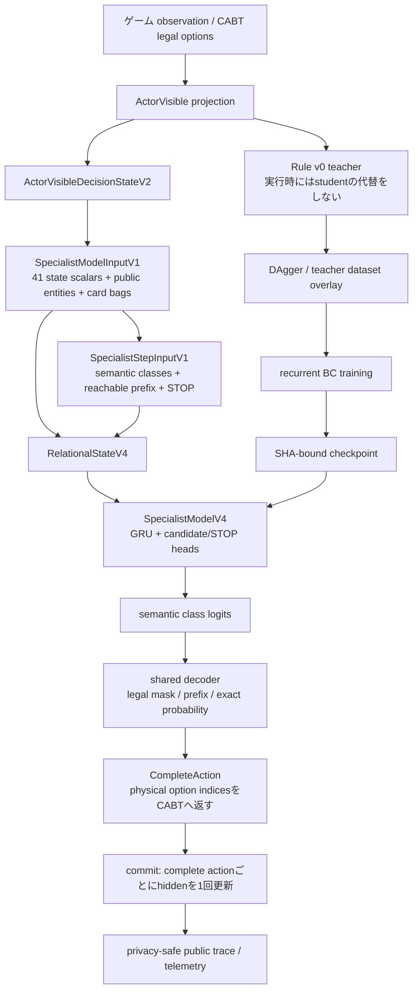

# GPT-5.6 Sol / Sol Pro 用コンテキストパック（2026-08-11）

このファイルは、ローカルリポジトリを参照できない外部の ChatGPT / Codex に、現状を一度で渡すための入力資料である。Git の正典そのものではなく、2026-08-11 時点の作業状況を圧縮せずに伝えるための非正典スナップショットである。数値や判定を再計算するときは、本文に明記した artifact identity・評価条件・seed・fault 条件を維持し、異なる実験を混ぜないこと。

## 外部モデルへの依頼文（このファイルを添付した後に使う）

あなたは、Pokemon TCG AI Battle の研究計画と実験設計を監査する独立 reviewer である。以下の資料だけをまず読み、ローカルファイルが存在すると仮定せず、本文にある根拠だけで判断してください。

求める出力は次の順です。

1. 現状を「順調」「性能面で停滞」「実装面で停滞」「危険な誤進行」のどれに分類するか。単一ラベルで決められない場合は、実装・性能・運用の3軸で分ける。
2. 最も重要なボトルネックを最大5件。各件について、観測事実、推測、反証可能な仮説、最小検証を分ける。
3. V4 Wave6 → DAgger Wave2 → targeted Wave3 の流れが合理的か。特に「balanced_v1 の +1.04ポイント」を長時間学習へ進めなかった判断、Kiyotah/Nihei/Ozawa の後手を狙う判断、現在の短期 gate の閾値を批判する。
4. 次に実行する実験を最大2本に絞る。各実験は目的、固定条件、必要 artifact、成功/失敗判定、期待情報利得、計算コスト、結果後の分岐を書く。単に「もっと学習する」は提案しない。
5. 既存の評価設計に、見落とされている交絡（seed、seat、opponent、engine、checkpoint identity、teacher quality、action-type、selection bias、private-information leakage）があるかを検査する。
6. DAggerを継続すべきか、V4表現・teacher・evaluation protocol・RL/criticへ戻るべきかを順位付けする。
7. 「今は実行してはいけないこと」を明記する（長時間学習、Champion変更、Kaggle提出、評価結果の混同など）。
8. 追加で必要な情報を、重要度順に最大10件だけ挙げる。情報がなくても判断できる項目は質問しない。

制約:

- 相手の非公開情報を使う案、Kaggle Replay を expert label として直接学習する案、fault を勝率分母から除く案は採用しない。
- `PROMOTION_READY` は次の実験へ進む機械判定であり、Champion変更・長時間学習・提出の自動許可ではない。
- NLL、teacher imitation、24局 screen、単一 seed、synthetic smoke のいずれも、単独では実戦強度の証明と扱わない。
- 既存の良い結果だけでなく、V-trace の悪化、再現性の揺れ、Wave2の不合格を同じ重さで検討する。
- コード変更は求めていない。まず診断と実験設計だけを返す。

---

## 1. 先に結論

### 1.1 これは完全な行き詰まりではないが、性能改善は明確に停滞気味

実装・データ・評価の基盤は、8月7日以前と比べて大きく前進している。V4 runtime、公開情報境界、recurrent sequence、teacher relabel、DAgger overlay、fixed held-out runner、promotion gate、fault provenance、SHA binding、progress artifact などは実装とテストが進み、明らかな欠陥を複数閉じた。

一方、実戦性能の改善は「V4 Wave6 が旧 V2 より強い」ことを除くと、現在の改善 arm で安定して再現できていない。Wave2 の一様 DAgger は基準を下回り、`balanced_v1` は基準をわずかに上回っただけで gate 未達、3/6 matchup で悪化した。したがって、状態は次のように表現するのが正確である。

| 軸 | 判定 | 根拠 |
|---|---|---|
| 実装・契約 | 前進 | V4の公開状態投影、recurrent BC、runtime adapter、DAgger、固定評価、SHA/fault契約が整備された |
| 性能 | 停滞気味／未確定 | Wave2 balanced は +1.04pt に留まり、3 matchup 悪化。長時間化根拠なし |
| 運用 | 注意が必要 | Wave3 progress は `running` だが、現PID namespaceではプロセスを確認できず、checkpoint/reportも未生成 |
| 提出 | 変更なし | Champion変更・commit・push・Kaggle提出はしていない |

結論として、**いま Sol xhigh または ChatGPT の Sol Pro に独立分析を入れる価値は高い**。ただし、長時間学習を代わりに開始するためではなく、現在の DAgger 方針、短期 gate、弱 matchup の解釈、V4表現への戻り条件を外部 reviewer に反証させるためである。

### 1.2 推奨するモデルの使い分け

2026-08-11 に公式 OpenAI Help を確認した範囲では、ChatGPTの GPT-5.6 Sol は Medium / High / Extra High の推論段階、Sol Pro は難しい課題・長時間ワークフロー向けの上位選択肢として説明されている。API側では `gpt-5.6-sol` と `reasoning.effort: xhigh`、Pro mode は `reasoning.mode: pro` として別軸で扱う。

- 第一段階: `gpt-5.6-sol` + `xhigh`（ChatGPT UIでは Sol / Extra High 相当）で、このファイルを使った実験監査と次の2本の実験の絞り込みを行う。
- 第二段階: 第一段階で判断が割れた場合だけ、同じ context pack と第一段階の回答を添えて `GPT-5.6 Sol Pro` で反証レビューを行う。
- いきなり複数モデルへ同じ質問を投げて多数決にはしない。目的、成功条件、固定条件、出力形式を固定し、判断が変わった理由を記録する。

公式参照（確認日 2026-08-11）:

- [GPT-5.6 in ChatGPT](https://help.openai.com/en/articles/20001354): Sol / Sol Pro の役割、reasoning level、availability、usage limits。
- [Model guidance](https://developers.openai.com/api/docs/guides/latest-model): `gpt-5.6-sol`、`xhigh`、`max`、Pro mode は同じ model/effort と比較するという考え方。
- [ChatGPT Rate Card](https://help.openai.com/en/articles/11481834-cha): Business/Enterprise系の目安で、SolとSol Proは同一ではない。契約プランの実際の上限・料金は UI の表示を優先する。

---

## 2. プロジェクトの目的と絶対条件

対象は Kaggle「The Pokemon Company - PTCG AI Battle Challenge Simulation」向けの合法な60枚デッキと、ゲーム状態に応じて合法な行動を返す AI agent である。現在の性能改善対象は Meta Specialist V4 の Archaludon lane である。

### 2.1 実行時の契約

- 実行時入力は公開ゲーム状態と現在の合法手だけ。
- 相手の手札、山札、賞品、デッキ順、serial locator、将来の乱数結果を入力へ混ぜない。
- CABT の合法手判定を hard truth とし、Rule / Playbook / Knowledge / neural prior は soft hint に留める。
- 1つの物理的な complete action につき recurrent hidden state を1回だけ進める。semantic prefix の各行を別 timestep にしない。
- multi-select / ordered-prefix は action-domain と prefix target を正しく扱い、重複 index、`minCount`/`maxCount` 違反、空選択の誤処理を fail-closed にする。
- 実行時に Rule v0 teacher を直接呼んで行動を代替しない。teacher は学習ラベル作成専用。

### 2.2 研究上の不変条件

- `Rule Agent v0` が現Champion。新しい学生 checkpoint は Promotion Gate を通るまで Champion にならない。
- 未完了学習、fault、timeout、non-DONE、SHA不一致、source closure不一致を成功扱いにしない。
- Kaggle Replay の行動を expert label として直接学習しない。
- Competition data の取得可否を C3/C4/C5 開始条件にしない。
- commit、push、Kaggle提出はユーザーが明示した時だけ行う。
- 既存 artifact を上書きせず、candidate/baseline/checkpoint/deck/opponent/evaluation protocol の identity を記録する。

---

## 3. 現在の作業状態（2026-08-11）

### 3.1 正典 status の最新内容

`docs/status/current_status.md` と `docs/status/handoff.md` の結論は一致している。

- `balanced_v1`: 192局で 100勝92敗（52.08%）。Wave6基準は 98勝94敗（51.04%）。差は +1.04ポイント。fault 0。
- seat 0: candidate 47/96、baseline 46/96（+1.04pt）。seat 1: candidate 53/96、baseline 52/96（+1.04pt）。
- matchup別: Kiyotah -15.6pt、Nihei -6.25pt、Ozawa -15.6pt、Skarin +6.25pt、Sue +15.6pt、Yaroslav +21.9pt。各 matchup 32局。
- 一様 DAgger: 96/192（50.00%）で、Wave6 98/192（51.04%）を -1.04pt。seed 0 は 52/96、seed 1 は 44/96。後手側の悪化が大きい。
- Wave2 は一様・balancedとも短期 gate 不通過。長時間学習は開始していない。
- Wave3 targeted DAgger は Wave6 seed 0 checkpoint を初期値に、Kiyotah/Nihei/Ozawa の後手を重点化、DAgger混合率0.3、`balanced_v1` action weight で起動済み。
- Champion変更・Kaggle提出は未実行。

### 3.2 Wave3 の観測可能な状態

現時点で確認できる `runs/meta-specialist-v4-archaludon-dagger-wave3-targeted-balanced/bc.progress.json` は次の値を持つ。

```json
{
  "epoch": 2,
  "epochs_requested": 3,
  "optimizer_updates_completed": 288,
  "optimizer_updates_in_epoch": 96,
  "sequences_completed": 96,
  "sequences_total": 96,
  "partial_train_complete_action_nll": 1.2191171874605378,
  "seed": 1,
  "stage": "training",
  "status": "running"
}
```

この時点ではWave3の最終 report、seed別 checkpoint、96局/192局の held-out比較は見えていない。progress の `status=running` は実行主体がそう書いた事実であり、現セッションのPID namespaceでプロセスが見えることを意味しない。実際、今回の確認では該当プロセスを `pgrep`/`ps` で確認できなかった。従って「完走した」「停止した」「失敗した」とは断定せず、起動元 host の terminal と artifact 出力を確認する必要がある。

### 3.3 現在のGit状態

- branch: `feature/belief-guided-search`
- HEAD: `30cade0e5d349d6ea545f019fc411e9d53288f16`
- status行数: 238（tracked modified 24、untracked 214相当）
- `git diff --stat`: 24 tracked files、3,284 insertions / 2,000 deletions。
- modified の中心: `deck.csv`、`current_status.md`、`handoff.md`、V4/Meta Specialist の actor pool、collector、dataset、neural model、trainer、progress、vtrace bridge、関連テスト。
- untracked の中心: V4 runner、DAgger、recurrent dataset/model、promotion gate、evaluation protocol、teacher quality、evidence、plan/spec、opponent materialization。
- この dirty state は一つの変更だけではなく、複数日分の研究実装・証拠・生成物を含む。今回の context pack 作成で既存差分を整形・削除・commitしない。

---

## 4. 実験の評価プロトコル

V4の主要比較は Archaludon deck、固定6 opponent、両 seat、同一 base seed、各候補2 seed、各96局を基本とする。ゲーム最大2,000 step。fault（rule violation、exception、timeout、non-DONE等）が1件でもあれば、その比較は採用根拠にしない。

### 4.1 短期 gate の実務条件

現行のDAgger系短期 gateは以下を目安とする。

- fault 0。
- candidate 2 seed が対応する Wave6 seed 以上。
- 192局併合でおおむね +5ポイント以上。
- どちらの seat も約 -3ポイントを超えて悪化しない。
- 6 matchup 中4以上で非悪化。
- END / EVOLVE / ATTACK の実質的な action metric が崩れない。DAgger promotion設計では EVOLVE/ATTACK/END を各 seed `0.60/0.60/0.50` 以上、STOP等の固定floor、complete-action/root 指標を要求する。

これは統計的有意性を保証する検定ではなく、長時間計算へ進むための安全な実務閾値である。差が小さく、相手・seat別に反転する場合は、良い総合勝率だけで昇格しない。

### 4.2 promotion gate と DAgger gate を混同しない

2026-08-11 の `v4-promotion-gate` は、V4 Wave6 と V2 baseline の別実験で `PROMOTION_READY` になった。これは V4 が V2 より強く、DAgger/次の研究 arm を開始する資格があるという意味であり、Wave2 balanced の短期 gate 合格や長時間学習許可とは別である。

---

## 5. 主要な実験結果（数値を混ぜないための整理）

### 5.1 旧 Meta Specialist v3 / recurrent route：実装は進んだが性能は未証明

2026-08-08 の v3 final report:

- representation v3、outcome critic、full-BC形式、trajectory provenance、fresh PPO / consume-once V-trace / AWR-CRR primitives、opponent schedule、fault/evaluation protocol、search/DAgger dataset、manifest を実装。
- focused tests、regression suite、bounded smoke は通過。
- Gate 1 representation は未通過、Gate 3 formal θ0 は smoke-only、Gate 7–9 は contract smoke、Gate 10–12 は未実施。
- GPUがOSにより遮断され、4,096局 promotion evaluation を実行できなかった。
- 判定は `DO NOT PROMOTE / 実装は継続可能`。

旧 bounded representation（各lane 128 records、seed 7、3 epoch、NLL低いほど良い）:

| lane | R2 | R3-A | R3-B | 解釈 |
|---|---:|---:|---:|---|
| Alakazam | 1.820462 | 1.852043 | 1.864900 | R3悪化 |
| Archaludon | 1.517733 | 1.482217 | 1.476455 | R3わずかに改善、top-1低下 |
| Grimmsnarl | 1.948337 | 2.020154 | 2.075685 | R3悪化 |
| Rocket | 2.079650 | 2.312241 | 2.367937 | R3悪化 |

R3 latency は R2 のおおむね3倍以上。少数slice・1 seed・carry未評価のため、R3一括採用の証拠ではない。

### 5.2 旧 V-trace RL：長く回すだけでは悪化を増幅した

2026-08-07〜08の記録から:

- t1: mirror相手1体で14 round。held-out 6 opponentでは4 lane全てがθ0未満。
- t2: weighted 96 opponentで6 round。4 lane合算はほぼ横ばい、Archaludonは0.375→0.297（-0.078）だった。
- t3: 4 lane、8 round、対策4件。収集スコア傾きは -0.0120/round から +0.0031/round へ反転したが、held-out勝率の改善は Alakazam に偏った。

t3 held-out 384局の要点:

- Alakazam: θ0 0.423 → 0.665（+0.241、p<0.001）。
- 残り3 lane合算: 0.374 → 0.364（-0.011、p=0.603）。
- Archaludon: 0.381 → 0.367（-0.014、p=0.671）。
- 4 lane合算 +0.054 は Alakazam 単独が作った数字で、「RLが全体に効いた」と要約してはいけない。

原因候補と是正:

- 学習相手と評価相手の分布が違った。mirrorだけの学習はheld-outへ転移しない。
- opponent poolに callable object / coverage / weighting の欠陥があり、完走不能相手や分布乖離を修正した。
- criticが楽観的で、value-returnの系統的なずれがあった。
- advantage normalization、opponent schedule、fault診断などを修正したが、改善はlane依存で再現性未確定。
- 同一 checkpoint・同一seedの評価でも0.302〜0.448に散ったため、96局1回を決定的再測定とみなさず、標本として扱った時期がある。この再現性問題は重要な未解決リスクである。

### 5.3 V4の runtime / recurrent 機構修正

性能以前に、以下の実装欠陥を修正した。

1. semantic prefix各行をGRU別 timestepにしていた問題を、物理record単位のhidden更新へ変更。
2. sequence lossのsumによる長いepisode・prefix過重化をrecord平均へ変更。
3. `reach_mass`を捨ててprefix CEを等重みにしていた問題を、`reach_mass * conditional_prefix_CE` へ修正。
4. 初期32-record設定が実episode（約59–71 records）より短く、complete episodeを収容できなかったため、episode/component coverage付きbounded subsetへ変更。
5. best validationを同じpositive signalへ再利用するselection biasを避け、固定1 epochのinitial→afterを一次判定へした。
6. actor pool、runtime adapter、private field redaction、large multi-select timeout、Prize projection mismatch、checkpoint source closureを修正・テスト。

corrected V4 1-epoch CPU pilot（学習に未使用のvalidation component）:

| lane | train/val records | seed | initial NLL | after NLL | delta |
|---|---:|---:|---:|---:|---:|
| Alakazam | 343/349 | 0 | 1.6564 | 1.5766 | -0.0798 |
| Alakazam | 343/349 | 1 | 1.7128 | 1.6480 | -0.0648 |
| Archaludon | 217/285 | 0 | 1.2416 | 1.2116 | -0.0300 |
| Archaludon | 217/285 | 1 | 1.2561 | 1.1998 | -0.0563 |

全4 cellでNLLは改善したが、seed0 checkpointの4局CABTは4敗。学習可能性の確認であり、強さの証拠ではない。

### 5.4 V4 GPU medium BC と Wave6

2026-08-10、RTX PRO 5000 Blackwell上で hidden 128 / embedding 64、各partition 32 episode/component、2 seed、3 epochを実行。NLLは大きく改善した。

| lane | seed | initial NLL | best NLL | delta | best epoch |
|---|---:|---:|---:|---:|---:|
| Alakazam | 0 | 1.6841 | 0.7068 | -0.9774 | 2 |
| Alakazam | 1 | 1.5942 | 0.7280 | -0.8662 | 2 |
| Archaludon | 0 | 1.2948 | 0.9773 | -0.3174 | 2 |
| Archaludon | 1 | 1.2728 | 0.9737 | -0.2991 | 2 |

Archaludon seed1の96局確認では V4 37勝59敗（0.385）、V2 24勝72敗（0.250）、fault 0。seat別V4 0.354/0.417、V2 0.292/0.208、6 matchup中4改善・1同率・1悪化だった。ただし engine seed を厳密にattestできず、paired比較とは呼ばない。これは次のdata/update budget拡大対象に選ぶ根拠であって、長時間学習の自動許可ではない。

Wave6固定評価（V4 vs V2、別の protocol identity）:

- V4 seed0: 45/96（0.46875）。
- V4 seed1: 44/96（0.45833）。
- V2 baseline独立seed0: 21/96（0.21875）。
- V2 baseline独立seed1: 22/96（0.22917）。
- seed差: +0.25000、+0.22917、平均 +0.23958。
- 6 matchup、4 seat cells、fault 0。
- imitation metrics: complete-action top1 0.80116/0.80179、root 0.79377/0.79607、STOP 0.89394/0.86364。
- action-type metricsも固定floorを上回り、機械判定は `PROMOTION_READY`。

ここでの `PROMOTION_READY` はV4を次の研究armへ進める許可で、Kaggle提出・Champion変更・長時間学習開始を意味しない。

### 5.5 Wave2 DAgger（最新の不合格）

DAggerの目的は、学生モデルが実戦で訪れる公開状態へ同じteacherでラベルを付け、teacher-only corpusとの分布ずれを減らすこと。実行時はteacherを使わない。

Wave1（過去の再ラベル）:

- 追加48局、2,643遷移、base dataと混合、3 epoch。
- 2候補合計 210/384（54.69%） vs Wave6 192/384（50.00%）で +4.69pt。
- 先手 +14.58pt、後手 -5.21pt。
- 合計改善は観測事実だが、後手悪化とseed揺れのため長時間学習を見送った。

Wave2 一様 DAgger:

- candidate 96/192（50.00%）、Wave6 98/192（51.04%）。差 -1.04pt。
- seed0 52/96、seed1 44/96。
- fault 0。
- seat0 52/96 vs 46/96、seat1 44/96 vs 52/96。先手改善・後手悪化。

Wave2 `balanced_v1`:

- candidate 100/192（52.08%）、Wave6 98/192（51.04%）。差 +1.04pt。
- seed0/seed1の公平比較は両方96局完走、fault 0。
- seat0 47/96 vs 46/96、seat1 53/96 vs 52/96。seat両方は正方向だが、差は1局。
- Kiyotah -15.6pt、Nihei -6.25pt、Ozawa -15.6pt。Skarin +6.25pt、Sue +15.6pt、Yaroslav +21.9pt。
- 6 matchup中3で明確に悪化。+5pt / 4 matchup非悪化の長時間 gateを満たさない。

このため「もう少し同じ設定で長く回せば上がる」とは判断していない。次は弱い matchup・後手へ実戦状態を追加収集する targeted Wave3 とした。

### 5.6 Wave3 targeted DAgger（未完了または外部host状態未確認）

- 初期値: Wave6 seed0 checkpoint。
- 対象: Kiyotah、Nihei、Ozawa の後手。
- DAgger混合率: 0.3。
- action weight: `balanced_v1`。
- 目的: Wave2で落ちた matchupを一様に再学習せず、後手・teacher/student差・END/EVOLVE/ATTACKを重点化。
- 出力root: `runs/meta-specialist-v4-archaludon-dagger-wave3-targeted-balanced/`。
- progress観測: epoch 2/3、288 updates、96/96 sequences、seed1、partial train complete-action NLL 1.219117、`status=running`。
- 最終 checkpoint、report、2 seed 96局比較は未確認。

---

## 6. データ・モデル・評価の構造

### 6.1 V4 sequence

各ゲームを1 episode/componentとし、SHA-256で train/validation をゲーム単位分離する。同一episodeを分割せず、episode overlap/near-duplicate overlapを0にする。recordには公開状態から作った model input、semantic legal action domain、ordered prefix、`reach_mass`、STOP target、episode boundaryを保存する。

full-corpus recurrent selection（2026-08-09）:

| lane | records | train | validation | components | episode overlap | near-duplicate overlap |
|---|---:|---:|---:|---:|---:|---:|
| Alakazam | 249,299 | 199,414 | 49,885 | 2,989 | 0 | 0 |
| Archaludon | 162,925 | 130,335 | 32,590 | 2,914 | 0 | 0 |

selection manifest SHA（短縮）: Alakazam `8093116b...`、Archaludon `b3044504...`。index SHA: Alakazam `563022ef...`、Archaludon `24c01225...`。

### 6.2 Teacher quality

既存 `quality_weight` を無条件に信頼せず、current-pool result、fault、policy/deck/version provenance、confidence/agreement/search strengthから再導出する方針。teacher-quality v2/v3のstreaming/materializerは実装されているが、承認済み rule digest がないため production trust set は空、必ず `AUTHORITY_GAP` になる状態が残る。DAggerは `research_only=true`、quality weight 1.0 の実験 overlayであり、teacher quality authorityではない。

### 6.3 評価とtrace

V4 held-out runnerは fixed-six、両seat、2 seed、96局を測り、candidate/baselineの deck SHA、opponent order/fingerprint、protocol SHA、checkpoint file/tensor SHAを封印する。privacy-safe public decision traceは opponent、seat、game index、decision index、selection type/context、count semantics、semantic action type、complete-action log probabilityを保存するが、private state、hand、prize、deck、option indexなどは保存しない。

2026-08-10 trace screenは seed0/seed1 各24局、各13/24、fault 0。trace rows 1,331 / 1,316。ただしruntime duplicate-public-identity aggregateがsemantic identityを保持しないため action_types が空であり、今後のcoarse semantic-operation multiset追加候補になっている。

### 6.4 Tiny overfit probe

tiny overfitは representation / projection / optimizerの接続不良を切り分ける `DIAGNOSTIC_ONLY`。train exact top-1が50 epoch以内に95%へ達しなければ、generalization以前のtarget alignment/domain/gradient問題を疑う。達しても対戦強度の根拠ではない。実GPU runは未実施、fixture契約テストは31 passed, 1 skipped。

---

## 7. これまでの重要な判断履歴

### 7.1 高位アーキテクチャの判断

- Rule Agent v0をChampionとして維持。学生が少し良く見えても自動昇格しない。
- critical pathは P0 → C1 → C2a/C2b → C3/C4 → C5。Competition Intelligence、Deck policy最適化、advanced solverは optional。
- CABT legalityをhard truth。学習 priorは候補順序付けに使い、legal actionを削除しない。
- ActorInformationViewへ相手非公開情報を含めない。Stable ActionKeyを全層の行動同一性にする。
- Kaggle Replayをexpert labelとして直接使わない。

### 7.2 失敗からの方針変更

- 検証損失だけが下がり、実戦勝率が下がるWave5/Wave6を受け、同じteacher-only BCを長く続けない。
- 行動種類の重み付けだけでは勝率改善が安定しなかったため、学生到達状態をteacherで再ラベルするDAggerへ移行。
- V-traceの過去runは、相手分布不一致、critic bias、engine/reproducibilityの交絡があり、いったん主経路から外した。
- model size/layer増加や探索導入より、データ境界・episode continuity・checkpoint identity・evaluation protocolを先に閉じる。
- 1回の良いscreenや1 seedの勝率ではなく、2 seed、seat、opponent、action-type、faultを同時に見る。

### 7.3 直近の判断

- Wave6 V4がV2より強いことは確認したが、Wave2 balancedの+1.04ptは長時間学習の根拠にしない。
- targeted Wave3を行う。失敗したら同一BCのepoch延長へ自動移行せず、追加収集・action trace・teacher/state表現の診断へ戻る。
- `PROMOTION_READY` を提出・Champion変更の許可と解釈しない。

---

## 8. 未解決リスク・反証ポイント

1. **Wave2の差が小さすぎる。** +1.04ptは192局で2勝差であり、計算コストを大きく増やす根拠として弱い。
2. **matchup trade-off。** Kiyotah/Nihei/Ozawaを改善したいが、Skarin/Sue/Yaroslavから得た利益を失う可能性がある。
3. **後手問題。** 一様DAggerでは後手が悪化。balancedでは両seatがわずかに改善したが、相手別には3悪化が残る。
4. **評価乱数とengine再現性。** 過去に同一checkpointでも評価値が散った。現在の固定protocolが十分に再現可能か、異なるrun世代の数値を混ぜていないかを検査する必要がある。
5. **checkpoint provenance。** 学習metricだけを別checkpointから持ち込めない。candidate held-out artifactとimitation metricのfile/tensor SHA一致が必要。
6. **NLLと実戦強度の乖離。** Wave5/Wave6、V4 GPU mediumでNLLは改善しても、Alakazam laneではV2に安定して勝てなかった。
7. **teacher authority gap。** DAgger teacherは研究用の安定ラベルであり、production teacher quality authorityが未完成。
8. **current progressのstale性。** `status=running` のまま process/checkpointが見えない可能性がある。再起動前に起動元 host で二重起動と出力 rootを確認する。
9. **dirty worktree。** 多数の未追跡/変更ファイルがあり、別作業の差分を上書き・整形・削除してはいけない。
10. **private-information境界。** trace拡張やteacher relabelの便利さのために、hidden fieldやserial locatorを保存する方向へ進んではいけない。

---

## 9. いま実行すべきでないこと

- Wave3の完走・artifact・2 seed比較を確認する前に、同じ設定の長時間学習を開始する。
- `balanced_v1` の +1.04ptだけを見て「改善は確定」と書く。
- V4 vs V2 の `PROMOTION_READY` を current DAgger candidate の昇格と混同する。
- stale `running` output rootを再利用して二重起動する。
- 24局 screenを192局/384局の確認へ置き換える。
- NLL・teacher imitation・収集時 returnだけで実戦強度を推定する。
- faulted gameを勝率分母から除外する。
- private state、hidden hand/prize/deck order、Kaggle Replay expert labelsを追加する。
- 現在の dirty worktreeをcommit/pushする、またはKaggleへ提出する。

---

## 10. 推奨する次の最短ゲート

### Gate A: Wave3の実行状態を閉じる（最優先、低コスト）

1. 起動元 hostで既存 process、GPU、出力 root、PIDを確認。
2. `bc.progress.json` の timestamp が進んでいるか確認。
3. seed0/seed1の学習 report、checkpoint file SHA/tensor SHA、source closure、deck/opponent/protocol identityを確認。
4. 完走していなければ再起動せず、fault/exception/timeout/last checkpointを保存。

### Gate B: Wave3を同一固定条件で screen → confirmation

1. 24局 screenは実行健全性・action metricの早期診断だけに使う。
2. 合格候補のみ、同一 Wave6基準・各seed96局・両seat・fixed-sixで192局 confirmation。
3. `+5pt`、両seat、4/6 matchup、END/EVOLVE/ATTACK、fault 0を同時に判定。
4. gate未達なら同じepoch延長をせず、悪化した matchup × seat × action traceへ戻る。

### Gate C: targeted DAgger自体を棄却する条件

- 2 seedともWave6未満、または片方だけ良い。
- Kiyotah/Nihei/Ozawaの改善が出ても、別matchupの大幅悪化で総合差が消える。
- action metricは改善してもCABTが改善しない。
- teacher/student disagreementが増えず、追加データが同じ状態の複製になる。
- fault、source identity、component split、private projectionのいずれかが閉じられない。

---

## 11. Sol / Sol Proに判断してほしい具体的な問い

1. Wave2 balancedの +1.04pt（100/192 vs 98/192）を、3 matchup悪化と合わせてどう解釈すべきか。統計的に弱いだけか、分布移動の明確な兆候か。
2. Kiyotah/Nihei/Ozawaの後手を重点化する targeted DAgger は、原因に対する介入になっているか。それとも単に評価poolへ過適合する危険が高いか。
3. `+5pt / 4 of 6 matchup / seat degradation` という gate は、現在の192局・6相手・2 seedに対して厳しすぎるか、逆に弱すぎるか。閾値を変える場合は、どの事前分布・損失を根拠にすべきか。
4. Wave6 V4がV2を大きく上回る一方、V4 DAggerの増分が小さい。この差は、V4表現がすでに限界に近いこと、teacher relabelの質が悪いこと、評価ノイズ、または action-level objectiveの問題のどれに整合するか。
5. END/EVOLVE/ATTACKの offline metric と matchup勝率のどちらを先に改善すべきか。action metricが勝率へ転移しない可能性をどう検定するか。
6. 過去V-traceの悪化を踏まえても、将来RLを再開する価値があるか。再開するなら、どの最小 pilot 条件が必要か。
7. teacher quality authorityが未完成のまま研究用DAggerを進めることの妥当性と、どの時点で authority closure を必須にすべきか。
8. current progressがstaleかもしれない状況で、再起動・待機・中止のどれが正しいか。判断に必要な最小観測は何か。

---

## 12. 参照すべきローカル正典（外部モデルには読めない前提）

外部モデルがローカルファイルへアクセスできる場合だけ、本文と次の文書を突き合わせる。アクセスできない場合は、本文にない主張を補わない。

### 現在の入口

- `docs/status/current_status.md`
- `docs/status/handoff.md`
- `docs/META_SPECIALIST_V3_LUNA_MAX_IMPLEMENTATION_EXPERIMENT_PLAN.md`
- `docs/evidence/v4-performance-history.md`
- `docs/evidence/v4-promotion-gate-20260811.md`

### 直近のV4実験

- `docs/evidence/performance-first-sprint-20260810.md`
- `docs/evidence/v4-wave2-archaludon-heldout-evaluation-protocol-20260810.md`
- `docs/evidence/v4-balanced-objective-design-20260810.md`
- `docs/evidence/v4-sealed-offline-imitation-metrics-20260810.md`
- `docs/evidence/v4-weak-matchup-action-trace-20260810.md`
- `docs/evidence/v4-tiny-overfit-probe-20260810.md`
- `docs/evidence/v4-longrun-independent-code-review-20260810.md`
- `docs/evidence/v4-runtime-adapter-20260810.md`
- `docs/evidence/v4-gpu-campaign-runner-20260810.md`
- `docs/superpowers/specs/2026-08-11-v4-dagger-improvement-design.md`

### 旧経路と失敗分析

- `docs/evidence/meta-specialist-v3-final-report.md`
- `docs/evidence/meta-specialist-recurrent-readiness-analysis-20260809.md`
- `docs/evidence/vtrace-no-progress-20260807.md`
- `docs/evidence/vtrace-rl-degrades-against-eval-pool-20260807.md`
- `docs/evidence/vtrace-learning-health-20260808.md`
- `docs/evidence/rl-round-cost-and-actor-faults-20260807.md`

### 一次 artifact の例

- V4 Wave6: `runs/meta-specialist-strength/v4-fixed-heldout-archaludon-wave6-seed0-10000000.json`、seed1相当。
- V2 baseline: `runs/meta-specialist-strength/v2-fixed-heldout-archaludon-seed10000000.json`、repeat相当。
- promotion gate: `runs/meta-specialist-strength/v4-promotion-gate-wave6-archaludon-independent-baseline.json`。
- DAgger Wave3 progress: `runs/meta-specialist-v4-archaludon-dagger-wave3-targeted-balanced/bc.progress.json`。

---

## 13. 最終判断の候補（reviewerへの依頼）

本文からの暫定判断は次の通りだが、独立モデルには反証してほしい。

- 「完全な行き詰まり」ではない。実装と測定器は改善している。
- 「性能改善は順調」とも言えない。Wave6以降の増分は小さく、Wave2 balancedは gate未達。
- いま必要なのは計算量の追加より、Wave3の完走状態を閉じ、同一条件で弱 matchupの targeted intervention が効くかを測ること。
- Sol xhighで一次分析を行うことは妥当。Sol Proは、その結果が実験継続・表現変更・RL復帰などの大きな分岐を残した場合の二次反証に使う。
- 長時間学習、Champion変更、Kaggle提出は、Wave3の2 seed confirmationとPromotion Gateを経るまで保留する。

このファイル自体は、提出物・モデル・認証情報を含まない。ローカルパスは再現性のために記載しているだけで、外部モデルが読めない場合の証拠にはならない。

---

## 14. コードレベルの設計・実装詳細（外部モデルがローカルコードを読めない場合の代替）

この章は、上の実験履歴だけでは分からない「何を入力とし、どの型へ変換し、どこで合法性を検証し、どの時点で recurrent state を更新し、どの artifact へ固定するか」を記述する。ここでいう V4 は、`src/mage_ptcg/meta_specialist/` の `*_v4.py` 群を中心とする現行経路である。v1/v3 のファイルも同じパッケージに残っているが、すべてが現在の提出経路で使われているわけではない。外部 reviewer は、V4 core、研究用 DAgger、旧 RL/critic 経路を混同しないこと。

### 14.1 実装の層と一方向のデータフロー

現在の設計は「生 observation をニューラルネットへ直接渡す」構成ではない。合法性・公開情報・行動同一性を先に型付き契約へ落とし、その後に特徴量、relational representation、モデル、CABT decoderを通す。



不変条件は次の通り。

- `ActorVisible` は相手の手札・山札・賞品の内容や順番を受け取らない。自分の手札や公開された選択肢は、actorが合法的に見られる範囲に限って保持する。
- CABTが返した合法手集合は削除・改変しない。学習モデルが高い logit を出しても、CABTに存在しない候補は返せない。
- physical option の並び順や local index は安定行動同一性ではない。semantic action を `Stable ActionKey` / digest で同定し、最後の alias 選択時だけ deterministic な lexicographic rule を適用する。
- multi-select の prefix は「複数行の独立意思決定」ではなく、ひとつの complete action の条件付き列である。GRU hidden state、episode loss、runtime commit は complete action 単位で扱う。
- checkpoint は単なる `state_dict` の pickle ではない。モデル schema、representation schema、実装 source closure、callable digest、file SHA、tensor SHAを結び付けた再現可能 artifact である。

### 14.2 `actor_visible_v2.py`: 公開情報境界と合法手の型

主な責務は、生の simulator/CABT record を actor-visible typed view に変換すること、選択肢の型と endpoint の意味を監査すること、シリアライズ後も private field が混入しないことを保証することである。

#### option type の固定表

`OPTION_RESOLVER_TABLE_V1` の option type は次の意味を持つ（番号は semantic operation の契約であり、任意に並べ替えない）。

| type | 意味 |
|---:|---|
| 0 | NUMBER |
| 1 | YES |
| 2 | NO |
| 3 | CARD |
| 4 | TOOL_CARD |
| 5 | ENERGY_CARD |
| 6 | ENERGY |
| 7 | PLAY |
| 8 | ATTACH |
| 9 | EVOLVE |
| 10 | ABILITY |
| 11 | DISCARD |
| 12 | RETREAT |
| 13 | ATTACK |
| 14 | END |
| 15 | SKILL |
| 16 | SPECIAL_CONDITION |

#### typed state

- `CardRefV2(card_id, serial, player_index)` は入力境界の物理参照。ただし serial locator は opponent hidden state を表す入力や永続 trace へ流してはいけない。
- `PokemonRefV2` は card identity と、legacy player-index extension の有無を保持する。
- `BoundCardRefV1` は legal endpoint の意味を解決した bound reference。
- `PokemonStateV2` は owner、HP/max HP、当ターン登場、energy counts/cards、tools、pre-evolution を持つ。これらは公開されている entity の snapshot としてのみ使う。
- `PlayerPublicStateV2` は active/bench、discard、hand count、deck count、prize count、bench max、status flag を持つ。相手側は count と公開 board だけで、個別 hidden card は持たない。
- `ActorVisibleSelectionViewV1` は selection context、effect、deck reveal、looking 状態を持つ。
- `ActorPrivateStateV2` は actor 自身の hand と、actorが合法的に見ている selection view に限定される。これは「自分の情報を全て学習へ入れる」という意味ではなく、実行時に見られる情報の境界を明示する型である。
- `ActorInformationViewV2` は actor、両 player の public state、actor private state、stadium、first player、observed result、step/turn/action count、remaining counters、selection fields を束ねる。

#### action binding と projection

`ActorVisibleBindingEndpointV1` は `resolution_kind`、owner、semantic zone、bound card、missing reason を持ち、未解決 endpoint を曖昧な既定値で埋めない。`ActorVisibleActionBindingCoreV1` と `ActorVisibleActionBindingV1` は、core、ActionKey digest、public action ID、local action ID を分ける。`ActorVisibleLegalActionV2` は legal action 一件、`ActorVisibleDecisionStateV2` は typed information view、legal actions、public collision groups を束ねる。

`build_actor_visible_decision_state_v2` と validate/serialize/deserialize は、raw observation を後段へそのまま保持しない。これにより、後で便利だからという理由で hidden field を特徴量や trace に再利用する経路を断つ。public collision group は複数の physical alias が同じ semantic operation を指す場合の監査用であり、alias multiplicityを勝率や semantic probabilityへ誤って掛けるためのものではない。

### 14.3 `actor_visible_features_v1.py`: 入力 schema と特徴量

schema 定数は `ACTOR_VISIBLE_FEATURE_DOMAIN_V1`、`CARD_VOCABULARY_SCHEMA_V1`、`MODEL_INPUT_SCHEMA_V1`、`STEP_INPUT_SCHEMA_V1`、`SEMANTIC_ACTION_SCHEMA_V1`。production vocabulary は sealed manifest から読み、test vocabulary で checkpoint を package できない。

#### state scalar（ちょうど41個）

順序は schema identity の一部で、意味を変えたり列を入れ替えたりしてはいけない。

```text
first_player_role, step, turn, turn_action_count,
selection_type, selection_context, min_count, max_count, option_count,
remain_damage_counter, remain_energy_cost,
stadium_played, supporter_played, energy_attached, retreated,
self_hand_count, self_deck_count, self_prize_count, self_discard_count,
opponent_hand_count, opponent_deck_count, opponent_prize_count, opponent_discard_count,
self_poisoned, self_burned, self_asleep, self_paralyzed, self_confused,
opponent_poisoned, opponent_burned, opponent_asleep, opponent_paralyzed, opponent_confused,
deck_reveal_available, looking_available, looking_hidden_count,
context_card_present, effect_present, stadium_present,
self_bench_max, opponent_bench_max
```

最初の3 scalar（`first_player_role`, `selection_type`, `selection_context`）は categorical index、残り38個は bounded continuous として扱う。step/turn/action count、selection bounds/candidate count、damage/energy counter、card count等に上限を置き、`log1p` と float32 化でスケールを抑える。上限を越えた値を黙って意味の違う値へ丸めるのではなく、schema validationで扱う。

#### public card/entity features

- single card ID: stadium、context、effect。
- card bags: `own_hand`、`deck_reveal`、`looking_visible`、`self_discard`、`opponent_discard`。
- Pokémon entity: owner role、zone、card id、HP/max HP、appear_this_turn、energy type counts（12種）、energy cards、tools、pre-evolution。
- candidate row: option type/operation、source/target/host semantic endpoint、number、attack ID、special condition、energy count、skill card ID、selection step、allowed alias count。
- card vocabulary mapping: `PAD=0`、`UNK=1`、official card ID `k` は `k+1`。最大カード数や候補数は feature contract の上限（card 60、candidate 512）であり、実行時に超過をランダム切り捨てしない。

主な型は `CollatedStateScalarsV1`（categorical 3 + float 38）、`CollatedCandidateRowsV1`（batch最大長までの ragged padding）、`CardVocabularyV1`、`CardBagV1`、`PokemonEntityV1`、`SemanticEndpointV1`、`SemanticActionV1`、`SpecialistModelInputV1`、`ExtractedSpecialistModelInputV1`、`SemanticActionClassV1`、`SpecialistStepInputV1`、`SpecialistStepLogitsV1`、`EvaluatedSpecialistStepV1`、`SemanticCompleteActionProbabilityV1`。

`build_specialist_step_input_v1` は、selection type/context/min/max を authoritative state から取り、CABT schemaを監査して ordered/unordered を決める。unordered prefix は canonical sorted、ordered prefix は選択順を保持する。複数 physical alias が同じ semantic rowへ束ねられる場合は `allowed_alias_count` を保持する。既に選択した class は候補 mask から外し、unreachable prefix、duplicate local ID、stale envelopeを許さない。`minCount` に達した後だけ STOPを合法にし、sole STOPしかない domainはモデルを呼ばずに決定できる。

### 14.4 `actions.py`: 完全行動の合法性と確率

`DecisionEnvelope` は CABT/DecisionStateから得た authoritative domainで、stable keys、option index map、min/max count、ordered/unordered semantics、selection context、public state/action-set digest、候補上限60、exact option countを固定する。

`CompleteAction` は bounds、unique key/index、unorderedのcanonical ascending、orderedのsequence preservation、stale envelopeを検証する。`resolve_order_semantics` は schema監査済みの順序 semanticsを返す。complete actionの列挙には STOPを含め、上限65,536を超える domainは fail-closed にする。

`complete_action_log_probability` は semantic prefixごとの autoregressive probabilityを正確に合成し、`complete_action_distribution` は合法な complete action上で正規化する。`greedy_decode` と `q_argmax` は用途別の deterministic decoder。semantic class probabilityは physical aliasの数を掛けてはいけない。最後に semantic choiceを決めた後、physical aliasは lexicographicに一つへ束ねる。この順序を逆にすると、同じ意味の行動が alias の数だけ有利になる。

### 14.5 `representation_v4.py`: exchangeable relational representation

V4 representationは fixed-width board vectorだけではなく、公開 entityと候補の関係を持つ。主な型は次の通り。

- `PublicEntityClassRefV4(visibility, owner_role, semantic_zone, card_id, host_card_id=0, pokemon_snapshot=())`: exchangeable aliasを意味クラスへ束ねる公開参照。pokemon snapshot（HP/max HP、当ターン登場、energy/tool/evolutionの公開状態）を含め、同じカード名でも状態が違う個体を区別する。
- `EntityTokenV4(entity_id, entity_type, owner, zone, card_id, host_entity_id, scalar_features, categorical_features, binary_flags, entity_class_ref)`: state-local entity token。
- `ActionCandidateV4(stable_action_id, action_type, source/target/host class refs, categorical_args, numeric_args, allowed_alias_count, selected_class_counts, selection_order_sensitive, selection_step, selectable_class_ref)`。
- `SemanticPrefixTokenV4(action_type,args,source/target/host/selectable class refs)`。
- `RelationalStateV4(state_scalars, entities, candidates, semantic_prefix=(), prefix_order_sensitive=False)`。

validationは finite value、state-local entity IDの一意性、host validity、candidate referenceの束縛、prefix referenceの束縛、unordered prefixのcanonical sortを検査する。canonical entity orderは entity_idを除外しており、exchangeable physical aliasの serial/order変更で表現が変わらない。serial locator自体は model inputのsemantic identityに使わない。

`stable_action_id_v4` は canonical action payloadのSHAから作る。`representation_v4_from_model_input_v1` は非autoregressive base stateを作り、candidate projectionでは caller-provided alias countを必須とする（1と仮定しない）。`representation_v4_from_step_input_v1` は reachable step、order semantics、prefix、allowed classを検証し、selected class countとcandidate classを構築する。`allow_unbound_selected=True` は runtime redactionなど限定用途だけで、hidden endpointを便利に通すための一般的な逃げ道ではない。

base entityには、public Pokémon、attached tool/energy/pre-evolution、stadium/context/effect、own hand/deck reveal/looking/discard、opponent discardなど、actor-visible model inputに現れるものを入れる。endpoint resolverは actor-visible/public-visibleだけを受け、hidden/unresolved endpointが必要になれば例外にする。

### 14.6 `neural_model_v4.py`: ネットワークの正確な構成

クラスは `SpecialistModelV4(nn.Module)`。主要引数は `card_vocabulary_size`、`hidden_dim=256`、`embedding_dim=192`、`seed=0`、`state_scalar_dim=41`。実験 runnerでは hidden 128 / embedding 64 の縮小構成も使うため、checkpointのmodel configを必ず読む。schema markerは `specialist-neural-model-v4` と `specialist-neural-checkpoint-v4`。

#### encoder/embedding

- card embedding: vocab+1、PAD=0。
- entity type embedding 32、owner embedding 3、zone embedding 32。
- feature value projection: sequence width 19（16 binary bits + position + width/kind相当）→ embedding → GELU → embedding。
- entity projection: 7系統の embeddingを連結 → hidden → GELU → LayerNorm。
- global projection: 41 state scalar → hidden → GELU → LayerNorm。
- action type embedding 64、selection step embedding 513、position embedding 512。
- count projection 4→hidden、argument projection 19→hidden、relation projection 2hidden→hidden、host-relation projection。
- prefix mix 6hidden→hidden、position relation、prefix count projection 4→hidden。
- candidate mix 8hidden→hidden→GELU→hidden→LayerNorm、candidate bias hidden→1。
- recurrent coreは `GRU(hidden, hidden, batch_first=True)`、STOPは `stop_vector` と `stop_bias`。

integer featureは16個のbinary bitとposition/width/kindを持ち、real featureは `x/(1+abs(x))` と位置/kindを使う。bag/entityの値は meanで消さず、sumで multiplicityを保持する。

#### forwardの意味

state encodingは canonical entity orderで tokenを作り、card/type/owner/zone embedding、categorical/scalar/binary sequence、host relationを合成する。global tokenはglobal scalar projection + entity token mean。class referenceの embeddingは交換可能な memberの mean pool。

prefix embeddingは class refs、action type、argumentsを合成し、ordered prefixだけposition relationを使う。unordered prefixでは順序を使わず、rowのsumと明示的なcount summaryで同じ意味の集合を表す。

candidate embeddingは source/target/host relation、action type、selection step、selected class embedding/count、cardinality、allowed alias count、selected count、total selected、argumentsを結合する。record headは `global_token = recurrent_token + prefix_embedding`、candidate logitは `candidate_bias(tanh(candidate + global))`。既選択 classは maskする。STOP logitは `stop_vector @ global + stop_bias`。

`forward_record_group_v4(states, hidden_state, episode_start)` は、一つの physical recordに属するprefix rowsをtupleで受け、同じ state scalars/entitiesを共有することを検証する。state encodeは1回、GRU transitionも1回だけ行い、同じ recurrent tokenで全prefixをscoreし、hiddenを返す。`forward_v4` は単一 state wrapper、`step_logits_v4` は一段の logits API。

`_seeded` は deterministic topologyを作るが、callerのglobal RNGを汚染しない。`load_state_dict` はkey set、shape、dtype、finite tensorを厳密に検証する。checkpoint saveはtmp+fsync+replaceのatomic write、loadはexpected file SHA/tensor SHA、live source closure、implementation/callable digestを確認する。v3のraw stateをv4へ黙って読み替えない。

### 14.7 `neural_policy_v4.py` と runtime adapter

policyはgameごとに新規 objectを作り、immutable loaded weightsだけ共有する。`SpecialistNeuralDecisionSessionV4` は固定 incoming GRU stateから一つの complete CABT actionを処理する。

1. `SpecialistModelInputV1` と `SpecialistStepInputV1` をV4 relational stateへ変換。
2. state encoding/reference/argument/candidate logitsをcache。candidate MLPはbatch vectorizeして速度を確保。
3. 最初のprefixでrecurrent transitionを1回だけ実行し、同じ action内の全prefixは同じ incoming recurrent stateを見る。
4. shared semantic/legal decoderがclass logits、STOP、legal mask、exact probabilityを使う。
5. 完全行動がcommitされたら hiddenを更新。abort時はcacheを破棄し、hiddenを進めない。

policy telemetryには checkpoint file SHA、checkpoint lineage SHA、candidate class `checkpointed_specialist`、model loaded、fallback counterが入る。`load_specialist_neural_policy_from_checkpoint_v4` は inference threadを最大2へ抑え、64hex hashを検証し、config hash-boundの exact modelを生成する。runtime側は semantic decoding、STOP、lexicographic alias、CABT option indexへの変換を担当し、neural policyは class-level logitだけを返す。

### 14.8 `runtime.py`: 1ゲームのライフサイクルと失敗時挙動

主な protocolは `SpecialistDecisionSessionV2`（commit/abort）、`SpecialistDecisionPolicyV2`（reset/begin_decision/policy_telemetry）、`StepLogitPolicyFactory`。`PolicyTelemetrySnapshot` は policy identity、candidate class、model loaded、checkpoint lineage、reason、fallback countを持つ。

`RuntimeConstraintManifest` は schema、Python/dependency、decision p95/p99/hard timeout、game timeout、peak RSS、trace capacity、constraint IDを frozen にする。`RuntimeDecisionTraceV2` は variant、policy identity、selection type/context/min/max、order semantics、selected count、complete-action log probability、candidate count/collision sizes、sealed public projection bytesだけを保存する。private/hidden key tree、duplicate key、unsafe projectionは拒否する。

`MetaSpecialistRuntime` は qualified deck/deck lock/vocabulary/policy/expected identity/constraintsを束ねる。fresh policy objectをgameごとに生成するため、前ゲームの hidden stateが次ゲームへ漏れない。decision deadlineを確認し、trace capacityとdropped trace countを追跡する。runtime sequenceは次の通り。

```text
observation
  -> ActorVisibleDecisionStateV2
  -> public feature/model input
  -> begin_decision
  -> V4 logits
  -> shared semantic/legal decoder
  -> CABT option indices
  -> complete action commit
  -> hidden stateを1回だけ更新
```

例外・illegal action・deadline超過・non-DONEは arbitrary random fallbackへ変換しない。fail-closedで fault provenanceを残す。traceには private hand/prize/deck/orderや物理option indexを保存しない。

### 14.9 `actor_pool_v1.py`: teacher収集とプロセス隔離

`ActorJobConfigV1` は job_id、archetype/deck、source commit、env seed/seat、behavior/opponent identity、epoch/lag/discount、max steps/timeouts、checkpoint file/tensor SHA、decoding mode/sampling seed、opponent deck、retry index、canonical identityを持つ。`derive_actor_job_id_v1` と `derive_game_sampling_seed_v1` は同じ入力から再現可能な identityを作る。

`run_one_actor_game_v1` はゲームを起動し、actor-visible transitionを収集する。結果は completed/faulted、transitions、fault、winner/outcome/steps、engine/opponent/deck identity、diagnosticを含む。transitionには model input、prefix steps、selected semantic action、behavior log probability、privacy-safe public traceがあり、private fieldは除外する。

`ActorPoolV1` の既定は「gameごとにfresh spawned process」（`persistent_worker=False`）。bounded process pool、timeout時のprocess-group kill、stdout/stderr bounded excerpt、retry metadata、worker exit code、atomic game recordを使う。persistent workerは明示的に有効化した場合だけで、worker側CUDAは禁じる/診断する。faultを勝敗へ黙って変換しない。

### 14.10 recurrent dataset v4: sealed selection と provenance

`RecurrentBCStepV4` は state、target_index、episode_group、quality_weight、model_input、step_input、target_masses、reach_mass、episode_start、component_id、partition、record_id、content_hash、research_onlyを持つ。target massesの合計は1、reach massは(0,1]、hash identityは整合、partitionはtrain/validation。productionでは quality weightは(0,1)で、ちょうど1.0を使う研究 overlayは `research_only=true` に限定する。

`RecurrentBCSequenceV4` は lane/episode/component/partition/steps/burn_in/research_onlyを持ち、全 stepが同じ authority boundaryと exact episode resetを共有する。`PreparedRecurrentLaneV4` は receipt path/hash/lane。

`prepare_sealed_recurrent_lane_v4` は selection manifest file SHA、teacher quality manifest file/SHA/status READY/theta0_allowed/no authority_gap、overlay row countとsource record、production vocabularyを検証する。全 authority recordをstreamし、physical episode trackerで episode continuityを確認し、quality overlayを ordinal/record/content hashでdisk-sort joinする。sidecarとreceiptはatomic、receipt自身のSHAも記録し、O_NOFOLLOW/no symlinkを要求する。

formal production readerは teacher-quality READY が必要。research bounded readerは同じ source qualificationを使うが promotion authorityを与えない。stream時はchunk hash、episode continuity、A→B→Aの混入、sidecar/partition、train/validation overlapを再確認する。

### 14.11 recurrent BC v4: objective、TBPTT、research-only制御

学習 modeは現在 `RESEARCH_ONLY_UNIFORM_WEIGHT`、`promotion_authority=False`。これは、現時点のbounded/DAgger実験を本番teacher authorityへ昇格させないための意図的な制約である。

`_record_groups` は一つの physical recordのprefix rowsをまとめ、最初の recordでだけ episode resetを行う。lossは semantic + STOP logitsに対する complete-action cross entropy。prefix rowの損失は `reach_mass * conditional_prefix_CE`、record lossはその和/record単位で集約する。`quality_weight` と optional action type weightを掛ける。balanced weight設定では、forced one-choice domainは hidden transitionを進めるが、policy loss/denominatorから除外できる。ただし forced countは診断へ残す。

validationはburn-inを除き、complete-action NLL、exact top1、root top1、positive STOP conditional NLL等を報告する。epochごとにdeterministic sequence shuffle、sequence単位のoptimizer step、`tbptt_steps` recordsごとのdetach、gradient clip、Adam、progress callbackを使う。

`train_recurrent_bc_v4` は research mode、partition/type、component overlap、canonical run config（mode/lr/TBPTT/clip/action weights/selected sequence SHA/trainer implementation SHA）を検証する。resumeはepoch boundaryだけで、last checkpointをatomicに保存する。best checkpointはvalidation NLLで選べるが、結果の `promotion_authority` はfalseのまま。学習後にstrict reloadして壊れたcheckpointを成功扱いしない。

`materialize_research_uniform_subset_v4` は complete episode/componentを選び、4–512 episode/componentのbounded range、manifest/index/source chunk/vocabularyを検証する。positive STOPを要求でき、full corpusをRAMへ持ち込まずにstreamする。過去の32-record capは、実episode約59–71 recordを切断していたため撤回された。

### 14.12 DAgger v4: targeted overlayの意味と限界

`dagger_v4.py` は captured `ActorTrajectoryTransitionV1` の model_input/step_inputだけを消費する。private stateを再構築しない。teacher logitsがfiniteかを検証し、forced sole STOPはteacher queryなしで `(1.0,)`。それ以外は teacher semantic logits（合法ならSTOPを含む）を stable softmaxに通す。

`prioritized_dagger_component_ids_v4` は opponent、seat、action type、behavior log probabilityをmetadataとしてスコアし、tieは最低mean behavior log prob。private dataを使わず deterministic。`relabel_transition_v4` は fresh teacher policyで各prefixを再ラベルし、`representation_v4_from_step_input_v1`、target mass、argmax tie lower index、reach_mass=1、quality=1、research_only=true、hashを生成する。

`merge_dagger_episode_sequences_v4` は同じゲームのprefixを連結し、先頭以外のepisode_startをclear。`mix_dagger_sequences_v4` は優先componentを先に、fraction [0,1)の episode/component-level deterministic mixing、重複componentなし、hash+seed shuffleを行う。DAggerはmodel topology、teacher authority、private input、Wave6 artifactを変更しない。つまり、「学生が実際に到達した公開状態の追加教師ラベル」であり、「teacherをruntimeへ戻すRL」ではない。

CLI上の主要な固定点は、`run_meta_specialist_v4_dagger_bc.py` の `--selection-manifest`/SHA、screen/transition pathとSHA、lane、init checkpoint file/tensor SHA、`--dagger-fraction`、`--focus-opponents`、`--focus-seats`、`--strict-focus-targets`、`--focus-action-types`、`--action-type-weights`、hidden 128、embedding 64、TBPTT 8、epoch 3、learning rate 3e-4、clip 1.0、deviceである。screenが `VALID`/fault0でなく、screen内 checkpoint bindingがinit checkpointと一致しない、または transition pathが違う場合は直ちに失敗する。

### 14.13 evaluation protocol v2/v3 と promotion gate

`IndependentEvaluationRecordV2` は arm/outcome/seat/opponent/canonical identity/record hash/engine_seed_supported/replay_verified/run/seed attestation/fault provenanceを持つ。V3では lane/training seed/policy role/artifact SHA/theta0 SHA/repetition/outcome/seat/opponent/canonical identity/hash/attestation/evidence kind/faultを追加する。

`PairedEvaluationRecordV2` は candidate/baseline outcome、ledger identity、record/state/action hash sequence、seat/opponentを持つ。faultまたはidentity mismatchがあれば `complete=false`。engine seedがサポートされない場合、paired deterministic inferenceを主張しない。独立評価は lane/seedごとにgroup化し、Wilson interval、bootstrap、seat/opponent stratificationを使う。

`v4_imitation_metrics.py` は同じclosed checkpoint上で complete-action NLL、exact top1、root top1、STOP、action-type macro、survival/forced-domainを測る。forced domain size 1はNLL/top1 denominatorから除外するが、countは残す。これにより「モデルが選べない一択を当てた」だけで高スコアになるのを防ぐ。

`v4_promotion_gate.py` は candidate 2 artifact、baseline 2 artifact、imitation JSONを読み、各ファイルとtensor SHAを検証する。identityは subject archetype/deck SHA、base seed、opponent order/fingerprint、games/seat/max steps、evaluation protocol SHA。要求は比較status valid、各96/96、fault0、両seedが対応baseline以上、平均delta ≥ +0.05、seat average nonnegative、4 seed×seat cell中3以上nonnegative、6 matchup中4以上nonnegative、単一matchup drop > -0.25、complete top1各≥.68/平均≥.70、root平均≥.71、STOP各≥.80、common action floor、EVOLVE/ATTACK/END 各 seed ≥.60/.60/.50。欠落、identity drift、fault、action metric欠落はNO_GO。`PROMOTION_READY` は「次 armを開始してよい」という機械判定であり、Champion、longrun、submissionの権限ではない。

### 14.14 実験 runner と成果物の役割

| script | 役割 | 重要な注意 |
|---|---|---|
| `run_meta_specialist_v4_bc.py` | sealed recurrent subset上のresearch BC | mode、manifest SHA、episodes/components、burn-in/TBPTT、hidden/embedding、deviceを固定。既定は研究用uniform weight |
| `run_meta_specialist_v4_dagger_screen.py` | checkpointの小規模CABT screenとtransition capture | 既定は fixed held-outの少数局。性能証明ではなく、実行健全性・trace・teacher/student到達状態収集 |
| `run_meta_specialist_v4_dagger_bc.py` | screen transitionをteacher relabelし、base sequenceとmixしてBC | screen、transition、init checkpointのSHA/identityを閉じる。focus条件が空なら意図と違う全体混合になり得る |
| `run_meta_specialist_v4_gpu_campaign.py` | lane別GPU training + seed別24局評価 | verified training/eval JSONがあれば再利用。24局はキャンペーンの早期比較で、192局gateへ置換しない |
| `run_meta_specialist_v4_longrun.py` | longrun orchestration | hidden 128/embedding 64、最大131072 records、512/128 component設定、games-per-seat既定8など。現時点ではWave2不合格のため自動開始しない |
| `measure_v4_checkpoint_strength.py` | checkpointとdeckをfixed-sixで評価 | default games-per-seat 4、max steps 2000、optional privacy-safe trace |
| `measure_v4_imitation_metrics.py` | sealed selectionとcheckpointのoffline metric | checkpoint file/tensor SHA、training report、model dimsをclosed binding |
| `evaluate_v4_promotion_gate.py` | candidate/baseline/imitationのmachine gate | 2 candidate + 2 baseline JSONを要求。出力がPROMOTION_READYでも外部提出はしない |
| `watch_v4_progress.py` / `watch_v4_dagger_progress.py` | progress JSON監視 | `status=running`だけではプロセス生存を証明しない。timestamp、checkpoint、report、host terminalを併確認 |
| `run_meta_specialist_v4_tiny_overfit_probe.py` | exact tiny fit診断 | `DIAGNOSTIC_ONLY`; 95% top1でも競技性能の根拠ではない |

### 14.15 現行V4 coreと旧/optional経路の境界

#### 現行の提出・研究core

`actor_visible_v2.py`、`actor_visible_features_v1.py`、`actions.py`、`representation_v4.py`、`neural_model_v4.py`、`neural_policy_v4.py`、`runtime.py`、`actor_pool_v1.py`、`recurrent_dataset_v4.py`、`recurrent_bc_v4.py`、`dagger_v4.py`、`evaluation_protocol_v2.py`、`v4_imitation_metrics.py`、`v4_promotion_gate.py`。これらが公開情報境界、stable action identity、semantic decoder、recurrent training、DAgger、evaluation identityを形成する。

#### supporting contract/collection/packaging

`cabt_json_contract_v1.py`、`cabt_legality_v1.py`、`card_vocabulary_registry_v1.py`、`collect_teacher_records_v1.py`、`collect_trajectories_v1.py`、`teacher_dataset_v1.py`、`trajectory_schema_v3.py`、`trajectory_targets_v3.py`、`dagger_dataset_v1.py`、`submission_privacy.py`、`package.py`、`entrypoint.py`、`decks.py`、`experiment_manifest_v1.py`、`fault_diagnostics_v1.py`、`progress_v1.py`、`worktree_guard_v1.py`。これらはデータ取得、デッキ lock、提出 package、fault/manifest/進捗の契約を担当する。

#### 旧・optional・未昇格経路

`representation_v3.py`、`neural_model_v1.py`/`v3.py`、`neural_policy_v1.py`、`bc_trainer_v3.py`、`critic_v3.py`、`critic_conditioning_v3.py`、`critic_warmup_v3.py`、`learner_ppo_recurrent_v1.py`、`learner_vtrace_online_v1.py`、`learner_awr_crr_v1.py`、`vtrace_v1.py`、`vtrace_bridge_v1.py`、`pimc_gate_v1.py`、`joint_optimization_v1.py`、`global_race_v1.py`、`search_teacher_v1.py` 等。実装やunit contractが存在しても、current Championやproduction authorityを意味しない。V-trace/criticの過去結果は「再開時に満たす条件を決めるための反証材料」であり、DAggerの代替として現在自動実行しない。

### 14.16 テストと検証の現状

`tests/meta_specialist/` には actor-visible、features、actions、CABT identity/legality、representation V3/V4、neural model/policy、recurrent dataset/BC、DAgger、actor pool、runtime privacy/CABT、evaluation protocol、imitation metrics、promotion gate、runner、package security、teacher quality、V-trace/critic等の契約テストがある。重要な既知の実行結果は次の通り。

- corrected tiny probe contract: 31 passed, 1 skipped。
- V4 trace helper/privacy: 2 passed。held-out runner: 3 passed。imitation: 3 passed。
- V4 GPU runner contract: 24 passed, 1 skipped。ただし、そのテスト自身はCUDA実行を保証しない。
- performance sprintの orchestration修正: 11 tests pass。
- 今回のcontext pack更新に対して `python scripts/docs/validate_docs.py` は `Validated 13 canonical documents.`、`git diff --check` はpass。

上記は「全テスト suite が現時点でpass」という意味ではない。今回の文書更新で全suiteは再実行していない。競技性能を主張するには、runnerのartifact、fault0、checkpoint identity、protocol identity、seat/opponent breakdownを別途確認する。

### 14.17 再現・監査のための最小コマンド

以下は概念的な再現入口であり、パス・SHA・GPU deviceを実際のartifactに置き換える。ChatGPT側で実行するコマンドではなく、Codex/ローカル側で証拠を閉じるためのメモである。

```bash
# 変更と文書構造
git status --short
git diff --check
PYTHONDONTWRITEBYTECODE=1 python scripts/docs/validate_docs.py

# progressはrunningだけでなく実体を確認する
python scripts/watch_v4_dagger_progress.py \
  --progress-path runs/meta-specialist-v4-archaludon-dagger-wave3-targeted-balanced/bc.progress.json

# checkpoint metric（実artifactのSHAを必ず併記）
python scripts/measure_v4_imitation_metrics.py \
  --selection-manifest <manifest.json> \
  --selection-manifest-sha256 <64hex> \
  --checkpoint <checkpoint.pt> \
  --checkpoint-file-sha256 <64hex> \
  --checkpoint-tensor-state-sha256 <64hex> \
  --output <imitation.json>

# fixed-six strength measurement
python scripts/measure_v4_checkpoint_strength.py \
  --checkpoint <checkpoint.pt> \
  --subject-deck-csv deck.csv \
  --subject-archetype-id archaludon \
  --games-per-seat 4 \
  --base-seed 9100000 \
  --max-steps 2000 \
  --output <strength.json>

# promotion gate（外部送信をしない純粋なJSON判定）
python scripts/evaluate_v4_promotion_gate.py \
  --candidate <candidate-seed0.json> <candidate-seed1.json> \
  --baseline <baseline-seed0.json> <baseline-seed1.json> \
  --imitation <imitation.json> \
  --output <gate.json>
```

このコマンド群は、missing manifest、SHA mismatch、stale output、engine seed未attest、faulted gameを成功結果へ変換しない。外部モデルが返す分析は、これらの gateを通す前の「仮説・計画」として扱う。

### 14.18 新しい reviewerが最初に作るべき mental model

1. これは「カードの最善手を直接予測する分類器」ではない。CABTが決めた合法な semantic action domainの上で、公開情報に条件付けた候補/STOP logitsをprefixごとに返す recurrent policyである。
2. V4の大きな改善は、まず teacher-only BCの勝率を直接上げたことではなく、公開情報境界、physical alias、multi-select、GRU更新単位、checkpoint/evaluation identityの欠陥を修正したことにある。
3. Wave6のV2比改善は「V4 routeが実戦で有望」という一次証拠。Wave2 DAggerの増分は別問題で、僅差・matchup trade-off・seat/seed差があるため、改善法の証明になっていない。
4. DAggerの targeted intervention は、原因仮説（学生が後手の弱い相手状態へ到達したときの teacher correction不足）を検証する実験であって、必ず勝率を上げる手段ではない。
5. `PROMOTION_READY`、offline NLL改善、teacher imitation top1、24局 screen、4局 pilotは、それぞれ異なるpostconditionを検証する。これらを足し合わせて「強いモデル」とは言わない。

### 14.19 ChatGPTへ渡すときの読み方と追加指示

このファイルを唯一の添付資料として渡した場合、ローカルパスは参照先の名前にすぎない。ファイルに書かれていないコード行、実験ログ、未記載のcheckpointを推測で補ってはいけない。分析出力には、必ず次を求める。

- 観測事実、設計上の意図、仮説、未確認事項、推奨実験を別見出しに分ける。
- 数値を再集計する場合、candidate/baseline、lane、seed、seat、opponent、games、base seed、engine seed attestation、artifact SHA、protocol identityを併記する。
- Wave6 vs V2、Wave2 uniform、Wave2 balanced、Wave3 progress、旧V-traceを一つの勝率系列として連結しない。
- 「追加の長時間学習」を提案する場合、先に何を反証し、どの最小観測で中止するかを書く。
- private-information leakage、alias multiplicity、forced domain、selection bias、stale progress、engine reproducibilityをレビュー対象から外さない。
- コード変更を提案する場合は、対象ファイル/関数、契約を変えない範囲、失敗再現、回帰テスト、artifact identityを列挙する。いきなり大規模リファクタを提案しない。

推奨する追加プロンプトは次の通り。

```text
添付Markdownだけを根拠に、まず「実装」「性能」「運用」の3軸を別々に判定してください。
不足情報は推測で埋めず、重要度順に最大10件だけ列挙してください。
次に、Wave3を待つ/中止する/再設計するための最小観測を、コスト順ではなく情報利得順に最大2実験へ圧縮してください。
各実験について、固定条件、成功基準、失敗基準、結果後の分岐、既存数値との混同防止策を書いてください。
最後に、この判断をCodexへ戻して実装検証するときに必要なファイルとコマンドを、最小集合で指定してください。
```

### 14.20 この資料の限界と更新規則

- このファイルは非正典の snapshot。実装を変更したら、まず正典 status/evidence/decisionを更新し、その後にこのpackを再生成・追記する。
- 生ログ全文、モデル重み、カード配布データ、認証情報、private stateは入れない。外部分析に必要な要点、再現コマンド、artifact path、SHA、未解決リスクを入れる。
- 数値には「測定」「推定」「未確認」を付ける。新しい結果が旧結果を上書きするのではなく、protocol identityの違う別行として追加する。
- ChatGPTで得た分析は、ローカルに戻してCodexが対象ファイル・テスト・artifactを照合するまで採用決定ではない。Sol Proの回答も同じ扱いで、モデル名や推論 effortは権限・証拠の代わりにならない。
- 更新後の `sha256sum docs/status/sol_analysis_context_2026-08-11.md` を会話へ報告し、ChatGPTへ再添付する版を明確にする。

---

## 14.21 2026-08-12 追加更新: strict disagreement / shadow 診断

この節は、2026-08-11 時点の記述を補正・更新する。旧結果と新結果を一つの時系列の勝率として足し合わせてはいけない。

### A. 今回の判定

- 実装面: strict disagreement 抽出、seed固有 paired provenance、frozen shadow manifest、shadow evaluator、artifact identity 保存まで前進。
- 性能面: 新規 strict-disagreement checkpoint は GPU unavailable のため未生成。既存 strict-paired checkpoint の shadow 診断は合計 +5.21pt だが、seed0 が -2.08pt、seed1 が +12.50ptで、少数局かつ seed 非対称。改善が再現した、または長時間学習へ進めるとは言わない。
- 運用面: 4本の shadow 評価は全て `comparison_status=valid`、fault 0。fixed-six とは別の pool であり、promotion gate の代替ではない。
- Champion / submission: Rule Agent v0 を維持。commit、push、Kaggle 提出は実行していない。

### B. strict disagreement の定義

対象は記録済みの公開 prefix chain である。各 transition について、学生が実際に選んだ semantic action を sealed legal domain の `student_index` に写像し、同じ `step_input` chain を Rule teacher で relabel した `teacher_index` と比較する。teacher が異なる action を選んだ後の counterfactual state は生成しない。

`eligible` は `disagreement`、任意の teacher target action type focus、任意の mean `behavior_log_probability` 上限の AND である。eligible transition が一つでもある game は全 transition を complete recurrent episode として採用する。forced sole STOP は teacher query を発生させず、forced-stop disagreement として数えない。

主な公開関数・CLI は次のとおり。

- `src/mage_ptcg/meta_specialist/dagger_v4.py::strict_disagreement_metadata_v4`
- `scripts/run_meta_specialist_v4_dagger_bc.py::build_dagger_sequences_with_strict_disagreement_v4`
- `--strict-disagreement-targets`
- `--strict-disagreement-action-types`
- `--strict-max-mean-behavior-log-probability`

paired seed runner は `_training_material_v4` で seed ごとの screen、transitions、初期 checkpoint、sequence、report を解決する。これは現行 runner で seed の末尾値を別 seedへ誤用しないための修正であり、既存 paired artifact を再生成したという意味ではない。

### C. Wave6 seed1 Screen の offline strict 抽出

入力 identity:

```text
screen: runs/meta-specialist-v4-archaludon-dagger-wave6-screen-seed1-v2/screen.json
screen SHA: aed7438628ffdcb4a4d0c11a844c6ddea4a75017be44912180e3f6dc90abf1f1
transitions: runs/meta-specialist-v4-archaludon-dagger-wave6-screen-seed1-v2/screen.transitions.jsonl
transitions SHA: 2e5438aec5e451d70c37593971b45965cd33950822423b1540fdaf56b3f27e26
lane: archaludon
games: 96
transition records: 5,590
teacher policy version: b89ca316191957b26e5afa37c6cd121f61ba43435724aa6b982b3b06b07ff6e
```

広い監査（action type / confidence filter なし）では、96/96 complete games に disagreement があり、disagreement / eligible transition は3,592、effective loss mass は3,707（non-forcedも3,707）。train 69 / validation 27、seat 0/1各48だった。詳細は `runs/meta-specialist-v4-strict-disagreement-wave6-seed1/broad-report.json` に保存した。

弱い macro-action に絞り、teacher target action types `9,13,14`、mean behavior log-probability `<= -0.2` を適用すると、91 complete games（train 65 / validation 26）、985 eligible transition、effective loss mass 985となった。詳細は `runs/meta-specialist-v4-strict-disagreement-wave6-seed1/action-9-13-14-threshold-m02.json` に保存した。これは新しい checkpoint の結果ではなく、既存 screen に対する offline relabel / selection report である。

### D. frozen shadow pool

fixed-six と identity を分けるため、次の6 IDを freeze した。

```text
aristophanivan_multiply
kiyotah_abomasnow
masamikobayashi_garchomp
naoto714_kangaskhan
naoto714_slowking
yaminh_agent
```

manifest は `runs/meta-specialist-v4-shadow-pool-20260812/shadow_pool_manifest.json`、SHA-256は `6ddaf3588bb22869a808fd75f84721b640dde6d75f665a11beb10f578af72107`。source `opponents/pool_manifest.json` SHA-256は `e0013cf31b3e6e24db54591faeef6f092b9ebf85247bd0e57598eb8d447f20ca`。selection は public、`smoke_ok=true`、`usage_boundary=local_eval_only`、fixed-six の canonical deck / policy との非一致、cohort 内 identity 一意性、freeze 時点の既存 V4 artifact にIDが現れないことを確認した。ただし freeze だけでは強度、汎化、fault 0、将来の bytes 不変を保証しない。

### E. shadow short evaluation

runner は `scripts/measure_v4_checkpoint_strength_shadow.py`。fixed-six evaluator は変更せず manifest 列挙の6相手だけを使う。subject は `opponents/public_archaludon_cinderace_r7/deck.csv`（SHA-256 `42165967b565dd42ec426ecccfe79bfa7d72aa8306590e149dface0ee8bd530e`）。両 seat、各 opponent×seat 4局、base seed `10100000`、max steps `2000`、protocol SHA `0f98f6996e960f1a179cf7e8c767e20150e5b1622ef4e74159bf5a61804492ba`。

| arm | checkpoint file SHA prefix | wins / 48 | score | faults |
|---|---|---:|---:|---:|
| Wave6 baseline seed0 | `9eb22970fb99` | 30 | 62.50% | 0 |
| Wave6 baseline seed1 | `5d137fd6e6b7` | 30 | 62.50% | 0 |
| existing strict-paired candidate seed0 | `8f014c776b1f` | 29 | 60.42% | 0 |
| existing strict-paired candidate seed1 | `ec08ace5fb25` | 36 | 75.00% | 0 |
| baseline total | — | 60/96 | 62.50% | 0 |
| candidate total | — | 65/96 | 67.71% | 0 |

候補差は seed0 -1/48（-2.08pt）、seed1 +6/48（+12.50pt）、合計 +5/96（+5.21pt）。同一 base seed と同じ pool を使うが、同一 game の勝敗差を pairwise に記録したものではない。4局/cell と少ないため、promotion gate の「安定した相手・seat 非悪化」を満たしたと判定しない。

artifact は次の4つである。

```text
runs/meta-specialist-v4-shadow-eval-20260812/baseline-seed0-48.json
runs/meta-specialist-v4-shadow-eval-20260812/baseline-seed1-48.json
runs/meta-specialist-v4-shadow-eval-20260812/strict-paired-seed0-48.json
runs/meta-specialist-v4-shadow-eval-20260812/strict-paired-seed1-48.json
```

各JSONには checkpoint file/tensor SHA、subject deck SHA、shadow manifest SHA、6相手の canonical deck/policy/source SHA、seat/opponent 内訳、fault reason、protocol SHA、evaluator implementation SHAを保存した。

### F. 既存 fixed-six strict-paired との区別

`runs/meta-specialist-v4-archaludon-dagger-wave4-strict-paired/` は別実験である。fixed-six、各相手×seat 8局、合計192局で、Wave6 baseline 93/192に対し strict-paired candidate 101/192（+4.17pt）。これは今回新規に学習した strict-disagreement armではなく、既存 focus-only strict paired checkpoint の結果である。今回の shadow 65/96 vs 60/96 は別 pool・4局/cellの診断であり、両者を一つの勝率系列に連結しない。

### G. 検証、環境制約、再開条件

関連テスト45件が pass。対象は `test_dagger_v4.py`、`test_run_meta_specialist_v4_dagger_bc.py`、`test_run_meta_specialist_v4_dagger_screen.py`、`test_measure_v4_checkpoint_strength.py`、`test_measure_v4_checkpoint_strength_shadow.py`。`py_compile`、`git diff --check`、`python scripts/docs/validate_docs.py`（13 canonical documents）も passした。

CUDAは利用不可（`torch.cuda.is_available()` false、NVML unavailable）。未実施なのは、action-type strict reportを使った2 seed BC学習、fresh checkpointのoffline metric、fixed-six 192局評価、shadow full evaluationである。GPUが戻った場合の最小順序は、(1) strict arm 2 seed学習、(2) validation/action-type gate、(3) fixed-six同条件192局、(4) frozen shadow同条件評価、(5) seed/seat/opponent非悪化の確認。長時間学習、Champion変更、Kaggle提出はこの順序より前に行わない。

### H. 外部 Sol / ChatGPT reviewer への追加依頼

この更新を含むpackを読んだ reviewerには、次を明確に区別して答えさせる。

1. 91 complete games / 985 eligible massというstrict selectionが過剰に広いか、action type・confidence filterが妥当か。
2. fixed-six +4.17pt と shadow +5.21pt が、seed反転・opponent pool差・4局/cellのselection noiseでどの程度説明できるか。
3. 新規 strict-disagreement checkpointを学習する価値があるか。その場合の最小 validation、対照 arm、停止条件は何か。
4. shadow poolをpromotional evidenceへ昇格させるために必要な局数、pairing、opponent/seat stratificationは何か。
5. 同じpublic chainのrelabeled targetでも残る selection bias、teacher quality、recurrent merge、behavior confidence threshold の交絡を列挙すること。

このpackだけを根拠にし、不明なローカル実装や未記載 checkpoint を推測で補わないこと。推奨・結論には該当 artifact path、SHA、protocol、seed、seat、opponent、fault条件を付けること。

---

## 14.22 2026-08-12 追補: GPU復旧とstrict preflight

通常Codex sandboxではbwrap境界からWSL2の`/dev/dxg`が不可視になり、`nvidia-smi`は`GPU access blocked by the operating system`、PyTorchは`torch.cuda.is_available()=False`となっていた。GPU/driver/PyTorchの故障ではない。sandbox外の承認済みread-only実行では RTX PRO 5000 Blackwell、driver 595.95、PyTorch 2.11.0+cu128、`torch.cuda.is_available()=True`、CUDA行列積と同期、V4 runnerの`_resolve_device("cuda:0")`を確認した。以後のGPU実験は同じsandbox外実行境界で起動する。

証拠: `docs/evidence/v4-gpu-access-recovery-20260812.md`。

以前はcomplete episode選択だけでloss maskがtrainerへ伝播していなかった。`RecurrentBCStepV4.supervision_weight`（既定1.0、`[0,1]`）を追加し、eligible disagreement prefixだけを1.0、同じepisodeの他prefixを0.0としてhidden context-onlyにした。train/evaluate/positive STOP metrics、selected objective hash、DAgger record hashもmaskを扱う。関連回帰テストは`60 passed, 1 skipped`。新規strict checkpointはまだ生成していない。

seed0/seed1 preflightの入力hashは、seed0 screen `9ad78bf31f41d307916b25d238544ea5060e0df9a8e16b5ca72a8e3977fc00e3`、transitions `2d9892855350ac99a085eb616489e65e995415e987ce7c2470e20cc27e08b0ce`、seed1 screen `aed7438628ffdcb4a4d0c11a844c6ddea4a75017be44912180e3f6dc90abf1f1`、transitions `2e5438aec5e451d70c37593971b45965cd33950822423b1540fdaf56b3f27e26`。

seed0は4,763 transition、broad disagreement prefix 3,076、screen全体non-forced mass 4,498、teacher-target-only `-0.2` mask mass 851（18.92%、88 games）。seed1は5,590 transition、3,707、5,357、985（18.39%、91 games）。対称filterは`-0.2`で867/990（target-only比+16/+5）、`-0.5`で106/110、`-1.0`で0/0。confusionはseed0がfalse negative 1,424 / false positive 32 / within-type 390 / unrelated 1,230、seed1が1,737 / 28 / 482 / 1,460。teacherは`UniformLegalPolicyFactory`で、eligible prefixのtop1 marginは0。teacher agreementはteacher correctnessの証明ではない。

詳細JSON: `runs/meta-specialist-v4-strict-disagreement-preflight-20260812.json`（SHA `3e1120066b8d42c5187ec1d65a23aac74d44b2034783eef2995c2ebb6cc321bf`）。

既存fixed-six strict-paired JSONからopponent別各16局とseat別各48局の周辺集計を取得した。opponent×seat joint ledgerは保存されていないため未取得として扱う。candidate−baselineは、seed0/seed1の順に、kiyotah_lucario `+2/+2`、sue124_alakazam `+2/-7`、skarin_dragapult `0/+3`、ozawa_crustle_v2 `-3/+3`、nihei_megalopunny `+3/0`、yaroslav_crustleaware_lucario `+3/0`。seat0は`+2/-2`、seat1は`+5/+3`。seed反転があるため+4.17ptを再現性の証拠と扱わない。

既存shadow-A（manifest SHA `6ddaf3588bb22869a808fd75f84721b640dde6d75f665a11beb10f578af72107`）はarm選択に使われたため development-external diagnostic とする。新規shadow-Bはmanifest SHA `27e43feecad8d66bc80c2f43c23e9276d42398bf3f47eeba2bc5914087c168e0`で、`biohack44_crustlecounter2`、`harukiharada_crustle`、`kiyotah_iono`、`naoto714_ursaluna`、`pilkwang_lucario_alakazam`、`prvsiyan_grimmsnarl`をfreezeした。fixed-six / shadow-A / shadow-B間のdeck/policy SHA重複、各`SOURCE.md`/`deck.csv`/`main.py`のSHA、freeze時点のV4 JSON/MarkdownへのID非出現を検証した。CABT、fault、速度、強度は未測定で、shadow-Bは外部診断へ温存する。

次の最小実験は、対応Wave6 seed0→seed0 overlay→candidate seed0、seed1→seed1 overlay→candidate seed1を固定budget（3 epoch、matched control付き）で実行すること。best-of-many選択はしない。両seed・両seat・opponent・fault・action metricsを確認し、strictがfocus-only control以上、seed反転が縮小、合計おおむね+5ptを満たした場合のみshadow-BでRule v0/Wave6/strictを比較する。失敗時はDAgger系列を打ち切りteacher quality/search teacherへ移る。longrun、Champion変更、Kaggle提出はまだ不可。

詳細 evidence: `docs/evidence/v4-strict-disagreement-preflight-20260812.md`。

## 14.23 2026-08-12 追補: 初回strict pilotのCUDA OOM

GPU復旧確認後、対応するWave6 seed0/seed1 screen/checkpoint、strict action types `9,13,14`、mean behavior log-probability `<= -0.2`、DAgger fraction `1/3`、3 epoch固定のbounded pilotを承認済みsandbox外で起動した。selection shardの検証・展開は完了したが、`run_meta_specialist_v4_dagger_bc.py:1359` のモデル`.to(cuda:0)`で `torch.AcceleratorError: CUDA error: out of memory`となった。`bc.json`、checkpoint、性能評価は生成されていない。

停止直前からpilot終了後にかけて`nvidia-smi`は`NVML: N/A`、PyTorchは`torch.cuda.is_available()=False` / `cudaGetDeviceCount(): invalid argument`を返した。同時刻に別ワークスペース `/home/bfe-lab-ono/av-suara` のPID 3474717が `run_gc_ena_spectral_policy.py --device cuda --steps 2000`で同じGPUを使用していた。別作業を壊さないため停止していない。したがって現時点の第一仮説はモデル容量不足ではなく、GPU共有中のCUDAコンテキスト／driver状態競合である。

証拠は`docs/evidence/v4-gpu-pilot-oom-20260812.md`。再開条件は、(1)別CUDAプロセスの終了を確認、(2)`nvidia-smi`とPyTorch CUDA smokeを再確認、(3)V4単独モデル転送・小batch forward、(4)同一条件pilotを別再試行ディレクトリで起動、(5)完走後のみmatched controlへ進むこと。longrun、Champion変更、提出は引き続き不可。

別プロセス終了後も `nvidia-smi` は`NVML: N/A`、PyTorchは`cudaGetDeviceCount(): invalid argument`を返し、kernel logには`dxgkio_query_adapter_info: Ioctl failed: -22`、`send_create_allocation failed ffffffb5`、`create_allocation: Ioctl failed: -75`が残った。GPU bridgeの再初期化（通常`wsl.exe --shutdown`）が必要な状態だが、全WSLプロセスを終了するためユーザー承認待ちである。

ユーザー承認後に`wsl.exe --shutdown`を実行したが、再起動後も`dxgvmb_send_open_adapter failed: -22`とPyTorchの`Found no NVIDIA driver on your system`が継続した。Windows側`C:\Windows\System32\nvidia-smi.exe -L`は`GPU is lost. Reboot the system to recover this GPU`を返したため、原因はWSLだけでなくWindowsホスト側のGPU lost状態まで進んでいる。ホスト再起動は全Windows/WSL作業を終了するので未実施、ユーザー承認待ち。再開順序はホスト再起動→WSL CUDA smoke→V4単独転送→pilot再試行である。

その後、Windows `Win32_OperatingSystem.LastBootUpTime` は`2026-08-10 13:48:41.500 +09:00`、直近Kernel-General起動イベントも`2026-08-10 13:48:42`であることを確認した。したがって、GPU異常後のWindowsホスト再起動は成立しておらず、WSL再起動だけが行われた可能性が高い。Windows側`nvidia-smi.exe`がなおGPU lostを返すことと整合する。
