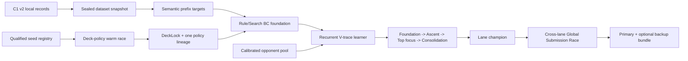

# Meta-Specialist Learning and Orchestration v1

> **Status:** Implementation authority for the new learner after the C1 v2
> foundation.  This plan supersedes any assumption that the legacy R2D3
> replay, action-index head, or checkpoint identity is a valid warm start.

## Outcome

For each registered lane, start from two or three qualified 60-card seeds,
select and lock one deck, train one continuous policy lineage through locally
calibrated ascent phases, and compare trained lane champions on one sealed
cross-lane schedule.  The output is one primary deck-policy bundle and at most
one backup.  Gold/Silver/Bronze remain source/curriculum provenance and never
become runtime switches.

The initial lanes remain:

1. `alakazam`
2. `grimmsnarl_froslass_munkidori`
3. `crustle_mega_kangaskhan`
4. `rocket_mewtwo_spidops`
5. `archaludon`

All currently inventoried seeds begin as `registered_unqualified`.  A valid
60-card multiset and known card IDs do not imply CABT legality, permission to
train, policy compatibility, or champion status.

## Non-negotiable boundaries

- One CABT callback decision is one complete action, one transition, and one
  recurrent commit.  Multi-select decisions are not dropped or converted to
  independent indices.
- `local_action_id`, `ActionKey.digest`, card serial, current CABT index, and
  private bindings can validate a local record but never become a model class,
  target, exported feature, checkpoint identity, or persistent trace.
- The only action target is the serial-free semantic class domain plus STOP
  produced by `build_specialist_step_input_v1`.  Private aliases are summed
  into their semantic class before loss construction.
- Training may use GPU and large parallel pools.  A submitted policy must run
  on two CPU vCPUs, inside the bundle/RAM limits, without GPU or network.
- Dataset, permissions, deck lock, feature schema, legality schema, recipe,
  code closure, and split identity are immutable parents of every checkpoint.
  Resume fails closed on any mismatch.
- A rank-band deck paired with a different policy is a proxy opponent, not a
  replay of the leaderboard team.  Source rank band and measured local
  strength band remain separate.
- The reproducible 2026-07-15 rank/deck snapshot is historical evidence.  No
  current exact Gold/Silver/Bronze share is assumed until a fresh census is
  sealed.

## Runtime choice: safe fallback and performance candidate

The existing `meta-specialist-runtime-constraints-v1` is the conservative,
stdlib-only fallback contract.  It is useful for a static-rule bundle and for
isolating correctness, but it must not silently constrain the best neural
candidate.

A separate `meta-specialist-neural-runtime-constraints-v2` may allow only
`torch` and `numpy` after all of these gates pass:

1. exact import/version evidence from the CABT validation image;
2. archive-only both-seat self-match in the same dependency image;
3. CPU-only inference with threads clamped to the two-vCPU budget;
4. p95/p99/hard-deadline and RSS gates over the final 100-game stress suite;
5. missing/wrong dependency fails before readiness and never falls back to a
   different policy under the same identity;
6. the Kaggle validation episode passes for that exact archive before it can
   replace the stdlib fallback.

Empirical motivation is recorded, not treated as an environment contract: the
public Grimmsnarl replay-hybrid asset corresponding to the reported 834.5
score imports both packages and carries a 3.9 MiB model.  Its local source
hashes are `main.py=9b369c7d26dfce6b5b5fb89c28eff7d9189b7287d646ae165c9bdbc08eeff5a1`,
`bc_agent.py=9d58027de1edaae597920b82631f4abca51b8462fb755ecbffb741ac3a8dc754`,
and `model.pt=2e5733afb26bef0842005dddd6ea142179b04f10c113786539b9e8f2fba145f1`.
This justifies testing a neural host contract; it does not pin the current host
versions or authorize loading that untrusted pickle into production.

## Architecture

### Model family

Use a variable-candidate actor/value model, not a global action-ID head:

- card token and frozen card-metadata embeddings;
- typed scalar/categorical encoders from `SpecialistModelInputV1`;
- DeepSets-style bag encoders for hand/reveal/looking/discard collections;
- shared Pokémon/entity and semantic-endpoint encoders;
- two small state-token attention blocks;
- a GRU recurrent core advanced once per committed complete decision;
- a semantic-prefix encoder and candidate cross-attention/bilinear scorer;
- one STOP score and one value head.

The first capacity envelope is card 96, entity/action 128, recurrent 256, four
attention heads, and two state blocks.  A smaller and a larger envelope are
screened under the same transitions and runtime export gate.  Width/depth is
increased only when held-out score improves and the final CPU latency/RSS gate
still passes.  Extra compute goes first to independent seeds, actors, teacher
rollouts, opponent cells, and evaluation precision rather than unmeasured
model growth.

The inference session computes the state backbone once per decision, caches
each distinct `(model_input_id, canonical_step_input_bytes)` result, and owns
the next recurrent token transactionally.  Training and runtime call the same
semantic legality primitive; neither creates a candidate-index vocabulary.

## Implementation slices

### Slice L1: sealed semantic training snapshot

Create:

- `src/mage_ptcg/meta_specialist/training_example_envelope_v2.py`
- `src/mage_ptcg/meta_specialist/training_snapshot_v1.py`
- `tests/meta_specialist/test_training_example_envelope_v2.py`
- `tests/meta_specialist/test_training_snapshot_v1.py`

First extend the sealed training-example boundary without returning the raw
local record.  Each yielded envelope carries only the serial-free model/loss
payload plus its already-hashed `record_id`, `episode_id_hash`,
`near_duplicate_id`, record-content hash, source/permission references,
manifest identity, and exact validated dataset-snapshot hash.  Those opaque
grouping hashes are required to construct leakage-safe components; deriving a
split from model features alone is not equivalent.  The source pathname is
never reopened after validation, and every yielded envelope is parsed from an
unlinked bounded spool or immutable canonical bytes.  Existing callers that
only need model/loss payloads use an explicit projection rather than receiving
raw provenance accidentally.

Then consume only those sealed envelopes.  Publish an immutable snapshot
containing record IDs, dataset/permission hashes, vocabulary and feature
hashes, grouped train/development/test components, and canonical semantic loss
rows.  Recompute `semantic_loss_rows_from_record_v2` before sealing the
envelope and reject any row that contains a private alias, local ID, serial,
raw index, unknown token, non-finite mass, or target mass differing from one.

Required tests cover alias mass summation, ordered SkillOrder, unordered
canonical prefixes, min/max, zero-option forced STOP, quality weight applied
once to the final row loss, component-disjoint grouped splits, tamper,
permission expiry/revocation, source replacement/growth, and byte-identical
publication.

### Slice L2: CPU mathematical oracle

Create:

- `src/mage_ptcg/meta_specialist/reference_losses_v1.py`
- `tests/meta_specialist/test_reference_losses_v1.py`

Implement stable log-softmax and weighted semantic cross-entropy over ragged
class+STOP domains in plain Python.  Exhaustively enumerate small private
complete-action distributions, push them forward, and prove that the product
of prefix probabilities reconstructs the original semantic complete-action
mass.  Forced STOP produces no trainable row.  Zero target classes contribute
zero without erasing support.

This oracle is the authority for PyTorch loss/gradient parity and is not the
production trainer.

### Slice L3: PyTorch model, ragged batcher, and deterministic checkpoint

Create:

- `src/mage_ptcg/meta_specialist/neural_model_v1.py`
- `src/mage_ptcg/meta_specialist/neural_batch_v1.py`
- `src/mage_ptcg/meta_specialist/neural_learner_v1.py`
- `src/mage_ptcg/meta_specialist/neural_checkpoint_v1.py`
- matching `tests/meta_specialist/test_neural_*_v1.py`

The batcher pads only to batch-local maxima and carries exact masks.  Fixed
fixtures must match the CPU oracle for forward loss and selected gradients.
Microbatch accumulation uses target-weighted sums, so OOM shrink/retry is
mathematically identical to the original batch.  Reject NaN/Inf before an
optimizer step.

Checkpoint v1 stores model, optimizer/scaler, scheduler, RNG states, sampler
cursor, recurrent recipe, topology, and one `training_identity`.  It never
loads legacy R2D3/Student checkpoints.  Save to an exclusive temporary file,
fsync, verify from a frozen snapshot, and publish content-addressed.  Resume
parity is tested against an uninterrupted run.

### Slice L4: deployable neural policy adapter

Create:

- `src/mage_ptcg/meta_specialist/neural_policy_v1.py`
- `src/mage_ptcg/meta_specialist/neural_export_v1.py`
- `tests/meta_specialist/test_neural_policy_v1.py`

Implement `SpecialistDecisionPolicyV2` without exposing the runtime envelope.
Load only a schema-checked tensor state dictionary or another non-executable
format; never `weights_only=False`.  Clamp CPU threads, set eval/inference
mode, disable CUDA, validate every tensor name/shape/dtype/finite value, and
recompute `policy_identity` from the exact exported bytes.

The stdlib fallback and neural candidate are different candidate classes and
identities.  Dependency absence never triggers a hidden policy substitution.

### Slice L5: actor trajectories and V-trace

Create:

- `src/mage_ptcg/meta_specialist/trajectory_v1.py`
- `src/mage_ptcg/meta_specialist/vtrace_v1.py`
- `src/mage_ptcg/meta_specialist/actor_pool_v1.py`
- `tests/meta_specialist/test_trajectory_v1.py`
- `tests/meta_specialist/test_vtrace_v1.py`
- `tests/meta_specialist/test_actor_pool_v1.py`

A trajectory stores serial-free model/step inputs, chosen semantic complete
action, masked behavior log-probability, value, terminal reward, discount,
subject behavior version, opponent instance/version, pool epoch, and policy
lag.  It groups semantic prefixes into one environment transition; decoder
prefixes never receive separate rewards or discounts.

Implement clipped IMPALA V-trace with a pure numerical oracle and PyTorch
parity.  Importance ratios correct subject behavior lag only, not an opponent
mixture change.  Old pool epochs are admitted only within the recipe's fixed
age window.  Policy/value/entropy/BC losses and all coefficients are explicit
in `AlgorithmRecipeManifest`.

Actor workers use `spawn`, one game/process by default, a frozen checkpoint
hash per job, one typed trajectory writer, bounded stdout/stderr, timeout and
process-group cleanup.  A persistent-worker fast path is disabled until it
passes repeated engine-identity tests.  Workers must not initialize CUDA.

### Slice L6: compute autotuning and orchestration

Create:

- `src/mage_ptcg/meta_specialist/compute_planner_v1.py`
- `src/mage_ptcg/meta_specialist/orchestrator_v1.py`
- `tests/meta_specialist/test_compute_planner_v1.py`
- `tests/meta_specialist/test_orchestrator_v1.py`

`--compute auto` records CPU threads, host RAM/commit headroom, GPU count,
VRAM, precision support, disk, actor throughput, learner throughput, queue
depth, RSS/FD, and failures.  It sweeps actor counts from a safe baseline and
rolls back when throughput falls, faults rise, or headroom is crossed.  The
locally observed eight-worker setting is only the first measured point; 12+
requires a host-memory soak.  Do not hard-code the old proxy's 20 actors.

Learner batch/microbatch sizes are swept on the new payload with at least 15%
VRAM reserve.  BF16, pinned memory, asynchronous transfer, and compilation are
enabled only after numerical and resume parity.  Multi-GPU data parallelism is
added after one-GPU correctness; world size, rank RNG streams, sample order,
and checkpoint topology are identity fields.  Data parallelism accelerates a
fixed recipe and does not silently increase its transition budget.

The orchestrator is a durable dependency graph of `collect -> train ->
evaluate -> promote`, with content-addressed inputs and idempotent task IDs.
It may parallelize independent lanes, seeds, teacher roots, and evaluation
cells.  It cannot mutate a DeckLock or resume a lineage with a different deck.

### Slice L7: opponent calibration and ascent curriculum

Create:

- `src/mage_ptcg/meta_specialist/calibration_v1.py`
- `src/mage_ptcg/meta_specialist/curriculum_v1.py`
- `tests/meta_specialist/test_calibration_v1.py`
- `tests/meta_specialist/test_curriculum_v1.py`

Calibrate every proxy against a fixed multi-policy reference panel using a
seat-balanced cross-play matrix.  Persist the matchup vector and interval;
assign `lower`, `middle`, `high`, or `ambiguous` only by pre-sealed rules.
Changing a deck, policy, reference panel, or calibration schedule creates a
new `pool_epoch`.

One lineage continues through `foundation`, `ascent`, `top_focus`, and
`consolidation`.  The initial mixture is the frozen table in the design spec;
past bands retain a nonzero rehearsal floor.  Run equal-transition controls
`static_all_band` and `staged_without_rehearsal` on the same exogenous pool.
Live Kaggle medal/rating is never an observation or phase trigger.

### Slice L8: deck-policy warm race and global selection

Create:

- `src/mage_ptcg/meta_specialist/joint_optimization_v1.py`
- `src/mage_ptcg/meta_specialist/global_race_v1.py`
- matching tests.

Before curriculum, compare all qualified seeds using the same FoundationInit,
opponent schedule, transitions, and training seeds.  Mutation cycles protect
core signatures, deduplicate exact multisets, include broad/random arms, and
retrain incumbent and challenger fairly.  Seal the winning DeckLock before
the ascent lineage starts.  A later mutation is a new branch and must repeat
the full curriculum and final suite.

Lane champions enter a candidate-independent, sealed, paired and seat-swapped
Global Submission Race.  Primary selection uses the high-strength result with
simultaneous non-inferiority safety in every strength band, zero logical
fault/illegal/timeout, and the pre-registered family-wise procedure.  Select
one primary and at most one backup; do not auto-submit.

## Teacher and algorithm gates

1. Start with compatibility-audited rule/checkpoint hard targets whose usage
   permission is explicit.  Use all valid decisions with source-calibrated,
   capped quality weights; do not discard losses by default.
2. Reproduce PIMC on a fresh paired schedule and hidden-information leak test.
   Search roots, distillation roots, and evaluation seeds are disjoint.  If
   either search-policy or student-distillation gate fails, use
   `rule_bc_vtrace`, not an `exit_vtrace` label.
3. On the first qualified primary lane, compare recurrent V-trace, recurrent
   PPO, and repaired complete-action R2D3 only after they share C1 v2 features,
   backbone envelope, opponent schedule, and transition budget.  In the
   critical path, a V-trace vs strongest-existing-baseline screen is enough;
   the full factorial is deferred.
4. Recipe choice uses the mean over three training seeds.  Checkpoint choice
   then uses a separate schedule.  The best single training seed cannot stand
   in for algorithm evidence.
5. Once an algorithm wins the fair screen, spend additional compute on its
   performance frontier.  Equal-budget evidence and maximum-performance runs
   are reported separately.

## Resource allocation

Initial critical-path allocation is adaptive:

- 40% to the best-evidenced primary lane after the short seed/warm race;
- 25% to the second lane;
- 15% to the third lane;
- 10% to teacher/search reproduction;
- 10% reserved for calibration, paired evaluation, failure recovery, and
  final confirmation.

The percentages are scheduling defaults, not training identities.  Reallocate
only from sealed development evidence, never final results.  Additional
hardware first increases parallel independent work and statistical precision.
Model size grows only when the capacity ablation and CPU export gate both win.

Every run separately budgets and reports environment transitions, teacher
simulator transitions, learner updates, sampled rows, maximum policy lag,
CPU-core hours, GPU hours, wall time, and failures.  This distinguishes faster
parallel execution from giving one algorithm more information.

## Acceptance gates before expensive runs

- Seed registry is 5 lanes x 3 candidates with exact source/materialization
  pins; each used seed has explicit permission and CABT qualification.
- The 936-record audit remains C1-valid 936/936, collision split 339/597,
  tail 61/64/67 accepted, and training examples 0.
- Training-snapshot tamper/TOCTOU/privacy tests pass.
- CPU oracle and PyTorch forward/loss/gradient tests pass.
- Checkpoint uninterrupted/resume parity passes.
- Runtime commits one complete action once and all trace variants remain
  private-safe.
- One end-to-end lane can collect, train, resume, evaluate, and package without
  importing a legacy R2D3 identity.
- Neural host-v2 and stdlib-v1 packages are separately identified and stress
  tested; neither silently substitutes for the other.
- No expensive five-lane run starts until calibration pool, development
  schedule, untouched final scenario bank, and compute budget are sealed.

## Deferred until the critical path is green

- full 5 lanes x 3 algorithms x 3 seeds factorial;
- persistent CABT workers or central GPU inference;
- multi-GPU model enlargement without data-parallel speed evidence;
- unrestricted deck mutation after DeckLock;
- live-ladder-driven curriculum or automated submissions;
- migration of legacy R2D3 replay/checkpoints into the new lineage;
- physical O6 deletion before its negative census evidence and remaining
  non-O6 imports have been migrated.
